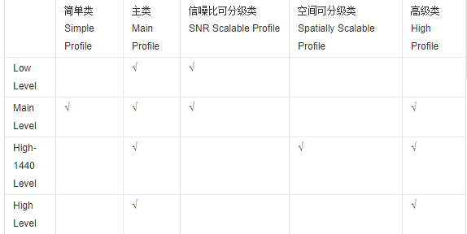
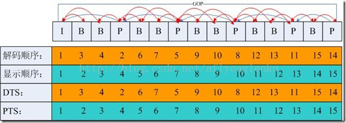
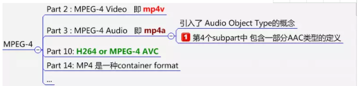
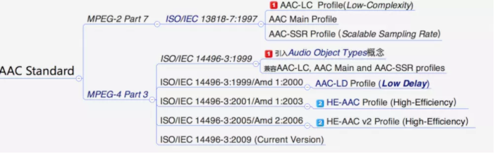

# 基础概念介绍
- [GOP（Group of picture）](#1)
- [CABAC / CAVLC 帧场编码](#2)
- [Deblocking / FORCE_IDR](#3)
- [frame/tff/bff](#4)
- [码流/码率](#5)
- [采样率](#6)
- [比特率](#7)
- [常见编码模式](#8)
- [帧速率](#9)
- [分辨率](#10)
- [高清视频](#11)
- [QP](#12)
- [PSNR](#13)
- [profile level](#14)
- [Reference](#15)
- [主码流/副码流](#16)
- [I帧P帧B帧](#17)
- [MPEG-4协议（ISO/IEC 14496标准）](#18)
- [PCR](#19)
- [数据冗余类型](#20)
- [视频压缩编码的基本技术](#21)
- [h261 h263标准 MPEG等其他标准](#22)
- [MPEG标准](#23)
- [关于H.264 x264 h264 AVC1之间的那些事](#24)
- [视频、音频时间戳](#25)


## <a id="1">GOP（Group of picture）</a>
两个IDR帧之间的距离。<font color=red>增加关键帧个数可改善质量，但是同时增加带宽和网络负载。</font>GOP=30，30FPS，即每个I帧之间相差1s。需要说明的是，通过提高GOP值来提高图像质量是有限度的，在遇到场景切换的情况时，H.264编码器会自动强制插入一个I帧，此时实际的GOP值被缩短了。另一方面，在一个GOP中，P、B帧是由I帧预测得到的，当I帧的图像质量比较差时，直到下一个GOP开始才有可能得以恢复，<font color=red>所以GOP值也不宜设置过大。过长的GOP还会影响Seek操作的响应速度，Seek操作需要先解码得到本GOP内的I帧及之前的N个预测帧才可以，GOP值越长，需要解码的预测帧就越多，seek响应的时间也越长。</font>

##  <a id="2">CABAC / CAVLC 帧场编码</a>
<font color=red>H.264/AVC标准中两种熵编码方法：CABAC叫自适应二进制算数编码，CAVLC叫前后自适应可变长度编码。其实就是帧编码和场编码。</font>
CABAC：是一种无损编码方式，画质好，X264就会舍弃一些较小的DCT系数，码率降低，可以将码率再降低10-15%（特别是在高码率情况下），会降低编码和解码的速速。
CAVLC：占用更少的CPU资源，但会影响压缩性能。
帧：当采样视频信号时，如果是通过逐行扫描，那么得到的信号就是一帧图像，通常帧频为25帧每秒（PAL制）、30帧每秒（NTSC制）；
场：当采样视频信号时，如果是通过隔行扫描（奇、偶数行），那么一帧图像就被分成了两场，通常场频为50Hz（PAL制）、60Hz（NTSC制）；
帧频、场频的由来：最早由于抗干扰和滤波技术的限制，电视图像的场频通常与电网频率（交流电）相一致，于是根据各地交流电频率不同就有了欧洲和中国等PAL制的50Hz和北美等NTSC制的60Hz，但是现在并没有这样的限制了，帧频可以和场频一样，或者场频可以更高。
<font color=red>帧编码、场编码方式：逐行视频帧内邻近行空间相关性较强，因此当活动量非常小或者静止的图像比较适宜采用帧编码方式；而场内相邻行之间的时间相关性较强，对运动量较大的运动图像则适宜采用场编码方式。</font>

## <a id="3">Deblocking / FORCE_IDR</a>
Deblocking：开启会减少块效应
FORCE_IDR：是否让每个I帧变成IDR帧，如果是IDR帧，支持随机访问。

## <a id="4">frame / tff / bff</a>
frame 将两场合并作为一帧进行编码
tff Enable interlaced mode (开启隔行编码并设置上半场在前)
bff Enable interlaced mode。
PAFF 和MBAFF：当对隔行扫描图像进行编码时，每帧包括两个场，由于两个场之间存在较大的扫描间隔，这样，对运动图像来说，帧中相邻两行之间的空间相关性相对于逐行扫描时就会减小，因此这时对两个场分别进行编码会更节省码流。
对帧来说，存在三种可选的编码方式：将两场合并作为一帧进行编码(frame 方式)或将两场分别编码(field 方式)或将两场合并起来作为一帧，但不同的是将帧中垂直相邻的两个宏块合并为宏块对进行编码；前两种称为PAFF 编码，对运动区域进行编码时field 方式有效，对非运区域编码时，由于相邻两行有较大的相关性，因而frame 方式会更有效。当图像同时存在运动区域和非运动区域时，在MB 层次上，对运动区域采取field 方式，对非运动区域采取frame 方式会更加有效，这种方式就称为MBAFF，预测的单位是宏块对。

## <a id="5">码流/码率</a>
<font color=red>码流(Data Rate)是指视频文件在单位时间内使用的数据流量，也叫码率或码流率，通俗就是取样率，画面质量控制中最重要的部分，一般是kb/s或者Mb/s。</font>一般来说同样分辨率下，视频文件的码流越大，压缩比就越小，画面质量就越高，说明单位时间内取样率越大，精度就越高，处理出来的文件就越接近原始文件，图像质量越好，要求播放设备的解码能力也越高。
　　<font color=red>当然，码流越大，文件体积也越大，其计算公式是文件体积=时间X码率/8。</font>例如，网络上常见的一部90分钟1Mbps码流的720P RMVB文件，其体积就=5400秒×1Mb/8=675MB。
　　通常来说，一个视频文件包括了画面及声音，而我们所说的一个视频文件码流率大小，一般是指视频文件中音频及视频信息码流率的总和。
以以国内最流行，大家最熟悉的RMVB视频文件为例，RMVB中的VB，指的是VBR，中文含义是可变比特率，表示RMVB采用的是动态编码的方式，把较高的采样率用于复杂的动态画面(歌舞、飞车、战争、动作等)，而把较低的采样率用于静态画面，达到画质与体积可兼得的效果。

## <a id="6">采样率</a>
<font color=red>采样率（也称为采样速度或者采样频率）定义了每秒从连续信号中提取并组成离散信号的采样个数，它用赫兹（Hz）来表示。采样率是指将模拟信号转换成数字信号时的采样频率，也就是单位时间内采样多少点。一个采样点数据有多少个比特。比特率是指每秒传送的比特(bit)数。单位为 bps(Bit Per Second)，比特率越高，传送的数据越大，音质越好.比特率 =采样率 x 采用位数 x声道数.</font>
采样率类似于动态影像的帧数，比如电影的采样率是24赫兹，PAL制式的采样率是25赫兹，NTSC制式的采样率是30赫兹。当我们把采样到的一个个静止画面再以采样率同样的速度回放时，看到的就是连续的画面。同样的道理，把以44.1kHZ采样率记录的CD以同样的速率播放时，就能听到连续的声音。显然，这个采样率越高，听到的声音和看到的图像就越连贯。当然，人的听觉和视觉器官能分辨的采样率是有限的，基本上高于44.1kHZ采样的声音，绝大部分人已经觉察不到其中的分别了。
而声音的位数就相当于画面的颜色数，表示每个取样的数据量，当然数据量越大，回放的声音越准确，不过受人的器官的机能限制，16位的声音和24位的画面基本已经是普通人类的极限了，更高位数就只能靠仪器才能分辨出来了。比如电话就是3kHZ取样的7位声音，而CD是44.1kHZ取样的16位声音，所以CD就比电话更清楚。
当你理解了以上这两个概念，比特率就很容易理解了。以电话为例，每秒3000次取样，每个取样是7比特，那么电话的比特率是21000。 而CD是每秒 44100次取样，两个声道，每个取样是13位PCM编码，所以CD的比特率是44100*2*13=1146600，也就是说CD每秒的数据量大约是 144KB，而一张CD的容量是74分等于4440秒，就是639360KB＝640MB。
码率和取样率最根本的差别就是码率是针对源文件来讲的。

## <a id="7">比特率</a>
<font color=red>比特率是指每秒传送的比特(bit)数。单位为bps(Bit Per Second)，比特率越高，传送的数据越大。在视频领域,比特率常翻译为码率 !!!</font>
比特率表示经过编码（压缩）后的音、视频数据每秒钟需要用多少个比特来表示，而比特就是二进制里面最小的单位，要么是0，要么是1。比特率就是比特率越高，音、视频的质量就越好，但编码后的文件就越大；如果比特率越少则情况刚好相反。
比特率是指数字声音、视频由模拟格式转化成数字格式的采样率，采样率越高，还原后的音质、画质就越好。

## <a id="8">常见编码模式</a>
VBR（Variable Bitrate）动态比特率 也就是没有固定的比特率，压缩软件在压缩时根据音频数据即时确定使用什么比特率，这是以质量为前提兼顾文件大小的方式，推荐编码模式；
ABR（Average Bitrate）平均比特率 是VBR的一种插值参数。LAME针对CBR不佳的文件体积比和VBR生成文件大小不定的特点独创了这种编码模式。ABR在指定的文件大小内，以每50帧（30帧约1秒）为一段，低频和不敏感频率使用相对低的流量，高频和大动态表现时使用高流量，可以做为VBR和CBR的一种折衷选择。
CBR（Constant Bitrate），常数比特率 指文件从头到尾都是一种位速率。相对于VBR和ABR来讲，它压缩出来的文件体积很大，而且音质相对于VBR和ABR不会有明显的提高。

## <a id="9">帧速率</a>
帧速率也称为FPS(Frames PerSecond)的缩写——帧/秒。是指每秒钟刷新的图片的帧数，也可以理解为图形处理器每秒钟能够刷新几次。越高的帧速率可以得到更流畅、更逼真的动画。每秒钟帧数(FPS)越多，所显示就会越流畅。

## <a id="10">分辨率</a>
帧大小每一帧就是一副图像。640*480分辨率的视频，建议视频的码速率设置在700以上，音频采样率44100就行了。
一个音频编码率为128Kbps，视频编码率为800Kbps的文件，其总编码率为928Kbps，意思是经过编码后的数据每秒钟需要用928K比特来表示。
<font color=red>计算输出文件大小公式：（音频编码率（KBit为单位）/8 +视频编码率（KBit为单位）/8）×影片总长度（秒为单位）=文件大小（MB为单位）。不同的编码需要不同的系统资源，大概可以认为是H.264>VC-1>MPEG2。</font>相对于MPEG2，VC-1的压缩比更高，但相对于H.264而言，编码解码的计算则要稍小一些，一般来说，VC-1多为 “.wmv”后缀，但这都不是绝对的，具体的编码格式还是要通过软件来查询。
总的来说，从压缩比上来看，H.264的压缩比率更高一些，也就是同样的视频，通过H.264编码算法压出来的视频容量要比VC-1的更小，但是VC-1 格式的视频在解码计算方面则更小一些，一般通过高性能的CPU就可以很流畅的观看高清视频。相信这也是目前NVIDIA Geforce 8系列显卡不能完全解码VC-1视频的主要原因。

## <a id="11">高清视频</a>
目前的高清视频编码格式主要有H.264、VC-1、MPEG-2、MPEG-4、DivX、XviD、WMA-HD以及X264。
事实上，现在网络上流传的高清视频主要以两类文件的方式存在：一类是经过MPEG-2标准压缩，以tp和ts为后缀的视频流文件;一类是经过WMV-HD(Windows Media Video HighDefinition)标准压缩过的wmv文件，还有少数文件后缀为avi或mpg，其性质与wmv是一样的。真正效果好的高清视频更多地以H.264与VC-1这两种主流的编码格式流传。一般来说，H.264格式以“.avi”、“.mkv”以及“.ts”封装比较常见。

## <a id="12">QP</a>
介于0~31之间，值越小，量化越精细，图像质量就越高，而产生的码流也越长。

## <a id="13">PSNR</a>
允许计算峰值信噪比(PSNR,Peak signal-to-noise ratio),编码结束后在屏幕上显示PSNR计算结果。开启与否与输出的视频质量无关，关闭后会带来微小的速度提升。

## <a id="14">profile level</a>
MPEG-2按压缩比大小的不同分成五个档次（profile），每一个档次又按图像清晰度的不同分成四种图像格式，或称为级别（level）。五个档次四种级别共有20种组合，但实际应用中有些组合不太可能出现，较常用的是11种组合（下表中标识“√”的项）。这11种组合分别应用在不同的场合，如MP@ML。
分别是BP、EP、MP、HP：


- 1、BP-Baseline Profile：基本画质。支持I/P 帧，只支持无交错（Progressive）和CAVLC；
- 2、EP-Extended profile：进阶画质。支持I/P/B/SP/SI 帧，只支持无交错（Progressive）和CAVLC；
- 3、MP-Main profile：主流画质。提供I/P/B 帧，支持无交错（Progressive）和交错（Interlaced），也支持CAVLC 和CABAC 的支持；
- 4、HP-High profile：高级画质。在main Profile 的基础上增加了8x8内部预测、自定义量化、无损视频编码和更多的YUV 格式；
H.264规定了三种档次，每个档次支持一组特定的编码功能，并支持一类特定的应用。
1）基本档次：利用I片和P片支持帧内和帧间编码，支持利用基于上下文的自适应的变长编码进行的熵编码（CAVLC）。主要用于可视电话、会议电视、无线通信等实时视频通信；
2）主要档次：支持隔行视频，采用B片的帧间编码和采用加权预测的帧内编码；支持利用基于上下文的自适应的算术编码（CABAC）。主要用于数字广播电视与数字视频存储；
3）扩展档次：支持码流之间有效的切换（SP和SI片）、改进误码性能（数据分割），但不支持隔行视频和CABAC。主要用于网络的视频流，如视频点播。

## <a id="15">Reference</a>
Reference：指两个P帧之间的距离。

## <a id="16">主码流/副码流</a>
主码流/副码流：主码流位率高，图像质量高，便于本地存储；副码流位率低，图像质量低，便于网络传输。

## <a id="17"> I帧P帧B帧</a>


- I frame ：帧内编码帧 又称intra picture，I 帧通常是每个 GOP（MPEG 所使用的一种视频压缩技术）的第一个帧，经过适度地压缩，做为随机访问的参考点，可以当成图象。I帧可以看成是一个图像经过压缩后的产物。
- P frame: 前向预测编码帧 又称predictive-frame，通过充分将低于图像序列中前面已编码帧的时间冗余信息来压缩传输数据量的编码图像，也叫预测帧；
- B frame: 双向预测内插编码帧 又称bi-directional interpolated prediction frame，既考虑与源图像序列前面已编码帧，也顾及源图像序列后面已编码帧之间的时间冗余信息来压缩传输数据量的编码图像，也叫双向预测帧；
PTS：Presentation Time Stamp。PTS主要用于度量解码后的视频帧什么时候被显示出来
DTS：Decode Time Stamp。DTS主要是标识读入内存中的bit流在什么时候开始送入解码器中进行解码。
<font color=red>在没有B帧存在的情况下DTS的顺序和PTS的顺序应该是一样的。</font>
I frame:自身可以通过视频解压算法解压成一张单独的完整的图片。
P frame：需要参考其前面的一个I frame 或者P frame来生成一张完整的图片。
B frame:则要参考其前一个I或者P帧及其后面的一个P帧来生成一张完整的图片。


如上图：I frame 的解码不依赖于任何的其它的帧.而p frame的解码则依赖于其前面的I frame或者P frame。B frame的解码则依赖于其前的最近的一个I frame或者P frame 及其后的最近的一个P frame。
对于I帧则PTS=DTS，P帧的PTS > DTS，B帧PTS < DTS。当然这里的大于和小于是相对BP帧而言。时间戳小则意味着先解码或者先显示，值越大意味着后处理。

## <a id="18">MPEG-4协议（ISO/IEC 14496标准）</a>
MPEG-4是个协议簇，包含了多个协议。

MPEG-4中只是定义了一部分AAC类型，AAC主要包括MPEG-2 AAC和MPEG-4 AAC, 详细如下图:

<font color=red>可以看出MPEG-4中只是定义了一部分类型的AAC.
MP4V在MPEG-4 的第2部分MPEG-4 Video中定义。
AVC在MPEG-4 的第10部分H264 or MPEG-4 AVC定义。
另:  MP4A在MPEG-4的第三部分MPEG-4 Audio中定义。与MP4V相比，AVC具备更高的压缩效率。MP4V是原始视频数据。
MP4V-ES是RTP数据, 可通过RTP协议进行传输。</font>

ISO/IEC 14496是MPEG专家组制定的MPEG-4标准，分为多个部分（仍在更新）。
参考：https://en.wikipedia.org/wiki/Category:ISO/IEC_14496
第一部分（ISO/IEC 14496-1）：系统：描述视频和音频数据流的控制、同步以及混合方式（即混流Multiplexing，简写为MUX）。  
第二部分（ISO/IEC 14496-2）：视频：定义一个对各种视觉信息（包括自然视频、静止纹理、计算机合成图形等等）的编解码器。（例如XviD编码就属于MPEG-4 Part 2）  
第三部分（ISO/IEC 14496-3）：音频：定义一个对各种音频信号进行编码的编解码器的集合。包括高级音频编码（Advanced Audio Coding，缩写为AAC）的若干变形和其他一些音频/语音编码工具。  
第四部分（ISO/IEC 14496-4）：一致性：定义对本标准其他的部分进行一致性测试的程序。  
第五部分（ISO/IEC 14496-5）：参考软件：提供用于演示功能和说明本标准其他部分功能的软件。  
第六部分（ISO/IEC 14496-6）：多媒体传输集成框架（DMIF for Delivery Multimedia Integration Framework）  
第七部分（ISO/IEC 14496-7）：优化的参考软件：提供对实现进行优化的例子（这里的实现指的是第五部分）。  
第八部分（ISO/IEC 14496-8）：在IP网络上传输：定义在IP网络上传输MPEG-4内容的方式。  
第九部分（ISO/IEC 14496-9）：参考硬件：提供用于演示怎样在硬件上实现本标准其他部分功能的硬件设计方案。  
第十部分（ISO/IEC 14496-10）：高级视频编码或称高级视频编码（Advanced Video Coding，缩写为AVC）：定义一个视频编解码器（codec）。AVC和XviD都属于MPEG-4编码，但由于AVC属于MPEG-4 Part 10，在技术特性上比属于MPEG-4 Part2的XviD要先进。另外，它和ITU-T H.264标准是一致的，故又称为H.264。  
第十二部分（ISO/IEC 14496-12）：基于ISO的媒体文件格式：定义一个存储媒体内容的文件格式。  
第十三部分（ISO/IEC 14496-13）：知识产权管理和保护（IPMP for Intellectual Property Management and Protection）拓展。  
第十四部分（ISO/IEC 14496-14）：MPEG-4文件格式：定义基于第十二部分的用于存储MPEG-4内容的视频文件格式。  
第十五部分（ISO/IEC 14496-15）：AVC文件格式：定义基于第十二部分的用于存储第十部分的视频内容的文件格式。  
第十六部分（ISO/IEC 14496-16）：动画框架扩展（AFX : Animation Framework eXtension）。  
第十七部分（ISO/IEC 14496-17）：同步文本字幕格式。  
第十八部分（ISO/IEC 14496-18）：字体压缩和流式传输（针对开放字体格式Open Font Format）。  
第十九部分（ISO/IEC 14496-19）：合成材质流（Synthesized Texture Stream）。  
第二十部分（ISO/IEC 14496-20）：简单场景表示（LASeR for Lightweight Scene Representation。  
第二十一部分（ISO/IEC 14496-21）：用于描绘（Rendering）的MPEG-J拓展。  
第二十二部分（ISO/IEC 14496-22）：开放字体格式（Open Font Format）。  
第二十三部分（ISO/IEC 14496-23）：符号化音乐表示（Symbolic Music Representation）。  
第二十四部分（ISO/IEC 14496-24）：音频与系统交互作用（Audio and systems interaction）。  
第二十五部分（ISO/IEC 14496-25）：3D图形压缩模型（3D Graphics Compression Model）。  
第二十六部分（ISO/IEC 14496-26）：音频一致性检查：定义测试音频数据与ISO/IEC 14496-3是否一致的方法（Audio conformance）。  
第二十七部分（ISO/IEC 14496-27）：3D图形一致性检查：定义测试3D图形数据与ISO/IEC 14496-11:2005, ISO/IEC 14496-16:2006, ISO/IEC 14496-21:2006,和ISO/IEC 14496-25:2009是否一致的方法（3D Graphics conformance）。  

MP4是在“ISO/IEC 14496-14”标准文件中定义的一种多媒体容器格式，它是MPEG4 （ISO/IEC 14496）标准的一部分。是“ISO/IEC 14496-12(MPEG-4 Part 12 ISO base media file format)”标准中所定义的媒体格式的一种实现。

## <a id="19">PCR</a>
PCR 仅仅在实时播出流中才有意义（即前端编码器实时编码或视频服务器实时播出，后端机顶盒实时接收的情况），对DVD机这类从文件中取TS流的设备PCR毫无意义。
前端编码器工作原理：编码器中有一个27M的时钟，编码过程中不断读取硬件时钟放入TS中PCR字段，和PES的PTS，DTS字段。
后端机顶盒工作原理：机顶盒中也有一个27M的时钟，它根据PES中的PTS，DTS字段中指示的时间进行解码和显示。那么TS中的PCR还有什么用呢？首先如果前端编码器的时钟与后端机顶盒中时钟"绝对"同步，那么TS中的PCR就没有任何意义了。但是如果"绝对"变对"相对"以后会出先什么情况？它们之间的"微小"误差经过长时间的累积（1-2小时就足以）机顶盒中解码器会因为自己时钟"快"了而造成buffer中没有数据--停帧，会因为时钟"慢"了而造成buffer中数据溢出--丢帧。所对它需要TS中的PCR字段来不断修正自己时钟与编码器时钟间的"微小"误差。
TS流在经过复用器，加扰机这些中间设备时，PCR"必须"进行"非均匀"延迟修正（原因如上）。所以对于没有PCR修正功能的复用器和加扰机，建设大家一定不要买。
为什么说TS流中的PCR对DVD机毫无意义呢？DVD机是从光盘中读取TS流，读盘速度与TS流传送速率毫无关联，PCR还有指示时间的意义吗？但因为它不是"实时流"传送，所以不会出现buffer溢出的问题，也就不会产生停丢帧现象。

## <a id="20">数据冗余类型</a>
主要类型有：
时间冗余：视频相邻的两帧之间内容相似，存在运动关系
空间冗余：视频的某一帧内部的相邻像素存在相似性
编码冗余：视频中不同数据出现的概率不同
视觉冗余：观众的视觉系统对视频中不同的部分敏感度不同

## <a id="21">视频压缩编码的基本技术</a>
为了专门处理视频信息中的多种冗余，视频压缩编码采用了多种技术来提高视频的压缩比率。其中常见的有预测编码、变换编码和熵编码等。
1. 预测编码
预测编码可以用于处理视频中的时间和空间域的冗余。视频处理中的预测编码主要分为两大类：帧内预测和帧间预测。
帧内预测：预测值与实际值位于同一帧内，用于消除图像的空间冗余；帧内预测的特点是压缩率相对较低，然而可以独立解码，不依赖其他帧的数据；通常视频中的关键帧都采用帧内预测。
帧间预测：帧间预测的实际值位于当前帧，预测值位于参考帧，用于消除图像的时间冗余；帧间预测的压缩率高于帧内预测，然而不能独立解码，必须在获取参考帧数据之后才能重建当前帧。
通常在视频码流中，I帧全部使用帧内编码，P帧/B帧中的数据可能使用帧内或者帧间编码。
2. 变换编码
目前主流的视频编码算法均属于有损编码，通过对视频造成有限而可以容忍的损失，获取相对更高的编码效率。而造成信息损失的部分即在于变换量化这一部分。在进行量化之前，首先需要将图像信息从空间域通过变换编码变换至频域，并计算其变换系数供后续的编码。
在视频编码算法中通常使用正交变换进行变换编码，常用的正交变换方法有：离散余弦变换(DCT)、离散正弦变换(DST)、K-L变换等。
3. 熵编码
视频编码中的熵编码方法主要用于消除视频信息中的统计冗余。由于信源中每一个符号出现的概率并不一致，这就导致使用同样长度的码字表示所有的符号会造成浪费。通过熵编码，针对不同的语法元素分配不同长度的码元，可以有效消除视频信息中由于符号概率导致的冗余。
在视频编码算法中常用的熵编码方法有变长编码和算术编码等，具体来说主要有上下文自适应的变长编码(CAVLC)和上下文自适应的二进制算术编码(CABAC)。

## <a id="22">h261 h263标准 MPEG等其他标准</a>
H.261码流复合器输出的码流，总共可以分为四层，从上到下分别为帧层、块组层、宏块层和块层。每一层按照不同的封装格式包含了头信息和下一层的结构。
帧层：由帧首和块组数据构成；帧首包括帧起始码（ PSC）、帧计数码（ TR）、帧类型（ PTYPE）等；  
块组层：由块组首和宏块数据组成；块组首包括组起始码（ GBSC）、块组编号码（ GN）、块组量化步长等；  
宏块层(Macroblock,MB)：由宏块首和块数据构成；宏块首包括宏块地址码、宏块类型、宏块量化步长、运动矢量数据、编码模式等；  
块层：包括每个8×8块的DCT系数按之字形扫描后的熵编码码流，以块结束符结尾

H.263是相对于H.261的改进标准，同样以低码率视频通信为目标，但是具有更好的压缩效率。与H.261相比，H.263支持更多种分辨率的图像格式：
Sub-QCIF: 128×96  
QCIF: 176×144  
CIF:352×288  
4CIF:704×576  
16CIF:1480×1152  
MPEG-1是国际标准化组织ISO下属的移动图像专家组负责制定的早期视频压缩标准，主要用于视频信息的存储、广播电视和网络传输应用。其中在VCD中保存的视频信息便使用MPEG-1标准进行压缩，其码率越为1.2~1.5Mb/s。MPEG-1标准所支持的图像类型与H.263类似，支持I、B、P帧类型。在码流的结构上，MPEG-1采用了与H.261类似的分层码流结构。MPEG-1相比于H.261增加了条带层，每一个宏块所有的编码操作只能在一个条带内实现，条带层可以有效防止编码错误在一帧内扩散。  
MPEG-2标准是ITU-T和ISO合作制定的编码标准，其视频部分也称作H.262标准，其标准编号为ISO-13818。ISO-13818是一系列标准的集合，包括了系统、视频、音频、一致性、参考软件等10个部分。另一方面，MPEG-2根据不同的编码工具定义了5个Profile：简单SP、主要MP、SNR可分级SNP、空间可分级SSP和高级HP。根据视频分辨率的不同定义了4个Level：低级LL、主级ML、高-1440级High1440和高级HL。MPEG-2的码流分为三层：
基本流：ES，由视频编码的视频基本流和音频编码的音频基本流构成
打包基本流：PES，为音视频ES分别打包传输流、节目流：TS/PS，若干个PES进行复用后输出，分别用于传输和存储在MPEG-2的ES流层中，其码流结构采用了类似MPEG-1码流结构的分层封装的方法：  
图像序列层：包括若干GOP，序列头包含起始码和序列参数等；  
图像组（GOP）层：包括若干图像，GOP头包括起始码、GOP标识等；  
图像层：包括若干个Slice，图像头中包括起始码和图像参数等；  
片（Slice）层：最小的同步单位，包括若干宏块，Slice头中包括起始码、片地址、量化步长等信息；  
宏块（Macroblock）层：由4个亮度块和2个色度块组成，宏块头包括地址、类型、MV等信息
MPEG-4是ISO与1999年颁布的视频编码标准。同前任的MPEG-1和MPEG-2相比，MPEG-4更注重多媒体系统的交互性、灵活性和可扩展性。MPEG-4的标准编号为ISO-14496。MPEG-4中最为显著的特点是采用了基于对象的编码。在MPEG-4中，一个视频对象主要定义为画面中分割出来的不同物体，每个物体由三类信息描述：运动信息、轮廓信息和纹理信息。MPEG-4通过编码这三类信息来实现对视频对象的编码。  

## <a id="23">MPEG标准</a>
MPEG标准主要有以下五个，MPEG-1、MPEG-2、MPEG-4、MPEG-7及MPEG-21等。MPEG标准的视频压缩编码技术主要利用了具有运动补偿的帧间压缩编码技术以减小时间冗余度，利用DCT技术以减小图像的空间冗余度，利用熵编码则在信息表示方面减小了统计冗余度。这几种技术的综合运用，大大增强了压缩性能。
MPEG-1  1992
MPEG-1层1 数字盒式录音带
MPEG-1层2DAB,VCD
MPEG-1层3 Internet,MP3音乐

MPEG-1 audio layer 1
384kbps  压缩率4:1
MUSICAM(MPEG-1 audio layer 2，即MP2)
频宽：256～192kbps
压缩率8:1--6:1
MP3(MPEG-1 audio layer 3)
128～112kbps
压缩率12:1--10:1

MPEG-1  1994
包括编号为13818-1系统部分、编号为13818-2的视频部分、编号为13818-3的音频部分及编号为13818-4的符合性测试部分。MPEG-2编码标准希望囊括数字电视、图像通信各领域的编码标准，MPEG-2按压缩比大小的不同分成五个档次（profile），每一个档次又按图像清晰度的不同分成四种图像格式，或称为级别（level）。五个档次四种级别共有20种组合，但实际应用中有些组合不太可能出现，较常用的是11种组合（下表中标识“√”的项）。
简单类Simple Profile
主类Main Profile
信噪比可分级类SNR Scalable Profile
空间可分级类Spatially Scalable Profile
高级类High Profile

LowLevel√√
Main Level√√√
High-1440 Level√√√
High Level√√

MPEG-4  1998
它不仅针对一定比特率下的视频、音频编码，更加注重多媒体系统的交互性和灵活性。这个标准主要应用于视像电话、视像电子邮件等，对传输速率要求较低，在4800－6400bits/s之间，分辨率为176*144。MPEG-4利用很窄的带宽，通过帧重建技术、数据压缩，以求用最少的数据获得最佳的图像质量。利用MPEG-4的高压缩率和高的图像还原质量可以把DVD里面的MPEG-2视频文件转换为体积更小的视频文件。经过这样处理，图像的视频质量下降不大但体积却可缩小几倍，可以很方便地用CD-ROM来保存DVD上面的节目。另外，MPEG-4在家庭摄影录像、网络实时影像播放也大有用武之地

MPEG-7
MPEG-7（它的由来是1+2+4=7，因为没有MPEG-3、MPEG-5、MPEG-6）于1996年10月开始研究。确切来讲，MPEG－7并不是一种压缩编码方法，其正规的名字叫做’多媒体内容描述接口，其目的是生成一种用来描述多媒体内容的标准，这个标准将对信息含义的解释提供一定的自由度，可以被传送给设备和电脑程序，或者被设备或电脑程序查取。MPEG-7并不针对某个具体的应用，而是针对被MPEG-7标准化了的图象元素，这些元素将支持尽可能多的各种应用。建立MPEG-7标准的出发点是依靠众多的参数对图象与声音实现分类，并对它们的数据库实现查询，就象我们今天查询文本数据库那样。可应用于数字图书馆，例如图象编目、音乐词典等；多媒体查询服务，如电话号码簿等；广播媒体选择，如广播与电视频道选取；多媒体编辑，如个性化的电子新闻服务、媒体创作等。

MPEG－21
MPEG在1999年10月的MPEG会议上提出了“多媒体框架”的概念，同年的12月的MPEG会议确定了MPEG-21的正式名称是“多媒体框架”或“数字视听框架”，它以将标准集成起来支持协调的技术以管理多媒体商务为目标，目的就是理解如何将不同的技术和标准结合在一起需要什么新的标准

## <a id="24">关于H.264 x264 h264 AVC1之间的那些事</a>
1.H.264是MPEG4的第十部分，是一个标准。对头，国际上两个视频专家组(VCEG和MPEG)合作提出的标准，两个专家组各有各的叫法，所以既叫H.264，也叫AVC。  
2.x264是一个编码器，他参照的标准是H.264。  
对头，H.264是需要付费的编码格式，而x264是符合H.264标准的一个开源项目，是免费的，也就是H264的一个简化版，不支持某些高级特性。但x264非常优秀，并不比H264的商业编码器差。  
3.h264与AVC1都是FourCC   （他俩通常在什么情况下使用呢？）
FOURCC为AVC1，没有开始码的H.264视频，主要就是用MP4或MKV等封装的文件，也就是你平时在电脑上看的那种，它的数据流开始是1、2或者4个字节表示长度数据。x264编码出来的都是这种。  FOURCC为H264，是带有开始码的H.264视频，一般是用于无线发射、有线广播或者HD-DVD中的。这些数据流的开始都有一个开始码：0x000001 或者 0x00000001.  
4.如果在编码符合H.264标准的文件时， 如果没有用到x264编码器，那么通常使用的是哪个编码器？（就是那个支持显卡加速的那个）符合H.264标准的编码器，也就是H.264的商业编码器，和免费的x264了。至于支持显卡加速的编码格式，根据显卡不同，支持的也不一样。大概也就是H264(x264/AVC1)、VC-1、MPEG-1、MPEG-2、MPEG-4、WMV3。。。当然除了H264(x264/AVC1)，其他都不是H.264标准的  

## <a id="25">视频、音频时间戳</a>
参考连接：   
1.视频、音频打时间戳的方法     
https://www.cnblogs.com/lidabo/p/7217653.html    


### 1.时间戳
1. 视频时间戳
pts = inc++ *(1000/fps);  其中inc是一个静态的，初始值为0，每次打完时间戳inc加1.
在ffmpeg，中的代码为
pkt.pts= m_nVideoTimeStamp++ * (m_VCtx->time_base.num * 1000 / m_VCtx->time_base.den);

2. 音频时间戳
pts = inc++ * (frame_size * 1000 / sample_rate)
在ffmpeg中的代码为
pkt.pts= m_nAudioTimeStamp++ * (m_ACtx->frame_size * 1000 / m_ACtx->sample_rate);

采样频率是指将模拟声音波形进行数字化时，每秒钟抽取声波幅度样本的次数。

正常人听觉的频率范围大约在20Hz~20kHz之间，根据奈奎斯特采样理论，为了保证声音不失真，采样频率应该在40kHz左右。常用的音频采样频率有8kHz、11.025kHz、22.05kHz、16kHz、37.8kHz、44.1kHz、48kHz等，如果采用更高的采样频率，还可以达到DVD的音质

对采样率为44.1kHz的AAC音频进行解码时，一帧的解码时间须控制在23.22毫秒内。

分析：
1 AAC
音频帧的播放时间=一个AAC帧对应的采样样本的个数/采样频率(单位为s)

一帧 1024个 sample。采样率 Samplerate 44100KHz，每秒44100个sample, 所以 根据公式   音频帧的播放时间=一个AAC帧对应的采样样本的个数/采样频率

当前AAC一帧的播放时间是= 1024*1000000/44100= 22.32ms(单位为ms)

2 MP3
mp3 每帧均为1152个字节， 则：

frame_duration = 1152 * 1000000 / sample_rate

例如：sample_rate = 44100HZ时， 计算出的时长为26.122ms，这就是经常听到的mp3每帧播放时间固定为26ms的由来。

### 2.音视频同步(播放)原理
参考连接：   
http://dranger.com/ffmpeg/tutorial05.html   

```c++
比如一个视频中，帧的显示顺序是：I B B P，现在我们需要在解码 B 帧时知道 P 帧中信息，因此这几帧在视频流中的顺序可能是：I P B B，这时候就体现出每帧都有 DTS 和 PTS 的作用了。DTS 告诉我们该按什么顺序解码这几帧图像，PTS 告诉我们该按什么顺序显示这几帧图像。顺序大概如下：
PTS: 1 4 2 3
DTS: 1 2 3 4
Stream: I P B B

上面说了视频帧、DTS、PTS 相关的概念。我们都知道在一个媒体流中，除了视频以外，通常还包括音频。音频的播放，也有 DTS、PTS 的概念，但是音频没有类似视频中 B 帧，不需要双向预测，所以音频帧的 DTS、PTS 顺序是一致的。

音频视频混合在一起播放，就呈现了我们常常看到的广义的视频。在音视频一起播放的时候，我们通常需要面临一个问题：怎么去同步它们，以免出现画不对声的情况。

要实现音视频同步，通常需要选择一个参考时钟，参考时钟上的时间是线性递增的，编码音视频流时依据参考时钟上的时间给每帧数据打上时间戳。在播放时，读取数据帧上的时间戳，同时参考当前参考时钟上的时间来安排播放。这里的说的时间戳就是我们前面说的 PTS。实践中，我们可以选择：同步视频到音频、同步音频到视频、同步音频和视频到外部时钟。

采样频率是指将模拟声音波形进行数字化时，每秒钟抽取声波幅度样本的次数。
。正常人听觉的频率范围大约在20Hz~20kHz之间，根据奈奎斯特采样理论，为了保证声音不失真，采样频率应该在40kHz左右。常用的音频采样频率有8kHz、

11.025kHz、22.05kHz、16kHz、37.8kHz、44.1kHz、48kHz等，如果采用更高的采样频率，还可以达到DVD的音质
对采样率为44.1kHz的AAC音频进行解码时，一帧的解码时间须控制在23.22毫秒内。
背景知识:
(一个AAC原始帧包含一段时间内1024个采样及相关数据)
分析：
1) AAC
音频帧的播放时间=一个AAC帧对应的采样样本的个数/采样频率(单位为s)
一帧 1024个 sample。采样率 Samplerate 44100KHz，每秒44100个sample, 所以根据公式   音频帧的播放时间=一个AAC帧对应的采样样本的个数/采样频率
当前AAC一帧的播放时间是= 1024*1000000/44100= 22.32ms(单位为ms)
2) MP3
mp3 每帧均为1152个字节， 则：
frame_duration = 1152 * 1000000 / sample_rate
例如：sample_rate = 44100HZ时，计算出的时长为26.122ms，这就是经常听到的mp3每帧播放时间固定为26ms的由来。
3)H264
视频的播放时间跟帧率有关 frame_duration = 1000/fps
例如：fps = 25.00 ，计算出来的时常为40ms，这就是同行所说的40ms一帧视频数据。

理论上的音视频(播放)同步是这样的：
由此得到了每一帧数据的持续时间，音视频交叉存储在容器中：一个时间轴：
时间轴：0   22.32   40     44.62    66.96    80     89.16      111.48    120       ................
音   频 ：0   22.32            44.62    66.96             89.16      111.48                ................
视   频 ：0              40                              80                                   120       ................
即视频的持续时间相加 和音频的持续时间相加作比较，谁小写入哪个。

但实际情况(播放)是不成立的
1：首先解决一个问题

为什么不 音频播音频的 视频播视频的 即上面的 到 第22.32ms播一帧音频 ，到40ms播一帧视频。

因为这个22.32ms 或40ms是算不准的或者说和声卡播的时间是不一样的。这里就需要知道声卡播一帧/或者说播放一个buf音频需要多长时间。

2：声卡每次播一个采样点 而不是一帧。声音当一个采样点丢失了都可以听出来，视频则不然。
3：音视频同步方式：

1----回调方式
假设声卡有两块缓存都是存放要播放的声音pcm的 一直在播放"B"buf 首先确定几点
(1)buf大小是固定的这样播放一个buf的时间就是固定的，假设30ms;

(2)当buf“B”播放完毕即buf用完，再播放buf“A",保证音频pcm一直都连续

(3)当一个buf播放完毕,那说明系统(声卡)过了30ms, 这时候有可能真正的时间过了40ms(这里不用关心),这里则通过回调得到一次时间30ms;

(4)再去用视频对应音频的30ms,这时候的时间就是准确的：

时间轴：0                    30                         60                         90                                        120       ................
音   频 ：0     22.32                 44.62                 66.96     89.16                       111.48                     ................
视   频 ：0                          40                                    80                                                  120       ................

(5)这里有个问题就是 视频中 30ms 到40ms 这中间的10ms是怎么算出来的，这个是不用关心的，因为人的眼睛10ms是看不出来的，

即当音频的30ms一次回调时，就可以播放第二帧视频，如上图

第一次回调(30ms)---播(40ms)视频，

第一次回调(60ms)---播(80ms)视频，

第一次回调(90ms)---不播视频，

第一次回调(120ms)---播(120ms)视频。

4：音视频同步方式：1----阻塞方式

还是看上面的图

(1)buf"B"一直在播放，传入buf"A"的外部buf把数据给buf"A"后 不立即返回，等到buf"B"播放完成再返回，

这时从传入到经过阻塞出来就是一个buf的时间例如上面的30ms。

(2)然后buf"A"一直在播放，传入buf"B"的外部buf把数据给buf"B"后 不立即返回，等到buf"A"播放完成再返回，

这时从传入到经过阻塞出来就是一个buf的时间例如上面的30ms。

(3)循环上面(1)(2),即得到了如回调方式同样的那个30ms时间。下面和回调方式一样，见回调方式(4)(5)。
```

## links
  * [目录](<音视频入门到精通目录.md>)
  * 下一节: [音视频入门](<1.2音视频入门.md>)