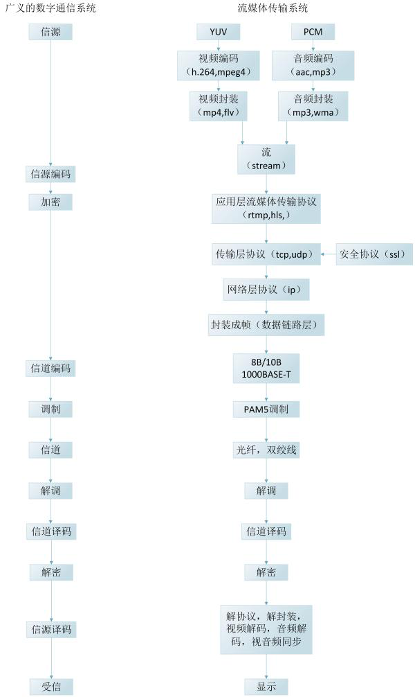

# 音视频入门
- [2.1音视频通信流程](#1)
- [2.2视音频格式简介](#2)
- [2.3DTS&PTS](#3)
- [2.4mpeg4视频中，I帧、p帧、B帧的判定](#4)
- [2.5 数字视频](#5)
- [2.6Android音视频开发](#6)
- [2.7音视频格式](#7)
- [2.8音视频应用](#8)


## <a id="1">2.1音视频通信流程</a>


## <a id="2">2.2视音频格式简介</a>
视频、图像、音频的格式。包括MP4，FLV这样的封装格式，也包括H264，MPEG2这样的编码格式，还包括420 422 444这样的取样格式，甚至RGB，HSV，YUV这样的彩色空间也可以算作一种格式，将来在应用时还可能会遇到RTMP，HLS这样的流媒体传输协议或者其他的协议，都可以算作格式。  

## <a id="3">2.3DTS&PTS</a>


## <a id="4">2.4mpeg4视频中，I帧、p帧、B帧的判定</a>
mpeg4的每一帧开头是固定的：00 00 01 b6，那么我们如何判断当前帧属于什么帧呢？在接下来的2bit，将会告诉我们答案。注意：是2bit，不是byte，下面是各类型帧与2bit的对应关系：
　　00: I Frame  
　　01: P Frame  
10: B Frame　
为了更好地说明，我们举几个例子，以下是16进制显示的视频编码：  
00 00 01 b6 10 34 78 97 09 87 06 57 87 ……                         I帧  
00 00 01 b6 50 78 34 20 cc 66 b3 89 ……                            P帧  
00 00 01 b6 96 88 99 06 54 34 78 90 98 ……                         B帧  
下面我们来分析一下为什么他们分别是I、P、B帧  
　　0x10 = 0001 0000  
　　0x50 = 0101 0000  
　　0x96 = 1001 0100　  
大家看红色的2bit，再对照开头说的帧与2bit的对应关系，是不是符合了呢？  
下面给出一段c++代码供大家参考：
```  
switch(buf[i] & (BYTE)0xc0)
{
case 0x00:
    //I Frame
    break;
case 0x40:
    //P Frame
    break;
case 0x80:
    //B Frame
    break;
default:
    break;
}
```

## <a id="5">2.5 数字视频</a>
CATV 频道中，550MHz～750MHz 的 200MHz 带宽中，如果传送模拟电视，每个节目需 8MHz 带宽，充其量只能传送 25 套节目。如果传送数字电视节目，采用 64QAM 调制，其频谱利用率为 5.3，如每路节目用 MPEG-2压缩为 4Mbps，实际只需 4÷5.3≈0.75MHz 带宽，于是在同样的 200MHz 带宽中可传送数字电视节目。  
RGB：任何彩色图像可由不同比例的红色、绿色和蓝色组合而成，即三基色原理。
YCbCr(YUV)：Y=0.299R+0587G+0.114B   Cb=0564(B－Y)   Cr=0.713(R－Y)  
R=Y+1.402Cr     G=Y-0.344Cb-0.714Cr    B=Y+1.772Cb  
有三种不同的彩色电视取样格式:  
4:4:4，Y，Cb 和 Cr 具有同样的水平和垂直清晰度，不论水平方向还是垂直方向，每 4 个亮度像素相应的有 4 个 Cb 和 4 个 Cr 色度像素  
4:2:2，这时彩色分量和亮度分量具有同样的垂直清晰度，但水平清晰度彩色分量是亮度分
量的一半。水平方向上，每 4 个亮度像素具有 2 个 Cb 和 2 个 Cr  
4:2:0，在水平和垂直清晰度方面， Cb 和 Cr 都是 Y 的一半。  
量化值 Qp，取得太大，视频图像显得粗糙；取得太小，视频图像质量好，但带宽浪费过大。一般认为，每个取样值采用 8 个比特表示，即 256 个灰度级，是比较合理的。

 |  1   |  2  |  
 |  ----  | ----  |    
 | fs＝13.5MHz | （亮度信号，即 Y 信号） |   
 | fs＝6.75MHz | （色差信号，即 Cb、 Cr 信号） | 

彩色电视采用 4:2:2 格式时（垂直方向 Cb、 Cr 和 Y 具有同等清晰度，水平方向 Cb、 Cr 只是 Y一半）， Y 和 Cb、 Cr 取样频率如上，则电视信号总数码率为：13.5×8＋2×6.75×8＝216Mbps  
当会议电视采用 CIF 格式时，帧频为 25 帧/秒，总码率为：352×288×25×8＝20.28Mbps
这些都是没有经过压缩的码率  
- 【色彩插值】，图像阵列中，每个像素值只有一个颜色的色调值，另外两个颜色的色调必须利用相邻像素之间的相关性，通过数据计算获得。相邻像素复制法、双线性插值算法以及双三次多项式插值等等
- 【色彩校正】，配置 RGB 色彩滤镜阵列的 CMOS 图像传感器的光谱响应曲线，为了补偿这种差异，必须对图像的像素值进行的变换处理。
- 【伽马校正】，显示器的输出强度和输出电压的相应大致呈幂指数关系输出的强度随着输入电压的增长成指数增长。通常我们就把这个幂指数称为伽马（gamma）。
- 【图像增强】，实际应用中图像传感器的输出图像经过上述的处理并不是完美的，图像质量获得的改进也是有限的，加之噪声、光照等原因，需要进一步处理，丢弃无用的信息，保留我们感兴趣的重要信息。 图像增强作为一种重要的图像处理技术，目的无非就是两个： 第一更适合人眼的感觉；第二有利于后续的分析处理。图像增强主要包括直方图均衡、平滑滤波、中值滤波、锐化等内容。
- 【白平衡】白平衡指的就是对白色物体的还原理解白平衡，涉及到另一个重要的概念：色温。所谓色温，简而言之，就是定量地以开尔文温度表示色彩。 色温越高， 蓝色成分就越多； 色温越低， 红色成分就越多，在摄影、摄像时，不同色温光源下拍摄物体，获得的图像不可避免会出现色彩上的偏差。为了很获得现实际世界中各种色彩的图像，必须消除环境中光源色温的影响，即进行白平衡处理。

## <a id="6">2.6Android音视频开发</a>
参考连接：    
https://www.cnblogs.com/renhui/p/7452572.html   

```c++
1初级入门篇
Android 音视频开发(一) : 通过三种方式绘制图片
http://www.cnblogs.com/renhui/p/7456956.html
Android 音视频开发(二)：使用 AudioRecord 采集音频PCM并保存到文件
http://www.cnblogs.com/renhui/p/7457321.html
Android 音视频开发(三)：使用 AudioTrack 播放PCM音频
http://www.cnblogs.com/renhui/p/7463287.html
Android 音视频开发(四)：使用 Camera API 采集视频数据
http://www.cnblogs.com/renhui/p/7472778.html
Android 音视频开发(五)：使用 MediaExtractor 和 MediaMuxer API 解析和封装 mp4 文件
http://www.cnblogs.com/renhui/p/7474096.html
Android 音视频开发(六)： MediaCodec API 详解
http://www.cnblogs.com/renhui/p/7478527.html
Android 音视频开发(七)： 音视频录制流程总结
http://www.cnblogs.com/renhui/p/7520690.html

初级入门篇主要是接触Android多媒体展示相关的API，通过单独的列举和使用这些API，对Android音视频处理有一个基本的轮廓，虽然知识点相对来说是比较散的，但是点成线,线称面，基本的基础掌握了，通过学习Android音视频核心的API将音视频的流程串联起来，这样对于音视频的了解和控制就不仅仅局限于最外层的API了，而是能够通过相对底层的方式来加深对Android 音视频开发的认知。 

2中级进阶篇
OpenGL ES 学习记录
学习 Android 平台 OpenGL ES API，了解 OpenGL 开发的基本流程，使用 OpenGL 绘制基本图形，并了解相关的API的简单使用

Android OpenGL ES 开发（一）: OpenGL ES 介绍
http://www.cnblogs.com/renhui/p/7994261.html
Android OpenGL ES 开发（二）: OpenGL ES 环境搭建
http://www.cnblogs.com/renhui/p/7997557.html
Android OpenGL ES 开发（三）: OpenGL ES 定义形状
http://www.cnblogs.com/renhui/p/8000345.html
Android OpenGL ES 开发（四）: OpenGL ES 绘制形状
http://www.cnblogs.com/renhui/p/8004987.html
Android OpenGL ES 开发（五）: OpenGL ES 使用投影和相机视图
http://www.cnblogs.com/renhui/p/8005512.html
Android OpenGL ES 开发（六）: OpenGL ES 添加运动效果
http://www.cnblogs.com/renhui/p/8005518.html
Android OpenGL ES 开发（七）: OpenGL ES 响应触摸事件
http://www.cnblogs.com/renhui/p/8005528.html
Android OpenGL ES 开发（八）: OpenGL ES 着色器语言GLSL
http://www.cnblogs.com/renhui/p/8126121.html
Android OpenGL ES 开发（九）: OpenGL ES 纹理贴图
http://www.cnblogs.com/renhui/p/8145734.html
Android OpenGL ES 开发（十）: 通过GLES20与着色器交互
http://www.cnblogs.com/renhui/p/8302434.html

动手实践，积累实战经验：

使用 OpenGL 显示一张图片
GLSurfaceviw 绘制 Camera 预览画面及实现拍照https://github.com/renhui/OpenGLES20Study
使用OpenGL ES 完成视频的录制，并实现视频水印效果https://github.com/renhui/OpenGLVideoRecord/tree/master

个人学习成果展示：
音视频录制流程总结： 
https://github.com/renhui/AndroidRecorder
OpenGL ES 学习笔记：
https://github.com/renhui/OpenGLES20Study
OpenGL音视频录制项目：
https://github.com/renhui/OpenGLVideoRecord 

OpenSL ES 学习记录
学习 Android 平台 OpenSL ES API，了解 OpenSL 开发的基本流程，使用OpenSL播放PCM数据，并了解相关API的简单使用。

Android OpenSL ES 开发：Android OpenSL 介绍和开发流程说明
https://www.cnblogs.com/renhui/p/9567332.html
Android OpenSL ES 开发：使用 OpenSL 播放 PCM 数据
https://www.cnblogs.com/renhui/p/9565464.html
Android OpenSL ES 开发：Android OpenSL 录制 PCM 音频数据
https://www.cnblogs.com/renhui/p/9604550.html
Android OpenSL ES 开发：OpenSL ES利用SoundTouch实现PCM音频的变速和变调
https://www.cnblogs.com/renhui/p/9620400.html

3高级探究篇

深入研究音视频相关的网络协议，如 rtmp，hls，以及封包格式，如：flv，mp4
深入学习一些音视频领域的开源项目，如 webrtc，ffmpeg，ijkplayer，librtmp 等等
将 ffmpeg 库移植到 Android 平台，结合上面积累的经验，编写一款简易的音视频播放器
将 x264 库移植到 Android 平台，结合上面积累的经验，完成视频数据 H264 软编功能
将 librtmp 库移植到 Android 平台，结合上面积累的经验，完成 Android RTMP 推流功能 

FFmpeg 学习记录
FFmpeg命令行工具学习(一)：查看媒体文件头信息工具ffprobe
http://www.cnblogs.com/renhui/p/9209664.html
FFmpeg命令行工具学习(二)：播放媒体文件的工具ffplay
http://www.cnblogs.com/renhui/p/8458802.html
FFmpeg命令行工具学习(三)：媒体文件转换工具ffmpeg
http://www.cnblogs.com/renhui/p/9223969.html

FFmpeg 学习(一)：FFmpeg 简介
http://www.cnblogs.com/renhui/p/6922971.html
FFmpeg 学习(二)：Mac下安装FFmpeg
http://www.cnblogs.com/renhui/p/8458150.html
FFmpeg 学习(三)：将 FFmpeg 移植到 Android平台
http://www.cnblogs.com/renhui/p/6934397.html
FFmpeg 学习(四)：FFmpeg API 介绍与通用 API 分析
http://www.cnblogs.com/renhui/p/9293057.html
FFmpeg 学习(五)：FFmpeg 编解码 API 分析
http://www.cnblogs.com/renhui/p/9328893.html
FFmpeg 学习(六)：FFmpeg 核心模块 libavformat 与 libavcodec 分析
http://www.cnblogs.com/renhui/p/9343098.html

FFmpeg 结构体学习
FFmpeg 结构体学习(一)： AVFormatContext 分析
https://www.cnblogs.com/renhui/p/9361276.html
FFmpeg 结构体学习(二)： AVStream 分析
https://www.cnblogs.com/renhui/p/9469856.html
FFmpeg 结构体学习(三)： AVPacket 分析
https://www.cnblogs.com/renhui/p/9488751.html
FFmpeg 结构体学习(四)： AVFrame 分析
https://www.cnblogs.com/renhui/p/9493393.html
FFmpeg 结构体学习(五)： AVCodec 分析
https://www.cnblogs.com/renhui/p/9493690.html
FFmpeg 结构体学习(六)： AVCodecContext 分析
https://www.cnblogs.com/renhui/p/9494286.html
FFmpeg 结构体学习(七)： AVIOContext 分析
https://www.cnblogs.com/renhui/p/9494887.html
FFmpeg 结构体学习(八)：FFMPEG中重要结构体之间的关系
https://www.cnblogs.com/renhui/p/9494890.html

4高级探究篇
GPUImage
https://github.com/CyberAgent/android-gpuimage

IjkPlayer
https://github.com/Bilibili/ijkplayer

librestreaming
https://github.com/lakeinchina/librestreaming

RTMPDump
http://rtmpdump.mplayerhq.hu/

SoundTouch
http://www.surina.net/soundtouch/sourcecode.html

5学习展望
完成上面的学习后，可以尝试做一款音视频相关的APP，这个APP尽可能多的用上你学习的知识，看看能做到什么程度。如果你能很好的做出来，并认真的把上面列举的所有的点都完成和整理了，相信你在Android音视频领域会越走越好。

推荐的学习资料：
《雷霄骅的专栏》：
http://blog.csdn.net/leixiaohua1020
《Android音频开发》：
http://ticktick.blog.51cto.com/823160/d-15
《FFMPEG Tips》
http://ticktick.blog.51cto.com/823160/d-17
《Learn OpenGL 中文》
https://learnopengl-cn.github.io/
《Android Graphic 架构》
https://source.android.com/devices/graphics/
《Jhuster的专栏》：
http://blog.51cto.com/ticktick
《ywl5320的专栏》：
https://blog.csdn.net/ywl5320
```

## <a id="7">2.7音视频格式</a>
- [2.7.0编解码格式说明](#2.7.0)
- [2.7.1TS](#2.7.1)
- [2.7.2PS](#2.7.2)
- [2.7.3AVI](#2.7.3)
- [2.7.4ASF](#2.7.4)
- [2.7.5REAL](#2.7.5)
- [2.7.6MP4](#2.7.6)
- [2.7.7FLV](#2.7.7)
- [2.7.8OGG](#2.7.8)
- [2.7.9MKV](#2.7.9)
- [2.7.10WAVE](#2.7.10)
- [2.7.11ES](#2.7.11)


### <a id="2.7.0">2.7.0编解码格式说明</a>
```c++
* TS 流文件，扩展名ts。
* PS 流文件，扩展名mpg。
* MPEG-4视频基本流文件，扩展名m4e。
* MP3文件，扩展名mp3。
* WAV 文件(PCM)，扩展名wav。
* AMR 音频文件，扩展名.amr。
* AAC 文件，ADTS 格式，扩展名aac。

音频编解码格式 
*MPEG Audio Layer 1/2 
*MPEG Audio Layer 3(MP3) 
*MPEG2 AAC 
*MPEG4 AAC 
*Windows Media audeo v1/v2/7/8/9 
*RealAudio cook/sipro(real media series) 
*RealAudio AAC/AACPlus(real media series) 
*QDesign Music 2(apple series) 
是QDesign 公司开发的用于高保真高压缩率的编码方式，类似于MP3，不过比MP3要先进。支持流式播放. 
*Apple MPEG-4 AAC(apple series) 
*ogg(ogg vorbis音频) 
*AC3(DVD 专用音频编码) 
*DTS(DVD 专用音频编码) 
*APE(monkey’s 音频) 
*AU(sun 格式) 
*FLAC(fress lossless 音频) 
*M4A(mpeg-4音频)（苹果改用的名字，可以改成.mp4） 
*MP2(mpeg audio layer2音频) 
*MWA 

视频编解码格式 
*MPEG1(VCD) 
*MPEG2(DVD) 
*MPEG4(divx,xvid) 
*MPEG4 AVC/h.264 
*h.261 
*h.262 
*h.263 
*h.263+ 
*h.263++ 
*MPEG-4 v1/v2/v3(微软windows media系列) 
*Windows Media Video 7/8/9/10 
*Sorenson Video 3（用于QT5，成标准了）(apple series) 
*RealVideo G2(real media series) 
*RealVideo 8/9/10(real media series) 
*Apple MPEG-4(apple series) 
*Apple H.264(apple series) 
*flash video 

音、视频文件格式 
*说明：首先要分清楚媒体文件和编码的区别：文件是既包括视频又包括音频、甚至还带有脚本的一个集合，也可以叫容器；文件当中的视频和音频的压缩算法才是具体的编码。

*AVI :音视频交互存储，最常见的音频视频容器。支持的视频音频编码也是最多的 
*MPG :MPEG编码采用的音频视频容器，具有流的特性。里面又分为 PS，TS 等，PS 主要用于 DVD 存储，TS 主要用于 HDTV。 
*VOB :DVD采用的音频视频容器格式（即视频MPEG-2，音频用AC3或者DTS），支持多视频多音轨多字幕章节等。 
*MP4 :MPEG-4编码采用的音频视频容器，基于 QuickTime MOV 开发，具有许多先进特性。 
*3GP :3GPP视频采用的格式，主要用于流媒体传送。 
*ASF :Windows Media 采用的音频视频容器，能够用于流传送，还能包容脚本等。 
*RM : RealMedia 采用的音频视频容器，用于流传送。 
*MOV :QuickTime 的音频视频容器，恐怕也是现今最强大的容器，甚至支持虚拟现实技术，Java 等，它的变种 MP4,3GP都没有这么厉害。 
*MKV :MKV 它能把 Windows Media Video，RealVideo，MPEG-4 等视频音频融为一个文件，而且支持多音轨，支持章节字幕等。 
*WAV :一种音频容器（注意：只是音频），大家常说的 WAV 就是没有压缩的 PCM 编码，其实 WAV 里面还可以包括 MP3 等其他 ACM 压缩编码。 

音、视频技术
Audio CD 
*标准CD格式也就是44.1K的采样频率，速率88K/秒，16位量化位数 
*＊.cda格式，这就是CD音轨了，一个CD音频文件是一个＊.cda文件，这只是一个索引信息，并不是真正的包含声音信息，所以不论CD音乐的长短，在电脑上看到的“＊.cda文件”都是44字节长 

MP3 
*MPEG音频文件的压缩是一种有损压缩，MPEG3音频编码具有10：1~12：1的高压缩率，同时基本保持低音频部分不失真，但是牺牲了声音文件中12KHz到16KHz高音频这部分的质量来换取文件的尺寸，相同长度的音乐文件，用＊.mp3格式来储存，一般只有＊.wav文件的1/10，而音质要次于CD格式或WAV格式的声音文件 
*MP3格式压缩音乐的采样频率有很多种，可以用64Kbps或更低的采样频率节省空间，也可以用320Kbps的标准达到极高的音质 
*每分钟音乐的MP3格式只有1MB左右大小 

MIDI
经常玩音乐的人应该常听到MIDI（Musical Instrument Digital Interface）这个词，MIDI允许数字合成器和其他设备交换数据。MID文件格式由MIDI继承而来。MID文件并不是一段录制好的声音，而是记录声音的信息，然后在告诉声卡如何再现音乐的一组指令。这样一个MIDI文件每存1分钟的音乐只用大约5～10KB。今天，MID文件主要用于原始乐器作品，流行歌曲的业余表演，游戏音轨以及电子贺卡等。＊.mid文件重放的效果完全依赖声卡的档次。＊.mid格式的最大用处是在电脑作曲领域。＊.mid文件可以用作曲软件写出，也可以通过声卡的MIDI口把外接音序器演奏的乐曲输入电脑里，制成＊.mid文件。 

WMA: 
*WMA的压缩率一般都可以达到1：18左右，WMA的另一个优点是内容提供商可以通过DRM（Digital Rights Management）方案如Windows Media Rights Manager 7加入防拷贝保护。这种内置了版权保护技术可以限制播放时间和播放次数甚至于播放的机器等等，这对被盗版搅得焦头乱额的音乐公司来说可是一个福音，另外WMA还支持音频流(Stream)技术，适合在网络上在线播放 
* WMA这种格式在录制时可以对音质进行调节。同一格式，音质好的可与CD媲美，压缩率较高的可用于网络广播 

以文件名标识识别音频编码格式 
*.aac 
音频编码：aac 

*.ac3 
音频编码：ac3 

*.ape 
*.au 
音频编码：pcm_s16be 

*.m4a 
音频编码：mpeg4 aac 

*.mp2 
*.mp3 
*.ogg 
音频编码：vorbis 

*.wav 
音频编码：pcm_s16le 

*.flav 
*.wma 
音频编码：wma7x 

以文件名标识识别音频编码格式 
1．*.MP4 (MP4 MPEG-4视频) 
视频编码：mpeg4 
音频编码：mpeg4 aac 

２．*.3gp (3GPP 第三代合作项目) 
视频编码：mpeg4 
音频编码：amr_nb((mono, 8000 Hz, Sample Depth 16 bit, bitrate 12 kbps) 

３．*.3g2 (3GPP 第三代合作项目2) 
视频编码：mpeg4 
音频编码：mpeg4 aac 

4．*.asf (ASF 高级流格式) 
视频编码：msmpeg4 
音频编码：mp3 

5．*.avi （AVI 音视频交错格式） 
视频编码：mpeg4 
音频编码：pcm_s161e 

6．*.avi （divx 影片） 
视频编码：mpeg4 
音频编码：mp3 

7．*.avi（xvid 视频） 
视频编码：Xvid 
音频编码：mp3 

8．*.vob （DVD） 
视频编码：mpeg2 video 
音频编码：ac3 

9．*.flv (flash 视频格式) 
视频编码： 
音频编码：mp3 

10．*.mp4 (iPod 320*240 MPEG-4 视频格式) 
视频编码：mpeg4 
音频编码：mpeg4 aac 

11．*.mp4(iPod video2 640*480 MPEG-4 视频格式) 
视频编码：mpeg4 
音频编码：mpeg4 aac 

12．*.mov (MOV 苹果quicktime 格式) 
视频编码：mpeg4_qt 
音频编码：mpeg4 aac_qt

13．*.mpg （mpeg1影片） 
视频编码：mpeg1 video 
音频编码：mp2 

14．*.mpg （mpeg2 影片） 
视频编码：mpeg2 video 
音频编码：mp2 

15．*.mp4 （mpeg4 avc 视频格式） 
视频编码：h.264 
音频编码：mpeg4 aac 

16．*.mp4 （PSP mpeg4 影片） 
视频编码：Xvid 
音频编码：mpeg4 aac 

17．*.mp4 （PSP AVC 视频格式） 
视频编码：h.264 
音频编码：mpeg4 aac 

18．*.rm （RM realvideo） 
视频编码：rv10 
音频编码：ac3 

19．*.mpg (超级VCD) 
视频编码：mpeg2 video 
音频编码：mp2 

20．*.swf (SWF 格式) 
视频编码： 
音频编码：mp3 

21．*.mpg （video CD 格式） 
视频编码：mpeg1 video 
音频编码：mp2 

22．*.vob （mpeg2 ps格式） 
视频编码：mpeg2 video 
音频编码：ac3 

23．*.wmv（windows 视频格式） 
视频编码：wmv3x 
音频编码：wma7x 

mpeg PMT 的 stream type汇总
Value    Description
0x00     ITU-T | ISO/IEC Reserved
0x01     ISO/IEC 11172-2 Video
0x02     ITU-T Rec. H.262 | ISO/IEC 13818-2 Video or ISO/IEC 11172-2 constrained parameter video stream
0x03     ISO/IEC 11172-3 Audio
0x04     ISO/IEC 13818-3 Audio
0x05     ITU-T Rec. H.222.0 | ISO/IEC 13818-1 private_sections
0x06     ITU-T Rec. H.222.0 | ISO/IEC 13818-1 PES packets containing private data
0x07     ISO/IEC 13522 MHEG
0x08     ITU-T Rec. H.222.0 | ISO/IEC 13818-1 Annex A DSM-CC
0x09     ITU-T Rec. H.222.1
0x0A     ISO/IEC 13818-6 type A
0x0B     ISO/IEC 13818-6 type B
0x0C     ISO/IEC 13818-6 type C
0x0D     ISO/IEC 13818-6 type D
0x0E     ITU-T Rec. H.222.0 | ISO/IEC 13818-1 auxiliary
0x0F     ISO/IEC 13818-7 Audio with ADTS transport syntax
0x10     ISO/IEC 14496-2 Visual
0x11     ISO/IEC 14496-3 Audio with the LATM transport syntax as defined in ISO/IEC 14496-3/Amd.1
0x12     ISO/IEC 14496-1 SL-packetized stream or FlexMux stream carried in PES packets
0x13     ISO/IEC 14496-1 SL-packetized stream or FlexMux stream carried in ISO/IEC 14496_sections
0x14     ISO/IEC 13818-6 Synchronized Download Protocol
0x15     Metadata carried in PES packets
0x16     Metadata carried in metadata_sections
0x17     Metadata carried in ISO/IEC 13818-6 Data Carousel
0x18     Metadata carried in ISO/IEC 13818-6 Object Carousel
0x19     Metadata carried in ISO/IEC 13818-6 Synchronized Download Protocol
0x1A     IPMP stream (defined in ISO/IEC 13818-11, MPEG-2 IPMP)
0x1B     AVC video stream as defined in ITU-T Rec. H.264 | ISO/IEC 14496-10 Video
0x1C     ISO/IEC 14496-3 Audio, without using any additional transport syntax, such as DST, ALS and SLS
0x1D     ISO/IEC 14496-17 Text
0x1E     Auxiliary video stream as defined in ISO/IEC 23002-3
0x1F-0x7E ITU-T Rec. H.222.0 | ISO/IEC 13818-1 Reserved
0x7F     IPMP stream
0x80-0xFF User Private

如上就是PMT表的stream_type的汇总，具体也可以查看13818-1标准的Table 2-36，第64页，有相关的详细说明。

我们以coretv为例子来做说明：
#define   STREAMTYPE_11172_VIDEO                  0x01
#define   STREAMTYPE_13818_VIDEO                  0x02
#define   STREAMTYPE_11172_AUDIO                  0x03
#define   STREAMTYPE_13818_AUDIO                  0x04
#define   STREAMTYPE_13818_PRIVATE                0x05
#define   STREAMTYPE_13818_PES_PRIVATE            0x06
#define   STREAMTYPE_13522_MHPEG                  0x07
#define   STREAMTYPE_13818_DSMCC                  0x08
#define   STREAMTYPE_ITU_222_1                    0x09
#define   STREAMTYPE_13818_A                      0x0a
#define   STREAMTYPE_13818_B                      0x0b
#define   STREAMTYPE_13818_C                      0x0c
#define   STREAMTYPE_13818_D                      0x0d
#define   STREAMTYPE_13818_AUX                    0x0e

#define   STREAMTYPE_AAC_AUDIO     0x0f
#define   STREAMTYPE_MPEG4_AUDIO     0x11
#define   STREAMTYPE_H264_VIDEO     0x1b
#define   STREAMTYPE_AVS_VIDEO     0x42

#define   STREAMTYPE_AC3_AUDIO                    0x81
#define   STREAMTYPE_DTS_AUDIO                    0x82
```

### <a id="2.7.1">2.7.1TS</a>
支持Transport Stream传输流，该类文件扩展名包括.ts、.tp、.m2ts、.tod、.m2t、mts。TS中支持下述格式的视频、音频、字幕。

```c++
视频
MPEG-1 Video：stream_type为0x01
MPEG-2 Video：stream_type为0x02
AVC（H264）：stream_type为0x1b
VC-1：stream_type为0xea

音频
Mpeg-1 Audio：stream_type为0x03
Mpeg-2 Audio：stream_type为0x04
Mpeg-2 AAC：stream_type为0x0f
Mpeg-4 AAC：stream_type为0x11
LPCM：stream_type为0x80
AC3：stream_type为0x81或0x06
DTS：stream_type为0x82
Dolby TrueHD：stream_type为0x83
AC3-Plus：stream_type为0x84
DTS_HD：stream_type为0x85
DTS-MA：stream_type为0x86
AC3-Plus_SEC：steam_type为0xa1
DTS_HD_SEC：stream_type为0xa2

字幕
PGS：stream_type为0x90
IGS：steam_type为0x91，暂不支持
Text Subtitle：stream_type为0x92
```

### <a id="2.7.2">2.7.2PS</a>
支持Program Stream节目流，该类媒体包括VCD、SVCD、DVD、HD-DVD。

常见扩展名包括.dat、.mpg、.mpeg、.vob、.evo、.mod、.m1s、.m2s。PS中支持下述格式的视频、音频、字幕

```c++
视频
Mpeg-1 Video：stream_type为0x01
Mpeg-2 Video：stream_type为0x02
Mpeg-4 Video：stream_type为0x010
H264：stream_type为0x1b
AVS Video：stream_type为0x43

音频
Mpeg-1 Audio：stream_type为0x03
Mpeg-2 Audio：stream_type为0x04
Mpeg-2 AAC：stream_type为0x0f
Mpeg-4 AAC：stream_type为0x11
AVS Audio：stream_type为0x42

字幕
支持内嵌字幕
```

### <a id="2.7.3">2.7.3AVI</a>
支持AVI文件，扩展名为.avi。AVI中支持以下格式的视频、音频、字幕。

```c++
视频：支持以下FourCC的视频
Mpeg-1 Video：mpg1/MPG1、pim1/PIM1
Mpeg-2 Video：mpg2/MPG2、mpeg/MPEG、pim2/PIM2、vcr2/VCR2、dvr/DVR、mmes/MMES、lmp2/LMP2。
Mpeg-4 Video：mp4s/MP4S、m4s2/M4S2、xvid/XVID、divx/DIVX、dx50/DX50、mp4v/MP4V、fmp4/FMP4
、div1/DIV1、blz0/BLZ0、ump4/UMP4、sedg/SEDG、rmp4/RMP4、3iv2/3IV2、ffds/FFDS、fvfw/FVFW、
dcod/DCOD、
mvxm/MVXM、pm4v/PM4V、smp4/SMP4、dxgm/DXGM、vidm/VIDM、m4t3/M4T3、geox/GEOX、hdx4/HDX4、
dmk2/DMK2、digi/DIGI、inmc/INMC、ephv/EPHV、em4a/EM4A、m4cc/M4CC、sn40/SN40、wv1f/WV1F。
H.263：h263/H263、x263/X263、m263/M263、t263/T263、l263/L263、u263/U263、vx1k/VX1K、ZyGo、viv1/VIV1。
Intel H.263：i263/I263。
H.264：h264/H264、x264/X264、n264/N264、l264/L264、avc1/AVC1、vssh/VSSH。
VC-1：wmv3/WMV3、wmva/WMVA、wvc1/WVC1。
Microsoft Video：wmv2/WMV2、wmv1/WMV1、mp43/MP43、div3/DIV3、mpg3/MPG3、div5/DIV5、div6/DIV6、
div4/DIV4、dvx3/DVX3、ap41/AP41、col1/COL1、col0/COL0、mp42/MP42、dvx2/DVX2、mpg4/MPG4、mp41/MP41、
mss1/MSS1、mss2/MSS2、wmvp/WMVP、wvp2/WVP2。
RGB：BI_RGB（0x00000000）、BI_RLE8（0x01000000）、BI_RLE4（0x02000000）、BI_BITFIELDS（0x03000000）。
YUV：yv12/YV12、iyuv/IYUV uyuy/UYUY、vyuy/VYUY、2vuy/2VUY、yuv9/YUV9、yvu9/YVU9、ifo9/IFO9。
Motion Jpeg：mjpg/MJPG、ljpg/LJPG、dmb1/DMB1、jpgl/JPGL、mjls/MJLS、jpeg/JPEG、ijpg/IJPG、acdv/ACDV、
qivg/QIVG、slmj/SLMJ、cjpg/CJPG、zjpg/ZJPG、AVRn。
Motion GIF：mgif/MGIF、gif/GIF。
Motion PNG：mpng/MPNG、png1/PNG1、png/PNG。

音频：支持以下FormatTag的音频
lpcm：0x0001
ms_adpcm：0x0002
float pcm：0x0003
a-law：0x0006
mu-law：0x007
ima-adpcm：0x0011
create_adpcm：0x0200
mpeg-1 audio layer Ⅱ：0x50
mpeg-1 audio layer Ⅲ：0x55
ac-3：0x2000
dts：0x2001
wma1：0x160
wma2：0x161
wma professional：0x162
wma lossess：0x163
wma speech 9：0x0a
mpeg-2 aac with raw data block：0xff
mpeg-2 aac with adts packet：0x4143
vorbis ffmpeg format：0x566f
vorbis 1：0x674f
vorbis 1 plus：0x676f
vorbis 2：0x6750
vorbis 2 plus：0x6770
vorbis 3：0x6751
vorbis 3 plus：0x6771
pcm extended：0xfffe
vorbis （with OggSwap）：0xfffe
f1ac：0xf1ac
amr-nb：0x0057
amr-wb：0x0058

字幕
srt
ssa
aas
VobSub
```

### <a id="2.7.4">2.7.4ASF</a>
ASF是（Advanced Streaming Format） 高级串流格式的缩写，是 Microsoft 为 Windows 98 所开发的串流多媒体文件格式。同JPG、MPG文件一样，ASF文件也是一种文件类型，但是特别适合在IP网上传输。支持ASF文件。常见扩展名包括.asf、.wma、.wmv、.dvr-ms。ASF中支持以下格式的视频、音频。（ASF中不含字幕流）.

```c++
视频 FourCC 
支持包含在AVI中列出的所有视频格式。

音频 FormatTag
支持包含在AVI中列出的所有音频格式。
```

### <a id="2.7.5">2.7.5REAL</a>
支持REAL文件。常见扩展名包括.rm、.rmvb、.ra、.rv。REAL中支持以下格式的视频、音频。（REAL中不含字幕流）。

```
视频 CodecId
RV10
RV20
RV30
RV40
RVTR：与RV20相同

音频：支持以下CodecId 的音频
Dolby AC3(RealAudio 3)：dnet
G2/Cook（RealAudio 6）：cook，其中cook多声道暂不支持
Mpeg-2 AAC（RealAudio 9）：raac
Mpeg-4 HE-AAC（RealAudio 10）：racp
```

### <a id="2.7.6">2.7.6MP4</a>
支持MP4文件。常见扩展名包括.mp4、.m4s、.qt、.mov、.3gp、.3gpp、.3g2、.f4v。MP4中支持以下格式的视频、音频、字幕.

```c++
视频
Mpeg-1 Video：mpg1、MPG1
Mpeg-2 Video：mpg2、mpeg、MPG2、MPEG
Mpeg-4 Video：mp4v、xvid、XVID、divx、DIVX、DX50
H.264：avc1、h264、H264、x264、X264
H.263：h263、s263、H263、x263、X263
VC-1：WMV3
Microsoft Video：WMV2、WMV1、MP43、DIV3、MPG3、MP42、MPG4、MP41、MSS1、MSS2、WMVP、WVP2
Motion Jpeg：jpeg、MJPG、mjpa、mjpb
RGB：raw_、8BPS
YUV：yuv、qcif、uyvy、vyuv、yuy2、yvyu

音频
Mpeg-4 AAC/Ogg Vorbis：mp4a
AMR_NB：samr
AMR_WB：sawb
QDesign music version 2：QDM2
PCM：NONE、raw、twos、sowt
QuickTime Adpcm：ima4
Floating Point、fl32、fl64
Integer：in24、in32
aLaw：alaw
uLaw：ulaw
Microsoft Adpcm：0x6d730002
DVI/Intel IMA Adpcm：0x6d730011
Mpeg-1 Audio Layer Ⅲ：.mp3
Mpeg-1 Audio Layer Ⅱ：.mp1、.mp2
AC-3：ac-3、sac3
DTS：dts1、dsts
Microsoft Audio：WMA1、WMA2、WMA3、0x6d730160、0x6d730161、0x6d730162、0x6d730163、0x6d73000a
Ogg Vorbis：OggV。

字幕：支持MP4内嵌的字幕
text
tx3g
```

### <a id="2.7.7">2.7.7FLV</a>
支持各种格式的FLV文件。扩展名为.flv。FLV中支持一以下视频、音频。（FLV中不含字幕流）

```c++
视频 CodecId
Sorenson H.263
Screen video
AVC

音频Sound Format
ADPCM
MP3
Linear PCM little endian
AAC。
```

### <a id="2.7.8">2.7.8OGG</a>
Ogg全称是OGG Vorbis， 是一种音频压缩格式，类似于MP3等的音乐格式。但有一点不同的是，它是完全免费、开放和没有专利限制的。OGG Vorbis有一个特点是支持多声道。支持各种OGG文件。常见扩展名为.ogg、.ogm、.ogv。OGG中支持以下格式的视频、音频、字幕。

```c++
视频
支持在ASF中列出的视频格式，还支持theora video。

音频
flac：flac、fLac
vorbis

字幕
支持OGG中内嵌的字幕
```

### <a id="2.7.9">2.7.9MKV</a>
支持各种MKV文件。常见扩展名为.mkv、.mka、.mks。MKV中支持以下格式的视频音频、字幕。

```c++
视频 CodecId
Avi
Mpeg-1 Video
Mpeg-2 Video
H.264
Mpeg-4 Video
RV10 real Video
RV20 real Video
RV30 real Video
RV40 real Video
QuickTime Video

音频 CodecID
Mpeg-2 aac
AC3
DTS
MpeG-1 Audio
Vorbis
Real Cook
flac
PCM
qdesign music version 2。

字幕 CodecId
srt
ssa
ass
pgs
```

### <a id="2.7.10">2.7.10WAVE</a>
支持wave音频，扩展名为.wav。WAVE中支持以下格式的音频。

```c++
lpcm：0x0001
ms_adpcm：0x0002
float pcm：0x0003
a-law：0x0006
mu-law：0x0007
ima-adpcm：0x0011
creative_adpcm:0x0200
Mpeg-1 Audio Layer Ⅰ/Ⅱ：0x50
Mpeg-1 Audio Layer Ⅲ：0x55
AC-3：0x2000
DTS：0x2001
wma1：0x160
wma2：0x161
wma Professional：0x162
wma lossess：0x163
wma speech 9
aac with raw data block：0xff
Mpeg-2 aac with adts packet：0x706d、0x4143
```

### <a id="2.7.11">2.7.11ES</a>
```c++
ES Audio
Mpeg-1 Audio：.mp1、.mp2、.mp3、.mpa、.m1a，支持mp3 pro
Mpeg-2/Mpeg-4 AAC：.aac、.m2a、.adts、.adif
AMR：.amr、.awb、.awp
AC-3：.ac3、.eac3
DTS：.dts
APE：.ape
FLAC：.flac
WMA：.wma
PCM：.pcm

ES Video
Mpeg-1 Video：.m1v
Mpeg-2 Video：.m2v、.mpv
Mpeg-4 Video：.m4v
H.264：.264、.h264、.avc
VC-1：.rcv、.vc1
Yuv：.yuv、.qcif、.uyvy、.vyuv、.yuy2、.yvyu

Picture
JPEG：.jpg、.jpeg
GIF：.gif
PNG：.png
BITMAP：.bmp、.dib
```

## <a id="8">2.8音视频应用</a>
```c++
实现MP4文件边下载边播放
https://blog.csdn.net/yeyinglingfeng/article/details/77774449

```


## links
  * [目录](<音视频入门到精通目录.md>)
  * 下一节: [图片入门](<1.3图片入门.md>)