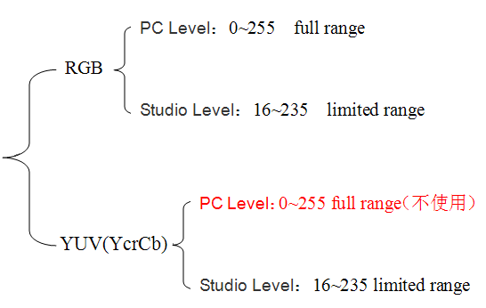

# 图片入门
- [3.1PNG](#1)
- [3.2YUV](#2)

## <a id="1">3.1PNG</a>
便携式网络图形（Portable Network Graphics）是一种无损压缩的位图图形格式。其设计目的是试图替代GIF和TIFF文件格式，同时增加一些GIF文件格式所不具备的特性。PNG使用从LZ77派生的无损数据压缩算法，一般应用于JAVA程序、网页或S60程序中，原因是它压缩比高，生成文件体积小。  
PNG格式的图片具有如下特点：  
体积小：网络通讯中因受带宽制约，保证图片清晰、逼真。  
无损压缩：PNG文件采用LZ77算法获得高的压缩比，不损失数据。标记重复出现的数据，对图像的颜色没有影响，也不可能产生颜色的损失。  
索引彩色模式：PNG-8格式与GIF图像类似，同样采用8位调色板将RGB彩色图像转换为索引彩色图像。图像中保存的不再是各个像素的彩色信息，而是从图像中挑选出来的具有代表性的颜色编号，每一编号对应一种颜色，图像的数据量也因此减少，这对彩色图像的传播非常有利。  
更优化的网络传输显示： PNG图像在浏览器上采用流式浏览，即使经过交错处理的图像会在完全下载之前提供浏览者一个基本的图像内容，然后再逐渐清晰起来。它允许连续读出和写入图像数据，这个特性很适合于在通信过程中显示和生成图像。  
支持透明效果：PNG可以为原图像定义256个透明层次，使得彩色图像的边缘能与任何背景平滑地融合，从而彻底地消除锯齿边缘。这种功能是GIF和JPEG没有的。  
PNG同时还支持真彩和灰度级图像的Alpha通道透明度。  
最高支持24位真彩色图像以及8位灰度图像。  
支持Alpha通道的透明/半透明特性。  
支持图像亮度的Gamma校准信息。  
支持存储附加文本信息，以保留图像名称、作者、版权、创作时间、注释等信息。  
渐近显示和流式读写，适合在网络传输中快速显示预览效果后再展示全貌。  
使用CRC防止文件出错。  
最新的PNG标准允许在一个文件内存储多幅图像。  

## <a id="2">3.2YUV</a>
参考连接：   
1.yuv格式    
https://github.com/jiayayao/DataSheet   

420对应的是YUV三个通道，指的是采样……默认是2X2的像素，4代表对4个像素采样4个，2代表采样2个……所以420是指采样格式

Semi-planar

Semi planar formats have two planes instead of three, one plane for luminance, and one plane for both chrominance components.They are also sometimes referred to as biplanar formats also. 

Semi-planar = biplanar 

1:我们熟悉的PC使用 RGB 色彩 空间，RGB信号在处理图像时，每个像素的色彩由3个分别对应 三原色 的8位二进制数字来确定，2的8次方=256个灰阶。比如（255，255，255）代表白色，（255，0，0 ）代表红色，那么灰阶总共是0～255一共256个，通常被称作Full Range。属于PC Level系统，

1句话总结： RGB 称作全范围彩色Full Range，0~255，PC Level。

2：由于 RGB 每个像素记录需要24位，所需的存储空间和数据量毫无疑问比较大。而YCrCb信号如果采用13.5MHz 采样频率 得到的8位或10位PCM信号则称为4∶4∶4，也有256个灰阶。但是这样的话数据量太大了。研究表明，人眼察觉到的光亮度信息(Y)的60%至70%来自绿色光。红色和蓝色信道实际上只是亮度信息的复制，因此这些重复信息完全可以去除掉。为了减少数据储存空间和数据传输带宽，可以用较低的采样频率6.75MHz来采样B-Y和R-Y信号，称做4∶2∶2，也就是 消费电子 的Studio Level。

　　在Studio Level设备中，8位 YCbCr 系统都规定亮度的取值范围介于16至235之间，而B-Y和R-Y信号的取值范围介于16至240之间。YCbCr 4∶2∶2色差信号的灰阶是16～235，通常被称作Limited Range，而 RGB 信号也有两种 采样频率 和灰阶，在PC Level系统中是0～255，而在Studio Level 消费电子 中则是16～235。

1句话总结： RGB 和YUV(YCrCb）都有Full Range和Limited Range模式，但是YUV不使用Full Range。YUV属于Studio Level。
如下图：

full range又被称之为为enhanced，但也可以支持16-235的limited range   
limited range又被称为standard或normal   
HDMI是以DVI为基础作为家庭AV视听为主，既可以传送YUV，也可以传送 RGB   

至于limited range和full range的问题，我记得模拟信号中，limited range是为了防止在信号动态范围的两端出现失真，对这些区域做保留而不用来存储视频信息。数字信号时代这两端则是有用来存储一些视频信号以外的信息。

不过到了现在，我觉得limited range更多是一种历史遗留产物，但它仍然有一个特征相比full range有优势：   
在不同bit depth间转换时limited range只需要简单的位移操作（如8bit Y/UV对应16-235/16-128-240，10bit Y/UV对应64-940/64-512-960）——升高bit depth是无损的；而full range需要通过更复杂的interpolation才能实现bit depth转换（如8bit Y/UV对应0-255/0-128-255，10bit Y/UV对应0-1023/0-512-1023）——无论降低还是升高bit depth都会产生quantization error。

## links
  * [目录](<音视频入门到精通目录.md>)
  * 下一节: [关键点记录](<1.4关键点记录.md>)