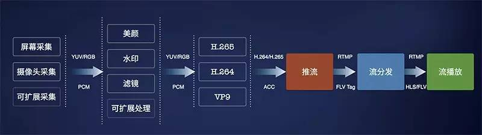
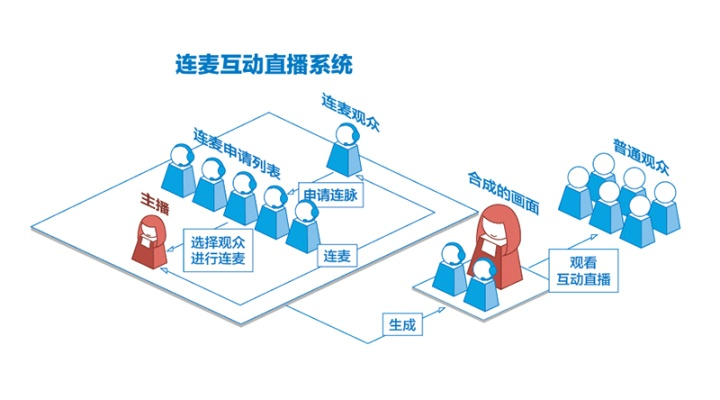
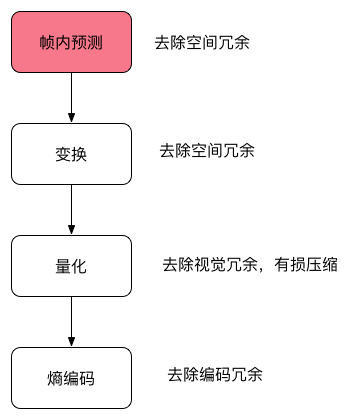
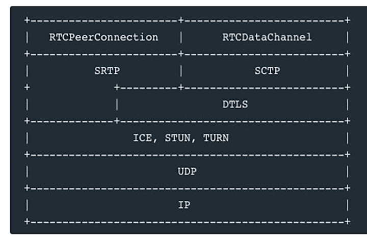
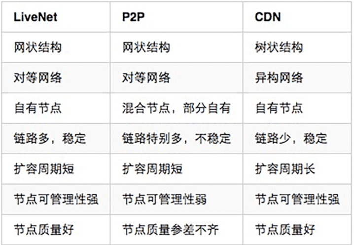

# 直播技术文章
- [7.1直播延迟优化](#7.1)
- [7.2直播音视频采集](#7.2)
- [7.3直播音视频处理](#7.3)
- [7.4直播音视频编码和封装](#7.4)
- [7.5直播音视频推流和传输](#7.5)


# <a id="7.1">7.1延迟优化</a>
参考链接：  
1.「视频直播技术详解」系列之五：延迟优化   
https://www.cnblogs.com/qiniu/p/6089097.html   

## 1.编码优化
1. 确保 Codec 开启了最低延迟的设置。Codec 一般都会有低延迟优化的开关，对于 H.264 来说其效果尤其明显。很多人可能不知道 H.264 的解码器正常情况下会在显示之前缓存一定的视频帧，对于 QCIF 分辨率大小的视频（176 × 144）一般会缓存 16 帧，对于 720P 的视频则缓存 5 帧。对于第一帧的读取来说，这是一个很大的延迟。如果你的视频不是使用 H.264 来编码压缩的，确保没有使用到 B 帧，它对延迟也会有较大的影响，因为视频中 B 帧的解码依赖于前后的视频帧，会增加延迟。

2. 编码器一般都会有码控造成的延迟，一般也叫做初始化延迟或者视频缓存检验器 VBV 的缓存大小，把它当成编码器和解码器比特流之间的缓存，在不影响视频质量的情况下可以将其设置得尽可能小也可以降低延迟。

3. 如果是仅仅优化首开延迟，可以在视频帧间插入较多的关键帧，这样客户端收到视频流之后可以尽快解码。但如果需要优化传输过程中的累计延迟，尽可能少使用关键帧也就是 I 帧（GOP 变大），在保证同等视频质量的情况下，I 帧越多，码率越大，传输所需的网络带宽越多，也就意味着累计延迟可能越大。这个优化效果可能在秒级延迟的系统中不是很明显，但是在 100 ms 甚至更低延迟的系统中就会非常明显。同时，尽量使用 AAC-LC Codec 来编码音频，HE-AAC 或者 HE-AAC V2 虽然编码效率高，但是编码所需时间更长，而产生更大体积的音频造成的传输延迟对于视频流的传输来说影响更小。

4. 不要使用视频 MJPEG 的视频压缩格式，至少使用不带 B 帧的 MPEG4 视频压缩格式（Simple profile），甚至最好使用 H.264 baseline profile（X264 还有一个「-tune zerolatency」的优化开关）。这样一个简单的优化可以降低延迟，因为它能够以更低的码率编码全帧率视频。

5. 如果使用了 FFmpeg，降低「-probesize 」和「 -analyze duration」参数的值，这两个值用于视频帧信息监测和用于监测的时长，这两个值越大对编码延迟的影响越大，在直播场景下对于视频流来说 analyzeduration 参数甚至没有必要设定。

6. 固定码率编码 CBR 可以一定程度上消除网络抖动影响，如果能够使用可变码率编码 VBR 可以节省一些不必要的网络带宽，降低一定的延迟。因此建议尽量使用 VBR 进行编码。

## 2.传输协议优化
1. 在服务端节点和节点之间尽量使用 RTMP 而非基于 HTTP 的 HLS 协议进行传输，这样可以降低整体的传输延迟。这个主要针对终端用户使用 HLS 进行播放的情况。

2. 如果终端用户使用 RTMP 来播放，尽量在靠近推流端的收流节点进行转码，这样传输的视频流比原始视频流更小。

3. 如果有必要，可以使用定制的 UDP 协议来替换 TCP 协议，省去弱网环节下的丢包重传可以降低延迟。它的主要缺点在于，基于 UDP 协议进行定制的协议的视频流的传输和分发不够通用，CDN 厂商支持的是标准的传输协议。另一个缺点在于可能出现丢包导致的花屏或者模糊（缺少关键帧的解码参考），这就要求协议定制方在 UDP 基础之上做好丢包控制。

## 3.传输网络优化
1. 我们曾经介绍过实时流传输网络，它是一种新型的节点自组织的网状传输网络，既适合国内多运营商网络条件下的传输优化，也适合众多海外直播的需求。

2. 在服务端节点中缓存当前 GOP，配合播放器端优化视频首开时间。

3. 服务端实时记录每个视频流流向每个环节时的秒级帧率和码率，实时监控码率和帧率的波动。

4. 客户端（推流和播放）通过查询服务端准实时获取当前最优节点（5 秒一次），准实时下线当前故障节点和线路。

## 4.推流、播放优化
1. 考察发送端系统自带的网络 buffer 大小，系统可能在发送数据之前缓存数据，这个参数的调优也需要找到一个平衡点。

2. 播放端缓存控制对于视频的首开延迟也有较大影响，如果仅优化首开延迟，可以在 0 缓存情况下在数据到达的时候立即解码。但如果在弱网环境下为了消除网络抖动造成的影响，设置一定的缓存也有必要，因此需要在直播的稳定性和首开延迟优化上找到平衡，调整优化缓冲区大小这个值。

3. 播放端动态 buffer 策略，这是上面播放端缓存控制的改进版本。如果只是做 0 缓存和固定大小的缓存之间进行选择找到平衡，最终还是会选择一个固定大小的缓存，这对亿级的移动互联网终端用户来说并不公平，他们不同的网络状况决定了这个固定大小的缓存并不完全合适。因此，我们可以考虑一种「动态 buffer 策略」，在播放器开启的时候采用非常小甚至 0 缓存的策略，通过对下载首片视频的耗时来决定下一个时间片的缓存大小，同时在播放过程中实时监测当前网络，实时调整播放过程中缓存的大小。这样即可做到极低的首开时间，又可能够尽量消除网络抖动造成的影响。

4. 动态码率播放策略。除了动态调整 buffer 大小的策略之外，也可以利用实时监测的网络信息来动态调整播放过程中的码率，在网络带宽不足的情况下降低码率进行播放，减少延迟。

以上，是我们在低延迟优化方面的部分技巧。实际上我们优化低延迟的时候并不是只关注「低延迟」，而是在保证其它条件不影响用户体验的情况下尽量做到低延迟，因此它的内容涉及到更多广泛的话题。而视频直播的优化也包含方方面面，这里只分享了其中经过我们实践的部分。随着实践的积累，我们接下来会在线上和线下分享更多关于视频直播甚至点播的优化技巧。

# <a id="7.2">7.2采集</a>



## 1.采集内容
```c++
1.音频采集

音频数据既能与图像结合组合成视频数据，也能以纯音频的方式采集播放，后者在很多成熟的应用场景如在线电台和语音电台
等起着非常重要的作用。音频的采集过程主要通过设备将环境中的模拟信号采集成 PCM 编码的原始数据，然后编码压缩成 
MP3 等格式的数据分发出去。常见的音频压缩格式有：MP3，AAC，HE-AAC，Opus，FLAC，Vorbis (Ogg)，Speex 和 AMR等。

音频采集和编码主要面临的挑战在于：延时敏感、卡顿敏感、噪声消除（Denoise）、回声消除（AEC）、静音检测（VAD）和
各种混音算法等。

在音频采集阶段，参考的主要技术参数有 ：
采样率（samplerate）：采样就是把模拟信号数字化的过程，采样频率越高，记录这一段音频信号所用的数据量就越大，
同时音频质量也就越高。

位宽：每一个采样点都需要用一个数值来表示大小，这个数值的数据类型大小可以是：4bit、8bit、16bit、32bit 等等，
位数越多，表示得就越精细，声音质量自然就越好，而数据量也会成倍增大。我们在音频采样过程中常用的位宽是 8bit 
或者 16bit。

声道数（channels）：由于音频的采集和播放是可以叠加的，因此，可以同时从多个音频源采集声音，并分别输出到不同
的扬声器，故声道数一般表示声音录制时的音源数量或回放时相应的扬声器数量。声道数为 1 和 2 分别称为单声道
和双声道，是比较常见的声道参数。

音频帧（frame）：音频跟视频很不一样，视频每一帧就是一张图像，而从上面的正玄波可以看出，音频数据是流式的，
本身没有明确的一帧帧的概念，在实际的应用中，为了音频算法处理/传输的方便，一般约定俗成取 2.5ms~60ms 为单位的
数据量为一帧音频。这个时间被称之为“采样时间”，其长度没有特别的标准，它是根据编解码器和具体应用的需求来决定的。

根据以上定义，我们可以计算一下一帧音频帧的大小。假设某音频信号是采样率为 8kHz、双通道、位宽为 16bit，20ms 
一帧，则一帧音频数据的大小为：
size = 8000 x 2 x 16bit x 0.02s = 5120 bit = 640 byte
2.图像采集图像采集的图片结果组合成一组连续播放的动画，即构成视频中可肉眼观看的内容。图像的采集过程主要由摄像头
等设备拍摄成 YUV 编码的原始数据，然后经过编码压缩成 H.264 等格式的数据分发出去。常见的视频封装格式有：MP4、
3GP、AVI、MKV、WMV、MPG、VOB、FLV、SWF、MOV、RMVB 和 WebM 等。

图像由于其直观感受最强并且体积也比较大，构成了一个视频内容的主要部分。图像采集和编码面临的主要挑战在于：设备兼
容性差、延时敏感、卡顿敏感以及各种对图像的处理操作如美颜和水印等。

在图像采集阶段，参考的主要技术参数有：
图像传输格式：通用影像传输格式（Common Intermediate Format）是视讯会议（video conference）中常使用的影像
传输格式。

图像格式：通常采用 YUV 格式存储原始数据信息，其中包含用 8 位表示的黑白图像灰度值，以及可由 RGB 三种色彩组
合成的彩色图像。

传输通道：正常情况下视频的拍摄只需 1 路通道，随着 VR 和 AR 技术的日渐成熟，为了拍摄一个完整的 360° 视频，
可能需要通过不同角度拍摄，然后经过多通道传输后合成。

分辨率：随着设备屏幕尺寸的日益增多，视频采集过程中原始视频分辨率起着越来越重要的作用，后续处理环节中使用的所有
视频分辨率的定义都以原始视频分辨率为基础。视频采集卡能支持的最大点阵反映了其分辨率的性能。

采样频率：采样频率反映了采集卡处理图像的速度和能力。在进行高度图像采集时，需要注意采集卡的采样频率是否满足要求
。采样率越高，图像质量越高，同时保存这些图像信息的数据量也越大。

以上，构成了一个视频采集的主要技术参数，以及视频中音频和图像编码的常用格式。而对于直播 App 开发者来说，了解这些
细节虽然更有帮助，但实际开发过程中可能很少能够关注采集环节中技术参数的控制，而是直接在 SDK 中将采集后的数据传递
给下一个「处理」和「编码」环节。
```
 

## 2.采集源
```c++
1.摄像头采集

对于视频内容的采集，目前摄像头采集是社交直播中最常见的采集方式，比如主播使用手机的前置和后置摄像头拍摄。在现场直
播场景中，也有专业的摄影、摄像设备用来采集。安防监控场景中也有专业的摄像头进行监控采集。

目前七牛提供的 SDK 对以上两类摄像头的采集都支持，对于手机，iOS 和 Android 分别支持前置后置摄像头的采集，只是 iOS
由于设备种类和系统版本不多，因此采集模块兼容性较好；而 Android 需要适配的硬件设备和系统则非常多，目前支持
Android 4.0.3 及以上的摄像头采集。对于专业摄像机或者摄像头，七牛云提供了兼容适合嵌入式系统的 C 语言采集模块的
实现，欢迎参考使用：GitHub - pili-engineering/ipcam_sdk

2.屏幕录制
屏幕录制采集的方式在游戏直播场景中非常常见，目前我们在 Android SDK 中实现了屏幕录制的功能。而 iOS 则由于系统本
身没有开放屏幕录制的权限而没法直接操作，但对于 iOS 9 以上的版本，是有个取巧的办法，可以通过模拟一个 AirPlay 镜像
连接到（当前 App）自身，这样就可以在软件上捕获到屏幕上的任何操作，达到录制屏幕的效果。

在教育直播或者会场演讲场合，我们经常看见需要录制电脑桌面上 PPT 的场景，针对这种场景，目前市面上比较方便的方案是使
用开源的桌面推流工具 OBS 来进行屏幕录制和推流：Open Broadcaster Software

3.从视频文件推流
除了从硬件设备采集视频进行推流之外，我们也可能需要将一个视频或者音频文件以直播流的形式实时传输给观众，比如在线电
台或者电视节目，它们的输入可能直接来自于一些已经录制剪辑好的视频内容。
```
 

# <a id="7.3">7.3直播音视频处理</a>
我们将讲解常见视频处理功能如美颜、视频水印、滤镜、连麦等。

理环节中分为音频和视频处理，音频处理中具体包含混音、降噪和声音特效等处理，视频处理中包含美颜、水印、以及各种自定义滤镜等处理。对于七牛这样的直播云服务来说，为了满足所有客户的需求，除了要提供这些「标准」处理功能之外，我们还需要将该模块设计成可自由接入自定义处理功能的方式。

iOS SDK 地址：https://github.com/pili-engineering/PLMediaStreamingKit

Android SDK 地址：GitHub - pili-engineering/PLDroidMediaStreaming

## 常见视频处理功能
1.美颜

都说「80% 的主播没有美颜根本没法看」，美颜是直播产品中最常见的功能之一。最近准备在香港上市的美图公司的主打产品就是美颜相机和美拍，有媒体戏称其会冲击化妆品行业，其实就是美颜的效果的功劳，让美女主播们不化妆也可以自信的直播，而美颜相机的用户则可以拍出「更好的自己」。

美颜的主要原理是通过「磨皮+美白」来达到整体美颜的效果。磨皮的技术术语是「去噪」，也即对图像中的噪点进行去除或者模糊化处理，常见的去噪算法有均值模糊、高斯模糊和中值滤波等。当然， 由于脸部的每个部位不尽相同，脸上的雀斑可能呈现出眼睛黑点的样子，对整张图像进行「去噪」处理的时候不需要将眼睛也去掉，因此这个环节中也涉及到人脸和皮肤检测技术。

在我们的直播系统中提供的 iOS 和 Android 推流 SDK 中内置了美颜功能，你可以根据自己的需要选择开关美颜功能，并且能够自由调节包括美颜，美白，红润等在内的参数。其中 iOS 端 SDK PLCameraStreamingKit 的参数设置如下：

1）按照默认参数开启或关闭美颜：  
1-(void)setBeautifyModeOn:(BOOL)beautifyModeOn;   

2）设置美颜程度，范围为 0 ~ 1：   
1-(void)setBeautify:(CGFloat)beautify;   

3）设置美白程度，范围为 0 ~ 1   
1-(void)setWhiten:(CGFloat)whiten;   

4）设置红润程度，范围为 0 ~ 1   
1-(void)setRedden:(CGFloat)redden;  
 

2.视频水印

水印是图片和视频内容中常见的功能之一，它可用于简单是版权保护，或者进行广告设置。处于监管的需求，国家相关部门也规定视频直播过程中必须打上水印，同时直播的视频必须录制存储下来保存一定的时间，并在录制的视频上打上水印。

视频水印包括播放器水印和视频内嵌水印两种方式可供选择，对于播放器水印来说，如果没有有效的防盗措施，对于没有播放鉴权的推流，客户端拿到直播流之后可以在任何一个不带水印的播放器里面播放，因此也就失去了视频保护的能力。综合考虑云端录制对于水印的需求，我们一般会选择「视频内嵌水印」的方式打水印。

在我们的直播系统中提供的 iOS 和 Android 推流 SDK 中也内置了水印功能，你可以根据自己的需要添加水印或移除水印，并且能够自由设置水印的大小和位置。其中 iOS 端 SDK PLCameraStreamingKit 的参数设置如下：

1）添加水印
-(void)setWaterMarkWithImage:(UIImage *)wateMarkImage position:(CGPoint)position;
该方法将为直播流添加一个水印，水印的大小由 wateMarkImage 的大小决定，位置由 position 决定，需要注意的是这些值都是以采集数据的像素点为单位的。例如我们使用AVCaptureSessionPreset1280x720 进行采集，同时 wateMarkImage.size 为 (100, 100) 对应的origin 为 (200, 300)，那么水印的位置将在大小为 1280x720 的采集画幅中位于 (200, 300) 的位置，大小为 (100, 100)。

2）移除水印
-(void)clearWaterMark;
　

3.滤镜

除了上面提到的美颜和水印之外，视频中还有很多其它的处理效果也在这个环节完成。七牛直播云提供的 SDK 在开放性设计基础之上，通过数据源回调接口，可以支持各种自定义滤镜的接入。

为了实现丰富的滤镜效果，在 iOS 端可以考虑使用 GPUImage 这个库，这是一个开源的基于GPU的图片或视频的处理框架，内置了多达120多种常见的滤镜效果。有了它，添加实时的滤镜只需要简单地添加几行代码，还可以基于这个库自己写算法实现更丰富端效果。GPUImage 地址：GitHub - BradLarson/GPUImage: An open source iOS framework for GPU-based image and video processing

除了 iOS 端之外，Android 也有 GPUImage 这个库的移植：GitHub - CyberAgent/android-gpuimage: Android filters based on OpenGL (idea from GPUImage for iOS)

同时，Google 官方也开源了一个伟大的库，覆盖了 Android 上面很多多媒体和图形图像相关的处理：GitHub - google/grafika: Grafika test app

4.连麦



连麦是互动直播中常见的需求，其流程如上图所示。主播和部分观众之间可以进行实时互动，然后将互动结果实时播放给其他观众观看。

基于以上业务需求，我们很容易想到基于单向直播原理，在主播端和连麦观众端进行双向推流和双向播流的方式互动，然后在服务端将两路推流合成一路推送给其他观众。但 RTMP 带来的延迟决定了这种方式无法做到用户可接受的互动直播。

实际上，互动直播的主要技术难点在于：
1）低延迟互动：保证主播和互动观众之间能够实时互动，两者之间就像电话沟通，因此必须保证两者能在秒级以内听到对方的声音，看到对方的视频；

2）音画同步：互动直播中对音画同步的需求和单向直播中类似，只不过互动直播中的延迟要求更高，必须保证在音视频秒级传输情况下的秒级同步。

3）音视频实时合成：其他观众需要实时观看到对话结果，因此需要在客户端或者服务端将画面和声音实时合成，然后以低成本高品质的方式传输观众端。

在视频和电话会议领域，目前比较成熟的方案是使用思科或者 WebEx 的方案，但这些商用的方案一不开源，二比较封闭，三成本比较高。对于互动人数比较少的互动直播，目前市场上比较成熟的方案是使用基于 WebRTC 的实时通讯方案。

# <a id="7.4">7.4直播音视频编码和封装</a>

那为什么巨大的原始视频可以编码成很小的视频呢？这其中的技术是什么呢？
核心思想就是去除冗余信息：
```c++
空间冗余：图像相邻像素之间有较强的相关性
时间冗余：视频序列的相邻图像之间内容相似
编码冗余：不同像素值出现的概率不同
视觉冗余：人的视觉系统对某些细节不敏感
知识冗余：规律性的结构可由先验知识和背景知识得到
```

视频本质上讲是一系列图片连续快速的播放，最简单的压缩方式就是对每一帧图片进行压缩，例如比较古老的 MJPEG 编码就是这种编码方式，这种编码方式只有帧内编码，利用空间上的取样预测来编码。形象的比喻就是把每帧都作为一张图片，采用 JPEG 的编码格式对图片进行压缩，这种编码只考虑了一张图片内的冗余信息压缩。但是帧和帧之间因为时间的相关性，后续开发出了一些比较高级的编码器可以采用帧间编码，简单点说就是通过搜索算法选定了帧上的某些区域，然后通过计算当前帧和前后参考帧的向量差进行编码的一种形式，通过下面两个图 2 连续帧我们可以看到，滑雪的同学是向前位移的，但实际上是雪景在向后位移，P 帧通过参考帧（I 或其他 P 帧）就可以进行编码了，编码之后的大小非常小，压缩比非常高。

可能有同学对这两张图片怎么来的感兴趣，这里用了 FFmpeg 的两行命令来实现，具体 FFmpeg 的更多内容请看后续章节：

第一行生成带有移动矢量的视频  
第二行把每一帧都输出成图片  

ffmpeg  -flags2 +export_mvs -i tutu.mp4 -vf codecview=mv=pf+bf+bb tutudebug2.mp4  
ffmpeg -i tutudebug2.mp4 'tutunormal-%03d.bmp'  



## 1. H.264
H.264/AVC 项目意图创建一种视频标准。与旧标准相比，它能够在更低带宽下提供优质视频（换言之，只有 MPEG-2，H.263 或 MPEG-4 第 2 部分的一半带宽或更少），也不增加太多设计复杂度使得无法实现或实现成本过高。另一目的是提供足够的灵活性以在各种应用、网络及系统中使用，包括高、低带宽，高、低视频分辨率，广播，DVD 存储，RTP/IP 网络，以及 ITU-T 多媒体电话系统。

和 MPEG-2 第一部分、第二部分，MPEG-4第二部分一样，使用 H.264/AVC 的产品制造商和服务提供商需要向他们的产品所使用的专利的持有者支付专利许可费用。这些专利许可的主要来源是一家称为 MPEG-LA LLC 的私有组织，该组织和 MPEG 标准化组织没有任何关系，但是该组织也管理著 MPEG-2 第一部分系统、第二部分视频、MPEG-4 第二部分视频和其它一些技术的专利许可。

H.264 的开源实现：openh264、x264。openh264 是思科实现的开源 H.264 编码，虽然 H.264 需要交纳不菲的专利费用，但是专利费有一个年度上限，思科把 OpenH264 实现的年度专利费交满后，OpenH264 事实上就可以免费自由的使用了。

x264 x264是一个采用GPL授权的视频编码自由软件。x264 的主要功能在于进行 H.264/MPEG-4 AVC 的视频编码，而不是作为解码器（decoder）之用。

openh264 CPU 的占用相对 x264低很多
openh264 只支持 baseline profile，x264 支持更多 profile

## 2. HEVC/H.265
高效率视频编码（High Efficiency Video Coding，简称HEVC）是一种视频压缩标准，被视为是 ITU-T H.264/MPEG-4 AVC 标准的继任者。2004 年开始由 ISO/IEC Moving Picture Experts Group（MPEG）和 ITU-T Video Coding Experts Group（VCEG）作为 ISO/IEC 23008-2 MPEG-H Part 2 或称作 ITU-T H.265 开始制定。第一版的 HEVC/H.265 视频压缩标准在 2013 年 4 月 13 日被接受为国际电信联盟（ITU-T）的正式标准。HEVC 被认为不仅提升视频质量，同时也能达到 H.264/MPEG-4 AVC 两倍之压缩率（等同于同样画面质量下比特率减少了 50%），可支持 4K 分辨率甚至到超高清电视（UHDTV），最高分辨率可达到 8192×4320（8K分辨率）。

H.265 的开源实现:libde265、x265。libde265 HEVC 由 struktur 公司以开源许可证 GNU LesserGeneral Public License (LGPL) 提供，观众可以较慢的网速下欣赏到最高品质的影像。跟以前基于H.264标准的解码器相比，libde265 HEVC 解码器可以将您的全高清内容带给多达两倍的受众，或者，减少 50% 流媒体播放所需要的带宽。高清或者 4K/8K 超高清流媒体播放，低延迟/低带宽视频会议，以及完整的移动设备覆盖。具有「拥塞感知」视频编码的稳定性，十分适合应用在 3/4G 和 LTE 网络。

HEVC Advance 要求所有包括苹果、YouTube、Netflix、Facebook、亚马逊等使用 H.265 技术的内容制造商上缴内容收入的 0.5%作为技术使用费，而整个流媒体市场每年达到约 1000 亿美元的规模，且不断增长中，征收 0.5%绝对是一笔庞大的费用。而且他们还没有放过设备制造商，其中电视厂商需要支付每台 1.5 美元、移动设备厂商每台 0.8 美元的专利费。他们甚至没有放过蓝光设备播放器、游戏机、录像机这样的厂商，这些厂商必须支付每台 1.1 美元的费用。最无法令人接受的是，HEVC Advance 的专利使用权追溯到了厂商的「」”，意思是之前已经发售的产品依然要追缴费用。

x265 是由 MulticoreWare 开发，并开源。采用 GPL 协议，但是资助这个项目的几个公司组成了联盟可以在非 GPL 协议下使用这个软件。

## 3. VP8
VP8 是一个开放的视频压缩格式，最早由 On2 Technologies 开发，随后由 Google 发布。同时 Google 也发布了 VP8 编码的实做库：libvpx，以 BSD 授权条款的方式发行，随后也附加了专利使用权。而在经过一些争论之后，最终 VP8 的授权确认为一个开放源代码授权。

目前支持 VP8 的网页浏览器有 Opera、Firefox 和 Chrome。

2013 年三月，Google 与 MPEG LA 及 11 个专利持有者达成协议，让Google 获取 VP8 以及其之前的 VPx 等编码所可能侵犯的专利授权，同时 Google 也可以无偿再次授权相关专利给 VP8 的用户，此协议同时适用于下一代 VPx 编码。至此 MPEG LA 放弃成立 VP8 专利集中授权联盟，VP8 的用户将可确定无偿使用此编码而无须担心可能的专利侵权授权金的问题。

VP8 的开源实现：libvpx。libvpx 是 VP8 的唯一开源实现，由 On2 Technologies 开发，Google 收购后将其开放源码，License 非常宽松可以自由使用。

## 4. VP9
VP9 的开发从 2011 年第三季开始，目标是在同画质下，比 VP8 编码减少 50%的文件大小，另一个目标则是要在编码效率上超越 HEVC 编码。

2012 年 12 月 13 日，Chromium 浏览器加入了 VP9 编码的支持。Chrome 浏览器则是在 2013 年 2 月 21 日开始支持 VP9 编码的视频播放。

Google 宣布会在 2013 年 6 月 17 日完成 VP9 编码的制定工作，届时Chrome 浏览器将会把 VP9 编码默认引导。2014 年 3 月 18 日，Mozilla 在 Firefox 浏览器中加入了 VP9 的支持。

2015 年 4 月 3 日，谷歌发布了 libvpx1.4.0 增加了对 10 位和 12 位的比特深度支持、4:2:2 和 4:4:4 色度抽样，并 VP9 多核心编/解码。

VP9 是一个开放格式、无权利金的视频编码格式。

VP9 的开源实现：libvpx。libvpx 是 VP9 的唯一开源实现，由 Google 开发维护，里面有部分代码是 VP8 和 VP9 公用的，其余分别是 VP8 和 VP9 的编解码实现。

## 5. 封装
AVI 格式（后缀为 .AVI）: 它的英文全称为 Audio Video Interleaved ，即音频视频交错格式。它于 1992 年被 Microsoft 公司推出。
这种视频格式的优点是图像质量好。由于无损AVI可以保存 alpha 通道，经常被我们使用。缺点太多，体积过于庞大，而且更加糟糕的是压缩标准不统一，最普遍的现象就是高版本 Windows 媒体播放器播放不了采用早期编码编辑的AVI格式视频，而低版本 Windows 媒体播放器又播放不了采用最新编码编辑的AVI格式视频，所以我们在进行一些AVI格式的视频播放时常会出现由于视频编码问题而造成的视频不能播放或即使能够播放，但存在不能调节播放进度和播放时只有声音没有图像等一些莫名其妙的问题。

DV-AVI 格式（后缀为 .AVI）: DV的英文全称是 Digital Video Format ，是由索尼、松下、JVC 等多家厂商联合提出的一种家用数字视频格式。
数字摄像机就是使用这种格式记录视频数据的。它可以通过电脑的 IEEE 1394 端口传输视频数据到电脑，也可以将电脑中编辑好的的视频数据回录到数码摄像机中。这种视频格式的文件扩展名也是 avi。电视台采用录像带记录模拟信号，通过 EDIUS 由IEEE 1394端口采集卡从录像带中采集出来的视频就是这种格式。

QuickTime File Format 格式（后缀为 .MOV）: 美国Apple公司开发的一种视频格式，默认的播放器是苹果的QuickTime。
具有较高的压缩比率和较完美的视频清晰度等特点，并可以保存alpha通道。

MPEG 格式（文件后缀可以是 .MPG .MPEG .MPE .DAT .VOB .ASF .3GP .MP4等) : 它的英文全称为 Moving Picture Experts Group，即运动图像专家组格式，该专家组建于1988年，专门负责为 CD 建立视频和音频标准，而成员都是为视频、音频及系统领域的技术专家。
MPEG 文件格式是运动图像压缩算法的国际标准。MPEG 格式目前有三个压缩标准，分别是 MPEG－1、MPEG－2、和MPEG－4 。MPEG－1、MPEG－2 目前已经使用较少，着重介绍 MPEG－4，其制定于1998年，MPEG－4 是为了播放流式媒体的高质量视频而专门设计的，以求使用最少的数据获得最佳的图像质量。目前 MPEG-4 最有吸引力的地方在于它能够保存接近于DVD画质的小体积视频文件。

WMV 格式（后缀为.WMV .ASF）: 它的英文全称为Windows Media Video，也是微软推出的一种采用独立编码方式并且可以直接在网上实时观看视频节目的文件压缩格式。
WMV格式的主要优点包括：本地或网络回放,丰富的流间关系以及扩展性等。WMV 格式需要在网站上播放，需要安装 Windows Media Player（ 简称 WMP ），很不方便，现在已经几乎没有网站采用了。

Real Video 格式（后缀为 .RM .RMVB）: Real Networks 公司所制定的音频视频压缩规范称为Real Media。
用户可以使用 RealPlayer 根据不同的网络传输速率制定出不同的压缩比率，从而实现在低速率的网络上进行影像数据实时传送和播放。RMVB 格式：这是一种由RM视频格式升级延伸出的新视频格式，当然性能上有很大的提升。RMVB 视频也是有着较明显的优势，一部大小为700MB左右的 DVD 影片，如果将其转录成同样品质的 RMVB 格式，其个头最多也就 400MB 左右。大家可能注意到了，以前在网络上下载电影和视频的时候，经常接触到 RMVB 格式，但是随着时代的发展这种格式被越来越多的更优秀的格式替代，著名的人人影视字幕组在2013年已经宣布不再压制 RMVB 格式视频。

Flash Video 格式（后缀为 .FLV）:由 Adobe Flash 延伸出来的的一种流行网络视频封装格式。随着视频网站的丰富，这个格式已经非常普及。

Matroska 格式（后缀为 .MKV）:是一种新的多媒体封装格式，这个封装格式可把多种不同编码的视频及16条或以上不同格式的音频和语言不同的字幕封装到一个 Matroska Media 档内。它也是其中一种开放源代码的多媒体封装格式。Matroska 同时还可以提供非常好的交互功能，而且比 MPEG 的方便、强大。

MPEG2-TS 格式 (后缀为 .ts)（Transport Stream“传输流”；又称MTS、TS）是一种传输和存储包含音效、视频与通信协议各种数据的标准格式，用于数字电视广播系统，如DVB、ATSC、IPTV等等。
MPEG2-TS 定义于 MPEG-2 第一部分，系统（即原来之ISO/IEC标准13818-1或ITU-T Rec. H.222.0）。
Media Player Classic、VLC 多媒体播放器等软件可以直接播放MPEG-TS文件。

# <a id="7.5">7.5直播音视频推流和传输</a>
下面就先介绍一下都有哪些推送协议，他们在直播领域的现状和优缺点。
RTMP  
WebRTC  
基于 UDP 的私有协议   

## 1.RTMP
RTMP 是 Real Time Messaging Protocol（实时消息传输协议）的首字母缩写。该协议基于 TCP，是一个协议族，包括 RTMP 基本协议及 RTMPT/RTMPS/RTMPE 等多种变种。RTMP 是一种设计用来进行实时数据通信的网络协议，主要用来在 Flash/AIR 平台和支持 RTMP 协议的流媒体/交互服务器之间进行音视频和数据通信。支持该协议的软件包括 Adobe Media Server/Ultrant Media Server/red5 等。

RTMP 是目前主流的流媒体传输协议，广泛用于直播领域，可以说市面上绝大多数的直播产品都采用了这个协议。
```c
优点
CDN 支持良好，主流的 CDN 厂商都支持
协议简单，在各平台上实现容易
缺点

基于 TCP ，传输成本高，在弱网环境丢包率高的情况下问题显著
不支持浏览器推送
Adobe 私有协议，Adobe 已经不再更新
```

## 2.WebRTC
WebRTC，名称源自网页即时通信（英语：Web Real-Time Communication）的缩写，是一个支持网页浏览器进行实时语音对话或视频对话的 API。它于 2011 年 6 月 1 日开源并在 Google、Mozilla、Opera 支持下被纳入万维网联盟的 W3C 推荐标准。

目前主要应用于视频会议和连麦中，协议分层如下：



```c
优点
W3C 标准，主流浏览器支持程度高
Google 在背后支撑，并在各平台有参考实现
底层基于 SRTP 和 UDP，弱网情况优化空间大
可以实现点对点通信，通信双方延时低

缺点
ICE,STUN,TURN 传统 CDN 没有类似的服务提供
```

## 3.基于 UDP 的私有协议

有些直播应用会使用 UDP 做为底层协议开发自己的私有协议，因为 UDP 在弱网环境下的优势通过一些定制化的调优可以达到比较好的弱网优化效果，但同样因为是私有协议也势必有现实问题.



## links
  * [目录](<音视频入门到精通目录.md>)