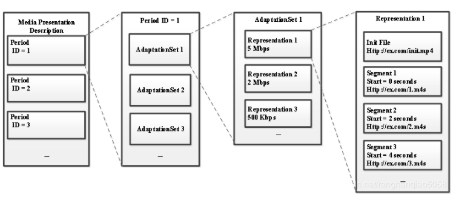
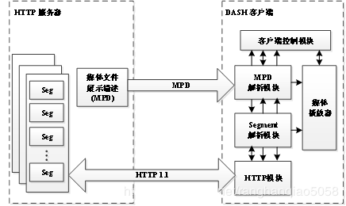
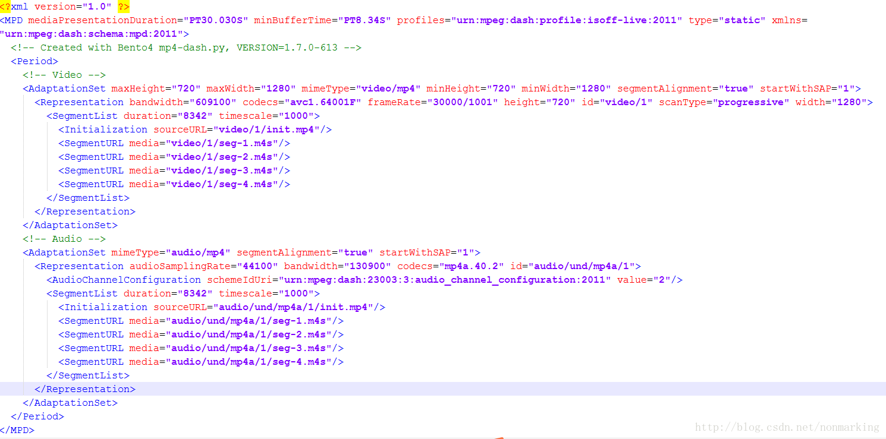
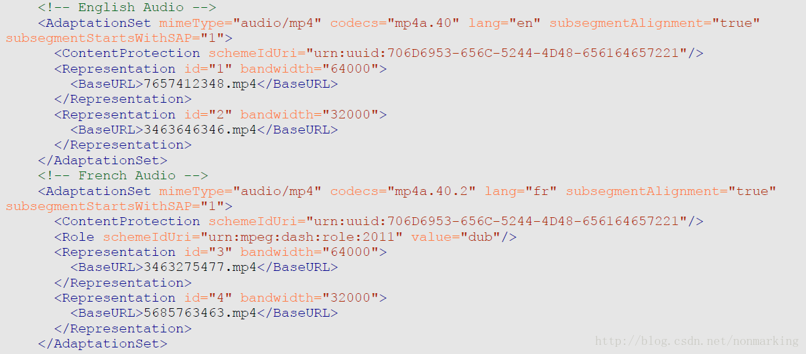
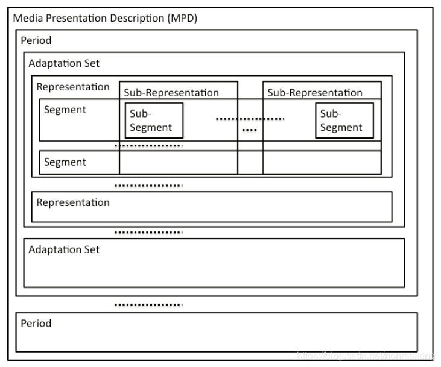
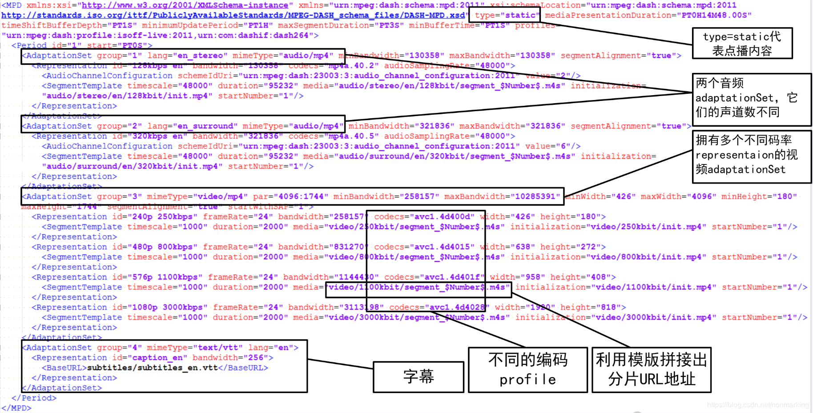

# 2.11MPEG-DASH
- [11.1简介](#11.1)
- [11.2DASH结构内容](#11.2)
- [11.3和TS格式比较](#11.3)
- [11.4搭建DASH服务器](#11.4)
- [11.5深入DASH](#11.5)

1.MPEG-DASH简介  
https://blog.csdn.net/TonyGoing/article/details/77141306  

2.自适应流媒体传输  
https://blog.csdn.net/nonmarking/article/details/85714099   

3.bento4相关工具下载   
https://www.bento4.com/downloads/   


## <a id="11.1">11.1简介</a>
DASH的全称是Dynamic Adaptive Streaming over HTTP。DASH是一种新的视频传输协议，由微软、苹果、Adobe等公司共同主导完成，MPEG-DASH是一种码流自适应的技术，它可以在网络上(利用HTTP web servers)传输高质量的媒体流。其主要特点是视频切片和基于HTTP传输，可以利用现有的HTTP网络架构（专门的服务器和CDN等）传输流媒体。MPEG-DASH可以实现动态无缝适应实时的网络条件并提供高质量的播放内容，拥有更少的卡顿，极大地提升了用户体验。  
DASH整个系统可以分成服务器和客户端两个模块，视频片段的封装格式，支持MPEG-2 TS、MP4等多种格式，并且，可以使用h.265,H.264,AVS,VP9等多种编码器进行编码。服务器端通过MPD（media presentation description）文件来描述媒体信息，包括，是直播还是点播、视频切片的大小，有几种不同的码率以及每个视频片段对应的URL地址等。客户端通过MPD文件就可以知道整个将要播放的媒体信息。  
与已有的采用 RTP 的方法相比，HTTP 不需要考虑防火墙的问题，并且可以充分利用已有的系统架构，如缓存、CDN 等。DASH本身也可以通过 WebSocket 和上层 push 等技术来支持低延迟的流推送, 而且不同于 HLS、HDS 和 Smooth Streaming，DASH 不关心编解码器，因此它可以接受任何编码格式编码的内容，如 HEVC、H.264、VP9 等。由于其多方面的优势，目前全景视频也主要采用 DASH 协议进行传输，而且DASH协议针对全景视频的的特性加入了一些特定功能以适应去全景视频的传输。  

## <a id="11.2">11.2DASH结构内容</a>
MPEG-DASH传输系统架构由HTTP服务器和DASH客户端两部分组成。HTTP服务器存储着DASH文件，主要包含两部分：媒体描述文件MPD和DASH媒体文件。DASH媒体文件主要由分段媒体文件和头信息文件两部分组成。  
客户端根据实时网络情况进行下载的演示图，首先HTTP 服务器端将媒体文件切分成一个个时间长度相等的小分片，每个分片被编码为不同大小的码率；这些分片可以通过GET请求下载，客户端通过评估自身的性能和带宽情况，下载相应码率的切片。码率切换以媒体分段为单位，当网络带宽较好时，客户端可以请求对应时间较高码率的媒体分段；而当带宽变差时，客户端则下载对应码率较低的下一个媒体分段。由于不同质量的媒体分段在时间上都是相互对齐的，因此不同质量的媒体分段之间切换时，画面是自然流畅的。  
为了精确描述DASH的结构内容，MPEG-DASH引入了Media Presentation Description (MPD)的概念。MPD是一个XML文件，它完整描述了DASH内容的所有信息，包括各类音视频参数、内容分段时长、不同媒体分段的码率和分辨率以及对应的访问地址URL等等，客户端通过首先下载并解析MPD文件，可获取到与自身性能和带宽最匹配的媒体分段。下图比较清晰地说明了MPD文件的分层结构关系。  


- period
一个DASH文件可以包含一个或多个Periods，每个Period代表一段连续的视频片段，假设一段码流有60s被划分为3个Periods，Period1为0-15s，Period2为16-40s，Period3为41-60s。在同一个Period内，可用的媒体内容的类型及其各个可用码率(Representation)都不会发生变更。直播情况下，MPD文件会发生实时变化，需要周期性地去服务器请求新的MPD文件，服务器可能会移除已过时的Period，添加新的Period，而新的Period中可能会出现新的可用码率，或者移除上一个Period中存在的某些码率。  

- AdaptationSet  
 	一个Period由一个或多个AdaptationSets组成。例如，一个自适应集包含同一视频内容的多个不同比特率的视频分段，另一个自适应集包含同一音频内容的多个不同比特率的视频分段。每个AdaptationSet包含了逻辑一致的可供切换的不同码率的码流（Representation)。例如，这些Representation具有相同的codec、language、resolution以及音频通道数(5.1，stereo等)。这些Representation中可能包含一个(ISO profile)或多个(TS profile)media content components，因为ISO profile的mp4或fmp4 segment中通常只含有一个视频或者音频内容，而TS profile中的TS segment同时含有视频和音频内容，当同时含有多个media component content时，每个被复用的media content component将被单独描述。  

- Representation
 	一个AdaptationSet由一组媒体内容配置可切换的Representations构成。每个Representation表示同一媒体内容但编码参数互不相同的音视频数据。包含了相同媒体内容的不同配置，即不同的分辨率、码率等，以供客户端根据自身的网络条件和性能限制来选择合适的版本下载播放。  

- Representation
一个AdaptationSet由一组媒体内容配置可切换的Representations构成。每个Representation表示同一媒体内容但编码参数互不相同的音视频数据。包含了相同媒体内容的不同配置，即不同的分辨率、码率等，以供客户端根据自身的网络条件和性能限制来选择合适的版本下载播放。  

- Segment  
每个Representation中的内容按时间或者其他规则被切分成一段段Segments，使得客户端在播放时能够灵活地在不同的Representations之间进行切换。每个Segment都有一个唯一的与之对应的URL地址，也可能由相同的URL与不同的byte range指定。DASH客户端可以通过HTTP协议来获取URL对应的分片数据。MPD中描述Segment URL的形式包括Segment list，Segment template，Single segment。  


如图所示，DASH客户端根据MPD-URL向服务器发送请求获取MPD，客户端首先解析MPD内容，得到服务器端DASH文件的内容信息，包括视频分辨率、视频内容种类、分段情况、帧率、码率以及各个媒体内容的URL地址等媒体配置信息。DASH客户端通过分析上述DASH文件内容信息，根据当前网络状态以及客户端缓冲区的大小等选择合适的媒体版本。然后通过向服务器发送请求，根据媒体URL下载对应的媒体文件进行流式传输。客户端收到对应的媒体文件之后，进行解封装得到裸码流，最后送入解码器进行解码播放。  
Dash.js通过js基于dash的内核  

## <a id="11.3">11.3和TS格式比较</a>
参考链接：  
https://blog.csdn.net/nonmarking/article/details/54604396  

### 媒体数据与元数据的分离
在mp4格式中，元数据可以和媒体数据很好地分开存储，后者都在mdat box中，而在ts中，诸多es流和header/metadata信息是复用在一起的。  
元数据的分离允许我们在streaming中先读取各个流的元数据，知道他们的媒体内容的属性（比如不同的视频质量、不同的语言等），从而可以更好地在不同的media data之间做自适应切换。当然，在更实际的应用场景中，比如在dash协议中会直接把这些元数据信息写在mpd中，player可以只读一个mpd就知道各个媒体数据的属性。  

### 各个Track独立存储
在fmp4中，不仅媒体数据和metadata相互独立的存储，音视频track的数据也可以分开存储，这里的“分开”已经不仅仅局限于box层面的分开，而是真的可以分开存储于不同的目录。在这种情况下，player只需要读一个记录了它们各自存储位置的manifest，即可去对应的位置download它们的分片，只要做好音视频分片之间的同步工作，就可以正常的播放。  
举个例子，下面是一个dash中常见的mpd：  



在这个mpd中我们看到视频的分片都是存储在video/1/这个目录下，而音频分片都存储在audio/und/mp4a/1这个目录下，而player还是可以将它们拼接到一起完成播放。   
相对地，在streaming TS流时，音视频往往是复用在一起的，以HLS这个应用场景为例的话，server端一定还需要提前将TS切片做好，这样就会带来几个问题：  
1. 媒体文件存储成本和媒资管理成本增加
假设server端将video track编码为三个质量级别V1, V2, V3，audio track也被编码为三个质量级别A1, A2, A3，那么如果利用fmp4格式的特性，我们只需要存储这6份媒体文件，player在播放时再自主组合不同质量级别的音视频track即可。而对于TS，则不得不提前将3x3=9种不同的音视频复用情况对应的媒体文件都存储到server端，平白无故多出三份文件的存储成本。实际中，因为要考虑到大屏端、小屏端、移动端、桌面端、不同语言、不同字幕等各种情况，使用TS而造成的冗余成本将更加可观。同时，存储文件的增加也意味着媒资管理成本的增加。这也是包括Netflix在内的一些公司选择使用fmp4做streaming格式的原因。
2. manifest文件更加复杂
fmp4格式的特性可以确保每一个单独的媒体分片都是可解密可解码的（当然player需要先从moov box中读到它们的编解码等信息），这意味着server端甚至根本不需要真的存储一大堆分片，player可以直接利用byte range request技术从一个大文件中准确地读出一个分片对应的media data，这也使得对应manifest(mpd)文件可以更加简洁，如下：



针对不同语言的音频，都只需要存一个大文件就够了。  
相对地，在streaming TS流时，不得不在manifest（m3u8）文件中把成百上千个ts分片文件全都老老实实地记录下来。  
3. 服务器的cache效率会降低
实际的streaming应用场景中，往往需要cdn的支持，经常会被client请求的媒体分片就会存在距离client最近的edge server上。对于fmp4 streaming的情况，因为需要的文件更少，cache命中率也就更高，举个例子：可能某一个audio track会和其他各种video track组合，那么就可以将这个audio track放在edge server上，而不用每次都跟origin server去请求。
相对地，在streaming TS流时，因为每一个音视频组合的都需要以复用文件的形式存储，组合数又非常多，相当于分母大了，edge server就会有很大的几率没有缓存需要的组合而要去向orgin server请求。

### 对Trick-play的支持
所谓Trick-play，就是快进、快退、直接跳到章节起点、慢动作播放这些“花式”播放功能。支持这些功能往往意味着要快速找到播放流中的关键帧，以快进播放为例，如果利用fmp4格式的特点，可以通过只读取每个媒体分片的moof加上mdat的起始（包含了关键帧图像）部分即可，说白了就是通过只显示关键帧的方法达到“快进”的视觉效果。因为fmp4格式中可以保证每一个分片一定是以IDR帧开始的，这就使得上述的方案实现起来非常方便。
相对地，在streaming TS流时，没有办法保证关键帧一定在什么位置，所以你可能需要解析一大堆TS packets才能找到关键帧的位置。

### 无缝码流切换
无缝码流切换实现的关键在于：当第一个码流播放结束时，也就是发生切换的时间，第二个码流一定要以关键帧开始播放。在streaming TS流时，因为不能保证每一个TS chunk一定以关键帧开始，做码流切换时就意味着要同时download两个码流的相应分片，同时解析两个码流，然后找到关键帧对应的位置，才能切换。同时下载、解析两个码流的媒体内容对网络带宽以及设备性能都形成了挑战。而且有意思的是，如果当前网络环境不佳，player想要切换到低码率码流，结果还要在本来就不好的网络环境下同时进行两个码流的下载，可谓是雪上加霜。
而在fmp4中，除了保证各个分片一定以IDR帧开始外，还能保证不同码流的分片之间在时间线上是对齐的。而且streaming fmp4流时因为不要求音视频复用存储，也就意味着视频和音频的同步点可以不一样，视频可以全都以GOP边界作为同步点，音频可以都以sync frame作为同步点，这都使得无缝码流切换更简单。
TODO:介绍在分片中间进行切换的情况

### 与DRM的集成
所谓DRM即数字版权管理，说白了就是对流进行加密，这东西在国内用的不多，但是在国外可是每一个内容提供商必须要有的东西。和编码标准一样，业界也存在很多DRM方案，为了避免每采用一个新的加密方案就要重新编一个码流，MPEG推出了通用加密（CENC）标准（23001-7 - Common Encryption）。使用这一标准的码流，就可以将一个码流应用于各种不同的DRM方案。在DASH spec中，也定义了Content Protection字段来对应这种加密方案。
CENC使用的就是fMP4格式，这是利用了fMP4中音视频可以不复用同时还能提供独立于media data存储的metadata的特点。TS流就享受不了这样的好处了。TODO:介绍TS应用DRM的方法。

### 修改方便
我觉得还有一种优势，就是如果发现fmp4中哪一个地方需要删减界面或者增加内容，可以减少mpd的改动。这点是比regular MP4好的地方。   

### 结语
在以前的广播时代，每一个用户（player）只是被动的接收、播放码流，服务端可以简单地把一种码流推给所有用户（一对多），而如今的streaming，用户（player）的主动性更强，会根据自己的环境请求各种各样的码流（一对一），整个client-server模型都复杂了很多，在这样的背景下，TS流也就难免会有力不从心的时候。  

参考文献：Unifying Global Video Strategies - MP4 file fragmentation for broadcast, mobile and web delivery BY Timothy Siglin  


## <a id="11.4">11.4搭建DASH服务器</a>
参考链接：  
1.dash js地址  
https://www.bootcdn.cn/dashjs/   

2.dash.js  
https://github.com/Dash-Industry-Forum/dash.js    

3.构建简单的 MPEG-DASH 流媒体播放器  
https://blog.csdn.net/haima1998/article/details/38865023  

4.dash视频服务器本地搭建  
https://blog.csdn.net/weixin_30566063/article/details/98050109  

5.搭建dash直播, ffmpeg开启dash demutex  
https://www.jianshu.com/p/512cb67e35d1


过程:
1. 修改hosts, 添加:
127.0.0.1 www.testvideo.com
127.0.0.1 www.test.com
 

2. nginx配置1: (h5页面)
server {
        listen       80;
        server_name  www.test.com;

        location / {
            root    D:\server\code;
            index  index.php index.html;

        }
    }
 
nginx配置2: (视频), 重启nginx
server {
        listen       80;
        server_name  www.testvideo.com;

        location / {
            add_header Access-Control-Allow-Methods “GET,HEAD;
            add_header Accept-Ranges "bytes";
            add_header Access-Control-Allow-Origin "*";
            add_header Access-Control-Expose-Headers “Content-Lengrh,Content-Range,Date,Server,Transfer-Encoding,origin,range,x-goog-meta-foo1”;
            root    E:/video/fragment/output;

        }
    }
3. 准备HTML页面:
```js
 1 <!doctype html>
 2 <html>
 3     <head>
 4         <title>Dash.js Rocks</title>
 5         <style>
 6             video {
 7                 width: 640px;
 8                 height: 360px;
 9             }
10         </style> 
11     </head>
12     <body>
13         <div>
14             <video data-dashjs-player autoplay src="http://www.testvideo.com/stream.mpd" controls>
15             </video>
16         </div>
17         <script src="https://cdn.dashjs.org/latest/dash.all.min.js"></script> 
18     </body>
19 </html>
20 
21 //////////////////////或者
22 <!DOCTYPE html>
23 <html lang="en">
24 <head>
25     <meta charset="utf-8"/>
26     <title>Auto-player instantiation example, single videoElement, using src attribute</title>
27     <script src="https://cdn.dashjs.org/latest/dash.all.min.js"></script>
28     <!--dash.all.min.js should be used in production over dash.all.debug.js
29         Debug files are not compressed or obfuscated making the file size much larger compared with dash.all.min.js-->
30     <!--<script src="../../dist/dash.all.min.js"></script>-->
31 
32     <style>
33         video {
34             width: 640px;
35             height: 360px;
36         }
37     </style>
38 
39     <body>
40         <div>
41             <video controls="true" id="videoPlayer" />
42         </div>
43         <script>
44             (function(){
45                 var url = "http://www.testvideo.com/stream.mpd";
46                 var player = dashjs.MediaPlayer().create();
47                 player.initialize(document.querySelector("#videoPlayer"), url, true);
48             })();
49         </script> 
50     </body>
51 </html>
```

4. 下载原始视频
选择一个mp4视频下载到本地就可以了

5. 用ffmpeg工具处理视频
先下载安装ffmpeg, 然后将ffmpeg/bin 放到环境变量中, 要不然敲命令会很麻烦
我这里只是对原始视频用 ffmpeg视频处理了一下, 没有生成很多分辨率的视频, 所以目前只有一个视频文件
ffmpeg -i xxxx.mp4

6. 用bento4继续处理视频, 这个工具会把切好的视频放到当前目录的output目录中
先下载安装bento4, 然后将bento4/bin放到环境变量中, 要不然敲命令会很麻烦
mp4dash xxxx.mp4
这条命令处理完毕后会自动生成文件夹output, 这个output文件夹要跟nginx配置2中的root指令后边的值要一致

7. 访问 http://www.test.com/index.html 应该就有视频可以播放了

## <a id="11.5">11.5深入DASH</a>
参考链接：   
https://blog.csdn.net/nonmarking/article/details/85714099  

在自适应流媒体传输系统中所使用的两种封装格式fmp4和ts，都是从比较宏观的角度进行的介绍。  
在MPEG-DASH中将一组不同编码参数的媒体内容和相应的描述集合定义为媒体展示（presentation）。这里的媒体内容是由单个或多个时间上连续的媒体时段（period）组成的，这些媒体时段的内容相互之间可能完全独立，例如在正片中插入的广告内容。每一个媒体时段包含一个或多个媒体内容组件（media content component），比如不同语言的音频组件、为同一节目提供不同视角的视频组件、不同语言的字幕组件等。每一个媒体内容组件都有对应的媒体组件类型（media content component type）标识，比如音频（audio）或视频（video）。每一个媒体内容组件可能有多个编码的版本（encoded version），被称为媒体流（media streams）。每一个媒体流继承了媒体内容、媒体时段和媒体内容组件的属性，同时还拥有自己的编码参数属性，例如码率、分辨率、编码器类型等等。MPD文件就是用来描述上面所提到的抽象概念和它们之间的关系的元数据文件。一个典型的MPD文件结构如下图所示：  



DASH系统中的MPD文件是用XML编写的，其中的关键元素和各元素之间的嵌套关系在上图中得到了展示。由上图可以看到，一个MPD文件包含了如下的关键元素：

- 媒体时段（Period）:媒体时段的概念如前所述，需要说明的是，在传输直播流时，可能会随着MPD文件更新而移除旧Period并加入新Period，通过这种方法达到直播的效果。一个媒体时段内可用媒体内容的编码版本不会变更，即可选的码率集合、语言集合、字幕集合不会再改变。  
- 自适应集合（Adaptation Set）:在MPD文件中，一个媒体时段由一个或者多个自适应集合组成，每一个自适应集合对应前面所提到的媒体内容组件。  
- 媒体文件描述（Representation）:在MPD文件中，每个自适应集合由一个或多个媒体文件描述构成，具体来说，具有相同语言、内容类型、图像宽高比属性的媒体文件描述才会被组织到同一个自适应集合中。每个媒体文件描述对应一个可独立解码播放的媒体流（其概念如前所述）。  MPEG-DASH中的自适应切换就是根据网络环境或其他因素在同一个自适应集合的不同媒体文件描述之间进行切换。媒体文件描述是MPD中最小的抽象集合概念。  
- 切片（Segment）：在MPD文件中，每个媒体文件描述由一个或多个一定时长的切片组成，每个切片都对应各自的URL，或对应同一URL的不同字节范围（byte range）。在MPEG-DASH中，一个切片就对应一次HTTP请求可以取回的最大数据单元。关于切片的时长，需要说明的是一个媒体文件描述中的切片往往具有完全相同或近似相同的时长，不同媒体文件描述之间的切片时长可能不同。切片时长可以任意定义，但是切片时长往往代表了端到端传输延时的下界，所以在直播应用时一般会选择比较短的切片时长。在前面提到所谓自适应切换就是在同一个自适应集合的不同媒体文件描述之间进行切换，更具体地说，就是在播放完一个媒体文件描述的一个切片之后紧接着播放另一个媒体文件描述的一个切片，在这样的切换机制下，可以避免在客户端同时下载、解码来自不同媒体文件描述的多个切片，使得切换动作的实现更加简单。  
此外，MPEG-DASH中还定义了一些可选的结构，比如子描述（Sub-Representation）、子切片（Sub-Segment）等下面是一个MPD文件示例，通过该MPD可以了解到：这是一个点播服务流，包含一个媒体时段，该媒体时段包含四个媒体内容组件，对应四个自适应集合，分别是双声道音频、环绕声音频、字幕、视频。两个音频媒体内容组件又分别提供了一个编码的版本，而视频媒体内容组件则提供了四个编码的版本，对应四个媒体文件描述。  

> Period媒体时段60秒分发20*3时间端直播是实时更新，Adaptation Set包含自适应集合比如字幕视频音频不同比特率等，Representation包含编码参数互不相同不同profile音视频，Segment代表切片。



```xml
<!--profiles:不同的profile对应不同的MPD要求和Segment格式要求
mediaPresentationDuration:整个节目的时长
minBufferTime:至少需要缓冲的时间
type:点播对应static，直播对应dynamic
availabilityStartTime="2016-06-28T08:16:57Z":如果是直播流的话,则必须提供,代表MPD中所有Seg从该时间开始可以request了
minimumUpdatePeriod="PT10H":至少每隔这么长时间,MPD就有可能更新一次,只用于直播流-->
<MPD xmlns="urn:mpeg:DASH:schema:MPD:2011" 
    xmlns:ytdrm="http://youtube.com/ytdrm" 
    mediaPresentationDuration="PT0H3M1.63S" 
    minBufferTime="PT1.5S" 
    profiles="urn:mpeg:dash:profile:isoff-on-demand:2011"
    type="static">
  <!-- Ad content-->
  <!--duration:Period的时长;start:Period的开始时间-->
  <Period duration="PT30S" start="PT0S">
     <!--BaseURL:相当于根目录,该元素可以在MPD\Period\AdaptationSet\Representation同时出现,若同时出现,则层层嵌套;
     在每一层也可以出现多次,默认使用第一个BaseURL-->
     <BaseURL>ad/</BaseURL>
     <!-- 广告部分的内容可以在720p和1080p之间切换,分别对应两个representation,这两个representation组成一个AdaptationSet;
	几个rep如果要组成一个AS,它们的lang(语言)\contentType\par(宽高比)必须相同;
	segmentAlignment:如果为true,则代表该AS中的segment互不重叠
	startWithSAP:每个Segment的第一帧都是关键帧-->
     <AdaptationSet mimeType="video/mp4" minWidth="1280" par="16:9" contentType="video" maxWidth="1920" minHeight="720" segmentAlignment="true" startWithSAP="1" maxHeight="1080">
         <!-- 720p Representation at 3.2 Mbps;在Representation 层可能出现和AS层重复的属性,以最内层的定义为准-->
         <Representation id="AD720p" bandwidth="3200000" width="1280" height="720" codecs="avc1.640028" mimeType="video/mp4">
             <!--第一种Segment组织形式:BaseURL+SegmentBase;
		适用于每个rep只有一个Seg的情况,往往配合Initialization指定seg初始化信息的byte-range以及indexRange指定Segment index的byterange;
		对于ISO base媒体格式,Initialization部分即对应ftyp+moov这两个box的内容,不能包含任何moof的内容,moov中不能包含media data.关于这些box的含义参见本系列第二篇文章和14496标准;
		对于ISO base媒体格式,Segment Index部分即对应sidx box的内容.标准规定一个Seg又可以切分为多个SubSeg,对应整个Seg的一部分数据,用Segment Index来描述,
		同时,SubSeg还可以进一步切分,即嵌套. 
		sidx box在文件的头部位置,client可以先读取这部分数据,后续就可以只用partial request的方法请求需要的信息,而不用获取全部信息,
		这样的设计主要是为了Seek的方便.实际上通常一个SubSeg就对应一个moof+mdat的内容.
		一个实际的sidx参见本系列第二篇文章和14496标准;
		因为上一个BaseURL的存在,在本示例中的range都对应xxxx.com/ad/720p.mp4这个文件 -->
             <BaseURL>720p.mp4</BaseURL>
             <SegmentBase indexRange="2789-3264">
          	<Initialization range="0-2788" />
             </SegmentBase>
         </Representation>
         <!-- 1080p Representation at 6.8 Mbps -->
         <Representation id="AD1080p" bandwidth="6800000" width="1920" height="1080" codecs="avc1.640028" mimeType="video/mp4">
             <BaseURL>1080p.mp4</BaseURL>
             <SegmentBase indexRange="2755-3230">
          	<Initialization range="0-2754" />
             </SegmentBase>
         </Representation>
     </AdaptationSet>
  </Period>
  <!-- Normal Content -->
  <!--这个Period的开始时间=上一个Period的start+duration-->
  <Period duration="PT0H3M1.63S">
    <!--正片部分的第一个AdaptationSet ,由不同视频码率\分辨率的几个Rep组成-->
    <AdaptationSet mimeType="video/mp4" minWidth="1280" par="16:9" contentType="video" maxWidth="1920" minHeight="720" segmentAlignment="true" startWithSAP="1" maxHeight="1080">
      <!--对AS中媒体内容类型的描述-->	
      <ContentComponent contentType="video" id="1" />
      <!--ContentProtection元素提供了与DRM有关的信息,多个ContentProtection元素即代表当前的DASH内容支持多种DRM方案;
	schemeIdUri属性的内容对应所用DRM方案的uuid值,为了让多种DRM方案可以解密相同的文件,一般都遵循通用加密标准,即CENC,
	在DASH标准中规定cenc对应的schemeIdUri是urn:mpeg:dash:mp4protection:2011,在指明了cenc之后,可以再利用CP元素指定其他的DRM方案,
	具体的uuid-DRM方案对应列表参见http://dashif.org/identifiers/protection/，示例中的edef8ba9-79d6-4ace-a3c8-27dcd51d21ed对应的就是Widevine方案;
	value属性的内容一般是为对应DRM方案提供补充信息的,标准中规定了CENC对应的value值,即schm(scheme type)box中对应的值:cenc. 
	对于其他的DRM方案,它们的一些初始信息一般放在cenc:pssh元素中,其内容对应pssh(protection scheme specific header) box中内容,
	这些信息是BASE64编码的,示例中的内容解码后就可以看到实际包含了contentID和providerID的信息(在本示例中是2015_tears*AUDIO和widevine_test).
	如果是Playready方案,这个pssh中还可能包含了license server的url信息,至于Widevine方案,包括ExoPlayer在内的很多实现都是把license server的url写死在播放器的实现里面的,显然这是一个需要自己做扩展的地方.
	解密内容需要的KID定义在tenc(track encryption) box中,IV定义在senc(Sample Encryption) box中,同时cenc规定的加密算法是AES-CTR,至此,一个DRM系统需要的各种信息基本都有了;
	上面提到的cenc相关内容参见23001-7标准;-->
      <ContentProtection value="cenc" schemeIdUri="urn:mpeg:dash:mp4protection:2011" cenc:default_KID="7862029a-3d0d-58ea-a4f6-5bdf308646a9"/>
      <ContentProtection schemeIdUri="urn:uuid:edef8ba9-79d6-4ace-a3c8-27dcd51d21ed">
	<cenc:pssh>
		AAAAR3Bzc2gAAAAA7e+LqXnWSs6jyCfc1R0h7QAAACcIARIBMBoNd2lkZXZpbmVfdGVzdCIKMjAxNV90ZWFycyoFQVVESU8=	
	</cenc:pssh>
      </ContentProtection>
      <Representation bandwidth="4190760" codecs="avc1.4d401f" height="1080" id="1" mimeType="video/mp4" width="1920">
	<!--这次只在Representation 层有BaseURL,于是所有的range都对应xxxx.com/car-cenc-20120827-89.mp4这个文件-->
        <BaseURL>car_cenc-20120827-89.mp4</BaseURL>
        <SegmentBase indexRange="2755-3230">
          <Initialization range="0-2754" />
        </SegmentBase>
      </Representation>
      <Representation bandwidth="2073921" codecs="avc1.4d401f" height="720" id="2" mimeType="video/mp4" width="1280">
	<!--第二种Segment组织形式:(BaseURL)+SegmentList.SegmentList很好理解,就是一个SegmentURL的列表,每一个URL就对应一个可request的Segment;
	    必须指定duration:每个Seg的时长(s);
	    这里指定了一个BaseURL,则每一个SegmentURL实际对应的是xxxx.com/SegmentListExample/segment-1.m4s-->
	<BaseURL>SegmentListExample/</BaseURL>
	<SegmentList duration="2">
	   <!--这里也有一个Initialization元素,它的实际内容也是ftyp+moov-->
           <Initialization sourceURL="car_cenc-20120827-88.mp4"/>
	   <!--每一个SegmentURL对应的media content往往就是sidx+moof+mdat;
		由此我们可以理解这种Seg组织形式与第一种是类似的,只不过把每一个抽象的SubSeg具体的表达出来;
		对于每一个Seg的格式,标准中也有一些要求:每个segment可以包含一个styp box,如果包含了,应该有msdh和msix brand;
		应该包含一个或多个moof+mdat的组合;可以包含一个或多个sidx,需要放在moof之前-->
           <SegmentURL media="segment-1.m4s"/>
           <SegmentURL media="segment-2.m4s"/>
           <SegmentURL media="segment-3.m4s"/>
           <SegmentURL media="segment-4.m4s"/>
           <SegmentURL media="segment-5.m4s"/>
           <SegmentURL media="segment-6.m4s"/>
           <SegmentURL media="segment-7.m4s"/>
           <SegmentURL media="segment-8.m4s"/>
           <SegmentURL media="segment-9.m4s"/>
           <SegmentURL media="segment-10.m4s"/>
        </SegmentList>
      </Representation>
    </AdaptationSet>
    <!--正片部分的第二个AdaptationSet ,由音频Representation 组成,它们的语言都是英语-->
    <AdaptationSet mimeType="audio/mp4" lang="en" startWithSAP="1" contentType="audio" segmentAlignment="true">
      <ContentComponent contentType="audio" id="2" />
      <Representation bandwidth="255236" codecs="mp4a.67.02" id="3" mimeType="audio/mp4" audioSamplingRate="44100" startWithSAP="1">
	<!--声道数,在value中指明-->
	<AudioChannelConfiguration schemeIdUri="urn:mpeg:dash:23003:3:audio_channel_configuration:2011" value="2"/>
	<!--第三种Segment组织形式:(BaseURL)+SegmentTemplate+SegmentTimeline;
	SegmentTemplate同样可以指定init信息,它的内容依然是ftyp+moov;
	media指定用来生成Segment列表的模板,可以包含的通配符有$RepresentationID$\$Bandwidth$\$Number$\$Time$,
	Number对应Seg的序号,Time对应Seg的起始时间.Time和Number只能取其一.-->
        <SegmentTemplate initialization="audio/en/init.mp4" media="audio/en/seg-$Number$.m4f" startNumber="1" timescale="90000">
	     <!--SegmentTimeline的作用是帮助client知道服务器端有多少个Segment;
		一个SegmentTimeline元素有多个S元素组成,每个S元素包含三个属性:@t(start time)\@r(repeat count)\@d(duration)
		这里的示例表示从时间0开始,有10个Seg,每个Seg的duration是5400000/90000(sec);
		最后得到的实际Seg URL就是xxx.com/audio/en/seg-1.m4f-->
	     <SegmentTimeline>
		<S t="0" r="10" d="5400000"/>
	     </SegmentTimeline>
	</SegmentTemplate>
      </Representation>
      <Representation bandwidth="31749" codecs="mp4a.67.02" id="4" mimeType="audio/mp4" audioSamplingRate="22050" startWithSAP="1">
        <BaseURL>car_cenc-20120827-8b.mp4</BaseURL>
        <SegmentBase indexRange="2673-2932">
          <Initialization range="0-2672" />
        </SegmentBase>
      </Representation>
    </AdaptationSet>
    <!--正片部分的第三个AdaptationSet,也是由音频Representation 组成,但是它们的语言是法语-->
    <AdaptationSet lang="fr" mimeType="audio/mp4" contentType="audio" segmentAlignment="true" startWithSAP="1">
	<AudioChannelConfiguration schemeIdUri="urn:mpeg:dash:23003:3:audio_channel_configuration:2011" value="2"/>
	<!--第三种Seg组织形式的变体:(BaseURL)+SegmentTemplate+duration-->
	<!--因为init信息不包含实际的媒体内容,所以duration为0-->
	<SegmentTemplate initialization="audio/fr_init.mp4" duration="0"/>
	<Representation id="5" mimeType="audio/mp4" codecs="mp4a.67.02" audioSamplingRate="48000" startWithSAP="1" bandwidth="63008">
		<!--与前一种形式不同,这里没有具体指定每个Seg的duration,而只有一个duration值,
		这个值可能是不精确的,这也是不使用SegmentTimeline的一大劣势.duration(sec)=duration/timescale-->		
		<SegmentTemplate timescale="1000" duration="9941" media="audio/64kbps/redbull_audio_64kbps_segment$Number$.m4s" startNumber="1"/>
	</Representation>
    </AdaptationSet>
  </Period>
</MPD>

```


## links
  * [目录](<音视频入门到精通目录.md>)
  * 下一节: [2.12HLS](<2.12HLS.md>)