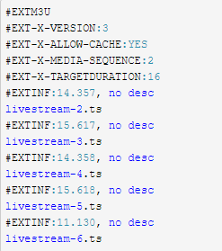
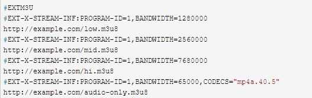

# 2.12HLS
- [12.1简介](#12.1)
- [12.2HLS 之 M3U8](#12.2)
- [12.3基础概念](#12.3)

1. RFC  
https://tools.ietf.org/html/draft-pantos-http-live-streaming-18  
2.HLS协议解析  
https://www.cnblogs.com/jimodetiantang/p/9133564.html  

## <a id="12.1">12.1简介</a>
HLS（HTTP Live Streaming） 把整个流分成一个个小的基于 HTTP 的文件来下载，每次只下载一些。HLS 协议由三部分组成：HTTP、M3U8、TS。这三部分中，HTTP 是传输协议，M3U8 是索引文件，TS 是音视频的媒体信息。  
HLS 的 m3u8，是一个 ts 的列表，也就是告诉浏览器可以播放这些 ts 文件，譬如：  
```Go
#EXTM3U
#EXT-X-VERSION:3
#EXT-X-MEDIA-SEQUENCE:64
#EXT-X-TARGETDURATION:12
#EXTINF:11.550
livestream-64.ts
#EXTINF:5.250
livestream-65.ts
#EXTINF:7.700
livestream-66.ts
#EXTINF:6.850
livestream-67.ts
```

有几个关键的参数，这些参数在SRS的配置文件中都有配置项：  
- EXT-X-TARGETDURATION：所有切片的最大时长。有些 Apple 设备这个参数不正确会无法播放。SRS 会自动计算出 ts 文件的最大时长，然后更新 m3u8 时会自动更新这个值。用户不必自己配置。  
- EXTINF：ts 切片的实际时长，SRS 提供配置项 hls_fragment，但实际上的 ts 时长还受 gop 影响。
- ts 文件的数目：SRS 可配置 hls_window，指定 m3u8 中保存多少个切片，SRS 会自动清理旧的切片。
- livestream-67.ts：SRS 会自动维护 ts 切片的文件名，在编码器重推之后，这个编号会继续增长，保证流的连续性。直到 SRS 重启，这个编号才重置为 0。  
譬如，每个 ts 切片为 10 秒，窗口为 60 秒，那么 m3u8 中会保存 6 个 ts 切片。  
每一个 .m3u8 文件，分别对应若干个 ts 文件，这些 ts 文件才是真正存放视频的数据，m3u8 文件只是存放了一些 ts 文件的配置信息和相关路径，当视频播放时，.m3u8 是动态改变的，video 标签会解析这个文件，并找到对应的 ts 文件来播放，所以一般为了加快速度，.m3u8 放在 web 服务器上，ts 文件放在 cdn 上。.m3u8 文件，其实就是以 utf-8 编码的 m3u 文件，这个文件本身不能播放，只是存放了播放信息的文本文件。  

```Go
HLS 协议编码格式要求
视频的编码格式：H264
音频的编码格式：AAC、MP3、AC-3
视频的封装格式：ts
保存 ts 索引的 m3u8 文件
HLS 协议优势
HLS 相对于 RTMP 来讲使用了标准的 HTTP 协议来传输数据，可以避免在一些特殊的网络环境下被屏蔽。HLS 相比 RTMP 在服务器端做负载均衡要简单得多。因为 HLS 是基于无状态协议 HTTP 实现的，客户端只需要按照顺序使用下载存储在服务器的普通 ts 文件进行播放就可以。而 RTMP 是一种有状态协议，很难对视频服务器进行平滑扩展，因为需要为每一个播放视频流的客户端维护状态。HLS 协议本身实现了码率自适应，在不同带宽情况下，设备可以自动切换到最适合自己码率的视频播放。
```
HLS 协议缺点  
HLS 协议在直播的视频延迟时间很难做到 10 s 以下延时，而 RTMP 协议的延时可以降到 3s-4s 左右。  
支持的 Media Segment 格式  
MPEG-2 Transport Streams即最常见的 TS 文件.RFC: ISO_13818.  
Fragmented MPEG-4即常提到的 fMP4.RFC: ISOBMFF.  

## <a id="12.2">12.2HLS 之 M3U8</a>
m3u8 文件是用文件方式对媒体文件进行描述，由一些列标签组成。  
m3u8 文件示例 1：单码率适配流  


m3u8 文件示例 2：多码率适配流  


包含多种比特率的 Master Playlist。该文件是一个实际使用中的顶级 m3u8 文件，该文件中又定义了 http://example.com/low.m3u8、http://example.com/mid.m3u8等几个二级文件。顶级 m3u8 文件主要是做码率适配的，二级 m3u8 才是真正的切片文件，客户端会默认选择码率最高的请求，如果发现码率达不到，会请求降低码率的流。客户端拿到二级 m3u8 文件后，会继续请求里面的文件，这时就可以进行播放了。  

- Basic Tags
Basic Tags 可以用在 Media Playlist 和 Master Playlist 里面.  
EXTM3U: 必须在文件的第一行, 标识是一个 Extended M3U Playlist 文件.  
EXT-X-VERSION: 表示 Playlist 兼容的版本.  

- Media Segment Tags
每一个 Media Segment 通过一系列的 Media Segment tags 跟一个 URI 来指定. 有的 Media Segment tags 只应用与下一个 segment, 有的则是应用所有下面的 segments. 一个 Media Segment tag 只能出现在 Media Playlist 里面.  
```Go
EXTINF: 用于指定 Media Segment 的 duration
EXT-X-BYTERANGE: 用于指定 URI 的 sub-range
EXT-X-DISCONTINUITY: 表示不连续.
EXT-X-KEY: 表示 Media Segment 已加密, 该值用于解密.
EXT-X-MAP: 用于指定 Media Initialization Section.
EXT-X-PROGRAM-DATE-TIME: 和 Media Segment 的第一个 sample 一起来确定时间戳.
EXT-X-DATERANGE: 将一个时间范围和一组属性键值对结合到一起.
```

- Media Playlist Tags
Media Playlist tags 描述 Media Playlist 的全局参数. 同样地, Media Playlist tags 只能出现在 Media Playlist 里面.  
```Go
EXT-X-TARGETDURATION: 用于指定最大的 Media Segment duration.
EXT-X-MEDIA-SEQUENCE: 用于指定第一个 Media Segment 的 Media Sequence Number.
EXT-X-DISCONTINUITY-SEQUENCE: 用于不同 Variant Stream 之间同步.
EXT-X-ENDLIST: 表示结束.
EXT-X-PLAYLIST-TYPE: 可选, 指定整个 Playlist 的类型.
EXT-X-I-FRAMES-ONLY: 表示每个 Media Segment 描述一个单一的 I-frame.
```

- Master Playlist Tags
Master Playlist tags 定义 Variant Streams, Renditions 和 其他显示的全局参数. Master Playlist tags 只能出现在 Master Playlist 中.  
```Go
EXT-X-MEDIA: 用于关联同一个内容的多个 Media Playlist 的多种 renditions.
EXT-X-STREAM-INF: 用于指定一个 Variant Stream.
EXT-X-I-FRAME-STREAM-INF: 用于指定一个 Media Playlist 包含媒体的 I-frames.
EXT-X-SESSION-DATA: 存放一些 session 数据.
EXT-X-SESSION-KEY: 用于解密.
Media or Master Playlist Tags
这里的 tags 可以出现在 Media Playlist 或者 Master Playlist 中. 但是如果同时出现在同一个 Master Playlist 和 Media Playlist 中时, 必须为相同值.
EXT-X-INDEPENDENT-SEGMENTS: 表示每个 Media Segment 可以独立解码.
EXT-X-START: 标识一个优选的点来播放这个 Playlist.
```

## <a id="12.3">12.3基础概念</a>
Playlist file  
一个 m3u 的 Playlist 就是一个由多个独立行组成的文本文件，每行由回车/换行区分。每一行可以是一个 URI、空白行或是一个 以 "#" 号开头的字符串，并且空格只能存在于一行中不同元素间的分隔。  
一个 URI 表示一个媒体段或是 "variant Playlist file"（最多支持一层嵌套，即一个 m3u8 文件中嵌套另一个 m3u8），以 "EXT" 开头的表示一个 "tag"，否则表示注释，直接忽略。  
Tags  

- 1.#EXTM3U：
每个 m3u8 文件第一行必须是这个 tag，如上面的两个示例。

- 2.#EXTINF：
指定每个媒体段（ts）的持续时间，这个仅对其后面的 URI 有效，每两个媒体段 URI 间被这个 tag 分隔开其格式为：  

```Go
#EXTINF:<duration>,<title>  
duration：表示持续的时间（秒），"Durations MUST be integers if the protocol version of the Playlist file is
less than 3"，否则可以是浮点数。
```

- 3.#EXT-X-BYTERANGE：
表示媒体段是一个媒体 URI 资源中的一段，只对其后的 media URI 有效，  
```Go
格式为：#EXT-X-BYTERANGE:<n>[@o]  
n：表示这个区间的大小  
o：表示在 URI 中的 offset  
The EXT-X-BYTERANGE tag appeared in version 4 of the protocol  
```

- 4.#EXT-X-TARGETDURATION：  
指定当前视频流中的单个切片（即 ts）文件的最大时长（秒）。所以 #EXTINF 中指定的时间长度必须小于或是等于这个最大值。这个 tag 在整个 Playlist 文件中只能出现一次（在嵌套的情况下，一般有真正 
```Go 
ts url 的 m3u8 才会出现该 tag）。格式为：#EXT-X-TARGETDURATION:<s>  
s：表示最大的秒数。  
```

- 5.#EXT-X-MEDIA-SEQUENCE：
每一个 media URI 在 Playlist 中只有唯一的序号，相邻之间序号 +1。  
格式为：#EXT-X-MEDIA-SEQUENCE:<number>。一个 media URI 并不是必须要包含的，如果没有，默认为 0.  

- 6.#EXT-X-KEY：
表示怎么对 media segments 进行解码。其作用范围是下次该 tag 出现前的所有 media URI。格式为：#EXT-X-KEY:<attribute-list>
NONE 或者 AES-128。如果是 NONE，则 URI 以及 IV 属性必须不存在，如果是 AES-128(Advanced Encryption Standard)，则 URI 必须存在，IV 可以不存在。  
对于 AES-128 的情况，keytag 和 URI 属性共同表示了一个 key 文件，通过 URI 可以获得这个 key，如果没有 IV（Initialization Vector），则使用序列号作为 IV 进行编解码，将序列号的高位赋到 16 个字节的 buffer 中，左边补 0；如果有 IV，则将该值当成 16 个字节的 16 进制数。  

- 7.#EXT-X-PROGRAM-DATE-TIME  
将一个绝对时间或是日期和一个媒体段中的第一个 sample 相关联，只对下一个 media URI 有效，格式如下：    #EXT-X-PROGRAM-DATE-TIME:<YYYY-MM-DDThh:mm:ssZ>   
例如：#EXT-X-PROGRAM-DATE-TIME:2010-02-19T14:54:23.031+08:00  

- 8.#EXT-X-ALLOW-CACHE：
是否允许做 cache，这个可以在 Playlist 文件中任意地方出现，并且最多只出现一次，作用效果是所有的媒体段。格式如下：  #EXT-X-ALLOW-CACHE:<YES|NO>  

- 9.#EXT-X-PLAYLIST-TYPE： 
提供关于 Playlist 的可变性的信息，这个对整个 Playlist 文件有效，是可选的，格式如下：#EXT-X-PLAYLIST-TYPE:<EVENT|VOD>
VOD，即为点播视频，服务器不能改变 Playlist 文件，换句话说就是该视频全部的 ts 文件已经被生成好了  
EVENT，就是实时生成 m3u8 和 ts 文件。服务器不能改变或是删除 Playlist 文件中的任何部分，但是可以向该文件中增加新的一行内容。它的索引文件一直处于动态变化中，播放的时候需要不断下载二级 index 文件  

- 10.#EXT-X-ENDLIST：
表示 m3u8 文件的结束，live m3u8 没有该 tag。它可以在 Playlist 中任意位置出现，但是只能出现一个，格式如下：#EXT-X-ENDLIST  

- 11.#EXT-X-MEDIA：
被用来在 Playlist 中表示相同内容的不同语种/译文的版本，比如可以通过使用 3 个这种 tag 表示 3 种不同语音的音频，或者用 2 个这个 tag 表示不同角度的 video。在 Playlist 中，这个标签是独立存在的，其格式如下：#EXT-X-MEDIA:<attribute-list>  
该属性列表中包含：URI、TYPE、GROUP-ID、LANGUAGE、NAME、DEFAULT、AUTOSELECT。  
URI：如果没有，则表示这个 tag 描述的可选择版本在主 PlayList 的 EXT-X-STREAM-INF 中存在
TYPE：AUDIO and VIDEO  
GROUP-ID：具有相同 ID 的 MEDIAtag，组成一组样式  
LANGUAGE：identifies the primary language used in the rendition  
NAME：The value is a quoted-string containing a human-readable description of the rendition. If the LANGUAGE   attribute is present then this description SHOULD be in that language  
DEFAULT：YES 或是 NO，默认是 No，如果是 YES，则客户端会以这种选项来播放，除非用户自己进行选择  
AUTOSELECT：YES 或是 NO，默认是 No，如果是 YES，则客户端会根据当前播放环境来进行选择（用户没有根据自己偏好进行选择的前提下）
The EXT-X-MEDIA tag appeared in version 4 of the protocol  

- 12 .#EXT-X-STREAM-INF：
指定一个包含多媒体信息的 media URI 作为 Playlist，一般做 m3u8 的嵌套使用，它只对紧跟后面的 URI 有效，格式如下：  #EXT-X-STREAM-INF:<attribute-list>  
常用的属性如下：  
BANDWIDTH：带宽，必须有  
PROGRAM-ID：该值是一个十进制整数，唯一地标识一个在 Playlist 文件范围内的特定的描述。一个 Playlist 文件中可能包含多个有相同 ID 的此 tag  
CODECS：指定流的编码类型，不是必须的  
RESOLUTION：分辨率  
AUDIO：这个值必须和 AUDIO 类别的 "EXT-X-MEDIA" 标签中 "GROUP-ID" 属性值相匹配  
VIDEO：同上  

- 13.#EXT-X-DISCONTINUITY：
当遇到该 tag 的时候说明以下属性发生了变化：  
file format  
number and type of tracks  
encoding parameters  
encoding sequence  
timestamp sequence  

- 14#ZEN-TOTAL-DURATION： 
表示这个 m3u8 所含 ts 的总时间长度  

## links
  * [目录](<音视频入门到精通目录.md>)
  * 下一节: [2.13RTMP](<2.13RTMP.md>)