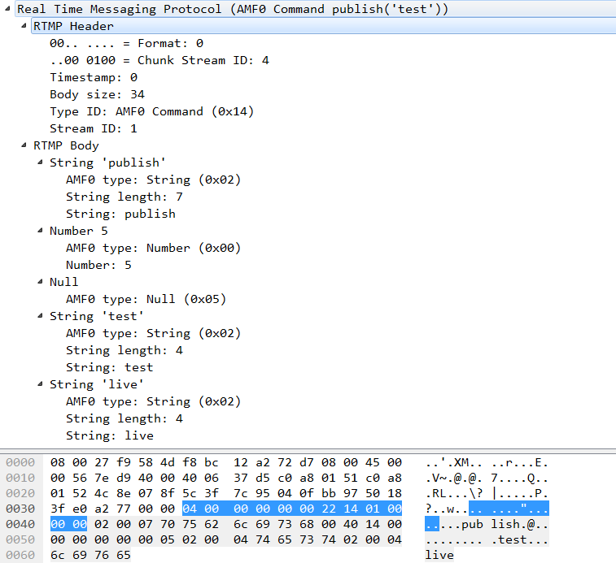

# 2.13RTMP
- [13.1简介](#13.1)
- [13.2RTMP握手过程](#13.2)
- [13.3消息块 Chunck Block](#13.3)
- [13.4附:FLV数据封装简单描述](#13.4)
- [13.5交互](#13.5)
- [13.6源码分析](#13.6)


1.RTMP 协议  
https://www.jianshu.com/p/d511d59b185c  
2.RTMP 协议精讲  
https://blog.csdn.net/mengzhengjie/article/details/93978828  
3.rtmp协议详解  
https://blog.csdn.net/weixin_42462202/article/details/88765245  

## <a id="13.1">13.1简介</a>
RTMP协议是Real Time Message Protocol(实时信息传输协议)的缩写，它是由Adobe公司提出的一种应用层的协议，用来解决多媒体数据传输流的多路复用（Multiplexing）和分包（packetizing）的问题。  
RTMP协议是应用层协议，是要靠底层可靠的传输层协议（通常是TCP）来保证信息传输的可靠性的。在基于传输层协议的链接建立完成后，RTMP协议也要客户端和服务器通过“握手”来建立基于传输层链接之上的RTMP Connection链接，在Connection链接上会传输一些控制信息，如SetChunkSize,SetACKWindowSize。其中CreateStream命令会创建一个Stream链接，用于传输具体的音视频数据和控制这些信息传输的命令信息。RTMP协议传输时会对数据做自己的格式化，这种格式的消息我们称之为RTMP Message，而实际传输的时候为了更好地实现多路复用、分包和信息的公平性，发送端会把Message划分为带有Message ID的Chunk，每个Chunk可能是一个单独的Message，也可能是Message的一部分，在接受端会根据chunk中包含的data的长度，message id和message的长度把chunk还原成完整的Message，从而实现信息的收发。  
RTMP 工作在 TCP 之上，默认使用端口 1935；  
RTMPE 在 RTMP 的基础上增加了加密功能；  
RTMPT 封装在 HTTP 请求之上，可穿透防火墙；  
RTMPS 类似 RTMPT，增加了 TLS/SSL 的安全功能； 
RTMP 协议中数据都是大端  

RTMP协议规定，播放一个流媒体有两个前提步骤：第一步，建立一个网络连接（NetConnection）；第二步，建立一个网络流（NetStream）。其中，网络连接代表服务器端应用程序和客户端之间基础的连通关系。网络流代表了发送多媒体数据的通道。

## <a id="13.2">13.2RTMP握手过程</a>
要建立一个有效的RTMP Connection链接，首先要“握手”:客户端要向服务器发送C0,C1,C2（按序）三个chunk，服务器向客户端发送S0,S1,S2（按序）三个chunk，然后才能进行有效的信息传输。RTMP协议本身并没有规定这6个Message的具体传输顺序，但RTMP协议的实现者需要保证这几点：  
- 客户端要等收到S1之后才能发送C2
- 客户端要等收到S2之后才能发送其他信息（控制信息和真实音视频等数据）
- 服务端要等到收到C0之后发送S1
- 服务端必须等到收到C1之后才能发送S2
- 服务端必须等到收到C2之后才能发送其他信息（控制信息和真实音视频等数据）
即服务器每个都要等C，客户端需要等c1 c2  
在保证握手的身份验证功能的基础上尽量减少通信的次数，一般的发送顺序是这样的，这一点可以通过wireshark抓ffmpeg推流包进行验证：

｜client   ｜Server ｜  
｜－－－C0+C1—  ->|  
｜<－－S0+S1+S2– --- |  
｜－－－C2-－－－>｜  
C0和S0的格式（1 byte）  
+-+-+-+-+-+-+-+-+  
|  version    |  
+-+-+-+-+-+-+-+-+   

在 C0 包内，这个字段代表客户端请求的 RTMP 版本号。在 S0 包内，这个字段代表服务端选择的 RTMP 版本号。此文档使用的版本是 3。版本 0-2 用在早期的产品中，现在已经被弃用；版本 4-31 被预留用于后续产品；版本 32-255（为了区分 RTMP 协议和文本协议，文本协议通常以可打印字符开始）不允许使用。如果服务器无法识别客户端的版本号，应该回复版本 3。客户端可以选择降低到版本 3，或者中止握手过程。 
C1和S1的格式
```Go
    +-+-+-+-+-+-+-+-+-+-+
    |   time (4 bytes)  |
    +-+-+-+-+-+-+-+-+-+-+
    |   zero (4 bytes)  |
    +-+-+-+-+-+-+-+-+-+-+
    |   random bytes    |
    +-+-+-+-+-+-+-+-+-+-+
    |random bytes(cont) |
    |       ....        |
    +-+-+-+-+-+-+-+-+-+-+
```
time: 4 字节  
本字段包含时间戳。该时间戳应该是发送这个数据块的端点的后续块的时间起始点。  
可以是 0 ,或其他的任何值。为了同步多个流,端点可能发送其块流的当前值。  
zero:   
4 字节  
本字段必须是全零。  
random bytes: 1528 字节。  
本字段可以包含任何值。因为每个端点必须用自己初始化的握手和对端初始化的C2和S2的格式
```Go
    +-+-+-+-+-+-+-+-+-+-+
    |   time (4 bytes)  |
    +-+-+-+-+-+-+-+-+-+-+
    |   time2(4 bytes)  |
    +-+-+-+-+-+-+-+-+-+-+
    |   random bytes    |
    +-+-+-+-+-+-+-+-+-+-+
    |random bytes(cont) |
    |       ....        |
    +-+-+-+-+-+-+-+-+-+-+
```

time: 4 字节  
本字段必须包含对等段发送的时间(对C2来说是S1 ,对S2来说是C1)。  
time2: 4 字节  
本字段必须包含先前发送的并被对端读取的包的时间戳。  
random bytes: 1528 字节   
本字段必须包含对端发送的随机数据字段(对C2来说是S1 ,对S2来说是C1)。   
前面描述的握手协议是标准的 Adobe RTMP 文档中描述的内容，我们称为简单握手。  
在 Flash 10.1 之后，Adobe 公司改了握手，简单握手不能用了，但是 Adobe 公司并没有修正文档。握手步骤没有变，但内容完全不一样，数据是加密的。  
它的步骤是由三个固定大小的块组成，而不是可变大小的块加上头。握手开始于客户端发送 C0 + C1 块。在发送 C2 之前客户端必须等待接收 S1。在发送任何数据之前客户端必须等待接收 S2。服务端在发送 S0 和 S1 之前必须等待接收 C0，也可以等待接收C1。服务端在发送 S2 之前必须等待接收 C1。服务端在发送任何数据之前必须等待接收 C2。  
C1 / S1 和 C2 / S2 的 1536 字节是：   
4 字节的当前时间：(u_int32_t)time(NULL)  
4 字节的程序版本：C1 一般是 0x80000702，S1 是 0x04050001  
764 字节的 KeyBlock 或者 DigestBlock  
764 字节的 KeyBlock 或者 DigestBlock  
在不同的包里，后两个顺序可能会颠倒  

子结构 KeyBlock 定义：  
760 bytes: 包含 128 bytes 的 key 的数据。  
key_offset: 4 bytes，最后 4 字节定义了 key的 offset（相对于 KeyBlock 开头而言）  
子结构 DigestBlock 定义：  
digest_offset: 4bytes，开头 4 字节定义了 digest 的 offset（相对于 DigestBlock 的第 5 字节而言，offset=3 表示   digestBlock[7~38] 为 digest  
760bytes: 包含 32 bytes 的 digest 的数据。  

## <a id="13.3">13.3消息块 Chunck Block</a>
RTMP在收发数据的时候并不是以Message为单位的，而是把Message拆分成Chunk发送，而且必须在一个Chunk发送完成之后才能开始发送下一个Chunk。每个Chunk中带有MessageID代表属于哪个Message，接受端也会按照这个id来将chunk组装成Message。  
为什么RTMP要将Message拆分成不同的Chunk呢？通过拆分，数据量较大的Message可以被拆分成较小的“Message”，这样就可以避免优先级低的消息持续发送阻塞优先级高的数据，比如在视频的传输过程中，会包括视频帧，音频帧和RTMP控制信息，如果持续发送音频数据或者控制数据的话可能就会造成视频帧的阻塞，然后就会造成看视频时最烦人的卡顿现象。同时对于数据量较小的Message，可以通过对Chunk Header的字段来压缩信息，从而减少信息的传输量。  
<font color=red>Chunk的默认大小是128字节</font>，在传输过程中，通过一个叫做Set Chunk Size的控制信息可以设置Chunk数据量的最大值，在发送端和接受端会各自维护一个Chunk Size，可以分别设置这个值来改变自己这一方发送的Chunk的最大大小。大一点的Chunk减少了计算每个chunk的时间从而减少了CPU的占用率，但是它会占用更多的时间在发送上，尤其是在低带宽的网络情况下，很可能会阻塞后面更重要信息的传输。小一点的Chunk可以减少这种阻塞问题，但小的Chunk会引入过多额外的信息（Chunk中的Header），少量多次的传输也可能会造成发送的间断导致不能充分利用高带宽的优势，因此并不适合在高比特率的流中传输。在实际发送时应对要发送的数据用不同的Chunk Size去尝试，通过抓包分析等手段得出合适的Chunk大小，并且在传输过程中可以根据当前的带宽信息和实际信息的大小动态调整Chunk的大小，从而尽量提高CPU的利用率并减少信息的阻塞机率。 

<font color=red>Message = Chunk + Chunk.......。每个Chunk都由Chunk = Chunk Header + Chunk Data组成。Chunk Header = Basic Header + Message Header + ExtendedTimestamp(不一定存在)组成。 </font>
```Go
+-------+     +--------------+----------------+  
| Chunk |  =  | Chunk Header | Chunk Data     |  
+-------+     +--------------+----------------+
+--------------+     +-------------+----------------+-------------------+ 
| Chunk Header |  =  | Basic header| Message Header |Extended Timestamp |  
+--------------+     +-------------+----------------+-------------------
```

Basic Header(基本头，1 到 3 个字节)：这个字段对块流 ID 和块类型进行编码。长度完全取决于块流 ID，因为块流 ID 是一个可变长度的字段。   
Message Header (消息头，0，3，7，或者 11 个字节)：这一字段对正在发送的消息 (不管是整个消息，还是只是一小部分) 的信息进行编码。这一字段的长度可以使用块头中定义的块类型进行决定。  
Extended Timestamp (扩展 timestamp，0 或 4 字节)：这一字段是否出现取决于块消息头中的 timestamp 或者 timestamp delta 字段。它表示的是时间戳的增量，需要与 timestamp 或者 timestamp delta 相加获得总时间戳。  
Chunk Data (有效大小)：当前块的有效负载，相当于定义的最大块大小。  

### 13.3.1 Basic Header(基本的头信息) （1~3 byte）
```Go
  +-+-+-+-+-+-+-+-+
  |fmt|   cs id   |
  +-+-+-+-+-+-+-+-+
  chuck stream = cs
fmt： 表示块类型，决定了Chunk Msg Header的格式，它占第一个字节的0~1bit，
csid：表示块流id 占2~7bit属于csid。
　①csid在64~319的范围内时，
　　　csidTS=0，csid =（第二个字节的值）+64
　　　 0                   1            
　　　 0 1 2 3 4 5 6 7 8 9 0 1 2 3 4 5 
     +-+-+-+-+-+-+-+-+-+-+-+-+-+-+-+-+
     |fmt|0 0 0 0 0 0|the second byte|
     +-+-+-+-+-+-+-+-+-+-+-+-+-+-+-+-+
     
　②csid在64~65599的范围内时(①与②存在交集，原则上交集部分选择①)，
　　　csidTS=0x3f，bit位全为1时，csid=（第二个字节的值×256）+（第三个字节的值）+64
　　　 0                   1                   2       
　　　 0 1 2 3 4 5 6 7 8 9 0 1 2 3 4 5 6 7 8 9 0 1 2 3 
　　　+-+-+-+-+-+-+-+-+-+-+-+-+-+-+-+-+-+-+-+-+-+-+-+-+
     |fmt|1 1 1 1 1 1|the second byte| the third byte|
     +-+-+-+-+-+-+-+-+-+-+-+-+-+-+-+-+-+-+-+-+-+-+-+-+
     
　③csid在3~63的范围内时，
　　　csidTS=1~0x3e，即6位bit非全0也非全1时，csid=csidTS
　　　 0               
　　　 0 1 2 3 4 5 6 7 
　　　+-+-+-+-+-+-+-+-+
     |fmt|0<csid<0x3f|
     +-+-+-+-+-+-+-+-+
```
所占字节数取决于id 大小。  
以下是上述 chuck stream id 类型非全部：  
```Go
typedef NS_ENUM(NSUInteger, RTMPChunckStreamID)
{
   RTMPChunckStreamID_PRO_CONTROL       = 0x2, // 协议控制块流ID  
   RTMPChunckStreamID_COMMAND           = 0x3, // 控制块流ID  
   RTMPChunckStreamID_MEDIA             = 0x4, // 音视频块流ID  
};
```
>注意:这里第一个字节的2-7bit的值暂时称之为csidTS
由此可见:BasicHeader的长度范围为1-3 byte,具体多少byte是csidTS决定的,csid的值范围3～65599,0~2作为保留。
CSID 保留值

```Go
0、1、2 被保留， 3 ~ 8 基本都是固定用途，所以 9 ~ 65599 才用于自定义 csid，但一般我们用不到。CSID id值定义：
0 表示 Basic Header 总共要占用 2 个字节
1 表示 Basic Header 总共要占用 3 个字节
2 代表该 chunk 是控制信息和一些命令信息
3 代表该 chunk 是客户端发出的 AMF0 命令以及服务端对该命令的应答
4 代表该 chunk 是客户端发出的音频数据，用于 publish
5 代表该 chunk 是服务端发出的 AMF0 命令和数据
6 代表该 chunk 是服务端发出的音频数据，用于 play；或客户端发出的视频数据，用于 publish
7 代表该 chunk 是服务端发出的视频数据，用于 play
8 代表该 chunk 是客户端发出的 AMF0 命令，专用来发送： getStreamLength, play, publish
```

### 13.3.2 Chuck Message Header（块消息的消息头信息）（0、3、7、11 byte）
包含了要发送的实际信息（可能是完整的，也可能是一部分）的描述信息。Message Header的格式和长度取决于Basic Header的chunk type，共有4种不同的格式，由上面所提到的Basic Header中的fmt字段控制。其中第一种格式可以表示其他三种表示的所有数据，但由于其他三种格式是基于对之前chunk的差量化的表示，因此可以更简洁地表示相同的数据，实际使用的时候还是应该采用尽量少的字节表示相同意义的数据。以下按照字节数从多到少的顺序分别介绍这4种格式的Chuck Message Header  
Basic Header fmt 对 Message Header 长度的影响  
fmt == 0：Message Header 长度为 11  
fmt == 1：Message Header 长度为 7  
fmt == 2：Message Header 长度为 3  
fmt == 3：Message Header 长度为 0  
```Go
 0                   1                   2                   3   
   0 1 2 3 4 5 6 7 8 9 0 1 2 3 4 5 6 7 8 9 0 1 2 3 4 5 6 7 8 9 0 1 
  +-+-+-+-+-+-+-+-+-+-+-+-+-+-+-+-+-+-+-+-+-+-+-+-+-+-+-+-+-+-+-+-+  
  |                     timestamp                 | message length:           
  +-------------------------------+---------------+---------------+  
  :                               |message type id|               : 
  +-------------------------------+---------------+---------------+ 
  :                  message stream id            |  
  +-+-+-+-+-+-+-+-+-+-+-+-+-+-+-+-+-+-+-+-+-+-+-+-+
 

  timestamp（时间戳）: 占 3 byte 最大表示16777215=0xFFFFFF=2^24-1,超出这个值，这3个字节置为1，将实际数据转存到Extended Timestamp字段中。         
  message length（时间戳）: 占 3 byte 表示实际发送的消息的数据如音频帧、视频帧等数据的长度，单位是字节。注意这里是Message的长度，也就是chunk属于的Message的总数据长度，而不是chunk本身Data的数据的长度。  
  message type id（消息的类型id）: 占 1 byte 表示实际发送的数据的类型，如8代表音频数据、9代表视频数据。
  message stream id（消息的流id）: 占 4byte 表示该chunk所在的流的ID，和Basic Header的CSID一样，它采用小端存储的方式。
  ①fmt=0：长度11 byte，其他三种能表示的数据它都能表示在一个块流的开始和时间戳返回的时候必须有这种块
Chuck Message Header = timestamp + message length + message type id + message stream id
  ②fmt=1：长度为7 byte，与fmt=0时，相比，该类型少了Message Stream Id，具有可变大小消息的流,在第一个消息之后的每个消息的第一个块应该使用这个格式
Chuck Message Header = timestamp + message length + message type id
    
  ③fmt=2：长度3 byte，不包含Message Stream Id和Message Length 、Message type Id具有固定大小消息的流,在第一个消息之后的每个消息的第一个块应该使用这个格式
Chuck Message Header = timestamp 
  ④fmt=3：长度为0 byte，当一个消息被分成多个块,除了第一块以外,所有的块都应使用这种类型
```

Chuck Message Header =  0 byte  
以下是上述Basic Header中fmt值枚举：  
```Go
typedef NS_ENUM(NSUInteger, RTMPBHFmt)
{
    RTMPBHFmt_FULL              = 0x0,
    RTMPBHFmt_NO_MSG_STREAM_ID  = 0x1,
    RTMPBHFmt_TIMESTAMP         = 0x2, // 'Chuck Message Header' only timestamp
    RTMPBHFmt_ONLY              = 0x3, // 'Chunk Message Header' all no
};
Message Type ID  有这个值一般只存在fmt 0 1两种情况
1 设置块大小
2 中断消息，丢弃旧数据
3 确认
4 用户控制消息
5 设置确认窗口大小
6 设置流带宽
7 音频数据
9 视频数据
15(0x0f). AMF3 数据
16(0x10) AMF3 共享对象事件
17(0x11) AMF3 命令
18(0x12) AMF0 数据
19(0x13) AMF0 共享对象事件
20(0x14) AMF0 命令，Invoke 方法调用
22(0x16) 聚合消息, H.264, 类似 FLV 文件存储格式，每个音视频包作为一个 Tag, 许多的 Tag 组成了这个 AMFType=0x16 的数据类型
```

以下是上述 message type id 类型非全部:  
```Go
typedef NS_ENUM(NSUInteger, RTMPMessageTypeID)
{
    RTMPMessageTypeID_CHUNK_SIZE     = 0x1, //协议控制消息 ChunkData承载大小，进行分块
    RTMPMessageTypeID_ABORT          = 0x2, //协议控制消息 消息分块只收到部分时，发送此控制消息，发端不在
    RTMPMessageTypeID_BYTES_READ     = 0x3, //协议控制消息
    RTMPMessageTypeID_PING           = 0x4, //用户控制消息 该消息在Chunk流中发送时，msg stream id = 0, chunck stream id = 2, message type id = 4
    RTMPMessageTypeID_SERVER_WINDOW  = 0x5, //协议控制消息
    RTMPMessageTypeID_PEER_BW        = 0x6, //协议控制消息
    RTMPMessageTypeID_AUDIO          = 0x8, //音频消息
    RTMPMessageTypeID_VIDEO          = 0x9, //视频消息
    RTMPMessageTypeID_FLEX_STREAM    = 0xF,
    RTMPMessageTypeID_FLEX_OBJECT    = 0x10,
    RTMPMessageTypeID_FLEX_MESSAGE   = 0x11,
    RTMPMessageTypeID_NOTIFY         = 0x12, //数据消息，传递一些元数据
    RTMPMessageTypeID_SHARED_OBJ     = 0x13, //
    RTMPMessageTypeID_INVOKE         = 0x14, //命令消息，客户端与服务器之间执行命令如：connect、publish
    RTMPMessageTypeID_METADATA       = 0x16, //
};
注意：
1.message type id 发送音视频数据的时候，如果包头MessageTypeID为0x8或0x9，数据(chunk data)是flv的tag data(没有tag header),flv格式封装请见官网。也可以用新类型MessageTypeID为0x16，数据(chunk data)是一个完整flv的tag(tag header + tag data)
2.message stream id 采用小端存储。RTMP都是大端模式，所以发送数据，包头，交互消息都要填写大端模式的，但是只有streamID是小端模式。
```
一般32位环境是小端模式，64位环境是大端模式  
AMF 命令  
发送端发送时会带有：  
命令的名字，如 connect  
Transaction ID 表示此次命令的标识   
Command Object 表示相关参数  
接受端收到命令后，会返回以下三种消息中的一种：   
_result 消息表示接受该命令，对端可以继续往下执行流程  
_error 消息代表拒绝该命令要执行的操作  
method name 消息代表要在之前命令的发送端执行的函数名称。  
这三种回应的消息都要带有收到的命令消息中的 Transaction ID 来表示本次的回应作用于哪个命令。�  
可以认为发送命令消息的对象有两种：  
一种是 Net Connection，表示双端的上层连接  
一种是 Net Stream，表示流信息的传输通道，控制流信息的状态，如 Play 播放，Pause 暂停等。  
这些命令直接以 AMF 格式数据放置在 Chunk Data 部分。  

### 13.3.3 ExtendedTimestamp（扩展时间）（0、4 byte）
```Go
  0                   1                   2                   3   
  0 1 2 3 4 5 6 7 8 9 0 1 2 3 4 5 6 7 8 9 0 1 2 3 4 5 6 7 8 9 0 1 
  +-+-+-+-+-+-+-+-+-+-+-+-+-+-+-+-+-+-+-+-+-+-+-+-+-+-+-+-+-+-+-+-+ 
  |                           timestamp                           |   
  +-+-+-+-+-+-+-+-+-+-+-+-+-+-+-+-+-+-+-+-+-+-+-+-+-+-+-+-+-+-+-+-+

  只有当块消息头中的普通时间戳设置为 0xffffff 时,本字段才被传送。  
  如果普通时间戳的值小于 0x00ffffff ,那么本字段一定不能出现。
  如果块消息头中时间戳字段不出现本字段也一定不能出现。
  类型 3 的块一定不能含有本字段。
  本字段在块消息头之后,块数据之前。
```

### 13.3.4 Chunk Data
```GO
  +-----------+
  |Chunk Data |
  +-----------+
Chunk Data的实例就是Message
Message = Message Header + Message Payload
Message Header = Message Type + Payload Length + Timestamp + Stream ID
   0                   1                   2                   3   
   0 1 2 3 4 5 6 7 8 9 0 1 2 3 4 5 6 7 8 9 0 1 2 3 4 5 6 7 8 9 0 1 
  +-+-+-+-+-+-+-+-+-+-+-+-+-+-+-+-+-+-+-+-+-+-+-+-+-+-+-+-+-+-+-+-+  
  |  Message Type |                 Payload Length                |           
  +---------------------------------------------------------------+  
  |                            Timestamp                          | 
  +-----------------------------------------------+---------------+ 
  |                    Stream ID                  |               :   
  +-----------------------------------------------+ - - - - - - - +
  :                         Message Payload                       :
  + - - - - - - - - - - - - - - - - - - - - - - - - - - - - - - - +
  :                              ...                              |
  +-+-+-+-+-+-+-+-+-+-+-+-+-+-+-+-+-+-+-+-+-+-+-+-+-+-+-+-+-+-+-+-+
(1)Message Type（1 byte）以下简写为MT
     消息类型很重要，它代表了这个消息是什么类型，当写程序的时候需要根据不同的消息，做不同的处理
(2)Payload length（3 bytes) 
     表示负载的长度（big-endian 格式） 
(3)Timestamp (4 bytes) 
     时间戳（big-endian 格式）
(4)Stream ID (3 bytes) 
     消息流ID（big-endian 格式）
(5)Message Payload 
     真实的数据
```

#### 13.3.4.1协议控制消息
协议控制消息是用来与对端协调控制的。MT的范围1~7。1～2 用于chunk协议。3～6 用于rtmp协议本身，协议控制消息必须要求Message Stream ID=0 和 Chunk Stream ID=2  
```Go
MT=1, Set Chunk Size 设置块的大小，通知对端用使用新的块大小,共4 bytes。默认大小是128字节  
 +-------------+----------------+-------------------+----------------+  
  | Basic header|Chunk Msg Header|Extended Timestamp | Set chunk size |  
  +-------------+----------------+-------------------+----------------+ 
MT=2, Abort Message 取消消息，用于通知正在等待接收块以完成消息的对等端,丢弃一个块流中已经接收的部分并且取消对该消息的处理，共4 bytes。
  +-------------+----------------+-------------------+----------------+ 
  | Basic header|Chunk Msg Header|Extended Timestamp | Chunk Stream ID|  
  +-------------+----------------+-------------------+----------------+ 
MT=3, Acknowledgement 确认消息，客户端或服务端在接收到数量与窗口大小相等的字节后发送确认消息到对方。窗口大小是在没有接收到接收者发送的确认消息之前发送的字节数的最大值。服务端在建立连接之后发送窗口大小。本消息指定序列号。序列号,是到当前时间为止已经接收到的字节数。共4 bytes。
  +-------------+----------------+-------------------+----------------+ 
  | Basic header|Chunk Msg Header|Extended Timestamp | Sequence Number|  
  +-------------+----------------+-------------------+----------------+ 
MT=4, User Control Message 用户控制消息，客户端或服务端发送本消息通知对方用户的控制事件。本消息承载事件类型和事件数据。消息数据的头两个字节用于标识事件类型。事件类型之后是事件数据。事件数据字段是可变长的。
 +-----------+--------------+----------------+-----------+-----------+  
|Basic header|ChunkMsgHeader|ExtendedTimestamp|Event Type|Event Datar|  
 +-----------+--------------+----------------+-----------+-----------+ 
MT=5, Window Acknowledgement Size 确认窗口大小,客户端或服务端发送本消息来通知对方发送确认消息的窗口大小,共4 bytes.
 +-----------+--------------+-----------------+-----------------------+ 
|Basicheade|ChunkMsgHeader|ExtendedTimestamp|WindowAcknowledgementSize| 
 +-----------+--------------+-----------------+-----------------------+ 
MT=6, Set Peer Bandwidth 设置对等端带宽，客户端或服务端发送本消息更新对等端的输出带宽。发送者可以在限制类型字段（1 bytes）把消息标记为硬(0),软(1),或者动态(2)。如果是硬限制对等端必须按提供的带宽发送数据。如果是软限制,对等端可以灵活决定带宽,发送端可以限制带宽?。如果是动态限制,带宽既可以是硬限制也可以是软限制。
+-------------+----------------+-------------------+----------------------------+------------+  
| Basic header|Chunk Msg Header|Extended Timestamp | Window Acknowledgement Size| Limit type |
+-------------+----------------+-------------------+----------------------------+------------+ 
Hard(Limit Type＝0):接受端应该将Window Ack Size设置为消息中的值
Soft(Limit Type=1):接受端可以讲Window Ack Size设为消息中的值，也可以保存原来的值（前提是原来的Size小与该控制消息中的Window Ack Size）
Dynamic(Limit Type=2):如果上次的Set Peer Bandwidth消息中的Limit Type为0，本次也按Hard处理，否则忽略本消息，不去设置Window Ack Size。 
```

#### 13.3.4.2音频数据消息
MT=8, Audio message, 客户端或服务端发送本消息用于发送音频数据。消息类型 8 ,保留为音频消息
#### 13.3.4.3视频数据消息
MT=9, Video message, 客户端或服务端使用本消息向对方发送视频数据。消息类型值 9 ,保留为视频消息。
15.3.4.4元数据消息
MT=15或18, Data message, 客户端或服务端通过本消息向对方发送元数据和用户数据。元数据包括数据的创建时间、时长、主题等细节。消息类型为 18 的用 AMF0 编码,消息类型为 15 的用AMF3 编码。
#### 13.3.4.5共享对象消息
MT=16或19, Shared object message, 共享对象是跨多个客户端,实例同步的 FLASH 对象(名值对的集合)。
15.3.4.6 命令消息
MT=17或20, Command message, 命令消息都是用AMF编码的，AMF有两种，为AMF0和AMF3。命令消息有命令名，传输ID，和命名对象组成。而命名对象是由一系列参数组成的。
命令消息的类型：

###### 13.3.4.6.1 NetConnection Commands(连接层的命令)
代表服务端和客户端之间连接的更高层的对象。包含4个命令类型。
connect：该命令是client先发送给server，意思是我要连接，能建立连接吗？server返回含“_result”或者“_error”命令名, 返回“_result”,表示server能提供服务，client可以进行下一步。“_error”，很明显server端不能提供服务。
消息结构如下：
```Go
字段	类型	类型
CommandName(命令名字)	String	命令的名字，如”connect”
TransactionID(事务ID)	Number	恒为1
CommandObject(命令包含的参数对象)	Object	键值对集合表示的命令参数
OptionalUserArguments（额外的用户参数)	Object	用户自定义的额外信息
```

all：NetConnection 对象的调用方法在接收端运行远程过程调用。远程方法的名作为调用命令的参数。  
消息的结构如下：  
```Go
字段	类型	类型
ProcedureName(进程名)	String	要调用的进程名称
TransactionID	Number	如果想要对端响应的话置为非0值，否则置为0
CommandObject	Object	命令参数
OptionalArguents	Object	用户自定义参数
```

如果消息中的TransactionID不为0的话，对端需要对该命令做出响应，响应的消息结构如下：  
```Go
字段	类型	类型
CommandName(命令名)	String	命令的名称
TransactionID	Number	上面接收到的命令消息中的TransactionID
CommandObject	Object	命令参数
OptionalArguents	Object	用户自定义参数
```

close：不知道为何协议里没写这个命令的内容，我猜应该是close connect。  
createStream：客户端发送本命令到服务端创建一个消息通讯的逻辑通道。音频,视频和元数据的发布是由创建流命令建立的流通道承载的。  
```Go
字段	类型	类型
CommandName(命令名)	String	“createStream”
TransactionID	Number	上面接收到的命令消息中的TransactionID
CommandObject	Object	命令参数
OptionalArguents	Object	用户自定义参数
```

NetConnection 本身是默认的流通道,具有流ID 0。协议和一少部分命令消息,包括创建流,就使用默认的通讯通道。  

##### 13.3.4.6.2 NetStream Commands(流连接上的命令)
Netstream建立在NetConnection之上，通过NetConnection的createStream命令创建，用于传输具体的音频、视频等信息。在传输层协议之上只能连接一个NetConnection，但一个NetConnection可以建立多个NetStream来建立不同的流通道传输数据。  
以下会列出一些常用的NetStream Commands，服务端收到命令后会通过onStatus的命令来响应客户端，表示当前NetStream的状态。
onStatus命令的消息结构如下：
```Go
字段	类型	类型
CommandName(命令名)	String	“onStatus”
TransactionID	Number	恒为0
CommandObject	NULL	对onSatus命令来说不需要这个字段
InfoObject	Object	AMF类型的Object，至少包含以下三个属性：1、“level”，String类型，可以为“warning”、”status”、”error”中的一种；2、”code”,String类型，代表具体状态的关键字,比如”NetStream.Play.Start”表示开始播流；3、”description”，String类型，代表对当前状态的描述，提供对当前状态可读性更好的解释，除了这三种必要信息，用户还可以自己增加自定义的键值对
```

- play(播放)


```Go
字段	类型	类型
CommandName(命令名)	String	“play”
TransactionID	Number	恒为0
CommandObject	NULL	不需要此字段，设为空
StreamName	String	要播放的流的名称
开始位置	Number	可选参数，表示从何时开始播流，以秒为单位。默认为－2，代表选取对应该流名称的直播流，即当前正在推送的流开始播放，如果对应该名称的直播流不存在，就选取该名称的流的录播版本，如果这也没有，当前播流端要等待直到对端开始该名称的流的直播。如果传值－1，那么只会选取直播流进行播放，即使有录播流也不会播放；如果传值或者正数，就代表从该流的该时间点开始播放，如果流不存在的话就会自动播放播放列表中的下一个流
周期	Number	可选参数，表示回退的最小间隔单位，以秒为单位计数。默认值为－1，代表直到直播流不再可用或者录播流停止后才能回退播放；如果传值为0，代表从当前帧开始播放
重置	Boolean	可选参数，true代表清除之前的流，重新开始一路播放，false代表保留原来的流，向本地的播放列表中再添加一条播放流
```

- play2(播放)
和播放命令不同,play2命令可以切换到不同的码率,而不用改变已经播放的内容的时间线。服务端对播放 2 命令可以请求的多个码率维护多个文件。
```Go
字段	类型	类型
CommandName(命令名)	String	“play2”
TransactionID	Number	恒为0
CommandObject	NULL	对onSatus命令来说不需要这个字段
parameters	Object	AMF编码的Flash对象，包括了一些用于描述flash.net.NetstreamPlayOptions ActionScript obejct的参数
```

- deleteStream(删除流)
当 NetStream 对象销毁的时候发送删除流命令。  
```Go
字段	类型	类型
CommandName(命令名)	String	“deleteStream”
TransactionID	Number	恒为0
CommandObject	NULL	对onSatus命令来说不需要这个字段
StreamID(流ID)	Number	本地已删除，不再需要服务器传输的流的ID
```

- closeStream：。
receiveAudio(接收音频)：NetStream 对象发送接收音频消息通知服务端发送还是不发送音频到客户端。  
```Go
字段	类型	类型
CommandName(命令名)	String	“receiveAudio”
TransactionID	Number	恒为0
CommandObject	NULL	对onSatus命令来说不需要这个字段
BoolFlag	Boolean	true表示发送音频，如果该值为false，服务器端不做响应，如果为true的话，服务器端就会准备接受音频数据，会向客户端回复NetStream.Seek.Notify和NetStream.Play.Start的Onstatus命令告知客户端当前流的状态
```

- receiveVideo(接收视频)：NetStream 对象发送 receiveVideo 消息通知服务端是否发送视频到客户端。  
```Go
字段	类型	类型
CommandName(命令名)	String	“receiveVideo”
TransactionID	Number	恒为0
CommandObject	NULL	对onSatus命令来说不需要这个字段
BoolFlag	Boolean	true表示发送视频，如果该值为false，服务器端不做响应，如果为true的话，服务器端就会准备接受视频数据，会向客户端回复NetStream.Seek.Notify和NetStream.Play.Start的Onstatus命令告知客户端当前流的状态
```

- publish(推送数据)：由客户端向服务器发起请求推流到服务器。


```Go
字段	类型	类型
CommandName(命令名)	String	“publish”
TransactionID	Number	恒为0
CommandObject	NULL	对onSatus命令来说不需要这个字段
PublishingName（推流的名称）	String	流名称
PublishingType（推流类型）	String	“live”、”record”、”append”中的一种。live表示该推流文件不会在服务器端存储；record表示该推流的文件会在服务器应用程序下的子目录下保存以便后续播放，如果文件已经存在的话删除原来所有的内容重新写入；append也会将推流数据保存在服务器端，如果文件不存在的话就会建立一个新文件写入，如果对应该流的文件已经存在的话保存原来的数据，在文件末尾接着写入
```

- seek(定位流的位置)：定位到视频或音频的某个位置，以毫秒为单位。客户端发送搜寻命令在一个媒体文件中或播放列表中搜寻偏移。   
seek命令的结构如下：  
```Go
字段	类型	类型
CommandName(命令名)	String	“seek”
TransactionID	Number	恒为0
CommandObject	NULL	对onSatus命令来说不需要这个字段
milliSeconds	Number	定位到该文件的xx毫秒处
```

- pause(暂停)：客户端告知服务端停止或恢复播放。客户端发送暂停命令告诉服务端暂停或开始一个命令。   
pause命令的结构如下：
```Go
字段	类型	类型
CommandName(命令名)	String	“pause”
TransactionID	Number	恒为0
CommandObject	NULL	对onSatus命令来说不需要这个字段
Pause/Unpause Flag	Boolean	true表示暂停，false表示恢复
milliSeconds	Number	暂停或者恢复的时间，以毫秒为单位
如果Pause为true即表示客户端请求暂停的话，服务端暂停对应的流会返回NetStream.Pause.Notify的onStatus命令来告知客户端当前流处于暂停的状态，当Pause为false时，服务端会返回NetStream.Unpause.Notify的命令来告知客户端当前流恢复。如果服务端对该命令响应失败，返回_error信息。
```
#### 13.3.4.7 聚合消息
MT=22, Aggregate message, 聚合消息是含有一个消息列表的一种消息。消息类型值 22 ,保留用于聚合消息。  
Back Pointer包含了前面消息的大小（包括Header的大小）。这个设置匹配了 flv 文件格式,可用于后向搜索。   
#### 13.3.4.8 接收命令消息反馈结果 ResponseCommand
通过块消息携带的数据，拼接成消息内容，通过AMF解读消息内容，略过不细讲

## <a id="13.4">13.4附:FLV数据封装简单描述</a>
FLV 由 FLV Header + FLV Body 组成   
FLV Header占9bytes,flv的类型、版本的信息，  
|  组成：Signature(3bytes)+Version(1bytes)+Flags(1bytes)+DataOffset(4bytes)  
|      ①Signature:固定FLV三个字符作为标示，一般前3个字符为FLV是就认为是flv文件  
|      ②Version:表示FLV的版本号  
|      ③Flags:内容标示，第0位和第2位，分别表示video与audio存在的情况(1表示存在，0表示不存在)  如0x05(00000101)同时存在视频、音频  
|      ④DataOffset:表示FLV的Header长度。这里固定是9  
FLV Body: TagSize0 + Tag1 + Tag1 Size + Tag2 + Tag2 Size + ... + TagN + TagN Size    
PreTagSize占4bytes,值表示前一个Tag的长度  
 Tag 由 Tag Header + Tag Data 组成，Tag分三种类型，video、audio、scripts(元数据)  


flv要求发送音视频之前先发送一个tag_scripts类型元数据，描述视频或音频的信息的数据，如宽度、高度、采样、声道、频率、编码等等  
flv要求第一个tag_video必须是sps pps数据包 之后才能发送视频编码数据  
flv要求第一个tag_audio必须是音频配置数据包 之后才能发送音频编码数据  
Tag Header占11bytes，存放当前Tag类型、TagData(数据区)的长度等信息  
```Go
①Tag类型:1byte，8 = 音频，9 = 视频，18(0x12) = 脚本， 其他 = 保留
②数据区长度(tag data size):3bytes
③时间戳:3bytes，整数单位毫秒，脚本类型Tag为0
④时间戳扩展:1bytes
⑤StreamsID:3bytes 总是0
Tag Data 数据区，音频数据(TagData_Audio)、视频数据(TagData_Video)、脚本数据(TagData_Scripts)
TagData_Video
     第一个byte视频信息 = 帧类型(4bit) + 编码ID(4bit)
     后面数据，视频格式为 AVC(H.264)的话，后面为4个字节信息，AVCPacketType(1byte)和 CompositionTime(3byte)
           AVCPacketType == 1 则CompositionTime = Composition time offset
                后面三个字节也是0，说明这个tag记录的是AVCDecoderConfigurationRecord。包含sps和pps数据。
           后面数据为：0x01+sps[1]+sps[2]+sps[3]+0xFF+0xE1+sps_size+sps+01+pps_size+pps
           
           AVCPacketType != 1 则CompositionTime = 0
                后面三个字节也是0，说明这个tag记录的是AVCDecoderConfigurationRecord。包含sps和pps数据
           后面数据为：0x01+sps[1]+sps[2]+sps[3]+0xFF+0xE1+sps_size+sps+01+pps_size+pps
  
  
TagData_Audio
     第一个byte音频信息 = 音频格式(4bit) + 采样率(2bit) + 采样长度(1bit) + 音频类型(1bit)
     后面数据，如果音频格式为AAC，后面跟1byte 0x00/0x01。
           如果0x00 后面跟 audio config data 数据 需要作为第一个 audio tag 发送
           如果0x01 后面跟 audio frame data 数据
 
TagData_Scripts
     数据类型 +（数据长度）+ 数据，数据类型占1byte,数据长度根据数据类型
     数据类型: 0 = Number type
              1 = Boolean type
              2 = String type
              3 = Object type
              4 = MovieClip type
              5 = Null type
              6 = Undefined type
              7 = Reference type
              8 = ECMA array type
              10 = Strict array type
              11 = Date type
              12 = Long string type
    如果为 String type ,那么数据长度占2bytes(Long string type 占 4bytes)，后面就是字符串数据
            举个栗子：0x02(String 类型)+0x000a("onMetaData"长度) + "onMetaData"
    如果为 Number type ,没有数据长度，后面直接为8bytes的 Double 类型数据
    如果为 Boolean type,没有数据长度，后面直接为1byte的 Bool 类型数据
    如果为 ECMA array type,数据长度占4bytes 值表示数组长度，后面 键是 String 类型的，开头0x02被省略，
            直接跟字符串长度，然后是字符串，在是值类型（根据上面来）
```
```Go
#pragma mark - audio Tag Data
// 音频编码(音频格式)ID 占4bits 只用到了AACtypedef NS_ENUM (NSUInteger, flv_audio_codecid){
    //flv_audio_codecid_PCM           = 0,// Linear PCM, platform endian
    //flv_audio_codecid_ADPCM         = 1,// ADPCM
    flv_audio_codecid_MP3           = 2,// MP3
    //flv_audio_codecid_PCM_LE        = 3,// Linear PCM, little endian
    //flv_audio_codecid_N16           = 4,// Nellymoser 16-kHz mono
    //flv_audio_codecid_N8            = 5,// Nellymoser 8-kHz mono
    //flv_audio_codecid_N             = 6,// Nellymoser
    //flv_audio_codecid_PCM_ALAW      = 7,// G.711 A-law logarithmic PCM
    //flv_audio_codecid_PCM_MULAW     = 8,// G.711 mu-law logarithmic PCM
    //flv_audio_codecid_RESERVED      = 9,// reserved
    flv_audio_codecid_AAC           = 10,// AAC
    //flv_audio_codecid_SPEEX         = 11,// Speex
    //flv_audio_codecid_MP3_8         = 14,// MP3 8-Khz
    //flv_audio_codecid_DSS           = 15,// Device-specific sound};
// soundSize 8bit/16bit 采样长度 压缩过的音频都是16bit  占1bittypedef NS_ENUM (NSUInteger, flv_audio_soundsize){
    flv_audio_soundsize_8bit        = 0,// snd8Bit
    flv_audio_soundsize_16bit       = 1,// snd16Bit};
// sound rate 5.5 11 22 44 kHz 采样率 对于AAC总是3typedef NS_ENUM (NSUInteger, flv_audio_soundrate){
    flv_audio_soundrate_5_5kHZ      = 0,// 5.5-kHz
    flv_audio_soundrate_11kHZ       = 1,// 11-kHz
    flv_audio_soundrate_22kHZ       = 2,// 22-kHz
    flv_audio_soundrate_44kHZ       = 3,// 44-kHz};
// sound type mono/stereo  对于AAC总是1 立体音typedef NS_ENUM (NSUInteger, flv_audio_soundtype){
    flv_audio_soundtype_mono        = 0,// sndMono
    flv_audio_soundtype_stereo      = 1,// sndStereo};  
```

## <a id="13.5">13.5交互</a>
交互过程分析  
```Go
握手及通用命令
客户端发：C0 + C1
服务端发：S0 + S1 + S2
客户端发：C2
客户端发：connect
服务端发：设置应答窗口大小
服务端发：设置流带宽
服务端发：设置 chunk 块大小
服务端发：_result('NetConnection.Connect.Success')
之后 publisher 和 player 的命令就不相同了

Publish 过程分析
客户端发：设置 chunk 块大小
客户端发：releaseStream
客户端发：FCPublish
客户端发：createStream
服务端发：_result()
客户端发：publish
服务端发： onStatus('NetStream.Publish.Start')
客户端发：@setDataFrame
客户端发：音/视频数据
之后就是不断的发送音视频数据了

Play 过程分析
客户端发：设置应答窗口大小
客户端发：createStream
服务端发：_result()
客户端发：getStreamLength()
客户端发：play
客户端发：Set Buffer
服务端发：onStatus('NetStream.Play.Start')
服务端发：|RtmpSampleAccess()
服务端发：Stream Begin
服务端发：onMetaData()
服务端发：音/视频数据
``` 
关于ChunkId和StreamId  
- 1 . StreamId的使命
一个StreamId通常用以完成某些特定的工作. 如使用Id为0的Stream来完成客户端和服务器的连接和控制,用Id为1的Stream来完成Stream的控制和播放等工作.  
- 2 . ChunkId的使命
一个ChunkId通常会完成某个特定的工作. 比如说系统保留的ChunkId为2的就只是用于完成对Stream的控制. 在该通道上,服务器和客户端可以对Stream的具体属性进行设置和交互.如创建一个Stream,告知Stream结束,设定Stream的带宽,设定Chunk大小,终止Message等.这里对Stream的控制不是针对某个Stream的,而是全局的.  
再比如,使用ChunkId8对播放进行控制.客户端发送"play"命令,服务器也会通过ChunkId8这个通道告知客户端播放的状态,如告知客户端播放开始,播放完成等信息.服务器使用ChunkId5进行媒体数据的传送,如果客户端需要针对这些数据对服务器应答,也要使用该通道.  
- 3 . ChunkId和StreamId的关系
ChunkId和StreamId的关系目前并不明了,但通常情况下某一个ChunkId会在固定的StreamId中完成相应的工作. 比如ChunkId2对Stream的相关属性进行控制,这些控制的消息必须在StreamId0中完成.也就是说ChunkId2和StreamId0指定了服务器和客户端对Stream控制的以个对话通道.  

### 简单播放流程
参考连接：    
1.RTMP流媒体播放过程    
https://blog.csdn.net/leixiaohua1020/article/details/11704355    

播放一个RTMP协议的流媒体需要经过以下几个步骤：握手，建立连接，建立流，播放。RTMP连接都是以握手作为开始的。建立连接阶段用于建立客户端与服务器之间的“网络连接”；建立流阶段用于建立客户端与服务器之间的“网络流”；播放阶段用于传输视音频数据。

#### 1.握手（HandShake）      
```c++
一个RTMP连接以握手开始，双方分别发送大小固定的三个数据块
a)        握手开始于客户端发送C0、C1块。服务器收到C0或C1后发送S0和S1。
b)        当客户端收齐S0和S1后，开始发送C2。当服务器收齐C0和C1后，开始发送S2。
c)        当客户端和服务器分别收到S2和C2后，握手完成。
```


#### 2.建立网络连接（NetConnection）    
```c++
a)        客户端发送命令消息中的“连接”(connect)到服务器，请求与一个服务应用实例建立连接。
b)        服务器接收到连接命令消息后，发送确认窗口大小(Window Acknowledgement Size)协议消息到客户端，同时连接到连接命令中提到的应用程序。
c)        服务器发送设置带宽()协议消息到客户端。
d)        客户端处理设置带宽协议消息后，发送确认窗口大小(Window Acknowledgement Size)协议消息到服务器端。
e)        服务器发送用户控制消息中的“流开始”(Stream Begin)消息到客户端。
f)         服务器发送命令消息中的“结果”(_result)，通知客户端连接的状态。
```


#### 3.建立网络流（NetStream）
```c++
a)      客户端发送命令消息中的“创建流”（createStream）命令到服务器端。
b)      服务器端接收到“创建流”命令后，发送命令消息中的“结果”(_result)，通知客户端流的状态。
```


#### 4.播放（Play）
```c++
a)        客户端发送命令消息中的“播放”（play）命令到服务器。
b)        接收到播放命令后，服务器发送设置块大小（ChunkSize）协议消息。
c)        服务器发送用户控制消息中的“streambegin”，告知客户端流ID。
d)        播放命令成功的话，服务器发送命令消息中的“响应状态” NetStream.Play.Start & NetStream.Play.reset，告知客户端“播放”命令执行成功。
e)        在此之后服务器发送客户端要播放的音频和视频数据。
```


### RTMP规范简单分析
参考连接：   
1.RTMP规范简单分析    
https://blog.csdn.net/leixiaohua1020/article/details/11694129    

#### 1.消息
消息是RTMP协议中基本的数据单元。不同种类的消息包含不同的Message Type ID，代表不同的功能。RTMP协议中一共规定了十多种消息类型，分别发挥着不同的作用。例如，Message Type ID在1-7的消息用于协议控制，这些消息一般是RTMP协议自身管理要使用的消息，用户一般情况下无需操作其中的数据。Message Type ID为8，9的消息分别用于传输音频和视频数据。Message Type ID为15-20的消息用于发送AMF编码的命令，负责用户与服务器之间的交互，比如播放，暂停等等。消息首部（Message Header）有四部分组成：标志消息类型的Message Type ID，标志消息长度的Payload Length，标识时间戳的Timestamp，标识消息所属媒体流的Stream ID。消息的报文结构如图3所示。


#### 2.消息块
在网络上传输数据时，消息需要被拆分成较小的数据块，才适合在相应的网络环境上传输。RTMP协议中规定，消息在网络上传输时被拆分成消息块（Chunk）。消息块首部（Chunk Header）有三部分组成：用于标识本块的Chunk Basic Header，用于标识本块负载所属消息的Chunk Message Header，以及当时间戳溢出时才出现的Extended Timestamp。消息块的报文结构如图4所示。


#### 3.消息分块
在消息被分割成几个消息块的过程中，消息负载部分（Message Body）被分割成大小固定的数据块（默认是128字节，最后一个数据块可以小于该固定长度），并在其首部加上消息块首部（Chunk Header），就组成了相应的消息块。消息分块过程如图5所示，一个大小为307字节的消息被分割成128字节的消息块（除了最后一个）。


RTMP传输媒体数据的过程中，发送端首先把媒体数据封装成消息，然后把消息分割成消息块，最后将分割后的消息块通过TCP协议发送出去。接收端在通过TCP协议收到数据后，首先把消息块重新组合成消息，然后通过对消息进行解封装处理就可以恢复出媒体数据。

## <a id="13.6">13.6源码分析</a>
1.参考连接   
https://www.cnblogs.com/jimodetiantang/p/8994061.html   

### 1.application push
```c++
首先开始分析从 obs 推送 rtmp 流到 nginx 服务器的整个流程。
1.连接
nginx 启动后，就会一直在 ngx_process_events 函数中的 epoll_eait 处休眠，监听客户端的连接：
static ngx_int_t
ngx_epoll_process_events(ngx_cycle_t *cycle, ngx_msec_t timer, ngx_uint_t flags)
{
    ...
    ngx_log_debug1(NGX_LOG_DEBUG_EVENT, cycle->log, 0,
                   "epoll timer: %M", timer);
    /* nginx 最初运行时，timer 为 -1，即一直等待客户端连接 */
    events = epoll_wait(ep, event_list, (int) nevents, timer);
    ...
    for (i = 0; i < events; i++) {
        c = event_list[i].data.ptr;
        instance = (uintptr_t) c & 1;
        c = (ngx_connection_t *) ((uintptr_t) c & (uintptr_t) ~1);
        /* 获取被监听的读事件 */
        rev = c->read;
        /* 获取 epoll_wait 返回的事件标志 */
        revents = event_list[i].events;
        ...
        /* 若是监听的事件可读，首次监听即表示有新连接到来 */
        if ((revents & EPOLLIN) && rev->active) {
            ...
            rev->ready = 1;
            /* 若是开启了负载均衡，则先将该事件添加到 ngx_posted_accept_events 
             * 延迟队列中 */
            if (flags & NGX_POST_EVENTS) {
                queue = rev->accept ? &ngx_posted_accept_events
                                    : &ngx_posted_events;
                ngx_post_event(rev, queue);
            } else {
                /* 否则，直接调用该读事件的回调函数，若是新连接则
                 * 调用的是 ngx_event_accept 函数 */
                rev->handler(rev);
            }
        }
        ...
    }
    return NGX_OK;
}
ngx_event_accept 函数中主要也就是接受客户端的连接，并调用该监听端口对应的回调函数：
void
ngx_event_accept(ngx_event_t *ev)
{
    ...
    do {
        ...
        s = accept(lc->fd, &sa.sockaddr, &socklen);
        ...
        /* 调用该监听端口对应的回调函数，对于 rtmp 模块，则固定为 ngx_rtmp_init_connection */
        ls->handler(c);
        ...
    } while (ev->available);
}
在 ngx_rtmp_init_connection 函数中先经过一系列的初始化后，开始接收与客户端进行 rtmp 的 handshake 过程。
下面从 hanshake 到 hanshake 成功后接收到第一个 rtmp 包之间仅以图片说明，就不再分析源码了。

hs_stage: SERVER_RECV_CHALLENGE(1)
该 hanshake 阶段即为等待接收客户端发送的 C0 和 C1 阶段。
接收到客户端发送的 C0 和 C1 后，服务器进入 NGX_RTMP_HANDSHAKE_SERVER_SEND_CHALLENGE（2）阶段，即为
发送S0 和 S1 阶段。

hs_stage: SERVER_SEND_CHALLENGE(2) 和 SERVER_SEND_RESPONSE(3)
该 SERVER_SEND_CHALLENGE 阶段即为等待接收客户端发送的 S0 和 S1 阶段。但是实际上，服务器在发送完 S0 和
S1 后，进入到 SERVER_SEND_RESPONSE(3) 阶段后又立刻发送 S2，

hs_stage: SERVER_RECV_RESPONSE(4)
该阶段为等待接收客户端发送的 C2 阶段。

至此，服务器和客户端的 rtmp handshake 过程完整，开始正常的信息交互阶段。

如下代码，接收到 C2 后，服务器即进入循环处理客户端的请求阶段：ngx_rtmp_cycle
static void
ngx_rtmp_handshake_done(ngx_rtmp_session_t *s)
{
    ngx_rtmp_free_handshake_buffers(s);
    ngx_log_debug0(NGX_LOG_DEBUG_RTMP, s->connection->log, 0,
            "handshake: done");
    if (ngx_rtmp_fire_event(s, NGX_RTMP_HANDSHAKE_DONE,
                NULL, NULL) != NGX_OK)
    {
        ngx_rtmp_finalize_session(s);
        return;
    }
    ngx_rtmp_cycle(s);
}
ngx_rtmp_cycle 函数中，重新设置了当前 rtmp 连接的读、写事件的回调函数，当监听到客户端发送的数据时，将调用
ngx_rtmp_recv 函数进行处理。

void
ngx_rtmp_cycle(ngx_rtmp_session_t *s)
{
    ngx_connection_t           *c;

    c = s->connection;
    c->read->handler  =  ngx_rtmp_recv;
    c->write->handler = ngx_rtmp_send;

    s->ping_evt.data = c;
    s->ping_evt.log = c->log;
    s->ping_evt.handler = ngx_rtmp_ping;
    ngx_rtmp_reset_ping(s);

    ngx_rtmp_recv(c->read);
}
在 ngx_rtmp_recv 函数中，会循环接收客户端发来的 rtmp 包数据，接收到完整的一个 rtmp message 后，会根据该消息
的 rtmp message type，调用相应的函数进行处理，如，若为 20，即为 amf0 类型的命令消息，就会调用
ngx_rtmp_amf_message_handler 函数进行处理。

2.connect('push')
hanshake 成功后，接收到客户端发来的第一个 rtmp 包为连接 nginx.conf 中 rtmp{} 下的 application push{}
应用，如下图：
```


```c++
从该图可知，该消息类型为 20，即为 AMF0 Command，因此会调用 ngx_rtmp_amf_message_handler 对该消息进行解析，
然后对其中的命令 connect 调用预先设置好的 ngx_rtmp_cmd_connect_init 回调函数。在 ngx_rtmp_cmd_connect_init
函数中，继续解析该 connect 余下的消息后，开始 ngx_rtmp_connect 构件的 connect 函数链表，该链表中存放着各个
rtmp 模块对该 connect 命令所要做的操作（注：仅有部分 rtmp 模块会对该 connect 命令设置有回调函数，并且就算
设置了回调函数，也需要在配置文件中启用相应的模块才会真正执行该模块对 connect 的处理）。因此，对于 connect
命令，这里仅会真正处理 ngx_rtmp_cmd_module 模块设置 ngx_rtmp_cmd_connect 回调函数。
ngx_rtmp_cmd_connect
static ngx_int_t
ngx_rtmp_cmd_connect(ngx_rtmp_session_t *s, ngx_rtmp_connect_t *v)
{
    ngx_log_error(NGX_LOG_INFO, s->connection->log, 0,
                "rtmp cmd: connect");
    ngx_rtmp_core_srv_conf_t   *cscf;
    ngx_rtmp_core_app_conf_t  **cacfp;
    ngx_uint_t                  n;
    ngx_rtmp_header_t           h;
    u_char                     *p;
    static double               trans;
    static double               capabilities = NGX_RTMP_CAPABILITIES;
    static double               object_encoding = 0;
    /* 以下内容为服务器将要对客户端的 connect 命令返回的 amf 类型的响应 */
    static ngx_rtmp_amf_elt_t  out_obj[] = {
        { NGX_RTMP_AMF_STRING,
          ngx_string("fmsVer"),
          NGX_RTMP_FMS_VERSION, 0 },
        { NGX_RTMP_AMF_NUMBER,
          ngx_string("capabilities"),
          &capabilities, 0 },
    };
    static ngx_rtmp_amf_elt_t  out_inf[] = {
        { NGX_RTMP_AMF_STRING,
          ngx_string("level"),
          "status", 0 },
        { NGX_RTMP_AMF_STRING,
          ngx_string("code"),
          "NetConnection.Connect.Success", 0 },
        { NGX_RTMP_AMF_STRING,
          ngx_string("description"),
          "Connection succeeded.", 0 },
        { NGX_RTMP_AMF_NUMBER,
          ngx_string("objectEncoding"),
          &object_encoding, 0 }
    };
    static ngx_rtmp_amf_elt_t  out_elts[] = {
        { NGX_RTMP_AMF_STRING,
          ngx_null_string,
          "_result", 0 },
        { NGX_RTMP_AMF_NUMBER,
          ngx_null_string,
          &trans, 0 },
        { NGX_RTMP_AMF_OBJECT,
          ngx_null_string,
          out_obj, sizeof(out_obj) },
        { NGX_RTMP_AMF_OBJECT,
          ngx_null_string,
          out_inf, sizeof(out_inf) },
    };
    if (s->connected) {
        ngx_log_error(NGX_LOG_INFO, s->connection->log, 0,
                "connect: duplicate connection");
        return NGX_ERROR;
    }
    cscf = ngx_rtmp_get_module_srv_conf(s, ngx_rtmp_core_module);
    trans = v->trans;
    /* fill session parameters */
    s->connected = 1;
    ngx_memzero(&h, sizeof(h));
    h.csid = NGX_RTMP_CSID_AMF_INI;
    h.type = NGX_RTMP_MSG_AMF_CMD;
#define NGX_RTMP_SET_STRPAR(name)                                             \
    s->name.len = ngx_strlen(v->name);                                        \
    s->name.data = ngx_palloc(s->connection->pool, s->name.len);              \
    ngx_memcpy(s->name.data, v->name, s->name.len)
    NGX_RTMP_SET_STRPAR(app);
    NGX_RTMP_SET_STRPAR(args);
    NGX_RTMP_SET_STRPAR(flashver);
    NGX_RTMP_SET_STRPAR(swf_url);
    NGX_RTMP_SET_STRPAR(tc_url);
    NGX_RTMP_SET_STRPAR(page_url);
#undef NGX_RTMP_SET_STRPAR
    p = ngx_strlchr(s->app.data, s->app.data + s->app.len, '?');
    if (p) {
        s->app.len = (p - s->app.data);
    }
    s->acodecs = (uint32_t) v->acodecs;
    s->vcodecs = (uint32_t) v->vcodecs;
    /* 找到客户端 connect 的应用配置 */
    /* find application & set app_conf */
    cacfp = cscf->applications.elts;
    for(n = 0; n < cscf->applications.nelts; ++n, ++cacfp) {
        if ((*cacfp)->name.len == s->app.len &&
            ngx_strncmp((*cacfp)->name.data, s->app.data, s->app.len) == 0)
        {
            /* found app! */
            s->app_conf = (*cacfp)->app_conf;
            break;
        }
    }
    if (s->app_conf == NULL) {
        ngx_log_error(NGX_LOG_INFO, s->connection->log, 0,
                      "connect: application not found: '%V'", &s->app);
        return NGX_ERROR;
    }
    object_encoding = v->object_encoding;
           /* 发送应答窗口大小：ack_size 给客户端，该消息是用来通知对方应答窗口的大小，
            * 发送方在发送了等于窗口大小的数据之后，等的爱接收对方的应答消息（在接收  
            * 到应答消息之前停止发送数据）。接收当必须发送应答消息，在会话开始时，在  
            * 会话开始时，会从上一次发送应答之后接收到了等于窗口大小的数据 */
    return ngx_rtmp_send_ack_size(s, cscf->ack_window) != NGX_OK ||
           /* 发送 设置流带宽消息。发送此消息来说明对方的出口带宽限制，接收方以此来限制  
            * 自己的出口带宽，即限制未被应答的消息数据大小。接收到此消息的一方，如果  
            * 窗口大小与上一次发送的不一致，应该回复应答窗口大小的消息 */
           ngx_rtmp_send_bandwidth(s, cscf->ack_window,
                                   NGX_RTMP_LIMIT_DYNAMIC) != NGX_OK ||
           /* 发送 设置块消息消息，用来通知对方新的最大的块大小。 */
           ngx_rtmp_send_chunk_size(s, cscf->chunk_size) != NGX_OK ||
           ngx_rtmp_send_amf(s, &h, out_elts,
                             sizeof(out_elts) / sizeof(out_elts[0]))
           != NGX_OK ? NGX_ERROR : NGX_OK;
}
```

send: ack_size 图(5)


send: peer bandwidth 图(6)


send：chunk_size 


send：_result('NetConnection.Connect.Success') 


3.releaseStream('test')
服务器响应客户端 connect 命令消息后，客户端接着发送 releaseStream 命令消息给服务器，但是 nginx-rtmp 中没有
任何一个 rtmp 模块对该命令设置有回调函数，因此，不进行处理，接着等待接收下一个消息。


4.createStream('')
接着服务器接收到客户端发来的 createStream 命令消息。


```c++
从以前的分析可知，此时，会调用 ngx_rtmp_cmd_create_stream_init 函数。

static ngx_int_t
ngx_rtmp_cmd_create_stream_init(ngx_rtmp_session_t *s, ngx_rtmp_header_t *h,
                                ngx_chain_t *in)
{
    static ngx_rtmp_create_stream_t     v;
    static ngx_rtmp_amf_elt_t  in_elts[] = {
        { NGX_RTMP_AMF_NUMBER,
          ngx_null_string,
          &v.trans, sizeof(v.trans) },
    };
    /* 解析该 createStream 命令消息，获取 v.trans 值，从图(10) 可知，为 4 */
    if (ngx_rtmp_receive_amf(s, in, in_elts,
                sizeof(in_elts) / sizeof(in_elts[0])))
    {
        return NGX_ERROR;
    }
    ngx_log_error(NGX_LOG_INFO, s->connection->log, 0, "createStream");
    return ngx_rtmp_create_stream(s, &v);
}
接着，从该函数中开始调用 ngx_rtmp_create_stream 构建的函数链表。这里调用到的是 ngx_rtmp_cmd_create_stream
函数。
static ngx_int_t
ngx_rtmp_cmd_create_stream(ngx_rtmp_session_t *s, ngx_rtmp_create_stream_t *v)
{
    ngx_log_error(NGX_LOG_INFO, s->connection->log, 0, "rtmp cmd: create stream");
    /* support one message stream per connection */
    static double               stream;
    static double               trans;
    ngx_rtmp_header_t           h;
    static ngx_rtmp_amf_elt_t  out_elts[] = {
        { NGX_RTMP_AMF_STRING,
          ngx_null_string,
          "_result", 0 },
        { NGX_RTMP_AMF_NUMBER,
          ngx_null_string,
          &trans, 0 },
        { NGX_RTMP_AMF_NULL,
          ngx_null_string,
          NULL, 0 },
        { NGX_RTMP_AMF_NUMBER,
          ngx_null_string,
          &stream, sizeof(stream) },
    };
    
    trans = v->trans;
    stream = NGX_RTMP_MSID;
    ngx_memzero(&h, sizeof(h));
    h.csid = NGX_RTMP_CSID_AMF_INI;
    h.type = NGX_RTMP_MSG_AMF_CMD;
    return ngx_rtmp_send_amf(s, &h, out_elts,
                             sizeof(out_elts) / sizeof(out_elts[0])) == NGX_OK ?
           NGX_DONE : NGX_ERROR;
}
该函数主要是发送服务器对 createStream 的响应。

6.publish('test')
接着，客户端发送 publish 给服务器，用来发布一个有名字的流到服务器，其他客户端可以使用此流名来播放流，接收
发布的音频，视频，以及其他数据消息。
```



```c++
从图中可知，publish type 为 'live'，即服务器不会保存客户端发布的流到文件中。
2.6.1 ngx_rtmp_cmd_publish_init
static ngx_int_t
ngx_rtmp_cmd_publish_init(ngx_rtmp_session_t *s, ngx_rtmp_header_t *h,
        ngx_chain_t *in)
{
    static ngx_rtmp_publish_t       v;
    static ngx_rtmp_amf_elt_t      in_elts[] = {
        /* transaction is always 0 */
        { NGX_RTMP_AMF_NUMBER,
          ngx_null_string,
          NULL, 0 },
        { NGX_RTMP_AMF_NULL,
          ngx_null_string,
          NULL, 0 },
        { NGX_RTMP_AMF_STRING,
          ngx_null_string,
          &v.name, sizeof(v.name) },
        { NGX_RTMP_AMF_OPTIONAL | NGX_RTMP_AMF_STRING,
          ngx_null_string,
          &v.type, sizeof(v.type) },
    };
    ngx_memzero(&v, sizeof(v));
    /* 从 publish 命令消息中获取 in_elts 中指定的值 */
    if (ngx_rtmp_receive_amf(s, in, in_elts,
                             sizeof(in_elts) / sizeof(in_elts[0])))
    {
        return NGX_ERROR;
    }
    ngx_rtmp_cmd_fill_args(v.name, v.args);
    ngx_log_error(NGX_LOG_INFO, s->connection->log, 0,
                  "publish: name='%s' args='%s' type=%s silent=%d",
                  v.name, v.args, v.type, v.silent);
    return ngx_rtmp_publish(s, &v);
}
接着，该函数开始调用 ngx_rtmp_publish 构建的函数链表。从 nginx-rtmp 的源码和 nginx.conf 的配置可知，主要调用
ngx_rtmp_relay_publish 和 ngx_rtmp_live_publish 两个函数。
由 rtmp 模块的排序，首先调用 ngx_rtmp_relay_publish。
2.6.2 ngx_rtmp_relay_publish
static ngx_int_t
ngx_rtmp_relay_publish(ngx_rtmp_session_t *s, ngx_rtmp_publish_t *v)
{
    ngx_rtmp_relay_app_conf_t      *racf;
    ngx_rtmp_relay_target_t        *target, **t;
    ngx_str_t                       name;
    size_t                          n;
    ngx_rtmp_relay_ctx_t           *ctx;
    if (s->auto_pushed) {
        goto next;
    }
    ctx = ngx_rtmp_get_module_ctx(s, ngx_rtmp_relay_module);
    if (ctx && s->relay) {
        goto next;
    }
    racf = ngx_rtmp_get_module_app_conf(s, ngx_rtmp_relay_module);
    if (racf == NULL || racf->pushes.nelts == 0) {
        goto next;
    }
    /* v->name 中保存的是从客户端发送的 publish 命令消息中提取出的要发布的流名称 */
    name.len = ngx_strlen(v->name);
    name.data = v->name;
    
    /* 从 pushes 数组中取出首元素，遍历该数组 */
    t = racf->pushes.elts;
    for (n = 0; n < racf->pushes.nelts; ++n, ++t) {
        target = *t;
        /* 配置文件中是否指定了要推流的名称，若是，则检测指定的流名字与当前接收到的publish 流名
         * 是否一致 */
        if (target->name.len && (name.len != target->name.len ||
            ngx_memcmp(name.data, target->name.data, name.len)))
        {
            continue;
        }
        
        if (ngx_rtmp_relay_push(s, &name, target) == NGX_OK) {
            continue;
        }
        ngx_log_error(NGX_LOG_ERR, s->connection->log, 0,
                "relay: push failed name='%V' app='%V' "
                "playpath='%V' url='%V'",
                &name, &target->app, &target->play_path,
                &target->url.url);
        if (!ctx->push_evt.timer_set) {
            ngx_add_timer(&ctx->push_evt, racf->push_reconnect);
        }
    }
next:
    return next_publish(s, v);
}
2.6.3 ngx_rtmp_relay_push
ngx_int_t
ngx_rtmp_relay_push(ngx_rtmp_session_t *s, ngx_str_t *name,
        ngx_rtmp_relay_target_t *target)
{
    ngx_log_error(NGX_LOG_INFO, s->connection->log, 0,
            "relay: create push name='%V' app='%V' playpath='%V' url='%V'",
            name, &target->app, &target->play_path, &target->url.url);
    return ngx_rtmp_relay_create(s, name, target,
            ngx_rtmp_relay_create_local_ctx,
            ngx_rtmp_relay_create_remote_ctx);
}
2.6.4 ngx_rtmp_relay_create
static ngx_int_t
ngx_rtmp_relay_create(ngx_rtmp_session_t *s, ngx_str_t *name,
        ngx_rtmp_relay_target_t *target,
        ngx_rtmp_relay_create_ctx_pt create_publish_ctx,
        ngx_rtmp_relay_create_ctx_pt create_play_ctx)
{
    ngx_rtmp_relay_app_conf_t      *racf;
    ngx_rtmp_relay_ctx_t           *publish_ctx, *play_ctx, **cctx;
    ngx_uint_t                      hash;
    racf = ngx_rtmp_get_module_app_conf(s, ngx_rtmp_relay_module);
    if (racf == NULL) {
        return NGX_ERROR;
    }
    /* 该函数主要是创建一个新的连接，连接推流url中指定的地址，即将该地址作为上游服务器的地址，
     * 向该上游服务器发起连接 */
    play_ctx = create_play_ctx(s, name, target);
    if (play_ctx == NULL) {
        return NGX_ERROR;
    }
    
    hash = ngx_hash_key(name->data, name->len);
    cctx = &racf->ctx[hash % racf->nbuckets];
    for (; *cctx; cctx = &(*cctx)->next) {
        if ((*cctx)->name.len == name->len
            && !ngx_memcmp(name->data, (*cctx)->name.data,
                name->len))
        {
            break;
        }
    }
    if (*cctx) {
        play_ctx->publish = (*cctx)->publish;
        play_ctx->next = (*cctx)->play;
        (*cctx)->play = play_ctx;
        return NGX_OK;
    }
    /* 创建一个本地 ngx_rtmp_relay_ctx_t */
    publish_ctx = create_publish_ctx(s, name, target);
    if (publish_ctx == NULL) {
        ngx_rtmp_finalize_session(play_ctx->session);
        return NGX_ERROR;
    }
    publish_ctx->publish = publish_ctx;
    publish_ctx->play = play_ctx;
    play_ctx->publish = publish_ctx;
    *cctx = publish_ctx;
    return NGX_OK;
}
2.6.4.1 ngx_rtmp_relay_create_remote_ctx
static ngx_rtmp_relay_ctx_t *
ngx_rtmp_relay_create_remote_ctx(ngx_rtmp_session_t *s, ngx_str_t* name,
        ngx_rtmp_relay_target_t *target)
{
    ngx_rtmp_conf_ctx_t         cctx;
    cctx.app_conf = s->app_conf;
    cctx.srv_conf = s->srv_conf;
    cctx.main_conf = s->main_conf;
    return ngx_rtmp_relay_create_connection(&cctx, name, target);
}
2.6.4.2 ngx_rtmp_relay_create_connection
static ngx_rtmp_relay_ctx_t *
ngx_rtmp_relay_create_connection(ngx_rtmp_conf_ctx_t *cctx, ngx_str_t* name,
        ngx_rtmp_relay_target_t *target)
{
    ngx_rtmp_relay_app_conf_t      *racf;
    ngx_rtmp_relay_ctx_t           *rctx;
    ngx_rtmp_addr_conf_t           *addr_conf;
    ngx_rtmp_conf_ctx_t            *addr_ctx;
    ngx_rtmp_session_t             *rs;
    ngx_peer_connection_t          *pc;
    ngx_connection_t               *c;
    ngx_addr_t                     *addr;
    ngx_pool_t                     *pool;
    ngx_int_t                       rc;
    ngx_str_t                       v, *uri;
    u_char                         *first, *last, *p;
    racf = ngx_rtmp_get_module_app_conf(cctx, ngx_rtmp_relay_module);
    ngx_log_debug0(NGX_LOG_DEBUG_RTMP, racf->log, 0,
                   "relay: create remote context");
    pool = NULL;
    /* 分配一个内存池 */
    pool = ngx_create_pool(4096, racf->log);
    if (pool == NULL) {
        return NULL;
    }
    /* 从内存池中为 ngx_rtmp_relay_ctx_t 结构体分配内存 */
    rctx = ngx_pcalloc(pool, sizeof(ngx_rtmp_relay_ctx_t));
    if (rctx == NULL) {
        goto clear;
    }
    /* 将发布的流名拷贝到新建的 ngx_rtmp_relay_ctx_t 中的 name 成员 */
    if (name && ngx_rtmp_relay_copy_str(pool, &rctx->name, name) != NGX_OK) {
        goto clear;
    }
    /* 将配置文件中配置的 push 推流地址，即 url 拷贝到新建的 ngx_rtmp_relay_ctx_t
     * 结构体的 url 成员中 */
    if (ngx_rtmp_relay_copy_str(pool, &rctx->url, &target->url.url) != NGX_OK) {
        goto clear;
    }
    /* target->tag 指向 ngx_rtmp_relay_module 结构体的首地址 */
    rctx->tag = target->tag;
    /* target->data 指向当前 data 所属的 ngx_rtmp_relay_ctx_t 结构体的首地址 */
    rctx->data = target->data;
#define NGX_RTMP_RELAY_STR_COPY(to, from)                                     \
    if (ngx_rtmp_relay_copy_str(pool, &rctx->to, &target->from) != NGX_OK) {  \
        goto clear;                                                           \
    }
    /* 将以下 target 中的值拷贝到新建的 ngx_rtmp_relay_ctx_t 结构体的相应成员中 */
    NGX_RTMP_RELAY_STR_COPY(app,        app);
    NGX_RTMP_RELAY_STR_COPY(tc_url,     tc_url);
    NGX_RTMP_RELAY_STR_COPY(page_url,   page_url);
    NGX_RTMP_RELAY_STR_COPY(swf_url,    swf_url);
    NGX_RTMP_RELAY_STR_COPY(flash_ver,  flash_ver);
    NGX_RTMP_RELAY_STR_COPY(play_path,  play_path);
    
    rctx->live  = target->live;
    rctx->start = target->start;
    rctx->stop  = target->stop;
#undef NGX_RTMP_RELAY_STR_COPY
    /* 若 app 的值未知 */
    if (rctx->app.len == 0 || rctx->play_path.len == 0) {
        /* 这里是从推流地址中提取出 app 的值，下面分析以 "push rtmp:192.168.1.82:1935/live;"  
         * 为例，则提出的 live 将赋给 rctx->app */
        /* parse uri */
        uri = &target->url.uri;
        first = uri->data;
        last  = uri->data + uri->len;
        if (first != last && *first == '/') {
            ++first;
        }
        if (first != last) {
            /* deduce app */
            p = ngx_strlchr(first, last, '/');
            if (p == NULL) {
                p = last;
            }
            if (rctx->app.len == 0 && first != p) {
                /* 这里 v.data 指向 "live" */
                v.data = first;
                v.len = p - first;
                /* 将 "live" 赋给 rctx->app */
                if (ngx_rtmp_relay_copy_str(pool, &rctx->app, &v) != NGX_OK) {
                    goto clear;
                }
            }
            /* deduce play_path */
            if (p != last) {
                ++p;
            }
            /* 若播放路径为 NULL 且 p 不等于 last（注，这里 p 不等于 last 意味着 
             * "push rtmp:192.168.1.82:1935/live;" 的 "live" 字符串后面还有数据，
             * 但是，这里没有）*/
            if (rctx->play_path.len == 0 && p != last) {
                v.data = p;
                v.len = last - p;
                if (ngx_rtmp_relay_copy_str(pool, &rctx->play_path, &v)
                        != NGX_OK)
                {
                    goto clear;
                }
            }
        }
    }
    /* 从内存池中为主动连接结构体 ngx_peer_connection_t 分配内存 */
    pc = ngx_pcalloc(pool, sizeof(ngx_peer_connection_t));
    if (pc == NULL) {
        goto clear;
    }
    if (target->url.naddrs == 0) {
        ngx_log_error(NGX_LOG_ERR, racf->log, 0,
                      "relay: no address");
        goto clear;
    }
    /* get address */
    /* 获取 推流地址 url 中指明的服务器地址(即推流的目标地址)
     * 如"push rtmp:192.168.1.82:1935/live;" 中的 "192.168.1.82:1935" */
    addr = &target->url.addrs[target->counter % target->url.naddrs];
    target->counter++;
    /* copy log to keep shared log unchanged */
    rctx->log = *racf->log;
    pc->log = &rctx->log;
    /* 当使用长连接与上游服务器通信时，可通过该方法由连接池中获取一个新连接 */
    pc->get = ngx_rtmp_relay_get_peer;
    /* 当使用长连接与上游服务器通信时，通过该方法将使用完毕的连接释放给连接池 */
    pc->free = ngx_rtmp_relay_free_peer;
    /* 远端服务器的名称，这里其实就是 "192.168.1.82:1935" 该串字符串 */
    pc->name = &addr->name;
    pc->socklen = addr->socklen;
    pc->sockaddr = (struct sockaddr *)ngx_palloc(pool, pc->socklen);
    if (pc->sockaddr == NULL) {
        goto clear;
    }
    /* 将 addr->sockaddr 中保存的远端服务器的地址信息拷贝到 pc->sockaddr 中 */
    ngx_memcpy(pc->sockaddr, addr->sockaddr, pc->socklen);
    /* 开始连接上游服务器 */
    rc = ngx_event_connect_peer(pc);
    /* 由 ngx_event_connect_peer 源码可知，因为 socket 套接字被设置为非阻塞，
     * 因为首次 connect 必定失败，因此该函数返回 NGX_AGAIN */
    if (rc != NGX_OK && rc != NGX_AGAIN ) {
        ngx_log_debug0(NGX_LOG_DEBUG_RTMP, racf->log, 0,
                "relay: connection failed");
        goto clear;
    }
    c = pc->connection;
    c->pool = pool;
    /* 推流 URL */
    c->addr_text = rctx->url;
    addr_conf = ngx_pcalloc(pool, sizeof(ngx_rtmp_addr_conf_t));
    if (addr_conf == NULL) {
        goto clear;
    }
    addr_ctx = ngx_pcalloc(pool, sizeof(ngx_rtmp_conf_ctx_t));
    if (addr_ctx == NULL) {
        goto clear;
    }
    addr_conf->ctx = addr_ctx;
    addr_ctx->main_conf = cctx->main_conf;
    addr_ctx->srv_conf  = cctx->srv_conf;
    ngx_str_set(&addr_conf->addr_text, "ngx-relay");
    /* 为该主动连接初始化一个会话 */
    rs = ngx_rtmp_init_session(c, addr_conf);
    if (rs == NULL) {
        /* no need to destroy pool */
        return NULL;
    }
    rs->app_conf = cctx->app_conf;
    /* 置该标志位为 1 */
    rs->relay = 1;
    rctx->session = rs;
    ngx_rtmp_set_ctx(rs, rctx, ngx_rtmp_relay_module);
    ngx_str_set(&rs->flashver, "ngx-local-relay");
#if (NGX_STAT_STUB)
    (void) ngx_atomic_fetch_add(ngx_stat_active, 1);
#endif
    /* 此时作为客户端，开始向上游服务器发说送 hanshake 包，即 C0 + C1 */
    ngx_rtmp_client_handshake(rs, 1);
    return rctx;
clear:
    if (pool) {
        ngx_destroy_pool(pool);
    }
    return NULL;
}
2.6.4.3 ngx_event_connect_peer
ngx_int_t
ngx_event_connect_peer(ngx_peer_connection_t *pc)
{
    int                rc, type;
#if (NGX_HAVE_IP_BIND_ADDRESS_NO_PORT || NGX_LINUX)
    in_port_t          port;
#endif
    ngx_int_t          event;
    ngx_err_t          err;
    ngx_uint_t         level;
    ngx_socket_t       s;
    ngx_event_t       *rev, *wev;
    ngx_connection_t  *c;
    /* 该 get 方法其实没有做任何处理 */
    rc = pc->get(pc, pc->data);
    if (rc != NGX_OK) {
        return rc;
    }
    type = (pc->type ? pc->type : SOCK_STREAM);
    /* 创建一个 socket 套接字 */
    s = ngx_socket(pc->sockaddr->sa_family, type, 0);
    ngx_log_debug2(NGX_LOG_DEBUG_EVENT, pc->log, 0, "%s socket %d",
                   (type == SOCK_STREAM) ? "stream" : "dgram", s);
    if (s == (ngx_socket_t) -1) {
        ngx_log_error(NGX_LOG_ALERT, pc->log, ngx_socket_errno,
                      ngx_socket_n " failed");
        return NGX_ERROR;
    }
    
    /* 从连接池中获取一个空闲连接 */
    c = ngx_get_connection(s, pc->log);
    if (c == NULL) {
        if (ngx_close_socket(s) == -1) {
            ngx_log_error(NGX_LOG_ALERT, pc->log, ngx_socket_errno,
                          ngx_close_socket_n "failed");
        }
        return NGX_ERROR;
    }
    /* 当前 socket 的类型，是 STREAM 还是 DGRAM，这里为 STREAM */
    c->type = type;
    /* 若设置了接收缓冲区的大小，从上面知没有设置 */
    if (pc->rcvbuf) {
        if (setsockopt(s, SOL_SOCKET, SO_RCVBUF,
                       (const void *) &pc->rcvbuf, sizeof(int)) == -1)
        {
            ngx_log_error(NGX_LOG_ALERT, pc->log, ngx_socket_errno,
                          "setsockopt(SO_RCVBUF) failed");
            goto failed;
        }
    }
    /* 将该 socket 套接字设置为非阻塞 */
    if (ngx_nonblocking(s) == -1) {
        ngx_log_error(NGX_LOG_ALERT, pc->log, ngx_socket_errno,
                      ngx_nonblocking_n " failed");
        goto failed;
    }
    
    /* local 保存的是本地地址信息，则上面可知，没有设置 */
    if (pc->local) {
#if (NGX_HAVE_TRANSPARENT_PROXY)
        if (pc->transparent) {
            if (ngx_event_connect_set_transparent(pc, s) != NGX_OK) {
                goto failed;
            }
        }
#endif
#if (NGX_HAVE_IP_BIND_ADDRESS_NO_PORT || NGX_LINUX)
        port = ngx_inet_get_port(pc->local->sockaddr);
#endif
#if (NGX_HAVE_IP_BIND_ADDRESS_NO_PORT)
        if (pc->sockaddr->sa_family != AF_UNIX && port == 0) {
            static int  bind_address_no_port = 1;
            if (bind_address_no_port) {
                if (setsockopt(s, IPPROTO_IP, IP_BIND_ADDRESS_NO_PORT,
                               (const void *) &bind_address_no_port,
                               sizeof(int)) == -1)
                {
                    err = ngx_socket_errno;
                    if (err != NGX_EOPNOTSUPP && err != NGX_ENOPROTOOPT) {
                        ngx_log_error(NGX_LOG_ALERT, pc->log, err,
                                      "setsockopt(IP_BIND_ADDRESS_NO_PORT) "
                                      "failed, ignored");
                    } else {
                        bind_address_no_port = 0;
                    }
                }
            }
        }
#endif
#if (NGX_LINUX)
        if (pc->type == SOCK_DGRAM && port != 0) {
            int  reuse_addr = 1;
            if (setsockopt(s, SOL_SOCKET, SO_REUSEADDR,
                           (const void *) &reuse_addr, sizeof(int))
                 == -1)
            {
                ngx_log_error(NGX_LOG_ALERT, pc->log, ngx_socket_errno,
                              "setsockopt(SO_REUSEADDR) failed");
                goto failed;
            }
        }
#endif
        if (bind(s, pc->local->sockaddr, pc->local->socklen) == -1) {
            ngx_log_error(NGX_LOG_CRIT, pc->log, ngx_socket_errno,
                          "bind(%V) failed", &pc->local->name);
            goto failed;
        }
    }
    if (type == SOCK_STREAM) {
        /* 设置当前连接的 IO 回调函数 */
        c->recv = ngx_recv;
        c->send = ngx_send;
        c->recv_chain = ngx_recv_chain;
        c->send_chain = ngx_send_chain;
        /* 使用 sendfile */
        c->sendfile = 1;
        if (pc->sockaddr->sa_family == AF_UNIX) {
            c->tcp_nopush = NGX_TCP_NOPUSH_DISABLED;
            c->tcp_nodelay = NGX_TCP_NODELAY_DISABLED;
#if (NGX_SOLARIS)
            /* Solaris's sendfilev() supports AF_NCA, AF_INET, and AF_INET6 */
            c->sendfile = 0;
#endif
        }
    } else { /* type == SOCK_DGRAM */
        c->recv = ngx_udp_recv;
        c->send = ngx_send;
        c->send_chain = ngx_udp_send_chain;
    }
    c->log_error = pc->log_error;
    /* 设置当前主动连接读写事件的回调函数 */
    rev = c->read;
    wev = c->write;
    rev->log = pc->log;
    wev->log = pc->log;
    pc->connection = c;
    c->number = ngx_atomic_fetch_add(ngx_connection_counter, 1);
    /* 将该主动连接的读写事件添加到 epoll 等事件监控机制中 */
    if (ngx_add_conn) {
        if (ngx_add_conn(c) == NGX_ERROR) {
            goto failed;
        }
    }
    ngx_log_debug3(NGX_LOG_DEBUG_EVENT, pc->log, 0,
                   "connect to %V, fd:%d #%uA", pc->name, s, c->number);
    /* 连接该上游服务器，因为该 socket 套接字被设置为非阻塞，因此首次connect返回 -1，即失败 */
    rc = connect(s, pc->sockaddr, pc->socklen);
    if (rc == -1) {
        err = ngx_socket_errno;
        if (err != NGX_EINPROGRESS
#if (NGX_WIN32)
            /* Winsock returns WSAEWOULDBLOCK (NGX_EAGAIN) */
            && err != NGX_EAGAIN
#endif
            )
        {
            if (err == NGX_ECONNREFUSED
#if (NGX_LINUX)
                /*
                 * Linux returns EAGAIN instead of ECONNREFUSED
                 * for unix sockets if listen queue is full
                 */
                || err == NGX_EAGAIN
#endif
                || err == NGX_ECONNRESET
                || err == NGX_ENETDOWN
                || err == NGX_ENETUNREACH
                || err == NGX_EHOSTDOWN
                || err == NGX_EHOSTUNREACH)
            {
                level = NGX_LOG_ERR;
            } else {
                level = NGX_LOG_CRIT;
            }
            ngx_log_error(level, c->log, err, "connect() to %V failed",
                          pc->name);
            ngx_close_connection(c);
            pc->connection = NULL;
            return NGX_DECLINED;
        }
    }
    /* 因此，从这里返回 NGX_AGAIN */
    if (ngx_add_conn) {
        if (rc == -1) {
            /* NGX_EINPROGRESS */
            return NGX_AGAIN;
        }
        ngx_log_debug0(NGX_LOG_DEBUG_EVENT, pc->log, 0, "connected");
        wev->ready = 1;
        return NGX_OK;
    }
    if (ngx_event_flags & NGX_USE_IOCP_EVENT) {
        ngx_log_debug1(NGX_LOG_DEBUG_EVENT, pc->log, ngx_socket_errno,
                       "connect(): %d", rc);
        if (ngx_blocking(s) == -1) {
            ngx_log_error(NGX_LOG_ALERT, pc->log, ngx_socket_errno,
                          ngx_blocking_n " failed");
            goto failed;
        }
        /*
         * FreeBSD's aio allows to post an operation on non-connected socket.
         * NT does not support it.
         *
         * TODO: check in Win32, etc. As workaround we can use NGX_ONESHOT_EVENT
         */
        rev->ready = 1;
        wev->ready = 1;
        return NGX_OK;
    }
    if (ngx_event_flags & NGX_USE_CLEAR_EVENT) {
        /* kqueue */
        event = NGX_CLEAR_EVENT;
    } else {
        /* select, poll, /dev/poll */
        event = NGX_LEVEL_EVENT;
    }
    if (ngx_add_event(rev, NGX_READ_EVENT, event) != NGX_OK) {
        goto failed;
    }
    if (rc == -1) {
        /* NGX_EINPROGRESS */
        if (ngx_add_event(wev, NGX_WRITE_EVENT, event) != NGX_OK) {
            goto failed;
        }
        return NGX_AGAIN;
    }
    ngx_log_debug0(NGX_LOG_DEBUG_EVENT, pc->log, 0, "connected");
    wev->ready = 1;
    return NGX_OK;
failed:
    ngx_close_connection(c);
    pc->connection = NULL;
    return NGX_ERROR;
}
2.6.4.4 ngx_rtmp_client_handshake
void
ngx_rtmp_client_handshake(ngx_rtmp_session_t *s, unsigned async)
{
    ngx_connection_t           *c;
    c = s->connection;
    /* 设置当前连接读写事件的回调函数 */
    c->read->handler =  ngx_rtmp_handshake_recv;
    c->write->handler = ngx_rtmp_handshake_send;
    ngx_log_debug0(NGX_LOG_DEBUG_RTMP, s->connection->log, 0,
            "handshake: start client handshake");
    /* 为该将要进行的 hanshake 过程分配数据缓存，用于存储接收/响应的 hanshake 包 */
    s->hs_buf = ngx_rtmp_alloc_handshake_buffer(s);
    /* 设置当前 hanshake 阶段，即为 client send: C0 + C1 */
    s->hs_stage = NGX_RTMP_HANDSHAKE_CLIENT_SEND_CHALLENGE;
    /* 构建 C0 + C1 的 数据包 */
    if (ngx_rtmp_handshake_create_challenge(s,
                ngx_rtmp_client_version,
                &ngx_rtmp_client_partial_key) != NGX_OK)
    {
        ngx_rtmp_finalize_session(s);
        return;
    }
    /* 有前面的调用传入的参数可知，该值为 1，即为异步，因此这里暂时不向上游服务器发送 handshake，
     * 而是将其写事件添加到定时器和 epoll 中，等待下次循环监控到该写事件可写时才发送 C0 + C1 */
    if (async) {
        /* 将该写事件添加到定时器中，超时时间为 s->timeout */
        ngx_add_timer(c->write, s->timeout);
        /* 将该写事件添加到 epoll 等事件监控机制中 */
        if (ngx_handle_write_event(c->write, 0) != NGX_OK) {
            ngx_rtmp_finalize_session(s);
        }
        return;
    }
    ngx_rtmp_handshake_send(c->write);
}
2.6.4.5 ngx_rtmp_relay_create_local_ctx
static ngx_rtmp_relay_ctx_t *
ngx_rtmp_relay_create_local_ctx(ngx_rtmp_session_t *s, ngx_str_t *name,
        ngx_rtmp_relay_target_t *target)
{
    ngx_rtmp_relay_ctx_t           *ctx;
    ngx_log_debug0(NGX_LOG_DEBUG_RTMP, s->connection->log, 0,
                   "relay: create local context");
    ctx = ngx_rtmp_get_module_ctx(s, ngx_rtmp_relay_module);
    if (ctx == NULL) {
        ctx = ngx_pcalloc(s->connection->pool, sizeof(ngx_rtmp_relay_ctx_t));
        if (ctx == NULL) {
            return NULL;
        }
        ngx_rtmp_set_ctx(s, ctx, ngx_rtmp_relay_module);
    }
    ctx->session = s;
    ctx->push_evt.data = s;
    ctx->push_evt.log = s->connection->log;
    /* 设置该 push_evt 事件的回调函数 */
    ctx->push_evt.handler = ngx_rtmp_relay_push_reconnect;
    if (ctx->publish) {
        return NULL;
    }
    if (ngx_rtmp_relay_copy_str(s->connection->pool, &ctx->name, name)
            != NGX_OK)
    {
        return NULL;
    }
    return ctx;
}
从 ngx_rtmp_relay_create_local_ctx 函数返回后，就一直返回到 ngx_rtmp_relay_publish 函数中，接着执行 next_publish 的下
一个函数。这里为 ngx_rtmp_live_publish。
2.6.5 ngx_rtmp_live_publish
static ngx_int_t
ngx_rtmp_live_publish(ngx_rtmp_session_t *s, ngx_rtmp_publish_t *v)
{
    ngx_rtmp_live_app_conf_t       *lacf;
    ngx_rtmp_live_ctx_t            *ctx;
    lacf = ngx_rtmp_get_module_app_conf(s, ngx_rtmp_live_module);
    if (lacf == NULL || !lacf->live) {
        goto next;
    }
    ngx_log_debug2(NGX_LOG_DEBUG_RTMP, s->connection->log, 0,
                   "live: publish: name='%s' type='%s'",
                   v->name, v->type);
    /* join stream as publisher */
    /* 构建一个 ngx_rtmp_live_ctx_t 结构体作为发布者 */
    ngx_rtmp_live_join(s, v->name, 1);
    /* 这里获取到的就是上面构建的 ngx_rtmp_live_ctx_t 结构体  */
    ctx = ngx_rtmp_get_module_ctx(s, ngx_rtmp_live_module);
    if (ctx == NULL || !ctx->publishing) {
        goto next;
    }
    ctx->silent = v->silent;
    if (!ctx->silent) {
        /* 对之前客户端发送的 publish 返回一个响应 */
        ngx_rtmp_send_status(s, "NetStream.Publish.Start",
                             "status", "Start publishing");
    }
next:
    return next_publish(s, v);
}
```

send: onStatus('NetStream.Publish.Start')


```c++
之后又回到 epoll_wait 处，等待监听的事件触发。接下来的分析先看 nginx 的一段打印：
ngx_process_cycle.c:ngx_single_process_cycle:307 worker cycle                                                     
ngx_epoll_module.c:ngx_epoll_process_events:798 epoll timer: 59761                                                
ngx_epoll_module.c:ngx_epoll_process_events:860 epoll: fd:9 ev:0004 d:088F6950                                    
ngx_event_timer.h:ngx_event_del_timer:36 event timer del: 9: 958705070                                         
ngx_send.c:ngx_unix_send:37 send: fd:9 1537 of 1537
ngx_epoll_module.c:ngx_epoll_del_event:686 epoll del event: fd:9 op:3 ev:00002001                              
ngx_rtmp_handshake.c:ngx_rtmp_handshake_send:544 handshake: stage 7                                            
ngx_recv.c:ngx_unix_recv:58 recv: eof:0, avail:0                                                               
ngx_event_timer.h:ngx_event_add_timer:82 event timer add: 9: 60000:958705071                                   
ngx_epoll_module.c:ngx_epoll_process_events:860 epoll: fd:5 ev:0001 d:088F67E8                                    
ngx_event_accept.c:ngx_event_accept:58 accept on 0.0.0.0:1935, ready: 0                                           
ngx_alloc.c:ngx_memalign:66 posix_memalign: 08930870:4096 @16                                                     
ngx_event_accept.c:ngx_event_accept:293 *3 accept: 192.168.1.82:39334 fd:10                                       
ngx_rtmp_init.c:ngx_rtmp_init_connection:124 *3 client connected '192.168.1.82'                                    
ngx_rtmp_handler.c:ngx_rtmp_set_chunk_size:823 setting chunk_size=128                                          
ngx_alloc.c:ngx_memalign:66 posix_memalign: 089318A0:4096 @16                                                  
ngx_rtmp_limit_module.c:ngx_rtmp_limit_connect:87 rtmp limit: connect                                          
ngx_rtmp_handshake.c:ngx_rtmp_handshake:589 handshake: start server handshake                                  
ngx_rtmp_handshake.c:ngx_rtmp_alloc_handshake_buffer:208 handshake: allocating buffer                          
ngx_recv.c:ngx_unix_recv:58 recv: eof:0, avail:0                                                               
ngx_event_timer.h:ngx_event_add_timer:82 event timer add: 10: 60000:958705071                                  
ngx_epoll_module.c:ngx_epoll_add_event:625 epoll add event: fd:10 op:1 ev:80002001                             
ngx_event.c:ngx_process_events_and_timers:247 timer delta: 1                                                      
ngx_process_cycle.c:ngx_single_process_cycle:307 worker cycle                                                     
ngx_epoll_module.c:ngx_epoll_process_events:798 epoll timer: 59760                                                
ngx_epoll_module.c:ngx_epoll_process_events:860 epoll: fd:10 ev:0001 d:088F69C8                                   
ngx_event_timer.h:ngx_event_del_timer:36 event timer del: 10: 958705071                                        
ngx_recv.c:ngx_unix_recv:58 recv: eof:0, avail:1                                                               
ngx_recv.c:ngx_unix_recv:72 recv: fd:10 1537 of 1537                                                           
ngx_epoll_module.c:ngx_epoll_del_event:686 epoll del event: fd:10 op:2 ev:00000000                             
ngx_rtmp_handshake.c:ngx_rtmp_handshake_recv:429 handshake: stage 2                                            
ngx_rtmp_handshake.c:ngx_rtmp_handshake_parse_challenge:303 handshake: peer version=14.13.0.12 epoch=958645070 
ngx_rtmp_handshake.c:ngx_rtmp_handshake_parse_challenge:320 handshake: digest found at pos=638                 
ngx_send.c:ngx_unix_send:37 send: fd:10 1537 of 1537                                                           
ngx_rtmp_handshake.c:ngx_rtmp_handshake_send:544 handshake: stage 3                                            
ngx_send.c:ngx_unix_send:37 send: fd:10 1536 of 1536                                                           
ngx_rtmp_handshake.c:ngx_rtmp_handshake_send:544 handshake: stage 4                                            
ngx_recv.c:ngx_unix_recv:58 recv: eof:0, avail:1                                                               
ngx_recv.c:ngx_unix_recv:72 recv: fd:10 -1 of 1536                                                             
ngx_recv.c:ngx_unix_recv:150 recv() not ready (11: Resource temporarily unavailable)                           
ngx_event_timer.h:ngx_event_add_timer:82 event timer add: 10: 60000:958705071                                  
ngx_epoll_module.c:ngx_epoll_add_event:625 epoll add event: fd:10 op:1 ev:80002001                             
ngx_event.c:ngx_process_events_and_timers:247 timer delta: 0                                                      
ngx_process_cycle.c:ngx_single_process_cycle:307 worker cycle                                                     
ngx_epoll_module.c:ngx_epoll_process_events:798 epoll timer: 59760                                                
ngx_epoll_module.c:ngx_epoll_process_events:860 epoll: fd:9 ev:0001 d:088F6950                                    
ngx_event_timer.h:ngx_event_del_timer:36 event timer del: 9: 958705071                                         
ngx_recv.c:ngx_unix_recv:58 recv: eof:0, avail:1                                                               
ngx_recv.c:ngx_unix_recv:72 recv: fd:9 1537 of 1537                                                            
ngx_epoll_module.c:ngx_epoll_del_event:686 epoll del event: fd:9 op:2 ev:00000000                              
ngx_rtmp_handshake.c:ngx_rtmp_handshake_recv:429 handshake: stage 8                                            
ngx_rtmp_handshake.c:ngx_rtmp_handshake_parse_challenge:303 handshake: peer version=13.10.14.13 epoch=958645071
ngx_rtmp_handshake.c:ngx_rtmp_handshake_parse_challenge:320 handshake: digest found at pos=557                 
ngx_recv.c:ngx_unix_recv:58 recv: eof:0, avail:1                                                               
ngx_recv.c:ngx_unix_recv:72 recv: fd:9 1536 of 1536                                                            
ngx_rtmp_handshake.c:ngx_rtmp_handshake_recv:429 handshake: stage 9                                            
ngx_send.c:ngx_unix_send:37 send: fd:9 1536 of 1536                                                            
ngx_rtmp_handshake.c:ngx_rtmp_handshake_send:544 handshake: stage 10                                           
ngx_rtmp_handshake.c:ngx_rtmp_handshake_done:362 handshake: done                                               
ngx_rtmp_relay_module.c:ngx_rtmp_relay_handshake_done:1319 rtmp relay module: handhshake done

首先 fd = 9 为连接上游服务器(192.168.1.82:1935) 时创建的作为客户端的 STREAM 类型的 socket 套接字，而 fd = 5 为 nginx
启动时创建的 STREAM 类型的 socket 监听套接字。因此，从打印中可以看出，上面的打印是这么一个流程：

epoll 监听的 fd 为 9 的套接字可写，因此调用该套接字上写事件的回调函数，从之前的源码可知，为
ngx_rtmp_handshake_send 函数，该函数将已经准备好的 C0 和 C1 通过该写事件对应的 send 函数，即
ngx_unix_send 函数发送给上游服务器(192.168.1.82:1935)；发送完后进入 CLIENT_RECV_CHALLENGE(7) 阶段，
该阶段为等待接收服务器 S0 和 S1 的阶段；
epool 监控到服务器 fd:5 有数据可读，且为新连接，因此调用 ngx_event_accept 接收该客户端(192.168.1.82:39334)的
连接，接受连接后服务器使用 fd:10 与客户端进行交互，接着服务器开始进入 handshake 阶段；
下面就开始了服务器 (192.168.1.82:1935, fd = 10) 和 客户端(192.168.1.82:39334, fd = 9) 的 hanshake 过程，就不再详
述，和之前分析的 hanshake 一样。
客户端发送 C2 后，会进入 NGX_RTMP_HANDSHAKE_CLIENT_DONE(10) 阶段，接着会调用该函数 ngx_rtmp_handshake_done:
static void
ngx_rtmp_handshake_done(ngx_rtmp_session_t *s)
{
    ngx_rtmp_free_handshake_buffers(s);
    ngx_log_debug0(NGX_LOG_DEBUG_RTMP, s->connection->log, 0,
            "handshake: done");
    if (ngx_rtmp_fire_event(s, NGX_RTMP_HANDSHAKE_DONE,
                NULL, NULL) != NGX_OK)
    {
        ngx_rtmp_finalize_session(s);
        return;
    }
    ngx_rtmp_cycle(s);
}
该函数接着会调用到 ngx_rtmp_relay_handshake_done 函数：
static ngx_int_t
ngx_rtmp_relay_handshake_done(ngx_rtmp_session_t *s, ngx_rtmp_header_t *h,
        ngx_chain_t *in)
{
    ngx_log_debug0(NGX_LOG_DEBUG_RTMP, s->connection->log, 0, "rtmp relay module: handhshake done");
    ngx_rtmp_relay_ctx_t   *ctx;
    ctx = ngx_rtmp_get_module_ctx(s, ngx_rtmp_relay_module);
    if (ctx == NULL || !s->relay) {
        ngx_log_debug0(NGX_LOG_DEBUG_RTMP, s->connection->log, 0, "rtmp relay module: return");
        return NGX_OK;
    }
    /* 主要是向服务器发送 connect 连接命令 */
    return ngx_rtmp_relay_send_connect(s);
}


2.7 客户端(fd = 9)发送：connect
客户端（192.168.1.82:39334, fd = 9） hanshake 成功后会向服务器发送 connec 连接命令。

2.7.1 ngx_rtmp_relay_send_connect
static ngx_int_t
ngx_rtmp_relay_send_connect(ngx_rtmp_session_t *s)
{
    ngx_log_debug0(NGX_LOG_DEBUG_RTMP, s->connection->log, 0, "rtmp relay module: send connect");

    static double               trans = NGX_RTMP_RELAY_CONNECT_TRANS;
    static double               acodecs = 3575;
    static double               vcodecs = 252;

    static ngx_rtmp_amf_elt_t   out_cmd[] = {

        { NGX_RTMP_AMF_STRING,
          ngx_string("app"),
          NULL, 0 }, /* <-- fill */

        { NGX_RTMP_AMF_STRING,
          ngx_string("tcUrl"),
          NULL, 0 }, /* <-- fill */

        { NGX_RTMP_AMF_STRING,
          ngx_string("pageUrl"),
          NULL, 0 }, /* <-- fill */

        { NGX_RTMP_AMF_STRING,
          ngx_string("swfUrl"),
          NULL, 0 }, /* <-- fill */

        { NGX_RTMP_AMF_STRING,
          ngx_string("flashVer"),
          NULL, 0 }, /* <-- fill */

        { NGX_RTMP_AMF_NUMBER,
          ngx_string("audioCodecs"),
          &acodecs, 0 },

        { NGX_RTMP_AMF_NUMBER,
          ngx_string("videoCodecs"),
          &vcodecs, 0 }
    };

    static ngx_rtmp_amf_elt_t   out_elts[] = {

        { NGX_RTMP_AMF_STRING,
          ngx_null_string,
          "connect", 0 },

        { NGX_RTMP_AMF_NUMBER,
          ngx_null_string,
          &trans, 0 },

        { NGX_RTMP_AMF_OBJECT,
          ngx_null_string,
          out_cmd, sizeof(out_cmd) }
    };

    ngx_rtmp_core_app_conf_t   *cacf;
    ngx_rtmp_core_srv_conf_t   *cscf;
    ngx_rtmp_relay_ctx_t       *ctx;
    ngx_rtmp_header_t           h;
    size_t                      len, url_len;
    u_char                     *p, *url_end;


    cacf = ngx_rtmp_get_module_app_conf(s, ngx_rtmp_core_module);
    cscf = ngx_rtmp_get_module_srv_conf(s, ngx_rtmp_core_module);
    ctx = ngx_rtmp_get_module_ctx(s, ngx_rtmp_relay_module);
    if (cacf == NULL || ctx == NULL) {
        return NGX_ERROR;
    }

    /* app */
    if (ctx->app.len) {
        out_cmd[0].data = ctx->app.data;
        out_cmd[0].len  = ctx->app.len;
    } else {
        out_cmd[0].data = cacf->name.data;
        out_cmd[0].len  = cacf->name.len;
    }

    /* tcUrl */
    if (ctx->tc_url.len) {
        out_cmd[1].data = ctx->tc_url.data;
        out_cmd[1].len  = ctx->tc_url.len;
    } else {
        len = sizeof("rtmp://") - 1 + ctx->url.len +
            sizeof("/") - 1 + ctx->app.len;
        p = ngx_palloc(s->connection->pool, len);
        if (p == NULL) {
            return NGX_ERROR;
        }
        out_cmd[1].data = p;
        p = ngx_cpymem(p, "rtmp://", sizeof("rtmp://") - 1);

        url_len = ctx->url.len;
        url_end = ngx_strlchr(ctx->url.data, ctx->url.data + ctx->url.len, '/');
        if (url_end) {
            url_len = (size_t) (url_end - ctx->url.data);
        }

        p = ngx_cpymem(p, ctx->url.data, url_len);
        *p++ = '/';
        p = ngx_cpymem(p, ctx->app.data, ctx->app.len);
        out_cmd[1].len = p - (u_char *)out_cmd[1].data;
    }

    /* pageUrl */
    out_cmd[2].data = ctx->page_url.data;
    out_cmd[2].len  = ctx->page_url.len;

    /* swfUrl */
    out_cmd[3].data = ctx->swf_url.data;
    out_cmd[3].len  = ctx->swf_url.len;

    /* flashVer */
    if (ctx->flash_ver.len) {
        out_cmd[4].data = ctx->flash_ver.data;
        out_cmd[4].len  = ctx->flash_ver.len;
    } else {
        out_cmd[4].data = NGX_RTMP_RELAY_FLASHVER;
        out_cmd[4].len  = sizeof(NGX_RTMP_RELAY_FLASHVER) - 1;
    }

    ngx_memzero(&h, sizeof(h));
    h.csid = NGX_RTMP_RELAY_CSID_AMF_INI;
    h.type = NGX_RTMP_MSG_AMF_CMD;

    return ngx_rtmp_send_chunk_size(s, cscf->chunk_size) != NGX_OK
        || ngx_rtmp_send_ack_size(s, cscf->ack_window) != NGX_OK
        || ngx_rtmp_send_amf(s, &h, out_elts,
            sizeof(out_elts) / sizeof(out_elts[0])) != NGX_OK
        ? NGX_ERROR
        : NGX_OK;
}
发送完这几个 RTMP 包，后，又回到 epoll_wait 中进行监听。

下面的分析区分一个服务器，两个客户端：

服务器：192.168.1.82:1935
客户端：obs 推流
客户端：192.168.1.82：xxxx

2.8 服务器 接收 客户端 obs： amf_meta(18)
此时，监听到 obs 客户端发送的类型为 amf_meta(18) 的 rtmp 消息。
```


```c++
对于 "@setDataFrame"，仅有 ngx_rtmp_codec_module 模块对其设置了会调函数，为 ngx_rtmp_codec_meta_data 函数：
2.8.1 ngx_rtmp_codec_meta_data
static ngx_int_t
ngx_rtmp_codec_meta_data(ngx_rtmp_session_t *s, ngx_rtmp_header_t *h,
        ngx_chain_t *in)
{
    ngx_rtmp_codec_app_conf_t      *cacf;
    ngx_rtmp_codec_ctx_t           *ctx;
    ngx_uint_t                      skip;
    static struct {
        double                      width;
        double                      height;
        double                      duration;
        double                      frame_rate;
        double                      video_data_rate;
        double                      video_codec_id_n;
        u_char                      video_codec_id_s[32];
        double                      audio_data_rate;
        double                      audio_codec_id_n;
        u_char                      audio_codec_id_s[32];
        u_char                      profile[32];
        u_char                      level[32];
    }                               v;
    static ngx_rtmp_amf_elt_t       in_video_codec_id[] = {
        { NGX_RTMP_AMF_NUMBER,
          ngx_null_string,
          &v.video_codec_id_n, 0 },
        { NGX_RTMP_AMF_STRING,
          ngx_null_string,
          &v.video_codec_id_s, sizeof(v.video_codec_id_s) },
    };
    static ngx_rtmp_amf_elt_t       in_audio_codec_id[] = {
        { NGX_RTMP_AMF_NUMBER,
          ngx_null_string,
          &v.audio_codec_id_n, 0 },
        { NGX_RTMP_AMF_STRING,
          ngx_null_string,
          &v.audio_codec_id_s, sizeof(v.audio_codec_id_s) },
    };
    static ngx_rtmp_amf_elt_t       in_inf[] = {
        { NGX_RTMP_AMF_NUMBER,
          ngx_string("width"),
          &v.width, 0 },
        { NGX_RTMP_AMF_NUMBER,
          ngx_string("height"),
          &v.height, 0 },
        { NGX_RTMP_AMF_NUMBER,
          ngx_string("duration"),
          &v.duration, 0 },
        { NGX_RTMP_AMF_NUMBER,
          ngx_string("framerate"),
          &v.frame_rate, 0 },
        { NGX_RTMP_AMF_NUMBER,
          ngx_string("fps"),
          &v.frame_rate, 0 },
        { NGX_RTMP_AMF_NUMBER,
          ngx_string("videodatarate"),
          &v.video_data_rate, 0 },
        { NGX_RTMP_AMF_VARIANT,
          ngx_string("videocodecid"),
          in_video_codec_id, sizeof(in_video_codec_id) },
        { NGX_RTMP_AMF_NUMBER,
          ngx_string("audiodatarate"),
          &v.audio_data_rate, 0 },
        { NGX_RTMP_AMF_VARIANT,
          ngx_string("audiocodecid"),
          in_audio_codec_id, sizeof(in_audio_codec_id) },
        { NGX_RTMP_AMF_STRING,
          ngx_string("profile"),
          &v.profile, sizeof(v.profile) },
        { NGX_RTMP_AMF_STRING,
          ngx_string("level"),
          &v.level, sizeof(v.level) },
    };
    static ngx_rtmp_amf_elt_t       in_elts[] = {
        { NGX_RTMP_AMF_STRING,
          ngx_null_string,
          NULL, 0 },
        { NGX_RTMP_AMF_OBJECT,
          ngx_null_string,
          in_inf, sizeof(in_inf) },
    };
    cacf = ngx_rtmp_get_module_app_conf(s, ngx_rtmp_codec_module);
    ctx = ngx_rtmp_get_module_ctx(s, ngx_rtmp_codec_module);
    if (ctx == NULL) {
        ctx = ngx_pcalloc(s->connection->pool, sizeof(ngx_rtmp_codec_ctx_t));
        ngx_rtmp_set_ctx(s, ctx, ngx_rtmp_codec_module);
    }
    ngx_memzero(&v, sizeof(v));
    /* use -1 as a sign of unchanged data;
     * 0 is a valid value for uncompressed audio */
    v.audio_codec_id_n = -1;
    /* FFmpeg sends a string in front of actal metadata; ignore it */
    skip = !(in->buf->last > in->buf->pos
            && *in->buf->pos == NGX_RTMP_AMF_STRING);
    if (ngx_rtmp_receive_amf(s, in, in_elts + skip,
                sizeof(in_elts) / sizeof(in_elts[0]) - skip))
    {
        ngx_log_error(NGX_LOG_ERR, s->connection->log, 0,
                "codec: error parsing data frame");
        return NGX_OK;
    }
    ctx->width = (ngx_uint_t) v.width;
    ctx->height = (ngx_uint_t) v.height;
    ctx->duration = (ngx_uint_t) v.duration;
    ctx->frame_rate = (ngx_uint_t) v.frame_rate;
    ctx->video_data_rate = (ngx_uint_t) v.video_data_rate;
    ctx->video_codec_id = (ngx_uint_t) v.video_codec_id_n;
    ctx->audio_data_rate = (ngx_uint_t) v.audio_data_rate;
    ctx->audio_codec_id = (v.audio_codec_id_n == -1
            ? 0 : v.audio_codec_id_n == 0
            ? NGX_RTMP_AUDIO_UNCOMPRESSED : (ngx_uint_t) v.audio_codec_id_n);
    ngx_memcpy(ctx->profile, v.profile, sizeof(v.profile));
    ngx_memcpy(ctx->level, v.level, sizeof(v.level));
    ngx_log_debug8(NGX_LOG_DEBUG_RTMP, s->connection->log, 0,
            "codec: data frame: "
            "width=%ui height=%ui duration=%ui frame_rate=%ui "
            "video=%s (%ui) audio=%s (%ui)",
            ctx->width, ctx->height, ctx->duration, ctx->frame_rate,
            ngx_rtmp_get_video_codec_name(ctx->video_codec_id),
            ctx->video_codec_id,
            ngx_rtmp_get_audio_codec_name(ctx->audio_codec_id),
            ctx->audio_codec_id);
    switch (cacf->meta) {
        case NGX_RTMP_CODEC_META_ON: // 初始化为该值
            return ngx_rtmp_codec_reconstruct_meta(s);
        case NGX_RTMP_CODEC_META_COPY:
            return ngx_rtmp_codec_copy_meta(s, h, in);
    }
    /* NGX_RTMP_CODEC_META_OFF */
    return NGX_OK;
}
该函数主要是解析 setDataFrame 的数据，然后调用 ngx_rtmp_codec_reconstruct_meta 函数。
2.8.2 ngx_rtmp_codec_reconstruct_meta
static ngx_int_t
ngx_rtmp_codec_reconstruct_meta(ngx_rtmp_session_t *s)
{
    ngx_rtmp_codec_ctx_t           *ctx;
    ngx_rtmp_core_srv_conf_t       *cscf;
    ngx_int_t                       rc;
    static struct {
        double                      width;
        double                      height;
        double                      duration;
        double                      frame_rate;
        double                      video_data_rate;
        double                      video_codec_id;
        double                      audio_data_rate;
        double                      audio_codec_id;
        u_char                      profile[32];
        u_char                      level[32];
    }                               v;
    static ngx_rtmp_amf_elt_t       out_inf[] = {
        { NGX_RTMP_AMF_STRING,
          ngx_string("Server"),
          "NGINX RTMP (github.com/arut/nginx-rtmp-module)", 0 },
        { NGX_RTMP_AMF_NUMBER,
          ngx_string("width"),
          &v.width, 0 },
        { NGX_RTMP_AMF_NUMBER,
          ngx_string("height"),
          &v.height, 0 },
        { NGX_RTMP_AMF_NUMBER,
          ngx_string("displayWidth"),
          &v.width, 0 },
        { NGX_RTMP_AMF_NUMBER,
          ngx_string("displayHeight"),
          &v.height, 0 },
        { NGX_RTMP_AMF_NUMBER,
          ngx_string("duration"),
          &v.duration, 0 },
        { NGX_RTMP_AMF_NUMBER,
          ngx_string("framerate"),
          &v.frame_rate, 0 },
        { NGX_RTMP_AMF_NUMBER,
          ngx_string("fps"),
          &v.frame_rate, 0 },
        { NGX_RTMP_AMF_NUMBER,
          ngx_string("videodatarate"),
          &v.video_data_rate, 0 },
        { NGX_RTMP_AMF_NUMBER,
          ngx_string("videocodecid"),
          &v.video_codec_id, 0 },
        { NGX_RTMP_AMF_NUMBER,
          ngx_string("audiodatarate"),
          &v.audio_data_rate, 0 },
        { NGX_RTMP_AMF_NUMBER,
          ngx_string("audiocodecid"),
          &v.audio_codec_id, 0 },
        { NGX_RTMP_AMF_STRING,
          ngx_string("profile"),
          &v.profile, sizeof(v.profile) },
        { NGX_RTMP_AMF_STRING,
          ngx_string("level"),
          &v.level, sizeof(v.level) },
    };
    static ngx_rtmp_amf_elt_t       out_elts[] = {
        { NGX_RTMP_AMF_STRING,
          ngx_null_string,
          "onMetaData", 0 },
        { NGX_RTMP_AMF_OBJECT,
          ngx_null_string,
          out_inf, sizeof(out_inf) },
    };
    ctx = ngx_rtmp_get_module_ctx(s, ngx_rtmp_codec_module);
    if (ctx == NULL) {
        return NGX_OK;
    }
    cscf = ngx_rtmp_get_module_srv_conf(s, ngx_rtmp_core_module);
    if (ctx->meta) {
        ngx_rtmp_free_shared_chain(cscf, ctx->meta);
        ctx->meta = NULL;
    }
    v.width = ctx->width;
    v.height = ctx->height;
    v.duration = ctx->duration;
    v.frame_rate = ctx->frame_rate;
    v.video_data_rate = ctx->video_data_rate;
    v.video_codec_id = ctx->video_codec_id;
    v.audio_data_rate = ctx->audio_data_rate;
    v.audio_codec_id = ctx->audio_codec_id;
    ngx_memcpy(v.profile, ctx->profile, sizeof(ctx->profile));
    ngx_memcpy(v.level, ctx->level, sizeof(ctx->level));
    rc = ngx_rtmp_append_amf(s, &ctx->meta, NULL, out_elts,
                             sizeof(out_elts) / sizeof(out_elts[0]));
    if (rc != NGX_OK || ctx->meta == NULL) {
        return NGX_ERROR;
    }
    return ngx_rtmp_codec_prepare_meta(s, 0);
}
2.8.3 ngx_rtmp_codec_prepare_meta
static ngx_int_t
ngx_rtmp_codec_prepare_meta(ngx_rtmp_session_t *s, uint32_t timestamp)
{
    ngx_rtmp_header_t      h;
    ngx_rtmp_codec_ctx_t  *ctx;
    ctx = ngx_rtmp_get_module_ctx(s, ngx_rtmp_codec_module);
    ngx_memzero(&h, sizeof(h));
    h.csid = NGX_RTMP_CSID_AMF;
    h.msid = NGX_RTMP_MSID;
    h.type = NGX_RTMP_MSG_AMF_META;
    h.timestamp = timestamp;
    /* 构造完整的 rtmp 消息 */
    ngx_rtmp_prepare_message(s, &h, NULL, ctx->meta);
    ctx->meta_version = ngx_rtmp_codec_get_next_version();
    return NGX_OK;
}


2.9 服务器 接收 客户端(192.168.1.82:xxx)：chunk_size(1)
服务器接收到客户端发送的设置块大小消息。此时服务器会调用到 ngx_rtmp_set_chunk_size 函数进行块大小的设置。
2.9.1 ngx_rtmp_set_chunk_size
ngx_int_t
ngx_rtmp_set_chunk_size(ngx_rtmp_session_t *s, ngx_uint_t size)
{
    ngx_rtmp_core_srv_conf_t           *cscf;
    ngx_chain_t                        *li, *fli, *lo, *flo;
    ngx_buf_t                          *bi, *bo;
    ngx_int_t                           n;
    ngx_log_debug1(NGX_LOG_DEBUG_RTMP, s->connection->log, 0,
        "setting chunk_size=%ui", size);
    if (size > NGX_RTMP_MAX_CHUNK_SIZE) {
        ngx_log_error(NGX_LOG_ALERT, s->connection->log, 0,
                      "too big RTMP chunk size:%ui", size);
        return NGX_ERROR;
    }
    cscf = ngx_rtmp_get_module_srv_conf(s, ngx_rtmp_core_module);
    s->in_old_pool = s->in_pool;
    s->in_chunk_size = size;
    s->in_pool = ngx_create_pool(4096, s->connection->log);
    /* copy existing chunk data */
    if (s->in_old_pool) {
        s->in_chunk_size_changing = 1;
        s->in_streams[0].in = NULL;
        for(n = 1; n < cscf->max_streams; ++n) {
            /* stream buffer is circular
             * for all streams except for the current one
             * (which caused this chunk size change);
             * we can simply ignore it */
            li = s->in_streams[n].in;
            if (li == NULL || li->next == NULL) {
                s->in_streams[n].in = NULL;
                continue;
            }
            /* move from last to the first */
            li = li->next;
            fli = li;
            lo = ngx_rtmp_alloc_in_buf(s);
            if (lo == NULL) {
                return NGX_ERROR;
            }
            flo = lo;
            for ( ;; ) {
                bi = li->buf;
                bo = lo->buf;
                if (bo->end - bo->last >= bi->last - bi->pos) {
                    bo->last = ngx_cpymem(bo->last, bi->pos,
                            bi->last - bi->pos);
                    li = li->next;
                    if (li == fli)  {
                        lo->next = flo;
                        s->in_streams[n].in = lo;
                        break;
                    }
                    continue;
                }
                bi->pos += (ngx_cpymem(bo->last, bi->pos,
                            bo->end - bo->last) - bo->last);
                lo->next = ngx_rtmp_alloc_in_buf(s);
                lo = lo->next;
                if (lo == NULL) {
                    return NGX_ERROR;
                }
            }
        }
    }
    return NGX_OK;
}


2.10 服务器 接收 客户端(192.168.1.82:xxx)：ack_size(5)
服务器接收到客户端发送的设置应答窗口大小的消息。
2.10.1 ngx_rtmp_protocol_message_handler
ngx_int_t
ngx_rtmp_protocol_message_handler(ngx_rtmp_session_t *s,
        ngx_rtmp_header_t *h, ngx_chain_t *in)
{
    ...
    switch(h->type) {
        ...
        case NGX_RTMP_MSG_ACK_SIZE:
            /* receive window size =val */
            ngx_log_debug1(NGX_LOG_DEBUG_RTMP, s->connection->log, 0,
                "receive ack_size=%uD", val);
            /* 直接设置应答窗口大小 */
            s->ack_size = val;
            break;
        ...
    }
}


2.11 服务器 接收 客户端(192.168.1.82:xxx): amf_cmd(20) 之 connect
服务器接收到客户端发送的 connect 连接命令。该客户端要连接的 app 为 live。
抓不到包，只能看打印：
AMF read (1) 00 '?'
AMF read (8) 3F F0 00 00 00 00 00 00 '????????'
AMF read (1) 03 '?'
AMF read (2) 00 03 '??'
AMF read (3) 61 70 70 'app'
AMF read (1) 02 '?'
AMF read (2) 00 04 '??'
AMF read (4) 6C 69 76 65 'live'
AMF read (2) 00 05 '??'
AMF read (5) 74 63 55 72 6C 'tcUrl'
AMF read (1) 02 '?'
AMF read (2) 00 1D '??'
AMF read (29) 72 74 6D 70 3A 2F 2F 31 39 32 2E 31 36 38 2E 31 'rtmp://192.168.1'
AMF read (2) 00 07 '??'
AMF read (7) 70 61 67 65 55 72 6C 'pageUrl'
AMF read (1) 02 '?'
AMF read (2) 00 00 '??'
AMF read (2) 00 06 '??'
AMF read (6) 73 77 66 55 72 6C 'swfUrl'
AMF read (1) 02 '?'
AMF read (2) 00 00 '??'
AMF read (2) 00 08 '??'
AMF read (8) 66 6C 61 73 68 56 65 72 'flashVer'
AMF read (1) 02 '?'
AMF read (2) 00 0F '??'
AMF read (15) 4C 4E 58 2E 31 31 2C 31 2C 31 30 32 2C 35 35 'LNX.11,1,102,55'
AMF read (2) 00 0B '??'
AMF read (11) 61 75 64 69 6F 43 6F 64 65 63 73 'audioCodecs'
AMF read (1) 00 '?'
AMF read (8) 40 AB EE 00 00 00 00 00 '@???????'
AMF read (2) 00 0B '??'
AMF read (11) 76 69 64 65 6F 43 6F 64 65 63 73 'videoCodecs'
AMF read (1) 00 '?'
AMF read (8) 40 6F 80 00 00 00 00 00 '@o??????'
AMF read (2) 00 00 '??'
AMF read (1) 09 '?'
2.11.1 ngx_rtmp_cmd_connect
static ngx_int_t
ngx_rtmp_cmd_connect(ngx_rtmp_session_t *s, ngx_rtmp_connect_t *v)
{
    ngx_log_error(NGX_LOG_INFO, s->connection->log, 0,
                "rtmp cmd: connect");
    ngx_rtmp_core_srv_conf_t   *cscf;
    ngx_rtmp_core_app_conf_t  **cacfp;
    ngx_uint_t                  n;
    ngx_rtmp_header_t           h;
    u_char                     *p;
    static double               trans;
    static double               capabilities = NGX_RTMP_CAPABILITIES;
    static double               object_encoding = 0;
    /* 以下内容为服务器将要对客户端的 connect 命令返回的 amf 类型的响应 */
    static ngx_rtmp_amf_elt_t  out_obj[] = {
        { NGX_RTMP_AMF_STRING,
          ngx_string("fmsVer"),
          NGX_RTMP_FMS_VERSION, 0 },
        { NGX_RTMP_AMF_NUMBER,
          ngx_string("capabilities"),
          &capabilities, 0 },
    };
    static ngx_rtmp_amf_elt_t  out_inf[] = {
        { NGX_RTMP_AMF_STRING,
          ngx_string("level"),
          "status", 0 },
        { NGX_RTMP_AMF_STRING,
          ngx_string("code"),
          "NetConnection.Connect.Success", 0 },
        { NGX_RTMP_AMF_STRING,
          ngx_string("description"),
          "Connection succeeded.", 0 },
        { NGX_RTMP_AMF_NUMBER,
          ngx_string("objectEncoding"),
          &object_encoding, 0 }
    };
    static ngx_rtmp_amf_elt_t  out_elts[] = {
        { NGX_RTMP_AMF_STRING,
          ngx_null_string,
          "_result", 0 },
        { NGX_RTMP_AMF_NUMBER,
          ngx_null_string,
          &trans, 0 },
        { NGX_RTMP_AMF_OBJECT,
          ngx_null_string,
          out_obj, sizeof(out_obj) },
        { NGX_RTMP_AMF_OBJECT,
          ngx_null_string,
          out_inf, sizeof(out_inf) },
    };
    if (s->connected) {
        ngx_log_error(NGX_LOG_INFO, s->connection->log, 0,
                "connect: duplicate connection");
        return NGX_ERROR;
    }
    cscf = ngx_rtmp_get_module_srv_conf(s, ngx_rtmp_core_module);
    trans = v->trans;
    /* fill session parameters */
    s->connected = 1;
    ngx_memzero(&h, sizeof(h));
    h.csid = NGX_RTMP_CSID_AMF_INI;
    h.type = NGX_RTMP_MSG_AMF_CMD;
#define NGX_RTMP_SET_STRPAR(name)                                             \
    s->name.len = ngx_strlen(v->name);                                        \
    s->name.data = ngx_palloc(s->connection->pool, s->name.len);              \
    ngx_memcpy(s->name.data, v->name, s->name.len)
    NGX_RTMP_SET_STRPAR(app);
    NGX_RTMP_SET_STRPAR(args);
    NGX_RTMP_SET_STRPAR(flashver);
    NGX_RTMP_SET_STRPAR(swf_url);
    NGX_RTMP_SET_STRPAR(tc_url);
    NGX_RTMP_SET_STRPAR(page_url);
#undef NGX_RTMP_SET_STRPAR
    p = ngx_strlchr(s->app.data, s->app.data + s->app.len, '?');
    if (p) {
        s->app.len = (p - s->app.data);
    }
    s->acodecs = (uint32_t) v->acodecs;
    s->vcodecs = (uint32_t) v->vcodecs;
    /* 找到客户端 connect 的应用配置 */
    /* find application & set app_conf */
    cacfp = cscf->applications.elts;
    for(n = 0; n < cscf->applications.nelts; ++n, ++cacfp) {
        if ((*cacfp)->name.len == s->app.len &&
            ngx_strncmp((*cacfp)->name.data, s->app.data, s->app.len) == 0)
        {
            /* found app! */
            s->app_conf = (*cacfp)->app_conf;
            break;
        }
    }
    if (s->app_conf == NULL) {
        ngx_log_error(NGX_LOG_INFO, s->connection->log, 0,
                      "connect: application not found: '%V'", &s->app);
        return NGX_ERROR;
    }
    object_encoding = v->object_encoding;
           /* 发送应答窗口大小：ack_size 给客户端，该消息是用来通知对方应答窗口的大小，
            * 发送方在发送了等于窗口大小的数据之后，等的爱接收对方的应答消息（在接收  
            * 到应答消息之前停止发送数据）。接收当必须发送应答消息，在会话开始时，在  
            * 会话开始时，会从上一次发送应答之后接收到了等于窗口大小的数据 */
    return ngx_rtmp_send_ack_size(s, cscf->ack_window) != NGX_OK ||
           /* 发送 设置流带宽消息。发送此消息来说明对方的出口带宽限制，接收方以此来限制  
            * 自己的出口带宽，即限制未被应答的消息数据大小。接收到此消息的一方，如果  
            * 窗口大小与上一次发送的不一致，应该回复应答窗口大小的消息 */
           ngx_rtmp_send_bandwidth(s, cscf->ack_window,
                                   NGX_RTMP_LIMIT_DYNAMIC) != NGX_OK ||
           /* 发送 设置块消息消息，用来通知对方新的最大的块大小。 */
           ngx_rtmp_send_chunk_size(s, cscf->chunk_size) != NGX_OK ||
           ngx_rtmp_send_amf(s, &h, out_elts,
                             sizeof(out_elts) / sizeof(out_elts[0]))
           != NGX_OK ? NGX_ERROR : NGX_OK;
}
这里，服务器向客户端(192.168.1.82:xxxx)发送了 ack_size、bandwidth、chunk_size 和 对 connect 的响应的包。


2.12 客户端(192.168.1.82:xxx) 接收 服务器: ack_size(5)
客户端接收到服务器发来的设置应答窗口大小的消息。
2.12.1 ngx_rtmp_protocol_message_handler
ngx_int_t
ngx_rtmp_protocol_message_handler(ngx_rtmp_session_t *s,
        ngx_rtmp_header_t *h, ngx_chain_t *in)
{
    ...
    switch(h->type) {
        ...
        case NGX_RTMP_MSG_ACK_SIZE:
            /* receive window size =val */
            ngx_log_debug1(NGX_LOG_DEBUG_RTMP, s->connection->log, 0,
                "receive ack_size=%uD", val);
            /* 直接设置应答窗口大小 */
            s->ack_size = val;
            break;
        ...
    }
}


2.13 客户端(192.168.1.82:xxx) 接收 服务器: bandwidth(6)
客户端接收到服务器发来的设置流带宽的消息。
2.13.1 ngx_rtmp_protocol_message_handler
ngx_int_t
ngx_rtmp_protocol_message_handler(ngx_rtmp_session_t *s,
        ngx_rtmp_header_t *h, ngx_chain_t *in)
{
    ...
    switch(h->type) {
        ...
        case NGX_RTMP_MSG_BANDWIDTH:
            if (b->last - b->pos >= 5) {
                limit = *(uint8_t*)&b->pos[4];
                (void)val;
                (void)limit;
                ngx_log_debug2(NGX_LOG_DEBUG_RTMP, s->connection->log, 0,
                    "receive bandwidth=%uD limit=%d",
                    val, (int)limit);
                /* receive window size =val
                 * && limit */
            }
            break;
        ...
    }
}
2.13 客户端(192.168.1.82:xxx) 接收 服务器: chunk_size(1)
客户端接收到服务器发来的设置块大小的消息。因此调用 ngx_rtmp_set_chunk_size 函数进行设置。

2.13 客户端(192.168.1.82:xxx) 接收 服务器: amf_cmd(20) 之 _result()
客户端接收到服务器发送的对 connect 的响应：_result(NetConnection.Connect.Success)。
2.13.1 ngx_rtmp_relay_on_result
static ngx_int_t
ngx_rtmp_relay_on_result(ngx_rtmp_session_t *s, ngx_rtmp_header_t *h,
        ngx_chain_t *in)
{
    ngx_rtmp_relay_ctx_t       *ctx;
    static struct {
        double                  trans;
        u_char                  level[32];
        u_char                  code[128];
        u_char                  desc[1024];
    } v;
    static ngx_rtmp_amf_elt_t   in_inf[] = {
        { NGX_RTMP_AMF_STRING,
          ngx_string("level"),
          &v.level, sizeof(v.level) },
        { NGX_RTMP_AMF_STRING,
          ngx_string("code"),
          &v.code, sizeof(v.code) },
        { NGX_RTMP_AMF_STRING,
          ngx_string("description"),
          &v.desc, sizeof(v.desc) },
    };
    static ngx_rtmp_amf_elt_t   in_elts[] = {
        { NGX_RTMP_AMF_NUMBER,
          ngx_null_string,
          &v.trans, 0 },
        { NGX_RTMP_AMF_NULL,
          ngx_null_string,
          NULL, 0 },
        { NGX_RTMP_AMF_OBJECT,
          ngx_null_string,
          in_inf, sizeof(in_inf) },
    };
    ctx = ngx_rtmp_get_module_ctx(s, ngx_rtmp_relay_module);
    if (ctx == NULL || !s->relay) {
        return NGX_OK;
    }
    ngx_memzero(&v, sizeof(v));
    if (ngx_rtmp_receive_amf(s, in, in_elts,
                sizeof(in_elts) / sizeof(in_elts[0])))
    {
        return NGX_ERROR;
    }
    ngx_log_debug3(NGX_LOG_DEBUG_RTMP, s->connection->log, 0,
            "relay: _result: level='%s' code='%s' description='%s'",
            v.level, v.code, v.desc);
    switch ((ngx_int_t)v.trans) {
        case NGX_RTMP_RELAY_CONNECT_TRANS:
            /* 向服务器发送 createStream 命令 */
            return ngx_rtmp_relay_send_create_stream(s);
        case NGX_RTMP_RELAY_CREATE_STREAM_TRANS:
            if (ctx->publish != ctx && !s->static_relay) {
                if (ngx_rtmp_relay_send_publish(s) != NGX_OK) {
                    return NGX_ERROR;
                }
                return ngx_rtmp_relay_play_local(s);
            } else {
                if (ngx_rtmp_relay_send_play(s) != NGX_OK) {
                    return NGX_ERROR;
                }
                return ngx_rtmp_relay_publish_local(s);
            }
        default:
            return NGX_OK;
    }
}
该函数中首先解析接收到响应数据，然后根据 v.trans 调用相应的函数进行处理，这里为调用 ngx_rtmp_relay_send_create_stream。
2.13.2 ngx_rtmp_relay_send_create_stream
static ngx_int_t
ngx_rtmp_relay_send_create_stream(ngx_rtmp_session_t *s)
{
    ngx_log_error(NGX_LOG_INFO, s->connection->log, 0, "rtmp relay: send create stream");
    static double               trans = NGX_RTMP_RELAY_CREATE_STREAM_TRANS;
    static ngx_rtmp_amf_elt_t   out_elts[] = {
        { NGX_RTMP_AMF_STRING,
          ngx_null_string,
          "createStream", 0 },
        { NGX_RTMP_AMF_NUMBER,
          ngx_null_string,
          &trans, 0 },
        { NGX_RTMP_AMF_NULL,
          ngx_null_string,
          NULL, 0 }
    };
    ngx_rtmp_header_t           h;
    ngx_memzero(&h, sizeof(h));
    h.csid = NGX_RTMP_RELAY_CSID_AMF_INI;
    h.type = NGX_RTMP_MSG_AMF_CMD;
    return ngx_rtmp_send_amf(s, &h, out_elts,
            sizeof(out_elts) / sizeof(out_elts[0]));
}
该函数主要是构建 createStream 包，然后发送给服务器。


2.14 服务器 接收 客户端(192.168.1.82:xxx): amf_cmd(20) 之 createStream
服务器接收到客户端发来的 createStream 命令消息。
2.14.1 ngx_rtmp_cmd_create_stream_init
static ngx_int_t
ngx_rtmp_cmd_create_stream_init(ngx_rtmp_session_t *s, ngx_rtmp_header_t *h,
                                ngx_chain_t *in)
{
    static ngx_rtmp_create_stream_t     v;
    static ngx_rtmp_amf_elt_t  in_elts[] = {
        { NGX_RTMP_AMF_NUMBER,
          ngx_null_string,
          &v.trans, sizeof(v.trans) },
    };
    /* 解析该 createStream 命令消息，获取 v.trans 值 */
    if (ngx_rtmp_receive_amf(s, in, in_elts,
                sizeof(in_elts) / sizeof(in_elts[0])))
    {
        return NGX_ERROR;
    }
    ngx_log_error(NGX_LOG_INFO, s->connection->log, 0, "createStream");
    return ngx_rtmp_create_stream(s, &v);
}
接着，从该函数中开始调用 ngx_rtmp_create_stream 构建的函数链表。这里调用到的是 ngx_rtmp_cmd_create_stream
函数。
2.14.2 ngx_rtmp_cmd_create_stream
static ngx_int_t
ngx_rtmp_cmd_create_stream(ngx_rtmp_session_t *s, ngx_rtmp_create_stream_t *v)
{
    ngx_log_error(NGX_LOG_INFO, s->connection->log, 0, "rtmp cmd: create stream");
    /* support one message stream per connection */
    static double               stream;
    static double               trans;
    ngx_rtmp_header_t           h;
    static ngx_rtmp_amf_elt_t  out_elts[] = {
        { NGX_RTMP_AMF_STRING,
          ngx_null_string,
          "_result", 0 },
        { NGX_RTMP_AMF_NUMBER,
          ngx_null_string,
          &trans, 0 },
        { NGX_RTMP_AMF_NULL,
          ngx_null_string,
          NULL, 0 },
        { NGX_RTMP_AMF_NUMBER,
          ngx_null_string,
          &stream, sizeof(stream) },
    };
    trans = v->trans;
    stream = NGX_RTMP_MSID;
    ngx_memzero(&h, sizeof(h));
    h.csid = NGX_RTMP_CSID_AMF_INI;
    h.type = NGX_RTMP_MSG_AMF_CMD;
    return ngx_rtmp_send_amf(s, &h, out_elts,
                             sizeof(out_elts) / sizeof(out_elts[0])) == NGX_OK ?
           NGX_DONE : NGX_ERROR;
}
该函数是构建对 createStream 的响应。


2.15 客户端(192.168.1.82:xxx) 接收 服务器: amf_cmd(20) 之 _result()
客户端接收到服务器对 createStream 的响应包：_result()
2.15.1 ngx_rtmp_relay_on_result
static ngx_int_t
ngx_rtmp_relay_on_result(ngx_rtmp_session_t *s, ngx_rtmp_header_t *h,
        ngx_chain_t *in)
{
    ngx_rtmp_relay_ctx_t       *ctx;
    static struct {
        double                  trans;
        u_char                  level[32];
        u_char                  code[128];
        u_char                  desc[1024];
    } v;
    static ngx_rtmp_amf_elt_t   in_inf[] = {
        { NGX_RTMP_AMF_STRING,
          ngx_string("level"),
          &v.level, sizeof(v.level) },
        { NGX_RTMP_AMF_STRING,
          ngx_string("code"),
          &v.code, sizeof(v.code) },
        { NGX_RTMP_AMF_STRING,
          ngx_string("description"),
          &v.desc, sizeof(v.desc) },
    };
    static ngx_rtmp_amf_elt_t   in_elts[] = {
        { NGX_RTMP_AMF_NUMBER,
          ngx_null_string,
          &v.trans, 0 },
        { NGX_RTMP_AMF_NULL,
          ngx_null_string,
          NULL, 0 },
        { NGX_RTMP_AMF_OBJECT,
          ngx_null_string,
          in_inf, sizeof(in_inf) },
    };
    ctx = ngx_rtmp_get_module_ctx(s, ngx_rtmp_relay_module);
    if (ctx == NULL || !s->relay) {
        return NGX_OK;
    }
    ngx_memzero(&v, sizeof(v));
    if (ngx_rtmp_receive_amf(s, in, in_elts,
                sizeof(in_elts) / sizeof(in_elts[0])))
    {
        return NGX_ERROR;
    }
    ngx_log_debug3(NGX_LOG_DEBUG_RTMP, s->connection->log, 0,
            "relay: _result: level='%s' code='%s' description='%s'",
            v.level, v.code, v.desc);
    switch ((ngx_int_t)v.trans) {
        case NGX_RTMP_RELAY_CONNECT_TRANS:
            return ngx_rtmp_relay_send_create_stream(s);
        case NGX_RTMP_RELAY_CREATE_STREAM_TRANS:
            if (ctx->publish != ctx && !s->static_relay) {
                /* 向服务器发送 publish 命令 */
                if (ngx_rtmp_relay_send_publish(s) != NGX_OK) {
                    return NGX_ERROR;
                }
                return ngx_rtmp_relay_play_local(s);
            } else {
                if (ngx_rtmp_relay_send_play(s) != NGX_OK) {
                    return NGX_ERROR;
                }
                return ngx_rtmp_relay_publish_local(s);
            }
        default:
            return NGX_OK;
    }
}
该函数中首先解析接收到响应数据，然后根据 v.trans 调用相应的函数进行处理，这里为调用 ngx_rtmp_relay_send_publish。
2.15.2 ngx_rtmp_relay_send_publish
static ngx_int_t
ngx_rtmp_relay_send_publish(ngx_rtmp_session_t *s)
{
    ngx_log_error(NGX_LOG_INFO, s->connection->log, 0, "rtmp relay: send publish");
    static double               trans;
    static ngx_rtmp_amf_elt_t   out_elts[] = {
        { NGX_RTMP_AMF_STRING,
          ngx_null_string,
          "publish", 0 },
        { NGX_RTMP_AMF_NUMBER,
          ngx_null_string,
          &trans, 0 },
        { NGX_RTMP_AMF_NULL,
          ngx_null_string,
          NULL, 0 },
        { NGX_RTMP_AMF_STRING,
          ngx_null_string,
          NULL, 0 }, /* <- to fill */
        { NGX_RTMP_AMF_STRING,
          ngx_null_string,
          "live", 0 }
    };
    ngx_rtmp_header_t           h;
    ngx_rtmp_relay_ctx_t       *ctx;
    ctx = ngx_rtmp_get_module_ctx(s, ngx_rtmp_relay_module);
    if (ctx == NULL) {
        return NGX_ERROR;
    }
    if (ctx->play_path.len) {
        out_elts[3].data = ctx->play_path.data;
        out_elts[3].len  = ctx->play_path.len;
    } else {
        out_elts[3].data = ctx->name.data;
        out_elts[3].len  = ctx->name.len;
    }
    ngx_memzero(&h, sizeof(h));
    h.csid = NGX_RTMP_RELAY_CSID_AMF;
    h.msid = NGX_RTMP_RELAY_MSID;
    h.type = NGX_RTMP_MSG_AMF_CMD;
    return ngx_rtmp_send_amf(s, &h, out_elts,
            sizeof(out_elts) / sizeof(out_elts[0]));
}
2.15.3 ngx_rtmp_relay_play_local
static ngx_int_t
ngx_rtmp_relay_play_local(ngx_rtmp_session_t *s)
{
    ngx_rtmp_play_t             v;
    ngx_rtmp_relay_ctx_t       *ctx;
    ctx = ngx_rtmp_get_module_ctx(s, ngx_rtmp_relay_module);
    if (ctx == NULL) {
        return NGX_ERROR;
    }
    ngx_memzero(&v, sizeof(ngx_rtmp_play_t));
    v.silent = 1;
    *(ngx_cpymem(v.name, ctx->name.data,
            ngx_min(sizeof(v.name) - 1, ctx->name.len))) = 0;
    return ngx_rtmp_play(s, &v);
}
在该函数中又调用 ngx_rtmp_play 构建的函数链表，这里主要调用了 ngx_rtmp_live_play 函数。
2.15.4 ngx_rtmp_live_play
static ngx_int_t
ngx_rtmp_live_play(ngx_rtmp_session_t *s, ngx_rtmp_play_t *v)
{
    ngx_rtmp_live_app_conf_t       *lacf;
    ngx_rtmp_live_ctx_t            *ctx;
    lacf = ngx_rtmp_get_module_app_conf(s, ngx_rtmp_live_module);
    if (lacf == NULL || !lacf->live) {
        goto next;
    }
    ngx_log_debug4(NGX_LOG_DEBUG_RTMP, s->connection->log, 0,
                   "live: play: name='%s' start=%uD duration=%uD reset=%d",
                   v->name, (uint32_t) v->start,
                   (uint32_t) v->duration, (uint32_t) v->reset);
    /* join stream as subscriber */
    ngx_rtmp_live_join(s, v->name, 0);
    ctx = ngx_rtmp_get_module_ctx(s, ngx_rtmp_live_module);
    if (ctx == NULL) {
        goto next;
    }
    ctx->silent = v->silent;
    if (!ctx->silent && !lacf->play_restart) {
        ngx_rtmp_send_status(s, "NetStream.Play.Start",
                             "status", "Start live");
        ngx_rtmp_send_sample_access(s);
    }
next:
    return next_play(s, v);
}


2.16 服务器 接收 客户端(192.168.1.82:xxx): amf_cmd(20) 之 publish('test')
服务器接收到客户端的 publish 命令。
2.16.1 ngx_rtmp_cmd_publish_init
static ngx_int_t
ngx_rtmp_cmd_publish_init(ngx_rtmp_session_t *s, ngx_rtmp_header_t *h,
        ngx_chain_t *in)
{
    static ngx_rtmp_publish_t       v;
    static ngx_rtmp_amf_elt_t      in_elts[] = {
        /* transaction is always 0 */
        { NGX_RTMP_AMF_NUMBER,
          ngx_null_string,
          NULL, 0 },
        { NGX_RTMP_AMF_NULL,
          ngx_null_string,
          NULL, 0 },
        { NGX_RTMP_AMF_STRING,
          ngx_null_string,
          &v.name, sizeof(v.name) },
        { NGX_RTMP_AMF_OPTIONAL | NGX_RTMP_AMF_STRING,
          ngx_null_string,
          &v.type, sizeof(v.type) },
    };
    ngx_memzero(&v, sizeof(v));
    if (ngx_rtmp_receive_amf(s, in, in_elts,
                             sizeof(in_elts) / sizeof(in_elts[0])))
    {
        return NGX_ERROR;
    }
    ngx_rtmp_cmd_fill_args(v.name, v.args);
    ngx_log_error(NGX_LOG_INFO, s->connection->log, 0,
                  "publish: name='%s' args='%s' type=%s silent=%d",
                  v.name, v.args, v.type, v.silent);
    return ngx_rtmp_publish(s, &v);
}
当前客户端连接的 application 为 live，而该 application{} 下没有 push，因此这里主要调用 ngx_rtmp_live_publish。
2.16.2 ngx_rtmp_live_publish
static ngx_int_t
ngx_rtmp_live_publish(ngx_rtmp_session_t *s, ngx_rtmp_publish_t *v)
{
    ngx_rtmp_live_app_conf_t       *lacf;
    ngx_rtmp_live_ctx_t            *ctx;
    lacf = ngx_rtmp_get_module_app_conf(s, ngx_rtmp_live_module);
    if (lacf == NULL || !lacf->live) {
        goto next;
    }
    ngx_log_debug2(NGX_LOG_DEBUG_RTMP, s->connection->log, 0,
                   "live: publish: name='%s' type='%s'",
                   v->name, v->type);
    /* join stream as publisher */
    ngx_rtmp_live_join(s, v->name, 1);
    ctx = ngx_rtmp_get_module_ctx(s, ngx_rtmp_live_module);
    if (ctx == NULL || !ctx->publishing) {
        goto next;
    }
    ctx->silent = v->silent;
    if (!ctx->silent) {
        /* 发送对 publish 的响应 */
        ngx_rtmp_send_status(s, "NetStream.Publish.Start",
                             "status", "Start publishing");
    }
next:
    return next_publish(s, v);
}


2.17 客户端(192.168.1.82:xxx) 接收 服务器: amf_cmd(20) 之 onStatus
客户端接收到服务器发送的对 publish 的响应。表示客户端可以向服务器发布流了。
2.17.1 ngx_rtmp_relay_on_status
static ngx_int_t
ngx_rtmp_relay_on_status(ngx_rtmp_session_t *s, ngx_rtmp_header_t *h,
        ngx_chain_t *in)
{
    ngx_rtmp_relay_ctx_t       *ctx;
    static struct {
        double                  trans;
        u_char                  level[32];
        u_char                  code[128];
        u_char                  desc[1024];
    } v;
    static ngx_rtmp_amf_elt_t   in_inf[] = {
        { NGX_RTMP_AMF_STRING,
          ngx_string("level"),
          &v.level, sizeof(v.level) },
        { NGX_RTMP_AMF_STRING,
          ngx_string("code"),
          &v.code, sizeof(v.code) },
        { NGX_RTMP_AMF_STRING,
          ngx_string("description"),
          &v.desc, sizeof(v.desc) },
    };
    static ngx_rtmp_amf_elt_t   in_elts[] = {
        { NGX_RTMP_AMF_NUMBER,
          ngx_null_string,
          &v.trans, 0 },
        { NGX_RTMP_AMF_NULL,
          ngx_null_string,
          NULL, 0 },
        { NGX_RTMP_AMF_OBJECT,
          ngx_null_string,
          in_inf, sizeof(in_inf) },
    };
    static ngx_rtmp_amf_elt_t   in_elts_meta[] = {
        { NGX_RTMP_AMF_OBJECT,
          ngx_null_string,
          in_inf, sizeof(in_inf) },
    };
    ctx = ngx_rtmp_get_module_ctx(s, ngx_rtmp_relay_module);
    if (ctx == NULL || !s->relay) {
        return NGX_OK;
    }
    ngx_memzero(&v, sizeof(v));
    if (h->type == NGX_RTMP_MSG_AMF_META) {
        ngx_rtmp_receive_amf(s, in, in_elts_meta,
                sizeof(in_elts_meta) / sizeof(in_elts_meta[0]));
    } else {
        ngx_rtmp_receive_amf(s, in, in_elts,
                sizeof(in_elts) / sizeof(in_elts[0]));
    }
    ngx_log_debug3(NGX_LOG_DEBUG_RTMP, s->connection->log, 0,
            "relay: onStatus: level='%s' code='%s' description='%s'",
            v.level, v.code, v.desc);
    return NGX_OK;
}
```

2.18 服务器 接收 客户端(obs): audio(8)   
服务器接收到客户端 obs 发送的音频包。  


```c++
对于 NGX_RTMP_MSG_AUDIO(8)，主要有以下几个 rtmp 模块设置了回调函数：
ngx_rtmp_dash_module
ngx_rtmp_hls_module
ngx_rtmp_live_module
ngx_rtmp_record_module
ngx_rtmp_codec_module
这里主要调用 codec 和 live 模块设置的回调函数，首先调用 ngx_rtmp_codec_module 模块设置的回调函数 ngx_rtmp_codec_av。
2.18.1 ngx_rtmp_codec_av
static ngx_int_t
ngx_rtmp_codec_av(ngx_rtmp_session_t *s, ngx_rtmp_header_t *h,
        ngx_chain_t *in)
{
    ngx_rtmp_core_srv_conf_t           *cscf;
    ngx_rtmp_codec_ctx_t               *ctx;
    ngx_chain_t                       **header;
    uint8_t                             fmt;
    static ngx_uint_t                   sample_rates[] =
                                        { 5512, 11025, 22050, 44100 };
    if (h->type != NGX_RTMP_MSG_AUDIO && h->type != NGX_RTMP_MSG_VIDEO) {
        return NGX_OK;
    }
    ctx = ngx_rtmp_get_module_ctx(s, ngx_rtmp_codec_module);
    if (ctx == NULL) {
        ctx = ngx_pcalloc(s->connection->pool, sizeof(ngx_rtmp_codec_ctx_t));
        ngx_rtmp_set_ctx(s, ctx, ngx_rtmp_codec_module);
    }
    /* save codec */
    if (in->buf->last - in->buf->pos < 1) {
        return NGX_OK;
    }
    fmt =  in->buf->pos[0];
    if (h->type == NGX_RTMP_MSG_AUDIO) {
        ctx->audio_codec_id = (fmt & 0xf0) >> 4;
        ctx->audio_channels = (fmt & 0x01) + 1;
        ctx->sample_size = (fmt & 0x02) ? 2 : 1;
        if (ctx->sample_rate == 0) {
            ctx->sample_rate = sample_rates[(fmt & 0x0c) >> 2];
        }
    } else {
        ctx->video_codec_id = (fmt & 0x0f);
    }
    /* save AVC/AAC header */
    if (in->buf->last - in->buf->pos < 3) {
        return NGX_OK;
    }
    /* no conf */
    if (!ngx_rtmp_is_codec_header(in)) {
        return NGX_OK;
    }
    cscf = ngx_rtmp_get_module_srv_conf(s, ngx_rtmp_core_module);
    header = NULL;
    if (h->type == NGX_RTMP_MSG_AUDIO) {
        if (ctx->audio_codec_id == NGX_RTMP_AUDIO_AAC) {
            header = &ctx->aac_header;
            ngx_rtmp_codec_parse_aac_header(s, in);
        }
    } else {
        if (ctx->video_codec_id == NGX_RTMP_VIDEO_H264) {
            header = &ctx->avc_header;
            ngx_rtmp_codec_parse_avc_header(s, in);
        }
    }
    if (header == NULL) {
        return NGX_OK;
    }
    if (*header) {
        ngx_rtmp_free_shared_chain(cscf, *header);
    }
    *header = ngx_rtmp_append_shared_bufs(cscf, NULL, in);
    return NGX_OK;
}
2.18.2 ngx_rtmp_codec_parse_aac_header
static void
ngx_rtmp_codec_parse_aac_header(ngx_rtmp_session_t *s, ngx_chain_t *in)
{
    ngx_uint_t              idx;
    ngx_rtmp_codec_ctx_t   *ctx;
    ngx_rtmp_bit_reader_t   br;
    static ngx_uint_t      aac_sample_rates[] =
        { 96000, 88200, 64000, 48000,
          44100, 32000, 24000, 22050,
          16000, 12000, 11025,  8000,
           7350,     0,     0,     0 };
#if (NGX_DEBUG)
    ngx_rtmp_codec_dump_header(s, "aac", in);
#endif
    ctx = ngx_rtmp_get_module_ctx(s, ngx_rtmp_codec_module);
    ngx_rtmp_bit_init_reader(&br, in->buf->pos, in->buf->last);
    /* 读取 16 bit 的值，这里读取到的值不做处理，相当于跳过 16 bit */
    ngx_rtmp_bit_read(&br, 16);
    /* 读取 5 bit 的 aac_profile 值 */
    ctx->aac_profile = (ngx_uint_t) ngx_rtmp_bit_read(&br, 5);
    if (ctx->aac_profile == 31) {
        ctx->aac_profile = (ngx_uint_t) ngx_rtmp_bit_read(&br, 6) + 32;
    }
    idx = (ngx_uint_t) ngx_rtmp_bit_read(&br, 4);
    if (idx == 15) {
        ctx->sample_rate = (ngx_uint_t) ngx_rtmp_bit_read(&br, 24);
    } else {
        ctx->sample_rate = aac_sample_rates[idx];
    }
    ctx->aac_chan_conf = (ngx_uint_t) ngx_rtmp_bit_read(&br, 4);
    if (ctx->aac_profile == 5 || ctx->aac_profile == 29) {
        if (ctx->aac_profile == 29) {
            ctx->aac_ps = 1;
        }
        ctx->aac_sbr = 1;
        idx = (ngx_uint_t) ngx_rtmp_bit_read(&br, 4);
        if (idx == 15) {
            ctx->sample_rate = (ngx_uint_t) ngx_rtmp_bit_read(&br, 24);
        } else {
            ctx->sample_rate = aac_sample_rates[idx];
        }
        ctx->aac_profile = (ngx_uint_t) ngx_rtmp_bit_read(&br, 5);
        if (ctx->aac_profile == 31) {
            ctx->aac_profile = (ngx_uint_t) ngx_rtmp_bit_read(&br, 6) + 32;
        }
    }
    /* MPEG-4 Audio Specific Config
       5 bits: object type
       if (object type == 31)
         6 bits + 32: object type
       4 bits: frequency index
       if (frequency index == 15)
         24 bits: frequency
       4 bits: channel configuration
       if (object_type == 5)
           4 bits: frequency index
           if (frequency index == 15)
             24 bits: frequency
           5 bits: object type
           if (object type == 31)
             6 bits + 32: object type
       var bits: AOT Specific Config
     */
    ngx_log_debug3(NGX_LOG_DEBUG_RTMP, s->connection->log, 0,
                   "codec: aac header profile=%ui, "
                   "sample_rate=%ui, chan_conf=%ui",
                   ctx->aac_profile, ctx->sample_rate, ctx->aac_chan_conf);
}
2.18.3 ngx_rtmp_bit_init_reader
void
ngx_rtmp_bit_init_reader(ngx_rtmp_bit_reader_t *br, u_char *pos, u_char *last)
{
    ngx_memzero(br, sizeof(ngx_rtmp_bit_reader_t));
    br->pos = pos;
    br->last = last;
}
该函数初始化一个 bit reader。
2.18.4 ngx_rtmp_bit_read
uint64_t
ngx_rtmp_bit_read(ngx_rtmp_bit_reader_t *br, ngx_uint_t n)
{
    uint64_t    v;
    ngx_uint_t  d;
    v = 0;
    while (n) {
        /* 若已经读取到尾部，则置位错误标志位 */
        if (br->pos >= br->last) {
            br->err = 1;
            return 0;
        }
        /* 控制一次读取的 bit 数不超过 8 bit */
        d = (br->offs + n > 8 ? (ngx_uint_t) (8 - br->offs) : n);
        v <<= d;
        /* 将读取到的值追加到 v 中 */
        v += (*br->pos >> (8 - br->offs - d)) & ((u_char) 0xff >> (8 - d));
        /* 更新 bit reader 的 偏移值 offs */
        br->offs += d;
        n -= d;
        /* 若偏移值为8，则重置该偏移值 */
        if (br->offs == 8) {
            br->pos++;
            br->offs = 0;
        }
    }
    return v;
}
2.18.5 ngx_rtmp_live_av
static ngx_int_t
ngx_rtmp_live_av(ngx_rtmp_session_t *s, ngx_rtmp_header_t *h,
                 ngx_chain_t *in)
{
    ngx_rtmp_live_ctx_t            *ctx, *pctx;
    ngx_rtmp_codec_ctx_t           *codec_ctx;
    ngx_chain_t                    *header, *coheader, *meta,
                                   *apkt, *aapkt, *acopkt, *rpkt;
    ngx_rtmp_core_srv_conf_t       *cscf;
    ngx_rtmp_live_app_conf_t       *lacf;
    ngx_rtmp_session_t             *ss;
    ngx_rtmp_header_t               ch, lh, clh;
    ngx_int_t                       rc, mandatory, dummy_audio;
    ngx_uint_t                      prio;
    ngx_uint_t                      peers;
    ngx_uint_t                      meta_version;
    ngx_uint_t                      csidx;
    uint32_t                        delta;
    ngx_rtmp_live_chunk_stream_t   *cs;
#ifdef NGX_DEBUG
    const char                     *type_s;
    type_s = (h->type == NGX_RTMP_MSG_VIDEO ? "video" : "audio");
#endif
    lacf = ngx_rtmp_get_module_app_conf(s, ngx_rtmp_live_module);
    if (lacf == NULL) {
        return NGX_ERROR;
    }
    if (!lacf->live || in == NULL  || in->buf == NULL) {
        return NGX_OK;
    }
    ctx = ngx_rtmp_get_module_ctx(s, ngx_rtmp_live_module);
    if (ctx == NULL || ctx->stream == NULL) {
        return NGX_OK;
    }
    if (ctx->publishing == 0) {
        ngx_log_debug1(NGX_LOG_DEBUG_RTMP, s->connection->log, 0,
                       "live: %s from non-publisher", type_s);
        return NGX_OK;
    }
    /* 若当前流处于未活跃状态 */
    if (!ctx->stream->active) {
        ngx_rtmp_live_start(s);
    }
    if (ctx->idle_evt.timer_set) {
        ngx_add_timer(&ctx->idle_evt, lacf->idle_timeout);
    }
    ngx_log_debug2(NGX_LOG_DEBUG_RTMP, s->connection->log, 0,
                   "live: %s packet timestamp=%uD",
                   type_s, h->timestamp);
    s->current_time = h->timestamp;
    peers = 0;
    apkt = NULL;
    aapkt = NULL;
    acopkt = NULL;
    header = NULL;
    coheader = NULL;
    meta = NULL;
    meta_version = 0;
    mandatory = 0;
    prio = (h->type == NGX_RTMP_MSG_VIDEO ?
            ngx_rtmp_get_video_frame_type(in) : 0);
    cscf = ngx_rtmp_get_module_srv_conf(s, ngx_rtmp_core_module);
    csidx = !(lacf->interleave || h->type == NGX_RTMP_MSG_VIDEO);
    cs  = &ctx->cs[csidx];
    ngx_memzero(&ch, sizeof(ch));
    ch.timestamp = h->timestamp;
    ch.msid = NGX_RTMP_MSID;
    ch.csid = cs->csid;
    ch.type = h->type;
    lh = ch;
    if (cs->active) {
        lh.timestamp = cs->timestamp;
    }
    clh = lh;
    clh.type = (h->type == NGX_RTMP_MSG_AUDIO ? NGX_RTMP_MSG_VIDEO :
                                                NGX_RTMP_MSG_AUDIO);
    cs->active = 1;
    cs->timestamp = ch.timestamp;
    delta = ch.timestamp - lh.timestamp;
/*
    if (delta >> 31) {
        ngx_log_debug2(NGX_LOG_DEBUG_RTMP, s->connection->log, 0,
                       "live: clipping non-monotonical timestamp %uD->%uD",
                       lh.timestamp, ch.timestamp);
        delta = 0;
        ch.timestamp = lh.timestamp;
    }
*/
    rpkt = ngx_rtmp_append_shared_bufs(cscf, NULL, in);
    ngx_rtmp_prepare_message(s, &ch, &lh, rpkt);
    codec_ctx = ngx_rtmp_get_module_ctx(s, ngx_rtmp_codec_module);
    if (codec_ctx) {
        if (h->type == NGX_RTMP_MSG_AUDIO) {
            header = codec_ctx->aac_header;
            if (lacf->interleave) {
                coheader = codec_ctx->avc_header;
            }
            if (codec_ctx->audio_codec_id == NGX_RTMP_AUDIO_AAC &&
                ngx_rtmp_is_codec_header(in))
            {
                prio = 0;
                mandatory = 1;
            }
        } else {
            header = codec_ctx->avc_header;
            if (lacf->interleave) {
                coheader = codec_ctx->aac_header;
            }
            if (codec_ctx->video_codec_id == NGX_RTMP_VIDEO_H264 &&
                ngx_rtmp_is_codec_header(in))
            {
                prio = 0;
                mandatory = 1;
            }
        }
        if (codec_ctx->meta) {
            meta = codec_ctx->meta;
            meta_version = codec_ctx->meta_version;
        }
    }
    /* broadcast to all subscribers */
    for (pctx = ctx->stream->ctx; pctx; pctx = pctx->next) {
        if (pctx == ctx || pctx->paused) {
            continue;
        }
        ss = pctx->session;
        cs = &pctx->cs[csidx];
        /* send metadata */
        if (meta && meta_version != pctx->meta_version) {
            ngx_log_debug0(NGX_LOG_DEBUG_RTMP, ss->connection->log, 0,
                           "live: meta");
            if (ngx_rtmp_send_message(ss, meta, 0) == NGX_OK) {
                pctx->meta_version = meta_version;
            }
        }
        /* sync stream */
        if (cs->active && (lacf->sync && cs->dropped > lacf->sync)) {
            ngx_log_debug2(NGX_LOG_DEBUG_RTMP, ss->connection->log, 0,
                           "live: sync %s dropped=%uD", type_s, cs->dropped);
            cs->active = 0;
            cs->dropped = 0;
        }
        /* absolute packet */
        if (!cs->active) {
            if (mandatory) {
                ngx_log_debug0(NGX_LOG_DEBUG_RTMP, ss->connection->log, 0,
                               "live: skipping header");
                continue;
            }
            if (lacf->wait_video && h->type == NGX_RTMP_MSG_AUDIO &&
                !pctx->cs[0].active)
            {
                ngx_log_debug0(NGX_LOG_DEBUG_RTMP, ss->connection->log, 0,
                               "live: waiting for video");
                continue;
            }
            if (lacf->wait_key && prio != NGX_RTMP_VIDEO_KEY_FRAME &&
               (lacf->interleave || h->type == NGX_RTMP_MSG_VIDEO))
            {
                ngx_log_debug0(NGX_LOG_DEBUG_RTMP, ss->connection->log, 0,
                               "live: skip non-key");
                continue;
            }
            dummy_audio = 0;
            if (lacf->wait_video && h->type == NGX_RTMP_MSG_VIDEO &&
                !pctx->cs[1].active)
            {
                dummy_audio = 1;
                if (aapkt == NULL) {
                    aapkt = ngx_rtmp_alloc_shared_buf(cscf);
                    ngx_rtmp_prepare_message(s, &clh, NULL, aapkt);
                }
            }
            if (header || coheader) {
                /* send absolute codec header */
                ngx_log_debug2(NGX_LOG_DEBUG_RTMP, ss->connection->log, 0,
                               "live: abs %s header timestamp=%uD",
                               type_s, lh.timestamp);
                if (header) {
                    if (apkt == NULL) {
                        apkt = ngx_rtmp_append_shared_bufs(cscf, NULL, header);
                        ngx_rtmp_prepare_message(s, &lh, NULL, apkt);
                    }
                    rc = ngx_rtmp_send_message(ss, apkt, 0);
                    if (rc != NGX_OK) {
                        continue;
                    }
                }
                if (coheader) {
                    if (acopkt == NULL) {
                        acopkt = ngx_rtmp_append_shared_bufs(cscf, NULL, coheader);
                        ngx_rtmp_prepare_message(s, &clh, NULL, acopkt);
                    }
                    rc = ngx_rtmp_send_message(ss, acopkt, 0);
                    if (rc != NGX_OK) {
                        continue;
                    }
                } else if (dummy_audio) {
                    ngx_rtmp_send_message(ss, aapkt, 0);
                }
                cs->timestamp = lh.timestamp;
                cs->active = 1;
                ss->current_time = cs->timestamp;
            } else {
                /* send absolute packet */
                ngx_log_debug2(NGX_LOG_DEBUG_RTMP, ss->connection->log, 0,
                               "live: abs %s packet timestamp=%uD",
                               type_s, ch.timestamp);
                if (apkt == NULL) {
                    apkt = ngx_rtmp_append_shared_bufs(cscf, NULL, in);
                    ngx_rtmp_prepare_message(s, &ch, NULL, apkt);
                }
                rc = ngx_rtmp_send_message(ss, apkt, prio);
                if (rc != NGX_OK) {
                    continue;
                }
                cs->timestamp = ch.timestamp;
                cs->active = 1;
                ss->current_time = cs->timestamp;
                ++peers;
                if (dummy_audio) {
                    ngx_rtmp_send_message(ss, aapkt, 0);
                }
                continue;
            }
        }
        /* send relative packet */
        ngx_log_debug2(NGX_LOG_DEBUG_RTMP, ss->connection->log, 0,
                       "live: rel %s packet delta=%uD",
                       type_s, delta);
        if (ngx_rtmp_send_message(ss, rpkt, prio) != NGX_OK) {
            ++pctx->ndropped;
            cs->dropped += delta;
            if (mandatory) {
                ngx_log_debug0(NGX_LOG_DEBUG_RTMP, ss->connection->log, 0,
                               "live: mandatory packet failed");
                ngx_rtmp_finalize_session(ss);
            }
            continue;
        }
        cs->timestamp += delta;
        ++peers;
        ss->current_time = cs->timestamp;
    }
    if (rpkt) {
        ngx_rtmp_free_shared_chain(cscf, rpkt);
    }
    if (apkt) {
        ngx_rtmp_free_shared_chain(cscf, apkt);
    }
    if (aapkt) {
        ngx_rtmp_free_shared_chain(cscf, aapkt);
    }
    if (acopkt) {
        ngx_rtmp_free_shared_chain(cscf, acopkt);
    }
    ngx_rtmp_update_bandwidth(&ctx->stream->bw_in, h->mlen);
    ngx_rtmp_update_bandwidth(&ctx->stream->bw_out, h->mlen * peers);
    ngx_rtmp_update_bandwidth(h->type == NGX_RTMP_MSG_AUDIO ?
                              &ctx->stream->bw_in_audio :
                              &ctx->stream->bw_in_video,
                              h->mlen);
    return NGX_OK;
}
该函数的主要是将接收到来自客户端 obs 发送来的 音视频 数据转发给该流的订购者，即 application live。
2.18.6 ngx_rtmp_live_start
static void
ngx_rtmp_live_start(ngx_rtmp_session_t *s)
{
    ngx_rtmp_core_srv_conf_t   *cscf;
    ngx_rtmp_live_app_conf_t   *lacf;
    ngx_chain_t                *control;
    ngx_chain_t                *status[3];
    size_t                      n, nstatus;
    cscf = ngx_rtmp_get_module_srv_conf(s, ngx_rtmp_core_module);
    lacf = ngx_rtmp_get_module_app_conf(s, ngx_rtmp_live_module);
    /* 构建好 stream_begin rtmp 包 */
    control = ngx_rtmp_create_stream_begin(s, NGX_RTMP_MSID);
    nstatus = 0;
    if (lacf->play_restart) {
        status[nstatus++] = ngx_rtmp_create_status(s, "NetStream.Play.Start",
                                                   "status", "Start live");
        status[nstatus++] = ngx_rtmp_create_sample_access(s);
    }
    if (lacf->publish_notify) {
        status[nstatus++] = ngx_rtmp_create_status(s,
                                                 "NetStream.Play.PublishNotify",
                                                 "status", "Start publishing");
    }
    ngx_rtmp_live_set_status(s, control, status, nstatus, 1);
    if (control) {
        ngx_rtmp_free_shared_chain(cscf, control);
    }
    for (n = 0; n < nstatus; ++n) {
        ngx_rtmp_free_shared_chain(cscf, status[n]);
    }
}
```

2.19 服务器 接收 客户端(obs): video(9)   


```c++
2.19.1 ngx_rtmp_codec_av
static ngx_int_t
ngx_rtmp_codec_av(ngx_rtmp_session_t *s, ngx_rtmp_header_t *h,
        ngx_chain_t *in)
{
    ngx_rtmp_core_srv_conf_t           *cscf;
    ngx_rtmp_codec_ctx_t               *ctx;
    ngx_chain_t                       **header;
    uint8_t                             fmt;
    static ngx_uint_t                   sample_rates[] =
                                        { 5512, 11025, 22050, 44100 };
    if (h->type != NGX_RTMP_MSG_AUDIO && h->type != NGX_RTMP_MSG_VIDEO) {
        return NGX_OK;
    }
    ctx = ngx_rtmp_get_module_ctx(s, ngx_rtmp_codec_module);
    if (ctx == NULL) {
        ctx = ngx_pcalloc(s->connection->pool, sizeof(ngx_rtmp_codec_ctx_t));
        ngx_rtmp_set_ctx(s, ctx, ngx_rtmp_codec_module);
    }
    /* save codec */
    if (in->buf->last - in->buf->pos < 1) {
        return NGX_OK;
    }
    fmt =  in->buf->pos[0];
    if (h->type == NGX_RTMP_MSG_AUDIO) {
        ctx->audio_codec_id = (fmt & 0xf0) >> 4;
        ctx->audio_channels = (fmt & 0x01) + 1;
        ctx->sample_size = (fmt & 0x02) ? 2 : 1;
        if (ctx->sample_rate == 0) {
            ctx->sample_rate = sample_rates[(fmt & 0x0c) >> 2];
        }
    } else {
        ctx->video_codec_id = (fmt & 0x0f);
    }
    /* save AVC/AAC header */
    if (in->buf->last - in->buf->pos < 3) {
        return NGX_OK;
    }
    /* no conf */
    if (!ngx_rtmp_is_codec_header(in)) {
        return NGX_OK;
    }
    cscf = ngx_rtmp_get_module_srv_conf(s, ngx_rtmp_core_module);
    header = NULL;
    if (h->type == NGX_RTMP_MSG_AUDIO) {
        if (ctx->audio_codec_id == NGX_RTMP_AUDIO_AAC) {
            header = &ctx->aac_header;
            ngx_rtmp_codec_parse_aac_header(s, in);
        }
    } else {
        if (ctx->video_codec_id == NGX_RTMP_VIDEO_H264) {
            header = &ctx->avc_header;
            ngx_rtmp_codec_parse_avc_header(s, in);
        }
    }
    if (header == NULL) {
        return NGX_OK;
    }
    if (*header) {
        ngx_rtmp_free_shared_chain(cscf, *header);
    }
    *header = ngx_rtmp_append_shared_bufs(cscf, NULL, in);
    return NGX_OK;
}
2.19.2 ngx_rtmp_codec_parse_avc_header
static void
ngx_rtmp_codec_parse_avc_header(ngx_rtmp_session_t *s, ngx_chain_t *in)
{
    ngx_uint_t              profile_idc, width, height, crop_left, crop_right,
                            crop_top, crop_bottom, frame_mbs_only, n, cf_idc,
                            num_ref_frames;
    ngx_rtmp_codec_ctx_t   *ctx;
    ngx_rtmp_bit_reader_t   br;
#if (NGX_DEBUG)
    ngx_rtmp_codec_dump_header(s, "avc", in);
#endif
    ctx = ngx_rtmp_get_module_ctx(s, ngx_rtmp_codec_module);
    ngx_rtmp_bit_init_reader(&br, in->buf->pos, in->buf->last);
    ngx_rtmp_bit_read(&br, 48);
    ctx->avc_profile = (ngx_uint_t) ngx_rtmp_bit_read_8(&br);
    ctx->avc_compat = (ngx_uint_t) ngx_rtmp_bit_read_8(&br);
    ctx->avc_level = (ngx_uint_t) ngx_rtmp_bit_read_8(&br);
    /* nal bytes */
    ctx->avc_nal_bytes = (ngx_uint_t) ((ngx_rtmp_bit_read_8(&br) & 0x03) + 1);
    /* nnals */
    if ((ngx_rtmp_bit_read_8(&br) & 0x1f) == 0) {
        return;
    }
    /* nal size */
    ngx_rtmp_bit_read(&br, 16);
    /* nal type */
    if (ngx_rtmp_bit_read_8(&br) != 0x67) {
        return;
    }
    /* SPS */
    /* profile idc */
    profile_idc = (ngx_uint_t) ngx_rtmp_bit_read(&br, 8);
    /* flags */
    ngx_rtmp_bit_read(&br, 8);
    /* level idc */
    ngx_rtmp_bit_read(&br, 8);
    /* SPS id */
    ngx_rtmp_bit_read_golomb(&br);
    if (profile_idc == 100 || profile_idc == 110 ||
        profile_idc == 122 || profile_idc == 244 || profile_idc == 44 ||
        profile_idc == 83 || profile_idc == 86 || profile_idc == 118)
    {
        /* chroma format idc */
        cf_idc = (ngx_uint_t) ngx_rtmp_bit_read_golomb(&br);
        if (cf_idc == 3) {
            /* separate color plane */
            ngx_rtmp_bit_read(&br, 1);
        }
        /* bit depth luma - 8 */
        ngx_rtmp_bit_read_golomb(&br);
        /* bit depth chroma - 8 */
        ngx_rtmp_bit_read_golomb(&br);
        /* qpprime y zero transform bypass */
        ngx_rtmp_bit_read(&br, 1);
        /* seq scaling matrix present */
        if (ngx_rtmp_bit_read(&br, 1)) {
            for (n = 0; n < (cf_idc != 3 ? 8u : 12u); n++) {
                /* seq scaling list present */
                if (ngx_rtmp_bit_read(&br, 1)) {
                    /* TODO: scaling_list()
                    if (n < 6) {
                    } else {
                    }
                    */
                }
            }
        }
    }
    /* log2 max frame num */
    ngx_rtmp_bit_read_golomb(&br);
    /* pic order cnt type */
    switch (ngx_rtmp_bit_read_golomb(&br)) {
    case 0:
        /* max pic order cnt */
        ngx_rtmp_bit_read_golomb(&br);
        break;
    case 1:
        /* delta pic order alwys zero */
        ngx_rtmp_bit_read(&br, 1);
        /* offset for non-ref pic */
        ngx_rtmp_bit_read_golomb(&br);
        /* offset for top to bottom field */
        ngx_rtmp_bit_read_golomb(&br);
        /* num ref frames in pic order */
        num_ref_frames = (ngx_uint_t) ngx_rtmp_bit_read_golomb(&br);
        for (n = 0; n < num_ref_frames; n++) {
            /* offset for ref frame */
            ngx_rtmp_bit_read_golomb(&br);
        }
    }
    /* num ref frames */
    ctx->avc_ref_frames = (ngx_uint_t) ngx_rtmp_bit_read_golomb(&br);
    /* gaps in frame num allowed */
    ngx_rtmp_bit_read(&br, 1);
    /* pic width in mbs - 1 */
    width = (ngx_uint_t) ngx_rtmp_bit_read_golomb(&br);
    /* pic height in map units - 1 */
    height = (ngx_uint_t) ngx_rtmp_bit_read_golomb(&br);
    /* frame mbs only flag */
    frame_mbs_only = (ngx_uint_t) ngx_rtmp_bit_read(&br, 1);
    if (!frame_mbs_only) {
        /* mbs adaprive frame field */
        ngx_rtmp_bit_read(&br, 1);
    }
    /* direct 8x8 inference flag */
    ngx_rtmp_bit_read(&br, 1);
    /* frame cropping */
    if (ngx_rtmp_bit_read(&br, 1)) {
        crop_left = (ngx_uint_t) ngx_rtmp_bit_read_golomb(&br);
        crop_right = (ngx_uint_t) ngx_rtmp_bit_read_golomb(&br);
        crop_top = (ngx_uint_t) ngx_rtmp_bit_read_golomb(&br);
        crop_bottom = (ngx_uint_t) ngx_rtmp_bit_read_golomb(&br);
    } else {
        crop_left = 0;
        crop_right = 0;
        crop_top = 0;
        crop_bottom = 0;
    }
    ctx->width = (width + 1) * 16 - (crop_left + crop_right) * 2;
    ctx->height = (2 - frame_mbs_only) * (height + 1) * 16 -
                  (crop_top + crop_bottom) * 2;
    ngx_log_debug7(NGX_LOG_DEBUG_RTMP, s->connection->log, 0,
                   "codec: avc header "
                   "profile=%ui, compat=%ui, level=%ui, "
                   "nal_bytes=%ui, ref_frames=%ui, width=%ui, height=%ui",
                   ctx->avc_profile, ctx->avc_compat, ctx->avc_level,
                   ctx->avc_nal_bytes, ctx->avc_ref_frames,
                   ctx->width, ctx->height);
}
```

## links
  * [目录](<音视频入门到精通目录.md>)
  * 下一节: [2.14fMP4](<2.14fMP4.md>)