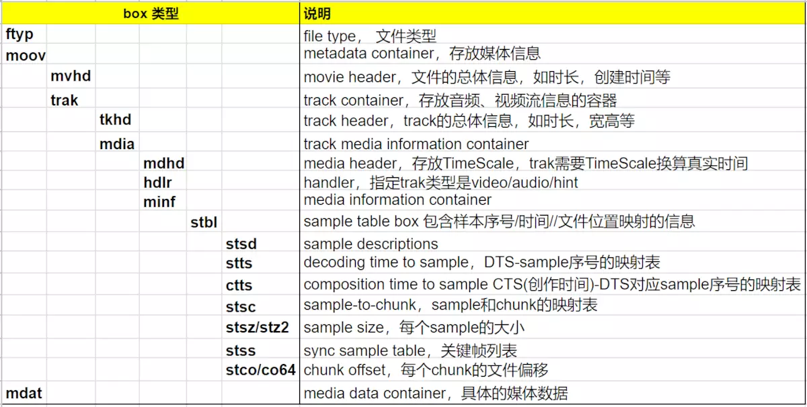
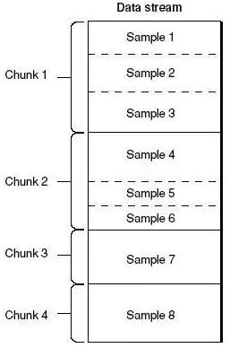
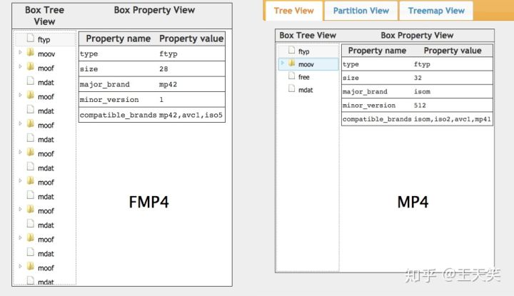
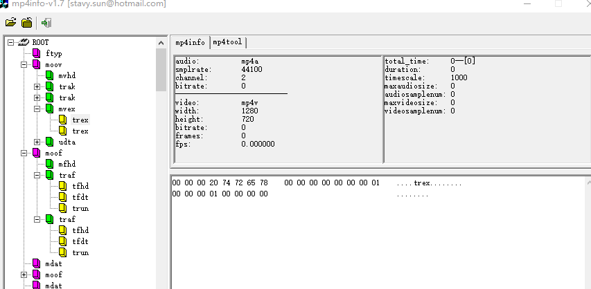
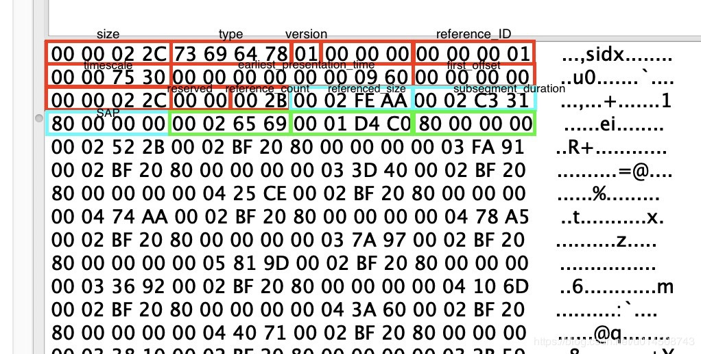

# 2.14fMP4
- [14.1mp4简介](#14.1)
- [14.2fmp4简介](#14.2)

## <a id="14.1">14.1mp4简介</a>
一个MP4文件首先会有且只有一个“ftyp”类型的box，作为MP4格式的标志并包含关于文件的一些信息；之后会有且只有一个“moov”类型的box（Movie Box），它是一种container box，子box包含了媒体的metadata信息；MP4文件的媒体数据包含在“mdat”类型的box（Midia Data Box）中，该类型的box也是container box，可以有多个，也可以没有（当媒体数据全部引用其他文件时），媒体数据的结构由metadata进行描述。  



movie->track->media->media info->vmhd(video)->stbl。  

track:一些sample的集合，对于媒体数据来说，track表示一个视频或者音频序列。  
sample:video sample即为一帧或者一组连续视频帧，audio sample即为一段连续的音频。  
sample table:指明sample时序和物理布局的表。  
chunk:一个track的几个sample组成的单元。  
 
mp4文件中，媒体内容在moov的box中。一个moov包含多个track。每个track就是一个随时间变化的媒体序列，track里的每个时间单位是一个sample，sample按照时间顺序排列。注意，一帧音频可以分解成多个音频sample，所以音频一般用sample作为单位，而不用帧。   
track(媒体序列) > chunk > sample()  

stsd：sample description box，样本的描述信息。   
stts：time to sample box，sample解码时间的压缩表。   
ctts：composition time to sample box，sample的CTS与DTS的时间差的压缩表。   
stss：sync sample box，针对视频，关键帧的序号。  
stsz/stz2：sample size box，每个sample的字节大小。  
stsc：sample to chunk box，sample-chunk映射表。  
stco/co64：chunk offset box，chunk在文件中的偏移。  



## <a id="14.2">14.2fmp4简介</a>
参考链接：  
1.fmp4解析工具   
https://github.com/gpac/gpac/wiki/DASH-Introduction   

2.文档   
https://standards.iso.org/ittf/PubliclyAvailableStandards/c061988_ISO_IEC_14496-12_2012.zip   

fmp4 是基于 MPEG-4 Part 12 的流媒体格式。   
你会注意到sidx和moof+mdat系列的框。这sidx是段索引，并存储了moof+ mdat段精确字节范围位置的元数据。   
本质上，可以独立加载sidx（其字节范围将在随附的.mpd媒体演示描述符文件中定义），然后选择您希望随后加载并添加到MSE SourceBuffer的段。   
重要的是，每个片段都是按照您选择的固定间隔（即每5秒）创建的，因此这些片段可以跨不同比特率的文件进行时间对齐，从而可以轻松地在回放过程中调整比特率。   
片段化MP4和普通MP4之间的主要区别在于片段MP4的moov（电影标题框）出现在文件的开头，而不是结尾。  
fmp4需要和dash进行组合使用。  



Boxes 又名Atoms。  



### mvex  
mvex 是 fMP4 的标准盒子。它的作用是告诉解码器这是一个 fMP4 的文件，具体的 samples 信息内容不再放到 trak 里面，而是在每一个 moof 中。基本格式为：  
aligned(8) class MovieExtendsBox extends Box(‘mvex’){ }  

### trex
trex 是 mvex 的子一级 box 用来给 fMP4 的 sample 设置默认值。基本内容为：  
```java
aligned(8) class TrackExtendsBox extends FullBox(‘trex’, 0, 0){ 
    unsigned int(32) track_ID;
    unsigned int(32) default_sample_description_index;
    unsigned int(32) default_sample_duration;
    unsigned int(32) default_sample_size;
    unsigned int(32) default_sample_flags 
}
具体设哪一个值，这得看你业务里面具体的要求才行。 如果实在不知道，那就可以直接设置为 0：
new Uint8Array([
		0x00, 0x00, 0x00, 0x00, // version(0) + flags
		(trackId >>> 24) & 0xFF, // track_ID
		(trackId >>> 16) & 0xFF,
		(trackId >>> 8) & 0xFF,
		(trackId) & 0xFF,
		0x00, 0x00, 0x00, 0x01, // default_sample_description_index
		0x00, 0x00, 0x00, 0x00, // default_sample_duration
		0x00, 0x00, 0x00, 0x00, // default_sample_size
		0x00, 0x01, 0x00, 0x01 // default_sample_flags
	])
```

### sidx box（segment index）
sidx(segment index) box，它记录了各个moof+mdat组成的segment的精确byte position，所以我们只需要Load一个很小的sidx box就能方便的实现码率切换了。sidx box的具体内容如下，size对应各个segment的大小，duration对应时长。  

SidxBox:  
```java
unsigned int(32) size; 
int(32) type;
if (size==1) {
    unsigned int(64) largesize;
}
unsigned int(8) version;
bit(24) flags;
unsigned int(32) reference_ID;
unsigned int(32) timescale;
if(version == 0) {
    unsigned int(32) earliest_presentation_time;
    unsigned int(32) first_offset;
}
if(version == 1) {
    unsigned int(64) earliest_presentation_time;
    unsigned int(64) first_offset;
}
unsigned int(16) reserved;
unsigned int(16) reference_count;
for (i=0; i < reference_count; i++) {
    bit(1) reference_type;
    unsigned int(31) referenced_size;
    unsigned int(32) subsegment_duration;
    bit(1) starts_with_SAP;
    bit(3) SAP_type;
    unsigned int(28) SAP_delta_time;
}
reference_ID：如果sidx被“parent”sidx引用，reference_ID的值应该同引用者sidx box的reference_ID 值一致。
timescale：时间刻度。
earliest_presentation_time：最早的呈现时间。
first_offset：从该box后到索引材料的第一个字节的距离（以字节为单位）。
reserved：0。
reference_count：reference个数。
reference_type：置1表示引用的是一个sidx box，否则则是media content。
referenced_size：从引用项的第一个字节到下一个引用项的第一个字节的字节距离，或者在最后一个条目的情况下，到引用材料的结尾的距离。
subsegment_duration：时长，与earliest_presentation_time的单位相同。
starts_with_SAP：
SAP_type：
SAP_delta_time：

entry 0000 = reference_type=0, referenced_size=388331, subsegment_duration=147456, starts_with_SAP=1, SAP_type=1, SAP_delta_time=0
entry 0001 = reference_type=0, referenced_size=1135797, subsegment_duration=147456, starts_with_SAP=1, SAP_type=1, SAP_delta_time=0
entry 0002 = reference_type=0, referenced_size=1266343, subsegment_duration=147456, starts_with_SAP=1, SAP_type=1, SAP_delta_time=0
entry 0003 = reference_type=0, referenced_size=1160677, subsegment_duration=147456, starts_with_SAP=1, SAP_type=1, SAP_delta_time=0
entry 0004 = reference_type=0, referenced_size=1180917, subsegment_duration=147456, starts_with_SAP=1, SAP_type=1, SAP_delta_time=0
entry 0005 = reference_type=0, referenced_size=842092, subsegment_duration=147456, starts_with_SAP=1, SAP_type=1, SAP_delta_time=0
entry 0006 = reference_type=0, referenced_size=1160963, subsegment_duration=147456, starts_with_SAP=1, SAP_type=1, SAP_delta_time=0
entry 0007 = reference_type=0, referenced_size=1203216, subsegment_duration=147456, starts_with_SAP=1, SAP_type=1, SAP_delta_time=0
entry 0008 = reference_type=0, referenced_size=1234885, subsegment_duration=147456, starts_with_SAP=1, SAP_type=1, SAP_delta_time=0
entry 0009 = reference_type=0, referenced_size=1166036, subsegment_duration=147456, starts_with_SAP=1, SAP_type=1, SAP_delta_time=0
entry 0010 = reference_type=0, referenced_size=1237774, subsegment_duration=147456, starts_with_SAP=1, SAP_type=1, SAP_delta_time=0
entry 0011 = reference_type=0, referenced_size=1162960, subsegment_duration=147456, starts_with_SAP=1, SAP_type=1, SAP_delta_time=0
entry 0012 = reference_type=0, referenced_size=1235166, subsegment_duration=147456, starts_with_SAP=1, SAP_type=1, SAP_delta_time=0
......
entry 0051 = reference_type=0, referenced_size=1195136, subsegment_duration=147456, starts_with_SAP=1, SAP_type=1, SAP_delta_time=0
entry 0052 = reference_type=0, referenced_size=1178021, subsegment_duration=147456, starts_with_SAP=1, SAP_type=1, SAP_delta_time=0
entry 0053 = reference_type=0, referenced_size=1222620, subsegment_duration=147456, starts_with_SAP=1, SAP_type=1, SAP_delta_time=0
entry 0054 = reference_type=0, referenced_size=1197275, subsegment_duration=147456, starts_with_SAP=1, SAP_type=1, SAP_delta_time=0
entry 0055 = reference_type=0, referenced_size=1161201, subsegment_duration=147456, starts_with_SAP=1, SAP_type=1, SAP_delta_time=0
entry 0056 = reference_type=0, referenced_size=1239388, subsegment_duration=147456, starts_with_SAP=1, SAP_type=1, SAP_delta_time=0
entry 0057 = reference_type=0, referenced_size=1186850, subsegment_duration=147456, starts_with_SAP=1, SAP_type=1, SAP_delta_time=0
entry 0058 = reference_type=0, referenced_size=1012514, subsegment_duration=147456, starts_with_SAP=1, SAP_type=1, SAP_delta_time=0
entry 0059 = reference_type=0, referenced_size=1110407, subsegment_duration=147456, starts_with_SAP=1, SAP_type=1, SAP_delta_time=0
entry 0060 = reference_type=0, referenced_size=1055466, subsegment_duration=147456, starts_with_SAP=1, SAP_type=1, SAP_delta_time=0
entry 0061 = reference_type=0, referenced_size=7954, subsegment_duration=24576, starts_with_SAP=1, SAP_type=1, SAP_delta_time=0
```
不仅如此，在fmp4中各个segment的duration是可以由我们自己指定的，从而可以保证不同码流的各个segment是time aligned且一定start with关键帧。  




### moof
moof 主要是用来存放 FMP4 的相关内容。它本身没啥太多的内容：  
```java
aligned(8) class TrackFragmentBox extends Box(‘traf’){ 
}
```

### tfhd
tfhd 主要是对指定的 trak 进行相关的默认设置。例如：sample 的时长，大小，偏移量等。不过，这些都可以忽略不设，只要你在其它 box 里面设置完整即可：   
```java
aligned(8) class TrackFragmentHeaderBox extends FullBox(‘tfhd’, 0, tf_flags){
 unsigned int(32) track_ID;
// all the following are optional fields
 unsigned int(64) base_data_offset;
 unsigned int(32) sample_description_index;
 unsigned int(32) default_sample_duration;
 unsigned int(32) default_sample_size;
 unsigned int(32) default_sample_flags
}
base_data_offset 是用来计算后面数据偏移量用到的。如果存在则会用上，否则直接是相关开头的偏移。
```

### tfdt
tfdt 主要是用来存放相关 sample 编码的绝对时间的。因为 FMP4 是流式的格式，所以，不像 MP4 一样可以直接根据 sample 直接 seek 到具体位置。这里就需要一个标准时间参考，来快速定位都某个具体的 fragment。  
```java
它的基本格式为：
aligned(8) class TrackFragmentBaseMediaDecodeTimeBox extends FullBox(‘tfdt’, version, 0) {
if (version==1) {
	unsigned int(64) baseMediaDecodeTime; 
} else { // version==0
	unsigned int(32) baseMediaDecodeTime;
	}
}
baseMediaDecodeTime 基本值是前面所有指定 trak_id 中 samples 持续时长的总和，相当于就是当前 traf 里面第一个 sample 的 dts 值。
```

### trun
trun 存储该 moof 里面相关的 sample 内容。例如，每个 sample 的 size，duration，offset 等。基本内容为：  
```java
aligned(8) class TrackRunBox
    extends FullBox(‘trun’, version, tr_flags) {
unsigned int(32) sample_count;
// the following are optional fields
signed int(32) data_offset;
unsigned int(32) first_sample_flags;
// all fields in the following array are optional {
      unsigned int(32)  sample_duration;
      unsigned int(32)  sample_size;
      unsigned int(32)  sample_flags
      if (version == 0)
         { unsigned int(32) sample_composition_time_offset
      else
         { signed int(32) sample_composition_time_offset
   }[ sample_count ]
}
可以说，trun 上面的字段是 traf 里面最重要的标识字段：
tr_flags 是用来表示下列 sample 相关的标识符是否应用到每个字段中：
0x000001: data-offset-present，只应用 data-offset
0x000004: 只对第一个 sample 应用对应的 flags。剩余 sample flags 就不管了。
0x000100: 这个比较重要，表示每个 sample 都有自己的 duration，否则使用默认的
0x000200: 每个 sample 有自己的 sample_size，否则使用默认的。
0x000400: 对每个 sample 使用自己的 flags。否则，使用默认的。
0x000800: 每个 sample 都有自己的 cts 值
后面字段，我们这简单介绍一下。
data_offset: 用来表示和该 moof 配套的 mdat 中实际数据内容距 moof 开头有多少 byte。相当于就是 moof.byteLength + mdat.headerSize。
sample_count: 一共有多少个 sample
first_sample_flags: 主要针对第一个 sample。一般来说，都可以默认设为 0。
后面的几个字段，我就不赘述了，对了，里面的 sample_flags 是一个非常重要的东西，常常用它来表示，到底哪一个 sampel 是对应的 keyFrame。基本计算方法为：
(flags.isLeading << 2) | flags.dependsOn, // sample_flags
(flags.isDepended << 6) | (flags.hasRedundancy << 4) | flags.isNonSync
```

### sdtp
sdtp 主要是用来描述具体某个 sample 是否是 I 帧，是否是 leading frame 等相关属性值，主要用来作为当进行点播回放时的同步参考信息。其内容一共有 4 个：  
```java
is_leading：是否是开头部分。
0: 当前 sample 的 leading 属性未知（经常用到）
1: 当前 sample 是 leading sample，并且不能被 decoded
2: 当前 sample 并不是 leading sample。
3: 当前 sample 是 leading sample，并且能被 decoded
sample_depends_on：是否是 I 帧。
0: 该 sample 不知道是否依赖其他帧
1: 该 sample 是 B/P 帧
2: 该 sample 是 I 帧。
3: 保留字
sample_is_depended_on: 该帧是否被依赖
0: 不知道是否被依赖，特指（B/P）
1: 被依赖，特指 I 帧
3: 保留字
sample_has_redundancy: 是否有冗余编码
0: 不知道是否有冗余
1: 有冗余编码
2: 没有冗余编码
3: 保留字
整个基本格式为：
aligned(8) class SampleDependencyTypeBox extends FullBox(‘sdtp’, version = 0, 0) { 
  for (i=0; i < sample_count; i++){
    unsigned int(2) is_leading;
    unsigned int(2) sample_depends_on; 
    unsigned int(2) sample_is_depended_on; 
    unsigned int(2) sample_has_redundancy;
  } 
}

sdtp 对于 video 来说很重要，因为，其内容字段主要就是给 video 相关的帧设计的。而 audio，一般直接采用默认值：
isLeading: 0,
dependsOn: 1, 
isDepended: 0,
hasRedundancy: 0
```
总结一下：fmp4对应mp4不同在于moov中新增mvex->trex描述fmp4和默认sample值。后面每一个mdat前都会有moof描述moof->traf->turn描述头以及在traf中会有sample 编码的绝对时间偏移大小等值。   
在fMp4格式中包含一系列的segments(moof+mdat的组合)，这些segments可以被独立的request（利用byte-range request），这有利于在不同质量级别的码流之间做码率切换操作。  

## links
  * [目录](<音视频入门到精通目录.md>)
  * 下一节: [3.1音视频库使用说明](<3.1音视频库使用说明.md>)