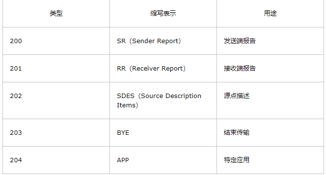

# RTCP
- [RTCP](#1)
- [RTCP协议](#2)

### <a id="1">RTCP</a>
参考链接：    
- 1.RTP协议分析和详解  
https://www.cnblogs.com/lidabo/p/7217549.html  


#### 基础
RTP全名是Real-time Transport Protocol（实时传输协议）。它是IETF提出的一个标准，对应的RFC文档为RFC3550（RFC1889为其过期版本）。RFC3550不仅定义了RTP，而且定义了配套的相关协议RTCP（Real-time Transport Control Protocol，即实时传输控制协议）。RTP用来为IP网上的语音、图像、传真等多种需要实时传输的多媒体数据提供端到端的实时传输服务。RTP为Internet上端到端的实时传输提供时间信息和流同步，但并不保证服务质量，服务质量由RTCP来提供。  

RTCP实际上是RTP传输情况的反馈，通俗的说，它告诉另外一方，在一端时间内（5秒），它发送多少数据包给对方，接收到了多少对方的包。

简单的多播音频会议。语音通信通过一个多播地址和一对端口来实现。一个用于音频数据（RTP），另一个用于控制包（RTCP）。

音频和视频会议。如果在一次会议中同时使用了音频和视频会议，这两种媒体将分别在不同的RTP会话中传送，每一个会话使用不同的传输地址（IP地址＋端口）。如果一个用户同时使用了两个会话，则每个会话对应的RTCP包都使用规范化名字CNAME（Canonical Name）。与会者可以根据RTCP包中的CNAME来获取相关联的音频和视频，然后根据RTCP包中的计时信息(Network time protocol)来实现音频和视频的同步。

翻译器和混合器。翻译器和混合器都是RTP级的中继系统。翻译器用在通过IP多 播不能直接到达的用户区，例如发送者和接收者之间存在防火墙。当与会者能接收的音频编码格式不一样，比如有一个与会者通过一条低速链路接入到高速会议，这 时就要使用混合器。在进入音频数据格式需要变化的网络前，混合器将来自一个源或多个源的音频包进行重构，并把重构后的多个音频合并，采用另一种音频编码进 行编码后，再转发这个新的RTP包。从一个混合器出来的所有数据包要用混合器作为它们的同步源（SSRC，见RTP的封装）来识别，可以通过贡献源列表（CSRC表，见RTP的封装）可以确认谈话者。

RTP需要RTCP为其服务质量提供保证，因此下面介绍一下RTCP的相关知识。

RTCP的主要功能是：服务质量的监视与反馈、媒体间的同步，以及多播组中成员的标识。在RTP会话期间，各参与者周期性地传送RTCP包。RTCP包中含有已发送的数据包的数量、丢失的数据包的数量等统计资料，因此，各参与者可以利用这些信息动态地改变传输速率，甚至改变有效载荷类型。RTP和RTCP配合使用，它们能以有效的反馈和最小的开销使传输效率最佳化，因而特别适合传送网上的实时数据。

从图 1可以看到，RTCP也是用UDP来传送的，但RTCP封装的仅仅是一些控制信息，因而分组很短，所以可以将多个RTCP分组封装在一个UDP包中。RTCP有如下五种分组类型。



上述五种分组的封装大同小异，下面只讲述SR类型，而其它类型请参考RFC3550。

发送端报告分组SR（Sender Report）用来使发送端以多播方式向所有接收端报告发送情况。SR分组的主要内容有：相应的RTP流的SSRC，RTP流中最新产生的RTP分组的时间戳和NTP，RTP流包含的分组数，RTP流包含的字节数。

```cpp
版本（V）：同RTP包头域。
填充（P）：同RTP包头域。
接收报告计数器（RC）：5比特，该SR包中的接收报告块的数目，可以为零。
包类型（PT）：8比特，SR包是200。
长度域（Length）：16比特，其中存放的是该SR包以32比特为单位的总长度减一。
同步源（SSRC）：SR包发送者的同步源标识符。与对应RTP包中的SSRC一样。
NTP Timestamp（Network time protocol）SR包发送时的绝对时间值。NTP的作用是同步不同的RTP媒体流。
RTP Timestamp：与NTP时间戳对应，与RTP数据包中的RTP时间戳具有相同的单位和随机初始值。
Sender’s packet count：从开始发送包到产生这个SR包这段时间里，发送者发送的RTP数据包的总数. SSRC改变时，这个域清零。
Sender`s octet count：从开始发送包到产生这个SR包这段时间里，发送者发送的净荷数据的总字节数（不包括头部和填充）。发送者改变其SSRC时，这个域要清零。
同步源n的SSRC标识符：该报告块中包含的是从该源接收到的包的统计信息。
丢失率（Fraction Lost）：表明从上一个SR或RR包发出以来从同步源n(SSRC_n)来的RTP数据包的丢失率。
累计的包丢失数目：从开始接收到SSRC_n的包到发送SR,从SSRC_n传过来的RTP数据包的丢失总数。
收到的扩展最大序列号：从SSRC_n收到的RTP数据包中最大的序列号，
接收抖动（Interarrival jitter）：RTP数据包接受时间的统计方差估计
上次SR时间戳（Last SR,LSR）：取最近从SSRC_n收到的SR包中的NTP时间戳的中间32比特。如果目前还没收到SR包，则该域清零。
上次SR以来的延时（Delay since last SR,DLSR）：上次从SSRC_n收到SR包到发送本报告的延时。
```

当应用程序建立一个RTP会话时，应用程序将确定一对目的传输地址。目的传输地址由一个网络地址和一对端口组成，有两个端口：一个给RTP包，一个给RTCP包，使得RTP/RTCP数据能够正确发送。RTP数据发向偶数的UDP端口，而对应的控制信号RTCP数据发向相邻的奇数UDP端口（偶数的UDP端口＋1），这样就构成一个UDP端口对。 RTP的发送过程如下，接收过程则相反。  

1)RTP协议从上层接收流媒体信息码流（如H.263），封装成RTP数据包；RTCP从上层接收控制信息，封装成RTCP控制包。  
2)RTP将RTP 数据包发往UDP端口对中偶数端口；RTCP将RTCP控制包发往UDP端口对中的接收端口。  

##### 实时流协议RTSP  
实时流协议RTSP（Real-Time Streaming Protocol）是IETF提出的协议，对应的RFC文档为RFC2362。  
从图 1可以看出，RTSP是一个应用层协议（TCP/IP网络体系中）。它以C/S模式工作，它是一个多媒体播放控制协议，主要用来使用户在播放流媒体时可以像操作本地的影碟机一样进行控制，即可以对流媒体进行暂停/继续、后退和前进等控制。  

##### 资源预定协议RSVP  
资源预定协议RSVP(Resource Reservation Protocol)是IETF提出的协议，对应的RFC文档为RFC2208。  
从图 1可以看出，RSVP工作在IP层之上传输层之下，是一个网络控制协议。RSVP通过在路由器上预留一定的带宽，能在一定程度上为流媒体的传输提供服务质量。在某些试验性的系统如网络视频会议工具vic中就集成了RSVP。  

##### 常见的疑问
怎样重组乱序的数据包  
可以根据RTP包的序列号来排序。

怎样获得数据包的时序  
可以根据RTP包的时间戳来获得数据包的时序。

声音和图像怎么同步  
根据声音流和图像流的相对时间（即RTP包的时间戳），以及它们的绝对时间（即对应的RTCP包中的RTCP），可以实现声音和图像的同步。

接收缓冲和播放缓冲的作用  
接收缓冲用来排序乱序了的数据包；播放缓冲用来消除播放的抖动，实现等时播放。

#### RTP时间戳相关
通过RTSP建立好会话之后，就可以开始传输RTP数据和RTCP SR包了（用来同步音视频）。

这两者涉及到很重要的问题：时间戳。下面是《rtp_audio_and_video_for_the_internet》上的一个时间图。

TimeStamp的初始值是随即生成的，然后每一帧数据固定增加一 个增量，客户端在接收到数据时，根据这个时间戳就能以正确的时间恢复（其中被分包的视频桢是没有时间戳增加的）。RTCP的SR包里面除了这个时间戳，还 有一个NTP时间，这是距1900年1月1日的秒数，允许每个系统存在差异，只要同一个系统不同流的该值的生成方式相同就行。以时钟频率为90KHz的视 频为例，若其帧率为30帧，则每一帧的时间戳增量为90000/30=3000；RTCP的SR包的时间戳也可以相应计算出来：增量=（现在时间-上一次 RTP包发送时间）*单位时间增量，其中单位时间增量=90000*1000000/(2^32)，因为SR包中的微秒时间形式是NTP_frac，因此 要做“/（2^32）”这样一个转化。

RFC中说时间戳增量需要满足线性增长，实际上没必要严格按照诸如3000增量来增长，我是按照实际的帧的时间间隔来打的这个时间戳：  
时间戳 = 上一次时间戳 + 采样频率（典型值为90000）*0.000001 *  两帧时间差（单位毫秒）来计算的

时间戳（timestamp） 32比特 时间戳反映了RTP数据包中第一个字节的采样时间。（采样时钟必须来源于一个及时的单调、线性递增时钟，以便允许同步和去除网络引起的数据包抖动。该时钟的分辨率必须满足理想的同步精度和测量数据包到来时的抖动的需要（一种典型的时钟分辨率不满足情况是每个视频帧仅一个时钟周期）时钟 频率依赖于负载数据的格式，并在描述文件（profile）中或者是在负载格式描述中（payload format speci_cation）进行静态描述。也可以通过非RTP方法（non-RTP means）对负载格式动态描述。

如果RTP包是周期性产生的，那么将使用由采样时钟决定的名义上的采样时刻，而不是读取系统时间。例如，对一个固定速率的音频，采样时钟（时间戳时钟）将 在每个周期内增加1。如果一个音频从输入设备中读取含有160个采样周期的块，那么对每个块，时间戳的值增加160，而不考虑该块是否用一个包传递或是被 丢弃。

时间戳的初始值应当是随机的，就像序号一样。几个连续的RTP包如果（逻辑上）是同时产生的，如：属于同一个视频帧的RTP包，将有相同的序列号。如果数 据并不是以它采样的顺序进行传输，那么连续的RTP包可以包含不是单调递增（或递减）的时间戳（RTP包的序列号仍然是单调变化的）。

根据一些文章我自己推敲了一下几个概念如下：   
时间戳单位：时间戳计算的单位不为秒之类的单位，而是由采样频率所代替的单位，这样做的目的就是为了是时间戳单位更为精准。比如说一个音频的采样频率为8000HZ，那么我们可以把时间戳单位设为1/8000。
时间戳增量：相邻两个RTP包之间的时间差（以时间戳单位为基准）。
 
如何设定时间戳之间的增量呢？
按照刚才时间戳单位来看，1秒钟按照时间戳单位就是8000，那么一秒钟如果可以播放20帧，也就是发送30帧（帧率），那么可以求出相邻两帧之间的时间差，也就是时间戳增量，那么显而易见是用8000/20，那么这个时间戳增量就为400.
网上大多数列举的一个例子是： 例如MPEG，每帧20ms，采样频率8000Hz，设定时间戳单位1/8000，而每个包之间就是160的增量
这里又该如何理解呢？可以轻易地看出增量是直接8000与20ms相乘的结果，我们可以知道这里两帧之间的时间为20ms，也就是0.02s，这个单位是以秒来衡量的，那么我们要用时间戳单位来表示那么就是8000*0.02=160.所以时间戳增量为160.

还有一点为什么一般都用90000作为视频采样频率呢？
90k是用于视频同步的时间尺度(TimeScale),就是每秒90k个时钟tick。为什么采用90k呢？目前视频的帧速率主要有25fps、29.97fps、30fps等，而90k刚好是它们的倍数，所以就采用了90k。

10~16 Bit为PT域，指的就是负载类型（PayLoad），负载类型定义了RTP负载的格式，协议原文说该域由具体应用决定其解释。
目前，负载类型主要用来告诉接收端（或者播放器）传输的是哪种类型的媒体（例如G.729，H.264，MPEG-4等），这样接收端（或者播放器）才知道了数据流的格式，才会调用适当的编解码器去解码或者播放，这就是负载类型的主要作用。

时间戳单位：时间戳计算的单位不是秒之类的单位，而是由采样频率所代替的单位，这样做的目的就是为了是时间戳单位更为精准。比如说一个音频的采样频率为8000Hz，那么我们可以把时间戳单位设为1 / 8000。
时间戳增量：相邻两个RTP包之间的时间差（以时间戳单位为基准）。
采样频率：  每秒钟抽取样本的次数，例如音频的采样率一般为8000Hz
帧率：      每秒传输或者显示帧数，例如25f/s
    
再看看RTP时间戳课本中的定义：

RTP包头的第2个32Bit即为RTP包的时间戳，Time Stamp ，占32位。
时间戳反映了RTP分组中的数据的第一个字节的采样时刻。在一次会话开始时的时间戳初值也是随机选择的。即使是没有信号发送时，时间戳的数值也要随时间不 断的增加。接收端使用时间戳可准确知道应当在什么时间还原哪一个数据块，从而消除传输中的抖动。时间戳还可用来使视频应用中声音和图像同步。
在RTP协议中并没有规定时间戳的粒度，这取决于有效载荷的类型。因此RTP的时间戳又称为媒体时间戳，以强调这种时间戳的粒度取决于信号的类型。例如， 对于8kHz采样的话音信号，若每隔20ms构成一个数据块，则一个数据块中包含有160个样本（0.02&times;8000=160）。因 此每发送一个RTP分组，其时间戳的值就增加160。

官方的解释看懂没？没看懂？没关系，我刚开始也没看懂，那就听我的解释吧。

首先，时间戳就是一个值，用来反映某个数据块的产生（采集）时间点的，后采集的数据块的时间戳肯定是大于先采集的数据块的。有了这样一个时间戳，就可以标记数据块的先后顺序。
第二，在实时流传输中，数据采集后立刻传递到RTP模块进行发送，那么，其实，数据块的采集时间戳就直接作为RTP包的时间戳。
第三，如果用RTP来传输固定的文件，则这个时间戳就是读文件的时间点，依次递增。这个不再我们当前的讨论范围内，暂时不考虑。
第四，时间戳的单位采用的是采样频率的倒数，例如采样频率为8000Hz时，时间戳的单位为1 / 8000 ，在Jrtplib库中，有设置时间戳单位的函数接口，而ORTP库中根据负载类型直接给定了时间戳的单位（音频负载1/8000，视频负载1/90000）
第五，时间戳增量是指两个RTP包之间的时间间隔，详细点说，就是发送第二个RTP包相距发送第一个RTP包时的时间间隔（单位是时间戳单位）。
如果采样频率为90000Hz，则由上面讨论可知，时间戳单位为1/90000，我们就假设1s钟被划分了90000个时间块，那么，如果每秒发送25 帧，那么，每一个帧的发送占多少个时间块呢？当然是 90000/25 = 3600。因此，我们根据定义&ldquo;时间戳增量是发送第二个RTP包相距发送第一个RTP包时的时间间隔&rdquo;，故时间 戳增量应该为3600。

【补充】：最近思考了一下，又有了新的体会和解释，可能对大家更容易地去理解这个时间戳增量会有所帮助，补充在下面吧：

其实，网络发送重点关注的是流量的平衡，即均匀地利用网络带宽，为了实现这一点，需要满足：数据采集的速率与数据网络传输的速率尽量保持一致。时间戳增量的设置影响的是RTP包的网络传输的速率，时间戳增量越小，发送速度越快。

下面再进一步解释一下时间戳增量是怎么计算出来的：

对于PAL制式的视频而言，每秒摄像头会采集 25 帧 数据，那么，每采集到 1帧 耗时 1/25 s ，如果我们设计为1个RTP包只包含1帧数据，并且一次发送1帧，那么，要想网络流量均匀，则时间戳增量应该设计为 1/25 s .  而在一般的RTP协议的实现中，时间戳单位不是 秒（s），而约定为采样频率的倒数，由于一般视频的采样频率是 90000，故时间戳单位为 1/90000 s，因此，实际的时间戳增量 = 时间戳增量 ( 1/25 s ) / 时间戳单位(1/90000 s) = 3600  

### <a id="2">RTCP协议</a>
参考链接：  
1.RFC3550 RTP 中文版  
http://blog.chinaunix.net/uid-7396260-id-2056682.html  
 
RFC3550
RTP：实时应用程序传输协议
 
摘要
本文描述RTP（real-time transport protocol），实时传输协议。RTP在多点传送（多播）或单点传送（单播）的网络服务上，提供端对端的网络传输功能，适合应用程序传输实时数据，如：音频，视频或者仿真数据。RTP没有为实时服务提供资源预留的功能，也不能保证QoS（服务质量）。数据传输功能由一个控制协议（RTCP）来扩展，通过扩展，可以用一种方式对数据传输进行监测控制，该协议（RTCP）可以升级到大型的多点传送（多播）网络，并提供最小限度的控制和鉴别功能。RTP和RTCP被设计成和下面的传输层和网络层无关。协议支持RTP标准的转换器和混合器的使用。
本文的大多数内容和旧版的RFC1889相同。在线路里传输的数据包格式没有改变，唯一的改变是使用协议的规则和控制算法。为了最小化传输，发送RTCP数据包时超过了设定的速率，而在这时，很多的参与者同时加入了一个会话，在这样的情况下，一个新加入到（用于计算的可升级的）计时器算法中的元素是最大的改变。
```bash
目录（Table of Contents）
   1.   引言 （Introduction）
       1 1  术语（Terminology）
   2   RTP使用场景（RTP Use Scenarios）
       2 1  简单多播音频会议（ Simple Multicast Audio Conference）
       2 2  音频和视频会议（Audio and Video Conference）
       2 3   混频器和转换器（Mixers and Translators）
       2 4  分层编码（Layered Encodings）
   3   定义（Definitions）
   4   字节序，校正和时间格式（Byte Order, Alignment, and Time Format）
   5   RTP数据传输协议（RTP Data Transfer Protocol）
       5 1  RTP固定头域（RTP Fixed Header Fields）
       5 2  多路复用RTP会话（Multiplexing RTP Sessions）
       5 3  RTP头的配置文件详细变更（Profile-Specific Modifications to the RTP Header）
            5 3 1  RTP报头扩展（RTP Header Extension）  
   6   RTP控制协议（RTP Control Protocol） -- RTCP    
       6 1  RTCP包格式（RTCP Packet Format）        
       6 2  RTCP传输间隔（RTCP Transmission Interval）
            6 2 1  维护会话成员数目（Maintaining the number of session members）
       6 3  RTCP包的发送与接收规则（RTCP Packet Send and Receive Rules）
            6 3 1  计算RTCP传输间隔（Computing the RTCP Transmission Interval）
            6 3 2  初始化（Initialization）
            6 3 3  接收RTP或RTCP（非BYE)包（Receiving an RTP or Non-BYE RTCP Packet）
            6 3 4  接收RTCP（BYE）包（Receiving an RTCP BYE Packet）
            6 3 5  SSRC计时失效（Timing Out an SSRC）
            6 3 6  关于传输计时器的到期（Expiration of Transmission Timer）
            6 3 7  传输一个 BYE 包（Transmitting a BYE Packet）
            6 3 8  更新we_sent（Updating we_sent）
            6 3 9  分配源描述带宽（Allocation of Source Description Bandwidth）
       6 4  发送方和接收方报告（Sender and Receiver Reports）
            6 4 1  SR：发送方报告的RTCP包（SR: Sender report RTCP packet）  
            6 4 2  RR：接收方报告的RTCP包（RR: Receiver Report RTCP Packet）
            6 4 3  扩展发送方和接收方报告（Extending the Sender and Receiver Reports ）  
            6 4 4  分析发送方和接收方报告（Analyzing Sender and Receiver Reports ）  
       6 5  SDES：源描述RTCP包（SDES: Source description RTCP packet）
            6 5 1  CNAME：规范终端标识符的SDES数据项(CNAME: Canonical End-Point Identifier SDES Item）                       
            6 5 2  NAME：用户名的SDES数据项（NAME: User name SDES item)  
            6 5 3  EMAIL:电子邮件地址的SDES数据项（EMAIL: Electronic Mail Address SDES Item）
            6 5 4  PHONE：电话号码的SDES数据项（PHONE: Phone Number SDES Item）
            6 5 5  LOC:地理用户地址的SDES数据项（LOC: Geographic User Location SDES Item）
            6 5 6  TOOL：应用程序或工具名字的SDES数据项（TOOL: Application or Tool Name SDES Item） 
            6 5 7  NOTE：通知/状态的SDES数据项（NOTE: Notice/Status SDES Item）
            6 5 8  PRIV:私有扩展的SDES数据项（PRIV: Private Extensions SDES Item）
       6 6  BYE：Goodbye　RTCP包（BYE: Goodbye RTCP packet）
       6 7  APP:定义应用程序的RTCP包（APP: Application-Defined RTCP Packet）
   7   RTP转换器和混频器（RTP Translators and Mixers）
       7 1  概述（General Description ）
       7 2  在转换器中的RTCP数据处理（RTCP Processing in Translators）
       7 3  在混频器中的RTCP数据处理（RTCP Processing in Mixers ）
       7 4  级联混频器（Cascaded Mixers）
   8   SSRC标识符的分配和使用（SSRC Identifier Allocation and Use）
       8 1  冲突概率（Probability of Collision ）
       8 2  冲突解决和循环检测（Collision Resolution and Loop Detection）
       8 3  在分层编码中使用（Use with Layered Encodings）
   9   安全（Security ）
       9 1  机密性（Confidentiality）
       9 2  身份验证和消息完整性（Authentication and Message Integrity）
   10  拥塞控制（Congestion Control）
   11  网络和传输协议之上的RTP（RTP over Network and Transport Protocols）
   12  协议常量摘要（Summary of Protocol Constants）
       12 1 RTCP 包类型（RTCP Packet Types）
       12 2 SDES 类型（SDES Types）
   13  RTP概况和负载格式详细说明
　　　　（RTP Profiles and Payload Format Specifications）
   14  安全考虑（Security Considerations）
   15  IANA考虑（IANA Considerations）
   16  知识产权声明（Intellectual Property Rights Statement）
   17  鸣谢（Acknowledgments）
   附录 A    算法（Algorithms）
   附录 A 1  RTP数据头有效性检查（RTP Data Header Validity Checks ）
   附录 A 2  RTCP数据头有效性检查（RTCP Header Validity Checks） 
   附录 A 3  确定RTP包预期数目和丢失数目（Determining Number of Packets Expected and Lost）
   附录 A 4  生成SDES　RTCP包（Generating RTCP SDES Packets）
   附录 A 5  解析RTCP　SDES包（Parsing RTCP SDES Packets）
   附录 A 6  生成32位随机标识符（Generating a Random 32-bit Identifier
   附录 A 7  计算RTCP传输间隔（Computing the RTCP Transmission Interval）
   附录 A 8  估测两次到达间隔的抖动（Estimating the Interarrival Jitter）
   附录 B    与RFC1889不同之外（Changes from RFC 1889）       
   参考书目（References）  
   标准化引用（Normative References ）  
   资料性引用（Informative References）
   作者地址            
   完整的版权声明      
 
1.绪论
本文详细的介绍实时传输协议RTP，RTP提供带有实时特性的端对端数据传输服务，传输的数据如：交互式的音频和视频。那些服务包括有效载荷类型定义，序列号，时间戳和传输监测控制。应用程序在UDP上运行RTP来使用它的多路技术和checksum服务。2种协议都提供传输协议的部分功能。不过，RTP可能被其他适当的下层网络和传输协议使用（见11节）。如果下层网络支持，RTP支持数据使用多播分发机制转发到多个目的地。
注意RTP本身没有提供任何的机制来确保实时的传输或其他的服务质量保证，而是由低层的服务来完成。它不保证传输或防止乱序传输，它不假定下层网络是否可靠，是否按顺序传送数据包。RTP包含的序列号允许接受方重构发送方的数据包顺序，但序列号也用来确定一个数据包的正确位置，例如，在视频解码的时候不用按顺序的对数据包进行解码。
但是RTP原先的设计是用来满足多参与者的多媒体会议的需要，它没有限定于专门的应用。连续数据的储存，交互分布式仿真，动态标记，以及控制和测量应用程序也可能会适合使用RTP。
该文档定义RTP，由2个密切联系的部分组成：
○实时传输协议RTP，用于实时传输数据。
○RTP控制协议RTCP，用于监控服务质量和传达关于在一个正在进行的会议中的参与者的信息。后者对“宽松控制”的会议可能已经足够，但是并没有必要去支持一个应用程序所有的通讯控制条件。这个功能可能充分的或者部分的被一个单独的会议控制协议所包含，这超过了本文档的范围。
RTP表现了协议的一种新的类型，该类型由Clark和Tennenhouse提出[10]，遵循应用级（framing）框架和（integrated layer processing）统一层处理的原则。就是说，RTP被规定为可扩展的，用来提供一个专门的应用程序需要的信息，并将会经常性的被归并到应用程序的处理中，而不是作为一个单独的层被实现。RTP只是一个故意不完成的协议框架。本文档详细说明那些功能，希望这些功能能够普遍贯穿于所有适合使用RTP的应用程序。和常规的协议不同，额外的功能可能通过完善协议本身或者增加一个可能需要分析的选项机制来增加，RTP被规定为可以根据需要通过修改和/或增加操作，“剪裁”到报头。具体的例子见5.3和6.4.3节。
因此，除了本文档，用于专门应用程序的RTP完整的说明将还需要一个或者更多的同类文档（见13节）：
○ 一个框架（大致轮廓）的说明文档，该文档定义了一系列的有效载荷类型编码和它们与有效载荷格式之间的映射（例如，媒体编码）。一个框架可能也定义了应用程序对RTP的一些扩展和修改，详细到一个专门的类。典型的情况，一个应用程序将在一个框架下运行。一个用于音频和视频数据的框架可以在同类RFC3551[1]文档里找到。
○有效载荷格式说明文档，该文档定义了一个像一个音频或者视频编码的特殊载荷，在RTP里是如何被传输的。
一个关于实时服务和算法如何实现的讨论和关于一些RTP设计结果的后台讨论能够在[11]中找到。
1.1术语
在这个文档里的关键词“一定要”，“一定不能”，“必需的”，“会”，“不会”，“应该”，“不应该”，“推荐”，“可能”和“可选” 将会像在BCP 14（Basic Control Program，基本控制程序），RFC2119[2]里描述一样的解释。并指出适合RTP实现的需要的级别。
 
2.  RTP使用场景（RTP Use Scenarios）
      2.1  简单多播音频会议（ Simple Multicast Audio Conference）
      2.2  音频和视频会议（Audio and Video Conference）
      2.3  混频器和转换器（Mixers and Translators）
      2.4  分层编码（Layered Encodings）
　　以下章节描述了用到RTP的一些方面。所举例子用来说明RTP应用的基本操作，但RTP的用途不限于此。在这些例子中，RTP运行于IP和UDP之上，并且遵循RFC3551所描述的音频和视频的配置文件中的约定。
2.1 简单多播音频会议（Simple Multicast Audio Conference）
　　IETF的一个工作组开会讨论最新协议草案时，使用Internet的IP多播服务来进行语音通讯。工作组中心分配到一个多播的组地址和一对端口。一个端口用于音频数据，另一个端口用于控制（RTCP）数据包。该地址和端口信息发布给预定的参与者。如果有私密性要求，则可用章节9.1中说明的方法，对数据和控制包进行加密，这时就需要生成和发布加密密钥。分配和发布机制的精确细节不在RTP的讨论范围之内。
　　每个与会者所使用的音频会议应用程序，都以小块形式（比方说持续２０秒时间）来发送音频数据。每个音频数据块都前导RTP报头；RTP报头和数据依次包含在UDP包里。RTP报头指明了各个包里音频编码的类型（如PCM,ADPCM,LPC），这样发送方可以在会议过程中改变编码方式，以适应状况的变化，例如，要加进一个低带宽接入的参与者，或是要应付网络拥塞。
　　Internet，像其他的报文分组网络一样，偶而会丢失和重排包，造成时长不等的延迟。为弥补这个不足，RTP报头里包含计时信息和一个序列号，允许接收方重建来自源的计时信息，比如前文例子中音频块以20s的间隔在扬声器中连续播放。会议中，对每个RTP包的源,单独地实施计时重建。序列号还被接收方用来评估丢失包数目。
　　由于会议期间不断有工作组成员加入或离开，因此有必要知道任一时刻的实际参与者及他们接收音频数据的状况好坏。出于这个目的，会议中每个音频应用程序的实例，都在RTCP（控制）端口上周期性地多播一个附加用户名的接收报告。接收报告指明了当前说话者被收听到的状况，可用于控制自适应性编码。除了用户名外，通过控制带宽限度，可以包含其他标识信息。一个站点在离开会议时发送RTCP BYE包（章节6.5）。
2.2　音频和视频会议（Audio and Video Conference）
　　一个会议如果同时使用音频和视频媒体，则二者传输时使用不同的RTP会话。也就是说，两种媒体中RTP包和RTCP包的传输，是使用两个不同的UDP端口对和（或）多播地址。在RTP层次，音频和视频会话没有直接的耦合，下面这种情况除外：一个同时参加两个会话的参与者，在两个会话的RTCP包中，使用了相同的规范名，这样两个会话就发生关联（耦合）了。
　　这样区隔开来的目的之一，是允许一些会议参与者只接受自己选择的单一媒体（或者音频，或者视频）。更进一步的说明在章节5.2给出。尽管两种媒体区分开来了，但通过两个会话RTCP包内载有的计时信息，同源的音频与视频还是能够同步回放。
2.3　混频器和转换器（Mixers and Translators）
　　到目前为止，我们皆假设所有站点都收到相同格式的媒体数据。然而这并不总是行得通。考虑一下这种情况，一个地方的参与者只能低速接入会议，而其他大部分参与者都能享受高速连接。与其让强迫大家都忍受低带宽，不如在只能低速接入的地方，放置一个减质量音频编码的RTP层次的中继（称作混频器）。混频器将重新同步输入的音频包，重建发送方产生的20ms固定间隔，混频已重建过的音频流为单一的流，转换音频编码为低带宽格式，最后通过低带宽连接转发数据包流（package stream)。这些包可能被单播到一个接收方，也可能多播到另一个的地址而发给多个接收方。RTP报头为混频器提供了一种方法，使其能辨识出对混频后的包有用的源，从而保证提供给接收方正确的说话者指示。
　　在音频会议中，一些预定参与者尽管有高带宽连接，但不能通过IP多播直接接入会议。例如，他们可能位于一个不允许任何IP包通过的应用层防火墙后面。对这些站点，可能就不需要混频，而需要另一种称为转换器的RTP层次中继。可以在防火墙两侧分别安装一个转换器，外侧转换器将所有多播包通过安全连接转入内侧转换器，内侧转换器再转发给内部网的一个多播组（multicast group)。
　　混频器和转换器可以设计成用于各种目的。比如，一个视频混频器在测量多个不同视频流中各人的单独影像后，将它们组合成一个单一视频流来模拟群组场景。又如，在只用IP/UDP和只用ST_II的两个主机群之间通过转换建立连接。再如，在没有重新同步或混频时，用packet-by-packet编码转换来自各个独立源的视频流。混频器和转换器的操作细节见章节7。
2.4 分层编码（Layered Encodings）
　　为了匹配接收方的能力（容量）以及适应网络拥塞，多媒体应用程序应当能够调整其传输速率。许多应用实现把调适传输速率的责任放在源端。这种做法在多播传输中并不好，因为不同接收方对带宽存在着冲突性需求。这经常导致最小公分母的场景，网格中最小的管道支配了全部实况多媒体“广播”的质量和保真度。
　　相反地，可以把分层编码和分层传输系统组合起来，从而把调适速率的责任放在接收端。在IP多播之上的RTP上下文中，对一个横跨多个RTP会话（每个会话在独自多播组上开展）的分级表示信号(a hierarchically represented signal)，源能够把它的分层（layers)分割成条。 接收方仅需合并适当的多播组子集，就能适应异种网络和控制接收带宽。
RTP分层编码的细节在章节6.3.9，8.3和11中给出。
 
3.　定义（definitions)
　　RTP负载（RTP payload）：通过RTP传输的包中的数据，例如，音频样本或压缩好的视频数据。负载格式与解释不在本文讨论范围。
 　　RTP包（RTP packet）：一种数据包，其组成部分有：一个固定RTP报头，一个可能为空的作用源（contributing sources）列表（见下文），以及负载数据。一些下层协议可能要求对RTP包的封装进行定义。一般地，下层协议的一个包包含一个RTP包，但若封装方法允许，也可包含数个RTP包（见章节11）。
　　 RTCP包（RTCP packet）：一种控制包，其组成部分有：一个类似RTP包的固定报头，后跟一个结构化的部分，该部分具体元素依不同RTCP包的类型而定。格式的定义见章节６。一般地，多个RTCP包将在一个下层协议的包中以合成RTCP包的形式传输；这依靠RTCP包的固定报头中的长度字段来实现。
　　端口（Port）：“传输协议用来在同一主机中区分不同目的地的一种抽象。TCP/IP协议使用正整数来标识不同端口。”[12]　OSI传输层使用的传输选择器（TSEL,the transport selectors）等同于这里的端口。RTP需依靠低层协议提供的多种机制，如“端口”用以多路复用会话中的RTP和RTCP包。
　　传输地址(Transport address)：是网络地址与端口的结合，用来标识一个传输层次的终端，例如一个IP地址与一个UDP端口。包是从源传输地址发送到目的传输地址。
　　RTP媒体类型（RTP media type）：一个RTP媒体类型是一个单独RTP会话所载有的负载类型的集合。RTP配置文件把RTP媒体类型指派给RTP负载类型。
　　多媒体会话（Multimedia session）：在一个参与者公共组中，并发的RTP会话的集合。例如，一个视频会议（为多媒体会话）可能包含一个音频RTP会话和一个视频RTP会话。
　　RTP会话（RTP session）：一群参与者通过RTP进行通信时所产生的关联。一个参与者可能同时参与多个RTP会话。在一个多媒体会话中，除非编码方式把多种媒体多路复用到一个单一数据流中，否则每种媒体都将使用各自的RTCP包，通过单独的RTP会话来传送。通过使用不同的目的传输地址对（一个网络地址加上一对分别用于RTP和RTCP的端口，构成了一个传输地址对）来接收不同的会话，参与者能把多个RTP会话区隔开来。单个RTP会话中的所有参与者，可能共享一个公用目的传输地址对，比如IP多播的情况；也可能各自使用不同的目的传输地址对，比如个体单播网络地址加上一个端口对。对于单播的情况，参与者可能使用相同端口对来收听其他所有参与者，也可能对来其他每个参与者使用不同的端口对来收听。
　　RTP会话间相互区别的特征，在于每个RTP会话都维护一个用于SSRC标识符的独立完整的空间。RTP会话所包含的参与者组，由能接收SSRC标识符的参与者组成，这些SSRC标识符由RTP（同步源或作用源）或RTCP中的任意参与者传递。例如，考虑下述情况，用单播UDP实现的三方会议，每方都用不同的端口对来收听其他两方。如果收到一方的数据，就只把RTCP反馈发送给那一方，则会议就相当于由三个单独的点到点RTP会话构成；如果收到一方的数据，却把RTCP反馈发送另两方，则会议就是由一个多方（multi-party)RTP会话构成。后者模拟了三方间进行IP多播通信时的行为。
　　RTP框架允许上述规定发生变化，但一个特定的控制协议或者应用程序在设计时常常对变化作出约束。
　　同步源(SSRC，Synchronization source)：RTP包流的源，用RTP报头中32位数值的SSRC标识符进行标识，使其不依赖于网络地址。一个同步源的所有包构成了相同计时和序列号空间的一部分，这样接收方就可以把一个同步源的包放在一起，来进行重放。举些同步源的例子，像来自同一信号源的包流的发送方，如麦克风、摄影机、RTP混频器（见下文）就是同步源。一个同步源可能随着时间变化而改变其数据格式，如音频编码。SSRC标识符是一个随机选取的值，它在特定的RTP会话中是全局唯一（globally unique）的（见章节8）。参与者并不需要在一个多媒体会议的所有RTP会话中，使用相同的SSRC标识符；SSRC标识符的绑定通过RTCP（见章节6.5.1）。如果参与者在一个RTP会话中生成了多个流，例如来自多个摄影机，则每个摄影机都必须标识成单独的同步源。
作用源（CSRC，Contributing source )：若一个RTP包流的源，对由RTP混频器生成的组合流起了作用，则它就是一个作用源。对特定包的生成起作用的源，其SSRC标识符组成的列表，被混频器插入到包的RTP报头中。这个列表叫做CSRC表。相关应用的例子如，在音频会议中，混频器向所有的说话人（talker)指出，谁的话语（speech)将被组合到即将发出的包中，即便所有的包都包含在同一个（混频器的）SSRC标识符中，也可让听者（接收者）可以清楚谁是当前说话人。 　
　　终端系统（End system)：一种应用程序，它产生发送出的RTP包中内容，或者使用接收到的RTP包中内容。在一个特定的RTP会话中，一个终端系统可以扮演一个或多个同步源角色，但通常是一个。
混频器（Mixer)：一种中间系统，它从一个或多个源中接收RTP包，可能改变其数据格式，再按某种方式把这些包组合成一个新的包，然后转发出去。由于多个输入源的计时一般不会同步，所以混频器会对各个流的计时作出调整，并为组合流生成一个新的计时。因此，混频器将被标识成它所产生所有数据包的同步源。
转换器（Translator)：一种中间系统，它转发RTP包而不改变各包的同步源标识符。转换器的例子如下：不作混频地转变编码的设备，把多播复制到单播的重复装置，以及防火墙里应用层次的过滤器。
监视器(Monitor)：一种应用程序，它接收RTP会话参与者所发送的RTCP包，特别是接收报告（reception report)，而且对当前服务质量进行评估，评估结果用于分配监视任务，故障诊断和长期统计。监视器常常被内建到参与会话的应用程序中，但也可以是一个的独立的应用程序——不参加会话、也不发送或接收RTP数据包（因为它们在不同的端口上）。这些被称作第三方监视器。还有一种情况也是可以接受的，第三方监视器只接收但不发送数据包，或者另外地算入到会话中。
　　非RTP途径（Non-RTP means)：为提供一个可用的服务，可能还需要其他的协议和机制。特别地，对多媒体会议来说，一个控制协议可以发布多播地址，发布加密密钥，协商所用的加密算法，以及为没有预定义负载类型值的格式，建立负载类型值和其所代表的负载格式之间的动态映射。其他协议的例子如下：会话初始化协议（SIRFC3261[13]），ITU推荐的H.323[14]，还有使用SDP(RFC2327[15])的应用程序，如RTSP(RFC 2326[16]).  对于简单的应用程序，电子邮件或者会议数据库也可能用到。对这些协议和机制的详细说明已经超出了本文档的讨论范围。
 
5　RTP数据传输协议
5.1 RTP固定头中的各字段
RTP头有以下格式:  
 
    0                   1                   2                   3
    0 1 2 3 4 5 6 7 8 9 0 1 2 3 4 5 6 7 8 9 0 1 2 3 4 5 6 7 8 9 0 1
   +-+-+-+-+-+-+-+-+-+-+-+-+-+-+-+-+-+-+-+-+-+-+-+-+-+-+-+-+-+-+-+-+
   |V=2|P|X| CC   |M|     PT      |       sequence number         |
   +-+-+-+-+-+-+-+-+-+-+-+-+-+-+-+-+-+-+-+-+-+-+-+-+-+-+-+-+-+-+-+-+
   |                           timestamp                           |
   +-+-+-+-+-+-+-+-+-+-+-+-+-+-+-+-+-+-+-+-+-+-+-+-+-+-+-+-+-+-+-+-+
   |           synchronization source (SSRC) identifier            |
   +=+=+=+=+=+=+=+=+=+=+=+=+=+=+=+=+=+=+=+=+=+=+=+=+=+=+=+=+=+=+=+=+
   |            contributing source (CSRC) identifiers             |
   |                             ....                              |
   +-+-+-+-+-+-+-+-+-+-+-+-+-+-+-+-+-+-+-+-+-+-+-+-+-+-+-+-+-+-+-+-+
 
       RTP包头格式    
 　前12个字节出现在每个RTP包中，仅仅在被混合器插入时，才出现CSRC识别符列表。这些域有以下意义：    
 　版本(V)：2比特 此域定义了RTP的版本。此协议定义的版本是2。(值1被RTP草案版本使用，值0用在最初"vat"语音工具使用的协议中。)    
 　填充(P)：1比特 若填料比特被设置，则此包包含一到多个附加在末端的填充比特，填充比特不算作负载的一部分。填充的最后一个字节指明可以忽略多少个填充比特。填充可能用于某些具有固定长度的加密算法，或者用于在底层数据单元中传输多个RTP包。    
 　扩展(X)：1比特 若设置扩展比特，固定头(仅)后面跟随一个头扩展。    
 　CSRC计数(CC)：4比特   CSRC计数包含了跟在固定头后面CSRC识别符的数目。    
 　标志(M)：1比特 标志的解释由具体协议规定。它用来允许在比特流中标记重要的事件，如帧边界。
 　负载类型(PT)：7比特 此域定义了负载的格式，由具体应用决定其解释。协议可以规定负载类型码和负载格式之间一个默认的匹配。其他的负载类型码可以通过非RTP方法动态定义。RTP发送端在任意给定时间发出一个单独的RTP负载类型；此域不用来复用不同的媒体流。    
 　序列号（sequence number）：16比特 每发送一个RTP数据包，序列号加1，接收端可以据此检测丢包和重建包序列。序列号的初始值是随机的(不可预测)，以使即便在源本身不加密时(有时包要通过翻译器，它会这样做)，对加密算法泛知的普通文本攻击也会更加困难。    
 时间戳（timestamp） 32比特时间戳反映了RTP数据包中第一个字节的采样时间。时钟频率依赖于负载数据格式，并在描述文件（profile）中进行描述。也可以通过RTP方法对负载格式动态描述。
如果RTP包是周期性产生的，那么将使用由采样时钟决定的名义上的采样时刻，而不是读取系统时间。例如，对一个固定速率的音频，采样时钟将在每个周期内增加1。如果一个音频从输入设备中读取含有160个采样周期的块，那么对每个块，时间戳的值增加160。
时间戳的初始值应当是随机的，就像序号一样。几个连续的RTP包如果是同时产生的。如：属于同一个视频帧的RTP包，将有相同的序列号。
不同媒体流的RTP时间戳可能以不同的速率增长。而且会有独立的随机偏移量。因此，虽然这些时间戳足以重构一个单独的流的时间，但直接比较不同的媒体流的时间戳不能进行同步。对于每一个媒体，我们把与采样时刻相关联的RTP时间戳与来自于参考时钟上的时间戳（NTP）相关联。因此参考时钟的时间戳就了数据的采样时间。（即：RTP时间戳可用来实现不同媒体流的同步，NTP时间戳解决了RTP时间戳有随机偏移量的问题。）参考时钟用于同步所有媒体的共同时间。这一时间戳对（RTP时间戳和NTP时间戳），用于判断RTP时间戳和NTP时间戳的对应关系，以进行媒体流的同步。它们不是在每一个数据包中都被发送，而在发送速率更低的RTCP的SR（发送者报告）中。
如果传输的数据是存贮好的，而不是实时采样等到的，那么会使用从参考时钟得到的虚的表示时间线（virtual presentation timeline）。以确定存贮数据中的每个媒体下一帧或下一个单元应该呈现的时间。此种情况下RTP时间戳反映了每一个单元应当回放的时间。真正的回放将由接收者决定。
SSRC：32比特 用以识别同步源。标识符被随机生成，以使在同一个RTP会话期中没有任何两个同步源有相同的SSRC识别符。尽管多个源选择同一个SSRC识别符的概率很低，所有RTP实现工具都必须准备检测和解决冲突。若一个源改变本身的源传输地址，必须选择新的SSRC识别符，以避免被当作一个环路源。
    CSRC列表：0到15项，每项32比特   CSRC列表识别在此包中负载的所有贡献源。识别符的数目在CC域中给定。若有贡献源多于15个，仅识别15个。CSRC识别符由混合器插入，并列出所有贡献源的SSRC识别符。例如语音包，混合产生新包的所有源的SSRC标识符都被列出，以在接收端处正确指示参与者。    
 5.3.1 RTP头扩展    
   RTP提供扩展机制以允许实现个性化：某些新的与负载格式独立的功能要求的附加信息在RTP数据包头中传输。设计此方法可以使其它没有扩展的交互忽略此头扩展。RTP头扩展的格式如下图所示。    
0                   1                   2                   3
    0 1 2 3 4 5 6 7 8 9 0 1 2 3 4 5 6 7 8 9 0 1 2 3 4 5 6 7 8 9 0 1
   +-+-+-+-+-+-+-+-+-+-+-+-+-+-+-+-+-+-+-+-+-+-+-+-+-+-+-+-+-+-+-+-+
   |      defined by profile       |           length              |
   +-+-+-+-+-+-+-+-+-+-+-+-+-+-+-+-+-+-+-+-+-+-+-+-+-+-+-+-+-+-+-+-+
   |                        header extension                       |
   |                             ....                              |
 
 若RTP头中的扩展比特位置1，则一个长度可变的头扩展部分被加到RTP固定头之后。头扩展包含16比特的长度域，指示扩展项中32比特字的个数，不包括4个字节扩展头(因此零是有效值)。RTP固定头之后只允许有一个头扩展。为允许多个互操作实现独立生成不同的头扩展，或某种特定实现有多种不同的头扩展，扩展项的前16比特用以识别标识符或参数。这16比特的格式由具体实现的上层协议定义。基本的RTP说明并不定义任何头扩展本身。    
 
 6 RTP控制协议RTCP    
   RTP控制协议(RTCP)向会议中所有成员周期性发送控制包。它使用与数据包相同的传输机制。底层协议必须提供数据包和控制包的复用，例如用不同的UDP端口。RTCP提供以下四个功能：    
○基本功能是提供数据传输质量的反馈。这是RTP作为一种传输协议的主要作用，它与其他协议的流量和拥塞控制相关。反馈可能对自适应编码有直接作用，并且IP组播的实验表明它对于从接收端得到反馈信息以诊断传输故障也有决定性作用。向所有成员发送接收反馈可以使"观察员"评估这些问题是局部的还是全局的。利用类似多点广播的传输机制，可以使某些实体，诸如没有加入会议的网络业务观察员，接收到反馈信息并作为第三方监视员来诊断网络故障。反馈功能通过RTCP发送者和接收者报告实现。    
   ○RTCP为每个RTP源传输一个固定的识别符，称为规范名（CNAME）。由于当发生冲突或程序重启时SSRC可能改变，接收者要用CNAME来跟踪每个成员。接收者还要用CNAME来关联一系列相关RTP会话中来自同一个成员的多个数据流，例如同步语音和图像。
   ○前两个功能要求所有成员都发送RTCP包，因此必须控制速率以使RTP成员数可以逐级增长。通过让每个成员向所有成员发送控制包，各个成员都可以独立地观察会议中所有成员的数目。此数目可以用来估计发包速率。
   ○第四个可选的功能是传输最少的会议控制信息，例如在用户接口中显示参与的成员。这最可能在"松散控制"的会议中起作用，在"松散控制"会议里，成员可以不经过资格控制和参数协商而加入或退出会议。RTCP作为一个延伸到所有成员的方便通路，必须要支持具体应用所需的所有控制信息通信。
   ○在RTP用于IP多点广播时，功能1-3是强制的，在所有情况下都推荐使用。建议RTP应用开发商避免使用只能用于单向广播而不能扩充到多用户的方法。
6.1 RTCP包格式    
这部分定义了几个RTCP包类型，可以传送不同的控制信息：
   ○SR：发送者报告，描述作为活跃发送者成员的发送和接收统计数字；
○RR：接收者报告，描述非活跃发送者成员的接收统计数字；
○SDES：源描述项，其中包括规范名CNAME。
○BYE：表明参与者将结束会话。
○APP：应用描述功能。
   在本文中将详细介绍SR和RR。    
   每个RTCP包的开始部分是与RTP数据包相类似的固定部分，随后是一块结构化单元，它随负载类型不同长度发生变化，但是总以32比特终止。对齐要求和长度域使RTCP包可"堆栈"，即可以将多个RTCP包形成一个复合RTCP包，在底层协议(如UDP)中，通常都是将复合包作为一个包传输的。    
复合包中的每个RTCP单包可以单独处理，而无需考虑包复合的顺序。然而，为了实现某些协议功能，添加以下限制：
○接收数据的统计信息(在SR或RR中)。只要带宽允许应尽可能经常的发送，以达到统计数字的最大分辨率。因此每个周期发送的RTCP包必须包含一个报告包。
○新的参与者需要尽快接收一个源的规范名以识别数据源并与媒体建立会话。因此，每个包中必须包含源描述项中的规范名。除非复合包进行了分割以进行部分加密（见9.1节的描述）。
   ○必须限制首次在复合包中出现的包类型的数目，以增加在第一个字中常数比特的数目，这样可以增加RTCP包的有效性，以区分误传的RTP包和其他无关的包。因此，所有RTCP包必须以复合包的形式发送。复合包中至少有两个单个的RTCP包。具有以下格式：
   　　○加密前缀：当且仅当复合包被加密时，对每个RTCP复合包加32比特的前缀。    
       ○SR或RR：复合包中的第一个RTCP包必须是一个报告包。即使没有数据发送和接收，此时发送空的RR包，或者复合包中其他的唯一包是BYE包，也必须发送报告包。
 　　 ○附加的RR：若被报告的接收统计源数目超过SR/RR包中最大允许的31个，附加的RR必须跟在最初的报告包后面。
　　   ○源描述SDES
       ○BYE或APP包
    每个RTP参与者在一个报告间隔内应只发送一个RTCP复合包，以便正确估计每个参与者的RTCP带宽。除非像9.1节描述的情况——把一个RTCP复合包分割以进行加密。如果数据源的个数太多，以至于不能把所有的RR包都放到同一个RTCP包中而不超过网络路径的最大传输单元（maximum transport unit　MTU），那么可在每个间隔中发送其中的一部分包。在多个发送间隔中，所有的包应该被等概率的选中。这样就可以报告所有数据源的接收数据的情况。如果一个RTCP复合包的长度超过了网络路径的MTU，则它应当被分割为多个更短的RTCP包来传输。这不会影响对RTCP带宽的估计，因为每一个复合包至少代表了一个参与者。要注意的是每个RTCP复合包必须以SR或RR包开头。
|
   |[--------- packet --------][---------- packet ----------][-packet-]
   |
   |                receiver            chunk        chunk
   V                reports           item item   item item
   --------------------------------------------------------------------
   R[SR #sendinfo #site1#site2][SDES #CNAME PHONE #CNAME LOC][BYE##why]
   --------------------------------------------------------------------
   |                           |
   |<----------------------- compound packet ----------------------->|
   |<-------------------------- UDP packet ------------------------->|
 
   #: SSRC/CSRC identifier
 
             图1: RTCP复合包举例
 
6.2 RTCP传输时间间隔
RTP被设计为允许应用自动适应不同的规模的会话――从几个参与者到几千个参与者的会话。
对每一个会话，我们假定数据传输受到一个上限――会话带宽的限制。会话带宽分配给所有的参与者。这个带宽会被预留，并由网络所限制。如果没有预留，基于环境的其他约束将会确定合理的最大带宽供会话使用，这就是会话带宽。会话带宽在一定程度上独立于媒体编码，但媒体编码却依赖于会话带宽。
在涉及媒体应用时，会话带宽参数最好由一个会话控制应用提供。但媒体应用可能设置一个默认参数。此参数由单个发送者选择的编码方式的数据带宽算出。会话管理可能会基于多播范围的规则或其他标准确定带宽限制。所有的参与者应使用相同的会话带宽值以保证计算出相同的RTCP间隔。
控制传输带宽应当是会话带宽的一小部分，这部分所占总的会话带宽的百分比应是已知的。一小部分：传输协议的首要功能是传输数据；已知：控制传输带宽可以被放进带宽描述中提供给资源预留协议，并且使每个参与者都可以独立的计算出他所占有的带宽份额。
控制传输带宽作为额外的一部分加入到会话带宽中。建议RTCP控制传输带宽为RTCP会话带宽的5%。其中的1/4分配给发送者；当发送者的比例超过所有参与者的1/4时，其RTCP控制带宽相应增加。所有的会话参与者必须使用相同的常数（以上提到的百分比），以便计算出相同的发送时间间隔。这些常数应在一个特殊的描述文件中确定。
计算出的RTCP复合包的发送时间间隔应该有一个下限，以免参与者数量较少时大量发送RTCP包。这也使网络暂时断开时，发送间隔不会太小。在应用开始时，一个延迟应加到第一个的TCP复合包发送之前，以便从其他参与者接收RTCP复合包。这样，发送时间间隔能更快的收敛到正确的值。这个延迟可以设为最小时间间隔的一半。固定的时间间隔建议为5秒。
一个实现可能使RTCP最小发送时间间隔与会话带宽参数成比例。则应满足下列约束：
○对多播会话，只有活动的数据发送者使用减小的最小化的值计算RTCP复合包的发送时间间隔。
○对单播会话，减小的值也可能被不是活动的数据发送者使用，发送初始的RTCP复合包之前的延迟可能是0。
○对所有会话，在计算参与者的离开时间时，这个固定最小值会被用到。因此，不使用减小的值进行RTCP包的发送，就不会被其他参与者提前宣布超时。
○减小的最小时间间隔建议为：360/sb(秒)，其中sb：会话带宽（千字节/秒）。当sb>72kb/s时，最小时间间隔将小于5s。
6.3节所描述的算法和附录A.7将实现本节列出的目标：
○计算出的RTCP包的时间间隔与组中参与者的人数成正比。（参与者越多，发送时间间隔越长，每个参与者占有的RTCP带宽越小）。
○RTCP包的（真实）时间间隔是计算出的时间间隔的0.5～1.5倍之间某个随机的值，以避免所有的参与者意外的同步。
○RTCP复合包的平均大小将会被动态估计，包括所有发送的包和接收的包。以自动适应携带的控制信息数量的变化。
○由于计算出的时间间隔依赖于组中的人数。因此，当一个的用户加入一个已经存在的会话或者大量的用户几乎同时加入一个新的会话时，就会有意外的初始化效应。这些新用户将在开始时错误的估计组中的人数（估计太小）。因此他们的RTCP包的发送时间间隔就会太短。如果许多用户同时加入一个会话，这个问题就很重要了。为了处理这处问题考虑了一种叫“时间重估”的算法。这个算法使得组中人数增加时，用户能够支持RTCP包的传输。
当有用户离开会话，不管是发送BYE包还是超时，组中的人数会减少。计算出的时间间隔也应当减少。因此，应用“逆向重估”算法，使组中的成员更快的减少他们的时间间隔，以对组中的人数减少做出响应。
○BYE包的处理和其他RTCP包的处理不同。BYE包的发送用到一个“放弃支持”算法。以避免大量的BYE包同时发送，使大量参与者同时离开会话。
这个算法适用于所有参与者都允许RTCP包的情况。此时，会话带宽＝每个发送者的带宽×会话中参与者的总人数。详细算法见随后小节，附录A.7给出了算法的一个实现。
6.2.1维持会话成员的人数
当侦听到新的站点的时候，应当把他们加入计数。每一个登录都应在表中创建一条记录，并以SSRC或CSRC进行索引。新的登录直到接收到含有SSRC的包或含有与此SSRC相联系的规范名的SDES包才视为有效（见附录A.1）。当一个与SSRC标识符相对RTCP　BYE包收到时，登录会被从表中删除。除非一个“掉队”的数据包到达，使登录重新创建。
如果在几个RTCP报告时间间隔内没有RTP或RTCP包收到，一个参与者可能标记另外一个站点静止，并删除它。这是针对丢包提供的一个很强健的机制。所有站点对这个超时时间间隔乘子应大体相同，以使这种超时机制正常工作。因此这个乘子应在特别的描述文件中确定。
对于一个有大量参与者的会话，维持并存贮一个有所有参与者的SSRC及各项信息的表几乎是不可能的因此，只可以只存贮SSRC。其他算法类似。关键的问题就是，任何算法都不应当低估组的规模，虽然它有可能被高估。
6.3　RTCP包的发送和接收规则
下面列出了如何发送RTCP包，当接收到的TCP包时该干什么的规则。
为执行规则，一个会话参与者就维持下列变量：
tp:　RTCP包发送的最后时间。
tc: 当前时间。
tn: 估计的下一个RTCP包要发送的时间。
pmembers: tn最后被重新计算时，会计的会话成员的人数。
members: 会话成员人数的当前估计。
senders: 会话成员中发送者人数的估计。
rtcp_bw: 目标RTCP带宽。例如用于会话中所有成员的RTCP带宽。单位bit/s。这将是程序开始时，指定给“会话带宽”参数的一部分。
we_sent: 自当前第二个前面的RTCP发送后，应用程序又发送了数据，则此项为true。
avg_rtcp_size: 此参与者收到的和发送的RTCP复合包的平均大小。单位：bit。按6.2节，此大小包括底层传输层和网络层协议头。
initial: 如果应用程序还未发送RTCP包，则标记为true。
许多规则都用到了RTCP包传输的“计算时间间隔”。此时间间隔将在随后的小节描述。
6.3.1计算RTCP传输时间间隔
    一个会话参与者包的平均发送时间间隔应当和所在会话组中人数成正比。这个间隔称为计算时间间隔。它由上面提到的各个状态参量结合起来计算得出。计算时间间隔T的计算如下：
    1．（1）如果发送者人数≤会话总人数×25%。则T取决于此参与者是否是发送者（we_sent的值）；否则，发送者和接收者将统一处理。

senders<=25%*members
we_sent
c=avg_rtcp_size/(0.25*rtcp_bw);
n=senders;
c=avg_rtcp_size/(0.75*rtcp_bw);
n=members-senders;
 
c=avg_rtcp_size/rtcp_bw;
n=members;
 
not
yes
yes
not
图：确定c ，n
如6.2节所述，RTP描述文件可能用两个独立的参数（S，R）确定发送者与非发送者。此时，25%和75%只要相应的换成S/(S+R),R/(S+R)即可。注意R＝0的情况。
2．如果initial为true(则未发送过RTCP包)，则设Tmin=2.5s;否则设Tmin=5s。
3．决定性的计算时间间隔（deterministic calculated interval）Td=max(Tmin ,n*c)。
4. T=Td*λ；其中λ~U(0.5,1.5)。即λ服从0.5到1.5之间的均匀分布。
5. T=T/(e-0.5)≈T/1.21828，补偿时间重估算法，使之收敛到比计算出的平均RTCP带宽小的一个值。
这个算法产生了一个随机的计算时间间隔，并把至少25%的RTCP带宽分配给发送者，其余的分给接收者。若发送者超过会话总人数的25%，此算法将把带宽平均分给所有的参与者。
6.3.2初始化
    一加入会话，参与者的各状态参量初始化为：tp=0； tc=0； senders=0； pmembers=1； members=1； vw_sent=false； rtcp_bw:由会话带宽参数的相应部分得到；initial=true；avg_rtcp_size:初始化为应用程序稍后将发送的RTCP包的可能大小；T：如6.3.1节；tn=T（这意味着，一个计时器将经T时间后被唤醒）；应用程序可以用任何它需要的方式实现计时器。
参与者把它自己的SSRC加到成员列表中。
6.3.3接收到的TP包或一个非BYE的RTCP包
当收到一个参与者的RTP或RTCP包时，若其SSRC不在成员列表中，将其SSRC加入列表；若此参与者被确认有效（如6.2.1节描述），就把列表中成员的值更新。对每个有效的RTP包中的CSRC执行相同的过程。
当收到一个参与者的RTP包时，若其SSRC不在发送者列表中，则将其SSRC加入发送者列表，更新相应的值。
每收到一个RTCP复合包，avg_rtcp_size更新为avg_rtcp_size　=　1/16　*　packet_size　+　15/16　*　avg_rtcp_size　；其中packet_size是刚收到的RTCP复合包的大小。
6.3.4接收RTCP　BYE包
   除6.3.7小节描述的发送RTCP BYE包之外，如果收到一个RTCP　BYE包，则检测成员列表。若SSRC存在；先移除之，并更新成员的值。
另外，为使RTCP包的发送速率与组中人数变化更加协调，当收到一个BYE包使得members的值pmembers时，下面的逆向重估算法应当执行：
（1）tn的更新：tn = tc + ( members / pmembers ) * ( tn –tc )；
（2）tp的更新：tp = tc – ( members / pmembers ) * ( tc – tp )；下一个RTCP包将在时刻tn 被发送，比更新前更早一些。
（3）pmembers的更新：pmembers=members；
这个算法并没有防止组的大小被错误的在短时间内估计为0的情况。如：在一个较多人数的会话中，多数参与者几乎同时离开而少数几个参与者没有离开的情况。这个算法并没有使估计迅速返回正确的值。因为这种情况较罕见，且影响不大。
6.3.5 SSRC超时
在随机的时间间隔中，一个参与者必须检测其他参与者是否已经超时。为此，对接收者（we_sent为false），要计算决定性时间间隔Td，如果从时刻Tc-M*Td(M为超时因子，默认为5秒)开始，未发送过RTP或RTCP包，则超时。其SSRC将被从列表中移除，成员被更新。在发送者列表中也要进行类似的检测。发送者列表中，任何从时间tc-2T(在最后两个RTCP报告时间间隔内)未发送RTP包的发送者，其SSRC从发送者列表中移除，列表更新。
如果有成员超时，应该执行6.3.4节中的逆向检测算法。每个参与者在一个RTCP包发送时间间隔内至少要进行一次这样的检测。
6.3.6发送时钟到时了
当包传输的发送时钟到时，参与者执行下列操作：
（1）按6.3.1节的办法计算T。
（2）更新发送时钟的定时时间，判断是否发送RTCP包，更新pmembers。如图：

tp+T<=tc
发送RTCP包
tp=tc; tn=tc+T; initial=false;
avg_rtcp_size=1/16　*　packet_size　+　15/16　*　avg_rtcp_size　
tn=tp+T
Pmemvers=members
yes
no
//不发送RTCP包
图：发送时钟到时的操作
6.3.7发送一个BTE包
    当一个参与者离开会话时，应发送BYE包，通知其他参与者。为避免大量参与者同时离开系统时，大量BYE包的发送，若会话人数超过50，则参与者在要离开会话时，应执行下面的算法。这个算法实际上“篡夺”了一般可变成员的角色来统计BYE包。
　　（1）tp=tc ； members=1； pmembers=1； sinitial=1； we_sent=false； senders=0； rtcp_size:设置为将要发送的RTCP包大小；计算“计算时间间隔”T；tn=tc+T；(BYE包预计在时刻tn被发送)。
    (2)每当从另外一个参与者接收到BYE包时，成员人数加1。不管此成员是否存在于成员列表中，也不管SSRC采样何时使用及BYE包的SSRC是否包含在采样之中。如果收到RTP包或甚的RTCP包（除BYE包之外的RTCP包），成员人数不增加。类似，只有在收到BYE包时，avg_rtcp_size才更新。当RTP包到达时，发送者人数senders不更新，保持为0。
    （3）在此基础上，BYE包的传输服从上面规定的一般的RTCP包的传输。
（BYE包的传输，是专注于统计会话中发送BYE包的人数的。）
这允许BYE包被立即发送，并控制总的带宽使用。在最坏情况下上，这可能会使RTCP控制包使用两倍于正常水平的带宽，达到10%――其中5%给BYE包的RTCP包，其余5%给BYE包。
一个参与者若不想用上面的机制进行RTCP包的发送，可以直接离开会话，而根本不发送BYE包。他会被其他参与者因超时而删除。
一个参与者想离开会话时，如果组中的人数会计数目小于50，则参与者可以直接发送BYE包。
另外，一个从未发送过RTP或RTCP包的参与者，在离开会话时，不能发送BYE包。
6.3.8更新we_sent变量
    如果一个参与者最近发过RTP包，则变量we_sent值为true,否则为false。相同的机制可以管理发送者中的其他参与者。如果参与者发送了TPT包而此时，其对应的we_sent变量值为false,则就把它自己加到发送者列表中，并设置其we_sent变量为true。6.3.4节中描述的逆向重估算法（reverse reconsideration algorithm）应当被执行。以可能减少发送SR包前的延迟。每次发送一个RTP包，其相应的传输时间都会记录在表中。一般发送者的超时算法应用到参与者自身：从tc-2T时开始，一直没有发送RTP包，则此参与者就从发送者列表中将其自身移除，减少发送者总数，并设置we_sent变量值为false。
6.3.9源描述带宽的分配
    这里定义了几种源描述项，强制性的规范名（CNAME）除外。例如，个人姓名（NAME）和电子邮件地址（EMAIL）。它也提供了方法定义新的RTCP包的类型。应用程序在给这些额外信息分配带宽时应额外小心。因为这会降低接收报告及CNAME的发送速率，可能破坏协议发挥作用。建议分配给一个参与者用于传输这些额外信息的带宽不超过总的RTCP带宽的20%。另外，并非所有的源描述项都将包含进每一个应用程序中。包含进应用程序的源描述项应根据其用途分配给相应的带宽百分比。建议不要动态会计这些百分比，而应根据一个源描述项的典型长度将所占带宽的百分比的转化为报告间隔。
    例如，一个应用程序可能仅发送CNAME，NAME和EMAIL，而不需要其他项。NAME可能会比EMAIL给予更高的优先级。因为NAME可能会在应用程序的用户界面上持续显示，但EMAIL可能仅仅在需要时才会显示。在每一个RTCP时间间隔内，一个包含CNAME项的SDES包和一个RR包将会被发送。最小的会话时间间隔平均为5秒。每经过3个时间间隔（15秒），一个额外的项将会包含进这个SDES包中。7/8的时间是NAME项，每经过8个这样的间隔（15s*8=2min）,将会是EMAIL项。
    当多个会话考虑使用一个通用的规范名为每个参与者进行绑定时，如在一个RTP会话组成的多媒体会议中，额外的SDES信息可能只在一次RTP会话中被发送。其余的会话将只发送CNAME。特别，这个办法也应该用在分层编码的多个会话中。
6.4　发送者和接收者报告
    RTP接收者利用RTCP报告包提供接收质量反馈。根据接收者是否同时还是发送者，RTCP包采取两种不同的形式。发送者报告(SR)和接收者报告(RR)格式中唯一的不同，除包类型码之外，在于发送者报告包括20字节的发送者信息。    
   SR包和RR包都包括零到多个接收报告块。针对该接收者发出上一个报告块后接收到RTP包的起始同步源，每个源一个块。报告不发送给CSRC列表中的贡献源。每个接收报告块提供从特定数据源接收到数据的统计信息。由于SR/RR包最多允许31个接收报告块，故可以在最初的SR或RR包之后附加RR包，以包含从上一个报告以来的间隔内收听到的所有源的接收报告。如果数据源太多，致使若把所有的RR包放到同一个RTCP复合包中会超出网络的MTU。那么就在一个周期内选择上面RR包的一部分以不超过MTU。这些RR包的选取应让各个包都有同等的几率被取到。这样在几个发送周期间隔中，对所有的数据源就都发送接收报告了。
   以下部分定义了两种报告的格式。如果应用程序需要其他信息，他们可以被扩展。
6.4.1 SR：发送者报告RTCP包    
         0                   1                   2                   3
        0 1 2 3 4 5 6 7 8 9 0 1 2 3 4 5 6 7 8 9 0 1 2 3 4 5 6 7 8 9 0 1
       +-+-+-+-+-+-+-+-+-+-+-+-+-+-+-+-+-+-+-+-+-+-+-+-+-+-+-+-+-+-+-+-+
header |V=2|P|    RC   |   PT=SR=200   |             length            |
       +-+-+-+-+-+-+-+-+-+-+-+-+-+-+-+-+-+-+-+-+-+-+-+-+-+-+-+-+-+-+-+-+
       |                         SSRC of sender                        |
       +=+=+=+=+=+=+=+=+=+=+=+=+=+=+=+=+=+=+=+=+=+=+=+=+=+=+=+=+=+=+=+=+
sender |              NTP timestamp, most significant word             |
info   +-+-+-+-+-+-+-+-+-+-+-+-+-+-+-+-+-+-+-+-+-+-+-+-+-+-+-+-+-+-+-+-+
       |             NTP timestamp, least significant word             |
       +-+-+-+-+-+-+-+-+-+-+-+-+-+-+-+-+-+-+-+-+-+-+-+-+-+-+-+-+-+-+-+-+
       |                         RTP timestamp                         |
       +-+-+-+-+-+-+-+-+-+-+-+-+-+-+-+-+-+-+-+-+-+-+-+-+-+-+-+-+-+-+-+-+
       |                     sender's packet count                     |
       +-+-+-+-+-+-+-+-+-+-+-+-+-+-+-+-+-+-+-+-+-+-+-+-+-+-+-+-+-+-+-+-+
       |                      sender's octet count                     |
       +=+=+=+=+=+=+=+=+=+=+=+=+=+=+=+=+=+=+=+=+=+=+=+=+=+=+=+=+=+=+=+=+
report |                 SSRC_1 (SSRC of first source)                 |
block +-+-+-+-+-+-+-+-+-+-+-+-+-+-+-+-+-+-+-+-+-+-+-+-+-+-+-+-+-+-+-+-+
 1    | fraction lost |       cumulative number of packets lost       |
       +-+-+-+-+-+-+-+-+-+-+-+-+-+-+-+-+-+-+-+-+-+-+-+-+-+-+-+-+-+-+-+-+
       |           extended highest sequence number received           |
       +-+-+-+-+-+-+-+-+-+-+-+-+-+-+-+-+-+-+-+-+-+-+-+-+-+-+-+-+-+-+-+-+
       |                      interarrival jitter                      |
       +-+-+-+-+-+-+-+-+-+-+-+-+-+-+-+-+-+-+-+-+-+-+-+-+-+-+-+-+-+-+-+-+
       |                         last SR (LSR)                         |
       +-+-+-+-+-+-+-+-+-+-+-+-+-+-+-+-+-+-+-+-+-+-+-+-+-+-+-+-+-+-+-+-+
       |                   delay since last SR (DLSR)                  |
       +=+=+=+=+=+=+=+=+=+=+=+=+=+=+=+=+=+=+=+=+=+=+=+=+=+=+=+=+=+=+=+=+
report |                 SSRC_2 (SSRC of second source)                |
block +-+-+-+-+-+-+-+-+-+-+-+-+-+-+-+-+-+-+-+-+-+-+-+-+-+-+-+-+-+-+-+-+
 2    :                               ...                             :
       +=+=+=+=+=+=+=+=+=+=+=+=+=+=+=+=+=+=+=+=+=+=+=+=+=+=+=+=+=+=+=+=+
       |                  profile-specific extensions                  |
       +-+-+-+-+-+-+-+-+-+-+-+-+-+-+-+-+-+-+-+-+-+-+-+-+-+-+-+-+-+-+-+-+
 发送者报告包由3部分组成，若定义，可能跟随第4个面向协议的扩展部分。    
 第一部分，头部，8字节长。该域有以下意义：    
 版本(V)：2比特   RTP版本识别符，在RTCP包内的意义与RTP包中的相同。此协议中定义的版本号为2。    
 填充(P)：1比特 若设置填充比特，该RTCP包在末端包含一些附加填充比特，并不是控制信息的基本部分。填充的最后一个比特统计了多少个字节必须被忽略。填充可能会用于需要固定长度块的加密算法。在复合RTCP包中，复合包作为一个整体加密，填料比特只能加在最后一个单个RTCP包的后面。    
 接收报告块计数(RC)：5比特 该包中所含接收报告块的数目。零值有效。    
 包类型(PT)：8比特 包含常数200，用以识别这个为SR包。    
 长度：16比特 该RTCP包的长度减1。其单位是32比特字，包括头和任何填充字节。(偏移量1保证零值有效，避免了在扫描RTCP包长度时可能发生的无限循环，同时以32比特为单位避免了对以4为倍数的有效性检测。)    
  SSRC：32比特   SR包发送者的同步源标识符。
 第二部分，发送者信息，20字节长。在每个发送者报告包中出现。它概括了从此发送者发出的数据传输情况。此域有以下意义：    
  NTP时间戳：64比特 指示了此报告发送时的背景时钟（wallclock）时刻，它可以与从其它接收者返回的接收报告块中的时间标志结合起来，计算往返每个接收者所花的时间。接收者应让NTP时间戳的精度远大于其他时间戳的精度。时间戳测量的不确定性不可知，因此也无需指示。一个系统可能没有背景时钟的概念，而只有系统指定的时钟，如系统时间（system uptime）。在这样的系统中，此时钟可以作为参考计算相对NTP时间戳。选择一个公用的时名是非常重要的。这样多个独立的应用都可以使用相同的时钟。到2036年，相对和绝对NTP时间戳会产生大的差异。到那时，我们希望不再需要相对时钟。一个发送者，如果不用背景时钟时间或逝去时间，可以设置此项为零。    
  RTP时间戳：32比特 与以上的NTP时间标志对应同一时刻。与数据包中的RTP时间戳具有相同的单位和偏移量。这个一致性可以用来让NTP时间标志已经同步的源之间进行媒体内/间同步，还可以让与媒体无关的接收者估计名义RTP时钟频率。注意在大多数情况下此时间戳不等于任何临近的RTP包中的时间戳。RTP时间戳可以由相应的NTP时间戳计算得到。依据的是“RTP时间戳计数器”和“在采样时通过周期性检测背景时钟时间得到的实际时间”两者之间的关系。
　（在RTCP　SR包中有NTP时间戳、RTP时间戳，它们可以计算背景时钟和RTP时钟之间的对应关系，通过这个关系，可以由RTP数据包中的RTP时间戳计算也相应的回放时刻。这样就可以进行多个流的同步了。之所以要有NTP时间戳，是因为不同流的RTP时间戳有不同的随机偏移量，无法直接进行同步：笔者注。）
 发送的报文数：32比特 从开始传输到此SR包产生时该发送者发送的RTP数据包总数。若发送者改变SSRC识别符，该计数器重设。
 发送的字节文数：32比特 从开始传输到此SR包产生时该发送者在RTP数据包发送的字节总数(不包括头和填充)。若发送者改变SSRC识别符，该计数器重设。此域可以用来估计平均的负载数据发送速率。    
 第三部分：零到多个接收报告块。块数等于从上一个报告以来该发送者侦听到的其它源（不包括自身）的数目。每个接收报告块传输从某个同步源来的数据包的接收统计信息。若数据源因冲突而改变其SSRC标识符，接收者重新设置统计信息。这些统计信息有：    
  SSRC_n(同步源标识符)：32比特 在此接收报告块中信息所属源的SSRC标识符。    
 丢包率：8比特 自从前一SR包或RR包发送以来，从SSRC_n传来的RTP数据包的丢失比例。以定点小数的形式表示。该值定义为损失包数／期望接收的包数。若由于包重复而导致包丢失数为负值，丢包率设为零。注意在收到上一个包后，接收者无法知道以后的包是否丢失。如：若在上一个接收报告间隔内从某个源发出的所有数据包都丢失，那么将不为此数据源发送接收报告块。
 累计包丢失数：24比特 从开始接收到现在，从源SSRC_n发到本源的RTP数据包的丢包总数。该值定义为：期望接收的包数－实际接收的包数。接收的包括复制的或迟到的。由于迟到的包不算作损失，在发生复制时丢包数可能为负值。期望接收的包数定义为：扩展的上一接收序号(随后定义)减去最初接收序号。    
 接收到的扩展的最高序列号：32比特 低16比特包含从源SSRC_n来的最高接收序列号，高16比特用相应的序列号周期计数器扩展该序列号。注意在同一会议中的不同接收者，若启动时间明显不同，将产生不同的扩展项。    
 到达间隔抖动：32比特   RTP数据包到达时刻统计方差的估计值。测量单位同时间戳单位，用无符号整数表达。到达时间抖动定义为一对包中接收者相对发送者的时间间隔差值的平均偏差(平滑后的绝对值)。如以下等式所示，该值等于两个包相对传输时间的差值。相对传输时间是指：包的RTP时间戳和到达时刻接收者时钟时间的差值。若Si是包i中的RTP时间戳，Ri是包i到达时刻（单位为：RTP时间戳单位）。对于两个包i和j，D可以表示为  D(i，j)=(Rj-Sj)-(Ri-Si)；
 到达时刻抖动可以在收到从源SSRC_n来的每个数据包i后连续计算。利用该包和前一包i-1的偏差D(按到达顺序，而非序号顺序)，根据公式J=J+(|D(i-1，i)|-J)/16计算。无论何时发送接收报告，都用当前的J值。
 此处描述的抖动计算允许与协议独立的监视器对来自不同实现的报告进行有效的解释。    
 上一SR报文   (LSR)：32比特 接收到的来自源SSRC_n的最新RTCP发送者报告(SR)的64位NTP时间标志的中间32位。若还没有接收到SR，该域值为零。
 自上一SR的时间(DLSR)：32比特 是从收到来自SSRC_n的SR包到发送此接收报告块之间的延时，以1/65536秒为单位。若还未收到来自SSRC_n的SR包，该域值为零。    
 假设SSRC_r为发出此接收报告块的接收者。源SSRC_n可以通过记录收到此接收报告块的时刻A来计算到SSRC_r的环路传输时延。可以利用最新的SR时间标志(LSR)计算整个环路时间A-LSR，然后减去此DLSR域得到环路传输的时延。 
　如下图所示。
   [10 Nov 1995 11:33:25.125 UTC]       [10 Nov 1995 11:33:36.5 UTC]
   n                 SR(n)              A=b710:8000 (46864.500 s)
   ---------------------------------------------------------------->
                      v                 ^
   ntp_sec =0xb44db705 v               ^ dlsr=0x0005:4000 (    5.250s)
   ntp_frac=0x20000000 v             ^ lsr =0xb705:2000 (46853.125s)
     (3024992005.125 s) v           ^
   r                      v         ^ RR(n)
   ---------------------------------------------------------------->
                          |<-DLSR->|
                           (5.250 s)
 
   A     0xb710:8000 (46864.500 s)
   DLSR -0x0005:4000 (    5.250 s)
   LSR -0xb705:2000 (46853.125 s)
   -------------------------------
   delay 0x0006:2000 (    6.125 s)
 
           图2: 往返路程时间的计算举例
 
 可以用此来近似测量到一组接收者的距离，尽管有些连接可能有非常不对称的时延。
6.4.2  RR：接收者报告包    
        0                   1                   2                   3
        0 1 2 3 4 5 6 7 8 9 0 1 2 3 4 5 6 7 8 9 0 1 2 3 4 5 6 7 8 9 0 1
       +-+-+-+-+-+-+-+-+-+-+-+-+-+-+-+-+-+-+-+-+-+-+-+-+-+-+-+-+-+-+-+-+
header |V=2|P|    RC   |   PT=RR=201   |             length            |
       +-+-+-+-+-+-+-+-+-+-+-+-+-+-+-+-+-+-+-+-+-+-+-+-+-+-+-+-+-+-+-+-+
       |                     SSRC of packet sender                     |
       +=+=+=+=+=+=+=+=+=+=+=+=+=+=+=+=+=+=+=+=+=+=+=+=+=+=+=+=+=+=+=+=+
report |                 SSRC_1 (SSRC of first source)                 |
block +-+-+-+-+-+-+-+-+-+-+-+-+-+-+-+-+-+-+-+-+-+-+-+-+-+-+-+-+-+-+-+-+
 1    | fraction lost |       cumulative number of packets lost       |
       +-+-+-+-+-+-+-+-+-+-+-+-+-+-+-+-+-+-+-+-+-+-+-+-+-+-+-+-+-+-+-+-+
       |           extended highest sequence number received           |
       +-+-+-+-+-+-+-+-+-+-+-+-+-+-+-+-+-+-+-+-+-+-+-+-+-+-+-+-+-+-+-+-+
       |                      interarrival jitter                      |
       +-+-+-+-+-+-+-+-+-+-+-+-+-+-+-+-+-+-+-+-+-+-+-+-+-+-+-+-+-+-+-+-+
       |                         last SR (LSR)                         |
       +-+-+-+-+-+-+-+-+-+-+-+-+-+-+-+-+-+-+-+-+-+-+-+-+-+-+-+-+-+-+-+-+
       |                   delay since last SR (DLSR)                  |
       +=+=+=+=+=+=+=+=+=+=+=+=+=+=+=+=+=+=+=+=+=+=+=+=+=+=+=+=+=+=+=+=+
report |                 SSRC_2 (SSRC of second source)                |
block +-+-+-+-+-+-+-+-+-+-+-+-+-+-+-+-+-+-+-+-+-+-+-+-+-+-+-+-+-+-+-+-+
 2    :                               ...                             :
       +=+=+=+=+=+=+=+=+=+=+=+=+=+=+=+=+=+=+=+=+=+=+=+=+=+=+=+=+=+=+=+=+
       |                  profile-specific extensions                  |
       +-+-+-+-+-+-+-+-+-+-+-+-+-+-+-+-+-+-+-+-+-+-+-+-+-+-+-+-+-+-+-+-+
 
   接收者报告包(RR)与发送者报告包基本相同，除了包类型域包含常数201和没有发送者信息的5个字(NTP和RTP时间标志和发送者包和字节计数)。余下区域与SR包意义相同。若没有发送和接收据报告，在RTCP复合包头部加入空的RR包(RC=0)。
6.4.3发送者和接收者报告扩展
    如果有额外的关于发送者和接收者的信息要周期性的，描述文件（profile）应该定义接收者报告和发送者报告描述文件扩展。此时，应采用这里的办法，而不是定义另外的RTCP包。因为这种办法需要的头部信息更少。
    扩展部分是发送报告包和接收报告包的第四部分。如果有的话，应紧跟在接收报告块的后面。如果需要更多的发送者信息，它应当跟在发送者报告的开关，而不应在报告中出现。如果要包含进接收者的信息，它应该以块数组的方式放到接收报告块的后面。即这些块也应被计入RC字段中。
6.4.4分析发送者和接收者报告
   接收质量反馈不仅对发送者有用，而且对于其它接收者和第三方监视器也有作用。发送者可以基于反馈修正发送信息量；接收者可以判断问题是本地的，区域内的还是全局的；网络管理者可以利用与协议无关的监视器(只接收RTCP包而不接收相应的RTP包)去评估多点传送网络的性能。
    在发送者信息和接收者报告块中都连续统计丢包数，因此可以计算任何两个报告块中的差别。在短时间和长时间内都可以进行测算。最近收到的两个包之间差值可以评估当前传输质量。包中有NTP时间戳，可以用两个报告间隔的差值计算传输速率。由于此时间间隔与数据编码速率独立，因此可以实现与编码及协议独立的质量监视。
    一个例子是计算两个报告间隔时间内的丢包率。丢包率＝此间隔内丢失的包／此间隔内期望收到的包。如果此值与“丢失比例”字段中的值相同，说明包是连续的；若否，说明包不是连续的。间隔时间内的丢包率／间隔时间＝每秒的丢包率。
    从发送者信息中，第三方监视器可以在一个时间间隔内计算平均负载数据发送速率和平均发包速率，而无需考虑数据接收。两个值的比就是平均负载大小（平均每个包的负载大小）。（即：平均负载大小＝平均负载数据发送速率／平均发包率。）若能假定丢包与包的大小无关，那么某个特定接收者收到的包数乘以平均负载大小(或相应的包大小)就得出接收者可得到的外在吞吐量。
除了累计计数允许利用报告间差值进行长期包损测量外，单个报告的“丢包比例”字段提供一个短时测量数据。当会话规模增加到无法为所有接收者保存接收状态信息，或者报告间隔变得足够长以至于从一个特定接收者只能收到一个报告时，短时测量数据变得更重要。
到达间隔抖动字段提供另一个有关网络阻塞的短时测量量。丢包反映了长期阻塞，抖动测量反映出短时间的阻塞。抖动测量可以在导致丢包前预示阻塞。由于到达间隔抖动字段仅仅是发送报告时刻抖动的一个快照，因此需要在一个网络内在一段时间内分析来自某个接收者的报告，或者分析来自多个接收者的报告。
6.5源描述RTCP包
    源描述（SDES）包由一个头及0个或多个块组成。每个块都由块中所标识的数据源的标识符及其后的各个描述构成。
        0                   1                   2                   3
        0 1 2 3 4 5 6 7 8 9 0 1 2 3 4 5 6 7 8 9 0 1 2 3 4 5 6 7 8 9 0 1
       +-+-+-+-+-+-+-+-+-+-+-+-+-+-+-+-+-+-+-+-+-+-+-+-+-+-+-+-+-+-+-+-+
header |V=2|P|    SC   | PT=SDES=202 |             length            |
       +=+=+=+=+=+=+=+=+=+=+=+=+=+=+=+=+=+=+=+=+=+=+=+=+=+=+=+=+=+=+=+=+
chunk |                          SSRC/CSRC_1                          |
 1    +-+-+-+-+-+-+-+-+-+-+-+-+-+-+-+-+-+-+-+-+-+-+-+-+-+-+-+-+-+-+-+-+
       |                           SDES items                          |
       |                              ...                              |
       +=+=+=+=+=+=+=+=+=+=+=+=+=+=+=+=+=+=+=+=+=+=+=+=+=+=+=+=+=+=+=+=+
chunk |                          SSRC/CSRC_2                          |
 2    +-+-+-+-+-+-+-+-+-+-+-+-+-+-+-+-+-+-+-+-+-+-+-+-+-+-+-+-+-+-+-+-+
       |                           SDES items                          |
       |                              ...                              |
       +=+=+=+=+=+=+=+=+=+=+=+=+=+=+=+=+=+=+=+=+=+=+=+=+=+=+=+=+=+=+=+=+
 
6.6 BYE（BYE包）
       0                   1                   2                   3
       0 1 2 3 4 5 6 7 8 9 0 1 2 3 4 5 6 7 8 9 0 1 2 3 4 5 6 7 8 9 0 1
      +-+-+-+-+-+-+-+-+-+-+-+-+-+-+-+-+-+-+-+-+-+-+-+-+-+-+-+-+-+-+-+-+
      |V=2|P|    SC   |   PT=BYE=203 |             length            |
      +-+-+-+-+-+-+-+-+-+-+-+-+-+-+-+-+-+-+-+-+-+-+-+-+-+-+-+-+-+-+-+-+
      |                           SSRC/CSRC                           |
      +-+-+-+-+-+-+-+-+-+-+-+-+-+-+-+-+-+-+-+-+-+-+-+-+-+-+-+-+-+-+-+-+
      :                              ...                              :
      +=+=+=+=+=+=+=+=+=+=+=+=+=+=+=+=+=+=+=+=+=+=+=+=+=+=+=+=+=+=+=+=+
(opt) |     length    |               reason for leaving            ...
      +-+-+-+-+-+-+-+-+-+-+-+-+-+-+-+-+-+-+-+-+-+-+-+-+-+-+-+-+-+-+-+-+
    BYE包表明一个或多个源将要离开。如果混合器收到BYE包，混合器应当发送这个BYE包，并保持SSRC/CSRC不变。如果混合器关闭，应向贡献源列表中的所有SSRC，包括它自己的SSRC发送BYE包。BYE包可能会有选择的包含8个字节的统计字段，其后跟上几个字节的文本表明离开的原因。文本字符串编码格式和SDES中描述的相同。
 
9安全性
    底层协议将最终提供由RTP应用要求的所有安全服务，包括真实性、完整性、保密性。这些服务在参考文献[27]中的IP协议有详细描述。由于使用RTP的初始音频和视频应用在IP层可用之前就要求保密性服务，因此，随后的一小节描述了使用RTP和RTCP的保密性服务。新的RTP应用可以实现这里描述的RTP保密性服务，以用于向后兼容，也可以实现替代这里的安全服务。这种安全服务的RTP开销是比较小的。因此，如果这项服务被将来的某种服务所替代，代价也是比较小的。
    另一方面，RTP的其他服务，服务的其他实现及其他的算法可能会在将来定义。特别是为RTP负载提供可靠性的实时安全传输协议（ Secure Real-time Transport, SRTP）正在制定中。它可以使RTP头部不被加密。这样，链路层的头部压缩算法可以继续使用。SRTP基于高级企业标准（Advanced Encryption Standard, AES）制定。它比这里描述的服务提供更强健的安全性。
    密钥和证书分配超出了本文的范围。
9.1 保密性
    保密性意味着只有特定的接收者才能够对收到的包进行解码；对其他人，包里含有的都是无用信息。内容的保密性通过加密来实现。
当用这节指定的方法RTP、RTCP加密时，为了传输而封装的所有字节将在底层的包中作为一个单元加密。对RTCP，每个单元在加密之前必须在前面附加一个32字节的随机数。对RTP，不必在前面加前缀，而是让序列号和时间戳字段都用随机偏移量初始化。由于较差的随机性质。这其实是一个弱的初始化向量（initialization vector, IV）。另外，如果其后的SSRC字段被攻击者得到，则加密算法将出现新的薄弱点。
对RTCP，一个应用程序可能将RTCP复合包中的一个RTCP包分割成两个RTCP复合包。其中，一个在发送时加密，另一个发送时不加密。例如，SDES信息可能会被加密，但接收者报告却不加密，以适用于没有密钥的第三方监视者。如图4所示。源描述信息后必须附加没有报告的空RR包，以满足所有RTCP复合包必须以SR或RR包开头的要求。SDES的CNAME字段包含在加密或未加密的包中之一即可，但并不都需要包含。相同的源描述信息不应在两个包中都携带。否则会使加密算法不安全。
             UDP packet                     UDP packet
   ----------------------------- ------------------------------
   [random][RR][SDES #CNAME ...] [SR #senderinfo #site1 #site2]
   ----------------------------- ------------------------------
             encrypted                     not encrypted
 
   #: SSRC identifier
       图4: 加密的和未加密的RTCP包
接收者加密的使用和正确密钥的使用通过头或负载的有效性检查进行确认。RTP和RTCP头的有效性检查由附录A.1和A.2给出。
为和RFC1889中RTP初始描述中的实现相一致。默认的算法是链式加密块模式（cipher block chaining (CBC) mode）下的数据加密算法，见RFC1423中1.1节的描述。除非出现由5.1节描述指明的填充多个字节的情况，否则，初始的随机向量是0，因为随机值由RTP头或RTCP复合包的随机前缀提供。CBC初始向量的细节见参考文献[30]。支持本节的加密算法的实现也应当支持CBC下的DES算法。因为此算法可实现最大程度的交互可操作性。采用这种方法的原因是，因特网上通过音频、视频工具做实验证明它简便且有效。但DES被发现很容易被破解。建议用更强健的加密算法，例如三层DES加密算法来代替默认的加密算法。另外，安全CBC模式要求每个包的第一个块和一个随机数求异或。对于RTCP，这通过在每个包前附加一个32位的随机数实现。每个包的随机数相互独立。对RTP，时间戳和序列号将从附加的数值开始，但对连续的包，它们并不是被独立的随机化的。应该注意到对RTP和RTCP，这种随机性都受到了限制。高安全性的应用应当考虑其他更加简捷安全的方法。其他加密算法应通过非RTP方法对一个会话动态指定。特别是基于AES的SRTP描述文件（见参考文献[23]）将会是未来的一个不错的选择。以上描述了IP层或RTP层加密。作为它的替代，描述文件可以定义另外的负载类型以用于加密、编码。这些编码必须描述如何填充，以及编码的其他方面如何控制。这种方法可以按照应用的要求，只加密数据，不加密头部。这可能对同时处理解密和解码的硬件服务特别重要。这也可能对RTP和底层头部的链路层的应用很有用。既然头部的加密已经进行了压缩，负载（而不是地址）的保密性就足够了。
9.2　真实性和信息完整性
    真实性和信息完整性没有在RTP层定义，因为这些服务离不开密钥管理体系。可以期望真实性和信息完整性将由底层协议完成。
 
10　拥塞控制
    因特网上的所有传输协议都需要通过一些方法进行地址拥塞控制（见参考文献[31]），RTP也不例外。但由于RTP数据传输经常缺少弹性（以固定的或控制好的速率产生包）。因此，RTP的拥塞控制方法和其他的传输协议，如TCP很不相同。在某种程度上，缺乏弹性意味着降低了拥塞的风险。因为RTP流不会像TCP流那样增长到消耗掉所有可用的带宽程度。但是，缺乏弹性也意味着RTP流不能任意减小它在网络上的负载量，以在出现拥塞时消除之。
    由于RTP可能会在许多不同的情况下用于相当广的。因此就没有一个全都通用一个拥塞控制机制。因此，拥塞控制应当在描述文件中定义。对于某些描述，可能加上可应用性陈述以限制描述应用在已设计消除拥塞的环境中。对其它描述，可能需要特别的方法，如基于RTCP反馈的自适应数据传输速率。
参考文献：
正式参考文献
[1] Schulzrinne, H. and S. Casner, "音频和视频会议最小控制的RTP描述", RFC 3551, 2003.6
    [2] Bradner, S., "表示需求层的RFC关键字", BCP 14, RFC 2119, 1997.3
    [3] Postel, J., "网络协议", STD 5, RFC 791, 1981.9
    [4] Mills, D., "网络时间协议（第三版）描述、实现和分析", RFC 1305,1992.3
    [5] Yergeau, F., "UTF-8, 一个ISO 10646传输格式", RFC 2279,1998.1
    [6] Mockapetris, P., "域名――概念和工具", STD 13, RFC 1034,1987.11
    [7] Mockapetris, P., "域名――实现和描述", STD 13, RFC 1035,1987.1
    [8] Braden, R., "因特网主机需求――应用和支持", STD 3, RFC 1123,1989.10
    [9] Resnick, P., "因特网信息格式", RFC 2822,2001.4
非正式参考文献
    [10] Clark, D. and D. Tennenhouse, "新一代协议的建构考虑," 关于通信体系结构和协议的数据通信专业组讨论班, (宾夕法尼亚州，费城), IEEE 计算机通信回顾　卷. 20(4), 200－208页,1990.9
    [11] Schulzrinne, H., "关于设计音频、视频会话传输协议及其它多参与者实时应用的讨论", 1993.10
    [12] Comer, D., TCP/IP网络协议 ,卷1. Englewood　 Cliffs, New Jersey: Prentice Hall, 1991.
    [13] Rosenberg, J., Schulzrinne, H., Camarillo, G., Johnston, A.,Peterson, J., Sparks, R., Handley, M. and E. Schooler, "SIP:会话初始协议", RFC 3261,2002.6
    [14] International Telecommunication Union, "对不保证质量的局域网的可视电话系统和设备", Recommendation H.323,ITU的无线电通讯标准一节, Geneva,        Switzerland, 2003.7
    [15] Handley, M. and V. Jacobson, "SDP: 会话描述协议", RFC 2327,1998.4
    [16] Schulzrinne, H., Rao, A. and R. Lanphier, "实时流协议(RTSP)", RFC 2326,1998.4
    [17] Eastlake 3rd, D., Crocker, S. and J. Schiller, "关于安全性的随机化建议", RFC 1750, 1994.12
    [18] Bolot, J.-C., Turletti, T. and I. Wakeman, "因特网多播视频分布的可升级的反馈控制",关于通信体系结构和协议的数据通信专业组讨论班（英国，伦敦）, ACM,58—67页, 1994.8
    [19] Busse, I., Deffner, B. and H. Schulzrinne, "基于RTP的多媒体应用的动态　QoS控制", 计算机通讯,卷19,49—58页,1996.1
    [20] Floyd, S. and V. Jacobson, "周期性路由信息的同步",关于通信体系结构和协议的数据通信专业组讨论班 (旧金山,加利福尼亚), 33—44页, ACM,1993.9 并参见[34].
    [21] Rosenberg, J. and H. Schulzrinne, "RTP中成员组的采样", RFC 2762,2000.2
    [22] Cadzow, J., "纽约数字信号处理和数据分析基础"　纽约: Macmillan, 1987.
    [23] Hinden, R. and S. Deering, "IPv6地址结构", RFC 3513,2003.4
    [24] Rekhter, Y., Moskowitz, B., Karrenberg, D., de Groot, G. and E.Lear, "保密因特网中的地址分配", RFC 1918,1996.2
    [25] Lear, E., Fair, E., Crocker, D. and T. Kessler, "考虑可能有害的网络10 (一些实现不应成为标准)", RFC 1627,1994.7
    [26] Feller, W.,概率论及其应用入门,卷1. 纽约: John Wiley and Sons , 1968.
    [27] Kent, S. and R. Atkinson, "因特网协议的安全体系", RFC 2401,1998.11
    [28] Baugher, M., Blom, R., Carrara, E., McGrew, D., Naslund, M.,Norrman, K. and D. Oran, "安全实时传输协议",2003.4
    [29] Balenson, D., "增强因特网电子邮件的保密性:第三部分", RFC 1423,1993.2
    [30] Voydock, V. and S. Kent, "高层网络协议的安全机制", ACM 计算调查,卷15,135-171页,1983.6
    [31] Floyd, S., "拥塞控制原理", BCP 41, RFC 2914,2000.9
    [32] Rivest, R., "MD5通讯――算法摘要", RFC 1321,1992.4
    [33] Stubblebine, S., "多媒体会话的安全服务", 第16届国际安全会议，(巴尔的摩,马里兰州),391—395页,1993.9
    [34] Floyd, S. and V. Jacobson, "周期路由信息同步", IEEE/ACM 网络传输,卷2,122—136页,1994.4
```


## links
  * [目录](<音视频入门到精通目录.md>)