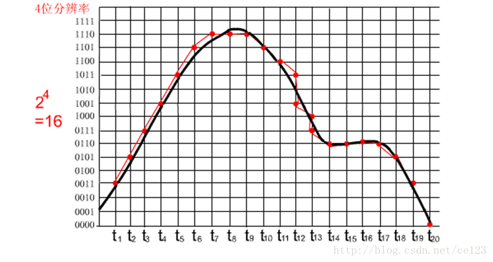
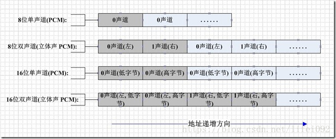

# PCM文件格式
- [PCM文件格式](#1)

## <a id="1">PCM文件格式</a>
PCM文件：模拟音频信号经模数转换（A/D变换）直接形成的二进制序列，该文件没有附加的文件头和文件结束标志。Windows的Convert工具能够把PCM音频格式的文件转换成Microsoft的WAV格式的文件。    

将音频数字化。事实上就是将声音数字化。最常见的方式是透过脉冲编码调制PCM(Pulse Code Modulation) 。
运作原理例如以下:首先我们考虑声音经过麦克风，转换成一连串电压变化的信号。例如以下图所看到的。这张图的横座标为秒。纵座标为电压大小。要将这种信号转为 PCM 格式的方法，是使用三个參数来表示声音。它们是：声道数、採样位数和採样频率。

样频率：即取样频率,指每秒钟取得声音样本的次数。採样频率越高,声音的质量也就越好,声音的还原也就越真实，但同一时候它占的资源比較多。因为人耳的分辨率非常有限,太高的频率并不能分辨出来。
在16位声卡中有22KHz、44KHz等几级,当中，22KHz相当于普通FM广播的音质，44KHz已相当于CD音质了，眼下的经常使用採样频率都不超过48KHz。 

採样位数：即採样值或取样值（就是将採样样本幅度量化）。它是用来衡量声音波动变化的一个參数。也能够说是声卡的分辨率。
它的数值越大，分辨率也就越高。所发出声音的能力越强。

声道数：非常好理解，有单声道和立体声之分，单声道的声音仅仅能使用一个喇叭发声（有的也处理成两个喇叭输出同一个声道的声音）。立体声的PCM 能够使两个喇叭都发声（一般左右声道有分工） ，更能感受到空间效果。

下再用图解来看看採样位数和採样频率的概念。让我们来看看这几幅图。图中的黑色曲线表示的是PCM 文件录制的自然界的声波，红色曲线表示的是PCM 文件输出的声波。横坐标便是採样频率；纵坐标便是採样位数。

这几幅图中的格子从左到右，逐渐加密，先是加大横坐标的密度，然后加大纵坐标的密度。显然，当横坐标的单位越小即两个採样时刻的间隔越小。则越有利于保持原始声音的真实情况，换句话说，採样的频率越大则音质越有保证；同理，当纵坐标的单位越小则越有利于音质的提高。即採样的位数越大越好。



```c++
在计算机中採样位数一般有8位和16位之分。但有一点请大家注意，8位不是说把纵坐标分成8份，而是分成2的8次方即256份； 同理16位是把纵坐标分成2的16次方65536份； 而採样频率一般有11025HZ（11KHz），22050HZ（22KHz）、44100Hz（44KHz）三种。

那么，如今我们就能够得到PCM文件所占容量的公式：存储量 = (採样频率*採样位数*声道)*时间/8(单位：字节数).
	比如，数字激光唱盘(CD－DA。红皮书标准)的标准採样频率为44.lkHz。採样数位为16位，立体声(2声道)，能够差点儿无失真地播出频率高达22kHz的声音，这也是人类所能听到的最高频率声音。
激光唱盘一分钟音乐须要的存储量为：　　　　　
(44.1*1000*l6*2)*60/8=10。584。000(字节)=10.584MBytes
这个数值就是PCM声音文件在硬盘中所占磁盘空间的存储量。
	计算机音频文件的格式决定了其声音的品质，日常生活中电话、收音机等均为模拟音频信号。即不存在採样频率和採样位数的概念，我们能够这样比較一下：
44KHz，16BIT的声音称作：CD音质；
22KHz、16Bit的声音效果近似于立体声（FM Stereo）广播。称作：广播音质；
11kHz、8Bit的声音，称作：电话音质。 
微软的WAV文件就是PCM编码的一种,在后面我会具体介绍.

PCM：其数据排列格式为左右声道每个样本点数据交错排列
```




## links
  * [目录](<音视频入门到精通目录.md>)