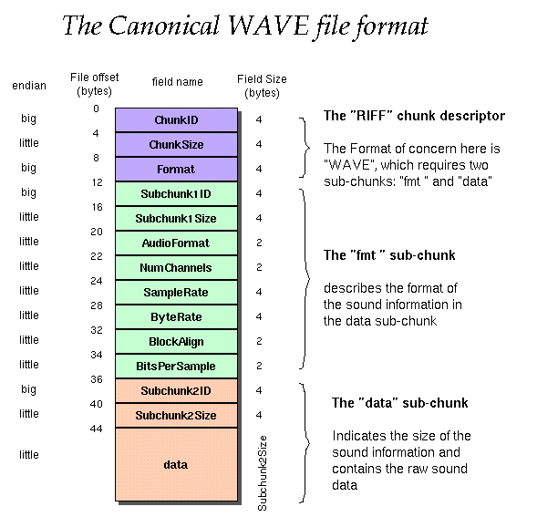
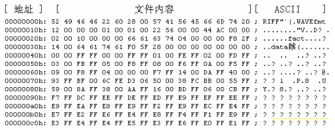

# wav
- [wav文件格式分析与详解](#1)

## <a id="1">wav文件格式分析与详解</a>
参考连接：   
1.wav文件格式分析与详解   
https://www.cnblogs.com/ranson7zop/p/7657874.html
 
###  概述
WAV文件是在PC机平台上很常见的、最经典的多媒体音频文件,最早于1991年8月出现在Windows 3.1操作系统上,文件扩展名为WAV,是WaveFom的简写,也称为波形文件,可直接存储声音波形,还原的波形曲线十分逼真。WAV文件格式简称WAV格式是一种存储声音波形的数字音频格式,是由微软公司和IBM联合设计的,经过了多次修订,可用于Windows,Macintosh,Linix等多种操作系统,详述如下。


(1)采样频率:又称取样频率。是单位时间内的采样次数,决定了数字化音频的质量。采样频率越高,数字化音频的质量越好,还原的波形越完整,播放的声音越真实,当然所占的资源也越多。根据奎特采样定理,要从采样中完全恢复原始信号的波形,采样频率要高于声音中最高频率的两倍。人耳可听到的声音的频率范围是在16Hz-20kHz之间。因此,要将听到的原声音真实地还原出来,采样频率必须大于4 0k H z 。常用的采样频率有8 k H z 、1 1 . 02 5 k H z 、22.05kHz、44.1kHz、48kHz等几种。22.05KHz相当于普通FM广播的音质,44.1KHz理论上可达到CD的音质。对于高于48KHz的采样频率人耳很难分辨,没有实际意义。

(2)采样位数:也叫量化位数(单位:比特),是存储每个采样值所用的二进制位数。采样值反应了声音的波动状态。采样位数决定了量化精度。采样位数越长,量化的精度就越高,还原的波形曲线越真实,产生的量化噪声越小,回放的效果就越逼真。常用的量化位数有4、8、12、16、24。量化位数与声卡的位数和编码有关。如果采用PCM编码同时使用8 位声卡, 可将音频信号幅度从上限到下限化分成256个音量等级,取值范围为0-255;使用16位声卡,可将音频信号幅度划分成了64K个音量等级,取值范围为-32768至32767。

(3)声道数:是使用的声音通道的个数,也是采样时所产生的声音波形的个数。播放声音时,单声道的WAV一般使用一个喇叭发声,立体声的WAV可以使两个喇叭发声。记录声音时,单声道,每次产生一个波形的数据,双声道,每次产生两个波形的数据,所占的存储空间增加一倍。

###  WAV文件的编码
编码包括了两方面内容,一是按一定格式存储数据,二是采用一定的算法压缩数据。WAV格式对音频流的编码没有硬性规定,支持非压缩的PCM(Puls Code Modulation)脉冲编码调制格式,还支持压缩型的微软自适应分脉冲编码调制Microsoft ADPCM(Adaptive Differential Puls Code Modulation)、国际电报联盟(International Telegraph Union)制定的语音压缩标准ITUG.711 a-law、ITU G.711-law、IMA ADPCM、ITU G.723 ADPCM (Yamaha)、GSM 6.10、ITU G.721 ADPCM编码和其它压缩算法。MP3编码同样也可以运用在WAV中,只要安装相应的Decode,就可以播放WAV中的MP3音乐。



WAVE 文件头格式

<div>
<p>表 1</p>
<table border="0">
<tbody>
<tr>
<td>块标识(4Bytes)</td>
</tr>
<tr>
<td>块长度(4Bytes)</td>
</tr>
<tr>
<td>数据</td>
</tr>
</tbody>
</table>
<p>&nbsp;</p>
<p>表 2 WAVE 文件结构</p>
<table border="0">
<tbody>
<tr>
<td>RIFF 块</td>
</tr>
<tr>
<td>文件格式类型“WAVE”</td>
</tr>
<tr>
<td>fmt 块</td>
</tr>
<tr>
<td>fact 块(压缩编码格式要含有该块)</td>
</tr>
<tr>
<td>data 块</td>
</tr>
</tbody>
</table>
<p>&nbsp;</p>
<p>表 3 WAVE 文件头格式</p>
<table border="0">
<tbody>
<tr>
<td>
<p>偏移<br>地址</p>
</td>
<td>字节数</td>
<td>
<p>数据<br>类型</p>
</td>
<td>字段名称</td>
<td>字段说明</td>
</tr>
<tr>
<td>00H</td>
<td>4</td>
<td>字符</td>
<td>文档标识</td>
<td>大写字符串"RIFF",标明该文件为有效的 RIFF 格式文档。</td>
</tr>
<tr>
<td>04H</td>
<td>4</td>
<td>长整型数</td>
<td>文件数据长度</td>
<td>从下一个字段首地址开始到文件末尾的总字节数。该字段的数值加 8 为当前文件的实际长度。</td>
</tr>
<tr>
<td>08H</td>
<td>4</td>
<td>字符</td>
<td>文件格式类型</td>
<td>所有 WAV 格式的文件此处为字符串"WAVE",标明该文件是 WAV 格式文件。</td>
</tr>
<tr>
<td>0CH</td>
<td>4</td>
<td>字符</td>
<td>格式块标识</td>
<td>小写字符串,"fmt "。</td>
</tr>
<tr>
<td>10H</td>
<td>4</td>
<td>长整型数</td>
<td>格式块长度。</td>
<td>其数值不确定,取决于编码格式。可以是 16、 18 、20、40 等。(见表 2)</td>
</tr>
<tr>
<td>14H</td>
<td>2</td>
<td>整型数</td>
<td>编码格式代码。</td>
<td>常见的 WAV 文件使用 PCM 脉冲编码调制格式,该数值通常为 1。(见表 3)</td>
</tr>
<tr>
<td>16H</td>
<td>2</td>
<td>整型数</td>
<td>声道个数</td>
<td>单声道为 1,立体声或双声道为 2</td>
</tr>
<tr>
<td>18H</td>
<td>4</td>
<td>长整型数</td>
<td>采样频率</td>
<td>每个声道单位时间采样次数。常用的采样频率有 11025, 22050 和 44100 kHz。</td>
</tr>
<tr>
<td>1CH</td>
<td>4</td>
<td>长整型数</td>
<td>数据传输速率,</td>
<td>该数值为:声道数×采样频率×每样本的数据位数/8。播放软件利用此值可以估计缓冲区的大小。</td>
</tr>
<tr>
<td>20H</td>
<td>2</td>
<td>整型数</td>
<td>数据块对齐单位</td>
<td>采样帧大小。该数值为:声道数×位数/8。播放软件需要一次处理多个该值大小的字节数据,用该数值调整缓冲区。</td>
</tr>
<tr>
<td>22H</td>
<td>2</td>
<td>整型数</td>
<td>采样位数</td>
<td>存储每个采样值所用的二进制数位数。常见的位数有 4、8、12、16、24、32</td>
</tr>
<tr>
<td>24H</td>
<td>&nbsp;</td>
<td>&nbsp;</td>
<td>&nbsp;</td>
<td>对基本格式块的扩充部分(详见扩展格式块,格式块的扩充)</td>
</tr>
</tbody>
</table>
<p>&nbsp;</p>
<p>表 4 常见的压缩编码格式</p>
<table border="0">
<tbody>
<tr>
<td>格式代码</td>
<td>格式名称</td>
<td>fmt 块长度</td>
<td>fact 块</td>
</tr>
<tr>
<td>1(0x0001)</td>
<td>PCM/非压缩格式</td>
<td>16</td>
<td>&nbsp;</td>
</tr>
<tr>
<td>2(0x0002</td>
<td>Microsoft ADPCM</td>
<td>18</td>
<td>√</td>
</tr>
<tr>
<td>3(0x0003)</td>
<td>IEEE float</td>
<td>18</td>
<td>√</td>
</tr>
<tr>
<td>6(0x0006)</td>
<td>ITU G.711 a-law</td>
<td>18</td>
<td>√</td>
</tr>
<tr>
<td>7(0x0007)</td>
<td>ITU G.711 μ-law</td>
<td>18</td>
<td>√</td>
</tr>
<tr>
<td>49(0x0031)</td>
<td>GSM 6.10</td>
<td>20</td>
<td>√</td>
</tr>
<tr>
<td>64(0x0040)</td>
<td>ITU G.721 ADPCM</td>
<td>&nbsp;</td>
<td>√</td>
</tr>
<tr>
<td>65,534(0xFFFE)</td>
<td>见子格式块中的编码格式</td>
<td>40</td>
<td>&nbsp;</td>
</tr>
</tbody>
</table>
<p>&nbsp;</p>
<p>表5</p>
<table border="0">
<tbody>
<tr>
<td>偏移</td>
<td>长度</td>
<td>数据类型</td>
<td>字段名称</td>
<td>字段说明</td>
</tr>
<tr>
<td>24H</td>
<td>2</td>
<td>整型数</td>
<td>扩展区长度</td>
<td>22</td>
</tr>
<tr>
<td>26H</td>
<td>2</td>
<td>整型数</td>
<td>有效采样位数</td>
<td>最大值为每个采样字节数*8</td>
</tr>
<tr>
<td>28H</td>
<td>4</td>
<td>长整形数</td>
<td>扬声器位置</td>
<td>声道号与扬声器位置映射的二进制掩码</td>
</tr>
<tr>
<td>32H</td>
<td>2</td>
<td>整型数</td>
<td>编码格式</td>
<td>真正的编码格式代码</td>
</tr>
<tr>
<td>34H</td>
<td>14</td>
<td>&nbsp;</td>
<td>&nbsp;</td>
<td>\x00\x00\x00\x00\x10\x00\x80\x00\x00\xAA\x00\x38\x9B\x71</td>
</tr>
</tbody>
</table>
<p>&nbsp;</p>
<p>表 6 fact 块结构示意图</p>
<table border="0">
<tbody>
<tr>
<td>字段</td>
<td>长度</td>
<td>内容</td>
</tr>
<tr>
<td>块标识</td>
<td>4</td>
<td>"fact"</td>
</tr>
<tr>
<td>块长度</td>
<td>4</td>
<td>4(最小数值为 4 个字节)</td>
</tr>
<tr>
<td>采样总数</td>
<td>4</td>
<td>采样总数 (每个声道)</td>
</tr>
</tbody>
</table>
<p>&nbsp;</p>
<p>表7</p>
<p>8位PCM</p>
<table style="height: 204px; width: 199px" border="0">
<tbody>
<tr>
<td>&nbsp;</td>
<td>样本 1</td>
<td>&nbsp;</td>
<td>样本 2</td>
<td>&nbsp;</td>
</tr>
<tr>
<td>8 位单声道</td>
<td>0 声道</td>
<td>&nbsp;</td>
<td>0 声道</td>
<td>&nbsp;</td>
</tr>
<tr>
<td>8 位立体声</td>
<td>0 声道(左)</td>
<td>1 声道(右)</td>
<td>0 声道(左)</td>
<td>1 声道(右)</td>
</tr>
</tbody>
</table>
<p>表8</p>
<p>16位单声道PCM,每个采样点占2个字节</p>
<table border="0">
<tbody>
<tr>
<td>&nbsp;</td>
<td>样本 1</td>
<td>&nbsp;</td>
<td>样本 2</td>
<td>&nbsp;</td>
</tr>
<tr>
<td>
<p>16 位单<br>声道</p>
</td>
<td>
<p>0 声道<br>低字节</p>
</td>
<td>
<p>0 声道<br>高字节</p>
</td>
<td>
<p>0 声道<br>低字节</p>
</td>
<td>
<p>0 声道<br>高字节</p>
</td>
</tr>
</tbody>
</table>
<p>&nbsp;</p>
<p>表9</p>
<p>16位立声道PCM,每个采样点占4个字节</p>
<table border="0">
<tbody>
<tr>
<td>样本 1</td>
<td>&nbsp;</td>
<td>&nbsp;</td>
<td>&nbsp;</td>
</tr>
<tr>
<td>
<p>0-左声<br>道低字节</p>
</td>
<td>
<p>0-左声<br>道高字节</p>
</td>
<td>
<p>1-右声<br>道低字节</p>
</td>
<td>
<p>1-右声<br>道高字节</p>
</td>
</tr>
</tbody>
</table>
</div>


### 实列
WAV文件的声音数据保存在数据块中。块标识符为“data”,块长度值为声音数据的长度。从数据块的第9个字符开始是声音波形采样数据。每个样本按采样的时间先后顺序写入。样本的字节数取决于采样位数。对于多字节样本,低位字节数据放在低地址单元,相邻的高位字节数据放在高地址单元。多声道样本数据采用交替方式存储。例如:立体声(双声道)采样值的存储顺序为:通道1第1采样值,通道2第1采样值;通道1第2采
样值,通道2第2采样值;以此类推。基于PCM编码的样本数据排列方式如表7-9。 



```c++
（1）“52 49 46 46”这个是Ascii字符“RIFF”，这部分是固定格式，表明这是一个WAVE文件头。
（2）“22 60 28 00”，这个是我这个WAV文件的数据大小，这个大小包括除了前面4个字节的所有字节，也就等于文件总字节数减去8
。16进制的“22 60 28 00”对应是十进制的“2646050”。
（3）“57 41 56 45 66 6D 74 20”，也是Ascii字符“WAVEfmt”，这部分是固定格式。
以后是PCMWAVEFORMAT部分
（4）“12 00 00 00”，这是一个DWORD，对应数字18，这个对应定义中的PCMWAVEFORMAT部分的大小，可以看到后面的这个段内容正
好是18个字节。一般情况下大小为16，此时最后附加信息没有，上面这个文件多了两个字节的附加信息。
（5）“01 00”，这是一个WORD，对应定义为编码格式（WAVE_FORMAT_PCM格式一般用的是这个）。
（6）“01 00”，这是一个WORD，对应数字1，表示声道数为1，是个单声道Wav。
（7）“22 56 00 00”对应数字22050，代表的是采样频率22050，采样率（每秒样本数），表示每个通道的播放速度
（8）“44 AC 00 00”对应数字44100，代表的是每秒的数据量，波形音频数据传送速率，其值为通道数×每秒样本数×每样本的数据位
数／8（1*22050*16/8）。播放软件利用此值可以估计缓冲区的大小。
（9）“02 00”对应数字是2，表示块对齐的内容。数据块的调整数（按字节算的），其值为通道数×每样本的数据位值／8。播放软件需
要一次处理多个该值大小的字节数据，以便将其值用于缓冲区的调整。
（10）“10 00”数值为16，采样大小为16Bits，每样本的数据位数，表示每个声道中各个样本的数据位数。如果有多个声道，对每个
声道而言，样本大小都一样。
（11）“00 00”此处为附加信息（可选），和（4）中的size对应。
（12）“66 61 73 74” Fact是可选字段，一般当wav文件由某些软件转化而成，则包含该项，“04 00 00 00”Fact字段的大小为4字
节，“F8 2F 14 00”是fact数据。
（13）“64 61 74 61”，这个是Ascii字符“data”，标示头结束，开始数据区域。
（14）“F0 5F 28 00”十六进制数是“0x285ff0”,对应十进制2646000，是数据区的开头，以后数据总数，看一下前面正好可以看
到，文件大小是2646050，从（2）到（13）包括（13）正好是2646050-2646000=50字节。
```


## links
  * [目录](<音视频入门到精通目录.md>)