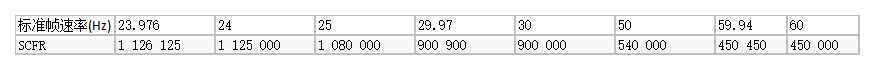
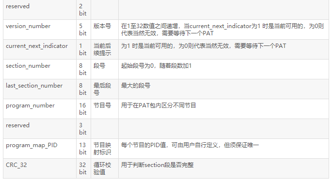

# 2.1MPEG2PS&TS
- [1.1简介](#1.1)
- [1.2 PS流格式](#1.2)
- [1.3 TS流格式](#1.3)
- [1.4 PTS DTS PCR同步机制](#1.4)

## <a id="1.1">1.1简介</a>
- [1.1.1 PS TS ES介绍](#1.1.1)
- [1.1.2 参考链接](#1.1.2)

### <a id="1.1.1">1.1.1 PS TS ES介绍</a>
- 1）ES ES--Elementary  Streams  
原始流是直接从编码器出来的数据流，可以是编码过的视频数据流（H.264,MJPEG等），音频数据流（AAC），或其他编码数据流的统称。ES流经过PES打包器之后，被转换成PES包。每个ES都由若干个存取单元（AU）组成，每个视频AU或音频AU都是由头部和编码数据两部分组成，1个AU相当于编码的1幅视频图像或1个音频帧，也可以说，每个AU实际上是编码数据流的显示单元，即相当于解码的1幅视频图像或1个音频帧的取样。  
- 2）PES PES--Packetized  Elementary Streams  
ES形成的分组称为PES分组，是用来传递ES的一种数据结构。PES流是ES流经过PES打包器处理后形成的数据流，在这个过程中完成了将ES流分组、打包、加入包头信息等操作（对ES流的第一次打包）。PES流的基本单位是PES包。PES包由包头和payload组成。  3）
- 3）PS  PS--Program Stream 节目流
PS流由PS包组成，而一个PS包又由若干个PES包组成（到这里，ES经过了两层的封装）。PS包的包头中包含了同步信息与时钟恢复信息。一个PS包最多可包含具有同一时钟基准的16个视频PES包和32个音频PES包。  
- 4）TS TS--Transport Stream 传输流
由定长的TS包组成（188字节），而TS包是对PES包的一个重新封装（到这里，ES也经过了两层的封装）。PES包的包头信息依然存在于TS包中。TS流与PS流的区别在于TS流的包结构是固定长度的,而PS流的包结构是可变长度的。PS包由于长度是变化的,一旦丢失某一PS包的同步信息,接收机就会进入失步状态,从而导致严重的信息丢失事件。而TS码流由于采用了固定长度的包结构,当传输误码破坏了某一TS包的同步信息时,接收机可在固定的位置检测它后面包中的同步信息,从而恢复同步,避免了信息丢失。因此在信道环境较为恶劣、传输误码较高时一般采用TS码流,而在信环境较好、传输误码较低时一般采用PS码流。

PS&TS：两种视频或影片封装格式，常用于高清片。扩展名分别为VOB/EVO和TS等；其文件编码一般用MPEG2/VC-1/H.264。TS流与PS流的区别在于TS流的包结构是固定长度的，而PS流的包结构是可变长度的。

MPEG2(PS)就是常见dvd上那种vob格式的（PS是Program Stream程序流缩写），TS的全称则是Transport Stream（传输流），TS格式在网络上现在主要在一些高清视频，至pal和ntsc是两种不同的制式,二者在分辨率和帧数上有区别。<font color=red>MPEG2-PS主要应用于存储的具有固定时长的节目，如DVD电影，而MPEG-TS则主要应用于实时传送的节目，比如实时广播的电视节目。</font>这两种格式的主要区别是什么呢？简单地打个比喻说，你将DVD上的VOB文件的前面一截cut掉（或者干脆就是数据损坏），那么就会导致整个文件无法解码了，而电视节目是你任何时候打开电视机都能解码（收看）的，所以，MPEG2-TS格式的特点就是要求从视频流的任一片段开始都是可以独立解码的。

PS包与TS包在结构上的这种差异，导致了它们对传输误码具有不同的抵抗能力，因而应用的环境也有所不同。<font color=red>TS码流由于采用了固定长度的包结构，当传输误码破坏了某一TS包的同步信息时，接收机可在固定的位置检测它后面包中的同步信息，从而恢复同步，避免了信息丢失。而PS包由于长度是变化的，一旦某一PS包的同步信息丢失，接收机无法确定下一包的同步位置，就会造成失步，导致严重的信息丢失。因此，在信道环境较为恶劣，传输误码较高时，一般采用TS码流；而在信道环境较好，传输误码较低时，一般采用PS码流。</font>

<font color=red>ES是直接从编码器出来的数据流，可以是编码过的视频数据流，音频数据流，或其他编码数据流的统称。ES流经过PES打包器之后，被转换成PES包。PES包由包头和payload组成。PTS/DTS是打在PES包里面的，这两个parameters是解决视音频同步显示，防止解码器输入缓存上溢或下溢的关键。PTS表示显示单元出现在系统目标解码器(STD: system target
decoder)的时间，DTS表示将存取单元全部字节从STD的ES解码缓存器移走的时刻。每个I、P、B帧的包头都有一个PTS和DTS，但PTS与DTS对B帧都是一样的，无须标出B帧的DTS。对I帧和P帧，显示前一定要存储于视频解码器的重新排序缓存器中，经过延迟（重新排序）后再显示，一定要分别标明PTS和DTS。</font>

ES首先需打包成PES流包，然后PES根据需要打包成PS或TS包进行存储或传输。其每路ES只包含一路信源的编码数据流，所以每路PES也只包含相对应信源的数据流。

对PS流而言，每个PES包头含有PTS和DTS，流识别码，用于区别不同性质ES。然后通过PS复用器将PES包复用成PS包。实际上是将PES包分解为更细小的PS包。在解码的时候，解复用器将PS分解成一个个PES包，拆包器然后将PES包拆成视频和音频的ES，最后输入至各自解码器进行解码。一个问题是：各个ES在解码时，如何保证视音频的同步呢？除了PTS和DTS的配合工作外，还有一个重要的参数是SCR(system clockreference)。在编码的时候，PTS，DTS和SCR都是由STC(system timeclock)生成的，在解码时，STC会再生，并通过锁相环路（PLL－phase lockloop），用本地SCR相位与输入的瞬时SCR相位锁相比较，以确定解码过程是否同步，若不同步，则用这个瞬时SCR调整27MHz的本地时钟频率。最后，PTS，DTS和SCR一起配合，解决视音频同步播放的问题。

<font color=red>TS流也是由一个或多个PES组合而来的，他们可以具有相同的时间基准，也可以不同。其基本的复用思想是，对具有相同时间基准的多个PES现进行节目复用，然后再对相互有独立时间基准的各个PS进行传输复用，最终产生出TS。</font>

### 
### <a id="1.1.2">1.1.2 参考链接：</a>
- 1.PS流的格式和解析总结
https://blog.csdn.net/rankun1/article/details/69950873 
- 2.MPEG-2 PS流
https://blog.csdn.net/duanbeibei/article/details/1698183
- 4.MPEG-TS 格式解析
https://blog.csdn.net/Kayson12345/article/details/81266587
- 5.浅析mpeg-ts封装结构
https://blog.csdn.net/michaeluo/article/details/75263462
- 6.MPEG2-TS音视频同步原理(PCR dts pts)
https://blog.csdn.net/charleslei/article/details/52299388

## <a id="1.2">1.2 PS流格式</a>

- [1.2.1 PS包结构](#1.2.1)
- [1.2.2 PS包头PSheader](#1.2.2)
- [1.2.3 PS系统头 PSsystem header](#1.2.3)
- [1.2.4 PS 映射头 PS system Map](#1.2.4)
- [1.2.5 PES包 PES_packet](#1.2.5)
- [1.2.6 PES中DTS&PTS](#1.2.6)
- [1.2.7 PS总结](#1.2.7)


将具有共同时间基准的一个或多个PES组合（复合）而成的单一的数据流称为节目流（Program Stream）。ES是直接从编码器出来的数据流，可以是编码过的视频数据流，音频数据流，或其他编码数据流的统称。ES流经过PES打包器之后，被转换成PES包。  
<font color=red>针对H264 做PS 封装：每个IDR NALU 前一般都会包含SPS、PPS 等NALU，因此将SPS、PPS、IDR 的NALU 封装为一个PS 包，包括ps 头，然后加上PS system header，PS system map，PES header+h264 raw data。所以一个IDR NALU PS 包由外到内顺序是:  
PSheader | PS system header | PS system Map | PES header | h264 raw data。  
对于其它非关键帧的PS 包，就简单多了，直接加上PS头和PES 头就可以了。
</font>顺序为：PS header | PES header | h264raw data。    
以上是对只有视频video 的情况，如果要把音频Audio也打包进PS 封装，也可以。当有音频数据时，将数据加上PES header 放到视频PES 后就可以了。
<font color=red>顺序如下：PS 包=PS头|PES(video)|PES(audio)，再用RTP 封装发送就可以了。</font>
PES包长度域有两个字节，共16比特，因此PES包的最大长度是65535字节。PS不能在rtsp中运输只能用h264搭载rtsp。
- 1.IDR关键帧封装：
每个IDR NALU 前一般都会包含SPS、PPS等NALU，因此将SPS、PPS、IDR 的NALU 封装为一个PS 包，包括ps 头，然后加上PSsystem header，PS system map，PESheader+h264 raw data。
所以一个IDR NALU PS 包由外到内顺序是： 
PSheader|PS system header | PS system Map | PES header | h264 raw data。
- 2.非关键帧封装：
PS包从外带内的顺序是：
PSheader|PES header | h264 raw data。
- 3.含有音频的PS封装：
PS头|PES(video)|PES(audio)
PSheader|PES header | h264 raw data|PES header|AAC raw data

### <a id="1.1.2">1.2.1 PS包结构</a>
PS包结构由包头、系统头、系统映射、PES包四部分构成。具体参考以上。
包头由PS包起始码、系统时钟基准（SCR-System Clock Reference）的基本部分、SCR的扩展部分和PS复用速率4部分组成。
结构如下：


### <a id="1.2.2">1.2.2 PS包头PSheader</a>
位串，用来标志一个包的开始PACK identifier -- 0xBA，marker_bit=1

- SCR和SCR_ext：是系统时钟参考，一个以27MHz驱动的计数器，用作同步流的参考。时钟除以300以上（以匹配PTS / DTS等90KHz时钟），商为SCR（33位），余数余数为SCR_ext（9位）
- Program_Mux_Rate：这是一个22位整数，指定程序流目标解码器在包含它的包中接收节目流的速率。 program_mux_rate的值以50字节/秒为单位进行测量。值0被禁止。该字段所表示的值用于在2.5.2中定义P-STD输入端的字节到达时间。该字段值在本标准中的节目多路复合流的不同包中取值可能不同。
- pack_stuffing_length：一个3位整数，指定此字段后面的填充字节数。
- stuffing_byte：填充字节，这是一个固定的8位值，等于'1111 1111'，可以由编码器插入，例如，以满足通道的要求。它被解码器丢弃。

>实例分析：
原始待分析数据：00 00 01 BA 44 00 04 00 0401 00 03 FF F8
- 1. Pack_start_code ps包开始标志位:
十六进制：00 00 01 BA
标识一个PS包的开始;
- 2. System_clock_reference系统时钟参考字段和扩展字段（六字节）：系统时钟参考(SCR)分两部分编码的42位字段。第一部分system_clock_reference_base是一个长度为33位的字段；第二部分system_clock_reference_extenstion是一个长度为9位的字段。SCR字段指出了基本流中包含ESCR_base最后一位的字节到达节目目标解码器输入端的期望时间。
十六进制：44 00 04 00 04 01
二进制：01-00 0-1-00 0000 00000000 0-1-00 0000 0000 0000 0-1-00 0000 000-1
即可以看到参考时钟还是参考时钟的扩展都是0;
- 3. program_mux_rate字段节目符合速率字段（三字节）：一个22位整数，规定P-STD在包含该字段的包期间接收节目流的速率。其值以50字节/秒为单位。不允许取0值。该字段值在本标准中的节目多路复合流的不同包中取值可能不同。
十六机制：00 03 FF
二进制：0000 00000000 0011 1111 1111
十进制：255 那么说明速率大小为255*50=12750Byte/s
- 4. pack_stuffing_length填充字段长度：
十六机制：F8
二进制：1111 1000
说明是0则表示无填充字节。
>总结：  
>1. ps头无论是什么样的包都是要有的，00 00 01 BA是关键，其它字段基本可以忽略不计；   
>2. 无扩展字段是直接读十四个字节跳过解析即可，但是当pack_stuffing_length不为0时，需要解析出来，加上该长度跳过。该字段位于第十四字节的后面三bit位；  
>3. 也可以根据该值进行打包和封装，基本对应bit位都是用默认值；  

### <a id="1.2.3">1.2.3 PS系统头 PSsystem header</a>
位串，BB指出系统标题的开始  


- header_length：标题长度字段，16位字段。指出该字段后的系统标题的字节长度。在本规范将来的扩充中可能扩展该字段。
- rate_bound ：速率界限字段，22位字段，取值不小于编码在节目流的任何包中的program_mux_rate字段的最大值。该字段可被解码器用于估计是否有能力对整个流解码。
- audio_bound：音频界限字段，6位字段，取值是在从0到32的闭区间中的整数，且不小于节目流中解码过程同时活动的GB/T XXXX.3和GB/T AAAA.3音频流的最大数目。在本小节中，若STD缓冲区非空或展现单元正在P-STD模型中展现，则GB/T XXXX.3和GB/T AAAA.3音频流的解码过程是活动的。
- fixed_flag：固定标志字段，1位标志位。置'1'时表示比特率恒定的操作；置'0'时，表示操作的比特率可变。在恒定比特率的操作期间，复合的GB/T XXXX.1流中的system_clock_reference字段值应遵从下面的线性公式:  
SCR_base(i)＝((c1×i＋c2) DIV 300) % 233              (2-22)  
SCR_ext(i)＝((c1×i＋c2) DIV 300) % 300               (2-23)  
其中：  
c1    对所有i均有效的实型常数；  
c2    对所有i均有效的实型常数；  
i     在GB/T XXXX.1复合流中包含任何system_clock_reference字段的最后一位的字节索引。  
- CSPS_flag：CSPS标志字段，1位字段。置'1'时，节目流符合2.7.9中定义的限制
- system_audio_lock_flag：系统音频锁定标志字段，1位字段。表示在系统目标解码器的音频采样率和system_clock_frequency之间存在规定的比率。system_clock_frequency在2.5.2.1中定义而音频采样率由GB/T XXXX.3规定。如果对节目流中所有音频基本流的所有展现单元，system_clock_frequency和实际音频采样率的比例SCASR是恒定的，且对音频流中所指出的标准采样率和下表中数值相等，则该字段只能为'1'。  
SCASR＝(system_clock_frequency) / audio_sample_rate_in_the_P-STD    (2-24)
记号X/Y表示实数除法。

- system_video_lock_flag：系统视频锁定标志字段，1位字段。表示在系统目标解码器的视频帧速率和system_clock_frequency之间存在规定的比率。system_clock_frequency在2.5.2.1中定义而视频帧速率由GB/T XXXX.2规定。如果对GB/T XXXX.1中所有视频基本流的所有展现单元，system_clock_frequency和实际视频帧速率的比例SCFR是恒定的，且对视频流中所指出的标准帧速率和下表中数值相等，则该字段只能为'1'。  
SCFR＝system_clock_frequency / frame_rate_in_the_P-STD             (2-25)  
  
比率SCFR的值是精确的。对于23.976，29.97或59.94帧/秒的标准速率，实际的帧速率与标准速率略有不同。  
- video_bound：视频界限字段。5位字段，取值是在从0到16的闭区间中的整数且不小于节目流中解码过程同时活动的GB/T XXXX.2和GB/T AAAA.2流的最大数目。在本小节中，若P-STD缓冲区非空或展现单元正在P-STD模型中展现，则GB/T XXXX.2和GB/T AAAA.2视频流的解码过程是活动的。
- packet_rate_restriction_flag：分组速率限制标志字段，1位标志位。若CSPS标识为'1'，则该字段表示2.7.9中规定的哪个限制适用于分组速率。若CSPS标识为'0'，则该字段的含义未定义。
- reserved_bits：保留位字段，7位字段。被保留供ISO/IEC将来使用。它的值应为'111 1111'，除非ISO/IEC对它作出其它规定。
stream_id：流标识字段，8位字段。指示其后的P-STD_buffer_bound_scale和P-STD_buffer_size_bound字段所涉及的流的编码和基本流号码。  
若取值'1011 1000'，则其后的P-STD_buffer_bound_scale和P-STD_buffer_size_bound字段指节目流中所有的音频流。  
若取值'1011 1001'，则其后的P-STD_buffer_bound_scale和P-STD_buffer_size_bound字段指节目流中所有的视频流。  
若stream_id取其它值，则应该是大于或等于'1011 1100'的一字节值且应根据表2-18解释为流的编码和基本流号码。  
节目流中的每个基本流应在每个系统标题中通过这种机制精确地规定一次它的P-STD_buffer_bound_scale和P-STD_buffer_size_bound。
- P-STD_buffer_bound_scale：P-STD缓冲区界限比例字段。1位字段。表示用于解释后续P-STD_buffer_size_bound字段的比例系数。若前面的stream_id表示一个音频流，则该字段值为'0'。若表示一个视频流，则该字段值为'1'。对于所有其它的流类型，该字段值可以为'0'也可以为'1'。
- P-STD_buffer_size_bound：P-STD缓冲区大小界限字段。13位无符号整数，取值不小于节目流中流n的所有分组的P-STD缓冲区大小BSn的最大值。若P-STD_buffer_bound_scale的值为'0'，则该字段以128字节为单位来度量缓冲区大小的边界。若P-STD_buffer_bound_scale的值为'1'，则该字段以1024字节为单位来度量缓冲区大小的边界。因此：  
```Go
if (P-STD_buffer_bound_scale = = 0)
  BSn≤P-STD_buffer_size_bound×128
else
  BSn≤P-STD_buffer_size_bound×1024
```

>实例分析：  
原始待分析数据：00 00 01 BB 00 09 81 86 A105 E1 7F E0 E8 00  
- 1. System_header_start_code系统头（四字节）：指出系统标题的开始
十六机制：00 00 01 BB  
- 2. header_length标题长度字段（二字节） ：16位字段。指出该字段后的系统标题的字节长度。在本规范将来的扩充中可能扩展该字段。
十六进制：00 09 说明后面还有9字节，大部分系统头则表示有十五字节，其实解析到这里我们就可以直接跳过4+2+9字节继续解析后面的包，因为系统头里面的所有字节含义我们都不关注； 
- 3. Rate_bound 速率界限字段（三字节）：22位字段，取值不小于编码在节目流的任何包中的program_mux_rate字段的最大值。该字段可被解码器用于估计是否有能力对整个流解码。 
十六机制：81 86 A1  
二进制：1000 0001 1000 0110 1010 0001  
- 4.Audio_bound 音频界限字段（1字节前6bit位）：6位字段，取值是在从0到32的闭区间中的整数;
十六机制：05  
二进制：0000 0101  
十进制：1  
- 5. Fixed_flag固定标记字段：1位标志位。置'1'时表示比特率恒定的操作；置'0'时，表示操作的比特率可变。  
十六机制：05  
二进制：000 0101  
- 6. CSPS_flag CSPS标志字段:置'1'时，节目流符合2.7.9中定义的限制。一般就是默认为1；  
十六机制：05  
二进制：000 0101  
- 7. System_aduio_lock_flag系统音频锁定标记字段：1位字段。表示在系统目标解码器的音频采样率和system_clock_frequency之间存在规定的比率。一般默认1；  
十六机制：E1  
二进制：1110 0001  
十进制：1  
- 8.System_video_lock_flag系统视频锁定标志字段：1位字段。表示在系统目标解码器的视频帧速率和system_clock_frequency之间存在规定的比率。一般默认1；  
十六机制：E1  
二进制：1110 0001  
十进制：1  
- 9.Video_bound视频界限字段：5位字段，取值是在从0到16的闭区间中的整数且不小于节目流中解码过程同时活动的GB/T XXXX.2和GB/T AAAA.2流的最大数目。一般也是默认为1；  
十六机制：E1  
二进制：1110 0001  
十进制：1  
- 10.Packet_rate_restriction_flag:分组速率限制标志字段：1位标志位。若CSPS标识为'1'，则该字段表示2.7.9中规定的哪个限制适用于分组速率。若CSPS标识为'0'，则该字段的含义未定义。  
十六机制：7F  
二进制：0111 1111  
十进制：0  
- 11.Reserced_bit保留位字段:7位字段。被保留供ISO/IEC将来使用。它的值应为'111 1111'，除非ISO/IEC对它作出其它规定。
十六机制：7F  
二进制：0111 1111  
十进制：0  
- 12.Stream_id流标识字段：8位字段。指示其后的P-STD_buffer_bound_scale和P-STD_buffer_size_bound字段所涉及的流的编码和基本流号码。节目流中的每个基本流应在每个系统标题中通过这种机制精确地规定一次它的P-STD_buffer_bound_scale和P-STD_buffer_size_bound。其实就是看到E0就是视频流;  
十六机制：E0  
二进制：1110 1111  
十进制：224  
- 13.P-STD_buffer_bound_scale P-STD缓存区界限比例字段：1位字段。表示用于解释后续P-STD_buffer_size_bound字段的比例系数。若前面的stream_id表示一个音频流，则该字段值为'0'。若表示一个视频流，则该字段值为'1'。对于所有其它的流类型，该字段值可以为'0'也可以为'1'。  
十六机制：E8  
二进制：1110 1000  
十进制：1  
- 14.P-STD_buffer_size_bound  P-STD缓冲区大小界限字段：  
十六机制：E8 00  
二进制：1110 1000 0000 0000  
十进制：17592186044416  
我们也用专门的分析工具进行了分析，得到的结论和二进制对起来的各个字段取值是一致的。  
>总结：
所以对于系统头部的解析，我们一般只要先首先判断是否存在系统头（根据系统头的起始码0x000001BB），然后我们读取系统头的头部长度,即PS SYSTEM HEADER LENGTH部分，然后根据头部的长度，跳过PS系统头。进入下一个部分，即PS 节目流映射头。

### 
### <a id="1.2.4">1.2.4 PS 映射头 PS system Map</a>
PS流的节目映射流部分(节目流映射)定义  


- packet_start_code_prefix：分组起始码前缀字段。24位码。它和跟随其后的map_stream_id共同组成一个分组起始码以标志分组的开始。该字段是值为'0000 0000 0000 0000 0000 0001' (0x000001)的位串。
map_stream_id：映射流标识字段。8位字段，值为0xBC。
- program_stream_map_length：节目流映射长度字段。16位字段。指示紧跟在该字段后的program_stream_map中的字节数。该字段的最大值为1018(0x3FA)。
- current_next_indicator：当前下一个指示符字段。1位字段。置'1'时表示传送的节目流映射当前是可用的。置'0'时表示传送的节目流映射还不可用，但它将是下一个生效的表。
- program_stream_map_version：节目流映射版本字段。5位字段，表示整个节目流映射的版本号。一旦节目流映射的定义发生变化，该字段将递增1，并对32取模。在current_next_indicator为'1'时，该字段应该是当前适用的节目流映射的版本号；在current_next_indicator为'0'时，该字段应该是下一个适用的节目流映射的版本号。
- program_stream_info_length：节目流信息长度字段。16位字段，指出紧跟在该字段后的描述符的总长度。
marker_bit：标记位字段。1位字段，取值为'1'。
- elementary_stream_map_length：基本流映射长度字段。16位字段，指出在该节目流映射中的所有基本流信息的字节长度。它只包括stream_type、elementary_stream_id和elementary_stream_info_length字段。(这里注意一下，这里的基本流映射长度，他只包括他后面的指定的那几个定义字段的总和，即从从这个长度，我们可以知道后面他根了几种类型的流定义，因为一种流的这个定义字段：stream_type(1BYTE)、elementary_stream_id(1byte)和elementary_stream_info_length(2byte)字段总和为4个字节，所以用elementary_stream_map_length/4可以得到后面定义了几个流类型信息。)
- stream_type：流类型字段 。8位字段，根据表2-29规定了流的类型。该字段只能标志包含在PES分组中的基本流且取值不能为0x05。
(这里我们暂时根据国标GB28181中的定义可以知道
1、MPEG-4 视频流： 0x10；2、H.264 视频流： 0x1B；3、SVAC 视频流： 0x80；4、G.711 音频流： 0x90；5、G.722.1 音频流： 0x92；6、G.723.1 音频流： 0x93；7、G.729 音频流： 0x99；8、SVAC音频流： 0x9B。
因为节目映射流字段只有在关键帧打包的时候，才会存在，所以如果要判断PS打包的流编码类型，就根据这个字段来判断。)
- elementary_stream_id：基本流标识字段。8位字段，指出该基本流所在PES分组的PES分组标题中stream_id字段的值。（这个字段的定义，其中0x(C0~DF)指音频，0x(E0~EF)为视频）
- elmentary_stream_info_length：基本流信息长度字段。16位字段，指出紧跟在该字段后的描述符的字节长度。(即这个类型的流描述长度。这个后面的字段后面的指定长度不在elementary_stream_map_length指定的范围类。)
CRC_32：CRC 32字段。32位字段，它包含CRC值以在处理完整个节目流映射后在附录A中定义的解码器寄存器产生0输出值。
>对于这个字段的解析，我们需要取值0x000001BC的位串，指出节目流映射的开始，暂时不需要处理，读取Header Length直接跳过即可，如果需要解析流编码类型，必须详细解析这个字段。  
>实例分析：  
待分析数据：00 00 01 BC 00 0E E0 FF 0000 00 04 1B E0 00 00 43 80 9B 58  
- 1. Packet_start_code_prefix 分组起始前缀字段：24位码。它和跟随其后的map_stream_id共同组成一个分组起始码以标志分组的开始。该字段是值为'00000000 0000 0000 0000 0001' (0x000001)的位串。
十六机制：00 00 01
 
- 2. Map_stream_id 映射流标识字段：8位字段，值为0xBC
十六机制：BC
 
- 3. Program_stream_map_length 节目流映射长度字段：16位字段。指示紧跟在该字段后的program_stream_map中的字节数。该字段的最大值为1018(0x3FA)
十六机制：00 0E
十进制：15 表示后面还有14字节，除了自己。
 
- 4. Current_next_indicator 当前下一个指示符字段：1位字段。置'1'时表示传送的节目流映射当前是可用的。置'0'时表示传送的节目流映射还不可用，但它将是下一个生效的表。一般默认值为1；
十六机制：E0
二进制：1110 1111
十进制：1
 
- 5. Program_stream_map_version 节目流映射版本字段：5位字段，表示整个节目流映射的版本号。一旦节目流映射的定义发生变化，该字段将递增1，并对32取模。在current_next_indicator为'1'时，该字段应该是当前适用的节目流映射的版本号；在current_next_indicator为'0'时，该字段应该是下一个适用的节目流映射的版本号。
十六机制：E0
二进制：1110 1111
十进制：16
 
- 6. Marker_bit标记位字段：1位字段，取值为'1'。
十六机制：FF 
二进制：1111 1111
十进制：1
 
- 7.  Program_stream_info_length节目流信息长度字段：16位字段，指出紧跟在该字段后的描述符的总长度。
十六机制：00 00
二进制：0000 0000 0000 0000
十进制：0
 
- 8. Elementary_stream_map_length基本映射流长度字段：16位字段，指出在该节目流映射中的所有基本流信息的字节长度。它只包括stream_type、elementary_stream_id和elementary_stream_info_length字段。(这里注意一下，这里的基本流映射长度，他只包括他后面的指定的那几个定义字段的总和，即从从这个长度，我们可以知道后面他根了几种类型的流定义，因为一种流的这个定义字段：stream_type(1BYTE)、elementary_stream_id(1byte)和elementary_stream_info_length(2byte)字段总和为4个字节，所以用elementary_stream_map_length/4可以得到后面定义了几个流类型信息。)
十六机制：00 04
二进制：0000 0000 0000 0100
十进制：4
这个值除以4则表示9、10、11这三个字段的循环次数。这里为4，说明后面只有一组，只需要循环一次。
 
- 9. Stream_type流类型字段：8位字段，根据表2-29规定了流的类型。该字段只能标志包含在PES分组中的基本流且取值不能为0x05。这里我们看到的是H264编码的视频和0x90的G711的音频。
(这里我们暂时根据国标GB28181中的定义可以知道
1、MPEG-4 视频流： 0x10；
2、H.264 视频流： 0x1B；
3、SVAC 视频流： 0x80；
4、G.711 音频流： 0x90；
5、G.722.1 音频流： 0x92；
6、G.723.1 音频流： 0x93；
7、G.729 音频流： 0x99；
8、SVAC音频流： 0x9B
十六机制：1B
二进制：0001 1011
- 10. 基本流标识字段  elementary_stream_id：8位字段，指出该基本流所在PES分组的PES分组标题中stream_id字段的值。（这个字段的定义，其中0x(C0~DF)指音频，0x(E0~EF)为视频）
十六机制：E0
二进制：1110 1111
十进制：224
 
- 11. Elementary_stream_info_length基本流信息长度字段：16位字段，指出紧跟在该字段后的描述符的字节长度。(即这个类型的流描述长度。这个后面的字段后面的指定长度不在elementary_stream_map_length指定的范围类。)
十六机制：00 00
二进制：0000 0000 0000 0000
 
- 12. CRC32校验字段：
32位字段，它包含CRC值以在处理完整个节目流映射后在附录A中定义的解码器寄存器产生0输出值。
十六机制：43 80 9B 58
 
>总结  
对于这个字段的解析，我们需要取值0x000001BC的位串，指出节目流映射的开始，暂时不需要处理，读取HeaderLength直接跳过即可，如果需要解析流编码类型，必须详细解析这个字段。  
实际上我们需要在解析节目映射流头字段时，需要解析基本映射流长度字段,这里面包含这是否含有音视频以及音视频对应的编码格式。  

 ### <a id="1.2.5">1.2.5 PES包 PES_packet</a>
PES包=PES header+code raw data。  
  

这个是ps对pes包得包装。Ps自带标志位ba bb后面紧跟pes 包，pes包可以是eo bc等stream id标识。  
  

  

  

以上都是根据steam_id进行判断处理   
表2-18  Stream_id赋值  
  

>符号x表示值'0'或'1'均被允许且可产生相同的流类型。流号码由x的取值决定。  
注  
1  类型为program_stream_map的PES分组有唯一的语法，在2.5.4.1中作了规定。  
2  类型为private_stream_1和ISO/IEC_13352_stream的PES分组与GB/T XXXX.2及GB/T XXXX.3音频流服从相同的PES分组语法。  
3  类型为private_stream_2，ECM_stream和EMM_stream的PES分组与private_stream_1相似，除了在PES_packet_length字段后未规定语法。  
4  类型为program_stream_directory的PES分组有唯一的语法，在2.5.5中作了规定。  
5  类型为DSM_CC_stream的PES分组有唯一的语法，在GB/T XXXX.6中作了规定。  
6  stream_id与表2-29中的stream_type  0x09相关联。  
7  stream_id仅用于PES分组。PES分组在传输流中携带了来源于节目流或GB/T AAAA.1系统流的数据(参见2.4.3.7)。  
0x0000 01B9结束，即MPEG_Program_end_code  

PES分组中各字段的语义定义：  
- packet_start_code_prefix：分组起始码前缀字段。24位代码，它和后面的stream_id构成了标识分组开始的分组起始码。它是一个值为'0000 0000 0000 0000 0000 0001' (0x000001)的位串。
- stream_id：流标识字段。在节目流中，它规定了基本流的号码和类型。定义参见表2-18。在传输流中，它可以被设定为正确描述表2-18中定义的基本流类型的任何有效值。在传输流中，基本流类型在2.4.4的节目特定信息中作了规定。
- PES_packet_length：PES分组长度字段。16位字段，指出了PES分组中跟在该字段后的字节数目。值为0表示PES分组长度要么没有规定要么没有限制。这种情况只允许出现在有效负载包含来源于传输流分组中某个视频基本流的字节的PES分组中。
- PES_scrambling_control：PES加扰控制字段。2位字段，表示PES分组有效负载的加扰方式。当加扰发生在PES层，PES分组标题，如果有可选字段的话也包括在内，不应被加扰(参见2-19)。
- PES_priority：PES优先级字段。1位字段，指示PES分组中有效负载的优先级。'1'表示PES分组中有效负载的优先级高于该字段为'0'的PES分组有效负载。多路复合器能使用该字段来区分安排基本流中数据的优先级。传输机制不应改动该字段。
- data_alignment_indicator：数据对齐指示符字段。1位标志。置'1'时表示PES分组标题后紧跟着在2.6.10中的data_alignment_indicator所指出的视频起始码或音频同步字，如果有data_alignment_indicator描述符的话。若其值为'1'且无该描述符，则需要在表2-47和2-48中alignment_type '01'所表示的对齐。当值为'0'时，没有定义是否有任何此种的对齐。
- Copyright：版权字段。1位字段。置'1'时表示相关PES分组有效负载的材料受到版权保护。当值为'0'时，没有定义该材料是否受到版权保护。2.6.24中描述的版权描述符与包含PES分组的基本流相关。若描述符作用于包含PES分组的材料，则版权标志被置为'1'。
original_or_copy：原始或拷贝字段。1位字段。置'1'时表示相关PES分组有效负载的内容是原始的；值为'0'表示相关PES分组有效负载的内容是一份拷贝。
- PTS_DTS_flags：PTS DTS标志字段。2位字段。当值为'10'时，PTS字段应出现在PES分组标题中；当值为'11'时，PTS字段和DTS字段都应出现在PES分组标题中；当值为'00'时，PTS字段和DTS字段都不出现在PES分组标题中。值'01'是不允许的。
- ESCR_flag：ESCR标志字段。1位标志。置'1'时表示ESCR基础和扩展字段出现在PES分组标题中；值为'0'表示没有ESCR字段。
- ES_rate_flag：ES速率标志字段。1位标志。置'1'时表示ES_rate字段出现在PES分组标题中；值为'0'表示没有ES_rate字段。
- DSM_trick_mode_flag：DSM特技方式标志字段。1位标志。置'1'时表示有8位特技方式字段；值为'0'表示没有该字段。
- additional_copy_info_flag：附加版权信息标志字段。1位标志。置'1'时表示有附加拷贝信息字段；值为'0'表示没有该字段。
- PES_CRC_flag：PES CRC标志字段。1位标志。置'1'时表示CRC字段出现在PES分组标题中；值为'0'表示没有该字段。
- PES_extension_flag ：PES扩展标志字段。1位标志。置'1'时表示PES分组标题中有扩展字段；值为'0'表示没有该字段。
- PES_header_data_length：PES标题数据长度字段。8位字段。指出包含在PES分组标题中的可选字段和任何填充字节所占用的总字节数。该字段之前的字节指出了有无可选字段。
marker_bit：标记位字段。值为'1'的1位字段。
- PTS：展现时间戳字段。展现时间与解码时间的关系如下：PTS是一个编码在三个分离字段中的33位数字。它指出了基本流n的第k个展现单元在系统目标解码器中的展现时间tpn(k)。PTS的值以系统时钟频率的1/300(即90 kHz)为单位。展现时间由PTS根据式2-11计算而来。对编码展现时间戳频率的约束参见2.7.4。  
PTS(k)＝((system_clock_frequency×tpn(k)) DIV 300) % 233            (2-11)  
其中，tpn(k)是展现单元Pn(k)的展现时间。对音频而言，若PES分组标题中有PTS，则它是指PES分组中开始的第一个存取单元。若PES分组中有音频存取单元的首字节，则有一个音频存取单元开始于该PES分组中。对视频而言，若PES分组标题中有PTS，则它是指包含PES分组中开始的第一个画面起始码的存取单元。若PES分组中有画面起始码的首字节，则有一个画面起始码开始于该PES分组中。对音频展现单元(PU)，low_delay序列中的视频PU以及B画面，展现时间tpn(k)应等于tdn(k)。对于非low_delay中的I画面和P画面，在存取单元(AU) k和k'之间无解码不连续时，展现时间tpn(k)应等于下一个传输的I画面或P画面的解码时间tdn(k) (参见2.7.5)。若有解码不连续或流终止，则tpn(k)和tdn(k)之间的差别应与初始流一直延续，没有不连续也没有终止时完全相同。  
注1： low_delay序列是low_delay标志被设置的视频序列(参见GB/T XXXX.2中的6.2.2.3)。  
若音频中有滤波，则系统模型假定滤波不会导致延迟。因此，编码时PTS所涉及的采样与解码时PTS所涉及的采样是相同的。对于可伸缩编码，参见2.7.6。  
DTS：解码时间戳字段。DTS是一个编码在三个分离字段中的33位数字。它指出了基本流n的第j个展现单元在系统目标解码器中的解码时间tdn(j)。DTS的值以系统时钟频率的1/300 (即90 kHz)为单位。解码时间由DTS根据式2-12计算而来：  
DTS(j)＝((system_clock_frequency×tdn(j)) DIV 300) % 233             (2-12)  
其中，tdn(j)是存取单元An(j)的解码时间。   
对视频而言，若PES分组标题中有DTS，则它是指包含PES分组中开始的第一个画面起始码的存取单元。若PES分组中有画面起始码的首字节，则该画面起始码开始于该PES分组中。  
对于可伸缩编码，参见2.7.6。  
ESCR_base，ESCR_extension：ESCR字段。42位字段，分两部分编码。第一部分是一个长度为33位的字段，其值ESCR_base(i)由式2-14给出；第二部分是一个长度为9位的字段，其值ESCR_ext(i)由式2-15给出。ESCR字段指出了基本流中包含ESCR_base最后一个比特的字节到达PES-STD输出端的期望时间(参见2.5.2.4)。  
特别地  
ESCR(i)＝ESCR_base(i)×300＋ESCR_ext(i)                                 (2-13)  
其中：  
ESCR_base(i)＝((system_clock_frequency×t(i)) DIV 300) % 233             (2-14)  
ESCR _ext(i)＝((system_clock_frequency×t(i)) DIV 1) % 300                (2-15)  
ESCR和ES_rate字段(参见下面紧接的语义)包含与PES流序列相关的时间信息。这些字段应满足2.7.3中定义的约束。
- ES_rate：基本流速率字段 。22位无符号整数。对于PES流而言，它指出了系统目标解码器接收PES分组的速率。该字段在它所属的PES分组以及同一个PES流的后续PES分组中一直有效，直到遇到一个新的ES_rate字段。该字段的值以50字节/秒为单位，且不能为0。该字段用于定义PES流的字节到达P-STD输入端的时间(参见2.5.2.4中的定义)。在各个PES分组中，编码在该字段中的值可能不同。
- trick_mode_control：特技方式控制字段。3位字段。它表示作用于相关视频流的特技方式。对其它类型的基本流，该字段及其后5位的含义没有定义。trick_mode状态的定义参见2.4.2.3的特技模式部分。当trick_mode状态为假时，对GB/T XXXX.2视频而言，解码过程输出渐进序列中每幅画面的次数N由repeat_first_field和top_field_first字段来规定。对GB/T AAAA.2视频而言，由序列标题决定。对于隔行序列，当trick_mode状态为假时，对GB/T XXXX.2视频而言，次数N由repeat_first_field和progressive_frame字段来规定。
当trick_mode状态为真时，画面的播放次数依赖于值N。
表2-20 特技方式控制值  


当该字段值发生变化或特技模式操作停止时，可能会出现下列情况的任意组合：  
l            时基不连续；  
l            解码不连续；  
l            连续性计数器不连续；  
在特技模式的情况下，解码和展现的非标准速度可能会导致视频基本流数据中定义的某些字段值不正确。同样，片段结构的语义约束也可能无效。这些例外所涉及的视频语法元素为：  
l            bit_rate;  
l            vbv_delay;  
l            repeat_first_field;  
l            v_axis_positive;  
l            field_sequence;  
l            subcarrier;  
l            burst_amplitude;  
l            subcarrier_phase;  
在特技模式中，解码器不应该依赖于编码在这些字段中的值。  
标准并不要求解码器能解码trick_mode_control字段。但是，能解码该字段的解码器应能满足以下标准要求。  
- fast forword：快进。trick_mode_control字段中的值'000'。当该值出现时，它表示一个快进视频流并定义了PES分组标题中后续5位的含义。intra_slice_refresh位可以被设定为'1'以指出可能有丢失的宏块。解码器可以用前一个解码画面中相同位置的宏块来代替。表2-21中定义的field_id字段，表示应该显示哪个或哪些字段。frequency_truncation字段指出了可能包括的一个系数受限集合。该字段值的含义如表2-22所示。  
- slow motion：慢动作。trick_mode_control字段中的值'001'。当该值出现时，它表示一个慢动作视频流，并定义了PES分组标题中后续5个比特的含义。对渐进序列而言，该画面应被显示N×rep_cntrl时间，其中N定义如上。  
对GB/T AAAA.2视频和GB/T XXXX.2视频渐进序列而言，该画面应被显示N×rep_cntrl时间，其中N定义如上。  
对GB/T XXXX.2隔行序列而言，该画面应被显示N×rep_cntrl时间。若该画面是一个帧画面，则待显示的第一个字段在top_field_first为1时应该是顶字段，在top_field_first为0时，应该是底字段(参见GB/T XXXX.2)。该字段被显示N×rep_cntrl / 2时间。该画面的其它字段被显示N－N×rep_cntrl / 2时间。  
- freeze frame：冻结帧。trick_mode_control字段中的值'010'。当该值出现时，它表示冻结帧视频流，并定义了PES分组标题中后续5位的含义。表2-21中定义的field_id字段，表示应该显示哪个(些)字段。field_id字段指出了包含该字段的PES分组中开始的第一个视频存取单元，除非该PES分组包含0个有效负载字节。在后一种情况下，field_id字段指出了最近的前一个视频存取单元。  
- fast reverse：快倒。trick_mode_control字段中的值'011'。当该值出现时，它表示一个快倒视频流并定义了PES分组标题中后续5位的含义。intra_slice_refresh位可以被设定为'1'以指出可能有丢失的宏块。解码器可以用前一个解码画面中相同位置的宏块来代替。表2-21中定义的field_id字段，表示应该显示哪个或哪些字段。frequency_truncation字段指出了可能包括的一个系数受限集合。该字段值的含义如表2-22“系数选择值”所示。  
- slow reverse：慢倒。trick_mode_control字段中的值'100'。当该值出现时，它表示一个慢倒视频流并定义了PES分组标题中后续5位的含义。对GB/T AAAA.2视频和GB/T XXXX.2视频渐进序列而言，该画面应被显示N×rep_cntrl时间，其中N定义如上。对GB/T XXXX.2隔行序列而言，该画面应被显示N×rep_cntrl时间。若该画面是一个帧画面，则待显示的第一个字段在top_field_first为1时应该是底字段，在top_field_first为'0'时，应该是顶字段(参见GB/T XXXX.2)。该字段被显示N×rep_cntrl/2时间。该画面的其它字段被显示N－N×rep_cntrl / 2时间。  
- field_id：字段标识字段。2位字段，表示应该显示哪个(些)字段。根据表2-21对其进行编码。  
表2-21  field_id字段控制值  


- ntra_slice_refresh：片内参考字段。1位标志。置'1'时表示PES分组的视频数据编码片中可能有丢失的宏块；置'0'时，表示上述情况可能不出现。更多的信息可参见GB/T XXXX.2。解码器可以用前一个解码画面中同一个位置的宏块来代替丢失的宏块。
- frequency_truncation：频率截断字段。2位字段。指出在对PES分组中数据进行编码时可能用到受限系数集合。其值定义于表2-22。
表2-22  系数选择值  


rep_cntrl：显示次数控制字段。5位字段，指出隔行画面中每一字段的显示次数或渐进画面显示次数。对隔行画面而言，顶字段或底字段是否应首先显示是视频序列标题中trick_mode_control字段和top_field_first字段的功能。该字段值不能为'0'。

a- dditional_copy_info：附加版权信息字段。7位字段，包含与版权信息有关的专用数据。
- previous_PES_packet_CRC：前PES分组CRC字段。16位字段。在对前一个PES分组(不包括该PES分组的标题)进行处理后，该字段包含一个在解码器的16个寄存器中生成0输出的CRC值。该CRC值与附录A中所定义的相类似，但具有以下多项式：  
x16＋x12＋x5＋1  
注2：  该CRC值是为了用于网络维护，例如将有间隙性错误的源隔离开来，而不是为了供基本流解码器使用。它仅用于计算数据字节，因为在传输过程中PES分组标题数据可能被修改。  
- PES_private_data_flag：PES专用数据标志字段。1位标志。置'1'时表示PES分组标题中包含专用数据；置'0'时表示PES分组标题中无专用数据。
- pack_header_field_flag：包标题字段标志字段。1位标志。置'1'时表示PES分组标题中有GB/T AAAA.2包标题或节目流包标题。若该字段在包含于节目流中的PES分组中，其值应为'0'。在传输流中，当值为'0'时表示PES标题中无包标题。
- program_packet_sequence_counter_flag：节目分组序列计数标志字段。1位标志。值为'1'时表示PES分组有program_packet_sequence_counter，MPEG1_MPEG2_identifier和original_stuff_length字段。值为'0'时表示PES分组标题中无这些字段。
- P-STD_buffer_flag：P-STD缓冲区标志字段。1位标志。置'1'时表示PES分组标题中有P-STD_buffer_scale和P-STD_buffer_size字段。值为'0'时表示PES标题中无这些字段。
- PES_extension_flag_2：PES扩展标志字。1位标志，置'1'时表示有PES_extension_field_length及相关字段。
- PES_private_data：PES专用数据字段。16位字段。包含专用数据。这些数据与其前后的字段组合在一起时，不能与packet_start_code_prefix (0x000001)冲突。
- pack_field_length：包字段长度字段。8位字段。表示pack_header_field()以字节为单位时的长度。
- program_packet_sequence_counter：节目分组序列计数字段。7位字段。它是一个可选的计数器，随着来自于节目流或GB/T AAAA.1流的每一个后续的PES分组或传输流中具有单个节目定义的PES分组而递增，以提供与连续性计数器(参见2.4.3.2)相似的功能。它能用于检索节目流或原始GB/T AAAA.1流中的初始PES分组序列。该计数器在达到最大值后回卷为0。PES分组不能出现重复。因此，复合节目中任何两个连续的PES分组不应具有相同的program_packet_sequence_counter值。
- MPEG1_MPEG2_identifier：MPEG1 MPEG2标识符字段。1位标志。置'1'时表示PES分组携带的信息来自于GB/T AAAA.1流；置'0'时表示PES分组携带的信息来自于节目流。
- original_stuff_length：初始填充长度字段。6位字段。指定用于初始GB/T XXXX.1分组标题或初始GB/T AAAA.1分组标题中的填充字节数。
- P-STD_ buffer_scale：P-STD缓冲区比例字段。1位字段。仅当该PES分组包含于节目流中时才有意义。它指出了用来解释后续P-STD_buffer_size字段的比例因子。若前面的stream_id表示一个音频流，该字段值应为'0'；若前面的stream_id表示一个视频流，该字段值应为'1'。对于所有的其它流类型，其值可以为'0'或'1'。
- P-STD_buffer_size：P-STD缓冲区大小字段 。13位无符号整数。仅当该PES分组包含于节目流中时才有意义。它定义了P-STD输入缓冲区的大小BSn。若P-STD_ buffer_scale的值为'0'，那么P-STD_buffer_size以128字节为单位来度量缓冲区的大小。若P-STD_buffer_scale的值为'1'，那么P-STD_buffer_size以1024字节为单位来度量缓冲区的大小。因此：  
```Go
if ( P-STD_buffer_scale == 0)
  BSn＝P-STD_buffer_size×128                                                
else
  BSn＝P-STD_buffer_size×1024  
```

当该字段被GB/T XXXX.1系统目标解码器收到后，其编码值立即生效。
- PES_extension_field_length：PES扩展字段长度字段。7位字段。指出了跟在该字段之后在PES扩展字段中直到且包括任何保留字节的数据的字节长度。
- stuffing_byte ：填充字节字段。8位字段，其值恒定为'1111 1111'。可以由编码器插入以满足通道的需求等。解码器丢弃该字段。一个PES分组标题中只能出现32个填充字节。
- PES_packet_data_byte ：PES分组数据字节字段。该字段应该是来自于由分组的stream_id或PID所指定的基本流的连续数据字节。当基本流数据符合GB/T XXXX.2或GB/T XXXX.3时，该字段应该是与本标准的字节相对齐的字节。基本流的字节序应得到保持。该字段的字节数N由PES_packet_length字段规定。N应等于PES_packet_length减去在PES_packet_length字段的最后一个字节与第一个 PES_packet_data_byte间的字节数。
- padding_byte：填料字节字段 ，8位字段，其值恒定为'1111 1111'。该字段被解码器丢弃。

>实例分析：
分析数据：00 00 01 E0 B8 D7 80 C0 0A 31 00 01 00 01 11 00 01 00 01
- 1. Packet_start_code_prefix 分组起始前缀字段：24位代码，它和后面的stream_id构成了标识分组开始的分组起始码。它是一个值为'0000 0000 0000 0000 0000 0001'(0x000001)的位串。
十六机制：00 00 01

- 2. Stream_id流标识字段:在节目流中，它规定了基本流的号码和类型。


能看到的就是BC，节目映射流标记。BD一些国标厂家会填充一些私有流。E0代表视频流,C0代表音频流，其它的基本不需要关注。  
十六机制：E0  
二进制：1110 0000  

00 00 01 E0 B8 D7 80 C0 0A 31 00 01 00 01 11 00 01 00 01
- 3.PES_packet_lengthPES分组数据长度字段：16位字段，指出了PES分组中跟在该字段后的字节数目。值为0表示PES分组长度要么没有规定要么没有限制。这种情况只允许出现在有效负载包含来源于传输流分组中某个视频基本流的字节的PES分组中。
十六机制：B8 D7
二进制：1110 1111
十进制：47319
说明该PES的长度是47319，意思从这个字段之后再数这么多字节将是下一个PS包。

00 00 01 E0 B8 D7 80 C0 0A 31 00 01 00 01 11 00 01 00 01
- 4.PES_scrambling_controlPES加扰控制字段：2位字段，表示PES分组有效负载的加扰方式。当加扰发生在PES层，PES分组标题，如果有可选字段的话也包括在内，不应被加扰(参见2-19)。
十六机制：80
二进制：1000 0000
这两个bit位一般是默认为10的，如果是其它stream_id则无所谓填什么。

- 5.PES_priority优先级字段：1位字段，指示PES分组中有效负载的优先级。'1'表示PES分组中有效负载的优先级高于该字段为'0'的PES分组有效负载。多路复合器能使用该字段来区分安排基本流中数据的优先级。传输机制不应改动该字段。
十六机制：80
二进制：1000 0000
十进制：0

- 6.Data_alignment_indicator数据对齐指示符字段：1位标志。置'1'时表示PES分组标题后紧跟着在2.6.10中的data_alignment_indicator所指出的视频起始码或音频同步字，如果有data_alignment_indicator描述符的话。若其值为'1'且无该描述符，则需要在表2-47和2-48中alignment_type '01'所表示的对齐。当值为'0'时，没有定义是否有任何此种的对齐。
十六机制：80
二进制：1000 0000
十进制：0
 
- 7.Copyright版权字段：1位字段。置'1'时表示相关PES分组有效负载的材料受到版权保护。当值为'0'时，没有定义该材料是否受到版权保护。2.6.24中描述的版权描述符与包含PES分组的基本流相关。若描述符作用于包含PES分组的材料，则版权标志被置为'1'。
十六机制：80
二进制：1000 0000
十进制：0

- 8.Original_or_copy原始或者拷贝字段：1位字段。置'1'时表示相关PES分组有效负载的内容是原始的；值为'0'表示相关PES分组有效负载的内容是一份拷贝。
十六机制：80
二进制：1000 0000
十进制：0

00 00 01 E0 B8 D7 80 C0 0A 31 00 01 00 01 11 00 01 00 01
- 9. PTS_DTS_flags PTS DTS标志字段：2位字段。当值为'10'时，PTS字段应出现在PES分组标题中；当值为'11'时，PTS字段和DTS字段都应出现在PES分组标题中；当值为'00'时，PTS字段和DTS字段都不出现在PES分组标题中。值'01'是不允许的。
十六机制：C0
二进制：1100 0000

- 10. ESCR_flag ESCR标志字段：1位标志。置'1'时表示ESCR基础和扩展字段出现在PES分组标题中；值为'0'表示没有ESCR字段。
十六机制：C0
二进制：1100 0000
接下来这6个bit位都是0，说明接下来的标记都是0说明标记的字段在PES头里面都不存在。也是就11-15对应字段不用分析了。

- 11. ES_rate_flag ES速率标志字段：1位标志。置'1'时表示ES_rate字段出现在PES分组标题中；值为'0'表示没有ES_rate字段。
十六机制：C0
二进制：1100 0000

- 12.DSM_trick_mode_flagDSM特技方式标志字段：1位标志。置'1'时表示有8位特技方式字段；值为'0'表示没有该字段。
十六机制：C0
二进制：1100 0000
- 13.Additional_copy_info_flag附加版权信息标志字段：1位标志。置'1'时表示有附加拷贝信息字段；值为'0'表示没有该字段。
十六机制：C0
二进制：1100 0000
 
- 14. PES_CRC_flag PES CRC标志字段：1位标志。置'1'时表示CRC字段出现在PES分组标题中；值为'0'表示没有该字段。
十六机制：C0
二进制：1100 0000
 
- 15. PES_extension_flag PES扩展字段：1位标志。置'1'时表示PES分组标题中有扩展字段；值为'0'表示没有该字段。
十六机制：C0
二进制：1100 0000

- 16.PES_header_data_lengthPES标题数据长度字段：8位字段。指出包含在PES分组标题中的可选字段和任何填充字节所占用的总字节数。该字段之前的字节指出了有无可选字段。
十六机制：0A
十进制：10

- 17.Marker_bit标记位字段：值为'1'的1位字段。
 
- 18.PTS 展示时间戳字段：展现时间与解码时间的关系如下：PTS是一个编码在三个分离字段中的33位数字。它指出了基本流n的第k个展现单元在系统目标解码器中的展现时间tpn(k)。PTS的值以系统时钟频率的1/300(即90 kHz)为单位。展现时间由PTS根据式2-11计算而来。对编码展现时间戳频率的约束参见2.7.4。  
PTS(k)＝((system_clock_frequency×tpn(k)) DIV 300) % 233           (2-11)  
其中，tpn(k)是展现单元Pn(k)的展现时间。  
对音频而言，若PES分组标题中有PTS，则它是指PES分组中开始的第一个存取单元。若PES分组中有音频存取单元的首字节，则有一个音频存取单元开始于该PES分组中。  
对视频而言，若PES分组标题中有PTS，则它是指包含PES分组中开始的第一个画面起始码的存取单元。若PES分组中有画面起始码的首字节，则有一个画面起始码开始于该PES分组中。  
对音频展现单元(PU)，low_delay序列中的视频PU以及B画面，展现时间tpn(k)应等于tdn(k)。
对于非low_delay中的I画面和P画面，在存取单元(AU) k和k'之间无解码不连续时，展现时间tpn(k)应等于下一个传输的I画面或P画面的解码时间tdn(k) (参见2.7.5)。若有解码不连续或流终止，则tpn(k)和tdn(k)之间的差别应与初始流一直延续，没有不连续也没有终止时完全相同。  
注1： low_delay序列是low_delay标志被设置的视频序列(参见GB/T XXXX.2中的6.2.2.3)。  
若音频中有滤波，则系统模型假定滤波不会导致延迟。因此，编码时PTS所涉及的采样与解码时PTS所涉及的采样是相同的。对于可伸缩编码，参见2.7.6。  
 
十六机制：31 00 01 00 01  
二进制：0011 0001 0000 0000 0000 0001 0000 0000 0000 0001  
十进制：0  
说明此处的PTS是0.  
前面的0011取决于前面的PTS_DTS_flags PTS DTS标记，前面是11则这里是0011，前面是10则这里是0010.  
 
- 19.DTS 解码时间戳字段：DTS是一个编码在三个分离字段中的33位数字。它指出了基本流n的第j个展现单元在系统目标解码器中的解码时间tdn(j)。DTS的值以系统时钟频率的1/300 (即90 kHz)为单位。解码时间由DTS根据式2-12计算而来：
DTS(j)＝((system_clock_frequency×tdn(j))DIV 300) % 233            (2-12)  
其中，tdn(j)是存取单元An(j)的解码时间。  
对视频而言，若PES分组标题中有DTS，则它是指包含PES分组中开始的第一个画面起始码的存取单元。若PES分组中有画面起始码的首字节，则该画面起始码开始于该PES分组中。  
对于可伸缩编码，参见2.7.6。  
十六机制：11 00 01 00 01  
二进制：0001 0001 0000 0000 0000 0001 0000 0000 0000 0001  
十进制：0  
说明此处的DTS是0.  
 
- 20. ESCR_base ESCR_extension ESCR字段：  
42位字段，分两部分编码。第一部分是一个长度为33位的字段，其值ESCR_base(i)由式2-14给出；第二部分是一个长度为9位的字段，其值ESCR_ext(i)由式2-15给出。ESCR字段指出了基本流中包含ESCR_base最后一个比特的字节到达PES-STD输出端的期望时间(参见2.5.2.4)。
特别地  
ESCR(i)＝ESCR_base(i)×300＋ESCR_ext(i)                                (2-13)  
其中：  
ESCR_base(i)＝((system_clock_frequency×t(i))DIV 300) % 233            (2-14)  
ESCR _ext(i)＝((system_clock_frequency×t(i))DIV 1) %300               (2-15)  
ESCR和ES_rate字段(参见下面紧接的语义)包含与PES流序列相关的时间信息。这些字段应满足2.7.3中定义的约束  
 
- 21. ES_rate 基本流速率字段：22位无符号整数。对于PES流而言，它指出了系统目标解码器接收PES分组的速率。该字段在它所属的PES分组以及同一个PES流的后续PES分组中一直有效，直到遇到一个新的ES_rate字段。该字段的值以50字节/秒为单位，且不能为0。该字段用于定义PES流的字节到达P-STD输入端的时间(参见2.5.2.4中的定义)。在各个PES分组中，编码在该字段中的值可能不同
 
- 22. Trick_mode_control 特技方式控制字段：3位字段。它表示作用于相关视频流的特技方式。对其它类型的基本流，该字段及其后5位的含义没有定义。一般不会在国标中出现该字段，前面标记为0.
 
- 23. Fast_forword 快进：
- 24. Freeze_frame 冻结帧：
- 25. Fast_reverse 快倒：
- 26. Slow_reverse 慢倒：

- 27. Filed_id 字段标识字段：
2位字段，表示应该显示哪个(些)字段。根据表2-21对其进行编码。  
表2-21  field_id字段控制值  


- 28. Intra_slice_refresh 片内参考字段：
1位标志。置'1'时表示PES分组的视频数据编码片中可能有丢失的宏块；置'0'时，表示上述情况可能不出现。更多的信息可参见GB/T XXXX.2。解码器可以用前一个解码画面中同一个位置的宏块来代替丢失的宏块。
 
- 29. Frequency_truncation 频率截断字段：
2位字段。指出在对PES分组中数据进行编码时可能用到受限系数集合。其值定义于表2-22。  
表2-22  系数选择值  


- 30. Rep_contrl 显示次数控制字段：5位字段，指出隔行画面中每一字段的显示次数或渐进画面显示次数。对隔行画面而言，顶字段或底字段是否应首先显示是视频序列标题中trick_mode_control字段和top_field_first字段的功能。该字段值不能为'0'。
 
- 31. Additional_copy_info 附加版权信息字段：7位字段，包含与版权信息有关的专用数据。
 
- 32. Previous_PES_Packet_CRC 前PES分组CRC字段：
16位字段。在对前一个PES分组(不包括该PES分组的标题)进行处理后，该字段包含一个在解码器的16个寄存器中生成0输出的CRC值。该CRC值与附录A中所定义的相类似，但具有以下多项式：
x16＋x12＋x5＋1
注2：  该CRC值是为了用于网络维护，例如将有间隙性错误的源隔离开来，而不是为了供基本流解码器使用。它仅用于计算数据字节，因为在传输过程中PES分组标题数据可能被修改。
 
- 33. PES_private_data_flag PES专用数据标志字段：1位标志。置'1'时表示PES分组标题中包含专用数据；置'0'时表示PES分组标题中无专用数据。
 
- 34. Pack_header_filed_flag 包标题域标志字段：1位标志。置'1'时表示PES分组标题中有GB/T AAAA.2包标题或节目流包标题。若该字段在包含于节目流中的PES分组中，其值应为'0'。在传输流中，当值为'0'时表示PES标题中无包标题。
 
- 35. Program_packet_sequence_counter_flag 节目分组序列计数标志字段：1位标志。值为'1'时表示PES分组有program_packet_sequence_counter，MPEG1_MPEG2_identifier和original_stuff_length字段。值为'0'时表示PES分组标题中无这些字段。
 
- 36. P-STD_buffer_flag P_STD缓冲区标志字段：1位标志。置'1'时表示PES分组标题中有P-STD_buffer_scale和P-STD_buffer_size字段。值为'0'时表示PES标题中无这些字段。
 
- 37. PES_extension_flag_2 PES扩展2标志字段：1位标志，置'1'时表示有PES_extension_field_length及相关字段。
 
- 38. PES_private_flag PES专用数据字段：16位字段。包含专用数据。这些数据与其前后的字段组合在一起时，不能与packet_start_code_prefix (0x000001)冲突。
 
- 39. Pack_filed_length 包字段长度字段：8位字段。表示pack_header_field()以字节为单位时的长度。
 
- 40. Program_packet_sequence_counter 节目分组序列计数字段：8位字段。表示pack_header_field()以字节为单位时的长度。
 
- 41. MPEG1_MPEG2_identifier MPEG1 MPEG2标识符字段：1位标志。置'1'时表示PES分组携带的信息来自于GB/T AAAA.1流；置'0'时表示PES分组携带的信息来自于节目流。
 
- 42. Original_stuff_scale 初始填充长度字段：6位字段。指定用于初始GB/T XXXX.1分组标题或初始GB/T AAAA.1分组标题中的填充字节数。
 
- 43. P-STD_buffer_scale p-STD缓冲区比例字段：1位字段。仅当该PES分组包含于节目流中时才有意义。它指出了用来解释后续P-STD_buffer_size字段的比例因子。若前面的stream_id表示一个音频流，该字段值应为'0'；若前面的stream_id表示一个视频流，该字段值应为'1'。对于所有的其它流类型，其值可以为'0'或'1'
 
- 44. P-STD_buffer_size 缓冲区大小字段:13位无符号整数。仅当该PES分组包含于节目流中时才有意义。它定义了P-STD输入缓冲区的大小BSn。若P-STD_ buffer_scale的值为'0'，那么P-STD_buffer_size以128字节为单位来度量缓冲区的大小。若P-STD_buffer_scale的值为'1'，那么P-STD_buffer_size以1024字节为单位来度量缓冲区的大小。
 
- 45. PES_extension_filed_length PES扩展长度字段：7位字段。指出了跟在该字段之后在PES扩展字段中直到且包括任何保留字节的数据的字节长度。
 
- 46. Stuffing_byte 填充字节字段：8位字段，其值恒定为'1111 1111'。可以由编码器插入以满足通道的需求等。解码器丢弃该字段。一个PES分组标题中只能出现32个填充字节
 
- 47. PES_packet_data_byte PES分组数据字节字段：该字段应该是来自于由分组的stream_id或PID所指定的基本流的连续数据字节。
 
- 48. Padding_byte 填充字节字段：  
 
>总结
PES显然是里面所有头最复杂的，但是很多字段到底有没有定义，需要看第八个C0字节的六大标记，如果没有此标记解析起来相当简单。特别是PES扩展字段标记和特技方式字段。再后面是长度0A，后面的字节则就是PES重要信息PTS和DTS。当然有没有DTS还是要看前面的标记。一种时间戳占五个字节。  
>1. 先解析头的前缀四字节，根据stream_id判断是音频还是视频；  
>2. 紧接着长度，则为下一个ps包的起始位置；  
>3. 判断PTS_DTS_flags PTS DTS标记；  
>4. 解析PTS和DTS值即可；  

 ### <a id="1.2.6">1.2.6 PES中DTS&PTS</a>
- 可以看到PTS/DTS（流识别码，用于区别不同性质ES）是打在PES包里面的，这两个参数是解决视音频同步显示，防止解码器输入缓存上溢或下溢的关键。PTS表示显示单元出现在系统目标解码器(STD: system target decoder)的时间，DTS表示将存取单元全部字节从STD的ES解码缓存器移走的时刻。每个I、P、B帧的包头都有一个PTS和DTS，但PTS与DTS对B帧都是一样的，无须标出B帧的DTS。对I帧和P帧，显示前一定要存储于视频解码器的重新排序缓存器中，经过延迟（重新排序）后再显示，一定要分别标明PTS和DTS。  
- 关于音视频的同步：
除了PTS和DTS的配合工作外，还有一个重要的参数是SCR(system clock reference)。在编码的时候，PTS，DTS和SCR都是由STC(system time clock)生成的，在解码时，STC会再生，并通过锁相环路（PLL－phase lock loop），用本地SCR相位与输入的瞬时SCR相位锁相比较，以确定解码过程是否同步，若不同步，则用这个瞬时SCR调整27MHz的本地时钟频率。最后，PTS，DTS和SCR一起配合，解决视音频同步播放的问题。
- MPEG-PS和MPTG-TS 媒体封装实例解析和说明  
https://mp.weixin.qq.com/s/_qHNTiP9CC6hx5sWvsf_Ww

### <a id="1.2.7">1.2.7 PS总结</a>
```cpp
PS数据封装：
1.IDR关键帧封装：
每个IDR NALU 前一般都会包含SPS、PPS等NALU，因此将SPS、PPS、IDR 的NALU 封装为一个PS 包，包括ps 头，
然后加上PSsystem header，PS system map，PESheader+h264 raw data。
所以一个IDR NALU PS 包由外到内顺序是：
PSheader|PS system header | PS system Map | PES header | h264 raw data。

2.非关键帧封装：
PS包从外带内的顺序是：
PSheader|PES header | h264 raw data。

3.含有音频的PS封装：
PS头|PES(video)|PES(audio)
PSheader|PES header | h264 raw data|PES header|AAC raw data

PS头数据(一般是14字节)
00 00 01 BA 44 00 04 00 04 01 00 03 FF F8
开始标志位（4） +  System_clock_reference系统时钟参考字段和扩展字段（六字节）+ program_mux_rate字段
节目符合速率字段（三字节）+ pack_stuffing_length填充字段长度

PS系统头（参考是15）
原始待分析数据：00 00 01 BB 00 09 81 86 A105 E1 7F E0 E8 00
开始标志位（4）+ 后面内容长度字段（二字节）
4+2+9字节继续解析后面的包，因为系统头里面的所有字节含义我们都不关注

PS节目流映射头
待分析数据：00 00 01 BC 00 0E E0 FF 00 00 00 04 1B E0 00 00 43 80 9B 58
开始标志位（4）+ 后面内容长度字段（二字节）+ 2个字节得版本指示
后面有节目流信息长度字段(00 00) + 基本映射流长度字段(stream_type、elementary_stream_id和
elementary_stream_info_length字段  00 04 除以4个得到组数) + CRC32(四个字节)

pes头(一般是15)
待分析数据：00 00 01 E0 B8 D7 80 C0 0A 31 00 01 00 01 11 00 01 00 01
开始标志位（4）+ stream id(1) + PES分组数据长度(2) + 附加标志位（2） + PES标题数据长度（1）+ pts(5) + dts(5)
```

## <a id="1.3">1.3 TS流格式</a>

- [1.3.1 简介](#1.3.1)
- [1.3.2 TS结构](#1.3.2)
- [1.3.3 Adaptation field解析](#1.3.3)
- [1.3.4 PAT包解析](#1.3.4)
- [1.3.5 PMT包解析](#1.3.5)
- [1.3.6 SDT包解析](#1.3.6)
- [1.3.7 TS汇总](#1.3.7)


参考连接：   
1.ts流格式详解   
https://blog.csdn.net/dxpqxb/article/details/79654004   

### <a id="1.3.1">1.3.1 简介</a>
因为Apple公司提出的HLS(http live streaming)格式的流行，mpeg-ts封装的文件在互联网上已经随处可见。这套体系的强大之处就在于它的简单，只要你有工具可以把一个或多个视频文件切割成一堆的小ts文件，并且生成一个内容非常简单的m3u8文件，然后只要有一个标准的web server（apache, nginx）就能对外提供点播视频流媒体服务了。假如可以对直播数据流进行切片存储成小文件，那就又具备了直播流媒体服务能力。   
介绍一个非常好用的解析库bitstream，并提供据此库实现的ts解析工具与大家共同学习探讨。在MPEG-2系统中编码端实现单一码流的详细过程如下：  
（1）. A/D转换后，通过MPEG-2压缩编码得到ES基本流。该流数据量很大，并且只是I P B帧的取样信息。  
（2）.通过PES打包器，打包并在每个帧中插入PTS/DTS标识，编程PES。原来是流的格式，现在成了数据包的分割形式。  
（3）.PES根据需要打包成PS或者TS包进行存储  
MPEG-TS一种标准数据容器格式，传输与存储音视频、节目与系统信息协议数据，应用于数字广播系统，譬如DVB,ATSC与IPTV。MPEG2/DVB是一种多媒体传输、复用技术，在数字电视广播中可提供数百个节目频道。注意，DVB全称为Digital Video Broadcasting，包括不同的系统，如卫星数字电视广播系统，有线数字电视广播系统，地面开路数字电视广播系统，交互式数字电视广播系统以及数字电视加扰系统。DVB系统标准是一种全球数字电视技术的标准。MPEG-2标准是定义比特流的语法与句法的一个ISO/IEC标准，即13818-1标准。DVB系统的核心技术是采用MPEG-2技术进行视频、音频的编码，使用统一的MPEG-2传输流（TS流）。  
MPEG-2标准中，有两种不同的码流输出到信道，一种是节目码流（PS: Program Stream），适用于没有传输误差的场景；一种是传送流（TS：Transport Stream)，适用于有信道噪声的传输场景。节目流设计用于合理可靠的媒体，如光盘（如DVD），而传输流设计用于不太可靠的传输，即地面或卫星广播。此外，传输流可以携带多个节目。  
MPEG-2 system（编号13818-1）是MPEG-2标准的其中一部分，该部分描述了多个视频，音频和数据多种基本流（ES）合成传输流（TS）和节目流（PS）的方式。一路TS比特流通常由连续的固定字节的TS包组成，所包含的内容有：  
（1）.一路或多路视频流（多个PES包组成，每个PES包的PID是一致的，一个PES包可能由若干个TS包组成）  
（2）.一路或多路音频流（通常为杜比的音频格式）  
（3）.一路或多路字幕  
（4）.PSI表格信息（Program Specific Information，包括PAT与PMT表，即节目关联表与节目映射表）  
（5）.PES: Packetized Elementary Stream，一路基本码流（如MEPG2视频流）会在编码器端被打包成PES流，由多个PES包组成，打包的过程中主要加入了PTS/DTS信息。  
TS过一段时间要有一个pat，否则可能被认为是错误的流。  
PAT描述有多少路节目，每路节目的PMT表的PID是多少，PMT则描述了本节目有多少流，每一路流的类型与PID是多少，举个例子，你找个一个TS包，它的PID是0，说明它的负载内容是PAT信息，解析PAT信息，你发现节目1的PMT表的PID是0x10，接着，你在比特流中寻找一个PID为0x10的TS包，它的负载内容是节目1的PMT表信息，解析该PMT信息，你可以发现第一路流是MPEG2音频流，PID号0x21，第二路流是MPEG2视频流，PID号是0x22，第三路流是DVB字幕流，PID号是0x23，解析完毕，凡是比特流中PID号为0x22的TS包，所负载的内容为MPEG2视频流，把这些包一个一个找出来，把其中的有效码流一部分一部分的拼接起来，然后送给解码器去解码。PAT介绍有多少路节目和节目对应PMT,PMT介绍有多少流和对应流。  
>注意，就一般的视频流而言，只要拼接成一个完整的PES包，就可以送出去给解码器，然后再继续拼接下一个PES包。


TS PS是在pes流包得基础上插入了所需要得数据，如上图所示。TS是将pes所有内容进行分组切割成188字节，每个字节都分成ts包头和ts内容。  
PSI：节目特定信息，该表格信息用来描述传送流的组成结构。PSI信息由四种类型的表组成，包括节目关联表（PAT），节目映射表（PMT），条件接收表（CAT），网络信息表（NIT）。PAT与PMT两张表帮助我们找到该传送流中的所有节目与流。  


所以我们发送的TS数据包格式顺序为：  
PAT PMT PMT PMT DATA DATA ......PAT PMT PMT PMT DATA DATA......  
MPEG-2规定一个PES包必须由整数个TS包传输，如果承载一个PES包的最后一个TS包没有被装满，则用填充字节进行填充。  
第一个TS包：ts header + PES header + 部分ES  
第二个TS包：ts header+部分ES  
..........  
最后一个包：ts header + 填充字节 + 部分ES  
传输流包的长度必须是188字节，sync_byte必须是0x47,任何有用的数据都不会是0xFF。PAT定义了当前TS流中所有的节目，其中PID恒为0x00，这个是关键。唯一分配给了PAT，也是分析PMT，音视频包的开始，它是PSI信息的根节点，要查找节目必须从PAT开始。  


### <a id="1.3.2">1.3.2 TS结构</a>
TS是将pes所有内容进行分组切割成188字节，每个字节都分成ts包头和ts内容。  
TS头一共32位 。TS头4字节，TS内容184字节。  
TS流的形成过程：  
1) 将原始音视频数据压缩之后，压缩结果组成一个基本码流（ES）。   
2) 对ES（基本码流）进行打包形成PES。   
3) 在PES包中加入时间戳信息(PTS/DTS)。   
4) 将PES包内容分配到一系列固定长度的传输包（TS Packet）中。   
5) 在传输包中加入定时信息(PCR)。   
6) 在传输包中加入节目专用信息(PSI) 。   
7) 连续输出传输包形成具有恒定比特率的MPEG-TS流。  
TS流的解析过程，可以说是生成的逆过程：  
1) 从复用的MPEG-TS流中解析出TS包；   
2) 从TS包中获取PAT及对应的PMT（PSI中的表格）；   
3) 从而获取特定节目的音视频PID；   
4) 通过PID筛选出特定音视频相关的TS包，并解析出PES；   
5) 从PES中读取到PTS/DTS，并从PES中解析出基本码流ES；   
6) 将ES交给解码器，获得压缩前的原始音视频数据  


主要的字段解析如下：   
- Sync byte: 同步字节，值为0x47；可以理解为开始标志位。
- Transport error indicator: 传输错误指示位，置1时，表示传送包中至少有一个不可纠正的错误位。 
- Payload unit start indicator: 负载单元起始指标位，表示TS包的有效净荷以PES/PSI包的第一个字节开始，举个例子，一个PES包可能由多个TS包构成，第一个TS包的负载单元起始指标位才会被置位。 
- Transport priority: 传输优先级，表明该包比同个PID的但未置位的TS包有更高的优先级。 
- PID: 该TS包的ID号，如果净荷是PAT包，则PID固定为0x00。 
- Transport scrambling control: 传输加扰控制位 
- Adaption field control: 自适应调整域控制位，置位则表明该TS包存在自适应调整字段。 
- Continuity counter: 连续计数器，随着具有相同PID的TS包的增加而增加，达到最大时恢复为0，如果两个连续相同PID的TS包具有相同的计数，则表明这两个包是一样的，只取一个解析即可。 可以理解为相同pid不同得ts包id
- Payload: 负载内容，可能为PAT/PMT/PES。data_byte为1B长度的数据，为负载字节。 


### <a id="1.3.3">1.3.3 Adaptation field解析</a>
Adaptation field是自适应数据区，用以指示接下来的数据是否为逻辑上独立的一段内容，并且存放了PCR信息。是否存在由TS头中Adaption field control控制。  


### <a id="1.3.4">1.3.4 PAT包解析</a>
根据从头部取得的PID接下来要做就是确定这个PID所属的类型。而类型可分为TS固有类型与音视频流类型等。TS流的特点是没有严格意义上的起始或结束部分，所以也不能像mp4或者avi格式那样从meta域取得整体信息，这样我们势必要有一个办法知道当前的TS流的结构是怎样的，包含哪些音视频流等。所有的一切都要从一个叫做PAT的包开始。  
TS固有类型的第一个要知道的就是PAT包，它的全称是Program Association Table（节目关联表）。PID的值等于0就判断是否PAT包。PAT包采用section格式封装，section结构简单说来可分为头部与负载区，头部区由若通用干字段组成。  




- table_id: 标识一个TS PSI 分段的内容是节目关联分段，条件访问分段还是节目映射分段。对于PAT，置为0x00。 
- section_syntax_indicator: 对于PAT，置为0x01。 
- section_length: 分段长度字段，其值为从section_length（包括在内）到CRC_32字段的字节数，其值不超过1021。 
- transport_stream_id: 区别与其他复用流的标识。 
- version_number: PAT的版本号，如果PAT有变，则版本号加1。 
- current_next_indicator:置0时，表明该传送的表分段不能使用，下一个表分段才有效。 
- section_number: 表明该TS包属于该PAT的第几个分段，分段号从0开始。 
- last_section_number: 表明最后一个分段号，同时表明该PAT的最大分段数目。一般，一个PAT表由一个TS包传送。 
- program_number: 节目的编号。 
- network_PID: NIT表的PID值。 
- program_map_PID: PMT表的PID值。 指定节目pmt对应pid值
- CRC_32: CRC校验。 


### <a id="1.3.5">1.3.5 PMT包解析</a>
PMT包括了一个节目相关的所有流信息。流这个概念对应的是一路音频或一路视频。我们知道，一个节目播放时有图像也有声音，但在编码层面它们往往是分开并且独立的，因为它们在最终呈现时是由不同的硬件设备来渲染的。音频与视频的同步则要借助于PCR，它是同步参考时钟，决定着哪一帧画面与哪一段音频相对应。  


- table_id: 标识一个TS PSI 分段的内容是节目关联分段，条件访问分段还是节目映射分段。对于PMT，置为0x02。 
- section_syntax_indicator: 对于PMT，置为0x01。 
- section_length: 分段长度字段，其值为从section_length（包括在内）到CRC_32字段的字节数，其值不超过1021。 
- program_number: 表明一共有多少个节目。 
- version_number: PMT的版本号，如果字段中有关信息有变，则版本号以32为模加1。版本号是对一个节目的定义。 
- current_next_indicator:置0时，表明该传送的表分段不能使用，下一个表分段才有效。 
- section_number: 总为0x00。 
- last_section_number: 总为0x00。 
PCR_PID: 指示含有该节目的PCR字段的TS包的PID。 
- program_info_length: 表明跟随其后的对节目信息描述的字节数，也就是第一个N loop descriptors的字节数。 
- stream_type: 表明PES流的类型。譬如，0x01表明是MPEG-1视频，0X03表明是MPEG-1音频。 
- elementary_PID: 表明该负载有该PES流的TS包的PID值。 
- ES_info_length: 表明跟随其后的描述相关节目元素的字节数，也就是第二个N loop descriptors的字节数。 
- CRC_32: 在CEDARX代码中仅对DVB的场景下作校验。 


### <a id="1.3.6">1.3.6 SDT包解析</a>
SDT是流信息描述表，它的作用是传输节目的内容名称。例如我们在制作节目单时就可以这个表中取出cctv 1, cctv2这样的内容名称。


音视频封装：MPTG2-TS 媒体封装实例解析和说明  
https://mp.weixin.qq.com/s?__biz=MzI0NTMxMjA1MQ==&mid=2247483684&idx=1&sn=dce8821fbf385a808af96a9bd2f85c45&chksm=e9513e78de26b76e8bb7d310e61a823bb81cd7ca34528780253e6830c80d56963befcdf5324f&token=1491357593&lang=zh_CN#rd

基本上从TS流分析H264码流这块，简单的方法就是先分析PID为0x00的PAT，然后分析PMT里面对音频和视频的PID定义。  
然后以定义PID分别过滤音频，然后再过滤视频，这样就完成了从TS文件到音视频数据的过滤。  
1. 第一步找PAT,注重分析PMT的表的PID；  
2. 第二步找PMT，分析里面是否含有音视频，音视频编码格式，音视频的PID；  
3. 第三步根据音视频的PID过滤音频TS包和视频TS包  
4. 拿掉TS头，PES头，后即可得到音频数据和视频数据的裸码流；  
TS文件解复用示意图如下：  


### <a id="1.3.7">1.3.7 TS汇总</a>
ts文件为传输流文件，视频编码主要格式h264/mpeg4，音频为acc/MP3。

ts文件分为三层：ts层Transport Stream、pes层 Packet Elemental Stream、es层 Elementary Stream. es层就是音视频数据，pes层是在音视频数据上加了时间戳等对数据帧的说明信息，ts层就是在pes层加入数据流的识别和传输必须的信息


详解如下： 

Ts层   
ts包大小固定为188字节，ts层分为三个部分：ts header、adaptation field、payload。ts header固定4个字节；adaptation field可能存在也可能不存在，主要作用是给不足188字节的数据做填充；payload是pes数据。

| sync_byte                    | 8b  | 同步字节，固定为0x47                                                                                                   |
| ---------------------------- | --- | ------------------------------------------------------------------------------------------------------------------------------ |
| transport_error_indicator    | 1b  | 传输错误指示符，表明在ts头的adapt域后由一个无用字节，通常都为0，这个字节算在adapt域长度内 |
| payload_unit_start_indicator | 1b  | 负载单元起始标示符，一个完整的数据包开始时标记为1                                                      |
| transport_priority           | 1b  | 传输优先级，0为低优先级，1为高优先级，通常取0                                                             |
| pid                          | 13b | pid值                                                                                                                         |
| transport_scrambling_control | 2b  | 传输加扰控制，00表示未加密                                                                                         |
| adaptation_field_control     | 2b  | 是否包含自适应区，‘00’保留；‘01’为无自适应域，仅含有效负载；‘10’为仅含自适应域，无有效负载；‘11’为同时带有自适应域和有效负载。 |
| continuity_counter           | 4b  | 递增计数器，从0-f，起始值不一定取0，但必须是连续的                                                      |
  

ts层的内容是通过PID值来标识的，主要内容包括：PAT表、PMT表、音频流、视频流。解析ts流要先找到PAT表，只要找到PAT就可以找到PMT，然后就可以找到音视频流了。PAT表的PID值固定为0。PAT表和PMT表需要定期插入ts流，因为用户随时可能加入ts流，这个间隔比较小，通常每隔几个视频帧就要加入PAT和PMT。PAT和PMT表是必须的，还可以加入其它表如SDT（业务描述表）等，不过hls流只要有PAT和PMT就可以播放了。

PAT表：他主要的作用就是指明了PMT表的PID值。
PMT表：他主要的作用就是指明了音视频流的PID值。
音频流/视频流：承载音视频内容。

Adaption   

| adaptation_field_length | 1B | 自适应域长度，后面的字节数                                                               |
| ----------------------- | -- | ----------------------------------------------------------------------------------------------------- |
| flag                    | 1B | 取0x50表示包含PCR或0x40表示不包含PCR                                                       |
| PCR                     | 5B | Program Clock Reference，节目时钟参考，用于恢复出与编码端一致的系统时序时钟STC（System Time Clock）。 |
| stuffing_bytes          | xB | 填充字节，取值0xff                                                                             |

自适应区的长度要包含传输错误指示符标识的一个字节。pcr是节目时钟参考，pcr、dts、pts都是对同一个系统时钟的采样值，pcr是递增的，因此可以将其设置为dts值，音频数据不需要pcr。如果没有字段，ipad是可以播放的，但vlc无法播放。

>打包ts流时PAT和PMT表是没有adaptation field的，不够的长度直接补0xff即可。视频流和音频流都需要加adaptation field，通常加在一个帧的第一个ts包和最后一个ts包里，中间的ts包不加。


PAT格式   

| table_id                 | 8b  | PAT表固定为0x00                                       |
| ------------------------ | --- | --------------------------------------------------------- |
| section_syntax_indicator | 1b  | 固定为1                                                |
| zero                     | 1b  | 固定为0                                                |
| reserved                 | 2b  | 固定为11                                               |
| section_length           | 12b | 后面数据的长度                                     |
| transport_stream_id      | 16b | 传输流ID，固定为0x0001                             |
| reserved                 | 2b  | 固定为11                                               |
| version_number           | 5b  | 版本号，固定为00000，如果PAT有变化则版本号加1 |
| current_next_indicator   | 1b  | 固定为1，表示这个PAT表可以用，如果为0则要等待下一个PAT表 |
| section_number           | 8b  | 固定为0x00                                             |
| last_section_number      | 8b  | 固定为0x00                                             |
| 开始循环             |     |                                                           |
| program_number           | 16b | 节目号为0x0000时表示这是NIT，节目号为0x0001时,表示这是PMT |
| reserved                 | 3b  | 固定为111                                              |
| PID                      | 13b | 节目号对应内容的PID值                            |
| 结束循环             |     |                                                           |
| CRC32                    | 32b | 前面数据的CRC32校验码                             |

PMT格式   

| table_id                 | 8b  | PMT表取值随意，0x02                                                                     |
| ------------------------ | --- | --------------------------------------------------------------------------------------------- |
| section_syntax_indicator | 1b  | 固定为1                                                                                    |
| zero                     | 1b  | 固定为0                                                                                    |
| reserved                 | 2b  | 固定为11                                                                                   |
| section_length           | 12b | 后面数据的长度                                                                         |
| program_number           | 16b | 频道号码，表示当前的PMT关联到的频道，取值0x0001                            |
| reserved                 | 2b  | 固定为11                                                                                   |
| version_number           | 5b  | 版本号，固定为00000，如果PAT有变化则版本号加1                               |
| current_next_indicator   | 1b  | 固定为1                                                                                    |
| section_number           | 8b  | 固定为0x00                                                                                 |
| last_section_number      | 8b  | 固定为0x00                                                                                 |
| reserved                 | 3b  | 固定为111                                                                                  |
| PCR_PID                  | 13b | PCR(节目参考时钟)所在TS分组的PID，指定为视频PID                              |
| reserved                 | 4b  | 固定为1111                                                                                 |
| program_info_length      | 12b | 节目描述信息，指定为0x000表示没有                                               |
| 开始循环             |     |                                                                                               |
| stream_type              | 8b  | 流类型，标志是Video还是Audio还是其他数据，h.264编码对应0x1b，aac编码对应0x0f，mp3编码对应0x03 |
| reserved                 | 3b  | 固定为111                                                                                  |
| elementary_PID           | 13b | 与stream_type对应的PID                                                                    |
| reserved                 | 4b  | 固定为1111                                                                                 |
| ES_info_length           | 12b | 描述信息，指定为0x000表示没有                                                     |
| 结束循环             |     |                                                                                               |
| CRC32                    | 32b | 前面数据的CRC32校验码                                                                 |


## <a id="1.4">1.4 PTS DTS PCR同步机制</a>

- [1.4.1 PTS DTS PCR介绍](#1.4.1)
- [1.4.2 PCR测量](#1.4.2)
- [1.4.3 ES PES TS](#1.4.3)
- [1.4.4 PTS DTS STC PCR](#1.4.4)
- [1.4.5 参考链接](#1.4.5)
 
### <a id="1.4.1">1.4.1 PTS DTS PCR介绍</a>
当新节目的PCR到达解码器时，需要更新时间基点，STC就被置位。通常第一个从解复用器中 解出的PCR被直接装入到STC计数器，其后PLL闭环操作。每当一个新节目的PCR到达解码器时，此值被认为是锁相环的参考频率，用来与STC的当前值 比较，产生的差值e经过脉宽调制后被输入低通滤波器并经放大，输出控制信号f，用来控制振荡器（VCO）的瞬时频率，VCO输出的频率是在27MHz左右 振荡的信号，作为解码器的系统时钟。27MHz时钟经过波形整理后输入到计数器中，产生当前的STC值，其33bits的90kHz部分用于和 PTS/DTS比较，产生解码和显示的同步信号。其实pcr用于生成27mz的系统时钟与PTS/DTS进行比较进行同步。  
<font color=red> MPEG-2系统用于视音频同步以及系统时钟恢复的时间标签分别在ES，PES和TS这3个层次中。在ES层，与同步有关的主要是视频缓冲验证VBV（Video Buffer Verifier），用以防止解码器的缓冲器出现上溢或者下溢；在PES层，主要是在PES头信息里出现的显示时间标签PTS（Presentation Time Stamp）和解码时间标签DTS（Decoding Time Stamp）；在TS层中，TS头信息包含了节目时钟参考PCR（Program Clock Reference），用于恢复出与编码端一致的系统时序时钟STC（System Time Clock）。在节目流PS包头中加入SCR,它的作用与PCR域相似。标准规定在原始音频和视频流中，PTS的间隔不能超过0.7s，而出现在TS包头的PCR间隔不能超过0.1s。</font>   
编码器中有一个系统时钟STC（其频率是27MHz）（是编码器中自带的），此时钟用来产生指示音视频的正确显示和解码的时间标签，同时可用来指示在采样过程中系统时钟本身的瞬时值。指示音视频显示时间的时间标签称为显示时间标签（PTS），指示音视频的解码时间标签称为解码时间标签（DTS），指示系统时钟本身的瞬时值的时间标签称为节目参考时钟标签（PCR）。解码器通过VBV_delay（视频流延时值，在解码时利用视频流缓冲区把视频流缓存到相应的vbv_delay时间后，再启动解码器解码、显示、实现音视频的同步。vbv_delay存在于视频ES的头部，长度为16bit）的数值来确定解码的开始，用解码时间标签（DTS）和显示时间标签（PTS）来确定解码和显示的次序，用PCR来获得系统时钟的同步。解码器中的系统时钟及其同步就是依靠这些时间标签来进行恢复和修正的。  
PCR的插入必须在PCR字段的最后离开复用器的那一时刻，同时把27MHz系统时钟的采样瞬时值作为PCR字段插入到相应的PCR域。是放在TS包头的自适应区中传送。27 MHz时钟经波形整理后分两路，一路是由27MHz脉冲直接触发计数器生成扩展域PCR_ext，长度为9bits。另一路经一个300分频器后的90 kHz脉冲送入一个33位计数器生成90KHZ基值，列入PCR_base（基值域），长度33bits，用于和PTS/DTS比较，产生解码和显示所需要的同步信号。这两部分被置入PCR域，共同组成了42位的PCR。  
PCR-Base(i)=90kHz×t(i),    mod(233)  
PCR-Ext(i)=27MHz×t(i),    mod(300)  
PCR(i)=PCR-Base(i)×300＋PCR-Ext(i)  
PTS域为33bits，它也是一个33b的计数值，也是对系统时钟的300分频的时钟的计数值。被编码成为3个独立的字段，表示此分组中第一个访问单元在系统目标解码器中的预定显示时间。  
DTS域也为33bits，编码成为3个独立的字段，表示此分组中第一个访问单元在系统目标解码器中的预定解码时间。DTS就视频来说，因为视频编码的时候用到了双向预测，一个图像单元被解出，并非马上就被显示，可能在存储器中留一段时间，作为其余图像单元的解码参考，在被参考完毕后，才被显示。针对视频的显示，Mpeg还提出了一个视频PTS。针对音频和视频的同步显示，又提出了一个音频PTS。由于声音没有用到双向预测，它的解码次序就是它的显示次序，故对它只提出PTS的概念。  
解码器在解码时，首先利用PCR重建和编码器同步的27 MHz系统时钟，恢复27 MHz系统时钟后，再利用PES流中的DTS，PTS进行音频与视频间的同步，同时利用VBV_Delay设置解码器的缓冲时长，后启动初始解码。下图是利用PCR恢复STC的原理图。  


PCR-Base的作用是在解码器切换节目时，提供对解码器PCR计数器的初始值，以让该PCR值与PTS、DTS最大可能地达到相同的时间起点。PCR-ext的作用是通过解码器端的锁相环电路修正解码器的系统时钟，使其达到和编码器一致的27MHz。  
在PCR域的33 bits中的90 kHz部分（即PCR-Base域）用于与PTS和DTS作比较，当二者相同时，相应的单元被显示或者解码。但按照MPEG-2标准的规定，PTS/DTS位于PES包的包头中，而解复用器所解出的PES包头的字节不被送入到任何基本流解码器的输入缓冲区，仅用于控制各解码器工作。每当解复用器解到一个PTS/DTS时，PTS/DTS就作为其后送入各个基本流解码器的输入缓冲器中的数据的显示/解码时间，但此时送入信道缓冲器中的基本流并不一定立即被解码，因此基本流解码器必须记录当前这个PTS/DTS及所对应的码流位置，以利于后面的解码和显示同步。   
针对以上分析，我们采用如下方法来达到解码与显示的同步：在每一个基本流解码器中建立一个33 bits的PTS/DTS先入先出存储器（FIFO），用以存放PTS/DTS值，同时在解复用器中加入一个检测电路，每当码流开始新的一帧图像时，则产生一个信号，用来通知基本流解码器，并将该帧图像的PTS/DTS写入到FIFO中。每当解码器解到一帧图像时，就从FIFO中读出相应的PTS/DTS，此PTS/DTS与STC进行比较，当两者相等时，当前图像就开始显示/解码。  
Mpeg-2规定的系统时钟频率为27MHz，传输流中的PCR，PTS/DTS等均为对该共同系统时钟的采样值。解码端捕获PCR，恢复出本地的STC，作为音视频同步控制的基准，并依据PTS（DTS）时间标签来安排解码和显示时间表，使音视频分别同步于STC，以实现音视频之间的同步。标准规定在原始音频和视频流中，PTS的间隔不能超过0.7s，而出现在TS包头的PCR间隔不能超过0.1s。  
在MPEG-2标准中，并非每一个PES包或每一帧图像均有PTS和DTS，一般PS流中每两个PTS之间的间隔是0.7 s，而TS流中每两个PTS之间的间隔是0.1 s，所以在没有PTS和DTS的一帧图像出现时，我们可以在前一PTS/DTS的基础上加一增量得到对应该帧图像的PTS/DTS，并将计算出来的新的PTS/DTS插入到存放PTS/DTS的FIFO中去，即：PTSn=PTSn－1+ΔPTS（n为第n帧图像）。  
解码器同步算法总结如下：  
- （1）解码器从输入码流的包头中解出时间信息PCR送入到系统时间时钟恢复电路；系统时间时钟恢复电路在接收到每一个新的PCR时，进行本地系统时间时钟恢复和锁相。
- （2）解复用器后，从PES包头中解出显示时间标签PTS和解码时间标签DTS，并送入到基本流解码器中。
- （3）基本流解码器在接收到新的PTS/DTS后，存入对应的FIFO(先进先处存储器)中进行管理；对于没有PTS/DTS的显示单元，需要对其时间标签进行插值，并送入到FIFO中管理。
- （4）每一显示单元开始解码前，用其对应的DTS与STC进行比较，当STC与DTS相等时开始解码；
- （5）每一显示单元开始显示前，用其对应的PTS与STC进行比较，当STC与PTS相等时开始显示。
 27 MHz系统时钟经过300分频后，得到本地的33 bits PCR_Base，该时钟与寄存器中当前图像的PTS/DTS进行比较，系统软件根据比较结果做出相应的处理：  
- （1）若当前的PTS/DTS比PCR计数器的值小于半帧以上，即PTS_Base≤-ΔPTS/2，此时说明系统解码过慢，解码器处于失步状态，应根据该帧的结构做出相应的同步调整；
- （2）若当前的PTS/DTS比PCR计数器的值在半帧时间以内，我们认为此时系统解码正常，立即显示/解码当前帧；
- （3）若当前的PTS/DTS大于PCR计数器的值，则此时解码器稍快，在这种情况下，只需等到PCR与PTS/DTS相等时，就可显示/解码。

### <a id="1.4.2">1.4.2 PCR测量</a>
- ㈠PCR 精度(PCR_AC)：接收PCR中所含27MHz时钟的不准确度，但不包含任何传输定时损伤。测量时传输码流中PCR字节位置作为起点，计算出PCR 到达时间。 
- ㈡PCR漂移率(PCR_DR)：PCR漂移率测量指的是PCR中的低频误差并计入了由PCR发生和再生引起的误差以及由传输损伤所引起的到达时间误差。即PCR内所含27MHz时钟的低频变化速率，测量时以某一稳定外部基准作为参考，因此包含了任何传输定时变化。下面的例子可用来说明PCR 漂移率的重要性：我们来看一下由PLL控制的本地时钟再生器。再生器输出端的信号频率应当跟踪输入信号频率，随着输入信号频率的变化，PLL也随之作出响应，本地再生器将跟踪输入信号，随着输入信号变化速率的增加，PLL的跟踪能力会有所降低，最后将导致本地发生信号失锁而丢失节目。PCR 漂移率的测量给出了一种测定方法，即如何更好地使去复用器/解码器或再复用器的节目时钟锁定于输入TS中所包含的PCR(注意这里指的是漂移率的测量而不是绝对频率的测量，接收机端的PLL电路可以锁定于系统时钟，该时钟有着固定的频率误差－如果是快速变化或漂移率大，则会出现问题)。
- ㈢PCR总抖动(PCR_OJ)：PCR内所含27MHz时钟的高频变化，测量时以某一稳定外部基准作为参考，因此包含了任何传输定时变化。它是PCR测量中最重要的一项，是PCR中高频误差的总体测量并且还包括来自PCR发生和PCR再生的误差以及由传输损伤引起的到达时间误差。例如该项传输损伤可能会引入到接收机中的RF解调器中。接收机内再生的TS时钟以及去复用器/解码器所使用的TS时钟可能包含有基本高频变化，它会对PCR的恢复带来直接影响。在这种情形下，解码器在复原PCR中所发现的PCR到达时间误差可能是±500ns容限的许多倍，给PCR精度带来不利。任何解码器均靠接收PCR以准确再生其节目时钟并提供稳定的视频输出。与此相同，任何再复用器均靠接收PCR以在其输出端精确地重新作出PCR标记。PCR的到达时间是严格的；因此，测量包含有到达时间误差和精度误差的总抖动（PCR_OJ）就是非常必要的。在理想运行系统中，传输损伤应当是可以设计的。然而在目前典型的分配网络中，包含有再复用器、ATM 层等各级链路，它们均会引入误差。PCR_AC是在复用器输出端直接测量的数值，不过它在网络中的运行监视常会使人迷惑不解，因为按照定义，它应当消除一切传输损伤。
- ㈣PCR频率偏置(PCR_FO)：即PCR中所含27MHz 时钟的频率偏置，测量时以某一稳定的外部基准作为参考
>备注：
- 1. SCR
SCR是存在于PS中的，即PS的pack里面的一个field。他用来指定这个PS的pack期望的到达decoder的时间。
- 2. ESCR
ESCR是位于PES里面的，即PES的header里面可能会有，当PES的packet要表示一个PES stream的时候，PES packet里面的ESCR就表示这个PES packet的所期望的到达decoder的时间。
- 3．PCR
PCR是TS里面的，即TS packet的header里面可能会有，他用来指定所期望的该ts packet到达decoder的时间，他的作用于SCR类似。
- 4．DTS, PTS
对于一个ES来说，比如视频，他又许多I,P,B帧，而P, B帧都是以I，P帧作为参考。由于B帧是前向后向参考，因此要对B帧作decode的话，就必须先decode该B帧后面的P,或者I帧，于是，decode的时间与帧的真正的present的时间就不一致了，按照DTS一次对各个帧进行decode，然后再按照PTS对各个帧进行展现。有时候PES包头里面也会有DTS，PTS，对于PTS来说，他代表了这个PES包得payload里面的第一个完整地audio access unit或者video access unit的PTS时间（并不是每个audio/video access unit都带有PTS/DTS，因此，你可以在PES里面指定一个，作为开始）。PES包头的DTS也是这个原理，只不过注意的是：对于video来说他的DTS和PTS是可以不一样的，因为B帧的存在使其顺序可以倒置。而对于audio来说，audio没有双向的预测，他的DTS和PTS可以看成是一个顺序的，因此可一直采用一个，即可只采用PTS。

### <a id="1.4.3">1.4.3 ES PES TS</a>
MPEG2系统用于视音频同步以及系统时钟恢复的时间标签分别在ES，PES和TS这3个层次中。  
在TS 层, TS头信息包含了节目时钟参考PCR(Program Clock Reference),用于恢复出与编码端一致的系统时序时钟STC(System Time Clock)。       
在PES层, 在PES头信息里包含有表示时间戳PTS(Presentation Time Stamp)和解码时间戳DTS(Decoding Time Stamp);  
在ES 层, 与同步有关的主要是视频缓冲验证VBV(Video Buffer Verifier),用以防止解码器的缓冲器出现上溢或者下溢;  
<font color=red>标准规定在原始音频和视频流中,PTS的间隔不能超过0.7s，出现在TS包头的PCR间隔不能超过0.1s。   </font>


从ES到PES的示意图，插入pts dts如图如上。
在插入PTS/DTS标志时，对于B帧, 由于在B帧PTS和DTS是相等的，所以无须在B帧插入DTS(参见图1).对于I帧和P帧, 由于经过复用后, 数据包的顺序会发生变化,显示前一定要存储于视频解码器的排序缓存器中，经过从新排序后再显示，所以一定要同时插入PTS和DTS作为从新排序的依据.  
>编码器  
- 系统时钟STC:编码器中有一个系统时钟(其频率是27MHz),此时钟用来产生指示音视频的正确显示和解码的时间戳,同时可用来指示在采样过程中系统时钟本身的瞬时值。
- PCR(Program Clock Reference):指示系统时钟本身的瞬时值的时间标签称为节目参考时钟标签(PCR)。PCR的插入必须在PCR字段的最后离开复用器的那一时刻,同时把27MHz系统时钟的采样瞬时值作为PCR字段插入到相应的PCR域。它是放在TS包头的自适应区中传送.  
- 27MHz的系统时钟STC经波形整理后分成两路:  
    PCR_ext (9bits ),   由27MHz脉冲直接触发计数器生成扩展域.  
    PCR_base(33bits), 经300分频器分频成90kHz脉冲送入一个33位计数器生成90kHz基值,用于和PTS/DTS比较，产生解码和显示所需要的同步信号.这两部分被置入PCR域，共同组成42位的PCR.  
- 输入到T-STD解码器的第i个字节的PCR值:  
  PCR(i) = PCR_base(i)*300 + PCR_ext(i)  i: 包含program_clock_reference_base域的最后一个比特的字节号.  
  PCR_base(i) = ((system_clock_frequency * t(i)) / 300) % 2^33  
  PCR_ext(i)   = ((system_clock_frequency * t(i)) / 1   ) % 300  t(i): 字节i的编码时间.  
例如:  
  时间"03:02:29.012"的PCR计算如下:  
  03:02:29.012 = ((3 * 60) + 2) * 60 + 29.012 = 10949.012s  
  PCR_base = ((27 000 000 * 10949.012) / 300) % 2^33 = 98 541 080  
  PCR_ext   = ((27 000 000 * 10949.012) / 1  ) % 300  = 0   
  PCR = 98 541 080 * 300 + 0 = 295 623 324 000  
- PCR-base的作用:  
  a. 与PTS和DTS作比较, 当二者相同时, 相应的单元被显示或者解码.  
  b. 在解码器切换节目时,提供对解码器PCR计数器的初始值,  以让该PCR值与PTS、DTS最大可能地达到相同的时间起点.  
- PCR-ext的作用:  
  通过解码器端的锁相环路修正解码器的系统时钟, 使其达到和编码器一致的27MHz.  
- PTS(Presentation Time Stamp):  
  指示音视频显示时间的时间戳称为显示时间戳(PTS);PTS域为33bits, 是对系统时钟的300分频的时钟的计数值.
  它被编码成为3个独立的字段:  
     PTS[32..30][29..15][14..0]  
  表示此分组中第一个访问单元在系统目标解码器中的预定显示时间. 

PTS值为:  
  PTS(k) = ((system_clock_frequency * TPn(k)) / 300) % 2^33  
TPn(k): 表示单元Pn(k)的表示时间.  

DTS(Decoding Time Stamp):  
  指示音视频的解码时间戳称为解码时间戳(DTS),DTS域为33bits,编码成为3个独立的字段:  
     DTS[32..30][29..15][14..0]  
  表示此分组中第一个访问单元在系统目标解码器中的预定解码时间.  

DTS值为:  
  DTS(j) = ((system_clock_frequency * TDn(j)) / 300) % 2^33  
TDn(j): 第n个ES流的第j个存取单元An(j)的解码时间.DTS就视频来说,因为视频编码的时候用到了双向预测,一个图像单元被解出,并非马上就被显示,可能在存储器中留一段时间,作为其余图像单元的解码参考,在被参考完毕后,才被显示.  

音频PTS:  
  针对音频和视频的同步显示，MPEG提出了一个音频PTS.由于声音没有用到双向预测，它的解码次序就是它的显示次序，故它只有PTS.  
VBV_delay:  
  视频流延时值,在解码时利用视频流缓冲区把视频流缓存到相应的vbv_delay时间后,再启动解码器解码、显示、实现音视频的同步VBV_delay存在于视频ES的头部，长度为16bit.  

>解码器
首先,解析PCR, 重建和编码器同步的27MHz系统时钟, 恢复27MHz系统时钟后;再通过VBV_delay(视频流延时值)的数值来确定解码的开始;之后,利用PES流中解码时间戳(DTS)和显示时间戳(PTS)来确定解码和显示的次序.用PCR来对系统时钟进行修正.  
解码器同步算法总结如下:  
- (1).解码器从输入码流的包头中解出时间信息PCR送入到系统时间时钟恢复电路;系统时间时钟恢复电路在接收到每一个新的PCR时，进行本地系统时间时钟恢复和锁相。
- (2).解复用器后，从PES包头中解出显示时间标签PTS和解码时间标签DTS，并送入到基本流解码器中。
- (3).基本流解码器在接收到新的PTS/DTS后，存入对应的FIFO(先进先处存储器)中进行管理；对于没有PTS/DTS的显示单元，需要对其时间标签进行插值，并送入到FIFO中管理。
- (4).每一显示单元开始解码前，用其对应的DTS与STC进行比较，当STC与DTS相等时开始解码；
- (5).每一显示单元开始显示前，用其对应的PTS与STC进行比较，当STC与PTS相等时开始显示。  
>27 MHz系统时钟经过300分频后，得到本地的33 bits PCR_Base, 该时钟与寄存器中当前图像的PTS/DTS进行比较,系统软件根据比较结果做出相应的处理:  
- (1).  若当前的PTS/DTS比PCR计数器的值小于半帧以上，即PTS_Base≤-ΔPTS/2,
      此时说明系统解码过慢，解码器处于失步状态，应根据该帧的结构做出相应的同步调整；
- (2).  若当前的PTS/DTS比PCR计数器的值在半帧时间以内，
      我们认为此时系统解码正常，立即显示/解码当前帧；
- (3).  若当前的PTS/DTS大于PCR计数器的值，则此时解码器稍快，
      在这种情况下，只需等到PCR与PTS/DTS相等时，就可显示/解码。

### <a id="1.4.4">1.4.4 PTS DTS STC PCR </a>
PTS：Presentation Time Stamp，显示时间，pes中添加  
DTS：Decoding Time Stamp，编解码时间，pes中添加  
PCR：Program Clock Reference，节目时钟参考，ps中添加  
STC：System Time Clock，系统时钟，27Mhz  
Vbv：上下溢出时间，es中添加  
SCR：存在于PS中的，即PS的pack里面的一个field。他用来指定这个PS的pack期望的到达decoder的时间。  
ESCR：是位于PES里面的，即PES的header里面可能会有，当PES的packet要表示一个PES stream的时候，PES packet里面的ESCR就表示这个PES packet的所期望的到达decoder的时间。  
PCR：是TS里面的，即TS packet的header里面可能会有，他用来指定所期望的该ts packet到达decoder的时间，他的作用于SCR类似。  

### <a id="1.4.5">1.4.5 参考链接</a>
1.Mpeg-2的同步及时间恢复--STC，PCR，DTS，PTS  
https://www.bbsmax.com/A/x9J2omDW56/  
2.PTS PCR DTS 详解   
https://www.cnblogs.com/jiangzhaowei/p/4317755.html  


## links
  * [目录](<音视频入门到精通目录.md>)
  * 下一节: [2.2H.264](<2.2H.264.md>)