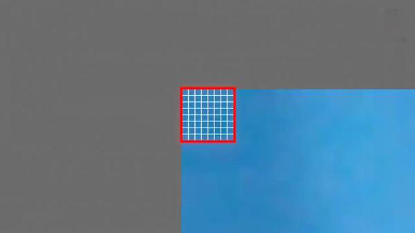
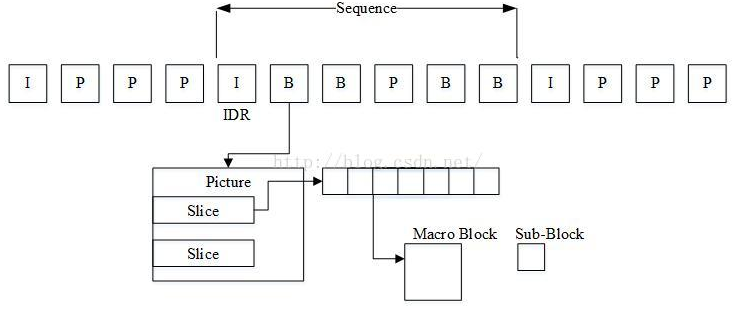
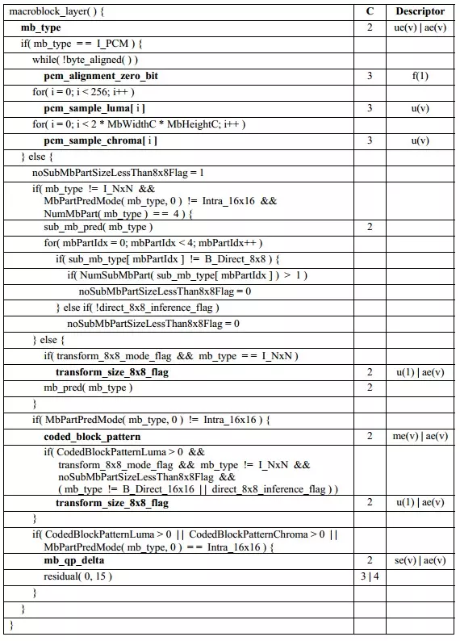

# 2.2H264
- [2.1 简介](#2.1)
- [2.2 NALU H264网络传输的结构](#2.2)
- [2.3 H.264码流结构图](#2.3)
- [2.4 H.264 slice格式](#2.4)
- [2.5 sps pps slice header数据解析方法](#2.5)
- [2.6 H264码流的两种形式：Annex B和AVCC](#2.6)

参考链接：  
1.H264格式 详细介绍  
https://blog.csdn.net/Frakie_Kwok/article/details/77989024  
2 .介绍sps pps  
https://blog.csdn.net/sdsszk/article/details/83509325  
3.H264基本原理  
https://blog.csdn.net/garrylea/article/details/78536775  
4.H264格式 详细介绍  
https://blog.csdn.net/Frakie_Kwok/article/details/77989024  
5 .介绍sps pps  
https://blog.csdn.net/sdsszk/article/details/83509325  
6.H264基本原理  
https://blog.csdn.net/garrylea/article/details/78536775 
7.H264元素的分层结构    
https://www.cnblogs.com/lidabo/p/4582040.html   

https://blog.csdn.net/liu0808/article/details/72453644  

## <a id="2.1">2.1 简介</a>
- [2.1.1 H264和MPEG-4标准](#2.1.1)
- [2.1.2 H.264组成](#2.1.2)
- [2.1.3 H.264打包](#2.1.3)
- [2.1.4 H264压缩](#2.1.4)
- [2.1.5 H.264序列的说明](#2.1.5)
- [2.1.6 H.264 压缩方法](#2.1.6)
- [2.1.7 H.264 I 帧与 IDR 帧的区别](#2.1.7)
- [2.1.8 h264基础知识补充](#2.1.8)
- [2.1.9 熵编码](#2.1.9)
- [2.1.10 档次和级](#2.1.10)

### <a id="2.1.1">2.1.1 H264和MPEG-4标准</a>
视频编解码技术有两套标准，国际电联（ITU-T）的标准H.261、H.263、H.263+等；还有ISO 的MPEG标准Mpeg1、Mpeg2、Mpeg4等等。<font color=red>H.264/AVC是两大组织集合H.263+和Mpeg4的优点联合推出的最新标准，最具价值的部分无疑是更高的数据压缩比。在同等的图像质量条件下，H.264的数据压缩比能比H.263高2倍，比MPEG-4高1.5倍。H.264/AVC 是ITU-T 视频编码专家组（VCEG）和ISO/IEC 动态图像专家组（MPEG ）联合组成的联合视频组（JVT）共同努力制订的新一代视频编码标准，它最大的优势是具有很高的数据压缩比率。</font>  
<font color=red>H.264/AVC标准是由ITU-T和ISO/IEC联合开发的，定位于覆盖整个视频应用领域，包括：低码率的无线应用、标准清晰度和高清晰度的电视广播应用、Internet上的视频流应用，传输高清晰度的DVD视频以及应用于数码相机的高质量视频应用等等。  
ITU-T给这个标准命名为H.264（以前叫做H.26L），而ISO/IEC称它为MPEG-4 高级视频编码（Advanced Video Coding，AVC）,并且它将成为MPEG-4标准的第10部分。既然AVC是当前MPEG-4标准的拓展，那么它必然将受益于MPEG-4开发良好的基础结构（比如系统分层和音频等）。</font>  
H.264最具价值的部分无疑是更高的数据压缩比。在同等的图像质量条件下，H.264的数据压缩比能比当前DVD系统中使用的MPEG-2高2-3倍，比MPEG-4高1.5-2倍。在网络传输过程中所需要的带宽更少，也更加经济。在MPEG-4需要6Mbps的传输速率匹配时，H.264只需要3Mbps-4Mbps的传输速率。  
H.264获得优越性能的代价是计算复杂度的大幅增加，例如分层设计、多帧参论、多模式运动估计、改进的帧内预测等，这些都显著提高了预测精度，从而获得比其他标准好得多的压缩性能。  
H.264 与MPEG-4的比较：在极低码率（32-128Kbps）的情况下，H.264与MPEG-4相比具有性能倍增效应，即：相同码率的H.26L媒体流和MPEG-4媒体流相比，H.26L拥有大约3个分贝的增益（画质水平倍增）。 32Kbps的H.26L媒体流，其信躁比与128K的MPEG-4媒体流相近。即在同样的画面质量下，H.264的码率仅仅为MPEG-4的四分之一。  

### <a id="2.1.2">2.1.2 H.264组成</a>


在H.264 中，句法元素共被组织成  序列、图像、片、宏块、子宏块五个层次。在这样的结构中，每一层的头部和它的数据部分形成管理与被管理的强依赖关系，头部的句法元素是该层数据的核心，而一旦头部丢失，数据部分的信息几乎不可能再被正确解码出来，尤其在序列层及图像层。


H.264 是一次概念的革新，它打破常规，完全没有 I 帧、P帧、B 帧的概念，也没有 IDR帧的概念。对于 H.264中出现的一些概念从大到小排序依次是：序列、图像、片组、片、NALU、宏块、亚宏块、块、像素。这里有几点值得说明：  
- （1）、在 H.264协议中图像是个集合概念，顶场、底场、帧都可以称为图像（本文图像概念时都是集合概念）。因此我们可以知道，对于H.264 协议来说，我们平常所熟悉的那些称呼，例如：I 帧、P 帧、B帧等等，实际上都是我们把图像这个概念具体化和细小化了。我们在 H.264里提到的“帧”通常就是指不分场的图像；
- （2）、如果不采用FMO（灵活宏块排序） 机制，则一幅图像只有一个片组；
- （3）、如果不使用多个片，则一个片组只有一个片；
- （4）、如果不采用DP（数据分割）机制，则一个片就是一个NALU，一个 NALU 也就是一个片。
否则，一个片由 三个 NALU 组成（即标准“表7-1”中 nal_unit_type 值为2、3、4 的三个 NALU 属于 一个片）；一幅图像根据组成它的片类型来分，可以分为标准“表7-5”中的 8种类型。我们平常应用中所最常见到的其实是这些类型的特例。例如：我们平常所谓的“I帧”和“IDR 帧”，其实是 primary_pic_type 值为 0的图像，我们平常所谓的“P帧”其实是 primary_pic_type 值为 1的图像的特例，我们平常所谓的“B帧”其实是 primary_pic_type 值为 2的图像的特例。  


一幅图像根据概念来分可以分为两种：IDR 图像和非 IDR图像。一幅图像是否是 IDR 图像是由组成该图像的 NALU决定的，如果组成该图像的 NALU 为标准“表7-1”中 nal_unit_type 值为 5 的NALU，则该图像为 IDR 图像，否则为非 IDR图像。这里也有几点值得说明：  
- （1）、nal_unit_type 值为 5 的 NALU 只会出现在 IDR 图像中，而 IDR图像中的所有 NALU 都是nal_unit_type 值为 5 的NALU；
- （2）、我们以组成一幅图像的片的类型来区分该图像是否是IDR 图像是错误的。
例如：一幅图像中的所有片都是 I 片并不代表这幅图像就是 IDR 图像。因为 I片也可以从属于 nal_unit_type 值为 1 的 NALU 也即非IDR图像有可能全部包含I片。只不过我们平常最常见到的形式是：所有片都是 I片的图像就是 IDR 图像。其实这个时候 IDR 图像的概念也被我们具体化和细小化了。但IDR图像必定全部包含I片或SI片，不过只有用NALU的类型才能判断是不是IDR图像一幅图像由 1～N个片组组成，而每一个片组又由一个或若干个片组成一个片由一个NALU或三个NALU（假如有数据分割）组成。图像解码过程中总是按照片进行解码，然后按照片组将解码宏块重组成图像。从这种意义上讲，片实际是最大的解码单元。  
1 frame的数据可以分为多个slice。每个slice中的数据，在帧内预测只用到自己slice的数据，与其他slice数据没有依赖关系。 NAL 是用来将编码的数据进行大包的。 比如，每一个slice 数据可以放在NAL 包中。I frame 是自己独立编码，不依赖于其他frame 数据。P frame 依赖 I frame 数据。B frame 依赖 I frame, P frame 或其他 B frame 数据。Slice是片的意思，264中把图像分成一帧（frame）或两场（field），而帧又可以分成一个或几个片（Slilce）；片由宏块（MB）组成。宏块是编码处理的基本单元。  
- 场和帧 ：视频的一场或一帧可用来产生一个编码图像。在电视中，为减少大面积闪烁现象，把一帧分成两个隔行的场。
- 片： 每个图象中，若干宏块被排列成片的形式。片分为I片、B片、P片和其他一些片。I片只包含I宏块，P片可包含P和I宏块，而B片可包含B和I宏块。片的主要作用是用作宏块（Macroblock）的载体（ps：下面会介绍到宏块的概念）。片之所以被创造出来，主要目的是为限制误码的扩散和传输。 如何限制误码的扩散和传输？ 每个片（slice）都应该是互相独立被传输的，某片的预测（片（slice）内预测和片（slice）间预测）不能以其它片中的宏块（Macroblock）为参考图像。  
I宏块利用从当前片中已解码的像素作为参考进行帧内预测。  
P宏块利用前面已编码图象作为参考图象进行帧内预测。  
B宏块则利用双向的参考图象（前一帧和后一帧）进行帧内预测。  
片的目的是为了限制误码的扩散和传输，使编码片相互间是独立的。  
某片的预测不能以其它片中的宏块为参考图像，这样某一片中的预测误差才不会传播到其它片中去。  
对于切片（slice）来讲，分为以下几种类型：  
I片：只包 I宏块，I 宏块利用从当前片中已解码的像素作为参考进行帧内预测(不能取其它片中的已解码像素作为参考进行帧内预测)。  
P片：可包 P和I宏块，P 宏块利用前面已编码图象作为参考图象进行帧内预测，一个帧内编码的宏块可进一步作宏块的分割:即 16×16、16×8、8×16 或 8×8 亮度像素块(以及附带的彩色像素);如果选了 8×8 的子宏块，则可再分成各种子宏块的分割，其尺寸为 8×8、8×4、4×8 或 4×4 亮度像素块(以及附带的彩色像素)。  
B片：可包 B和I宏块，B 宏块则利用双向的参考图象(当前和 来的已编码图象帧)进行帧内预测。SP片(切换P)：用于不同编码流之间的切换，包含 P 和/或 I 宏块  
SI片：扩展档次中必须具有的切换，它包 了一种特殊类型的编码宏块，叫做 SI 宏块，SI 也是扩展档次中的必备功能。  
宏块 ：一个编码图像通常划分成若干宏块组成，一个宏块由一个16×16亮度像素和附加的一个8×8 Cb和一个8×8 Cr彩色像素块组成。数据之间的关系：H264结构中，一个视频图像编码后的数据叫做一帧，一帧由一个片（slice）或多个片组成，一个片由一个或多个宏块（MB）组成，一个宏块由16x16的yuv数据组成。宏块作为H264编码的基本单位。  

H264编码过程中的三种不同的数据形式：
SODB：数据比特串 —-＞最原始的编码数据，即VCL数据；  
RBSP：原始字节序列载荷 —-＞在SODB的后面填加了结尾比特（RBSP trailing bits　一个bit“1”）若干比特“0”,以便字节对齐；  
EBSP：扩展字节序列载荷 —- > 在RBSP基础上填加了仿校验字节（0X03）它的原因是：在NALU加到Annexb上时，需要添加每组NALU之前的开始码StartCodePrefix,如果该NALU对应的slice为一帧的开始则用4位字节表示，ox00000001,否则用3位字节表示ox000001（是一帧的一部分）。另外，为了使NALU主体中不包括与开始码相冲突的，在编码时，每遇到两个字节连续为0，就插入一个字节的0x03。解码时将0x03去掉。也称为脱壳操作。  
>H.264的主要目标是：1．高的视频压缩比；2．良好的网络亲和性；
为了完成这些目标H264的解决方案是：  
1.VCL   video coding layer    视频编码层；  
2.NAL   network abstraction layer   网络提取层；  
其实vcl就是编码成sodb成rbsp送给nal层，nal就是进行nalu包装。  
H.264/AVC核心技术概览
这个新的标准是由下面几个处理步骤组成的：1）帧间和帧内预测；2）变换（和反变换）；3）量化（和反量化）；4）环路滤波；5）熵编码。
单张的图片流组成了视频，它能分成16X16像素的“宏块”，这种分块方法简化了在视频压缩算法中每个步骤的处理过程。举例来说，从标准清晰度标准视频流解决方案（720X480）中截取的一幅图片被分成1350（45X30）个宏块，然后在宏块的层次进行进一步的处理。

### <a id="2.1.3">2.1.3 H.264打包</a>
IP网络的RTP打包封装分组打包的规则：  
- (1)额外开销要少，使MTU尺寸在100～64k字节范围都可以；
- (2)不用对分组内的数据解码就可以判别该分组的重要性；
- (3)载荷规范应当保证不用解码就可识别由于其他的比特丢失而造成的分组不可解码；
- (4)支持将NALU分割成多个RTP分组；
- (5)支持将多个NALU汇集在一个RTP分组中。  

RTP的头标可以是NALU的头标，并可以实现以上的打包规则。  
一个RTP分组里放入一个NALU，将NALU(包括同时作为载荷头标的NALU头)放入RTP的载荷中，设置RTP头标值。为了避免IP层对大分组的再 一次分割，片分组的大小一般都要小于MTU尺寸。由于包传送的路径不同，解码端要重新对片分组排序，RTP包含的次序信息可以用来解决这一问题。  

NALU分割  
对于预先已经编码的内容，NALU可能大于MTU尺寸的限制。虽然IP层的分割可以使数据块小于64千字节，但无法在应用层实现保护，从而降低了非等重保 护方案的效果。由于UDP数据包小于64千字节，而且一个片的长度对某些应用场合来说太小，所以应用层打包是RTP打包方案的一部分。  

新的讨论方案(IETF)应当符合以下特征：  
- (1)NALU的分块以按RTP次序号升序传输；
- (2)能够标记第一个和最后一个NALU分块；
- (3)可以检测丢失的分块。

NALU合并   
一些NALU如SEI、参数集等非常小，将它们合并在一起有利于减少头标开销。已有两种集合分组：  
- (1)单一时间集合分组(STAP)，按时间戳进行组合；
- (2)多时间集合分组(MTAP)，不同时间戳也可以组合。

### <a id="2.1.4">2.1.4 H264压缩</a>
H264的基本原理其实非常简单，下我们就简单的描述一下H264压缩数据的过程。通过摄像头采集到的视频帧（按每秒 30 帧算），被送到 H264 编码器的缓冲区中。编码器先要为每一幅图片划分宏块。  
以下面这张图为例:  


划分宏块  
H264默认是使用 16X16 大小的区域作为一个宏块，也可以划分成 8X8 大小。  


划分好宏块后，计算宏块的象素值。  


以此类推，计算一幅图像中每个宏块的像素值，所有宏块都处理完后如下面的样子。  


划分子块  
H264对比较平坦的图像使用 16X16 大小的宏块。但为了更高的压缩率，还可以在 16X16 的宏块上更划分出更小的子块。子块的大小可以是 8X16､ 16X8､ 8X8､ 4X8､ 8X4､ 4X4非常的灵活。  


上幅图中，红框内的 16X16 宏块中大部分是蓝色背景，而三只鹰的部分图像被划在了该宏块内，为了更好的处理三只鹰的部分图像，H264就在 16X16 的宏块内又划分出了多个子块。  


这样再经过帧内压缩，可以得到更高效的数据。下图是分别使用mpeg-2和H264对上面宏块进行压缩后的结果。其中左半部分为MPEG-2子块划分后压缩的结果，右半部分为H264的子块划压缩后的结果，可以看出H264的划分方法更具优势。  


宏块划分好后，就可以对H264编码器缓存中的所有图片进行分组了。  
帧分组  
对于视频数据主要有两类数据冗余，一类是时间上的数据冗余，另一类是空间上的数据冗余。其中时间上的数据冗余是最大的。
对于这些关联特别密切的帧，其实我们只需要保存一帧的数据，其它帧都可以通过这一帧再按某种规则预测出来，所以说视频数据在时间上的冗余是最多的。  
为了达到相关帧通过预测的方法来压缩数据，就需要将视频帧进行分组。那么如何判定某些帧关系密切，可以划为一组呢？我们来看一下例子，下面是捕获的一组运动的台球的视频帧，台球从右上角滚到了左下角。  
H264编码器会按顺序，每次取出两幅相邻的帧进行宏块比较，计算两帧的相似度。如下图：  


通过宏块扫描与宏块搜索可以发现这两个帧的关联度是非常高的。进而发现这一组帧的关联度都是非常高的。因此，上面这几帧就可以划分为一组。其算法是：在相邻几幅图像画面中，一般有差别的像素只有10%以内的点,亮度差值变化不超过2%，而色度差值的变化只有1%以内，我们认为这样的图可以分到一组。  
在这样一组帧中，经过编码后，我们只保留第一帖的完整数据，其它帧都通过参考上一帧计算出来。我们称第一帧为IDR／I帧，其它帧我们称为P／B帧，这样编码后的数据帧组我们称为GOP。  
运动估计与补偿  
在H264编码器中将帧分组后，就要计算帧组内物体的运动矢量了。还以上面运动的台球视频帧为例，我们来看一下它是如何计算运动矢量的。
H264编码器首先按顺序从缓冲区头部取出两帧视频数据，然后进行宏块扫描。当发现其中一幅图片中有物体时，就在另一幅图的邻近位置（搜索窗口中）进行搜索。如果此时在另一幅图中找到该物体，那么就可以计算出物体的运动矢量了。下面这幅图就是搜索后的台球移动的位置。通过上图中台球位置相差，就可以计算出台图运行的方向和距离。H264依次把每一帧中球移动的距离和方向都记录下来就成了下面的样子。我们把运动矢量与补偿称为帧间压缩技术，它解决的是视频帧在时间上的数据冗余。除了帧间压缩，帧内也要进行数据压缩，帧内数据压缩解决的是空间上的数据冗余。下面我们就来介绍一下帧内压缩技术。  


帧内预测  
人眼对图象都有一个识别度，对低频的亮度很敏感，对高频的亮度不太敏感。所以基于一些研究，可以将一幅图像中人眼不敏感的数据去除掉。这样就提出了帧内预测技术。H264的帧内压缩与JPEG很相似。一幅图像被划分好宏块后，对每个宏块可以进行 9 种模式的预测。找出与原图最接近的一种预测模式。  


下面这幅图是对整幅图中的每个宏块进行预测的过程。


然后，将原始图像与帧内预测后的图像相减得残差值。再将我们之前得到的预测模式信息一起保存起来，这样我们就可以在解码时恢复原图了。经过帧内与帧间的压缩后，虽然数据有大幅减少，但还有优化的空间。  
对残差数据做DCT  
可以将残差数据做整数离散余弦变换，去掉数据的相关性，进一步压缩数据。如下图所示，左侧为原数据的宏块，右侧为计算出的残差数据的宏块。将残差数据宏块数字化后如下图所示：  


将残差数据宏块进行 DCT 转换。去掉相关联的数据后，我们可以看出数据被进一步压缩了。做完 DCT 后，还不够，还要进行 CABAC 进行无损压缩。  
CABAC  
上面的帧内压缩是属于有损压缩技术。也就是说图像被压缩后，无法完全复原。而CABAC属于无损压缩技术。无损压缩技术大家最熟悉的可能就是哈夫曼编码了，给高频的词一个短码，给低频词一个长码从而达到数据压缩的目的。MPEG-2中使用的VLC就是这种算法，我们以 A-Z 作为例子，A属于高频数据，Z属于低频数据。看看它是如何做的。CABAC也是给高频数据短码，给低频数据长码。同时还会根据上下文相关性进行压缩，这种方式又比VLC高效很多。其效果如下：  


现在将 A-Z 换成视频帧，它就成了下面的样子。  


从上面这张图中明显可以看出采用 CACBA 的无损压缩方案要比 VLC 高效的多。  
H264编码的基本原理，包括：  
宏块的划分  
图像分组  
帧内压缩技术原理  
帧间压缩技术原理。  
DCT  
CABAC压缩原理。  

### <a id="2.1.5">2.1.5 H.264序列的说明</a>
在H264中图像以序列为单位进行组织，一个序列是一段图像编码后的数据流，以 I 帧开始，到下一个 I 帧结束。一个序列的第一个图像叫做 IDR 图像（立即刷新图像），IDR 图像都是 I 帧图像。H.264 引入 IDR 图像是为了解码的重同步，当解码器解码到 IDR 图像时，立即将参考帧队列清空，将已解码的数据全部输出或抛弃，重新查找参数集，开始一个新的序列。这样，如果前一个序列出现重大错误，在这里可以获得重新同步的机会。IDR 图像之后的图像永远不会使用 IDR 之前的图像的数据来解码。  
I 帧：帧内编码帧 ，I 帧表示关键帧，你可以理解为这一帧画面的完整保留；解码时只需要本帧数据就可以完成（因为包含完整画面）。  
P 帧：前向预测编码帧。P 帧表示的是这一帧跟之前的一个关键帧（或P 帧）的差别，解码时需要用之前缓存的画面叠加上本帧定义的差别，生成最终画面。（也就是差别帧，P 帧没有完整画面数据，只有与前一帧的画面差别的数据）。P帧的预测与重构：P 帧是以 I 帧为参考帧,在 I 帧中找出 P 帧“某点”的预测值和运动矢量，取预测差值和运动矢量一起传送。在接收端根据运动矢量从 I 帧中找出 P 帧“某点”的预测值并与差值相加以得到 P 帧“某点”样值,从而可得到完整的 P 帧。P 帧属于前向预测的帧间编码。它只参考前面最靠近它的 I 帧或 P 帧;P 帧可以是其后面 P 帧的参考帧,也可以是其前后的 B 帧的参考帧;由于 P 帧是参考帧,它可能造成解码错误的扩散;由于是差值传送，P 帧的压缩比较高。  
B 帧：双向预测内插编码帧。B 帧是双向差别帧，也就是 B 帧记录的是本帧与前后帧的差别（具体比较复杂，有 4 种情况，但我这样说简单些），换言之，要解码 B 帧，不仅要取得之前的缓存画面，还要解码之后的画面，通过前后画面的与本帧数据的叠加取得最终的画面。B 帧压缩率高，但是解码时 CPU 会比较累。B 帧的预测与重构：B 帧以前面的 I 或 P 帧和后面的 P 帧为参考帧,“找出”B 帧“某点”的预测值和两个运动矢量,并取预测差值和运动矢量传送。接收端根据运动矢量在两个参考帧中“找出(算出)”预测值并与差值求和,得到 B帧“某点”样值,从而可得到完整的 B 帧。  
举例说明：  


在如上图中，GOP (Group of Pictures) 长度为 13，S0~S7 表示 8 个视点，T0~T12 为 GOP 的 13 个时刻。每个 GOP 包含帧数为视点数 GOP 长度的乘积。在该图中一个 GOP 中，包含 94 个 B 帧。B 帧占一个 GOP 总帧数的 90.38%。GOP 越长，B 帧所占比例更高，编码的率失真性能越高。下图测试序列 Race1 在不同 GOP 下的率失真性能对比。  

### <a id="2.1.6">2.1.6 H.264 压缩方法</a>
- （1）分组：把几帧图像分为一组(GOP，也就是一个序列)，为防止运动变化,帧数不宜取多。
- （2）定义帧：将每组内各帧图像定义为三种类型,即 I 帧、B 帧和 P 帧;
- （3）预测帧：以I帧做为基础帧，以 I 帧预测 P 帧,再由 I 帧和 P 帧预测 B 帧;
- （4）数据传输：最后将 I 帧数据与预测的差值信息进行存储和传输。

### <a id="2.1.7">2.1.7 H.264 I 帧与 IDR 帧的区别</a>
IDR（Instantaneous Decoding Refresh）--即时解码刷新。  
I 和 IDR 帧都是使用帧内预测的。它们都是同一个东西而已，在编码和解码中为了方便，要首个 I 帧和其他 I 帧区别开，所以才把第一个首个 I 帧叫 IDR，这样就方便控制编码和解码流程。IDR 帧的作用是立刻刷新，使错误不致传播,从IDR帧开始，重新算一个新的序列开始编码。而 I 帧不具有随机访问的能力，这个功能是由 IDR 承担。IDR 会导致DPB（参考帧列表——这是关键所在）清空，而 I 不会。IDR 图像一定是 I 图像，但I图像不一定是 IDR 图像。一个序列中可以有很多的I图像，I 图像之后的图像可以引用 I 图像之间的图像做运动参考。一个序列中可以有很多的 I 图像，I 图像之后的图象可以引用I图像之间的图像做运动参考。  
对于 IDR 帧来说，在 IDR 帧之后的所有帧都不能引用任何 IDR 帧之前的帧的内容，与此相反，对于普通的 I 帧来说，位于其之后的 B- 和 P- 帧可以引用位于普通 I- 帧之前的 I- 帧。从随机存取的视频流中，播放器永远可以从一个 IDR 帧播放，因为在它之后没有任何帧引用之前的帧。但是，不能在一个没有 IDR 帧的视频中从任意点开始播放，因为后面的帧总是会引用前面的帧。   
举个例子，在一段视频中，存在以下帧：I P B P B P B B P I P B…  
如果这段视频应用了多重参照帧，那么蓝色的 P 帧在参照他前面的 I 帧（红色）的同时，还可能会参照 I 帧之前的 P （绿色），由于 I 帧前后的场景可能会有很大的反差甚至根本不同，所以此时 P 帧参考I帧之前的帧不但会没有意义，反而会造成很多问题。所以一种新型的帧被引入，那就是 IDR 帧。如果这段视频应用了多重参考帧的同时采用了 IDR 帧，那么帧的顺序就会变成这样：I P B P B P B B P IDR P B…由于 IDR 帧禁止后面的帧向自己前面的帧参照，所以这回那个蓝色的 P 帧就不会参照绿色的 P 帧了。使用 ffmpeg 获取 I 帧 ：ffmpeg -i wkll.mp4 -ss 00:00:00 -t 1 -r 1 -q:v 2 -f image2 pic-%03d.jpeg   

### <a id="2.1.8">2.1.8 h264基础知识补充</a>
1.YCbCr  
在 4:2:0 样点中，两个色度阵列的高度和宽度均为亮度阵列的一半。   
在 4:2:2 样点中，两个色度阵列的高度等于亮度阵列的高度，宽度为亮度阵列的一半。  
在 4:2:4 样点中，两个色度阵列的高度和宽度与亮度阵列的相等。  
两个整列。一个顶场，一个底场。一半意思就是原有两个点=现在一个点。上面三个两个是宽度一半。一帧由两个场组成。  
在H.264进行编码的过程中，每一帧的H图像被分为一个或多个条带(slice)进行编码。每一个条带包含多个宏块(MB,Macroblock)。宏块是H.264标准中基本的编码单元，其基本结构包含一个包含16×16个亮度像素块和两个8×8色度像素块，以及其他一些宏块头信息。在对一个宏块进行编码时，每一个宏块会分割成多种不同大小的子块进行预测。帧内预测采用的块大小可能为16×16或者4×4，帧间预测/运动补偿采用的块可能有7种不同的形状：16×16、16×8、8×16、8×8、8×4、4×8和4×4。  
为了适应不同的应用场景，H.264也定义了三种不同的档次：  
基准档次(Baseline Profile)：主要用于视频会议、可视电话等低延时实时通信领域；支持I条带和P条带，熵编码支持CAVLC算法。  
主要档次(Main Profile)：主要用于数字电视广播、数字视频数据存储等；支持视频场编码、B条带双向预测和加权预测，熵编码支持CAVLC和CABAC算法。  

扩展档次(Extended Profile)：主要用于网络视频直播与点播等；支持基准档次的所有特性，并支持SI和SP条带，支持数据分割以改进误码性能，支持B条带和加权预测，但不支持CABAC和场编码。  
在H.264中使用的编码技术主要有以下类型：  

帧内预测  
H.264中采用了基于像素块的帧内预测技术。主要可分为以下不同类型：  
16×16大小的亮度块：4种预测模式  
4×4大小的亮度块：9种预测模式  
色度块：4种预测模式，同16×16的亮度块  

帧间预测  
H.264中的帧间预测方法采用了基于块的运动估计和补偿方法，其主要特点有：  
多个候选参考帧；  
B帧作为参考帧；  
任意参考帧排序；  
多种运动补偿像素块形状，包括16×16、16×8、8×16、8×8、8×4、4×8和4×4像素；  
1/4像素（亮度）的亚像素插值；  
对交错视频的基于帧或场的运动估计；  

交错视频编码  
针对隔行扫描的视频，H.264专门定义了用于处理此类交错视频的算法。  
PicAFF：Picture Adaptive Frame Field——图像层的帧场自适应；  
MBAFF：MacroBlock Adaptive Frame Field——宏块层的帧场自适应；  

变换和量化编码  
H.264的变换编码创新性地采用了类DCT的整数变换，有效降低了运算复杂度。对于基础版H.264，变换矩阵为4×4；在FRExt扩展中，还支持8×8的变换矩阵。H.264的量化算法仍然采用标量量化方法。  

无损熵编码算法  
H.264标准针对不同的语法元素指定了不同的熵编码算法，主要有：  
UVLC(Universal Variable Length Coding)：主要采用指数哥伦布编码；  
CAVLC(Context Adaptive Variable Length Coding)：上下文自适应的变长编码；  
CABAC(Context Adaptive Binary Arithmetic Coding)：上下文自适应的二进制算数编码；  

其他技术  
除了上述的核心算法之外，H.264还定义了包括去块环路滤波器、SI/SP帧、码率控制等多种技术。  
H264的码流的打包方式有两种,一种为annex-b byte stream format的格式，这个是绝大部分编码器的默认输出格式，就是每个帧的开头的3~4个字节是H264的start_code,0x00000001或者0x000001。另一种是原始的NAL打包格式，就是开始的若干字节（1，2，4字节）是NAL的长度，而不是start_code,此时必须借助某个全局的数据来获得编码器的profile,level,PPS,SPS等信息才可以解码。  

I片：只包 I宏块，I 宏块利用从当前片中已解码的像素作为参考进行帧内预测(不能取其它片中的已解码像素作为参考进行帧内预测)。  
P片：可包 P和I宏块，P 宏块利用前面已编码图象作为参考图象进行帧内预测，一个帧内编码的宏块可进一步作宏块的分割:即 16×16、16×8、8×16 或 8×8 亮度像素块(以及附带的彩色像素);如果选了 8×8 的子宏块，则可再分成各种子宏块的分割，其尺寸为 8×8、8×4、4×8 或 4×4 亮度像素块(以及附带的彩色像素)。  
B片：可包 B和I宏块，B 宏块则利用双向的参考图象(当前和 来的已编码图象帧)进行帧内预测。  
SP片(切换P)：用于不同编码流之间的切换，包含 P 和/或 I 宏块  
SI片：扩展档次中必须具有的切换，它包 了一种特殊类型的编码宏块，叫做 SI 宏块，SI 也是扩展档次中的必备功能。  

### <a id="2.1.9">2.1.9 熵编码</a>
“熵”这一概念原本来自于化学和热力学，用于度量能量退化的指标，即熵越高，物体或系统的做功能力越低。后来香农将这一概念引入到信息论中，用于表示消息的平均信息量。信源的熵通常可以表示信源所发出信息的不确定性，即越是随机的、前后不相关的信息，其熵越高。  
熵编码的简单实现——哈夫曼编码，哈夫曼树是一种特殊的二叉树，其终端节点的个数与待编码的码元的个数等同，而且每个终端节点上都带有各自的权值。每个终端节点的路径长度乘以该节点的权值的总和称为整个二叉树的加权路径长度。在满足条件的各种二叉树中，该路径长度最短的二叉树即为哈夫曼树。  
哈夫曼编码(Huffman Coding)，是可变字长编码(VLC)的一种。完全依据字符出现概率来构造异字头的平均长度最短的码字。  

编码过程最后两个相加算和，然后重新排序。大概重新排n-1次，可看上图。然后最后两个标 0 1值，下面0上面1。计算编码值，找到x4得值，然后找一行最近得得值，那一行没有得值重新一列开始找，找到0.1到0.25到0.6  编码反过来即100。即使相同得也不一样。  
编码过程  
（1）对图像中出现的不同像素值进行概率统计，得到n个不同概率的信息符号。  
（2）按符号出现的概率由大到小、由上到下排列。  
（3）对两个最低概率符号分别以0、1赋值。  
（4）两最低概率相加后作为一个新符号的概率重新值入符号序列中。  
（5）对概率按从大到小重新排列。  
（6）重复（1）-（5），直到只剩下两个概率符号的序列。  
（7）分别以二进制0、1赋值后，以此为根结点，沿赋值的顺序的逆序依次写出该路径上的二进制代码，得到哈夫曼编码。  
注意事项：  
- ①哈夫曼编码方法构造出来的编码不是唯一的。但对于同一信源而言，其平均码长是相同的，其编码效率不同
- ②哈夫曼编码对不同的信源其编码效率是不同的。只有当信源概率分布很不均匀是，哈夫曼编码才会受到显著效果。
指数哥伦布编码。同上篇介绍的哈夫曼编码一样，指数哥伦布编码同样属于变长编码(VLC)的一种。指数哥伦布编码同哈夫曼编码最显著的一点不同在于，哈弗曼编码构建完成后必须在传递的信息中加入码字和码元值的对应关系，也就是编码的码表，而指数哥伦布编码则不需要。   

### <a id="2.1.10">2.1.10 档次和级</a>
H.264 规定了三种档次，每个档次支持一组特定的编码功能，并支持一类特定的应用。  
- 1）基本档次：利用 I 片和 P 片支持帧内和帧间编码，支持利用基于上下文的自适应的变长编码进行的熵编码（CAVLC）。主要用于可视电话、会议电视、无线通信等实时视频通信；
- 2）主要档次：支持隔行视频，采用 B 片的帧间编码和采用加权预测的帧内编码；支持利用基于上下文的自适应的算术编码（CABAC）。主要用于数字广播电视与数字视频存储；
- 3）扩展档次：支持码流之间有效的切换（SP 和 SI 片）、改进误码性能（数据分割），但不支持隔行视频和 CABAC。


## <a id="2.2">2.2 NALU H264网络传输的结构</a>
- [2.2.1 NALU头结构](#2.2.1)
- [2.2.2 RBSP数据](#2.2.2)
- [2.2.3 SPS语法元素及其含义](#2.2.3)
- [2.2.4 PPS语法元素及其含义](#2.2.4)
- [2.2.5 SEI 语法元素及其含义](#2.2.5)
- [2.2.6解析SDP中包含的H.264的SPS和PPS](#2.2.6)
- [2.2.7 RTP打包H.264](#2.2.7)


H264在网络传输的是NALU，NALU的结构是：NAL头+RBSP  
NALU头用来标识后面的RBSP是什么类型的数据，他是否会被其他帧参考以及网络传输是否有错误。  
每个NAL前有一个起始码 0x00 00 01（或者0x00 00 00 01），解码器检测每个起始码，作为一个NAL的起始标识，当检测到下一个起始码时，当前NAL结束。同时H.264规定，当检测到0x000000时，也可以表征当前NAL的结束。那么NAL中数据出现0x000001或0x000000时怎么办？H.264引入了防止竞争机制，如果编码器检测到NAL数据存在0x000001或0x000000时，编码器会在最后个字节前插入一个新的字节0x03，这样：  
0x000003－>0x00000303。解码器检测到0x000003时，把03抛弃，恢复原始数据（脱壳操作）。解码器在解码时，首先逐个字节读取NAL的数据，统计NAL的长度，然后再开始解码。  

```cpp
1比特禁止位 2比特 重要性指示位 5比特 类型
固定为0 11 1-12 由h264使用
常用Nalu_type:
0x67 (0 11 00111) SPS 非常重要 type = 7
0x68 (0 11 01000) PPS 非常重要 type = 8
0x65 (0 11 00101) IDR帧 关键帧 非常重要 type = 5
0x61 (0 11 00001) I帧 重要 type=1 非IDR的I帧 不大常见
0x41 (0 10 00001) P帧 重要 type = 1
0x01 (0 00 00001) B帧 不重要 type = 1
0x06 (0 00 00110) SEI 不重要 type = 6
```

### <a id="2.2.1">2.2.1 NALU头结构</a>
NALU头结构长度：1byte  
forbidden_bit(1bit) + nal_reference_bit(2bit) + nal_unit_type(5bit)  
- 1.forbidden_bit：禁止位，初始为0，当网络发现NAL单元有比特错误时可设置该比特为1，以便接收方纠错或丢掉该单元。
- 2.nal_reference_bit：nal重要性指示，标志该NAL单元的重要性，值越大，越重要，解码器在解码处理不过来的时候，可以丢掉重要性为0的NALU。
- 3.nal_unit_type：不同类型的NALU的重要性指示如下表所示。


RTP 打包时的扩展类型  


### <a id="2.2.2">2.2.2 RBSP数据</a>
RBSP数据是下表中的一种，rbsp是根据nalu头类型决定。  


要完成视频的解码，不仅需要传输VCL层编码出来的视频帧数据，还需要传输序列参数集、图像参数集等数据。  
参数集:包括序列参数集 SPS  和图像参数集 PPS  
- SPS：包含的是针对一连续编码视频序列的参数，如标识符 seq_parameter_set_id、帧数及 POC 的约束、参考帧数目、解码图像尺寸和帧场编码模式选择标识等等。
- PPS：对应的是序列中某一幅图像或者某几幅图像，其参数如标识符pic_parameter_set_id、可选的 seq_parameter_set_id、熵编码模式选择标识、片组数目、初始量化参数和去方块滤波系数调整标识等等。
- SEi:自定义信息，
数据分割：组成片的编码数据存放在 3 个独立的 DP（数据分割，A、B、C）中，各自包含一个编码片的子集。  
分割Ａ包含片头和片中每个宏块头数据。 
分割Ｂ包含帧内和 SI 片宏块的编码残差数据。 
分割 C包含帧间宏块的编码残差数据。 
每个分割可放在独立的 NAL 单元并独立传输。 
- AUD：一般文档没有对AUD进行描叙，其实这是一个帧开始的标志，字节顺序为：00 00 00 01 09 f0从结构上看，有start code, 所以确实是一个NALU，类型09在H264定义里就是AUD（分割器）。大部分播放器可以在没有AUD的情况下正常播放。紧随AUD，一般是SPS/PPS/SEI/IDR的组合或者简单就是一个SLICE，也就是一个帧的开始。像Flash这样的播放器，每次需要一个完整的帧数据，那么把2个AUD之间的数据按照格式打包给播放器就可以了。  
>h264有两种封装：一种是annexb模式，传统模式，有startcode，SPS和PPS是在ES中；一种是mp4模式，一般mp4 mkv会有，没有startcode，SPS和PPS以及其它信息被封装在container中，每一个frame前面是这个frame的长度。 
很多解码器只支持annexb这种模式，因此需要将mp4做转换：  
在ffmpeg中用h264_mp4toannexb_filter可以做转换 
Ffmpeg中实现： 
注册filter  
```Go
avcbsfc = av_bitstream_filter_init(“h264_mp4toannexb”);
转换bitstream
av_bitstream_filter_filter(AVBitStreamFilterContext *bsfc,
AVCodecContext *avctx, const char *args,
uint8_t **poutbuf, int *poutbuf_size,
const uint8_t *buf, int buf_size, int keyframe)
```
对于MP4文件，NAL单元之前没有同步码，却有若干字节的长度码，来表示NAL单元的长度，这个长度码所占用的字节数由MP4文件头给出；此外，从MP4读出来的视频帧不包含PPS和SPS，这些信息位于MP4的文件头中，解析器必须在打开文件的时候就获取它们。从MP4文件读出的一个H.264帧往往是下面的形式（假设长度码为2字节）：  
00 19 06 [... 25 字节...] 24 aa 65 [... 9386 字节...]  
SEI信息                   IDR Slice  
H264 over RTP基本上分三种类型：  
(1)Single NAL unit packet 也就是实际的NAL类型，可以理解为一个包就是一帧H264数据，这个在实际中是比较多的。  
(2)Aggregation packet 一包数据中含有多个H264帧。  
STAP-A 包内的帧含有相同的NALU-Time，没有DON  
STAP-B 包内的帧含有相同的NALU-Time，有DON  
MTAP16 包内的帧含有不同的NALU-Time，timestamp offset = 16  
MTAP24 包内的帧含有不同的NALU-Time，timestamp offset = 24  
封装在Aggregation packet中的 NAL单元大小为65535字节  
(3)Fragmentation unit 一帧数据被分为多个RTP包，这也是很常见的，特别是对于关键帧。现存两个版本FU-A，FU-B。  
h264包在传输的时候，如果包太大，会被分成多个片。NALU头会被如下的2个自己代替。  
The FU indicator octet has the following format:  
```Go
      +---------------+
      |0|1|2|3|4|5|6|7|
      +-+-+-+-+-+-+-+-+
      |F|NRI|  Type   |
      +---------------+
```
   别被名字吓到这个格式就是上面提到的RTP h264负载类型，Type为FU-A  
下面这个应该就是rtp中h264格式The FU header has the following format:  
```Go
      +---------------+
      |0|1|2|3|4|5|6|7|
      +-+-+-+-+-+-+-+-+
      |S|E|R|  Type   |
      +---------------+
```
   S bit为1表示分片的NAL开始，当它为1时，E不能为1  
   E bit为1表示结束，当它为1，S不能为1  
   R bit保留位  
   Type就是NALU头中的Type,取1-23的那个值  

### <a id="2.2.3">2.2.3 SPS语法元素及其含义</a>
PS即Sequence Paramater Set，又称作序列参数集。类型7表示该NAL Unit内保存的数据为Sequence ParamaterSet。丢失或出现错误，那么解码过程很可能会失败。SPS及后续将要讲述的图像参数集PPS在某些平台的视频处理框架（比如iOS的VideoToolBox等）还通常作为解码器实例的初始化信息使用。SPS中保存了一组编码视频序列(Codedvideosequence)的全局参数。所谓的编码视频序列即原始视频的一帧一帧的像素数据经过编码之后的结构组成的序列。而每一帧的编码后数据所依赖的参数保存于图像参数集中。一般情况SPS和PPS的NALUnit通常位于整个码流的起始位置。但在某些特殊情况下，在码流中间也可能出现这两种结构，主要原因可能为：  
解码器需要在码流中间开始解码；  
编码器在编码的过程中改变了码流的参数（如图像分辨率等）；  
在做视频播放器时，为了让后续的解码过程可以使用SPS中包含的参数，必须对其中的数据进行解析。其中H.264标准协议中规定的SPS格式位于文档的7.3.2.1.1部分，如下图所示：  


其中的每一个语法元素及其含义如下：  
- (1) profile_idc：  
标识当前H.264码流的profile。我们知道，H.264中定义了三种常用的档次profile：  
基准档次：baseline profile;  
主要档次：main profile;  
扩展档次：extended profile;  
在H.264的SPS中，第一个字节表示profile_idc，根据profile_idc的值可以确定码流符合哪一种档次。判断规律为：  
profile_idc = 66 → baseline profile;  
profile_idc = 77 → main profile;  
profile_idc = 88 → extended profile;  
在新版的标准中，还包括了High、High 10、High 4:2:2、High 4:4:4、High 10 Intra、High
4:2:2 Intra、High 4:4:4 Intra、CAVLC 4:4:4 Intra等，每一种都由不同的profile_idc表示。  
另外，constraint_set0_flag ~ constraint_set5_flag是在编码的档次方面对码流增加的其他一些额外限制性条件。  
在我们实验码流中，profile_idc = 0x42 = 66，因此码流的档次为baseline profile。  

- (2) level_idc
标识当前码流的Level。编码的Level定义了某种条件下的最大视频分辨率、最大视频帧率等参数，码流所遵从的level由level_idc指定。
当前码流中，level_idc = 0x1e = 30，因此码流的级别为3。

- (3) seq_parameter_set_id
表示当前的序列参数集的id。通过该id值，图像参数集pps可以引用其代表的sps中的参数。本句法元素的值应该在[0，31]。  
注意：当编码器需要产生新的序列参数集时，应该使用新的 seq_parameter_set_id,即使用新的序列参数集，而不是去改变原来的参数集中的内容  

- (4) log2_max_frame_num_minus4
用于计算MaxFrameNum的值。计算公式为MaxFrameNum = 2^(log2_max_frame_num_minus4 +4)。MaxFrameNum是frame_num的上限值，frame_num是图像序号的一种表示方法，在帧间编码中常用作一种参考帧标记的手段。  
这个句法元素主要是为读取另一个句法元素 frame_num 服务的，frame_num 是最重要的句法元素之一，它标识所属图像的解码顺序。可以在句法表看到，fram-num的解码函数是 ue（v），函数中的 v 在这里指定：   
v = log2_max_frame_num_minus4 + 4  
从另一个角度看，这个句法元素同时也指明了 frame_num 的所能达到的最大值：  
MaxFrameNum = 2( log2_max_frame_num_minus4 + 4 )  
变量 MaxFrameNum 表示 frame_num 的最大值，在后文中可以看到，在解码过程中它也是一个非常重要的变量。  
值得注意的是 frame_num 是循环计数的，即当它到达 MaxFrameNum 后又从 0 重新开始新一轮的计数。解码器必须要有机制检测这种循环，不然会引起类似千年虫的问题，在图像的顺序上造成混乱。在第八章会详细讲述 H.264 检测这种循环的机制。  

- (5) pic_order_cnt_type
表示解码picture order count(POC)的方法。POC是另一种计量图像序号的方式，与frame_num有着不同的计算方法。该语法元素的取值为0、1或2。  
指明了 poc (picture order count) 的编码方法，poc 标识图像的播放顺序。由于H.264 使用了 B 帧预测，使得图像的解码顺序并不一定等于播放顺序，但它们之间存在一定的映射关系。poc 可以由 frame-num 通过映射关系计算得来，也可以索性由编码器显式地传送。H.264 中一共定义了三种 poc 的编码方法，这个句法元素就是用来通知解码器该用哪种方法来计算 poc。而以下的几个句法元素是分别在各种方法中用到的数据。  
在如下的视频序列中本句法元素不应该等于 2:  
一个非参考帧的接入单元后面紧跟着一个非参考图像(指参考帧或参考场)的接入单元  
两个分别包含互补非参考场对的接入单元后面紧跟着一个非参考图像的接入单元.  
一个非参考场的接入单元后面紧跟着另外一个非参考场,并且这两个场不能构成一个互补场对  

- (6) log2_max_pic_order_cnt_lsb_minus4
用于计算MaxPicOrderCntLsb的值，该值表示POC的上限。计算方法为MaxPicOrderCntLsb = 2^(log2_max_pic_order_cnt_lsb_minus4 + 4)。  

- (7) max_num_ref_frames
用于表示参考帧的最大数目。解码器依照这个句法元素的值开辟存储区，这个存储区用于存放已解码的参考帧，H.264 规定最多可用 16 个参考帧，本句法元素的值最大为 16。值得注意的是这个长度以帧为单位，如果在场模式下，应该相应地扩展一倍。

- (8) gaps_in_frame_num_value_allowed_flag
标识位，说明frame_num中是否允许不连续的值。这个句法元素等于 1 时，表示允许句法元素 frame_num 可以不连续。当传输信道堵塞严重时，编码器来不及将编码后的图像全部发出，这时允许丢弃若干帧图像。在正常情况下每一帧图像都有依次连续的frame_num 值，解码器检查到如果 frame_num 不连续，便能确定有图像被编码器丢弃。这时，解码器必须启动错误掩藏的机制来近似地恢复这些图像，因为这些图像有可能被后续图像用作参考帧。  
当这个句法元素等于 0 时，表不允许 frame_num 不连续，即编码器在任何情况下都不能丢弃图像。这时，H.264 允许解码器可以不去检查 frame_num 的连续性以减少计算量。这种情况下如果依然发生 frame_num 不连续，表示在传输中发生丢包，解码器会通过其他机制检测到丢包的发生，然后启动错误掩藏的恢复图像。  

- (9) pic_width_in_mbs_minus1
用于计算图像的宽度。单位为宏块个数，因此图像的实际宽度为:  
frame_width = 16 × (pic_width_in_mbs_minus1 + 1);  
本句法元素加 1 后指明图像宽度，以宏块为单位：  
PicWidthInMbs = pic_width_in_mbs_minus1 + 1  
通过这个句法元素解码器可以计算得到亮度分量以像素为单位的图像宽度：  
PicWidthInSamplesL = PicWidthInMbs * 16
从而也可以得到色度分量以像素为单位的图像宽度：  
PicWidthInSamplesC = PicWidthInMbs * 8
以上变量 PicWidthInSamplesL、PicWidthInSamplesC 分别表示图像的亮度、色度分量以像素为单位的宽。  
H.264 将图像的大小在序列参数集中定义，意味着可以在通信过程中随着序列参数集动态地改变图像的大小，在后文中可以看到，甚至可以将传送的图像剪裁后输出。  

- (10) pic_height_in_map_units_minus1
使用PicHeightInMapUnits来度量视频中一帧图像的高度。PicHeightInMapUnits并非图像明确的以像素或宏块为单位的高度，而需要考虑该宏块是帧编码或场编码。PicHeightInMapUnits的计算方式为：
PicHeightInMapUnits = pic_height_in_map_units_minus1 + 1;
本句法元素加 1 后指明图像高度：
PicHeightInMapUnits = pic_height_in_map_units_minus1 + 1
PicSizeInMapUnits = PicWidthInMbs * PicHeightInMapUnits
图像的高度的计算要比宽度的计算复杂，因为一个图像可以是帧也可以是场，从这个句法元素可以在帧模式和场模式下分别计算出出亮度、色度的高。值得注意的是，这里以 map_unit 为单位，map_unit的含义由后文叙述。

- (11) frame_mbs_only_flag
标识位，说明宏块的编码方式。当该标识位为0时，宏块可能为帧编码或场编码；该标识位为1时，所有宏块都采用帧编码。根据该标识位取值不同，PicHeightInMapUnits的含义也不同，为0时表示一场数据按宏块计算的高度，为1时表示一帧数据按宏块计算的高度。
按照宏块计算的图像实际高度FrameHeightInMbs的计算方法为：    
FrameHeightInMbs = ( 2 − frame_mbs_only_flag ) * PicHeightInMapUnits
结合 map_unit 的含义，这里给出上一个句法元素 pic_height_in_map_units_minus1的进一步解析步骤：  
当 frame_mbs_only_flag 等于１，pic_height_in_map_units_minus1 指的是一个 picture 中帧的高度；  
当frame_mbs_only_flag 等于０，pic_heght_in_map_units_minus1 指的是一个 picture 中场的高度，所以可以得到如下以宏块为单位的图像高度：  
FrameHeightInMbs = ( 2 – frame_mbs_only_flag ) * PicHeightInMapUnits  
PictureHeightInMbs= ( 2 – frame_mbs_only_flag ) * PicHeightInMapUnits  

- (12) mb_adaptive_frame_field_flag
标识位，说明是否采用了宏块级的帧场自适应编码。当该标识位为0时，不存在帧编码和场编码之间的切换；当标识位为1时，宏块可能在帧编码和场编码模式之间进行选择。  
指明本序列是否属于帧场自适应模式。mb_adaptive_frame_field_flag等于１时表明在本序列中的图像如果不是场模式就是帧场自适应模式，等于０时表示本序列中的图像如果不是场模式就是帧模式。。表 列举了一个序列中可能出现的编码模式：  
a. 全部是帧，对应于 frame_mbs_only_flag =1  的情况。  
b. 帧和场共存。frame_mbs_only_flag =0, mb_adaptive_frame_field_flag =0  
c. 帧场自适应和场共存。frame_mbs_only_flag =0, mb_adaptive_frame_field_flag =1  
值得注意的是，帧和帧场自适应不能共存在一个序列中。  

- (13) direct_8x8_inference_flag
标识位，用于B_Skip、B_Direct模式运动矢量的推导计算。

- (14) frame_cropping_flag
标识位，说明是否需要对输出的图像帧进行裁剪。用于指明解码器是否要将图像裁剪后输出，如果是的话，后面紧跟着的四个句法元素分别指出左右、上下裁剪的宽度。

- (15) vui_parameters_present_flag
标识位，说明SPS中是否存在VUI信息。指明 vui 子结构是否出现在码流中，vui 的码流结构在附录中指明，用以表征视频格式等额外信息。


### <a id="2.2.4">2.2.4 PPS语法元素及其含义</a>
除了序列参数集SPS之外，H.264中另一重要的参数集合为图像参数集Picture Paramater
Set(PPS)。通常情况下，PPS类似于SPS，在H.264的裸码流中单独保存在一个NAL Unit中，只是PPS NALUnit的nal_unit_type值为8；而在封装格式中，PPS通常与SPS一起，保存在视频文件的文件头中。在H.264的协议文档中，PPS的结构定义在7.3.2.2节中，具体的结构如下表所示：  


其中的每一个语法元素及其含义如下：  
- (1) pic_parameter_set_id
表示当前PPS的id。某个PPS在码流中会被相应的slice引用，slice引用PPS的方式就是在Slice header中保存PPS的id值。该值的取值范围为[0,255]。
- (2) seq_parameter_set_id
表示当前PPS所引用的激活的SPS的id。通过这种方式，PPS中也可以取到对应SPS中的参数。该值的取值范围为[0,31]。Pps引用sps的值。
- (3) entropy_coding_mode_flag
熵编码模式标识，该标识位表示码流中熵编码/解码选择的算法。对于部分语法元素，在不同的编码配置下，选择的熵编码方式不同。例如在一个宏块语法元素中，宏块类型mb_type的语法元素描述符为“ue(v)| ae(v)”，在baseline profile等设置下采用指数哥伦布编码，在main profile等设置下采用CABAC编码。
标识位entropy_coding_mode_flag的作用就是控制这种算法选择。当该值为0时，选择左边的算法，通常为指数哥伦布编码或者CAVLC；当该值为1时，选择右边的算法，通常为CABAC。
- (4) bottom_field_pic_order_in_frame_present_flag
标识位，用于表示另外条带头中的两个语法元素delta_pic_order_cnt_bottom和delta_pic_order_cn是否存在的标识。这两个语法元素表示了某一帧的底场的POC的计算方法。
- (5) num_slice_groups_minus1
表示某一帧中slice group的个数。当该值为0时，一帧中所有的slice都属于一个slice group。slice group是一帧中宏块的组合方式，定义在协议文档的3.141部分。
- (6) num_ref_idx_l0_default_active_minus1、num_ref_idx_l0_default_active_minus1
表示当Slice Header中的num_ref_idx_active_override_flag标识位为0时，P/SP/B
slice的语法元素num_ref_idx_l0_active_minus1和num_ref_idx_l1_active_minus1的默认值。
- (7) weighted_pred_flag
标识位，表示在P/SP slice中是否开启加权预测。
- (8) weighted_bipred_idc
表示在B Slice中加权预测的方法，取值范围为[0,2]。0表示默认加权预测，1表示显式加权预测，2表示隐式加权预测。
- (9) pic_init_qp_minus26和pic_init_qs_minus26
表示初始的量化参数。实际的量化参数由该参数、slice header中的slice_qp_delta/slice_qs_delta计算得到。
- (10) chroma_qp_index_offset
用于计算色度分量的量化参数，取值范围为[-12,12]。
- (11) deblocking_filter_control_present_flag
标识位，用于表示Slice header中是否存在用于去块滤波器控制的信息。当该标志位为1时，slice header中包含去块滤波相应的信息；当该标识位为0时，slice header中没有相应的信息。
- (12) constrained_intra_pred_flag
若该标识为1，表示I宏块在进行帧内预测时只能使用来自I和SI类型宏块的信息；若该标识位0，表示I宏块可以使用来自Inter类型宏块的信息。
- (13) redundant_pic_cnt_present_flag
标识位，用于表示Slice header中是否存在redundant_pic_cnt语法元素。当该标志位为1时，slice header中包含redundant_pic_cnt；当该标识位为0时，slice header中没有相应的信息。

### <a id="2.2.5">2.2.5 SEI 语法元素及其含义</a>
"0x06"SEI type后一个字节为“0x05”（淡黄底色）是SEI payload type，即表征SEI payload分析遵循user_data_unregistered()语法。  


SEI payload size  
“0x05”后一个字节为“0x2F”（淡蓝底色）是SEI payload size，此时整个payload是47个字节。SEI payload uuid"0x2F"随后的16个字节即为uuid，此时uuid为：dc45e9bde6d948b7962cd820d923eeef  
SEI payload content  
由于payload size是47个字节，除去16字节的uuid，剩下31个字节的content。由于content是字符串，所以有结束符"0x00"，有效的30个字符内容是：  
Zencoder Video Encoding System  
rbsp trailing bits  
47个payload字节后的"0x80"（灰底色）即是rbsp trailing bits，在user_data_unregistered()里面都是按字节写入的，所以此时的NAL unit结尾写入的字节一定是0x80。  


补充增强信息（Supplemental Enhancement Information）是码流范畴里面的概念，提供了向视频码流中加入信息的办法，是H.264/H.265 视频压缩标准的特性之一。SEI 有基本的特征：并不是解码过程的必须项；有可能对解码过程（容错、纠错）有帮助；集成在视频码流中；  
在视频内容的生成端、传输过程中，都可以插入SEI 信息。插入的信息，和其他视频内容一起经过传输链路到达了消费端。那么在SEI 中可以添加哪些信息呢？这里举几个例子，用户场景可以任意扩展：  
传递编码器参数；  
传递视频版权信息;  
传递摄像头参数；  
传递内容生成过程中的剪辑事件（引发场景切换）；  
《ISO/IEC 14496-10:2014》Annex D.1.1提供了最大到181的payload类型处理规范，由于类型可以指定任意大小，给SEI的添加、处理创造了很大的自由空间。Ffmpeg命令行：./ffmpeg  -I oceans.h264 -c:v copy -bsf:v    h264_metadata=sei_user_data='086f3693-b7b3-4f2c-9653-21492feee5b8+hello' oceans.sei.h264
Ffmpeg函数实现：libavcodec/h264_metadata_bsf.c。
libx264支持多种SEI类型数据写入，常用的仍然是SEI_USER_DATA_UNREGISTERED，具体的写入函数x264_sei_version_write()位于libx264/encoder/set.c中。  

### <a id="2.2.6">2.2.6解析SDP中包含的H.264的SPS和PPS</a>
用RTP传输H264的时候,需要用到sdp协议描述,其中有两项:Sequence Parameter Sets (SPS)和Picture Parameter Set(PPS)需要用到,那么这两项从哪里获取呢?答案是从H264码流中获取.在H264码流中,都是以"0x00 0x00 0x01"或者"0x000x00 0x00 0x01"为开始码的,找到开始码之后,使用开始码之后的第一个字节的低5位判断是否为7(sps)或者8(pps),
及data[4] & 0x1f == 7 ||data[4] & 0x1f ==8.然后对获取的nal去掉开始码之后进行base64编码,得到的信息就可以用于sdp.sps和pps需要用逗号分隔开来.SDP中的H.264的SPS和PPS串，包含了初始化H.264解码器所需要的信息参数，包括编码所用的profile，level，图像的宽和高，deblock滤波器等。  
这里需要特别提一下这两个参数pic_width_in_mbs_minus1 = 21，pic_height_in_mbs_minus1 = 17分别表示图像的宽和高，以宏块（16x16）为单位的值减1
因此，实际的宽为 (21+1)*16 = 352 高为 (17+1)*16 = 288  

### <a id="2.2.7">2.2.7 RTP打包H.264</a>
H264的NALU打包成RTP包的模式（下面是用到的两种模式）   
（1）、一个NALU打包成一个RTP包，只需要在一个12字节的RTP包头后添加去掉开始码的NALU即可 （这种模式在一个NALU的大小小于MTU时使用）。   
（2）、一个NALU打包成几个RTP包（FU_A模式），在12个字节的RTP头后面加上一个字节的 FU indicator和一个字节的FU header。FU indicator前3位是NALU头的前3位，后5位是28（十进制）， FU header第1位标记RTP包是否为NALU的第一片，第2位标记RTP包是否为NALU的最后一片。第3位是保 留位，后5位是NALU头的type位。  
可能的结构类型分别有:    

1. 单一 NAL 单元模式   
即一个 RTP 包仅由一个完整的 NALU 组成. 这种情况下 RTP NAL 头类型字段和原始的 H.264的 NALU 头类型字段是一样的. 对于 NALU 的长度小于 MTU 大小的包, 一般采用单一 NAL 单元模式.   
对于一个原始的 H.264 NALU 单元常由 [Start Code] [NALU Header] [NALU Payload] 三部分组成, 其中 Start Code 用于标示这是一个 NALU 单元的开始, 必须是 “00 00 00 01” 或 “00 00 01”, NALU 头仅一个字节, 其后都是 NALU 单元内容.   
打包时去除 “00 00 01” 或 “00 00 00 01” 的开始码, 把其他数据封包的 RTP 包即可.   
如有一个 H.264 的 NALU 是这样的:  
[00 00 00 01 67 42 A0 1E 23 56 0E 2F … ]   
这是一个序列参数集 NAL 单元. [00 00 00 01] 是四个字节的开始码, 67 是 NALU 头, 42 开始的数据是 NALU 内容.   
封装成 RTP 包将如下:   
[ RTP Header ] [ 67 42 A0 1E 23 56 0E 2F ]   
即只要去掉 4 个字节的开始码就可以了.  
2. 组合封包模式   
即可能是由多个 NAL 单元组成一个 RTP 包. 分别有4种组合方式: STAP-A, STAP-B, MTAP16, MTAP24. 那么这里的类型值分别是 24, 25, 26 以及 27.   
其次, 当 NALU 的长度特别小时, 可以把几个 NALU 单元封在一个 RTP 包中.  
```Go
   0                   1                   2                   3
   0 1 2 3 4 5 6 7 8 9 0 1 2 3 4 5 6 7 8 9 0 1 2 3 4 5 6 7 8 9 0 1
  +-+-+-+-+-+-+-+-+-+-+-+-+-+-+-+-+-+-+-+-+-+-+-+-+-+-+-+-+-+-+-+-+
  |                          RTP Header                         |
  +-+-+-+-+-+-+-+-+-+-+-+-+-+-+-+-+-+-+-+-+-+-+-+-+-+-+-+-+-+-+-+-+
  |STAP-A NAL HDR |         NALU 1 Size           | NALU 1 HDR     |
  +-+-+-+-+-+-+-+-+-+-+-+-+-+-+-+-+-+-+-+-+-+-+-+-+-+-+-+-+-+-+-+-+
  |                         NALU 1 Data                          |
  :                                                              :
  +               +-+-+-+-+-+-+-+-+-+-+-+-+-+-+-+-+-+-+-+-+-+-+-+-+
  |               | NALU 2 Size                   | NALU 2 HDR     |
  +-+-+-+-+-+-+-+-+-+-+-+-+-+-+-+-+-+-+-+-+-+-+-+-+-+-+-+-+-+-+-+-+
  |                         NALU 2 Data                          |
  :                                                              :
  |                               +-+-+-+-+-+-+-+-+-+-+-+-+-+-+-+-+
  |                               :...OPTIONAL RTP padding         |
  +-+-+-+-+-+-+-+-+-+-+-+-+-+-+-+-+-+-+-+-+-+-+-+-+-+-+-+-+-+-+-+-+
```

3. 分片封包模式   
用于把一个 NALU 单元封装成多个 RTP 包. 存在两种类型 FU-A 和 FU-B. 类型值分别是 28 和 29. 而当 NALU 的长度超过 MTU 时, 就必须对 NALU 单元进行分片封包. 也称为 Fragmentation Units (FUs).  

## <a id="2.3">2.3 H.264码流结构图</a>

H264在网络传输的是NALU，NALU的结构是：NAL头+RBSP  
NALU头用来标识后面的RBSP是什么类型的数据，他是否会被其他帧参考以及网络传输是否有错误。  
每个NAL前有一个起始码 0x00 00 01（或者0x00 00 00 01），解码器检测每个起始码，作为一个NAL的起始标识，当检测到下一个起始码时，当前NAL结束。同时H.264规定，当检测到0x000000时，也可以表征当前NAL的结束。那么NAL中数据出现0x000001或0x000000时怎么办？H.264引入了防止竞争机制，如果编码器检测到NAL数据存在0x000001或0x000000时，编码器会在最后个字节前插入一个新的字节0x03，这样：  
0x000003－>0x00000303。解码器检测到0x000003时，把03抛弃，恢复原始数据（脱壳操作）。解码器在解码时，首先逐个字节读取NAL的数据，统计NAL的长度，然后再开始解码。  

在H.264 中，句法元素共被组织成  序列、图像、片、宏块、子宏块五个层次。H.264中出现的一些概念从大到小排序依次是：序列、图像、片组、片、NALU、宏块、亚宏块、块、像素。  




在这样的结构中，每一层的头部和它的数据部分形成管理与被管理的强依赖关系，头部的句法元素是该层数据的核心，而一旦头部丢失，数据部分的信息几乎不可能再被正确解码出来，尤其在序列层及图像层。  


在 H.264 中，分层结构最大的不同是取消了序列层和图像层，并将原本属于序列和图像头部的大部分句法元素游离出来形成序列和图像两级参数集，其余的部分则放入片层。   
参数集是一个独立的数据单位，不依赖于参数集外的其他句法元素。一个参数集不对应某一个特定的图像或序列，同一序列参数集可以被多个图像参数集引用，同理，同一个图像参数集也可以被多个图像引用。只在编码器认为需要更新参数集的内容时，才会发出新的参数集。  


图像被划分为条带。条带由一系列的宏块组成，当使用宏块自适应帧/场解码时则由一系列宏块对组成，每个宏块对包含2个宏块。。每个宏块均包含一个 16×16 的亮度阵列，当视频格式不是单色时，还包含和两个相应的色度阵列。如果没有使用宏块自适应帧/场解码，每个宏块代表图像中的一个空间矩形区域。  


宏块类型：https://www.cnblogs.com/ranson7zop/p/7603766.html  


slice_type 表示条带的编码类型  


当 nal_unit_type 等于 5（IDR 图像）时， slice_type 应等于 2、 4、 7 或 9。   
当 num_ref_frames 等于 0 时， slice_type 应等于 2、 4、 7 或 9。  
field_pic_flag 等于 1 表示该条带是一个编码场的条带。field_pic_flag 等于 0 表示该条带是一个编码帧的条 带。当 field_pic_flag 不存在时，应推定其值为 0。  
解码过程的概述如下：  
— 8.1 中定义 NAL 单元的解码过程。  
— 8.2 节定义了使用条带层及条带层以上各层的语法元素进行解码的过程。  
— 与图像顺序排列有关的变量和函数在8.2.1中推导。(仅对图像中的某条带解码时才需要调用)。  
— 与宏块到条带组映射有关的变量和函数在8.2.2中推导。（仅对图像中的某条带解码时才需要调用）。  
— 当使用条带数据分割时，组合多个条带数据分割的方法在8.2.3定义。  
— 在当前图像的frame_num不等于PrevRefFrameNum，且不等于( PrevRefFrameNum + 1 ) % MaxFrameNum时，frame_num上的空隙的解码过程应在解码图像中的所有条带之前，按照8.2.5.2的规定执行。  
— 在 P、 SP 或B 条带的解码开始阶段，需要执行8.2.4节定义的参考图像列表重建过程，从而可以得到参考图像列表0 (RefPicList0)，当解码B条带时，得到参考图像列表1（RefPicList1）。  
— 当当前图像是参考图像，且在所有本图像中的条带都已解码后，8.2.5中的已解码图像的标记过程描述当前图像如何在后续图像解码过程的帧间预测过程中使用。  
— 8.3，8.4，8.5，8.6 和 8.7 定义使用宏块层及宏块层以上层的语法元素进行解码的过程。  
— 除8.3节所定义的I_PCM宏块以外，I 和SI宏块的帧内预测过程都以帧内预测得到的样点作为输出。8.3节直接定义了I_PCM宏块的重建过程。输出的结果是在去块效应滤波过程之前的重建样点。  
— P和B宏块的帧间预测过程在8.4中定义，帧间预测结果作为输出。  
— 去块效应滤波前变换系数的解码过程和图像重建过程在8.5中定义。此过程产生I和B宏块以及P条带中 的P宏块样点。输出结果为去块效应滤波前的重建样点。  
— 8.6定义了SP条带和SI宏块中的P宏块的解码过程。该过程产生SP、SI宏块中的P宏块的样点值。输出结 果是去块效应滤波之前的重建样点。  
— 8.7定义了对靠近块和宏块边缘的重建图像进行的去块效应滤波的过程，输出是已解码样点。  
1帧（一幅图像） = 1~N个片（slice）  //也可以说1到多个片为一个片组1个片 = 1~N个宏块（Marcroblock）1个宏块 =  8*16 或者16X16的等YUV数据（原始视频采集数据）  


## <a id="2.4">2.4H.264 slice格式</a>
- [2.4.1 slice header解析](#2.4.1)
- [2.4.2 slice body解析](#2.4.2)
- [2.4.3 slice 宏块(Macroblock)结构解析](#2.4.3)
- [2.4.4 slice实列解析](#2.4.4)
- [2.4.5 宏块MB](#2.4.5)


参考链接：https://www.jianshu.com/p/19fa110c2383  

### <a id="2.4.1">2.4.1 slice header解析</a>
Slice header中主要保存了当前slice的一些全局的信息，slice body中的宏块在进行解码时需依赖这些信息。其中比较常见的一些语法元素有：
- first_mb_in_slice: 当前slice中包含的第一个宏块在整帧中的位置；
- slice_type：当前slice的类型；
slice_type Name of slice_type 0 P (P slice) 1 B (B slice) 2 I (I slice) 3 SP (SP slice) 4 SI (SI slice) 5 P (P slice) 6 B (B slice) 7 I (I slice) 8 SP (SP slice) 9 SI (SI slice)
IDR 图像时, slice_type 等于 2, 4, 7, 9。
- pic_parameter_set_id：当前slice所依赖的pps的id；范围 0 到 255。
-  colour_plane_id:当标识位separate_colour_plane_flag为true时，colour_plane_id表示当前的颜色分量，0、1、2分别表示Y、U、V分量。
- frame_num:表示当前帧序号的一种计量方式。
-  field_pic_flag:场编码标识位。当该标识位为1时表示当前slice按照场进行编码；该标识位为0时表示当前* slice按照帧进行编码。
-  bottom_field_flag:底场标识位。该标志位为1表示当前slice是某一帧的底场；为0表示当前slice为某一帧的顶场。
-  idr_pic_id:表示IDR帧的序号。某一个IDR帧所属的所有slice，其idr_pic_id应保持一致。该值的取值范围为[0,65535]。
-  pic_order_cnt_lsb:表示当前帧序号的另一种计量方式。
-  delta_pic_order_cnt_bottom:表示顶场与底场POC差值的计算方法，不存在则默认为0；
- slice_qp_delta：用于计算当前slice内所使用的初始qp值。

### <a id="2.4.2">2.4.2 slice body解析</a>
从文档中我们可以看出，Slice_data结构中独立的语法元素并不多，主要只有以下几个：
-  cabac_alignment_one_bit：表示如果码流启用了CABAC算法，那么码流在这里必须使用若干个比特1实现字节对齐。
-  mb_skip_run和mb_skip_flag：这两个语法元素都用于表示宏块结构是否可以被跳过。“跳过”的宏块指的是，在帧间预测的slice中，当图像区域平坦时，码流中跳过这个宏块的所有数据，不进行传输，只通过这两个语法元素进行标记。在解码端，跳过的宏块通过周围已经重建的宏块来进行恢复。mb_skip_run用于熵编码使用CAVLC时，用一个语法元素表示连续跳过的宏块的个数；mb_skip_flag用于熵编码使用CABAC时，表示每一个宏块是否被跳过。
-   mb_field_decoding_flag：标识位，用于在帧场自适应的码流中标识某个宏块是帧模式还是场模式。
-   end_of_slice_flag：在CABAC模式下的一个标识位，表示是否到了slice的末尾。
一个Slice的body部分主要是一个个的宏块结构Macroblock组成，此外还存在一些辅助的信息。  
从文档中我们可以看出，Slice_data结构中独立的语法元素并不多，主要只有以下几个：  
1.cabac_alignment_one_bit：表示如果码流启用了CABAC算法，那么码流在这里必须使用若干个比特1实现字节对齐。  
2.mb_skip_run和mb_skip_flag：这两个语法元素都用于表示宏块结构是否可以被跳过。“跳过”的宏块指的是，在帧间预测的slice中，当图像区域平坦时，码流中跳过这个宏块的所有数据，不进行传输，只通过这两个语法元素进行标记。在解码端，跳过的宏块通过周围已经重建的宏块来进行恢复。mb_skip_run用于熵编码使用CAVLC时，用一个语法元素表示连续跳过的宏块的个数；mb_skip_flag用于熵编码使用CABAC时，表示每一个宏块是否被跳过。  
3.mb_field_decoding_flag：标识位，用于在帧场自适应的码流中标识某个宏块是帧模式还是场模式。  
4.end_of_slice_flag：在CABAC模式下的一个标识位，表示是否到了slice的末尾。  
上述的几个语法元素毫无疑问仅仅占用了全部数据很少的一部分，其他大部分的数据都包含在宏块结构中，即macroblock_layer()结构。  
参考链接：https://blog.csdn.net/liu0808/article/details/72453650  

### <a id="2.4.3">2.4.3 slice 宏块(Macroblock)结构解析</a>
链接：https://www.jianshu.com/p/c38506f50eb7  
宏块(Macroblock)结构  
从上表中我们可以看出，一个Slice结构中宏块实际上占据了绝大部分。在标准中一个宏块的结构定义为下表  


- (1). mb_type:
在一个宏块中，最开始的语法元素为宏块的类型：mb_type。从表中我们可以看出，根据mb_type的值是否等于I_PCM，整个解析方法分为两大类：PCM类型和非PCM类型，判断依据是当mb_type为25时为I_PCM模式，否则为非I_PCM模式。  
当这个宏块为I_PCM模式时，宏块中以差分编码的形式保存宏块原始的像素值。此时存在如下几个语法元素：  
pcm_alignment_zero_bit：填充位，用比特0来填充直到按字节对齐；  
pcm_sample_luma：256个亮度分量的差分像素值；  
pcm_sample_chroma：若干个色度分量的差分像素值，实际数量由码流的颜色格式指定。例	如对于最常用的4:2:0格式的视频，共有128个色度像素值。除了mb_type等于25时可以确定为I_PCM格式之外，其他的mb_type值可能根据帧类型（或slice类型）的不同而不同。比如对于I slice，mb_type的非PCM模式可以选择0~24这些值之一；对于P slice，mb_type只能取0~4这5个值；对于B slice，mb_type可以取0~22这些值之一。目前我们所处理的码流全部由I帧构成，因此我们暂时只考虑I slice的情况。下图是标准文档中规定的I slice的mb_type列表的一部分，完整列表在协议文档的中：  
从上表中我们可以看出，mb_type不仅仅表示了宏块的分割方式，还包含了一些其他的附加信息，如帧内预测模式、亮度和色度分量的coded_block_pattern。当帧内预测使用16×16模式时，宏块整个宏块的预测信息相同，因此不需要为各个子宏块分别指定预测模式，这样可以有效减少消耗的码流。  
- (2). transform_size_8x8_flag
该语法元素为一个标识位，用于表示在环路滤波之前，预测残差的变换系数解码时依照的尺寸。当该标识位为1时，预测残差按照8×8像素块进行解码；当该标志位不存在或者为0时，预测残差按照4×4像素块进行解码。  
- (3). coded_block_pattern
coded_block_pattern语法元素常简称做cbp，用于表示当前宏块内的4个8×8子块编码对其中的哪个的残差系数进行编码。值得注意的是该语法元素仅仅在宏块为非I_16x16模式时才存在，因为在I_16x16模式时cbp的有关信息已经在mb_type中体现。  
- (4). mb_qp_delta
mb_qp_delta表示宏块层的量化参数偏移值，取值范围为[-26, 25]。我们在前面已经在PPS中获取了整个序列的量化参数初始值（由pic_init_qp_minus26计算），在slice header中获取slice层的量化参数偏移slice_qp_delta，因此每一个slice第一个宏块的量化参数可通过下面的公式计算：  
QP0=pic_init_qp+26+slice_qp_delta+mb_qp_delta从第二个宏块开始，每个宏块实际量化参数的计算方法为：   
QPn=(QPm+mb_qp_delta+52)%52  
在以H.264格式编码的视频码流中，宏块结构必然包含预测结构（I_PCM模式除外），该结构中包含了像素块的预测模式等信息。对于不同预测模式的宏块，其预测结构是不同的。从上篇的宏块结构中，可以看出，对于部分模式，预测信息保存于mb_pred()结构中，而对于另一部分模式则采用sub_mb_pred()结构。  
在我们本系列的H.264分析器SimpleH264Analyzer项目中默认的全I帧测试码流中，我们所分析的第一个IDR帧的第一个宏块，其mb_type为I_NxN。实际上，对于除了I_PCM模式之外的所有Intra宏块，其预测结构均采用mb_pred()结构。  
从表中可以看出，Intra预测模式的结构主要有两组，分别表示4×4和8×8模式，每一组包含两个元素，分别表示预测模式标识位和预测模式值，以及最后的色度分量预测模式。  
prev_intra4x4_pred_mode_flag和prev_intra8x8_pred_mode_flag：表示帧内预测模式预测标识。如果该标识位为1，表示帧内预测模式的预测值就是实际的模式，否则就需要另外传递实际的帧内预测模式。  
prev_intra4x4_pred_mode_flag和prev_intra8x8_pred_mode_flag：表示额外传递的实际帧内预测模式。  
intra_chroma_pred_mode：表示色度分量的预测模式，取值范围为[0,3]，分别代表DC、水平、垂直和平面模式。  

### <a id="2.4.4">2.4.4 slice实列解析</a>
https://yq.aliyun.com/users/v62pj2dkppzh6?spm=a2c4e.11153940.0.0.9d9e220e4uqKeP  
H264流媒体协议格式中的AVCC及Annex B格式。在对H264进行编解码分析时，碰到一个完整视频帧被切分成多个Slice用于网络媒体传输的情况。Avcc是前面有长度，annexb前面有01开始位。  
若完整的视频帧未被切分成多个slice时，可直接被解码成YUV或RGB数据，但是当切分成多个slice，需要根据first_mb_in_slice计算每个帧片所在位置。  

若完整的视频帧未被切分成多个slice时，可直接被解码成YUV或RGB数据，但是当切分成多个slice，需要根据first_mb_in_slice计算每个帧片所在位置。  
比如上图B帧中数据为0x00 0x00 0x00 0x01 0x41 0xE2，读取第6位转成二进制：1110 0010，与上0x80：0xB8&0x80=0x80,即表示为一帧的第一片(可查询指数哥伦布码，即第一个位为1)。接下来一包数据为0x00 0x00 0x00 0x01 0x41 0x63，则与上0x80为0x0，则表示不是第一片(不是第一个片时的值在上一包的基础上会出现递增)。可归纳规律（假设的数据）：  
    第一包：0x00 0x00 0x00 0x01 0x41 0xE1  
    第二包：0x00 0x00 0x00 0x01 0x41 0x62  
    第三包：0x00 0x00 0x00 0x01 0x41 0x63  
    第四包：0x00 0x00 0x00 0x01 0x41 0xE2  
可看出第一包0xE1&0x80=0x80则是第一片，0x62&0x80=0x0则为第二包，直到遇到下一个0x80时为完整的一帧(第一包+第二包+第三包)。E最高位1开始，123代表包，直到到下一个最高位为1。  
以上就是合并的基本思路，一般情况下I帧不会被切分成多个slice，而是以完整帧进行传输，P帧多数情况下存在切分的情况。实际保存原始视频的图像数据的部分保存在其他的VCL层的NAL Units中。这部分数据在码流中称作是条带(Slice)。一个Slice包含一帧图像的部分或全部数据，换言之，一帧视频图像可以编码为一个或若干个Slice。一个Slice最少包含一个宏块，最多包含整帧图像的数据。在不同的编码实现中，同一帧图像中所构成的Slice数目不一定相同。在H.264中设计Slice的目的主要在于防止误码的扩散。因为不同的slice之间，其解码操作是独立的。某一个slice的解码过程所参考的数据（例如预测编码）不能越过slice的边界。  
根据码流中不同的数据类型，H.264标准中共定义了5总Slice类型：  
I slice: 帧内编码的条带；  
P slice: 单向帧间编码的条带；  
B slice: 双向帧间编码的条带；  
SI slice: 切换I条带，用于扩展档次中码流切换使用；  
SP slice: 切换P条带，用于扩展档次中码流切换使用；  
在I slice中只包含I宏块，不能包含P或B宏块；在P和B slice中，除了相应的P和B类型宏块之外，还可以包含I类型宏块。  
Slice header中主要保存了当前slice的一些全局的信息，slice body中的宏块在进行解码时需依赖这些信息。其中比较常见的一些语法元素有：  
1.first_mb_in_slice: 当前slice中包含的第一个宏块在整帧中的位置；   
2.slice_type：当前slice的类型；  
3.pic_parameter_set_id：当前slice所依赖的pps的id；  
4.colour_plane_id:当标识位separate_colour_plane_flag为true时，colour_plane_id表示当前的颜色分量，0、1、2分别表示Y、U、V分量。  
5.frame_num:表示当前帧序号的一种计量方式。  
6.field_pic_flag:场编码标识位。当该标识位为1时表示当前slice按照场进行编码；该标识位为0时表示当前slice按照帧进行编码。  
7.bottom_field_flag:底场标识位。该标志位为1表示当前slice是某一帧的底场；为0表示当前slice为某一帧的顶场。  
5.idr_pic_id:表示IDR帧的序号。某一个IDR帧所属的所有slice，其idr_pic_id应保持一致。该值的取值范围为[0,65535]。  
6.pic_order_cnt_lsb:表示当前帧序号的另一种计量方式。  
7.delta_pic_order_cnt_bottom:表示顶场与底场POC差值的计算方法，不存在则默认为0；  
8.slice_qp_delta：用于计算当前slice内所使用的初始qp值。  

### <a id="2.4.5">2.4.5 宏块MB</a>


表 6.1 宏块的句法单元  


## <a id="2.5">2.5 sps pps slice header数据解析方法</a>
- [2.5.1 Sps](#2.5.1)
- [2.5.2 ps](#2.5.2)

### <a id="2.5.1">2.5.1 Sps</a>
去除掉NALU开始标记后的67 42 00 1E F1 61 62 62，转换为二进制是01100111 01000010 00000000 00011110 11110001 01100001 01100010 01100010  
01100111：NALU头  
01000010 00000000 00011110：profile_idc~level_idc  
1:哥伦布编码  seq_parameter_set_id = 0 // Exp-Golomb解1  
后面得1也是分别代表  
log2_max_frame_num_minus4 = 0   
pic_order_cnt_type = 0   
log2_max_pic_order_cnt_lsb_minus4 = 0   
0001 011：Golomb解析max_num_ref_frames，很明显前缀有3个0。所以codenum=2^3-1+read_bits(011)=10   
后面类似计算gaps_in_frame_num_value_allowed_flag = 0 // 0  
pic_width_in_mbs_minus1 = 10 // Exp-Golomb解0001 011  
pic_height_in_map_units_minus1 = 8 // Exp-Golomb解00010 01   
frame_mbs_only_flag = 1 // 1  
direct_8x8_inference_flag = 0 // 0  
frame_cropping_flag = 0 // 0  
vui_parameters_present_flag = 0 // 0  
之前的这么多数据(除了NALU头之外的)都是seq_parameter_set_data  
根据Spec我们知道还有结尾补齐位，  
```Go
seq_parameter_set_rbsp( ) {
    seq_parameter_set_data( ) // 数据
    rbsp_trailing_bits( ) // 按字节补齐
}
```
部分结果如下：  
profile_idc = 66 // 01000010   
constraint_set0_flag = 0 // 0  
constraint_set1_flag = 0 // 0  
constraint_set2_flag = 0 // 0  
constraint_set3_flag = 0 // 0  
constraint_set4_flag = 0 // 0  
constraint_set5_flag = 0 // 0   
reserved_zero_2bits = 0 // 00  
level_idc = 30 // 00011110  
以上都是写死，剩余都是指数哥伦布编码  
指数哥伦布编码对数字20进行编码：  
codeNum = 20  
prefixLen = floor[log2(codeNum+1)] = floor[log2(21)]=4  
surfix = codeNum+1-2^prefixLen=20+1-2^4=5=二进制的101  
编码值=0000，1，0101(为方便观看，以逗号分隔了)  
也就是说，哥伦布编码以中间的1为对称轴，前缀全写0，需要先算出一共要写几个0。然后再算后缀的信息位。至于解码，先计算前缀个数4个0，这样后缀的信息位是0101，也就是5。所以解码得出2^4-1+5=20  
```Go
leadingZeroBits = −1
for (b = 0; !b; leadingZeroBits++)
    b = read_bits(1)
 
codeNum = 2^(leadingZeroBits) − 1 + read_bits(leadingZeroBits)
```

### <a id="2.5.2">2.5.2 ps</a>
去除掉NALU开始标记后的68 C8 A1 43 88，转换为二进制是  
01101000 11001000 10100001 01000011 10001000。   
解码结果  
01101000:NALU头  
```Go
pic_parameter_set_id = 0 // Exp-Golomb解1  
seq_parameter_set_id = 0 // Exp-Golomb解1
entropy_coding_mode_flag = 0 // 0
bottom_field_pic_order_in_frame_present_flag = 0 // 0
num_slice_groups_minus1 = 0 // Exp-Golomb解1
num_ref_idx_l0_default_active_minus1 = 9 // Exp-Golomb解000 1010
num_ref_idx_l1_default_active_minus1 = 9 // Exp-Golomb解0001 010
weighted_pred_flag = 0 // 0
weighted_bipred_idc = 0 // 00
pic_init_qp_minus26 = 0 // Exp-Golomb解1
pic_init_qs_minus26 = 0 // Exp-Golomb解1
chroma_qp_index_offset = 0 // Exp-Golomb解1
deblocking_filter_control_present_flag = 0 // 0
constrained_intra_pred_flag = 0 // 0
redundant_pic_cnt_present_flag = 0 // 0
```

### <a id="2.5.3 Slice">2.5.2 Slice</a>
去除掉NALU开始标记后的65 88 84 02，转换为二进制是  
01100101 10001000 10000100 00000010。  
解码结果：  
```Go
first_mb_in_slice = 0 // Exp-Golomb解1
slice_type = 7 // Exp-Golomb解0001000
pic_parameter_set_id = 0 // Exp-Golomb解1
frame_num = 0 // u(v)根据占用的位数
//(log2_max_frame_num_minus4 + 4)解出值 // 0000
也需要知道frame_num有很多限制，比如在IDR当中必须为0，具体参见7.4.3 Slice header semantics
idr_pic_id = 0 // Exp-Golomb解1
pic_order_cnt_lsb = 0 // u(v)根据占用的位数
//(log2_max_pic_order_cnt_lsb_minus4 + 4)解出值 // 0000
```

## <a id="2.6">2.6 H264码流的两种形式：Annex B和AVCC</a>
链接：https://blog.csdn.net/romantic_energy/article/details/50508332  
### 一.Annex B  
视频编码成的包叫做Network Abstraction Layer Units, 也简称为NALU、NAL，每个NALU包都可以被单独的解析和处理，每个NALU包的第一个字节包含了NALU类型，bit3-bit7包含的内容尤其重要(bit 0一定是off的，bit1-2指定了这个NALU是否被其他NALU引用)。NALU格式分为2类，VCL和non-VCL，总共有19种不同的NALU格式。  
Annex B格式用开始码来解决这个问题，即给每个NALU加上前缀码：2个或者3个0x00,后面再加一个0x01, 如：0x000001或者0x00000001。
4字节类型的开始码在在连续的数据传输中非常有用，因为用字节来对齐、分割流数据，比如：用连续的31个bit0后接一个bit1来分割流数据，是很容易的。种类型的序列插入防竞争字节0x03实现的，那么插入防竞争字节后，0x000001变成了0x00000301。  
Annex B格式通常用于实时的流格式，比如说传输流，通过无线传输的广播、DVD等。在这些格式中通常会周期性的重复SPS和PPS包，经常是在每一个关键帧之前，因此据此建立解码器可以一个随机访问的点，这样就可以加入一个正在进行的流，及播放一个已经在传输的流。  
### 二.AVCC
另一个存储H.264流的方式是AVCC格式，在这种格式中，每一个NALU包都加上了一个指定其长度(NALU包大小)的前缀(in big endian format大端格式)，这种格式的包非常容易解析，但是这种格式去掉了Annex B格式中的字节对齐特性，而且前缀可以是1、2或4字节，这让AVCC格式变得更复杂了，指定前缀字节数(1、2或4字节)的值保存在一个头部对象中(流开始的部分)，这个头通常称为'extradata'或者'sequence header'，它的基本格式如下：  
```Go
bits    
8   version ( always 0x01 )
8   avc profile ( sps[0][1] )
8   avc compatibility ( sps[0][2] )
8   avc level ( sps[0][3] )
6   reserved ( all bits on )
2   NALULengthSizeMinusOne    // 这个值是（前缀长度-1），值如果是3，那前缀就是4，因为4-1=3
3   reserved ( all bits on )
5   number of SPS NALUs (usually 1)
repeated once per SPS:
  16     SPS size
  variable   SPS NALU data
8   number of PPS NALUs (usually 1)
repeated once per PPS
  16    PPS size
  variable PPS NALU data
    AVCC格式的一个优点是在开始配置解码器的时候可以跳到流的中间播放，这种格式通常用于可以被随机访问的多媒体数据，如存储在硬盘的文件。也因为这个特性，MP4、MKV通常用AVCC格式来存储。
```

## links
  * [目录](<音视频入门到精通目录.md>)
  * 下一节: [2.3RTP](<2.3RTP.md>)