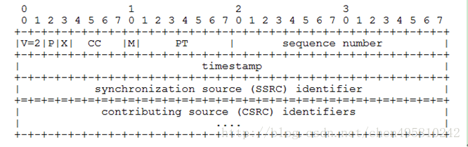
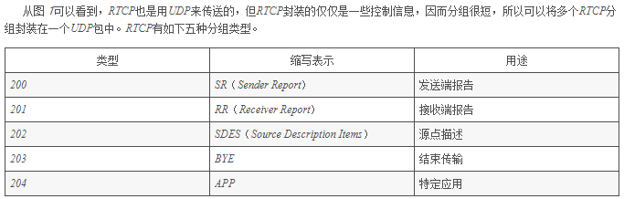
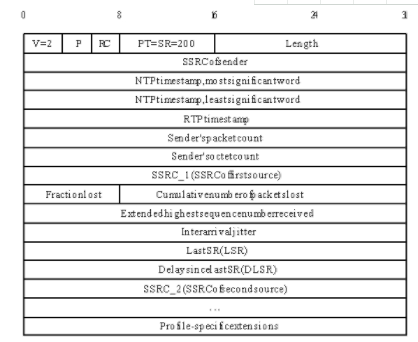
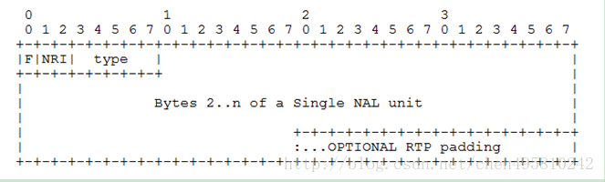
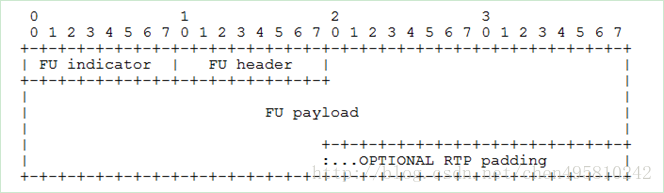
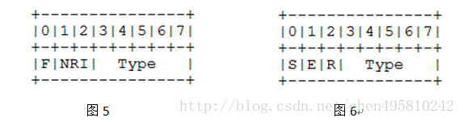

# 2.3RTP
- [3.1 RTP介绍](#3.1)
- [3.2 RTP数据格式](#3.2)
- [3.3 RTP会话](#3.3)
- [3.4 RTP荷载H264码流](#3.4)
- [3.5 RTP荷载PS流](#3.5)
- [3.6 RTP的时间戳 同步](#3.6)
- [3.7 RTP打包方式](#3.7)
- [3.8 RTP时间戳和播放器处理RTP时间戳](#3.8)
- [3.9 RTP SSRC](#3.9)

## <a id="3.1">3.1 RTP介绍</a>
- [3.1.1 RTP概述](#3.1.1)
- [3.1.2 RTP传输介绍](#3.1.2)

1.RTP协议全解析（H264码流和PS流）  
https://blog.csdn.net/chen495810242/article/details/39207305  

### <a id="3.1.1">3.1.1 RTP概述</a>
RTP全名是Real-time Transport Protocol（实时传输协议）。它是IETF提出的一个标准，对应的RFC文档为RFC3550（RFC1889为其过期版本）。RTP为Internet上端到端的实时传输提供时间信息和流同步，但并不保证服务质量，服务质量由RTCP来提供。  
RTP实时传输协议（Real-time Transport Protocol，RTP）是在Internet上处理多媒体数据流的一种网络协议，利用它能够在一对一（单播）或者一对多（multicast，多播） 的网络环境中实现传流媒体数据的实时传输RTP提供抖动补偿和数据无序到达检测的机制。由于IP网络的传输特性，数据的无序到达是很常见的。 RTP允许数据通过IP组播的方式传送到多个目的地。RTP被认为是在IP网络中传输音频和视频的基本标准。RTP通常配合模板和负载格式使用。  

### <a id="3.1.2">3.1.2 RTP传输介绍</a>
RTP通常使用UDP来进行多媒体数据的传输，但如果需要的话可以使用TCP或者ATM等其它协议，整个RTP 协议由两个密切相关的部分组成：RTP数据协议和RTP控制协议，RTP标准定义了两个子协议，RTP和RTCP。RTP 使用偶数端口号接收发送数据，相应的RTCP则使用相邻的下一位奇数端口号。每一个多媒体流会建立一个RTP会话。一个会话包含带有RTP和RTCP端口号的IP地址。例如，音频和视频流使用分开的RTP会话，这样用户可以选择其中一个媒体流。形成会话的端口由其他协议（例如RTSP和SIP）来协商。RTP和RTCP使用UDP端口1024 - 65535。简单的多播音频会议。语音通信通过一个多播地址（一对多得IP地址类似于远程游戏）和一对端口来实现。一个用于音频数据（RTP），另一个用于控制包（RTCP）。  
如果在一次会议中同时使用了音频和视频会议，这两种媒体将分别在不同的RTP会话中传送，每一个会话使用不同的传输地址（IP地址＋端口）。如果一个用户同时使用了两个会话，则每个会话对应的RTCP包都使用规范化名字CNAME（Canonical Name）。与会者可以根据RTCP包中的CNAME来获取相关联的音频和视频，然后根据RTCP包中的计时信息(Network time protocol)来实现音频和视频的同步。
翻译器和混合器：翻译器和混合器都是RTP级的中继系统。翻译器用在通过IP多播不能直接到达的用户区，例如发送者和接收者之间存在防火墙。当与会者能接收的音频编码格式不一样，比如有一个与会者通过一条低速链路接入到高速会议，这时就要使用混合器。在进入音频数据格式需要变化的网络前，混合器将来自一个源或多个源的音频包进行重构，并把重构后的多个音频合并，采用另一种音频编码进行编码后，再转发这个新的RTP包。从一个混合器出来的所有数据包要用混合器作为它们的同步源（SSRC，见RTP的封装）来识别，可以通过贡献源列表（CSRC表，见RTP的封装）可以确认谈话者。  
数据传输协议RTP：用于实时传输数据。该协议提供的信息包括：时间戳（用于同步）、序列号（用于丢包和重排序检测）、以及负载格式（用于说明数据的编码格式）。  
控制协议RTCP：用于QoS反馈和同步媒体流。相对于RTP来说，RTCP所占的带宽非常小，通常只有5%。  

## <a id="3.2">3.2 RTP数据格式</a>
- [3.2.1 RTP解析](#3.2.1)
- [3.2.2 RTCP解析](#3.2.2)


### <a id="3.2.1">3.2.1 RTP解析</a>
RTP数据协议。RTP数据协议负责对流媒体数据进行封包并实现媒体流的实时传输，每一个RTP数据报都由头部（Header）和负载（Payload）两个部分组成，其中头部前12个字节的含义是固定的，而负载则可以是音频或者视频数据。  
RTP数据报的头部格式如图所示：  


- (1) V：RTP协议的版本号，占2位，当前协议版本号为2
- (2) P：填充标志，占1位，如果P=1，则在该报文的尾部填充一个或多个额外的八位组，它们不是有效载荷的一部分。
- (3) X：扩展标志，占1位，如果X=1，则在RTP报头后跟有一个扩展报头
- (4)  CC：CSRC计数器，占4位，指示CSRC 标识符的个数
- (5)  M: 标记，占1位，不同的有效载荷有不同的含义，对于视频，标记一帧的结束；对于音频，标记会话的开始。Marker标志
- (6)  PT: 有效荷载类型，占7位，用于说明RTP报文中有效载荷的类型，如GSM音频、JPEM图像等,在流媒体中大部分是用来区分音频流和视频流的，这样便于客户端进行解析。
- (7) 序列号：占16位，用于标识发送者所发送的RTP报文的序列号，每发送一个报文，序列号增1。这个字段当下层的承载协议用UDP的时候，网络状况不好的时候可以用来检查丢包。同时出现网络抖动的情况可以用来对数据进行重新排序，序列号的初始值是随机的，同时音频包和视频包的sequence是分别记数的。
- (8)时戳(Timestamp)：占32位，必须使用90 kHz 时钟频率。时戳反映了该RTP报文的第一个八位组的采样时刻。接收者使用时戳来计算延迟和延迟抖动，并进行同步控制。在marker结束之前的时间戳都一样。
- (9)  同步信源(SSRC)标识符：占32位，用于标识同步信源。该标识符是随机选择的，参加同一视频会议的两个同步信源不能有相同的SSRC。同步源就是指RTP包流的来源。在同一个RTP会话中不能有两个相同的SSRC值。该标识符是随机选取的 RFC1889推荐了MD5随机算法。
- (10) 特约信源(CSRC)标识符：每个CSRC标识符占32位，可以有0～15个。每个CSRC标识了包含在该RTP报文有效载荷中的所有特约信源。CSRC标识紧跟在RTP固定头部之后，用来表示RTP数据报的来源，RTP协议允许在同一个会话中存在多个数据源，它们可以通过RTP混合器合并为一个数据源。例如，可以产生一个CSRC列表来表示一个电话会议，该会议通过一个RTP混合器将所有 讲话者的语音数据组合为一个RTP数据源。CSRC不是必须的，个数由CC决定。其他都是固定的，计算字节数需要注意。  

>注：基本的RTP说明并不定义任何头扩展本身，如果遇到X=1，需要特殊处理

### <a id="3.2.2">3.2.2 RTCP解析</a>
RTP需要RTCP为其服务质量提供保证，因此下面介绍一下RTCP的相关知识。  
RTCP的主要功能是：服务质量的监视与反馈、媒体间的同步，以及多播组中成员的标识。在RTP会话期 间，各参与者周期性地传送RTCP包。  RTCP包中含有已发送的数据包的数量、丢失的数据包的数量等统计资料，因此，各参与者可以利用这些信息动态地改变传输速率，甚至改变有效载荷类型。RTP和RTCP配合使用，它们能以有效的反馈和最小的开销使传输效率最佳化，因而特别适合传送网上的实时数据。  
RTCP也是用UDP来传送的，但RTCP封装的仅仅是一些控制信息，因而分组很短，所以可以将多个RTCP分组封装在一个UDP包中。RTCP有如下五种分组类型:  
SR：发送端报告，所谓发送端是指发出RTP数据报的应用程序或者终端，发送端同时也可以是接收端。  
RR：接收端报告，所谓接收端是指仅接收但不发送RTP数据报的应用程序或者终端。  
SDES：源描述，主要功能是作为会话成员有关标识信息的载体，如用户名、邮件地址、电话号码等，此外还具有向会话成员传达会话控制信息的功能。  
BYE：通知离开，主要功能是指示某一个或者几个源不再有效，即通知会话中的其他成员自己将退出会话。  
APP：由应用程序自己定义，解决了RTCP的扩展性问题，并且为协议的实现者提供了很大的灵活性。  


上述五种分组的封装大同小异，下面只讲述SR类型，而其它类型请参考RFC3550。发送端报告分组SR（Sender Report）用来使发送端以多播方式向所有接收端报告发送情况。SR分组的主要内容有：相应的RTP流的SSRC，RTP流中最新产生的RTP分组的时间戳和NTP，RTP流包含的分组数，RTP流包含的字节数。SR包的封装如图3所示。


- 版本（V）：同RTP包头域。
- 填充（P）：同RTP包头域。
- 接收报告计数器（RC）：5比特，该SR包中的接收报告块的数目，可以为零。
- 包类型（PT）：8比特，SR包是200。
- 长度域（Length）：16比特，其中存放的是该SR包以32比特为单位的总长度减一。
- 同步源（SSRC）：SR包发送者的同步源标识符。与对应RTP包中的SSRC一样。NTP Timestamp（Network time protocol）SR包发送时的绝对时间值。NTP的作用是同步不同的RTP媒体流。
- RTP Timestamp：与NTP时间戳对应，与RTP数据包中的RTP时间戳具有相同的单位和随机初始值。  
Sender’s packet count：从开始发送包到产生这个SR包这段时间里，发送者发送的RTP数据包的总数. SSRC改变时，这个域清零。  
Sender`s octet count：从开始发送包到产生这个SR包这段时间里，发送者发送的净荷数据的总字节数（不包括头部和填充）。发送者改变其SSRC时，这个域要清零。  
- 同步源n的SSRC标识符：该报告块中包含的是从该源接收到的包的统计信息。  
丢失率（Fraction Lost）：表明从上一个SR或RR包发出以来从同步源n(SSRC_n)来的RTP数据包的丢失率。  
- 累计的包丢失数目：从开始接收到SSRC_n的包到发送SR,从SSRC_n传过来的RTP数据包的丢失总数。  
- 收到的扩展最大序列号：从SSRC_n收到的RTP数据包中最大的序列号，接收抖动（Interarrival jitter）：RTP数据包接受时间的统计方差估计  
- 上次SR时间戳（Last SR,LSR）：取最近从SSRC_n收到的SR包中的NTP时间戳的中间32比特。如果目前还没收到SR包，则该域清零。  
上次SR以来的延时（Delay since last SR,DLSR）：上次从SSRC_n收到SR包到发送本报告的延时。  
RTP设计成允许应用自动扩展，连接数可从几个到上千个。例如，音频会议中，数据流量是内在限制的，因为同一时刻只有一两个人说话；对组播，给定连接数据率仍是常数，独立于连接数，但控制流量不是内在限制的。如每个参加者以固定速率发送接收报告，控制流量将随参加者数量线性增长，因此，速率必须按比例下降。   
一旦确认地址有效，如后来标记成未活动，地址的状态应仍保留，地址应继续计入共享RTCP带宽地址的总数中，时间要保证能扫描典型网络分区，建议为30分钟。注意，这仍大于RTCP报告间隔最大值的五倍。   
这个规范定义了除必需的CNAME外的几个源描述项，如NAME（人名）和EMAIL（电子邮件地址）。它也为定义新特定应用RTCP包类型的途径。给附加信息分配控制带宽应引起注意，因为它将降低接收报告和CNAME发送的速率而损害协议的性能。建议分配给单个参加者用于携带附加信息的RTCP带宽不要超过20%。而且并没有有意让所有SDES项包含在每个应用中。   

## <a id="3.3">3.3 RTP会话</a>
- [3.3.1 RTP会话过程](#3.3.1)

### <a id="3.3.1">3.3.1 RTP会话过程</a>
当应用程序建立一个RTP会话时，应用程序将确定一对目的传输地址。目的传输地址由一个网络地址和一对端口组成，有两个端口：一个给RTP包，一个给RTCP包，使得RTP/RTCP数据能够正确发送。RTP数据发向偶数的UDP端口，而对应的控制信号RTCP数据发向相邻的奇数UDP端口（偶数的UDP端口＋1），这样就构成一个UDP端口对。 RTP的发送过程如下，接收过程则相反。  
1)RTP协议从上层接收流媒体信息码流（如H.263），封装成RTP数据包；RTCP从上层接收控制信息，封装成RTCP控制包。  
2)RTP将RTP 数据包发往UDP端口对中偶数端口；RTCP将RTCP控制包发往UDP端口对中的接收端口。  

## <a id="3.4">3.4 RTP荷载H264码流</a>
- [3.4.1 单个NAL单元包](#3.4.1)
- [3.4.2分片单元（FU-A）](#3.4.2)

荷载格式定义三个不同的基本荷载结构，接收者可以通过RTP荷载的第一个字节后5位（如图2）识别荷载结构。 
- 1)单个NAL单元包：荷载中只包含一个NAL单元。NAL头类型域等于原始 NAL单元类型,即在范围1到23之间
- 2)聚合包：本类型用于聚合多个NAL单元到单个RTP荷载中。本包有四种版本,单时间聚合包类型A (STAP-A)，单时间聚合包类型B (STAP-B)，多时间聚合包类型(MTAP)16位位移(MTAP16), 多时间聚合包类型(MTAP)24位位移(MTAP24)。赋予STAP-A, STAP-B, MTAP16, MTAP24的NAL单元类型号分别是 24,25, 26, 27
- 3)分片单元：用于分片单个NAL单元到多个RTP包。现存两个版本FU-A，FU-B,用NAL单元类型 28，29标识
常用的打包时的分包规则是：如果小于MTU采用单个NAL单元包，如果大于MTU就采用FUs分片方式。  
因为常用的打包方式就是单个NAL包和FU-A方式，所以我们只解析这两种。  

### <a id="3.4.1">3.4.1 单个NAL单元包</a>
定义在此的NAL单元包必须只包含一个。这意味聚合包和分片单元不可以用在单个NAL 单元包中。并且RTP序号必须符合NAL单元的解码顺序。NAL单元的第一字节和RTP荷载头第一个字节重合。打包H264码流时，只需在帧前面加上12字节的RTP头即可。  


### <a id="3.4.2">3.4.2分片单元（FU-A）</a>


分片只定义于单个NAL单元不用于任何聚合包。NAL单元的一个分片由整数个连续NAL单元字节组成。每个NAL单元字节必须正好是该NAL单元一个分片的一部分。相同NAL单元的分片必须使用递增的RTP序号连续顺序发送(第一和最后分片之间没有其他的RTP包）。相似，NAL单元必须按照RTP顺序号的顺序装配。  
当一个NAL单元被分片运送在分片单元(FUs)中时，被引用为分片NAL单元。STAPs,MTAPs不可以被分片。 FUs不可以嵌套。 即, 一个FU 不可以包含另一个FU。运送FU的RTP时戳被设置成分片NAL单元的NALU时刻。  
图 4 表示FU-A的RTP荷载格式。FU-A由1字节的分片单元指示（如图5），1字节的分片单元头（如图6），和分片单元荷载组成。  



S: 1 bit 当设置成1,开始位指示分片NAL单元的开始。当跟随的FU荷载不是分片NAL单元荷载的开始，开始位设为0。  
E: 1 bit 当设置成1, 结束位指示分片NAL单元的结束，即, 荷载的最后字节也是分片NAL单元的最后一个字节。当跟随的 FU荷载不是分片NAL单元的最后分片,结束位设置为0。  
R: 1 bit 保留位必须设置为0，接收者必须忽略该位打包时，原始的NAL头的前三位为FU indicator的前三位，原始的NAL头的后五位为FU header的后五位。  
取一段码流分析如下：  
```Go
80 60 01 0f 00 0e 10 00 00 0000 00 7c 85 88 82 €`..........|???
00 0a 7f ca 94 05 3b 7f 3e 7f fe 14 2b 27 26 f8 ...??.;.>.?.+'&?
89 88 dd 85 62 e1 6d fc 33 01 38 1a 10 35 f2 14 ????b?m?3.8..5?.
84 6e 21 24 8f 72 62f0 51 7e 10 5f 0d 42 71 12 ?n!$?rb?Q~._.Bq.
17 65 62 a1 f1 44 dc df 4b 4a 38 aa 96 b7 dd 24 .eb??D??KJ8????$

前12字节是RTP Header  
7c是FU indicator  
85是FU Header  
FU indicator（0x7C）和FU Header（0x85）换成二进制如下
0111 1100 1000 0101
按顺序解析如下：
0                            是F
11                          是NRI
11100                     是FU Type，这里是28，即FU-A
1                            是S，Start，说明是分片的第一包
0                            是E，End，如果是分片的最后一包，设置为1，这里不是
0                            是R，Remain，保留位，总是0
00101                     是NAl Type，这里是5，说明是关键帧
```
打包时，FUindicator的F、NRI是NAL Header中的F、NRI，Type是28；FU Header的S、E、R分别按照分片起始位置设置，Type是NAL Header中的Type。   
解包时，取FU indicator的前三位和FU Header的后五位，即0110 0101（0x65）为NAL类型。   

## <a id="3.5">3.5 RTP荷载PS流</a>
针对H264 做如下PS 封装：每个IDR NALU 前一般都会包含SPS、PPS 等NALU，因此将SPS、PPS、IDR 的NALU 封装为一个PS 包，包括ps 头，然后加上PS system header，PS system map，PES header+h264 raw data。所以一个IDR NALU PS 包由外到内顺序是：  PSheader| PS system header | PS system Map | PES header | h264 raw data。对于其它非关键帧的PS 包，就简单多了，直接加上PS头和PES 头就可以了。顺序为：PS header | PES header | h264raw data。以上是对只有视频video 的情况，如果要把音频Audio也打包进PS 封装，也可以。当有音频数据时，将数据加上PES header 放到视频PES 后就可以了。顺序如下：PS 包=PS头|PES(video)|PES(audio)，再用RTP 封装发送就可以了。  
GB28181 对RTP 传输的数据负载类型有规定（参考GB28181 附录B），负载类型中96-127 RFC2250 建议96 表示PS 封装，建议97 为MPEG-4，建议98 为H264 即我们接收到的RTP 包首先需要判断负载类型，若负载类型为96，则采用PS 解复用，将音视频分开解码。若负载类型为98，直接按照H264 的解码类型解码。  
注：此方法不一定准确，取决于打包格式是否标准  
PS 包中的流类型（stream type）的取值如下：  
1)        MPEG-4 视频流： 0x10；  
2)        H.264 视频流： 0x1B；   
3)        SVAC 视频流： 0x80；  
4)        G.711 音频流： 0x90；  
5)        G.722.1 音频流： 0x92；  
6)        G.723.1 音频流： 0x93；  
7)        G.729 音频流： 0x99；  
8)     SVAC音频流： 0x9B。  

## <a id="3.6">3.6 RTP的时间戳 同步</a>
首先，了解几个基本概念：  
时间戳单位：时间戳计算的单位不是秒之类的单位，而是由采样频率所代替的单位，这样做的目的就是 为了是时间戳单位更为精准。比如说一个音频的采样频率为8000Hz，那么我们可以把时间戳单位设为1 / 8000。  
时间戳增量：相邻两个RTP包之间的时间差（以时间 戳单位为基准）。  
采样频率：每秒钟抽取样本的次数，例如音频的采样率一般为8000Hz  
帧率： 每秒传输或者显示帧数，例如25f/s  
RTP包头的第2个32Bit即为RTP包的时间戳，Time Stamp ，占32位。  
时间戳反映了RTP分组中的数据的第一个字节的采样时刻。在一次会话开始时的时间戳初值也是随机选择的。即使是没有信号发送时，时间戳的数值也要随时间不断的增加。接收端使用时间戳可准确知道应当在什么时间还原哪一个数据块，从而消除传输中的抖动。时间戳还可用来使视频应用中声音和图像同步。  
在RTP协议中并没有规定时间戳的粒度，这取决于有效载荷的类型。因此RTP的时间戳又称为媒体时间戳，以强调这种时间戳的粒度取决于信号的类型。例如， 对于8kHz采样的话音信号，若每隔20ms构成一个数据块，则一个数据块中包含有160个样本（0.02×8000=160）。因此每发送一个RTP分 组，其时间戳的值就增加160。  
官方的解释看懂没？没看懂？没关系，我刚开始也没看懂，那就听我的解释吧。  
- 首先，时间戳就是一个值，用来反映某个数据块的产生（采集）时间点的， 后采集的数据块的时间戳肯定是大于先采集的数据块的。有了这样一个时间戳，就可以标记数据块的先后顺序。
- 第二，在实时流传输中，数据采集后立刻传递到RTP 模块进行发送，那么，其实，数据块的采集时间戳就直接作为RTP包的时间戳。
- 第三，如果用RTP来传输固定的文件，则这个时间戳 就是读文件的时间点，依次递增。这个不再我们当前的讨论范围内，暂时不考虑。
- 第四，时间戳的单位采用的是采样频率的倒数，例如采 样频率为8000Hz时，时间戳的单位为1 / 8000 ，在Jrtplib库中，有设置时间戳单位的函数接口，而ORTP库中根据负载类型直接给定了时间戳的单位（音频负载1/8000，视频负载1 /90000）
- 第五，时间戳增量是指两个RTP包之间的时间间隔， 详细点说，就是发送第二个RTP包相距发送第一个RTP包时的时间间隔（单位是时间戳单位）。

如果采样频率为90000Hz，则由上面讨论可知，时间戳单位为1/90000，我们就假设1s钟被划分了90000个时间块，那么，如果每秒发送25 帧，那么，每一个帧的发送占多少个时间块呢？当然是 90000/25 = 3600。因此，我们根据定义“时间戳增量是发送第二个RTP包相距发送第一个RTP包时的时间间隔”，故时间戳增量应该为3600。  
>下面说一下播放器如何对编码器发送的RTP包的时间戳做处理。这里的编码器是指发送RTP包的服务器，一般是指网络摄像机或RTSP服务器。
播放器本地建立了一个系统时钟，这个时钟一般根据系统的CPU时间来计算出来，当播放开始，时钟的时间为0。时间戳有分绝对时间和相对时间，收到的RTP包的时间戳为绝对时间，播放器需要把这个RTP时间戳转为播放器本地的相对时间戳，相对时间戳以0为开始，时间戳决定了一帧播放或渲染的时刻。当播放开始时，时钟开始运行，时间戳一直增加，播放器会用系统时钟的时间跟视频帧的时间戳（相对时间戳）进行对比，根据它们的大小关系决定是否马上渲染这帧还是要等待。但是，编码器发过来的时间戳只是一个参考值，有可能是不准的，为什么呢？编码器打时间戳基于的时钟跟播放器的本地时钟是可能不一样的，不同的编码器有不同的打时间戳算法，我只说一下常见的做法，一般地，编码器打时间戳是基于一个简单的规则：每发一个视频帧，PTS就递增一个固定的时间增量。根据TS流和Rtp协议的规定，视频的时钟频率是90000，也就是时间单位是1/90000秒。如果帧率是25帧，则相邻两帧的PTS增量就是3600，也就是每发一个帧，时间戳就增加3600，但是实际上两帧的时间增量应该根据它们实际经过的时间，而不是一个固定的值。实际上，编码器每秒采集图像的帧率并不是绝对固定的（取决于物理时钟的精度以及CPU处理的速度），有一定误差，平均采集帧率是25，但可能编码器某1秒采集了25帧，某一秒采集了24帧，假如都是按固定增量的方式递增时间戳，过一段时间后，编码器的时间戳跟播放器的时钟的时间就有很大差异，可能导致播放不流畅，或者缓冲了很多帧延时加大了。  

   所以，解码器不能盲目相信编码器的时间戳，发现时间戳跟本地的时间差异太远需要尽快调整，应该实现一个动态适应的机制：当发现接收缓冲区里的帧数比较多时，要加快渲染速度；当缓冲区的帧数在一个比较低的水平（1-4），则稳定渲染速度在Jrtplib中好像不需要自己管理时间戳的递增，由库内部管理。但在ORTP中每次数据的发送都需要自己传入时间戳的值，即自己 需要每次发完一个RTP包后，累加时间戳增量，不是很方便，这就需要自己对RTP的时间戳有比较深刻地理解，我刚开始就是因为没搞清楚，随时设置时间戳增 量导致传输一直有问题，困扰我好久。  
多媒体通信同步方法，主要有时间戳同步法、同步标记法、多路复用同步法三种。下面主要讨论时间戳同步法，特别是RTP时间戳同步。内容包括RTP媒体间同步的实现，为什么需要RTCP的NTP时间来实现媒体间同步？没有RTCP，能实现RTP媒体间的同步吗？DirectShow时间戳和RTP时间 戳的区别，MPEG2-TS流的时间戳等。本文只简单讨论时间戳同步的原理，不涉及具体的实现方法，如音频帧和视频帧时间戳的计算方法，怎样根据时间戳去做音视频的呈现等。  
 根据RTP规范，不同的RTP媒体流是分开传输的，且使用各自独立的时间戳进行同步。假设在一次视频点播中，传输两路RTP媒体流，一路视频，一 路音频。根据视频帧时间戳，可以实现视频流内同步，这很好理解，通过视频帧时间戳可以计算出相邻视频帧的时间间隔，也就是视频帧之间的相对时间关系很容易 通过时间戳来确定，按照这个间隔去呈现视频，就可以获得较好的效果。同理，音频流也可以实现自身的同步。   
那么音频和视频这两路媒体间如何实现同步呢？我们只使用音视频的RTP时间戳，看能否实现媒体间的同步。音视频的RTP时间戳的增长速率一般是不同的，但没关系，知道了具体的单位后，两者是可以通过单位换算联系起来的。如下图：  
现在来看，这种方法好像可以实现同步，因为音视频被映射到同一个时间轴上了，音频和视频帧间的相对关系很清楚。慢着，RTP规范要求时间戳的初 始值应该是一个随机值，那么假设音频帧时间戳的初始值是随机值1234，视频帧时间戳的初始值是随机值5678，看起来应该是下面这样：  
这么做合适吗？我们把音频帧时间戳1234和视频帧时间戳5678对应到绝对时间轴的0上，我们这么做的理由是什么？你可能会说，因为那是第一 个音频帧和第一个视频帧，所以可以对应到同一个点上，在第一幅图中我们就是这么做的，把音频帧时间戳0和视频帧时间戳0对应到绝对时间轴的0上。但是 RTP规范并没有规定第一个视频帧的时间戳和第一个音频帧的时间戳必须或者应该对应到绝对时间轴的同一个点上，从整个RTP规范中不能直接得出这样的结 论，也推导不出这样的结论。   
我们上面两幅图所做的转换是不正确的，为什么呢？因为在做转换时，隐含了一个假设，我们想当然地认为这个假设是成立的，实际上它并不总是成立。这个假设就是第一个视频帧和第一个音频帧的时间戳应该对应到同一个点上，即无论它们时间戳是多少，都应该在同一时间播放。
仅仅使用RTP时间戳是无法实现媒体间同步的，根本的原因是音频时间轴和视频时间轴是完全独立的，通过音频帧和视频帧的时间戳，无法确定一个视频帧和一个音频帧的相对时间关系，也就是无法把它们都准确定位在绝对时间轴上，只能准确定位一个。  
要实现RTP媒体间同步，需要借助于RTCP，在RTCP的SR包中，包含有<NTP时间，RTP时间戳>对，音频帧RTP时间戳和视 频帧RTP时间戳通过<NTP时间，RTP时间戳>对，都可以准确定位到绝对时间轴NTP上，音频帧和视频帧的相对时间关系就可以确定下来 了。  
上面提到，我们的那个隐含的假设并不总是成立，那就是说它有成立的时候。那是不是说当它成立时，我们就可以不用RTCP来做媒体间同步了？答案是，基本上可以这么认为。  
例如，对于RTP实时流，在发送端媒体间就同步的很好，在接收端只需做少许处理，不需要RTCP，就可以实现媒体间同步。当然，这只是少数例外。因为RTP规范并不包括这个假设，所以我们还是按照RTP规范来做吧。  
下面说一下DirectShow和MPEG2-TS的时间戳。DirectShow中的时间戳和RTP中的时间戳，除了单位不一样，计算方法不一样 外，本质的区别就是DirectShow中的音频帧和视频帧时间戳使用的是同一个时间轴，所以不需要借助其他的东西，仅仅使用音频帧时间戳和视频帧时间戳 就可以实现媒体间同步。MPEG2-TS流中也有时间戳，它的时间戳和RTP及DirectShow的时间戳都不同，TS流中的音频帧和视频帧时间戳使用 的也是同一个时间轴，TS流中的音频和视频是复用的，这在一定程度上就起到了同步的作用，所以它并不是在每个帧上都打时间戳，比如它的PTS时间戳就是每 隔0.1秒一个，缺失的时间戳是通过其他时间戳插值计算出来的。  

## <a id="3.7">3.7 RTP打包方式</a>
RFC3984 给出了3 中不同的RTP 打包方案：
- （1）Single NALU Packet:在一个RTP 包中只封装一个NALU，在本文中对于小于 1400字节的NALU 便采用这种打包方案。
- （2）Aggregation Packet:在一个RTP 包中封装多个NALU，对于较小的NALU 可以采用这种打包方案，从而提高传输效率。 
- （3）Fragmentation Unit:一个NALU 封装在多个RTP包中，在本文中，对于大于1400字节的NALU 便采用这种方案进行拆包处理。

## <a id="3.8">3.8 RTP时间戳和播放器处理RTP时间戳</a>
RTP包头的第2个32Bit即为RTP包的时间戳，Time Stamp ，占32位。时间戳反映了RTP分组中的数据的第一个字节的采样时刻。在会话开始时的时间戳初值也是随机选择的。即使是没有信号发送时，时间戳的数值也要随时间不断的增加。接收端使用时间戳可准确知道应当在什么时间还原哪一个数据块，从而消除传输中的抖动。时间戳还可用来使视频应用中声音和图像同步。在RTP协议中并没有规定时间戳的粒度，这取决于有效载荷的类型。因此RTP的时间戳又称为媒体时间戳，以强调这种时间戳的粒度取决于信号的类型。例如，对于8kHz采样的话音信号，若每隔20ms构成一个数据块，则一个数据块中包含有160个样本（0.02×8000=160）。因此每发送一个RTP分组，其时间戳的值就增加160。  
- 第一，时间戳就是一个值，用来反映某个数据块的产生（采集）时间点的，后采集的数据块的时间戳肯定是大于先采集的数据块的。有了这样一个时间戳，就可以标记数据块的先后顺序。  
- 第二，在实时流传输中，数据采集后立刻传递到RTP模块进行发送，那么，其实，数据块的采集时间戳就直接作为RTP包的时间戳。
- 第三，如果用RTP来传输固定的文件，则这个时间戳就是读文件的时间点，依次递增。这个不再我们当前的讨论范围内，暂时不考虑。
- 第四，时间戳的单位采用的是采样频率的倒数，例如采样频率为8000Hz时，时间戳的单位为1 / 8000 ，在Jrtplib库中，有设置时间戳单位的函数接口，而ORTP库中根据负载类型直接给定了时间戳的单位（音频负载1/8000，视频负载1/90000）
- 第五，时间戳增量是指两个RTP包之间的时间间隔，详细点说，就是发送第二个RTP包相距发送第一个RTP包时的时间间隔（单位是时间戳单位）。  

如果采样频率为90000Hz，则由上面讨论可知，时间戳单位为1/90000，我们就假设1s钟被划分了90000个时间块，那么，如果每秒发送25帧，那么，每一个帧的发送占多少个时间块呢？当然是 90000/25 = 3600。因此，我们根据定义“时间戳增量是发送第二个RTP包相距发送第一个RTP包时的时间间隔”，故时间戳增量应该为3600。  

下面说一下播放器如何对编码器发送的RTP包的时间戳做处理。这里的编码器是指发送RTP包的服务器，一般是指网络摄像机或RTSP服务器。
播放器本地建立了一个系统时钟，这个时钟一般根据系统的CPU时间来计算出来，当播放开始，时钟的时间为0。时间戳有分绝对时间和相对时间，收到的RTP包的时间戳为绝对时间，播放器需要把这个RTP时间戳转为播放器本地的相对时间戳，相对时间戳以0为开始，时间戳决定了一帧播放或渲染的时刻。当播放开始时，时钟开始运行，时间戳一直增加，播放器会用系统时钟的时间跟视频帧的时间戳（相对时间戳）进行对比，根据它们的大小关系决定是否马上渲染这帧还是要等待。但是，编码器发过来的时间戳只是一个参考值，有可能是不准的，为什么呢？编码器打时间戳基于的时钟跟播放器的本地时钟是可能不一样的，不同的编码器有不同的打时间戳算法，我只说一下常见的做法，一般地，编码器打时间戳是基于一个简单的规则：每发一个视频帧，PTS就递增一个固定的时间增量。根据TS流和Rtp协议的规定，视频的时钟频率是90000，也就是时间单位是1/90000秒。如果帧率是25帧，则相邻两帧的PTS增量就是3600，也就是每发一个帧，时间戳就增加3600，但是实际上两帧的时间增量应该根据它们实际经过的时间，而不是一个固定的值。实际上，编码器每秒采集图像的帧率并不是绝对固定的（取决于物理时钟的精度以及CPU处理的速度），有一定误差，平均采集帧率是25，但可能编码器某1秒采集了25帧，某一秒采集了24帧，假如都是按固定增量的方式递增时间戳，过一段时间后，编码器的时间戳跟播放器的时钟的时间就有很大差异，可能导致播放不流畅，或者缓冲了很多帧延时加大了。  
所以，解码器不能盲目相信编码器的时间戳，发现时间戳跟本地的时间差异太远需要尽快调整，应该实现一个动态适应的机制：当发现接收缓冲区里的帧数比较多时，要加快渲染速度；当缓冲区的帧数在一个比较低的水平（1-4），则稳定渲染速度。  

## <a id="3.9">3.9 RTP SSRC</a>
在RTP协议中， 定义同步源(SSRC，Synchronization source)为RTP包流的源，用RTP报头中32位数值的SSRC标识符进行标识，使其不依赖于网络地址。通常麦克风，音频接口，摄像头，视频接口的变化，都会导致SSRC的变化。  

同步信源(SSRC)标识符：占32位，用于标识同步信源。该标识符是随机选择的，参加同一视频会议的两个同步信源不能有相同的SSRC。

·特约信源(CSRC)标识符：每个CSRC标识符占32位，可以有0～15个。每个CSRC标识了包含在该RTP报文有效载荷中的所有特约信源。

这里的同步信源是指产生媒体流的信源，例如麦克风、摄像机、RTP混合器等；它通过RTP报头中的一个32位数字SSRC标识符来标识，而不依赖于网络地址，接收者将根据SSRC标识符来区分不同的信源，进行RTP报文的分组。

特约信源是指当混合器接收到一个或多个同步信源的RTP报文后，经过混合处理产生一个新的组合RTP报文，并把混合器作为组合RTP报文的 SSRC，而将原来所有的SSRC都作为CSRC传送给接收者，使接收者知道组成组合报文的各个SSRC。

若一个RTP包流的源，对由RTP混频器生成的组合流起了作用，则它就是一个作用源。对特定包的生成起作用的源，其SSRC标识符组成的列表，被混频器插入到包的RTP报头中。这个列表叫做CSRC表。

例如，有三个信号源各发出一路rtp流，RTP1携带的SSRC是SSRC1，RTP2携带的SSRC是SSRC2，RTP3携带SSRC3，这三路RTP流到达混合器时，混合器会将这三路流混合成一路流发出去，它会把这三路流的SSRC记录下来，形成一个列表，叫CSRC表，在发送的混合RTP流中，SSRC域填充的字段是混合器本身的SSRC4，而CSRC字段则会根据该包的负载的源来填入。

例如当前的RTP包的负载是来自SSRC1的，那么在当前RTP包的CSRC字段填入SSRC1。

这样接收者就可以根据CSRC来区分不同的信源；

一般的，混合的RTP流中，每隔一段时间，就会有一个RTP报文包含了完整的CSRC表。例如在发送混合流时的第一个RTP包，它的CSRC域把CSRC表都填入，此时该包的负载可能是无意义或者并不是媒体流；此后的RTP报文中则根据负载的来源来填入CSRC域。


## links
  * [目录](<音视频入门到精通目录.md>)
  * 下一节: [2.4RTSP](<2.4RTSP.md>)