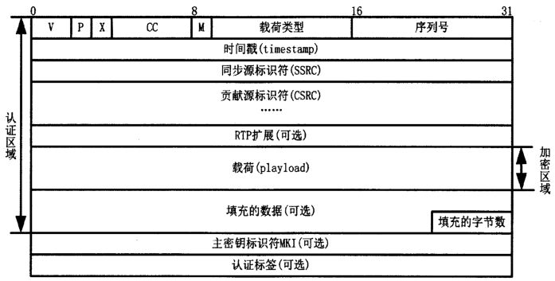
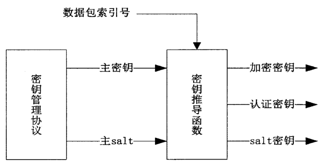
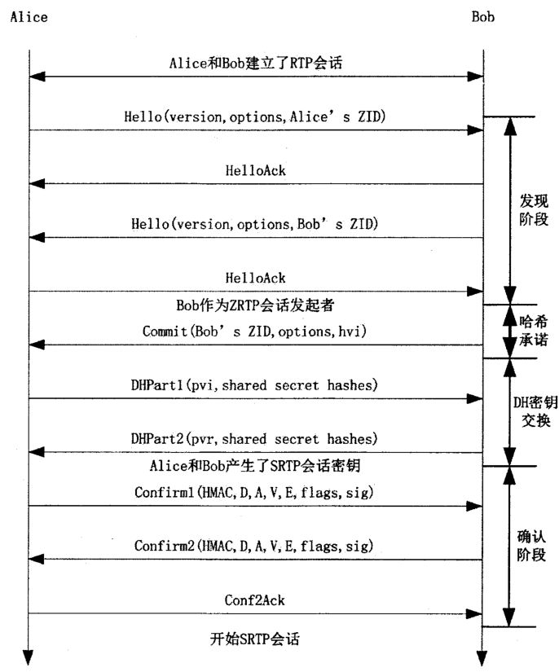
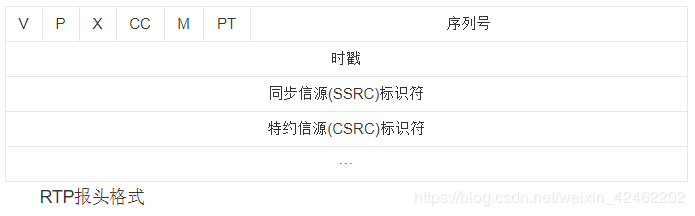

# 2.4RTSP
- [4.1 RTSP概述](#4.1)
- [4.2 RTSP状态](#4.2)
- [4.3 RTSP协议消息](#4.3)
- [4.4 SDP协议解析](#4.4)
- [4.5 资源预订协议RSVP协议&安全实时传输协议SRTP](#4.5)
- [4.6 从零开始写一个RTSP服务器](#4.6)
- [4.7 RFC2326(中文版)－实时流协议(RTSP)](#4.7)
- [4.8 海康rtsp抓包分析](#4.8)
- [4.9 RTSP认证](#4.9)


## <a id="4.1">4.1 RTSP概述</a>
实时流协议RTSP（Real Time Streaming Protocol）最早由Real Networks和Netscape公司共同提出，它位于RTP和RTCP之上，其目的是希望通过IP网络有效地传输多媒体数据。RTSP在体系结构上位于RTP和RTCP之上，它使用TCP或RTP完成数据传输。HTTP与RTSP相比，HTTP传送HTML，而RTP传送的是多媒体数据。HTTP请求由客户机发出，服务器作出响应；使用RTSP时，客户机和服务器都可以发出请求，即RTSP可以是双向的。   
作为一个应用层协议，RTSP提供了一个可供扩展的框架，它的意义在于使得实时流媒体数据的受控和点播变得可能。总的说来，RTSP是一个流媒体表示协议，主要用来控制具有实时特性的数据发送，但它本身并不传输数据，而是必须依赖于下层传输协议所提供的某些服务。RTSP可以对流媒体提供诸如播放、 暂停、快进等操作，它负责定义具体的控制消息、操作方法、状态码等，此外还描述了与RTP间的交互操作。
RTSP在制定时较多地参考了HTTP/1.1协议，甚至许多描述与HTTP/1.1完全相同。RTSP之所以特意使用与HTTP/1.1类似的语 法和操作，在很大程度上是为了兼容现有的Web基础结构，正因如此，HTTP/1.1的扩展机制大都可以直接引入到RTSP中。  
由RTSP控制的媒体流集合可以用表示描述（Presentation Description）来定义，所谓表示是指流媒体服务器提供给客户机的一个或者多个媒体流的集合，而表示描述则包含了一个表示中各个媒体流的相关信 息，如数据编码/解码算法、网络地址、媒体流的内容等。
虽然RTSP服务器同样也使用标识符来区别每一流连接会话（Session），但RTSP连接并没有被绑定到传输层连接（如TCP等），也就是说在 整个RTSP连接期间，RTSP用户可打开或者关闭多个对RTSP服务器的可靠传输连接以发出RTSP 请求。此外，RTSP连接也可以基于面向无连接的传输协议（如UDP等）。  
RTSP协议目前支持以下操作：  
检索媒体：允许用户通过HTTP或者其它方法向媒体服务器提交一个表示描述。如表示是组播的，则表示描述就包含用于该媒体流的组播地址和端口号；如果表示是单播的,为了安全在表示描述中应该只提供目的地址。  
邀请加入：媒体服务器可以被邀请参加正在进行的会议，或者在表示中回放媒体，或者在表示中录制全部媒体或其子集，非常适合于分布式教学。，会议中几方可轮流按远程控制按钮。  
添加媒体：通知用户新加入的可利用媒体流，这对现场讲座来讲显得尤其有用。与HTTP/1.1类似，RTSP请求也可以交由代理、通道或者缓存来进行处理。如服务器告诉用户可获得附加媒体内容，对现场讲座显得尤其有用。  

## <a id="4.2">4.2 RTSP状态</a>
RTSP控制通过单独协议发送的流，与控制通道无关。例如，RTSP控制可通过TCP连接，而数据流通过UDP。因此，即使媒体服务器没有收到请求，数据也会继续发送。在连接生命期，单个媒体流可通过不同TCP连接顺序发出请求来控制。所以，服务器需要维持能联系流与RTSP请求的连接状态。RTSP中很多方法与状态无关，但下列方法在定义服务器流资源的分配与应用上起着重要的作用：   
SETUP：让服务器给流分配资源，启动RTSP连接。   
PLAY与RECORD：启动SETUP 分配流的数据传输。   
PAUSE：临时停止流，而不释放服务器资源。   
TEARDOWN：释放流的资源，RTSP连接停止。 
标识状态的RTSP方法使用连接头段识别RTSP连接，为响应SETUP请求，服务器连接产生连接标识。   

## <a id="4.3">4.3 RTSP协议消息</a>
- [4.3.1 RTSP消息格式](#4.3.1)
- [4.3.2 rtsp交互过程](#4.3.2)
- [4.3.3 rtsp中常用方法](#4.3.3)

### <a id="4.3.1">4.3.1 RTSP消息格式</a>
RTSP的消息有两大类 --- 请求消息(request), 回应消息(response)。  
```Go
请求消息：
方法 URI RTSP版本 CR LF 
消息头 CR LF CR LF 
消息体 CR LF 

如下：
DESCRIBE rtsp://192.168.1.211 RTSP/1.0
CSeq: 1
Accept: application/sdp
User-Agent: magnus-fc
其中方法包括OPTION回应中所有的命令,URI是接受方的地址,例如:rtsp://192.168.20.136。RTSP版本一般都是 RTSP/1.0。每行后面的CR LF表示回车换行，需要接受端有相应的解析，最后一个消息头需要有两个CR LF。
回应消息：
RTSP版本 状态码 解释 CR LF 
消息头 CR LF CR LF 
消息体 CR LF 
如下：
RTSP/1.0 200 OK
CSeq: 1
Server: GrandStream Rtsp Server V100R001
Content-Type: application/sdp
Content-length: 256
Content-Base: rtsp://192.168.1.211/0

v=0
o=StreamingServer 3331435948 1116907222000 IN IP4 192.168.1.211
s=h264.mp4
c=IN IP4 0.0.0.0
t=0 0
a=control:*
m=video 0 RTP/AVP 96
a=control:trackID=0
a=rtpmap:96 H264/90000
m=audio 0 RTP/AVP 97
a=control:trackID=1
a=rtpmap:97 G726-16/8000
其中RTSP版本一般都是RTSP/1.0, 状态码是一个数值, 200表示成功, 解释是与状态码对应的文本解释.
```

### <a id="4.3.2">4.3.2 rtsp交互过程</a>
```Go
简单的rtsp交互过程: 
C表示rtsp客户端, S表示rtsp服务端

1. C->S:OPTION request //询问S有哪些方法可用
1. S->C:OPTION response //S回应信息中包括提供的所有可用方法

2. C->S:DESCRIBE request //要求得到S提供的媒体初始化描述信息
2. S->C:DESCRIBE response //S回应媒体初始化描述信息，主要是sdp

3. C->S:SETUP request //设置会话的属性，以及传输模式，提醒S建立会话
3. S->C:SETUP response //S建立会话，返回会话标识符，以及会话相关信息

4. C->S:PLAY request //C请求播放
4. S->C:PLAY response //S回应该请求的信息

S->C:发送流媒体数据

5. C->S:TEARDOWN request //C请求关闭会话
5. S->C:TEARDOWN response //S回应该请求
```
上述的过程是标准的、友好的rtsp流程，但实际的需求中并不一定按部就班来。 其 中第3和4步是必需的！第一步，只要服务器客户端约定好，有哪些方法可用，则option请求可以不要。第二步，如果我们有其他途径得到媒体初始化描述信 息（比如http请求等等），则我们也不需要通过rtsp中的describe请求来完成。第五步，可以根据系统需求的设计来决定是否需要。  

### <a id="4.3.3">4.3.3 rtsp中常用方法</a>
```Go
OPTION
目的是得到服务器提供的可用方法:
OPTIONS rtsp://192.168.20.136:5000/xxx666 RTSP/1.0
CSeq: 1 //每个消息都有序号来标记，第一个包通常是option请求消息
User-Agent: VLC media player (LIVE555 Streaming Media v2005.11.10)

服务器的回应信息包括提供的一些方法,例如:
RTSP/1.0 200 OK 
Server: UServer 0.9.7_rc1
Cseq: 1 //每个回应消息的cseq数值和请求消息的cseq相对应
Public: OPTIONS, DESCRIBE, SETUP, TEARDOWN, PLAY, PAUSE, SCALE,GET_PARAMETER //服务器提供的可用的方法

DESCRIBE 
C向S发起DESCRIBE请求,为了得到会话描述信息(SDP):
DESCRIBE rtsp://192.168.20.136:5000/xxx666 RTSP/1.0
CSeq: 2
token: 
Accept: application/sdp
User-Agent: VLC media player (LIVE555 Streaming Media v2005.11.10) 

服务器回应一些对此会话的描述信息(sdp):
RTSP/1.0 200 OK 
Server: UServer 0.9.7_rc1 
Cseq: 2 
x-prev-url: rtsp://192.168.20.136:5000 
x-next-url: rtsp://192.168.20.136:5000 
x-Accept-Retransmit: our-retransmit 
x-Accept-Dynamic-Rate: 1 
Cache-Control: must-revalidate 
Last-Modified: Fri, 10 Nov 2006 12:34:38 GMT 
Date: Fri, 10 Nov 2006 12:34:38 GMT 
Expires: Fri, 10 Nov 2006 12:34:38 GMT 
Content-Base: rtsp://192.168.20.136:5000/xxx666/ 
Content-Length: 344 
Content-Type: application/sdp 

v=0 //以下都是sdp信息  
o=OnewaveUServerNG 1451516402 1025358037 IN IP4 192.168.20.136 
s=/xxx666 
u=http:/// 
e=admin@ 
c=IN IP4 0.0.0.0 
t=0 0 
a=isma-compliance:1,1.0,1 
a=range:npt=0- 
m=video 0 RTP/AVP 96 //m表示媒体描述，下面是对会话中视频通道的媒体描述
a=rtpmap:96 MP4V-ES/90000 
a=fmtp:96 profile-level-id=245;config=000001B0F5000001B509000001000000012000C888B0E0E0FA62D089028307 a=control:trackID=0 //trackID＝0表示视频流用的是通道0

SETUP 
客户端提醒服务器建立会话,并确定传输模式:
SETUP rtsp://192.168.20.136:5000/xxx666/trackID=0 RTSP/1.0 
CSeq: 3 
Transport: RTP/AVP/TCP;unicast;interleaved=0-1 
User-Agent: VLC media player (LIVE555 Streaming Media v2005.11.10)
//uri中 带有trackID＝0，表示对该通道进行设置。Transport参数设置了传输模式，包的结构。接下来的数据包头部第二个字节位置就是 interleaved，它的值是每个通道都不同的，trackID＝0的interleaved值有两个0或1，0表示rtp包，1表示rtcp包，接 受端根据interleaved的值来区别是哪种数据包。

a=control:trackID=1：具体流的uri，这里是视频流的，在setup的时候需要配置该地址，没有rtsp://的时候，直接把control
的值加到请求流地址后面

服务器回应信息:
RTSP/1.0 200 OK 
Server: UServer 0.9.7_rc1 
Cseq: 3 
Session: 6310936469860791894 //服务器回应的会话标识符
Cache-Control: no-cache 
Transport: RTP/AVP/TCP;unicast;interleaved=0-1;ssrc=6B8B4567

PLAY 
客户端发送播放请求:
PLAY rtsp://192.168.20.136:5000/xxx666 RTSP/1.0 
CSeq: 4 
Session: 6310936469860791894 
Range: npt=0.000- //设置播放时间的范围
User-Agent: VLC media player (LIVE555 Streaming Media v2005.11.10)

服务器回应信息:
RTSP/1.0 200 OK 
Server: UServer 0.9.7_rc1 
Cseq: 4 
Session: 6310936469860791894 
Range: npt=0.000000- 
RTP-Info: url=trackID=0;seq=17040;rtptime=1467265309 
//seq和rtptime都是rtp包中的信息
Range——播放时间
Range: npt=0.0-end
Range:clock=20100318T021919.35Z-20100318T031919.80Z
Scale——播放速度
Scale: 1.0

5.5 TEARDOWN 
客户端发起关闭请求:
TEARDOWN rtsp://192.168.20.136:5000/xxx666 RTSP/1.0 
CSeq: 5 
Session: 6310936469860791894 
User-Agent: VLC media player (LIVE555 Streaming Media v2005.11.10) 

服务器回应:
RTSP/1.0 200 OK 
Server: UServer 0.9.7_rc1 
Cseq: 5 
Session: 6310936469860791894 
Connection: Close 

Accept：接受的负载（body）格式，这里是sdp
User-Agent：用户代理，就是用户的播放方式，这里是用海康SDK请求流抓的包，用的是NKPlayer，作用不大
Unauthorized：对状态码的描述，这里是未鉴权的意思
CSeq：因为是回复包，所以cseq要和请求包一致
WWW-Authenticate：服务器提供的鉴权方式，这里是Digest（摘要算法）和Basic（base64）两种加密方式
timeout：客户端超时时间，单位秒
ssrc：服务器返回的校验码
mode：可以是play，record，默认是play
Transport：如果是UDP，这里会回复server-port：35555-35556，代表流发送端口

Methods表示了对请求统一资源标志符（Request-URI）识别的资源所执行的操作。Method名区分大小写。RTSP的Method支持扩展
，即可以定义新的方法。方法名可能不以字符'$'（十进制数24）开头，但必须具有表征意义。

说明：
（1）PAUSE是一个推荐的method， 但在构建一个全功能的服务器时可能不支持此方法，这时就不需要它，比如对于live feeds。
如果服务器不支持某个特殊方法，它必将返回"501 Not Implemented"，并且客户端应该不再向该服务器请求该method。
（2）Presentation 是一个以完整的media feed 呈现给Client 的一个或多个Stream的集合。

1、DESCRIBE
DESCRIBE 方法从服务器检索Presentation的描述或媒体对象，这些资源通过 request URL来识别。此方法可能结合使用 
Accept 首部域来指定客户端理解的描述格式。服务器端用被请求资源的描述对客户端作出响应。DESCRIBE的答复-响应对组
成了 RTSP 的媒体初始化阶段。

2、SETUP
SETUP 请求为 URI 指定流式媒体的传输机制。客户端能够发出一个 SETUP 请求为正在播放的媒体流改变传输参数,服务器可
能同意这些参数的改变。若是不同意,它必须响应错误"455 Method Not Valid In This State"。 为了尽量绕开防火墙干涉,
即使它不会影响参数,客户端也必须指出传输参数,例如,指出服务器向外发布的固定的广播地址。
由于 SETUP 包括了所有传输初始化信息,防火墙和其他中间的网络设备(它们需要这些信息)分让了解析 DESCRIBE 响应的繁琐
任务,这些任务留给了媒体初始化。Transport 首部域指定了客户端数据传输时可接受的传输参数；响应包含了由服务器选出的
传输参数。

3、PLAY
PLAY 方法告知服务器通过 SETUP 中指定的机制开始发送数据 。在尚未收到SETUP 请求的成功应答之前,客户端不可以发出
PLAY 请求。PLAY 请求将正常播放时间定位到指定范围的起始处，并且传输数据流直到播放范围结束。
PLAY 请求会被放入队列中，服务器必须将 PLAY 请求放到队列中有序执行。也就是说，后一个 PLAY 请求需要等待前一个
PLAY 请求完成才能得到执行。比如，Client连续创建了三个PLAY请求，Range域的设置如下所示：
（1）Range: npt=10-15
（2）Range: npt=20-25
（3）Range: npt=30-
不管到达的两个 PLAY 请求之间有多紧凑,服务器首先 play 第10 到 15 秒,然后立即第 20 到 25 秒,最后是第 30 秒直
到结束。

4、PAUSE
PAUSE 请求引起媒体流传输的暂时中断。如果请求 URL 中指定了具体的媒体流，那么只有该媒体流的播放和记录被暂停。
比如，指定暂停音频,播放将会无声。如果请求 URL 指定了一个表示或者媒体流已成组,那么在该表示或组中的所有当前活
动流的传输将被暂停。在重启播放或记录后,必须维护不同track的同步。尽管服务器可能在暂停后,在timeout 的时间内
关闭会话,释放资源，但是任何资源都必须保存,其中 timeout 参数位于 SETUP 消息的Session Header中。
Session Header的格式如下所示：
Session = "Session" ":" session-id [ ";" "timeout" "=" delta-seconds ]

5、ANNOUNCE
ANNOUNCE 方法有两个用途:
（1）当客户端向服务器发送时，ANNOUNCE 将通过请求 URL 识别的表示描述或者媒体对象提交给服务器;
（2）当服务器相客户端发送时，ANNOUNCE 实时更新会话描述。
如果有新的媒体流加到表示中(比如在一个现场表示中)，整个表示描述应该重发；而不只是增加组件,如果这样做的话，
组件也可以被删除了。ANNOUNCE请求包括两个部分，一部分是RTSP标准请求内容，另一部分是按照SDP格式描述的内容。

6、OPTIONS
目的是得到服务器提供的可用方法。Client可以在任何时间发送OPTIONS请求，而且不会影响Server的状态。

7、RECORD
8、GER_PARAMETER
9、SER_PARAMETER
10、REDIRECT

11、TEARDOWN
TEARDOWN 请求终止了给定 URI 的媒体流传输，并释放了与该媒体流相关的资源。如果该 URI 是对此Presentation
的Presentation URI，那么任何与此会话相关的任何 RTSP 会话标志符将不再有效。除非所有传输参数由会话描述符
定义，否则 SETUP 请求必须在会话能被再次播放之前发出。
```
以上方法都是交互过程中最为常用的, 其它还有一些重要的方法如get/set_parameter,pause,redirect等等 

## <a id="4.4">4.4 SDP协议解析</a>
```Go
sdp的格式：
v=<version>
o=<username> <session id> <version> <network type> <address type> <address>
s=<session name>
i=<session description>
u=<URI>
e=<email address>
p=<phone number>
c=<network type> <address type> <connection address>
b=<modifier>:<bandwidth-value>
t=<start time> <stop time>
r=<repeat interval> <active duration> <list of offsets from start-time>
z=<adjustment time> <offset> <adjustment time> <offset> ....
k=<method>
k=<method>:<encryption key>
a=<attribute>
a=<attribute>:<value>
m=<media> <port> <transport> <fmt list>

v = （协议版本）
o = （所有者/创建者和会话标识符）
s = （会话名称）
i = * （会话信息）
u = * （URI 描述）
e = * （Email 地址）
p = * （电话号码）
c = * （连接信息）
b = * （带宽信息）
z = * （时间区域调整）
k = * （加密密钥）
a = * （0 个或多个会话属性行）

时间描述：
t = （会话活动时间）
r = * （0或多次重复次数）
 
媒体描述：
m = （媒体名称和传输地址）
i = * （媒体标题）
c = * （连接信息 — 如果包含在会话层则该字段可选）
b = * （带宽信息）
k = * （加密密钥）
a = * （0 个或多个媒体属性行）
```

SDP一会话描述协议一描述SAP、sIP和RTSR会话的协议,是一种文件描述协议,是由服务器生成的描述媒体文件编码信息以及所在服务器的链接等的信息。在多媒体会话中sDP传送有关媒体流的信息,使会话描述的参人方加人会话。sDP主要用于Intemet网中,但也可以在其它网络环境下使用。SDP十分通用,可描述其它网络环境中的会话,但主要用于Intemet中。在Intemet环境下,sDP有两个主要目的:一是表明会话存在,二是传送足够信息给接收方,以便能加人、参加该会话。SDP所传达的信息包括:会话名称和目的,会话活动时间,组成会话媒体种类,接收这些媒体的控制信息(如地址、端口、格式、带宽和会议管理人员资料等)。  
 
>总结：在RTSP交互过程中，只要在客户端发出Describe请求的时候，服务端回应的时候会有SDP消息发出，用SDP来描述会话情况和内容，方便客户端能够加入该会话，

参考链接：
1.SDP协议详细总结
https://blog.csdn.net/weixin_42462202/article/details/90710599

## <a id="4.5">4.5 资源预订协议RSVP协议&安全实时传输协议SRTP</a>
### 1.资源预订协议RSVP协议
　 由于音频和视频数据流比传统数据对网络的延时更敏感，要在网络中传输高质量的音频、视频信息，除带宽要求之外，还需其他更多的条件。RSVP(ResourceReserveProtocol)是正在开发的Internet上的资源预订协议，使用RSVP预留一部分网络资源（即带宽），能在一定程度上为流媒体的传输提供QoS。在某些试验性的系统如网络视频会议工具vic中就集成了RSVP。   
　 RSVP运行在传输层，在IP上层。与ICMP和IGMP相比，它是一个控制协议。 RSVP协议的两个重要概念是流与预定。流是从发送者到一个或多个接收者的连接特征，通过IP包中"流标记"来认证。发送一个流前，发送者传输一个路径信息到目的接收方，这个信息包括源IP地址、目的IP地址和一个流规格。这个流规格是由流的速率和延迟组成的，这是流的QoS需要的。接收者实现预定后，基于接收者的模式能够实现一种分布式解决方案。   
　 RSVP领域的发展是非常迅速的，但目前并没有在任何一种网络上得到证实，它的应用只是局限在测试的小Intranet网络上。因为RSVP的预定必须建立在完全流方式的基础上，其可扩展性问题倍受关注。  

### 2.安全实时传输协议SRTP
SRTP（Secure Real-time Transport Protocol）是对RTP协议的扩展，旨在提供数据加密、消息认证、完整性保证和重放保护等。SRTP使用AES对RTP/RTCP数据包的载荷进行加密保护，使用HMAC-SHA1提供完整性保护和消息认证。

SRTP报文格式与RTP基本相同，只是加入了两个主密钥标识符（MKI）和认证标签（Authentication Tag）：



```c++
SRTP会话时，发送方与接收方需要为每个SRTP会话维护一份加密状态信息，即加密环境（加密环境ID号由SSRC、目的网络地址与端口号确定）。加密环境包含两类参数：
算法相关参数：与认证与加密算法相关的，如会话密钥、初始化向量等；
算法无关参数：SRTP规定的一些通用参数。
重要参数说明：
	循环计数器（Rollover Counter，ROC）：32位，16比特的RTP序号（SEQ）重置次数（超过65535）；所以RTP数据索引为i=2^16*ROC+SEQ；
	16比特的序列号；
	抗重放列表：接收且通过认证的SRTP数据包的索引号，不能低于256条；
	<From, To>值：两个48比特的SRTP报文索引，标识了主密钥的合法范围；
	密钥推导率：从主密钥推导会话密钥，为2的幂（1~2^24），默认为0表示不用该参数；
	加密算法标识符：使用哪种算法，如AES-f8；
	消息认证算法标识符：使用哪种算法，如HMAC-SHA1；
	主密钥：用于推导会话密钥，要确保机密；
	主Salt：用于从主密钥推导各种会话密钥的随机数；
```



密钥协商主要有ZRTP与MiKey模式。MiKey有三种密钥协商方式：   
     恭喜密钥（Pre-shared key）  
     公钥加密（Public-key encryption）   
     Diffie-Hellman密钥交换   

ZRTP

ZRTP是一种密钥管理协议，用来协商SRTP加密和认证相关的各种参数以及会话密钥，它复用了RTP端口（在媒体路径上传输）；它是基于Diffie-Hellman密钥交换机制的。



## <a id="4.6">4.6从零开始写一个RTSP服务器</a>
>参考连接:
https://blog.csdn.net/weixin_42462202/article/details/98986535

- [4.6.1会话描述](#4.6.1)
- [4.6.2RTP OVER TCP](#4.6.2)

### <a id="4.6.1">4.6.1会话描述</a>
RTSP是一个实时传输流协议，是一个应用层的协议。通常说的RTSP包括RTSP协议、RTP协议、RTCP协议。对于这些协议的作用简单的理解如下：  
RTSP协议：负责服务器与客户端之间的请求与响应  
RTP协议：负责传输媒体数据  
RTCP协议：在RTP传输过程中提供传输信息  
AAC音频格rtsp承载与rtp和rtcp之上，rtsp并不会发送媒体数据，而是使用rtp协议传输  
rtp并没有规定发送方式，可以选择udp发送或者tcp发送  
```Go
RTSP请求的常用方法
方法	描述
OPTIONS	获取服务端提供的可用方法
DESCRIBE	向服务端获取对应会话的媒体描述信息
SETUP	向服务端发起建立请求，建立连接会话
PLAY	向服务端发起播放请求
TEARDOWN	向服务端发起关闭连接会话请求

DESCRIBE
C–>S
DESCRIBE rtsp://192.168.31.115:8554/live RTSP/1.0\r\n
CSeq: 3\r\n
Accept: application/sdp\r\n
客户端向服务器请求媒体描述文件，格式为sdp
S–>C

RTSP/1.0 200 OK\r\n
CSeq: 3\r\n
Content-length: 146\r\n
Content-type: application/sdp\r\n
\r\n

v=0\r\n
o=- 91565340853 1 in IP4 192.168.31.115\r\n
t=0 0\r\n
a=contol:*\r\n
m=video 0 RTP/AVP 96\r\n
a=rtpmap:96 H264/90000\r\n
a=framerate:25\r\n
a=control:track0\r\n

SETUP

C–>S

SETUP rtsp://192.168.31.115:8554/live/track0 RTSP/1.0\r\n
CSeq: 4\r\n
Transport: RTP/AVP;unicast;client_port=54492-54493\r\n
\r\n

客户端发送建立请求，请求建立连接会话，准备接收音视频数据
解析一下Transport: RTP/AVP;unicast;client_port=54492-54493\r\n
RTP/AVP：表示RTP通过UDP发送，如果是RTP/AVP/TCP则表示RTP通过TCP发送
unicast：表示单播，如果是multicast则表示多播
client_port=54492-54493：由于这里希望采用的是RTP OVER UDP，所以客户端发送了两个用于传输数据的端口，客户端已经将这两个端口绑定到两个udp套接字上，54492表示是RTP端口，54493表示RTCP端口(RTP端口为某个偶数，RTCP端口为RTP端口+1)
S–>C

RTSP/1.0 200 OK\r\n
CSeq: 4\r\n
Transport: RTP/AVP;unicast;client_port=54492-54493;server_port=56400-56401\r\n
Session: 66334873\r\n
\r\n
服务端接收到请求之后，得知客户端要求采用RTP OVER UDP发送数据，单播，客户端用于传输RTP数据的端口为54492，RTCP的端口为54493
服务器也有两个udp套接字，绑定好两个端口，一个用于传输RTP，一个用于传输RTCP，这里的端口号为56400-56401
之后客户端会使用54492-54493这两端口和服务器通过udp传输数据，服务器会使用56400-56401这两端口和这个客户端传输数据
sdp格式由多行的type=value组成
sdp会话描述由一个会话级描述和多个媒体级描述组成。会话级描述的作用域是整个会话，媒体级描述描述的是一个视频流或者音频流
会话级描述由v=开始到第一个媒体级描述结束
媒体级描述由m=开始到下一个媒体级描述结束
v=0\r\n
o=- 91565340853 1 in IP4 192.168.31.115\r\n
t=0 0\r\n
a=contol:*\r\n
m=video 0 RTP/AVP 96\r\n
a=rtpmap:96 H264/90000\r\n
a=framerate:25\r\n
a=control:track0\r\n	

v=0
表示sdp的版本
o=- 91565340853 1 IN IP4 192.168.31.115
格式为 o=<用户名> <会话id> <会话版本> <网络类型><地址类型> <地址>
用户名：-
会话id：91565340853，表示rtsp://192.168.31.115:8554/live请求中的live这个会话
会话版本：1
网络类型：IN，表示internet
地址类型：IP4，表示ipv4
地址：192.168.31.115，表示服务器的地址
m=video 0 RTP/AVP 96\r\n
格式为 m=<媒体类型> <端口号> <传输协议> <媒体格式 >
媒体类型：video
端口号：0，为什么是0？因为上面在SETUP过程会告知端口号，所以这里就不需要了
传输协议：RTP/AVP，表示RTP OVER UDP，如果是RTP/AVP/TCP，表示RTP OVER TCP
媒体格式：表示负载类型(payload type)，一般使用96表示H.264
a=rtpmap:96 H264/90000
格式为a=rtpmap:<媒体格式><编码格式>/<时钟频率>
a=framerate:25
表示帧率
a=control:track0
表示这路视频流在这个会话中的编号
rtp包由rtp头部和rtp荷载构成
```



- 版本号(V)：2Bit，用来标志使用RTP版本
- 填充位§：1Bit，如果该位置位，则该RTP包的尾部就包含填充的附加字节
- 扩展位(X)：1Bit，如果该位置位，则该RTP包的固定头部后面就跟着一个扩展头部
- CSRC技术器(CC)：4Bit，含有固定头部后面跟着的CSRC的数据
- 标记位(M)：1Bit，该位的解释由配置文档来承担
- 载荷类型(PT)：7Bit，标识了RTP载荷的类型
- 序列号(SN)：16Bit，发送方在每发送完一个RTP包后就将该域的值增加1，可以由该域检测包的丢失及恢复
包的序列。序列号的初始值是随机的
- 时间戳：32比特，记录了该包中数据的第一个字节的采样时刻
- 同步源标识符(SSRC)：32比特，同步源就是RTP包源的来源。在同一个RTP会话中不能有两个相同的SSRC值
- 贡献源列表(CSRC List)：0-15项，每项32比特，这个不常用
- rtp荷载，rtp载荷为音频或者视频数据

### <a id="4.6.2">4.6.2RTP OVER TCP</a>
一种情况是是rtsp采用tcp，rtp、rtcp采用udp，则偶数端口是rtp奇数端口是rtcp。RTP默认是采用UDP发送的，格式为RTP头+RTP载荷。   

还有一种情况是，如果是使用TCP，那么需要在RTP头之前再加上四个字节。RTP和RTCP的channel是在RTSP的SETUP过程中，客户端发送给服务端的。      
第一个字节：$，辨识符  
第二个字节：通道，在SETUP的过程中获取  
第三第四个字节：	RTP包的大小，最多只能12位，第三个字节保存高4位，第四个字节保存低8位  

setup差异：   
Transport: RTP/AVP/TCP;unicast;interleaved=0-1。    
RTP/AVP/TCP表示使用RTP OVER TCP，interleaved=0-1表示这个会话连接的RTP channel为0，RTCP channel为1。   

Transport: RTP/AVP;unicast;client_port=54492-54493。   
RTP/AVP表示使用udp，client_port=54492-54493表示RTP、RTCP端口0。      

rtp载荷如果是h264，如果是单个nalu打包，一整个NALU的数据放入RTP包的载荷。    
rtp载荷如果是h264，如果分片打包，则RTP包的载荷第一个字节位FU Indicator（高三位：与NALU第一个字节的高三位相同，后面是28），第二个字节位FU Header（start打包的第一个RTP包，end打包的最后一个RTP包，NALU的TypeIP）。   

rtp载荷如果是aac，其中RTP载荷的一个字节为0x00，第二个字节为0x10，第三个字节和第四个字节保存AAC Data的大小，最多只能保存13bit，第三个字节保存数据大小的高八位，第四个字节的高5位保存数据大小的低5位。   

假设音频的采样率位44100，即每秒钟采样44100次

AAC一般将1024次采样编码成一帧，所以一秒就有44100/1024=43帧

RTP包发送的每一帧数据的时间增量为44100/43=1025

每一帧数据的时间间隔为1000/43=23ms

## <a id="4.7">4.7 RFC2326(中文版)－实时流协议(RTSP)</a>
```c++
实时流协议(RTSP)
( Real Time Streaming Protocol (RTSP) )

备忘录的状态：

本文档讲述了一种Internet社区的Internet标准跟踪协议，它需要进一步进行讨论和建议以得到改进。请参考最新版的“Internet正式协议标准”(STD1)来获得本协议的标准化程度和状态。本备忘录的发布不受任何限制。

版权声明：

版权为The Internet Society 所有。所有权利保留。

摘要：

实时流协议（RTSP）是应用层协议，控制实时数据的传送。RTSP提供了一个可扩展框架，使实时数据，如音频与视频的受控、点播成为可能。数据源包括现场数据与存储在剪辑中数据。该协议目的在于控制多个数据发送连接，为选择发送通道，如UDP、组播UDP与TCP，提供途径，并为选择基于RTP(RFC1889)上传送机制提供方法。

目录：

1 绪论      5
1.1 目的      5
1.2 要求      6
1.3 术语      6
1.4 协议特点      7
1.5 RTSP扩展      8
1.6 操作模式      9
1.7 RTSP状态      9
1.8 与其他协议关系      10
2 符号协定      10
3 协议参数      10
3.1 RTSP版本      10
3.2 RTSP URL      11
3.3 会议标识      13
3.4 会话标识      13
3.5 SMPTE 相对时间戳      13
3.6正常播放时间      14
3.7 绝对时间      15
3.8 选择标签      15
3.8.1 用IANA注册新的选择标签      15
4 RTSP消息      15
4.1 消息类型      16
4.2 消息标题      17
4.3 消息主体      17
4.4 消息长度      18
5 普通标题域      18
6 请求      19
6.1 请求队列      19
6.2 请求标题域      19
7 回应      20
7.1 状态行      20
7.1.1 状态代码和原因分析      20
7.1.2 回应标题域      23
8 实体      23
8.1 实体标题域      24
8.2 实体主体      24
9 连接      25
9.1 流水线操作      25
9.2 可靠性及确认      25
10 方法定义      25
10.1 选择      26
10.2 描述      26
10.3 通告      26
10.4 建立      26
10.5 播放      27
10.6 暂停      27
10.7 断开      27
10.8 获取参数      28
10.9 设置参数      28
10.10 重定向      28
10.11 录制      29
10.12 嵌入二进制数据      29
11状态代码定义（Status Code Definitions）      29
11.1成功2xx（Success 2xx）      30
11.1.1 存储空间低 250      30
11.2 重定向（Redirection 3xx）      31
11.3 客户端错误（Client Error ）4xx      31
11.3.1方法不允许      32
11.3.2参数不能理解      32
11.3.3会议未找到      33
11.3.4 带宽不足      33
11.3.5 会话未找到      34
11.3.6 本状态下该方法无效      34
11.3.7 标题域对资源无效      34
11.3.8 无效范围      35
11.3.9 参数只读      35
11.3.10 不允许合操作      36
11.3.11 只允许合操作      36
11.3.12 不支持的传输      36
11.3.13 目标不可达      37
11.3.14 选择不支持      37
12 标题域定义（Header Field Definitions）      38
12.1 接受      38
12.2 接受编码      38
12.3 接受语言      39
12.4 允许（Allow）      39
12.5 授权（Authorization）      40
12.6 带宽      40
12.7 块大小      40
12.8 缓存控制      41
12.9 会议      41
12.10 连接      41
12.11 基本内容      42
12.12 内容编码（Content-Encoding）      42
12.13 内容语言      43
12.14 内容长度（Content-Length）      43
12.15 内容位置      43
12.16 内容类型（Content-Type）      44
12.17 序列号      44
12.18 日期（Date）      44
12.19 过期（Expires）      45
12.20 来自（From）      45
12.21 主机      45
12.22 如果匹配      45
12.23 从何时更改（If-Modified-Since）      46
12.24 最近更改（Last-Modified）      46
12.25 位置（Location）      46
12.26 代理授权      47
12.27 代理要求      47
12.28 公用性      47
12.29 范围      49
12.30 提交方（Referer）      49
12.31 稍后再试      49
12.32 要求      49
12.33 RTP信息      49
12.34 比例      49
12.35 速度      49
12.36 服务器（Server）      49
12.37 会话      49
12.38 时间戳      49
12.39 传输      49
12.40 不支持      49
12.41 用户代理（User-Agent）      49
12.42 变化      49
12.43 通过      49
12.44 WWW-授权（WWW-Authenticate）      50
13 缓存      50
14 实例      50
14.1 要求媒体（单播）      50
14.2 容器文件的流      51
14.3 单个流容器文件      51
14.4 组播现场媒体表示      51
14.5 在存在的会话中播放媒体      51
14.6 录制      52
15 语法      52
15.1 基本语法      52
16 安全考虑（Security Considerations）      52
附录A RTSP协议状态机      53
A.1 客户端状态机      53
A.2 服务器端状态机      53
附录B 同RTP协议的交互      53
附录C 使用SDP进行RTSP会话描述      54
C.1 定义      54
C.1.1 控制URL      55
C.1.2 媒体流      55
C.1.3 有效载荷类型      55
C.1.4 详细格式参数      55
C.1.5 表示的范围      56
C.1.6 有效时间      56
C.1.7 连接信息      56
C.1.8 实体标签      57
C.2 合控制不可用      57
C.3 合控制可用      57
附录D 最简单的RTSP实现      58
D.1 客户端      58
D.1.1回放      58
D.1.2 授权      58
D.2 服务器      59
D.2.1回放      59
D.2.2授权      59
附录E 作者地址      60
附录F 致谢      60
参考书目      60
版权申明      61

1 绪论
1.1 目的
实时流协议（RTSP）建立并控制一个或几个时间同步的连续流媒体。尽管连续媒体流与控制流有可能交叉，但RTSP本身通常并不发送连续媒体流。换言之，RTSP充当多媒体服务器的网络远程控制。

表示描述(presentation description)定义了被控流，但本文并没有定义表示描述的格式。

这里没有使用RTSP连接的概念，而由RTSP会话(session)代替（每次服务由服务器端保持一个带标签的会话）。RTSP会话没有绑定到传输层连接（如TCP连接）。因为虽然在RTSP会话期间，RTSP客户端可打开或关闭多个对服务器端的可靠传输连接以发出RTSP 请求。但此外，也可能使用无连接传输协议，比如用UDP发送RTSP请求。

RTSP控制的流可能用到RTP，但RTSP操作并不依赖用于携带连续媒体的传输机制。实时流协议在语法和操作上与HTTP/1.1类似，因此HTTP的扩展机制大都可加入RTSP。尽管如此，RTSP在很多方面还是和HTTP有很大的不同：

²      RTSP引入了很多新方法并且有不同的协议标识符。
²      RTSP服务器在大多数默认情况下需要维持一个状态，但HTTP是无状态协议。
²      RTSP客户机和服务器都可以发出请求。
²      数据由另一个协议传送（有一特例除外）。
²      RTSP使用ISO 10646(UTF-8) 而不是ISO 8859-1，以配合当前HTML的国际化。
²      RTSP使用URI请求时包含绝对URI。而由于历史原因造成的向后兼容性问题，HTTP/1.1只在请求中包含绝对路径，把主机名放入单独的标题域中。
这使得“虚拟主机”实现更为简便，一个单独IP地址的主机可虚拟为几个文件树主机。

协议支持的操作如下：

从媒体服务器上检索媒体：
用户可通过HTTP或其它方法请求一个表示描述。如表示是组播，表示描述就包含用于连续媒体的的组播地址和端口。如表示仅通过单播发送给用户，用户为了安全应提供目的地址。

媒体服务器邀请进入会议：
媒体服务器可被邀请参加正进行的会议，或回放媒体，或记录其中一部分，或全部。这种模式在分布式教育应用上很有用，会议中几方可轮流按远程控制按钮。

将媒体加到现成讲座中：
　 如服务器告诉用户可获得附加媒体内容，对现场讲座显得尤其有用。

如HTTP/1.1中类似，RTSP请求可由代理、通道与缓存处理。
1.2 要求
在本文档中的关键字“必须”，“一定不能”，“要求”，“会”，“不会”，“应该”，“不应该”，“被推荐的”，“可以”，和“可选择的”都在RFC2119中解释。
1.3 术语
一些术语原由HTTP/1.1采用。在HTTP/1.1中定义的术语这里不再列举。

合控制：
服务器使用单条时间线对多个流的控制。对音频/视频回馈来讲，这就意味着客户端仅需发送一条播放或者暂停消息就可同时控制音频和视频的回馈。
会议：
多方参与的多媒体表示，这里的多方意味着大于或者等于一方。
客户端：
指请求媒体服务器上连续流媒体数据的客户端。
连接：
      两个应用程序以通讯为目的在传输层建立虚拟电路。
容器文件：
      可以容纳多个共同播放时包含表示(presentation)的媒体流的文件。RTSP服务器可以为这些容器文件提供合控制，但容器文件的概念本身并不是本协议内容。
连续媒体：
      接受器和数据源之间存在时序关系的数据。也就是说，接受器需要重新产生存在于源数据中的时序关系。最普通的连续媒体的例子是音频和动画视频。连续媒体可以是实时的（但是不交互的），它们在源和接受器之间是一种紧密的时序关系；或者是流的形式，这种关系就没有那么严格了。
实体：
作为请求或者回应的有效负荷传输的信息。由以实体标题域（entity-header field）形式存在的元信息和以实体主体（entity body）形式存在的内容组成，如第八章所述。
媒体的初始化：
数据类型/编码的具体初始化，这些包括时钟输率，颜色表等。用户请求媒体回放的任何独立传输信息，是在创建流时初始化媒体流相位时产生的。
媒体参数:
针对回放前或回放过程中有可能改变的媒体类型而专门设定的参数。
媒体服务器：
可对一个或多个媒体流提供回放和录制服务的服务器。同一个表示(presentation)中不同的媒体流可能来自于不同的媒体服务器。媒体服务器可以建立在作为传送请求表示(presentation)的Web服务器的主机上，也可以建立在不同的主机上。
媒体服务器重定向：
      重新定向媒体客户端到另外一个媒体服务器。
(媒体)流：
      单个媒体实例，比如，在应用中共用音频流或视频流。当使用RTP时，流包括由RTP 会话(session)中源所创建的所有RTP和RTCP包。这和定义DSM-CC流时相同。
消息：
RTSP通讯的基本单元。由15章语法定义的一串八位位组组成，并通过连接或者无连接协议传送。
参与者：
一个会议成员。参与者可以是机器，比如是媒体记录或回放服务器。
表示(presentation)：
对用户请求所回馈的一组流，其使用下面的表示描述(presentation description)形式。在本文中的多数情况下，其意味着对流进行总体控制，但这并不是必须的。
表示描述(presentation description)：
表示描述包含在表示(presentation)中一个或者多个媒体流的信息。比如，编码，网络地址和内容的信息。另外，其他IETF协议，如SDP协议使用会话(session)代替现场presentation。表示描述可以采用包括会话描述(session description)SDP在内的多种格式。
回应：
RTSP回应。如果能理解HTTP回应，就能清楚的理解RTSP回应。
请求；
RTSP请求。如果能理解HTTP请求，就能清楚的理解RTSP请求。
RTSP会话(session)：
RTSP交互的全过程。比如，一个电影的观看过程。会话(session)包括由客户端建立连续媒体流传输机制(SETUP)，使用播放(PLAY)或录制(RECORD)开始传送流，用停止(TEARDOWN)关闭流。
传输初始化：
客户端和服务器端之间传输信息（端口号，传输协议等）的交互。
1.4 协议特点
RTSP 特性如下：
可扩展性：
　 RTSP中很容易加入新方法和参数。
易解析：
　 RTSP可由标准 HTTP或MIME解析器解析。
安全：
RTSP使用网页安全机制。所有HTTP授权机制如basic和digest授权都可直接使用。也可以传输层或网络层安全机制。
独立于传输：
RTSP可使用不可靠数据报协议（UDP）、可靠数据报协议（RDP），如要实现应用级可靠，可使用可靠流协议。
多服务器支持：
表示(presentation)中的每个流可放在不同服务器上，用户端自动同不同服务器建立几个并发控制连接，媒体同步在传输层执行。
记录设备控制：
　 协议可控制记录和回放设备，也可控制可在记录和回放切换的设备。
流控与会议开始分离：
流控与邀请媒体服务器入会分离；仅要求会议初始化协议提供，或可用来创建唯一会议标识号。特殊情况下， SIP或H.323 可用来邀请服务器入会。
适合专业应用：
　 通过SMPTE 时标，RTSP支持帧级精度，允许远程数字编辑。
表示描述中立：
协议没强加特殊表示或元文件，可传达所用格式类型；然而，表示描述至少必须包含一个RTSP URI。
代理与防火墙友好：
协议可由应用和传输层防火墙处理。防火墙需要理解SETUP方法，为UDP媒体流打开一个/"缺口/"。
HTTP友好：
此处，RTSP明智的采用HTTP观念，使现在结构都可重用。结构包括Internet 内容选择平台（PICS）。由于在大多数情况下控制连续媒体需要服务器状态， RTSP不仅仅向HTTP 添加方法。
适当的服务器控制：
　 如用户能启动一个流，它必须也能停止一个流。 服务器不能启动一个用户不能停止的流。
传输协调：
　 实际处理连续媒体流前，用户可协调传输方法。
性能协调：
如基本特征无效，必须有一些清理机制让用户决定那种方法没生效。这允许用户提出适合的用户界面。 例如，如果不允许寻找，用户界面必定能禁止位置条滑动。
以前要求RTSP必须能支持多用户，但现在得出一个更好的方法就是保证RTSP能很容易扩展成支持多用户即可。因为流的标志可以被多个控制流使用，因此”远程通过”成为可能。协议不涉及到多个客户端如何协调入口，其由下层“社会协议”或其他下层控制机制提供。
1.5 RTSP扩展
由于不是所有媒体服务器有着相同的功能，媒体服务器有必要支持不同请求集。例如：
Ø      服务器可能只须支持回放，因此不必不支持录制功能。
Ø      对于支持现场播放的服务器可能不支持寻找功能。
Ø      一些服务器可能不支持设置流参数，因此不支持GET_PARAMETER和SET_PARAMETER。
但服务器应该实现所有12章中要求的标题域。
表示描述(presentation description)应当保证不提出服务器不支持的功能，这种情形和HTTP/1.1中[H19.6]描述方法不支持across server的情形一致。
RTSP 可以如下三种方式扩展，这里以改变大小排序：
Ø      以新参数扩展。如用户需要拒绝通知，而方法扩展不支持，相应标记就加入要求的段中。
Ø      加入新方法。如信息接收者不理解请求，返回501错误代码（还未实现），发送者不应再次尝试这种方法。用户可使用OPTIONS方法查询服务器支持的方法。服务器使用公共回应标题列出支持的方法。
Ø      定义新版本协议，允许改变所有部分。（除了协议版本号位置）
1.6 操作模式
　 每个表示和媒体流可用RTSP URL识别。表示组成的整个表示与媒体属性由表示描述(presentation description)文件定义，表示描述格式不在本协议中定义。使用HTTP或其它途径用户可获得这个文件，它没有必要保存在媒体服务器上。
　 为了说明，假设表示描述(presentation description)描述了多个表示(presentation)，其中每个表示(presentation)维持了一个公共时间轴。为简化说明，且不失一般性，假定表示描述(presentation description)的确包含这样一个表示(presentation)。表示(presentation)可包含多个媒体流。
     表示描述(presentation description)即组成表示的流的描述，包括它们的编码，语言和使用户可以选择最符合要求媒体的其他参数。在表示描述中，被RTSP分别控制的媒体流由RTSP URL表示。RTSP URL指出了处理具体媒体流的服务器以及存在于该服务器上流的名字。多个媒体流可以放到不同的服务器上，比如音频和视频流可以分别放到不同服务器而负载共享。描述（description)还列出了服务器传输可使用的方法。
除媒体参数外，网络目标地址和端口也需要决定。下面区分几种操作模式：
单播：
　 以用户选择的端口号将媒体发送到RTSP请求源。
组播，服务器选择地址：
　 媒体服务器选择组播地址和端口，这是现场直播或准点播常用的方式。
组播，用户选择地址：
　 如服务器加入正在进行的组播会议，组播地址、端口和密匙由会议描述给出。
1.7 RTSP状态
　 RTSP控制通过单独协议发送的流，与控制通道无关。例如，RTSP控制可通过TCP连接，而数据流通过UDP。因此，即使媒体服务器没有收到请求，数据也会继续发送。在会话生命期，单个媒体流可通过不同TCP连接顺序发出请求来控制。所以，服务器需要维持能联系流与RTSP请求的会话状态。
RTSP中很多方法与状态无关，但下列方法在定义服务器流资源的分配与应用上起着重要的作用：
SETUP：
　 让服务器给流分配资源，启动RTSP会话。
PLAY与RECORD：
　 启动SETUP 分配流的数据传输。
PAUSE：
　 临时停止流，而不释放服务器资源。
TEARDOWN：
　 释放流的资源，RTSP会话停止。
　 标识状态的RTSP方法使用会话(session)标题域识别RTSP会话，为回应SETUP请求，服务器生成会话标识。
1.8 与其他协议关系
　 RTSP在功能上与HTTP有重叠，与HTTP相互作用体现在与流内容的初始接触是通过网页的。目前的协议规范目的在于允许在网页服务器与实现RTSP媒体服务器之间存在不同传递点。例如，表示描述(presentation description)可通过HTTP和RTSP检索，这降低了浏览器的往返传递，也允许独立RTSP 服务器与用户不全依靠HTTP。
　 但是，RTSP与HTTP 的本质差别在于数据发送以不同协议进行。HTTP是不对称协议，用户发出请求，服务器作出回应。RTSP中，媒体用户和服务器都可发出请求，且其请求都是无状态的；在请求确认后很长时间内，仍可设置参数，控制媒体流。
重用HTTP功能至少在两个方面有好处，即安全和代理。要求非常接近，在缓存、代理和授权上采用HTTP功能是有价值的。
　 当大多数实时媒体使用RTP作为传输协议时，RTSP没有绑定到RTP。
RTSP假设存在表示描述格式可表示包含几个媒体流的表示的静态与临时属性。
2 符号协定
既然很多定义和语法与HTTP/1.1中相同，这里仅指出它们在HTTP/1.1中定义的位置而并没有拷贝它们到本文档。为简便起见，本文档中[ HX.Y ]表示对应HTTP/1.1（RFC 2068）中的X.Y部分。（[译者注：]为更方便学习RTSP，本翻译文档将相关段落完全译出）

与[H2.1]类似，本文对所有机制的说明都是以散文和补充反馈的方式来描述的。除RTSP中以”1#”代替”,”为分隔符不同外，其余在RFC 2234中有详细的描述。简单说明补充反馈方式如下：

补充反馈方式（augmented BNF）包括下面的结构：

要解释的名词＝名词解释（name = definition）
规则的名字（name）就是它本身（不带任何尖括号，“<”，“>”），后面跟个等号＝，
然后就是该规则的定义。如果规则需要用多个行来描述，利用空格进行缩进格式排
版。某些基本的规则使用大写，如SP, LWS, HT, CRLF, DIGIT, ALPHA,等等。定义
中还可以使用尖括号来帮助理解规则名的使用。

字面意思（"literal"）
           文字的字面意思放在引号中间，除非特别指定，该段文字是大小写敏感的。

规则1｜规则2（rule1 | rule2）
           “｜”表示其分隔的元素是可选的，比如，“是｜否”要选择‘是’或‘否’。

（规则1　规则2）（(rule1 rule2)）
在圆括号中的元素表明必选其一。如（元素1（元素2｜元素3）元素4）可表明两
种意思，即“元素1　元素2　元素4”和“元素1　元素3　元素4”

*规则（*rule）
在元素前加星号“*”表示循环，其完整形式是“<n>*<m>元素”，表明元素最少产
生<n>次，最多<m>次。缺省值是0到无限，例如，“1*元素”意思是至少有一个，
而“1*2元素”表明允许有1个或2个。

［规则］（[rule]）
方括号内是可选元素。如“［元素1　元素2］”与“*1（元素1　元素2）”是一回
事。

N　规则（N rule）
表明循环的次数：“<n>（元素）”就是“<n>*<n>（元素）”，也就是精确指出<n>
取值。因而，2DIGIT 就是2位数字, 3ALPHA 就是由三个字母组成字符串。

＃规则（#rule）
“#”与“*”类似，用于定义元素列表。

完整形式是“<n>#<m>元素”表示至少有<n>个至多有<m>个元素，中间用“,”或
任意数量的空格（LWS-linear whitespace）来分隔，这将使列表非常方便，如“（*LWS
元素 *（ *LWS "," *LWS 元素 ））”就等同于“1#元素”。

空元素在结构中可被任意使用，但不参与元素个数的计数。也就是说，“（元素1），，
（元素2）”仅表示2个元素。但在结构中，应至少有一个非空的元素存在。缺省
值是0到无限，即“#（元素）”表示可取任何数值，包括0；而“1#元素”表示至
少有1个；而“1#2元素”表示有1个或2个。

；注释（; comment）
           分号后面是注释，仅在单行使用。

隐含*LWS（implied *LWS）
本文的语法描述是基于单词的。除非另有指定，线性空格（LWS）可以两个邻近符
号或分隔符（tspecials）之间任意使用，而不会对整句的意思造成影响。在两个符号之
间必须有至少一个分隔符，因为它们也要做为单独的符号来解释。实际上，应用程序在
产生HTTP结构时，应当试图遵照“通常方式”，因为现在的确有些实现方式在通常方
式下无法正常工作。

在本备忘录中，我们用缩进的小型段落来提供动机和背景资料。这将使没有参与制定RTSP规范的读者更容易理解RTSP中各部分为什么要以该方式来实现。
3 协议参数
3.1 RTSP版本
同[H3.1]定义，仅用RTSP代替HTTP即可。

如下：
     RTSP采用主从（<major>.<minor>）数字形式来表示版本。协议的版本政策倾向于让发
送方表明其消息的格式及功能，而不仅仅为了获得通讯的特性，这样做的目的是为了与更高
版本的RTSP实现通讯。只增加扩展域的值或增加了不影响通讯行为的消息组件都不会导致
版本数据的变化。当协议消息的主要解析算法没变，而消息语法及发送方的隐含功能增加了，
将会导致从版本号（<minor>）增加；当协议中消息的格式变化了，主版本号（<major>）也
将发生改变。
     RTSP消息的版本由消息第一行中的RTSP版本域来表示。

RTSP-Version            = "RTSP" "/" 1*DIGIT "." 1*DIGIT

注意，主从版本应当被看作单独的整数，因为它们都有可能增加，从而超过一位整
数。因而，RTSP/2.4比RTSP/2.13版本低，而RTSP/2.13又比RTSP/12.3版本低。
版本号前面的0将被接收方忽略，而在发送方处也不应产生。
           
本文档定义了RTSP协议的1.0版本。发送本规范定义的请求（Request）或回应（Response）消息的应用必须指明RTSP的版本为“RTSP/1.0”。使用该版本号意味着发送消息的应用至少有条件的遵循本规范。

应用的RTSP版本即为应用至少能有条件遵循的RTSP版本中的最高版本。

     当代理及网关收到与其自身版本不同的RTSP请求时，必须小心处理请求的推送，因为
协议版本表明发送方的能力，代理或网关不应发出高于自身版本的消息。如果收到高版本的
请求，代理或网关必须降低该请求的版本，并回应一个错误。而低版本的请求也应在被推送
前升级。代理或网关回应请求时必须和请求的版本相同。

3.2 RTSP URL
“rtsp”和“rtspu”表示要通过RTSP协议来定位网络资源。本节详细定义了RTSP URL的语法和语义。
rtsp_URL= ( "rtsp:" | "rtspu:" ) "//" host [ ":" port ] [ abs_path ]
host= <合法的Internet主机域名或IP地址(用十进制数及点组成), 见RFC1123，2.1节定义>
port= *DIGIT
abs_path 在 [H3.2.1]中定义如下：

    abs_path     = "/" rel_path
    rel_path     = [ path ] [ ";" params ] [ "?" query ]

    path       = fsegment *( "/" segment )
    fsegment     = 1*pchar
    segment     = *pchar

          params       = param *( ";" param )
         param       = *( pchar | "/" )

          scheme       = 1*( ALPHA | DIGIT | "+" | "-" | "." )
          net_loc     = *( pchar | ";" | "?" )
          query       = *( uchar | reserved )
          fragment     = *( uchar | reserved )

        pchar       = uchar | ":" | "@" | "&" | "=" | "+"
          uchar       = unreserved | escape
          unreserved   = ALPHA | DIGIT | safe | extra | national

        escape       = "%" HEX HEX
          reserved     = ";" | "/" | "?" | ":" | "@" | "&" | "=" | "+"
        extra       = "!" | "*" | "'" | "(" | ")" | ","
          safe       = "$" | "-" | "_" | "."
        unsafe       = CTL | SP | <"> | "#" | "%" | "<" | ">"
        national     = <any OCTET excluding ALPHA, DIGIT,


                reserved, extra, safe, and unsafe>
           权威的URL语法及语义信息请参见RFC1738[4]和RFC1808[9]。
[注意]：段(fragment)和询问(query)标识符在这时没有明确的定义，需要到RTSP服务器上解释。

rtsp要求使用可靠协议（Internet的TCP协议）发出命令，而rtspu则使用不可靠协议（Internet的UDP协议）。

如是端口为空或没指定，则缺省为80端口。对于rtsp_URI来说，拥有被请求的
资源的服务器主机通过侦听该端口的TCP连接(rtsp)或UDP包(rtspu)来接收该URI请求。

只要可能，应尽量避免的在URL中直接使用IP地址。（请参考RFC1924）

文本媒体标识符使用URL中的字符集及转义规则（参考RFC1738）来标识一个表示(presentation)与单个流(stream)。URL可以用于单个流或者多个流的集合，比如表示(presentation)。因此，在第十章所描述的请求(request)可以用于整个表示(presentation)或表示中的单个流。注意，有些请求方法仅能用于流而不能用于表示，反之亦然。

例如：RTSP URL:
rtsp://media.example.com:554/twister/audiotrack
标识了twister表示(presentation)中，可以通过media.example.com554端口的TCP连接发送RTSP请求来控制的音频流。

也可以是这样RTSP URL：
rtsp://media.example.com:554/twister
标识了由音频和视频流组成的twister表示(presentation)。

这并没有给出URL中相关流的标准方法。表示描述定义了表示中的层次关系以及单独流的URL。如一个表示描述可能将一个流命名为a.mov，而将整个表示命名为b.mov。
RTSP URL的路径组成对客户端来说不可见并且也并没有给出服务器的具体文件系统结构。

只需进行简单替换后，表示描述同样可以用于非RTSP媒体控制协议。
3.3 会议标识
会议标识采用URI标准编码方法编码，并对RTSP来说是不可见的。它们能包含任一八位位组值。必须保证会议标识在全局中的唯一性。在H.323中，将用到会议的标识值。

conference-id = 1*xchar

会议标识允许RTSP会话从媒体服务器参与的多媒体会议中获取参数。比如，可以要求媒体服务器用会议描述中的标识值来代替RTSP客户端以提供详细的传输信息。多媒体会议的建立不属于本协议内容，具体请参见H.323或SIP协议。
3.4 会话标识
会话标识符是不可见的任意长度的字符串。线性空格必须是URL-escaped。会话标识符必须随机产生并且至少应有8个八位位组长以保证其难以被猜出。（详见16章）
session-id = 1*( ALPHA | DIGIT | safe )
3.5 SMPTE 相对时间戳
SMPTE相对时间戳表示相对于开始剪辑的时间。相对时间戳以SMPTE时间编码形式表示而可以达到帧级量级的精度。时间编码的格式为：时：分：秒；帧.子帧，并以剪辑开始为起点。缺省的SMPTE格式为“SMPTE 30 drop”格式，其帧速是29.97帧每秒。可通过选择使用不同“SMPTE time”来选择其他SMPTE编码格式（如“SMPTE 25”格式）。帧域的时间值在0到29之间。30帧每秒和29.97帧每秒的不同之处在于后者除每第十分钟外的每分钟都要丢掉头两个帧（00和01）。忽略帧值为0的帧，子帧以百分之一帧为单位。

smpte-range= smpte-type "=" smpte-time "-" [ smpte-time ]
smpte-type = "smpte" | "smpte-30-drop" | "smpte-25"
 ; 还可以加入其他时间编码
smpte-time = 1*2DIGIT ":" 1*2DIGIT ":" 1*2DIGIT [ ":" 1*2DIGIT ]
 [ "." 1*2DIGIT ]

比如：
 smpte=10:12:33:20-
 smpte=10:07:33-
 smpte=10:07:00-10:07:33:05.01
 smpte-25=10:07:00-10:07:33:05.01
3.6正常播放时间
正常播放时间(NPT)指出了流相对于表示(presentation)开始时的绝对位置。时间戳由一个十进制小数组成，以秒为单位，小数点左边可以直接以秒表示或者以小时：分：秒的形式表示。

表示开始时对应0.0秒。负值没有意义。特殊的常数now定义为现场事件当前瞬间。它只能用于现场事件。

在DSM-CC中，正常播放时间（NPT）是这样定义的：“直观地讲，NPT是用户和程序联系的时钟。它经常作为数字显示在VCR上。当处于普通播放模式(scale = 1)时，NPT正常前进。当处于快进扫描模式时(scale率为大于1的正数)，NPT快速前进。当处于反向扫描模式(scale率小于-1)时，NPT快速后退。当处于暂停模式时，NPT停止。NPT（逻辑上）等同于SMPTE时间编码。

npt-range= ( npt-time "-" [ npt-time ] ) | ( "-" npt-time )
npt-time = "now" | npt-sec | npt-hhmmss
npt-sec= 1*DIGIT [ "." *DIGIT ]
npt-hhmmss = npt-hh ":" npt-mm ":" npt-ss [ "." *DIGIT ]
npt-hh = 1*DIGIT ; any positive number
npt-mm = 1*2DIGIT; 0-59
npt-ss = 1*2DIGIT; 0-59

 比如：
 npt=123.45-125
 npt=12:05:35.3-
 npt=now-

 语法遵循ISO 8601规则。npt-sec标志法便于自动产生， ntp-hhmmss标志法便于人工使用。“now”常数允许客户端请求接收实时反馈而不是存储或者延时的版本。因为对于这种情况而言，既没有绝对时间，也没有0时间，所以需要该参数。
3.7 绝对时间
绝对时间表示为ISO 8601时间戳，使用UTC(GMT)小数法表示。

utc-range= "clock" "=" utc-time "-" [ utc-time ]
utc-time = utc-date "T" utc-time "Z"
utc-date = 8DIGIT; < YYYYMMDD >
utc-time = 6DIGIT [ "." fraction ] ; < HHMMSS.fraction >

比如，1996年11月8日14点37分20.25秒UTC时间为：
19961108T143720.25Z
3.8 选择标签
选择标签是用来指定RTSP新选择的唯一标识符。这些标签用于要求(Require)(12.32节)和代理要求(Proxy Require)(12.27节)标题域中。

语法：
option-tag = 1*xchar

建立新的RTSP选择可以通过在选择前加入相反域名的前缀（如：对于能访问到foo.com则com.foo.mynewfeature" 是个合适的名字）或者在英特网权威数字分派委员会注册（IANA）新的选择。
3.8.1 用IANA注册新的选择标签
当注册新RTSP选择标签的时候，应该提供以下信息：
Ø      选择的名字和描述。名字长度不限，但是应该不少于20字符。名字不得包含任何空格，控制符或句点。
Ø      指出谁拥有选择的改变控制权（例如，IETF，国际标准化组织，国际电信联盟-T，其他的国际标准化体，一个团体，一个公司，或者一组公司）。
Ø      描述更为详细的参考文档（如果有），比如，RFC，发表论文，专利文档，技术报告，源代码，或者计算机手册。
Ø      选择的所有权，以及联系地址（邮编及电子信件地址）。
4 RTSP消息
　 RTSP是基于文本的协议，采用ISO 10646 字符集，使用UTF-8编码方案。行以CRLF中断，但接收者本身可将CR和LF解释成行终止符。基于文本的协议使以自描述方式增加可选参数更容易。由于参数的数量和命令的频率出现较低，处理效率没引起注意。如仔细研究，文本协议很容易以脚本语言（如：Tcl、Visual Basic与Perl）实现研究原型。
　 10646字符集避免敏感字符集切换，但对应用来说不可见。RTCP也采用这种编码方案。带有重要意义位的ISO 8859-1字符表示如100001x 10xxxxxx.。RTSP信息可通过任何低层传输协议携带。
　 请求包括方法、方法作用于其上的对象和进一步描述方法的参数。方法也可设计为在服务器端只需要少量或不需要状态维护。当信息体包含在信息中，信息体长度有如下因素决定：
　 不管实体标题域是否出现在信息中，不包括信息体的的回应信息总以标题域后第一和空行结束。
　 如出现内容长度标题域，其值以字节计，表示信息体长度。如未出现标题域，其值为零。
　 服务器关闭连接。
　 注意：RTSP目前并不支持HTTP/1.1/"块/"传输编码，需要有内容长度头。假如返回适度表示描述长度，即使动态产生，使块传输编码没有必要，服务器也应该能决定其长度。如有实体，即使必须有内容长度，且长度没显式给出，规则可确保行为合理。
　 从用户到服务器端的请求信息在第一行内包括源采用的方法、源标识和所用协议版本。RTSP定义了附加状态代码，而没有定义任何HTTP代码。

4.1 消息类型
见[H4.1]。如下：

RTSP消息由客户端到服务器的请求和由服务器到客户端的回应组成。

RTSP -message = Request | Response            ; RTSP /1.0 messages

     请求（Request）和回应（Response）消息都使用RFC822中实体传输部分规定（作为消息中的有效载荷）的消息格式。两者的消息都可能包括一起始行，一个或多个标题域（headers）、一行表示标题域结束的空行（即CRLF前没有内容的行），和一个消息主体（message-body,可选）。

generic-message = start-line
*message-header
CRLF
[ message-body ]

start-line = Request-Line | Status-Line

为了健壮性考虑，服务器应该忽略任何在期望收到请求行时收到的空行。换句话说，如果服务器正在读协议流，在一个消息开始时如果首先收到了CRLF，这个CRLF符应被忽略。
     


4.2 消息标题
见[H4.2]。
     RTSP标题域，包括主标题（General-Header,4.3节）、请求标题（Request-Header ,5.2节）、
回应标题（Response-Header ,6.2节）及实体标题（Entity-Header,7.1节），都遵照RFC822-3.1
节[7]给出的通用格式定义。每个标题域由后紧跟冒号的名字，单空格（SP），字符及域值组
成。域名是大小写敏感的。虽然不提倡，标题域还是可以扩展成多行使用，只要这些行以一
个以上的SP或HT开头就行。

RTSP-header            = field-name ":" [ field-value ] CRLF

field-name            = token
field-value            = *( field-content | LWS )

field-content            = <the OCTETs make up the field-value
                and consisting of either *TEXT or combinations
                of token, tspecials, and quoted-string>
标题域接收的顺序并不重要，但良好的习惯是，先发送主标题，然后是请求标题或回应
标题，最后是实体标题。
     当且仅当标题域的全部域值都用逗号分隔的列表示时（即，#（值）），多个有相同域名
的RTSP标题域才可以表示在一个消息里。而且必须能在不改变消息语法的前提下，将并发
的域值加到第一个值后面，之间用逗号分隔，最终能将多个标题域结合成“域名：域值”对。

4.3 消息主体
见[H4.3]。
RTSP消息的消息主体（如果有）用来携带请求或回应的主体。仅在使用传输编码(Transfer-Encoding)时消息主体和实体主体才有所不同，这种情况在传输编码标题域中有详细说明。（见[H14.40]）

message-body = entity-body
| <entity-body encoded as per Transfer-Encoding>

传输编码必须能解释所有保证传输安全和正确的应用程序的传输编码。传输编码是消息而不是实体的一个属性，因此可以由任一应用程序随着请求/回应链添加或者删除。

什么时候允许消息带消息体的规则在请求和回应两种情况下有所不同。

在请求中有无消息主体的标志是是否包含内容长度或请求消息标题域中的传输编码标题域。只有当请求方法允许有实体主体的时候才能在请求中包含消息主体。

而对于回应消息来说，无论消息中是否存在消息主体都与请求方法和回应状态编码无关。所有回应标题请求方法的消息都不能包含消息主体，尽管有时会因为存在实体标题域而使人产生误解。所有1××（信息），204（无内容），304（未修改）回应都不包含消息主体。而其他回应则都包含主体，尽管其长度有可能长度为零。
4.4 消息长度
当消息包含消息主体时，消息主体的长度由以下规则来决定（按优先级高低顺序排列）：
1.      任何回应消息都不包含消息主体（如1××，204和304回应），并且不管消息中是否存在实体标题域都以消息标题域后的第一行空行表示结束。
2.      如果内容长度标题域存在，它在字节中的值就是消息主体的长度。如果内容标题域不存在，则假设值为零。
3.      服务器关闭连接时。（关闭连接没有用来表明请求主体结束，否则可能导致服务器不能回应。
注意，RTSP不支持（至少现在）HTTP/1.1的块传输编码（详见[H3.6]）并且要求有内容长度标题域。
     尽管表示描述长度动态产生，但由于可获得了表示描述返回长度，使得服务器总是能决定表示描述长度而不需使用块传输编码方式。只要有实体主体就必须有内容长度项，这些规则保证了即使没有给出明确长度也能做出合理的操作。

5 普通标题域
     有几种标题域是请求与回应都要使用的，但并不用于被传输的实体。这些标题只用于被
传输的消息。

General-Header = Date                  ; Section 10.6
        | Pragma            ; Section 10.12
     普通标题域名称只有在与协议版本的变化结合起来后，才能进行可靠的扩展。实际上，
新的或实验中的标题域只要能被通讯各方识别，其语法就可使用，而无法识别的标题域都将
被视为实体域。
6 请求
从客户端到服务器端的请求消息包括，消息首行中，对资源的请求方法、资源的标识符
及使用的协议。

Request = Request-Line ; 6.1节
*( general-header ; 5章
| request-header ; 6.2节
| entity-header ) ; 8.1节
CRLF
[ message-body ] ; 4.3节

6.1 请求队列
Request-Line = Method SP Request-URI SP RTSP-Version CRLF
Method = "DESCRIBE" ; Section 10.2
| "ANNOUNCE" ; Section 10.3
| "GET_PARAMETER" ; Section 10.8
| "OPTIONS" ; Section 10.1
| "PAUSE" ; Section 10.6
| "PLAY" ; Section 10.5
| "RECORD" ; Section 10.11
| "REDIRECT" ; Section 10.10
| "SETUP" ; Section 10.4
| "SET_PARAMETER" ; Section 10.9
| "TEARDOWN" ; Section 10.7
| extension-method
extension-method = token
Request-URI = "*" | absolute_URI
RTSP-Version = "RTSP" "/" 1*DIGIT "." 1*DIGIT

6.2 请求标题域
request-header = Accept ; Section 12.1
| Accept-Encoding ; Section 12.2
| Accept-Language ; Section 12.3
| Authorization ; Section 12.5
| From ; Section 12.20
| If-Modified-Since ; Section 12.23
| Range ; Section 12.29
| Referer ; Section 12.30
| User-Agent ; Section 12.41

注意：相对于HTTP/1.1而言，RTSP请求要求绝对路径（并包括rtsp或rtspu方案，主机，端口号）。

HTTP/1.1 要求服务器理解绝对URL, 但是客户端需要假设为主机请求标题域。这样做完全是为了HTTP/1.0服务器端向后兼容性，因此RTSP并不需要这样做。

在请求URI中星号“*”表示此请求不用于其他资源，只用于服务器本身，并且它只能在使用的方法不要求应用于资源时才能使用。

比如：OPTIONS * RTSP/1.0。

7 回应
7.1 状态行
完整回应消息的第一行就是状态行，它依次由协议版本、数字形式的状态代码、及相应
的词语文本组成，各元素间以空格（SP）分隔，除了结尾的CRLF外，不允许出现单独的
CR或LF符。

Status-Line = HTTP-Version SP Status-Code SP Reason-Phrase CRLF

7.1.1 状态代码和原因分析
状态代码（Status-Code）由3位数字组成，表示请求是否被理解或被满足。原因分析是
用简短的文字来描述状态代码产生的原因。状态代码用来支持自动操作，原因分析是为人类
用户准备的。客户端不需要检查或显示原因分析。

状态代码的第一位数字定义了回应的类别，后面两位数字没有具体分类。首位数字有5
种取值可能：

o 1xx:：保留，将来使用。

o 2xx：成功 － 操作被接收、理解、接受（received, understood, accepted）。

o 3xx：重定向（Redirection）－ 要完成请求必须进行进一步操作。

o 4xx：客户端出错 － 请求有语法错误或无法实现。

o 5xx：服务器端出错 － 服务器无法实现合法的请求。

HTTP/1.0的状态代码、原因解释在下面给出。下面的原因解释只是建议采用，可任意
更改，而不会对协议造成影响。完整的代码定义在第9节。

Status-Code = "100" ; Continue
| "200" ; OK
| "201" ; Created
| "250" ; Low on Storage Space
| "300" ; Multiple Choices
| "301" ; Moved Permanently
| "302" ; Moved Temporarily
| "303" ; See Other
| "304" ; Not Modified
| "305" ; Use Proxy
| "400" ; Bad Request
| "401" ; Unauthorized
| "402" ; Payment Required
| "403" ; Forbidden
| "404" ; Not Found
| "405" ; Method Not Allowed
| "406" ; Not Acceptable
| "407" ; Proxy Authentication Required
| "408" ; Request Time-out
| "410" ; Gone
| "411" ; Length Required
| "412" ; Precondition Failed
| "413" ; Request Entity Too Large
| "414" ; Request-URI Too Large
| "415" ; Unsupported Media Type
| "451" ; Parameter Not Understood
| "452" ; Conference Not Found
| "453" ; Not Enough Bandwidth
| "454" ; Session Not Found
| "455" ; Method Not Valid in This State
| "456" ; Header Field Not Valid for Resource
| "457" ; Invalid Range
| "458" ; Parameter Is Read-Only
| "459" ; Aggregate operation not allowed
| "460" ; Only aggregate operation allowed
| "461" ; Unsupported transport
| "462" ; Destination unreachable
| "500" ; Internal Server Error
| "501" ; Not Implemented
| "502" ; Bad Gateway
| "503" ; Service Unavailable
| "504" ; Gateway Time-out
| "505" ; RTSP Version not supported
| "551" ; Option not supported
| extension-code
extension-code = 3DIGIT
Reason-Phrase = *<TEXT, excluding CR, LF>

     HTTP状态代码是可扩展的，而只有上述代码才可以被当前全部的应用所识别。HTTP
应用不要求了解全部注册的状态代码，当然，如果了解了更好。实际上，应用程序必须理解
任何一种状态代码，如果碰到不识别的情况，可根据其首位数字来判断其类型并处理。另外，
不要缓存无法识别的回应。

     例如，如果客户端收到一个无法识别的状态码431，可以安全地假定是请求出了问题，
可认为回应的状态码就是400。在这种情况下，用户代理应当在回应消息的实体中通知用户，
因为实体中可以包括一些人类可以识别的非正常状态的描述信息。

Code reason
100 Continue all
200 OK all
201 Created RECORD
250 Low on Storage Space RECORD
300 Multiple Choices all
301 Moved Permanently all
302 Moved Temporarily all
303 See Other all
305 Use Proxy all
400 Bad Request all
401 Unauthorized all
402 Payment Required all
403 Forbidden all
404 Not Found all
405 Method Not Allowed all
406 Not Acceptable all
407 Proxy Authentication Required all
408 Request Timeout all
410 Gone all
411 Length Required all
412 Precondition Failed DESCRIBE, SETUP
413 Request Entity Too Large all
414 Request-URI Too Long all
415 Unsupported Media Type all
451 Invalid parameter SETUP
452 Illegal Conference Identifier SETUP
453 Not Enough Bandwidth SETUP
454 Session Not Found all
455 Method Not Valid In This State all
456 Header Field Not Valid all
457 Invalid Range PLAY
458 Parameter Is Read-Only SET_PARAMETER
459 Aggregate Operation Not Allowed all
460 Only Aggregate Operation Allowed all
461 Unsupported Transport all
462 Destination Unreachable all
500 Internal Server Error all
501 Not Implemented all
502 Bad Gateway all
503 Service Unavailable all
504 Gateway Timeout all
505 RTSP Version Not Supported all
551 Option not support all
Table 1: Status codes and their usage with RTSP methods

7.1.2 回应标题域
回应标题域中包括不能放在状态行中的附加回应信息。该域还可以存放与服务器相关的
信息，以及在对请求URI所指定资源进行访问的下一步信息。

response-header = Location ; Section 12.25
| Proxy-Authenticate ; Section 12.26
| Public ; Section 12.28
| Retry-After ; Section 12.31
| Server ; Section 12.36
| Vary ; Section 12.42
| WWW-Authenticate ; Section 12.44

     回应标题域名只有在与协议版本的变化结合起来后，才能进行可靠的扩展。实际上，新
的或实验中的标题域只要能被通讯各方识别，其语法就可使用，而无法识别的标题域都将被
视为实体域。

8 实体
如不受请求方法或回应状态编码限制，请求和回应消息可传输实体，实体由实体标题域和实体主体组成，有些回应仅包括实体头。
在此，根据谁发送实体、谁接收实体，发送者和接收者可分别指用户和服务器。
8.1 实体标题域
实体标题定义实体主体可选元信息，如没有实体主体，指请求标识的资源。

entity-header = Allow ; Section 12.4
| Content-Base ; Section 12.11
| Content-Encoding ; Section 12.12
| Content-Language ; Section 12.13
| Content-Length ; Section 12.14
| Content-Location ; Section 12.15
| Content-Type ; Section 12.16
| Expires ; Section 12.19
| Last-Modified ; Section 12.24
| extension-header
extension-header = message-header

扩展头机制允许定义附加实体标题域，而不用改变协议，但这些段不能假定接收者能识别。不可识别标题域应被接收者忽略，而让代理转发。
8.2 实体主体
见[H7.2]
　      与RTSP请求或回应一起发送的实体主体的格式和编码信息都在实体标题域
（Entity-Header）中定义。

Entity-Body   = *OCTET

     实体主体只在请求方法有要求时才会被放在请求消息中。请求消息标题域处的内容长度
标题域（Content-Length header field）的标志将指明请求中的实体主体是否存在。包含实体
主体的RTSP/1.0请求必须包含合法的内容长度标题域。
     
     对回应消息来说，消息中是否包含实体主体取决于请求方法和回应代码。所有的HEAD
请求方法的回应都不应包括主体，即便是实体标题域中指明有主体也一样。在主体中不应包
括这些回应信息，全部1xx（信息）、204（无内容）和304（未修改）。而其它的回应必须包
括实体主体或其内容长度标题（Content-Length header）域的定义值为0。

9 连接
　 RTSP请求可以几种不同方式传送：
　 1、持久传输连接，用于多个请求/回应传输。
　 2、每个请求/回应传输一个连接。
　 3、无连接模式。
　 传输连接类型由RTSP URI来定义。对 /"rtsp/" 方案，需要持续连接；而/"rtspu/"方案，调用RTSP 请求发送，而不用建立连接。
　 不象HTTP，RTSP允许媒体服务器给媒体用户发送请求。然而，这仅在持久连接时才支持，否则媒体服务器没有可靠途径到达用户，这也是请求通过防火墙从媒体服务器传到用户的唯一途径。

9.1 流水线操作
　 支持持久连接或无连接的客户端可能给其请求排队。服务器必须以收到请求的同样顺序发出回应。
9.2 可靠性及确认
如果请求不是发送给组播组，接收者就确认请求，如没有确认信息，发送者可在超过一个来回时间（RTT）后重发同一信息。 RTT在TCP中估计，初始值为500 ms。应用缓存最后所测量的RTT，作为将来连接的初始值。
如使用一个可靠传输协议传输RTSP，请求不允许重发，RTSP应用反过来依赖低层传输提供可靠性。
如两个低层可靠传输（如TCP 和RTSP）应用重发请求，有可能每个包损失导致两次重传。由于传输栈在第一次尝试到达接收着者前不会发送应用层重传，接收者也不能充分利用应用层重传。如包损失由阻塞引起，不同层的重发将使阻塞进一步恶化。
时标头用来避免重发模糊性问题，避免对圆锥算法的依赖。
每个请求在CSeq头中携带一个系列号，每发送一个不同请求，它就加一。如由于没有确认而重发请求，请求必须携带初始系列号。
　 实现RTSP的系统必须支持通过TCP传输RTSP ，并支持UDP。对UDP和TCP，RTSP服务器的缺省端口都是554。许多目的一致的RTSP包被打包成单个低层PDU或TCP流。RTSP数据可与RTP和RTCP包交叉。不象HTTP，RTSP信息必须包含一个内容长度头，无论信息何时包含负载。否则，RTSP包以空行结束，后跟最后一个信息头。
```

## <a id="4.8">4.8 海康rtsp抓包分析</a>
1.海康rtsp抓包分析   
https://blog.csdn.net/blwinner/article/details/51096875/  

```c++
1、DESCRIBE rtsp://192.168.0.186:554/mpeg4/ch01/main/av_stream RTSP/1.0
CSeq:0
Accept:application/sdp
User-Agent:NKPlayer-1.00.00.081112
说明：DESCRIBE：命令类型
rtsp://192.168.0.186:554/mpeg4/ch01/main/av_stream：被请求的流地址
RTSP/1.0：RTSP版本，固定1.0
CSeq：命令序列号，后面的命令递增，形成完整的视频请求命令链，如果不连续，表面命令乱序
Accept：接受的负载（body）格式，这里是sdp
User-Agent：用户代理，就是用户的播放方式，这里是用海康SDK请求流抓的包，用的是NKPlayer，作用不大

2、RTSP/1.0 401 Unauthorized
CSeq: 0
WWW-Authenticate: Digest realm="c056e3f5d007", nonce="17a6accbfba1e0534b5856e9c942bfd4", stale="FALSE"
WWW-Authenticate: Basic realm="c056e3f5d007"
Date:  Wed, Apr 06 2016 17:13:41 GMT
401：状态码
Unauthorized：对状态码的描述，这里是未鉴权的意思
CSeq：因为是回复包，所以cseq要和请求包一致
WWW-Authenticate：服务器提供的鉴权方式，这里是Digest（摘要算法）和Basic（base64）两种加密方式
Date：服务器当前时间

3、DESCRIBE rtsp://192.168.0.186:554/mpeg4/ch01/main/av_stream RTSP/1.0
CSeq:1
Accept:application/sdp
Authorization: Digest username="admin", realm="c056e3f5d007", nonce="17a6accbfba1e0534b5856e9c942bfd4", uri="rtsp://192.168.0.186:554/mpeg4/ch01/main/av_stream", response="2593e5f13edb6b31bbe9ef4f043a93dd"
User-Agent:NKPlayer-1.00.00.081112
这个包主要是鉴权

4、RTSP/1.0 200 OK
CSeq: 1
Content-Type: application/sdp
Content-Length: 584


v=0
o=- 1459962821590000 1459962821590000 IN IP4 192.168.0.186
s=Media Presentation
e=NONE
b=AS:5100
t=0 0
a=control:*
m=video 0 RTP/AVP 96
c=IN IP4 0.0.0.0
b=AS:5000
a=recvonly
a=control:trackID=1
a=rtpmap:96 H264/90000
a=fmtp:96 profile-level-id=420029; packetization-mode=1; sprop-parameter-sets=Z00AH5pkAoAt/zUBAQFAAAD6AAAw1AE=,aO48gA==
m=audio 0 RTP/AVP 8
c=IN IP4 0.0.0.0
b=AS:50
a=recvonly
a=control:trackID=2
a=rtpmap:8 PCMA/8000
a=Media_header:MEDIAINFO=494D4B48010100000400010011710110401F000000FA000000000000000000000000000000000000;
a=appversion:1.0

鉴权成功，返回流的描述信息（在负载sdp中）
Content-Length：负载长度（字节）
以下是SDP中需要关心的地方
o= 主要是IN后面的，代表流拥有者的IP
t=0 0：时间范围，0代表实时，数字或ntp时间可以用来播放录像
m=video 0 RTP/AVP 96：m是流描述的起始，后面跟的都是该流的参数，直到下一个m=（另一个流）。
video：代表以下是视频流
0：发送端口，0是默认采用setup中的端口
RTP/AVP：数据传输方式，默认UDP，RTP/AVP/TCP是TCP方式
96：视频类型，文档中是动态类型，一般是H264
c=IN IP4 0.0.0.0：流的IP地址，没有的话就是默认（当前服务器的IP）
a=recvonly：只接收标志，一般都有
a=control:trackID=1：具体流的uri，这里是视频流的，在setup的时候需要配置该地址，没有rtsp://的时候，直接把control
的值加到请求流地址后面
a=rtpmap:96 H264/90000：视频流信息，96视频类型，H264/90000视频类型/采样率，时间戳的增加是以采样率的倒数为单位，
比如每秒25帧，则每两帧（不是两RTP包）的时间戳间隔是：(1/25)*90000=3600(无单位)
a=fmtp:96 profile-level-id=420029; packetization-mode=1; sprop-parameter-sets=Z00AH5pkAoAt/zUBAQFAAAD6AAAw1AE=,aO48gA==
这个比较麻烦，里面是视频宽高信息，但是经过哥伦布算法计算，又经过BASE64编码：【引述】使用RTP传输H264的时候,需要
用到sdp协议描述,其中有两项:Sequence Parameter Sets (SPS) 和Picture Parameter Set (PPS)需要用到,那么这两项从哪
里获取呢?答案是从H264码流中获取.在H264码流中,都是以"0x00 0x00 0x01"或者"0x00 0x00 0x00 0x01"为开始码的,找到开
始码之后,使用开始码之后的第一个字节的低5位判断是否为7(sps)或者8(pps), 及data[4] & 0x1f == 7 || data[4] & 0x1f
 == 8.然后对获取的nal去掉开始码之后进行base64编码,得到的信息就可以用于sdp.sps和pps需要用逗号分隔开来。
m=audio 0 RTP/AVP 8：这里开始是音频流的描述
a=Media_header:这是海康解码器需要的解码头内容的16进制值

5、SETUP rtsp://192.168.0.186:554/mpeg4/ch01/main/av_stream/trackID=1 RTSP/1.0
CSeq:2
Authorization: Digest username="admin", realm="c056e3f5d007", nonce="17a6accbfba1e0534b5856e9c942bfd4", uri="rtsp://192.168.0.186:554/mpeg4/ch01/main/av_stream", response="090de5bf265f6b46ef75ba1edf0ec843"
Transport:RTP/AVP/TCP;unicast;interleaved=0-1;ssrc=0
User-Agent:NKPlayer-1.00.00.081112
setup是客户端发起的配置，服务器做适配。
setup后面的uri：代表要配置的流uri（从上一个指令中获取的）
Transport：该字段只能用于setup。第一部分是传输类型，RTP代表是RTP协议，后面没有TCP则是默认的UDP传输，第二部分是组播or多播or广播，第三部分在TCP时起作用，UDP时不需要。
当采用UDP传输时，没有interleaved参数（不起作用），而是用client-port：8000-80001，是客户端接收UDP包的端口范围
interleaved：TCP时，RTP和RTCP复用一个连接，所以用该参数区分，前一个值（0）是RTP包，后一个值（1）是RTCP包
每个RTP/RTCP包的前面都是一个4字节的rtp interleaved frame包，该包第一个字节固定“$"(dollar符)，第二个字节是
interleaved值，第三四个字节代表后面的RTPorRTCP包的长度。
ssrc：校验码，不是很重要

6、RTSP/1.0 200 OK
CSeq: 2
Session:        655067628;timeout=60
Transport: RTP/AVP/TCP;unicast;interleaved=0-1;ssrc=270b89ec;mode="play"
Date:  Wed, Apr 06 2016 17:13:41 GMT
session：很关键，以后所有的命令都要附加该值
timeout：客户端超时时间，单位秒
ssrc：服务器返回的校验码
mode：可以是play，record，默认是play
Transport：如果是UDP，这里会回复server-port：35555-35556，代表流发送端口

7、SETUP rtsp://192.168.0.186:554/mpeg4/ch01/main/av_stream/trackID=2 RTSP/1.0
CSeq:3
Authorization: Digest username="admin", realm="c056e3f5d007", nonce="17a6accbfba1e0534b5856e9c942bfd4", uri="rtsp://192.168.0.186:554/mpeg4/ch01/main/av_stream", response="090de5bf265f6b46ef75ba1edf0ec843"
Session:655067628;timeout=60
Transport:RTP/AVP/TCP;unicast;interleaved=2-3;ssrc=0
User-Agent:NKPlayer-1.00.00.081112

8、RTSP/1.0 200 OK
CSeq: 3
Session:        655067628;timeout=60
Transport: RTP/AVP/TCP;unicast;interleaved=2-3;ssrc=4d4ecc5d;mode="play"
Date:  Wed, Apr 06 2016 17:13:41 GMT
和5.6中一样，这里是配置的另一个流（音频流）

9、PLAY rtsp://192.168.0.186:554/mpeg4/ch01/main/av_stream RTSP/1.0
CSeq:4
Authorization: Digest username="admin", realm="c056e3f5d007", nonce="17a6accbfba1e0534b5856e9c942bfd4", uri="rtsp://192.168.0.186:554/mpeg4/ch01/main/av_stream", response="f36c8321dc8a9b379e92e68cdf33774e"
Session:655067628;timeout=60
Range:npt=0.000000-0.000000
User-Agent:NKPlayer-1.00.00.081112
play后面的uri和DESCRIBE中的一样，是流的uri，而5,6,7,8中的是对流的子通道的设置
Range：是视频播放时间，这里采用npt时间格式，实时视频都是0，录像回放是录像的时间

10、RTSP/1.0 200 OK
CSeq: 4
Session:        655067628
RTP-Info: url=trackID=1;seq=18990,url=trackID=2;seq=1788
Date:  Wed, Apr 06 2016 17:13:41 GMT
RTP-Info：是服务器对子通道的描述，seq是基础包序号，从收到的第一包数据开始累加1，有时候这里会带基础时间戳，根据采样率
信息判断收到的帧的时间戳
```

## <a id="4.9">4.9 RTSP认证</a>
参考链接：   
流媒体传输协议详解之---RTSP认证   
https://blog.csdn.net/machh/article/details/52121648   

```c++
Rtsp认证主要分为两种：
基本认证（basic authentication）和摘要认证（digest authentication）。

基本认证是http 1.0提出的认证方案，其消息传输不经过加密转换因此存在严重的安全隐患。
摘要认证是http 1.1提出的基本认证的替代方案，其消息经过MD5哈希转换因此具有更高的安全性。 

下面主要介绍摘要认证：
一、基本认证 （basic 认证）
步骤1.  客户端发送DESCRIBE请求到服务端，
DESCRIBE  rtsp://192.168.1.55:554/11
RTSP/1.0\r\n
CSeq: 1\r\n
Accept: application/sdp\r\n
User-agent: Realplayer\r\n\r\n

步骤2：RTSP服务端认为没有通过认证，发出WWW-Authenticate认证响应
RTSP/1.0 401 Unauthorized\r\n
CSeq: 1\r\n
WWW-Authenticate:  Basic  realm="RTSPD"\r\n\r\n
此时客户端程序应该如果弹出密码认证窗口 ，提示用户名，输入认证信息，密码认证窗口
从响应消息中进行判断，如果发现是Basic 认证，按如下方式处理

步骤3：客户端携带Authorization串再次发出DESCRIBE请求
DESCRIBE rtsp://192.168.1.55:554/live/1/video.sdp?token=A00453FR805a54C8
RTSP/1.0\r\n
CSeq: 2\r\n
Accept: application/sdp\r\n
User-Agent: RealMedia Player HelixDNAClient/12.0.1.647 (win32)\r\n
Authorization: Basic YWRtaW46YWRtaW4=\r\n\r\n
其中“YWRtaW46YWRtaW4=”是通过对  username:password 进行base64编码所得

参考代码：
char sztemp[64] = {0};
sprintf( sztemp, "%s:%s", m_szAuthorName, m_szPwd); //"admin","admin" );  //
string strOutBase64;
BaseEncoder::Base64Encode( (BYTE*)sztemp, strlen(sztemp),&strOutBase64 );

二、摘要认证Digest authentication
步骤1.客户端发送DESCRIBE请求
DESCRIBE rtsp://192.168.123.158:554/11 RTSP/1.0
CSeq: 2
User-Agent: LibVLC/2.0.5(LIVE555 Streaming Media v2012.09.13)
Accept: application/sdp

步骤2.服务器端返回401错误，提示未认证并以nonce质询：
RTSP/1.0 401 Unauthorized
Server: HiIpcam/V100R003 VodServer/1.0.0
Cseq: 2
WWW-Authenticate:Digest  realm="HipcamRealServer", nonce="3b27a446bfa49b0c48c3edb83139543d"

步骤3.客户端以用户名，密码，nonce，HTTP方法，请求的URI等信息为基础产生response信息进行反馈
DESCRIBE rtsp://192.168.123.158:554/11 RTSP/1.0
CSeq: 3
Authorization: Digest username="admin",realm="Hipcam RealServer", nonce="3b27a446bfa49b0c48c3edb83139543d",uri="rtsp://192.168.123.158:554/11", response="258af9d739589e615f711838a0ff8c58"
User-Agent: LibVLC/2.0.5(LIVE555 Streaming Media v2016.06.13)
Accept: application/sdp

步骤4.服务器对客户端反馈的response进行校验，通过则返回如下字段：
RTSP/1.0 200 OK
Server: HiIpcam/V100R003 VodServer/1.0.0
Cseq: 3
Content-Type: application/sdp
Cache-Control: must-revalidate
Content-length: 306
Content-Base: rtsp://192.168.123.158:554/11/
 
v=0
o=StreamingServer 3331435948 1116907222000 IN IP4192.168.123.158
s=\11
c=IN IP4 0.0.0.0
b=AS:1032
t=0 0
a=control:*
m=video 0 RTP/AVP 96
b=AS:1024
a=control:trackID=0
a=rtpmap:96 H264/90000
a=fmtp:96 packetization-mode=1;sprop-parameter-sets=Z0LgHtoCgPRA,aM4wpIA=
a=framesize:96 640-480

说明：
response计算方法如下：
RTSP客户端应该使用username + password 并计算response如下:
(1)当password为MD5编码,则
   response = md5( password:nonce:md5(public_method:url)  );

(2)当password为ANSI字符串,则
    response= md5( md5(username:realm:password):nonce:md5(public_method:url) );
客户端在每次发起不同的请求方法时都需要计算response字段，同样在服务器端校验时也默认采取同样的计算方法。
```

## links
  * [目录](<音视频入门到精通目录.md>)
  * 下一节: [2.5AAC](<2.5AAC.md>)