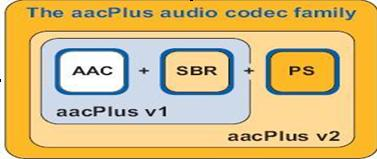
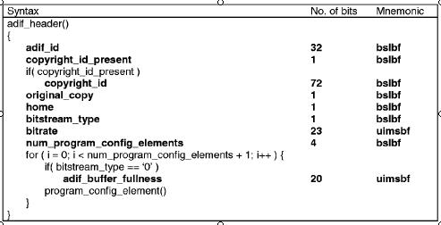
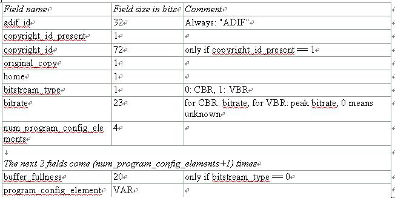
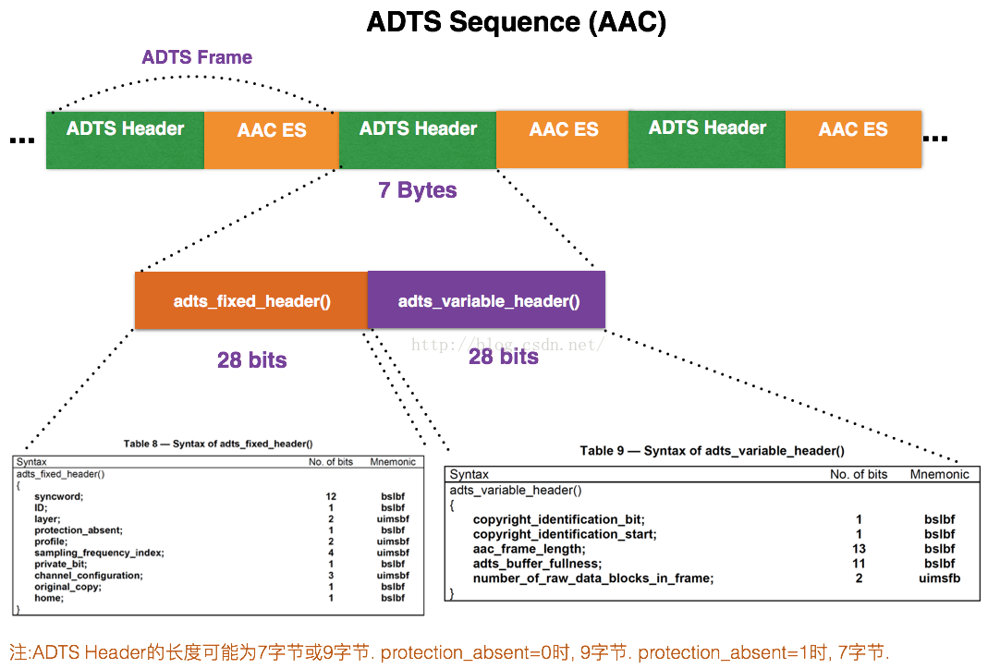
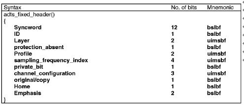
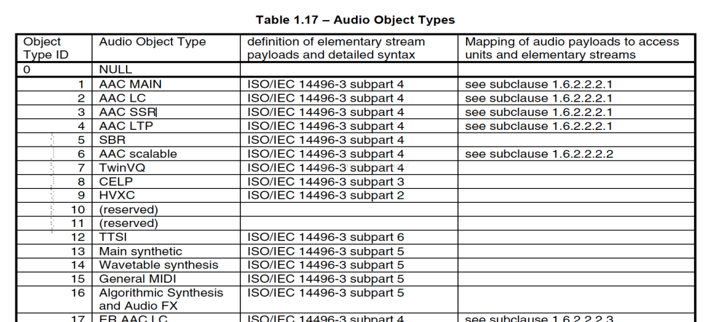
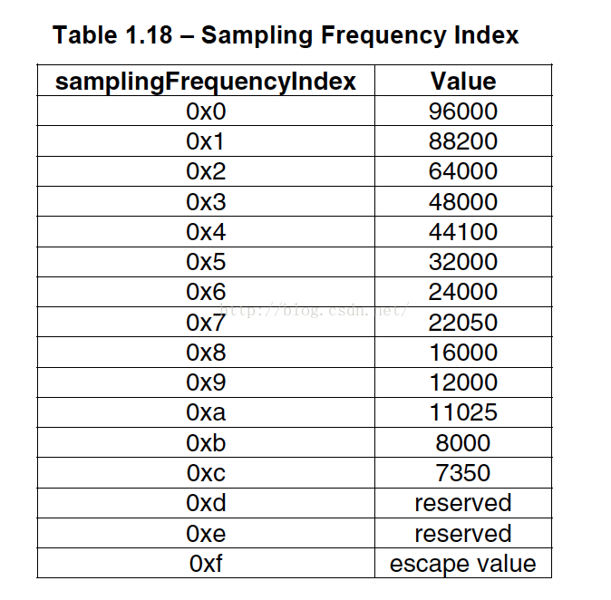
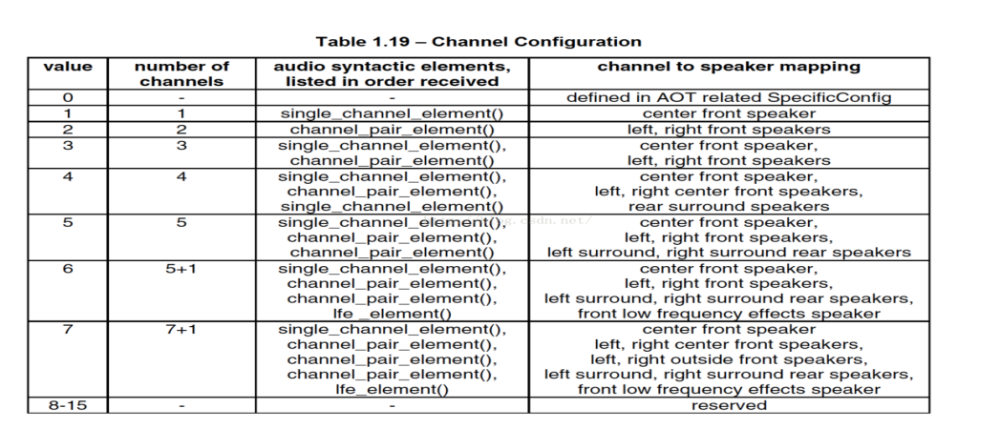
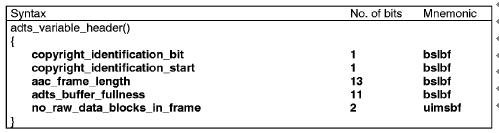
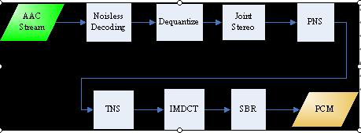

# 2.5AAC
- [5.1 概述](#5.1)
- [5.2 AAC 音频格式](#5.2)
- [5.3 AAC音频文件格式](#5.3)
- [5.4 AAC 与 MP3比较](#5.4)

## <a id="5.1">5.1 概述</a>
DTS：全称为Digital TheaterSystems(数字影院系统)，是一种有损多声道家庭影院音频格式，但它用了很高的码率进行编码，通常为768-1536kbps，能够营造出比AC3更好的影院效果。两者都是基于多声道的编码技术，通用5.1声道（三组全频立体声）--左/右前置，中置/低音，左/右后置环绕。其中低音单元专门重放120HZ以下的低频，以增强效果。DTS的数据流量通常为768/1536Kbps,压缩比只有3：1，其从提高数字空间的利用率着手，使信息数据得以充分利用。理论上它的声场无论在真实性、细腻性、连续性、宽广性和层次性方面优于AC3。 

AC3, 全称为Audio Coding version 3，是Dolby实验室所发展的有损音频编码格式。AC3最被广泛应用于5.1声道，是Dolby Pro Logic的继承者，不同的地方在于AC3提供6个独立的声道而Pro Logic混合其环绕声道。AC3普及度很高，以384-448 kbps的码率应用于LaserDisc和DVD，也经常以640 kbps的码率广泛用在电影院。AC3通常为384/448Kbps,采用了高压缩编码（12：1），通过大副删除在理论上认为多余的细节信号，从而达到减少数据量的目的。实际上AC3的编码技术相当优秀，在如此低的数据流量下带给观众的依然是较为真实的声音体验。  

M4A：.M4A 是MPEG4音频标准的文件的扩展名。在MPEG4标准中提到，普通的MPEG4文件扩展名是.mp4。自从Apple开始在它的iTunes以及 iPod中使用m4a以区别MPEG4的视频和音频文件以来，.m4a这个扩展名变得流行了。目前，几乎所有支持MPEG4音频的软件都支持.m4a。最常用的.m4a文件是使用AAC编码格式的（文件），不过其他的格式，比如Apple Lossless甚至mp3也可以被放在.m4a容器里。可以安全的把只包含音频的.mp4 文件的扩展名改成.m4a，以便让它能在你喜欢的播放器里播放，反之亦然。  

M4B：M4B格式是一种可以在iPod/iPhone及iPad上播放的称为“有声读物”的音频文件格式。主要优点：M4B有声读物是一种为“音频书籍”专门设计的格式。支持书签是它的主要优点。它允许书在任何时候暂停和恢复播放，恢复播放时，音频将从暂停的点开始。这一特点显然是非常重要的，因为有声读物的时间可能长很多。因此，它更经常用于有声读物和podcasts（播客）。  

M4R：.M4R iPhone 手机的铃声格式  

M4V：.M4V 是一个标准视频文件格式，由苹果公司创造。此种格式为 iPod 、 iPhone 和 PlayStation Portable 所使用，同时此格式基于 MPEG-4 编码第二版。M4V是一种应用于网络视频点播网站和移动手持设备的视频格式，是MP4格式的一种特殊类型，其后缀常为.MP4或.M4V，其视频编码采用H264或H264/AVC，音频编码采用AAC。采用H264高清编码，相比于传统On2 VP6、H263、Divx等，能够以更小的体积实现更高的清晰度。  

## <a id="5.2">5.2 AAC 音频格式</a>
1.ADTS头解析  
https://blog.csdn.net/jay100500/article/details/52955232  

2.AAC文件格式解析   
https://blog.csdn.net/u013427969/article/details/53091594   

AAC是高级音频编码（Advanced Audio Coding）的缩写，出现于1997年，最初是基于MPEG-2的音频编码技术。由Fraunhofer IIS、Dolby Laboratories、AT&T、Sony等公司共同开发，目的是取代MP3格式。2000年，MPEG-4标准出台，AAC重新集成了其它技术（PS,SBR），为区别于传统的MPEG-2 AAC，故含有SBR或PS特性的AAC又称为MPEG-4 AAC。

AAC是新一代的音频有损压缩技术，它通过一些附加的编码技术（比如PS,SBR等），衍生出了LC-AAC,HE-AAC,HE-AACv2三种主要的编码，LC-AAC就是比较传统的AAC，相对而言，主要用于中高码率(>=80Kbps)，HE-AAC(相当于AAC+SBR)主要用于中低码(<=80Kbps)，而新近推出的HE-AACv2(相当于AAC+SBR+PS)主要用于低码率(<=48Kbps）,事实上大部分编码器设成<=48Kbps自动启用PS技术，而>48Kbps就不加PS,就相当于普通的HE-AAC。

ACC 的特点：提升的压缩率：可以以更小的档大小获得更高的音质；支持多声道：可提供最多48 个全音域声道；更高的分辨率：最高支持96KHz 的取样频率；提升的解碼效率：译码播放所占的资源更少。AAC 是个大家族，目前已经制定了如下的9 种规格，以适应不同场合的需要：  
MPEG-2 AAC LC 低复杂度规格（Low Complexity）--比较简单，没有增益控制，但提高了编码效率，在中等码率的编码效率以及音质方面，都能找到平衡点  
MPEG-2 AAC Main 主规格  
MPEG-2 AAC SSR 可变采样率规格（Scaleable Sample Rate）  
MPEG-4 AAC LC 低复杂度规格（Low Complexity）------现在的手机比较常见的MP4文件中的音频部份就包括了该规格音频文件  
MPEG-4 AAC Main 主规格 ------包含了除增益控制之外的全部功能，其音质最好  
MPEG-4 AAC SSR 可变采样率规格（Scaleable Sample Rate）  
MPEG-4 AAC LTP 长时期预测规格（Long Term Predicition）  
MPEG-4 AAC LD 低延迟规格（Low Delay）   
MPEG-4 AAC HE 高效率规格（High Efficiency）-----这种规格适合用于低码率编码  

目前使用最多的是LC和HE(适合低码率)。流行的Nero AAC编码程序只支持LC，HE，HEv2这三种规格，编码后的AAC音频，规格显示都是LC。HE其实就是AAC（LC）+SBR技术，HEv2就是AAC（LC）+SBR+PS技术；

HE：“High Efficiency”（高效性）。HE-AAC v1（又称AACPlusV1，SBR)，用容器的方法实现了AAC（LC）+SBR技术。SBR其实代表的是Spectral Band Replication(频段复制)。简要叙述一下，音乐的主要频谱集中在低频段，高频段幅度很小，但很重要，决定了音质。如果对整个频段编码，若是为了保护高频就会造成低频段编码过细以致文件巨大；若是保存了低频的主要成分而失去高频成分就会丧失音质。SBR把频谱切割开来，低频单独编码保存主要成分，高频单独放大编码保存音质，“统筹兼顾”了，在减少文件大小的情况下还保存了音质，完美的化解这一矛盾。

HEv2：用容器的方法包含了HE-AAC v1和PS技术。PS指“parametric stereo”（参数立体声）。原来的立体声文件文件大小是一个声道的两倍。但是两个声道的声音存在某种相似性，根据香农信息熵编码定理，相关性应该被去掉才能减小文件大小。所以PS技术存储了一个声道的全部信息，然后，花很少的字节用参数描述另一个声道和它不同的地方。

- （1）Main（主规格）包含了除增益控制（Gain Control）之外的全部功能，其音质最好。
- （2）低复杂度规格（Low Complexity）则使用比较简单的时域噪声修整（Temporal Noise Shaping，TNS）模块，也缺少了预测- （Predict ion）和增益控制（Gain Control）模块，以此降低复杂度，提高了编码效率。SSR（Scalable Sampling Rate，可变取样率规格）和LC 规格大体相似，但多了增益控制功能。
- （3）MPEG-4 AAC LTP（Long TermPrediction，长时期预测规格）、MPEG-4 AAC LD（Low Delay，低延迟规格）和MPEG－4 AAC HE（High Efficiency，高效率规格）都是用在低码率下编码，尤其是MPEG－4 AAC HE 规格由于高效率高音质（低码率下而言），再加上有Nero AAC 编码器的支持，所以被越来越多地应用到低码率编码种。事实上，Main 规格和LC 规格的音质相差并不大，但是编码效率却相差明显，所以目前使用地最多的当数LC 规格。无怪乎很多编码器甚至只支持LC 规格了！
和MP3 一样，炙手可热的AAC 格式也催生了大量的编码器。包括商业性质的和完全免费的，技术保密的和源码开放的，对消费者提供的和对开发者提供的，各种各样的编码器都有。其中主要的编码器有：（1）FhG：Fraunhofer IIS 研发的权威编码器，拥有很好的音质，可惜现在不对外提供了！
- （2）Nero AAC：可能是目前最完美的AAC 编码器了，同时支持LCAAC 和HE AAC 规格。这个编码器是商业性质的，随着包含了Nero Digital 的Nero 6 一起发布，可能很多有刻录机的计算机里已经安装了该软件。Nero AAC 编码器提供了质量最好的VBR LC AAC 格式，同时HE AAC 规格保证了它在低码率下也有不俗的表现。此外，这个编码器还支持多声道编码！
- （3）QuickTime／iTune：苹果公司的两款多媒体软件都提供了AAC 编码功能，其编码技术来自杜比实验室（Dolby Laboratories）。起初，它们的编码器功能比较简单，只支持双声道的CBR 模式LC AAC 格式，不过最近苹果刚刚在QuickTime Pro 版中提供了VBR 编码。本文后面将介绍的iTune 尽管还不具备VBR 模式编码，但是它却是目前音质最好的中码率编码器！
- （4）FAAC：最好的命令行编码器，只支持LC 规格。其表现中规中矩，最近几个月新版本的发布将其音质提升了一个台阶。这个免费的编码器已经完全能和商业性质的编码器相媲美了，是搭配EAC 的不二选择。
- （5）Psytel：这是最早期的命令行编码器，曾经很是风光，其音质在以前是最好的，就是编码速度很慢。可惜的是其作者现在为Nero 工作了，这个编码器也从此停止了更新。因为有相似的FAAC，所以不建议使用它。
- （6）CodingTechnologies：该公司的AAC 编码技术已经被Real 公司加入到他们的产品中了。最新的RealProducer 10 和RealPlayer 10 都包含了这个AAC 编码器。
- （7）HHI／zPlane （Compaact！）：Compaact！是一款新出的AAC 编码器，和Nero 一样，也是商业性质的。它的特性相当诱人，支持LC 和Main 规格，支持CBR 和VBR 模式，支持多声道高取样率（24bi t／96KHz），还支持命令行操作！
- （8）Dolby AAC：杜比公司的AAC 编码器，因为着重在网络广播，所以低码率下优势明显。据称它编码的48kbps 立体声音质比其它AAC 编码器好20％，甚至64kbps 的Dolby AAC 可媲美128kbps 的MP3！
前使用最多的是LC和HE(适合低码率)。流行的Nero AAC编码程序只支持LC，HE，HEv2这三种规格，编码后的AAC音频，规格显示都是LC。HE其实就是AAC（LC）+SBR技术，HEv2就是AAC（LC）+SBR+PS技术；
AAC原始码流（又称为“裸流”）是由一个一个的ADTS frame组成的。其中每个ADTS frame之间通过syncword（同步字）进行分隔。同步字为0xFFF（二进制“111111111111”）。AAC码流解析的步骤就是首先从码流中搜索0x0FFF，分离出ADTS frame；然后再分析ADTS frame的首部各个字段。  
AAC能够在一条音轨中包括48条全带宽（直到96khz）音频声道，加上15条低频增强（LFE，限制到120Hz）声道，直到15条数据流并且更多。杜比也参与了AAC的开发，MPEG规格的一部分，及考虑继承MP3。AAC能输出AC-3的任何码率，胜过AC-3，压缩率更高，但技术上更加复杂。AAC在5.1声道中以400 Kbps和双声道中以180 Kbps输出，就已经能提供良好的聆听效果。  

## <a id="5.3">5.3AAC音频文件格式</a>
### 5.3.1 ADIF ＆ ADTS
AAC的音频文件格式有ADIF ＆ ADTS：  
ADIF：Audio Data Interchange Format 音频数据交换格式。这种格式的特征是可以确定的找到这个音频数据的开始，不需进行在音频数据流中间开始的解码，即它的解码必须在明确定义的开始处进行。故这种格式常用在磁盘文件中。  

ADTS：Audio Data Transport Stream 音频数据传输流。这种格式的特征是它是一个有同步字的比特流，解码可以在这个流中任何位置开始。它的特征类似于mp3数据流格式。  

简单说，ADTS可以在任意帧解码，也就是说它每一帧都有头信息。ADIF只有一个统一的头，所以必须得到所有的数据后解码。且这两种的header的格式也是不同的，目前一般编码后的和抽取出的都是ADTS格式的音频流。   

### 5.3.2 ADIF 
AC的ADIF格式见下图：  

ADIF 的头信息：  

ADIF头信息位于AAC文件的起始处，接下来就是连续的 raw data blocks。  
组成ADIF头信息的各个域如下所示：  

### 5.3.3 ADTS  
ADTS格式如下：  

AAC的ADTS的一般格式见下图：  

图中表示出了ADTS一帧的简明结构，其两边的空白矩形表示一帧前后的数据。  
ADTS 的固定头信息：  

syncword ：总是0xFFF, 代表一个ADTS帧的开始, 用于同步.解码器可通过0xFFF确定每个ADTS的开始位置.因为它的存在，解码可以在这个流中任何位置开始, 即可以在任意帧解码。   
ID：MPEG Version: 0 for MPEG-4，1 for MPEG-2    
Layer：always: '00'.protection_absent：Warning, set to 1 if there is no CRC and 0 if there is CRC   
profile：表示使用哪个级别的AAC，如01 Low Complexity(LC) -- AAC LCprofile的值等于 Audio Object Type的值减1.profile = MPEG-4 Audio Object Type - 1   

sampling_frequency_index：采样率的下标  

channel_configuration：声道数，比如2表示立体声双声道   
 

ADTS的可变头信息：  
 

aac_frame_length：一个ADTS帧的长度包括ADTS头和AAC原始流。frame length, this value must include 7 or 9 bytes of header length:  
aac_frame_length = (protection_absent == 1 ? 7 : 9) + size(AACFrame)  
protection_absent=0时, header length=9bytes  
protection_absent=1时, header length=7bytes  
adts_buffer_fullness：0x7FF 说明是码率可变的码流。  
number_of_raw_data_blocks_in_frame：表示ADTS帧中有number_of_raw_data_blocks_in_frame + 1个AAC原始帧。所以说number_of_raw_data_blocks_in_frame == 0 表示说ADTS帧中有一个AAC数据块。  
(一个AAC原始帧包含一段时间内1024个采样及相关数据)  

（1）帧同步目的在于找出帧头在比特流中的位置，13818-7规定，aac ADTS格式的帧头同步字为12比特的“1111 1111 1111”.  
（2）ADTS的头信息为两部分组成，其一为固定头信息，紧接着是可变头信息。固定头信息中的数据每一帧都相同，而可变头信息则在帧与帧之间可变。  

AAC文件处理流程:  
- (1)判断文件格式，确定为ADIF或ADTS  
- (2)若为ADIF，解ADIF头信息，跳至第6步。  
- (3)若为ADTS，寻找同步头。   
- (4)解ADTS帧头信息。  
- (5)若有错误检测，进行错误检测。  
- (6)解块信息。  
- (7)解元素信息。  
AAC解码流程图:  

   

在主控模块开始运行后，主控模块将AAC比特流的一部分放入输入缓冲区，通过查找同步字得到一帧的起始，找到后，根据ISO/IEC 13818-7所述的语法开始进行Noisless Decoding(无噪解码)，无噪解码实际上就是哈夫曼解码，通过反量化(Dequantize)、联合立体声（JointStereo），知觉噪声替换（PNS）,瞬时噪声整形（TNS），反离散余弦变换（IMDCT），频段复制（SBR）这几个模块之后，得出左右声道的PCM码流，再由主控模块将其放入输出缓冲区输出到声音播放设备。  

## <a id="5.4">5.4 AAC 与 MP3比较</a>
作为一种高压缩比的音频压缩算法，远胜MP3；在音质方面，由于采用多声道，和使用低复杂性的描述方式，使其比几乎所有的传统编码方式在同规格的情况下更胜一筹。一般来说，AAC可以在对比MP3文件缩小30%的前题下提供更好的音质。AAC是目前唯一一个，能够在所有的EBU试听测试项目的获得“优秀”的网络广播格式。  
AAC与MP3规格对比  
比特率：AAC – 最高超过400kbps /MP3 – 32~320kbps  
采样率：AAC – 最高96kHz / MP3– 最高48kHz  
声道数：AAC – （5.1）六声道 / MP3 – 两声道  
采样精度：AAC – 最高32bit / MP3– 最高16bit  
AAC格式扩展名  
.AAC – 基于MPEG-2的音频编码技术，属于传统的AAC编码。  
.MP4 – 基于MPEG-4的音频编码技术。  
.M4A – 苹果(Apple)公司对纯音频MP4文件采用的扩展名，本质和音频MP4相同。（包含视频的MP4文件为”.M4V”）  

## links
  * [目录](<音视频入门到精通目录.md>)
  * 下一节: [2.6AVI封装格式](<2.6AVI封装格式.md>)