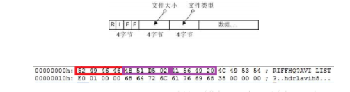
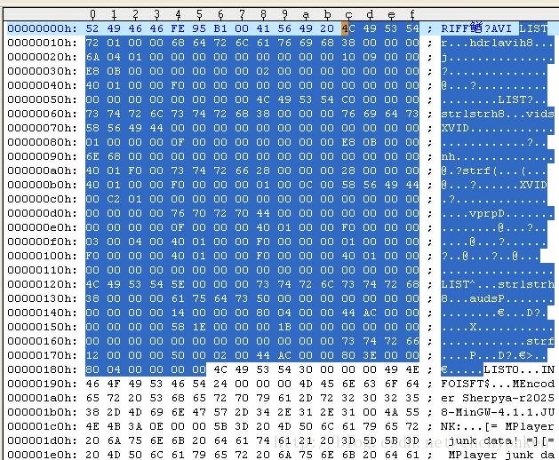
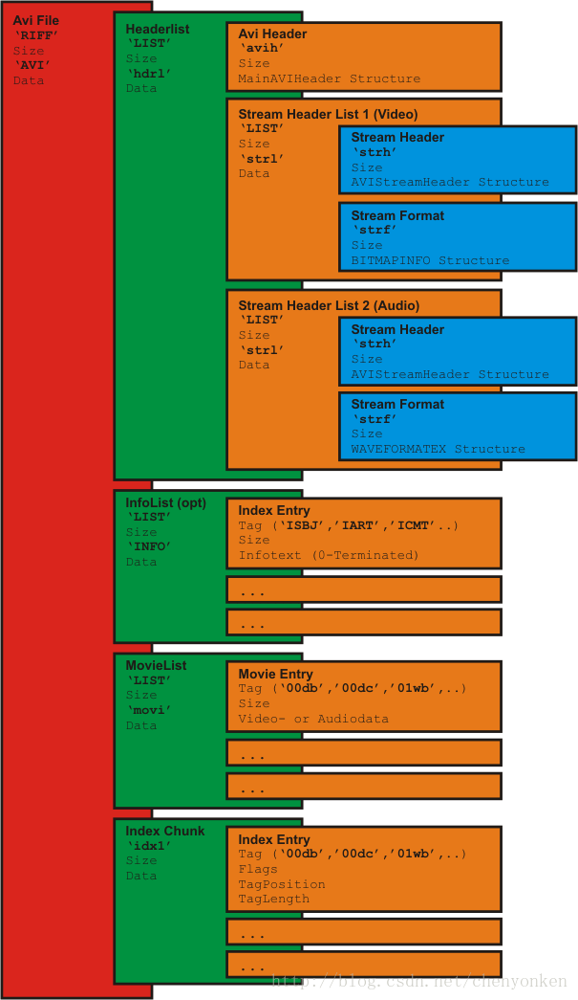
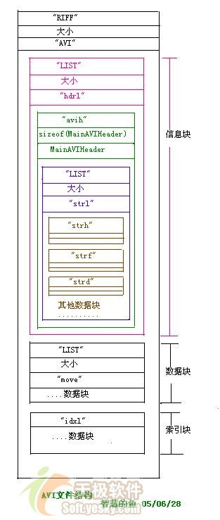

# 2.6AVI封装格式
- [6.1 AVI概述](#6.1)
- [6.2 AVI Layout(AVI文件层次划分)](#6.2)

1.AVI文件格式详解  
https://blog.csdn.net/chenyonken/article/details/79174500  

2.avi文件格式解析  
https://blog.csdn.net/occupy8/article/details/40678471  

## <a id="6.1">6.1 AVI概述</a>
AVI是音频视频交错（Audio Video Interleaved）的英文缩写，它是Microsoft公司开发的一种符合RIFF文件规范的数字音频与视频文件格式。AVI格式允许视频和音频交错在一起同步播放，支持256色和RLE压缩，但AVI文件并未限定压缩标准，因此，AVI文件格式只是作为控制界面上的标准，不具有兼容性，用不同压缩算法生成的AVI文件，必须使用相应的解压缩算法才能播放出来。  
在介绍AVI文件前，我们要先来看看RIFF文件结构。AVI文件采用的是RIFF文件结构方式，RIFF(Resource Interchange File Format,资源互换文件格式)是微软公司定义的一种用户管理Windows环境中多媒体数据的文件格式，波形音频wave,MIDI和数字视频AVI都采用这种格式存储。RIFF文件的实际数据中，使用了列表（List）和块（Chunk）的形式来组织。列表可以嵌套列表和块。整个RIFF文件可以看成一个数据库，其数据块ID为RIFF ，称为RIFF块。一个RIFF文件中只允许存在一个RIFF块。RIFF块中包含一系列的子块，其中有一种子块的ID为“List”，称为LIST块，LIST块中可以再包含一系列的子块，但除了LIST块外的其他所有的子块都不能再包含子块。 RIFF和LIST块分别比普通的数据块多了一个被称为形式类型（Form Type）或者列表类型（List Type）的数据域。  
整体就是RIFF-len-”avi”-LIST-len-”hdrl”-avih-strlaud-strh-strfh264-strl-strh-strf
RIFF块（RIFF结构）
“RIFF”表示字符串（Chunk ID）  
RIFF文件大小（数据块的大小）  
形式类型或者列表类型“AVI”,”WAVE” …….   


RIFF文件大小=实际数据长度+4（形式类型或者列表类型的大小）。 也就是说RIFF文件大小不包括“RIFF”域和“文件大小”域本身的大小（共8个字节），如文件大小域数据为28 69 6B 00,则实际为0x006b6928，转换为十进制为7039272，实际在Windows系统下看到的文件大小为7039280，即换算成实际大小时要加上8。可能文件大小值是低字节在前。  
LIST块（LIST结构）  
“LIST”表示字符串（Chunk ID）  
LIST块大小  
形式类型或者列表类型  
LIST实际数据  


LIST块大小域=实际的列表数据+4（形式类型或者列表类型域的大小）也就是说listSize值不包括“LIST”域和listSize域本身的大小。如该位置数据为5E 00 00 00 ,即0x0000005E，转换成十进制为94，实际总长为102bytes,即换算成列表总长度是要加上8。但是有一点要特别注意的是，当前List具体包括到哪里，可能会有List嵌套。如截图中，选中的部分为一个hdrl的List；其中包含两个strl的List，一个音频，一个视频；每个strl List又包含一个strh和一个strf。  
Chunk块（Chunk结构，普通块）  
Chunk ID——表示块类型的四字符码  
Chunk 块大小——记录了整个块的大小  
Chunk数据  
Chunk块大小=实际的块数据长度，而不包括ckID域和ckSize域本身的大小  


从00000000-000007F3为一个WindowsAVI文件的信息区部分：   
它是文件的第一个LIST块。在它的内部记录着整个文件的系统构成，如告诉播放软件“我是一个AVI文件”，“在我体内有几个数据流”，“每个数据流包含着什么数据——图像，声音或其他”，“如果是图像数据流，那么它的大小，颜色，压缩方式，播放速度等等是怎样规定的”，“如果是声音数据流，那么它的压缩方式，播放效果等等又将有何规定”……在这些信息区中还有多个附属的LIST块，也就是前面提到的“子块”，它们用来记录每个数据流的全部信息。而这些附属LIST块与数据流之间保持着一一对应的关系，即第一个附属LIST块对应与00号数据流；第二个附属LIST块对应01号数据流……要想解释数据流，我们必须先了解AVI文件中数据块是什么。在AVI文件中，数据块是被放置在数据区中的一个有起始标识（由“数据流识别码”和“数据块存储方式识别码”组成，请参见对数据区部分的说明），并指明大小和数据内容的数据段，那么，数据流就是那些相互之间具有练习的同种数据类型的数据块集合。  
```Go
00000000-00000003、多媒体文件识别码：RIFF 
00000004-00000007、文件大小（10EDICH字节）——8字节 
00000008-0000000B、AVI文件识别码 
0000000C-0000000F、第一个LIST块识别码 
00000010-00000013、第一个LIST块的大小（168H字节） 
00000014-00000017、hdrl部分识别码，代表后面的数据记录着此文件的格式 
00000018-0000001B、hdrl部分所包含的avih块识别码，此模块记录着本文件的初始化信息 
0000001C-0000001F、avi块大小（38H字节） 
00000020-00000023、每帧画面显示所维持多少个百万分之一秒，本例为1046h，即6667百万分之一秒约0.07秒。所以在播放此文件时，你看到的画面约每秒15帧
```
## <a id="6.2">6.2AVI Layout(AVI文件层次划分)</a>
AVI Layout(AVI文件层次划分)  


- 1. 信息块——包括文件的通用信息，定义数据格式，所用的压缩算法等参数 
- 2. 数据块——包含实际数据流，即图像和声音序列数据。这是文件的主体，也是决定文件容量的主要部分。视频文件的大小等于该文件的数据率乘以该视频播放的时间长度 
- 3. 索引块——索引块包含数据块列表好它们在文件中的位置，以提供文件内数据随机存取能力。

### 6.2.1 信息块
AVI文件时目前使用的最复杂的RIFF文件，他能同时存储同步表现的音频视频数据。AVI的RIFF块的形式类型是AVI，它包含3个子块，如下所述。  
- 一.信息块：ID为“hdrl”的LIST块，定义AVI文件的数据格式 “hdrl”LIST块包含两个子块，一个是ID为“avih”的子块和一个是ID为”strl”的LIST块。  
“avih”块结构：用于记录AVI文件的全局信息，比如流的数量，视频图像的宽和高等：  
```Go
typedef struct
{
 DWORD ChunID;                // 必须为'avih'
 DWORD ChunkSize;             //本数据结构的大小，不包括最初的8個位元組（ID和Size兩個域）
 DWORD dwMicroSecPerFrame ;   //显示每帧所需的时间ns，定义avi的显示速率
 DWORD dwMaxBytesPerSec;      //最大的数据传输率
 DWORD dwPaddingGranularity;  //记录块的长度需为此值的倍数，通常是2048
 DWORD dwFlages;              //AVI文件的特殊属性，如是否包含索引块，音视频数据是否交叉存储
 DWORD dwTotalFrame;          //文件中的总帧数
 DWORD dwInitialFrames;       //说明在开始播放前需要多少桢
 DWORD dwStreams;             //文件中包含的数据流个数
 DWORD dwSuggestedBufferSize; //建议使用的缓冲区的大小，
                              //通常为存储一桢图像以及同步声音所需要的数据之和
 DWORD dwWidth;               //图像宽
 DWORD dwHeight;              //图像高
 DWORD dwReserved[4];         //保留值
}MainAVIHeader;
```
接着就是”avih”块的数据部分：一个或多个“strl”子列表 
1. 文件中有多少个流，这里就对应有多少个“strl”子列表）。 
2. 每个“strl”字列表至少包含一个“strh”块和一个“strf”块， 
3. “strd”块（保存编解码器需要的一些配置信息）和“strn”块（保存流的名字）是可选的。 
4. 注意：“strl”子列表出现的顺序与媒体流的编号是对应的，比如第一个“strl”字列表说明的是第一个流（Stream 0）,第二个“strl”字列表说明的是第二个流（Stream 1），以此类推。

“strh”块结构：用于说明这个“strl”LIST块对应的数据流的头信息：  
```Go
typedef struct 
{
　FOURCC fccType;       //4字节，表示数据流的种类，vids 表示视频数据流，auds 音频数据流
　FOURCC fccHandler;    //4字节 ，表示数据流解压缩的驱动程序代号
　DWORD dwFlags;        //数据流属性
　WORD wPriority;       //此数据流的播放优先级
　WORD wLanguage;       //音频的语言代号
　DWORD dwInitalFrames; //说明在开始播放前需要多少桢
　DWORD dwScale;        //数据量，视频每桢的大小或者音频的采样大小
　DWORD dwRate;         //dwScale /dwRate = 每秒的采样数
　DWORD dwStart;        //数据流开始播放的位置，以dwScale为单位
　DWORD dwLength;       //数据流的数据量，以dwScale为单位
　DWORD dwSuggestedBufferSize; //建议缓冲区的大小
　DWORD dwQuality;     //解压缩质量参数，值越大，质量越好
　DWORD dwSampleSize;  //音频的采样大小
　RECT rcFrame;        //视频图像所占的矩形
}AVIStreamHeader;
```
“strf” 块结构：“strf”子块紧跟在“strh”子块之后，其结构是“strh”子块的类型而定，如下所述：  
如果strh子块是视频数据流，则strf子块的内容是一个BITMAPINFO结构，如下。  
```Go
typedef struct tagBITMAPINFO
{
　BITMAPINFOHEADER bmiHeader;
　RGBQUAD bmiColors[1]; //颜色表
}BITMAPINFO;

typedef struct tagBITMAPINFOHEADER
{
　DWORD biSize;
　LONG biWidth;
　LONG biHeight;
　WORD biPlanes;
　WORD biBitCount;
　DWORD biCompression;
　DWORD biSizeImage;
　LONG biXPelsPerMeter;
　LONG biYPelsPerMeter;
　DWORD biClrUsed;
　DWORD biClrImportant;
}BITMAPINFOHEADER;
```
如果strh子块是音频数据流，则strf子块的内容是一个WAVEFORMAT结构，如下：  
```Go
typedef struct 
{
　WORD wFormatTag; 
　WORD nChannels;        //声道数
　DWORD nSamplesPerSec;  //采样率
　DWORD nAvgBytesPerSec; //WAVE声音中每秒的数据量
　WORD nBlockAlign;      //数据块的对齐标志
　WORD biSize;           //此结构的大小
}WAVEFORMAT
```
strd”块结构：“strd”子块紧跟在strf子块后，存储供压缩驱动程序使用的参数，不一定存在，也没有固定的结构。  
“strl”List块定义的AVI数据流依次将“hdrl”LIST块中的数据流头结构与“movi”LIST块中的数据联系在一起，第一个数据流头结构用于数据流0，第二个用于数据流1，依次类推。  

### 6.2.2 数据块
二. 数据块：ID为“movi”的LIST块，包含AVI的音视频序列数据   
用于保存真正的媒体流数据（视频图像帧数据或音频采样数据等）。保存方式为：   
1. 将数据块直接嵌套在“movi”列表里面 
2. 将几个数据块分组成一个“rec”列表后再编排进“movi”列表 

（注意：在读取AVI文件内容时，建议将一个“rec”列表中的所有数据块一次性读出）   
但是，当文件中包含有多个流的时候，数据块与数据块之间如何来区别呢？于是数据块使用了一个四字符吗来表征它的类型，这个四字符码由2个字节的类型吗和2个字节的流编号组成。  
“db”——非压缩视频  
“dc”——压缩视频  
“pc”——改用新的调色板  
“wb”——音缩视频  

比如:   
第一个流（Stream 0）是音频，则表征音频数据块的四字符码为“00wb”;   
第二个流（Steam 1）是视频，则表征视频数据块的四字符码为“01db”或“01dc”。   
对于视频数据来说，在AVI数据序列中间还可以定义一个新的调色板，每个改变的调色板数据块永“xxpc”来表征，新的调色板使用一个数据结构AVIPALCHANGE来定义。（注意：如果一个流的调色板中途改变，则应在这个流格式的描述中，也及时AVISTREMAHEADER结构的dwFlags中包含一个AVISF_VIDEO_PALCHANGES标记）另外，文字数据块可以使用随意的类型码表征。  

### 6.2.3 索引块
三. 索引块：ID为“idxl”的子块，定义“movi”LIST块的索引数据，是可选块。   
最后紧跟在“hdr”列表块和“movi”列表块之后的，就是AVI文件可选的索引块。这个索引块为AVI文件中每一个媒体数据块进行索引，并且记录它们在文件中的偏移（可能相对于“movi”列表，也可能相对于AVI文件开头）。索引块使用一个四字符码“idxl”来表征，索引信息使用一个数据结构AVIOLDINDEXl来定义。  
```Go
typedef struct _avioldindex {
  FOURCC fcc;                  // 必须为‘idx1’
  DWORD cb;                   // 本数据结构的大小，不包括最初的8个字节（fcc和cb两个域）
  struct _avioldindex_entry {
  DWORD dwChunkId;            // 表征本数据块的四字符码
  DWORD dwFlags;              // 说明本数据块是不是关键帧、是不是‘rec ’列表等信息
  DWORD dwOffset;             // 本数据块在文件中的偏移量
  DWORD dwSize;               // 本数据块的大小
  } aIndex[];                // 这是一个数组！为每个媒体数据块都定义一个索引信息
} AVIOLDINDEX;
```

注意：如果一个AVI文件包含有索引块，则应在AVI信息头的描述中，也及时AVIMAINHEADER结构的dwFlags中包含一个AVI_HASINDEX标记 
还有一种特殊的数据块，用一个四字符码“JUNK”来表征，它用于内部数据的对齐（填充），应用程序应该忽略这些数据块的实际意义。  

### 6.2.4 索引解释
假如要将avi文件分成头、中、尾的话，RRFT开始到movi段之间应该算是头，movi算是中间，index就算是尾部了。index其实就是movi中的内容的索引，作用是在拖动视频进度条时，能让解码器迅速定位到要找的视频帧。索引以“idx1”开头，后面跟着的是整个索引的大小，其基本结构是：  
```Go
struct AVI_index_entry{
     unsigned char dwChunkId[4];//表征本数据块的四字符码比如01db压缩视频 00wb音频
     DWORD dwFlags;//说明本数据块是不是关键帧、是不是‘rec’列表等信息
     DWORD dwOffset;//本数据块在文件中的偏移量
     DWORD dwSize;//本数据块的大小
};
```

idx1”就是索引的头  
```Go
30 5b 00 00是索引的大小  
大家看看实例的第二行，它们对应avi文件中的每一帧或者没一段音频：  
30 30 64 63（“00dc”）是数据结构中的dwChunkId，当该段数据时音频时取（“01wb")  
10 00 00 00 是dwFlags，关键帧取值为10 00 00 00，否则取值为00 00 00 00  
04 00 00 00 是dwOffset;//本数据块在文件中的偏移量  
BF 0E 00 00 是dwSize，对应帧的大小  
```
　　在最初合成avi视频的时候，我是没有添加index段的，视频一样可以播放。可是当你要拖动视频时，视频不会立刻跳到你所要的位置，而是加快播放速度，直到到达目标位置。  
目前遇到一个问题：当我将索引加进去avi以后，播放器需要有一个缓冲的过程，有点像用迅雷下载电影，可是没等电影下完，改过后缀就去播放的状况。问题解决以后再来补充吧。  
经过对avi视频的详细分析，发现音频视频的交叉有如下规律：  
```Go
15帧	vedio
1段		audio
15帧    vedio
1段     audio
16帧    vedio
1段     audio
15帧    vedio
1段     audio
15帧   vedio
1段    audio
16帧   vedio
1段    audio
```
 也就是基本上是每15段vedio就有一段的audio，可是每经过两个15段的vedio循环，就要有16段的vedio才能有一段audio。另外还有一个规律就是，每一段audio大小都是一定的4096字节。这是某个特定文件的交叉规律，个人认为音视频交叉的频率跟帧率和音频频率有关，只要是按一定的比率来交叉就行，例如上面按每30帧视频放一段音频，然后音频的长度变为8192应该可以，有空再试试。  


## links
  * [目录](<音视频入门到精通目录.md>)
  * 下一节: [2.7MP4封装格式](<2.7MP4封装格式.md>)