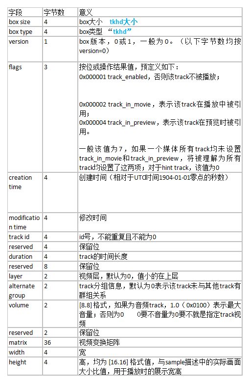

# 2.7MP4封装格式
- [7.1 MP4概述](#7.1)
- [7.2 MP4结构](#7.2)
- [7.3 MP4术语解释及知识补充](#7.3)
- [7.4 Mp4info工具各个参数介绍](#7.4)
- [7.5MP4中如何seek](#7.5)
- [7.6MP4中容器应用](#7.6)

## <a id="7.1">7.1 MP4概述</a>
最开始MP4指的是音频（MP3的升级版），即MPEG-2 AAC标准。随后MP4概念被转移到视频上，对应的是MPEG-4标准。而现在我们流行的叫法，多半是指能播放MPEG-4标准编码格式视频的播放器。但是这篇文章介绍的内容跟上面这些都无关，我们要讨论的是MP4文件封装格式，对应的标准为ISO/IEC 14496-12，即信息技术 视听对象编码的第12部分：ISO 基本媒体文件格式（Information technology Coding of audio-visual objects Part 12: ISO base media file format）。ISO/IEC组织指定的标准一般用数字表示，ISO/IEC 14496即MPEG-4标准。  

MP4视频文件封装格式是基于QuickTime容器格式定义的，因此参考QuickTime的格式定义对理解MP4文件格式很有帮助。MP4文件格式是一个十分开放的容器，几乎可以用来描述所有的媒体结构，MP4文件中的媒体描述与媒体数据是分开的，并且媒体数据的组织也很自由，不一定要按照时间顺序排列，甚至媒体数据可以直接引用其他文件。同时，MP4也支持流媒体。MP4目前被广泛用于封装h.264视频和AAC音频，是高清视频的代表。  

1.MP4文件格式  
https://www.cnblogs.com/ranson7zop/p/7889272.html  
2.MP4文件格式解析  
https://www.cnblogs.com/boonya/p/8572052.html  
3.mp4文件格式解析  
https://www.jianshu.com/p/529c3729f357  


7.2 MP4结构
## <a id="7.2">7.2 MP4结构</a>
MP4文件中的所有数据都装在box（QuickTime中为atom）中，也就是说MP4文件由若干个box组成，每个box有类型和长度，可以将box理解为一个数据对象块。box中可以包含另一个box，这种box称为container box。一个MP4文件首先会有且只有一个“ftyp”类型的box，作为MP4格式的标志并包含关于文件的一些信息；之后会有且只有一个“moov”类型的box（Movie Box），它是一种container box，子box包含了媒体的metadata信息；MP4文件的媒体数据包含在“mdat”类型的box（Midia Data Box）中，该类型的box也是container box，可以有多个，也可以没有（当媒体数据全部引用其他文件时），媒体数据的结构由metadata进行描述。  
下面是一些概念：  
track  表示一些sample的集合，对于媒体数据来说，track表示一个视频或音频序列。  
hint track  这个特殊的track并不包含媒体数据，而是包含了一些将其他数据track打包成流媒体的指示信息。  
sample  对于非hint track来说，video sample即为一帧视频，或一组连续视频帧，audio sample即为一段连续的压缩音频，它们统称sample。对于hint track，sample定义一个或多个流媒体包的格式。  
sample table  指明sampe时序和物理布局的表。  
chunk 一个track的几个sample组成的单元。  
在本文中，我们不讨论涉及hint的内容，只关注包含媒体数据的本地MP4文件。下图为一个典型的MP4文件的结构树。  


首先需要说明的是，box中的字节序为网络字节序，也就是大端字节序（Big-Endian），简单的说，就是一个32位的4字节整数存储方式为高位字节在内存的低端。Box由header和body组成，其中header统一指明box的大小和类型，body根据类型有不同的意义和格式。  
标准的box开头的4个字节（32位）为box size，该大小包括box header和box body整个box的大小，这样我们就可以在文件中定位各个box。如果size为1，则表示这个box的大小为large size，真正的size值要在largesize域上得到。（实际上只有“mdat”类型的box才有可能用到large size。）如果size为0，表示该box为文件的最后一个box，文件结尾即为该box结尾。（同样只存在于“mdat”类型的box中。）
size后面紧跟的32位为box type，一般是4个字符，如“ftyp”、“moov”等，这些box type都是已经预定义好的，分别表示固定的意义。如果是“uuid”，表示该box为用户扩展类型。如果box type是未定义的，应该将其忽略。  

- File Type Box（ftyp）：该box有且只有1个，并且只能被包含在文件层，而不能被其他box包含。该box应该被放在文件的最开始，指示该MP4文件应用的相关信息。“ftyp” body依次包括1个32位的major brand（4个字符），1个32位的minor version（整数）和1个以32位（4个字符）为单位元素的数组compatible brands。这些都是用来指示文件应用级别的信息。该box的字节实例如下：  


- Movie Box（moov）：该box包含了文件媒体的metadata信息，“moov”是一个container box，具体内容信息由子box诠释。同File Type Box一样，该box有且只有一个，且只被包含在文件层。一般情况下，“moov”会紧随“ftyp”出现。一般情况下（限于篇幅，本文只讲解常见的MP4文件结构），“moov”中会包含1个“mvhd”和若干个“trak”。其中“mvhd”为header box，一般作为“moov”的第一个子box出现（对于其他container box来说，header box都应作为首个子box出现）。“trak”包含了一个track的相关信息，是一个container box。下图为部分“moov”的字节实例，其中红色部分为box header，绿色为“mvhd”，黄色为一部分“trak”。  


- Movie Header Box（mvhd）：“mvhd”结构如下表。  


“mvhd”的字节实例如下图，各字段已经用颜色区分开：  


- Track Box（trak）：“trak”也是一个container box，其子box包含了该track的媒体数据引用和描述（hint track除外）。一个MP4文件中的媒体可以包含多个track，且至少有一个track，这些track之间彼此独立，有自己的时间和空间信息。“trak”必须包含一个“tkhd”和一个“mdia”，此外还有很多可选的box（略）。其中“tkhd”为track header box，“mdia”为media box，该box是一个包含一些track媒体数据信息box的container box。 “trak”的部分字节实例如下图，其中黄色为“trak”box的头，绿色为“tkhd”，蓝色为“edts”（一个可选box），红色为一部分“mdia”。  


- Track Header Box（tkhd）：“tkhd”结构如下表。 



“tkhd”的字节实例如下图，各字段已经用颜色区分开：  


- Media Box（mdia）： “mdia”也是个container box，其子box的结构和种类还是比较复杂的。先来看一个“mdia”的实例结构树图。  


总体来说，“mdia”定义了track媒体类型以及sample数据，描述sample信息。一般“mdia”包含一个“mdhd”，一个“hdlr”和一个“minf”，其中“mdhd”为media header box，“hdlr”为handler reference box，“minf”为media information box。下面依次看一下这几个box的结构。  

- Media Header Box（mdhd）：“mdhd”结构如下表。  


“mdhd”的字节实例如下图，各字段已经用颜色区分开：


- Handler Reference Box（hdlr）：“hdlr”解释了媒体的播放过程信息，该box也可以被包含在meta box（meta）中。“hdlr”结构如下表。  
```Go
字段	字节数	意义
box size	4	box大小
box type	4	box类型
version	1	box版本，0或1，一般为0。（以下字节数均按version=0）
flags	3	 
pre-defined	4	 
handler type	4	在media box中，该值为4个字符：
“vide”— video track
“soun”— audio track
“hint”— hint track
reserved	12	 
name	不定	track type name，以‘\0’结尾的字符串
```

“hdlr”的字节实例如下图，各字段已经用颜色区分开：  


- Media Information Box（minf）：“minf”存储了解释track媒体数据的handler-specific信息，media handler用这些信息将媒体时间映射到媒体数据并进行处理。“minf”中的信息格式和内容与媒体类型以及解释媒体数据的media handler密切相关，其他media handler不知道如何解释这些信息。“minf”是一个container box，其实际内容由子box说明。一般情况下，“minf”包含一个header box，一个“dinf”和一个“stbl”，其中，header box根据track type（即media handler type）分为“vmhd”、“smhd”、“hmhd”和“nmhd”，“dinf”为data information box，“stbl”为sample table box。下面分别介绍。下图为“minf”部分字节实例，其中红色为box header，蓝色为“smhd”，绿色为“dinf”，黄色为一部分“stbl”。  


- Media Information Header Box（vmhd、smhd、hmhd、nmhd）  
- Video Media Header Box（vmhd）   
```Go
字段	字节数	意义
box size	4	box大小
box type	4	box类型
version	    1	box版本，0或1，一般为0。（以下字节数均按version=0）
flags	    3	 
graphics mode	4	视频合成模式，为0时拷贝原始图像，否则与opcolor进行合成
opcolor	   2×3	｛red，green，blue｝
```

- Video Media Header Box（vmhd）   

```Go
字段	字节数	意义
box size	4	box大小
box type	4	box类型
version	1	box版本，0或1，一般为0。（以下字节数均按version=0）
flags	3	 
balance	2	立体声平衡，[8.8] 格式值，一般为0，-1.0表示全部左声道，1.0表示全部右声道
reserved	2	 
```

- Hint Media Header Box（hmhd）  
    略  
- Null Media Header Box（nmhd）  
非视音频媒体使用该box，略。  

- Data Information Box（dinf）：“dinf”解释如何定位媒体信息，是一个container box。“dinf”一般包含一个“dref”，即data reference box；“dref”下会包含若干个“url”或“urn”，这些box组成一个表，用来定位track数据。简单的说，track可以被分成若干段，每一段都可以根据“url”或“urn”指向的地址来获取数据，sample描述中会用这些片段的序号将这些片段组成一个完整的track。一般情况下，当数据被完全包含在文件中时，“url”或“urn”中的定位字符串是空的。
“dref”的字节结构如下表。 

```Go
字段	字节数	意义
box size	4	box大小
box type	4	box类型
version	1	box版本，0或1，一般为0。（以下字节数均按version=0）
flags	3	 
entry count	4	“url”或“urn”表的元素个数
“url”或“urn”列表	不定	 
```

“url”或“urn”都是box，“url”的内容为字符串（location string），“urn”的内容为一对字符串（name string and location string）。当“url”或“urn”的box flag为1时，字符串均为空。  
下面是一个“dinf”的字节实例图。其中黄色为“dinf”的box header，由红色部分我们知道包含的“url”或“urn”个数为1，红色后面为“url”box的内容。紫色为“url”的box header（根据box type我们知道是个“url”），绿色为box flag，值为1，说明“url”中的字符串为空，表示track数据已包含在文件中。  


- Sample Table Box（stbl）：  “stbl”几乎是普通的MP4文件中最复杂的一个box了，首先需要回忆一下sample的概念。sample是媒体数据存储的单位，存储在media的chunk中，chunk和sample的长度均可互不相同，如下图所示。


“stbl”包含了关于track中sample所有时间和位置的信息，以及sample的编解码等信息。利用这个表，可以解释sample的时序、类型、大小以及在各自存储容器中的位置。“stbl”是一个container box，其子box包括：sample description box（stsd）、time to sample box（stts）、sample size box（stsz或stz2）、sample to chunk box（stsc）、chunk offset box（stco或co64）、composition time to sample box（ctts）、sync sample box（stss）等。  
“stsd”必不可少，且至少包含一个条目，该box包含了data reference box进行sample数据检索的信息。没有“stsd”就无法计算media sample的存储位置。“stsd”包含了编码的信息，其存储的信息随媒体类型不同而不同。  

- Sample Description Box（stsd）
box header和version字段后会有一个entry count字段，根据entry的个数，每个entry会有type信息，如“vide”、“sund”等，根据type不同sample description会提供不同的信息，例如对于video track，会有“VisualSampleEntry”类型信息，对于audio track会有“AudioSampleEntry”类型信息。视频的编码类型、宽高、长度，音频的声道、采样等信息都会出现在这个box中。


- Time To Sample Box（stts）
“stts”存储了sample的duration，描述了sample时序的映射方法，我们通过它可以找到任何时间的sample。“stts”可以包含一个压缩的表来映射时间和sample序号，用其他的表来提供每个sample的长度和指针。表中每个条目提供了在同一个时间偏移量里面连续的sample序号，以及samples的偏移量。递增这些偏移量，就可以建立一个完整的time to sample表。


- Sample Size Box（stsz）
“stsz” 定义了每个sample的大小，包含了媒体中全部sample的数目和一张给出每个sample大小的表。这个box相对来说体积是比较大的。四个字节其实就是每一帧得大小。  


- Sample To Chunk Box（stsc）
用chunk组织sample可以方便优化数据获取，一个thunk包含一个或多个sample。“stsc”中用一个表描述了sample与chunk的映射关系，查看这张表就可以找到包含指定sample的thunk，从而找到这个sample。  


- Sync Sample Box（stss）
“stss”确定media中的关键帧。对于压缩媒体数据，关键帧是一系列压缩序列的开始帧，其解压缩时不依赖以前的帧，而后续帧的解压缩将依赖于这个关键帧。“stss”可以非常紧凑的标记媒体内的随机存取点，它包含一个sample序号表，表内的每一项严格按照sample的序号排列，说明了媒体中的哪一个sample是关键帧。如果此表不存在，说明每一个sample都是一个关键帧，是一个随机存取点。四个字节其实和fps值也有关系。


- Chunk Offset Box（stco）
“stco”定义了每个thunk在媒体流中的位置。位置有两种可能，32位的和64位的，后者对非常大的电影很有用。在一个表中只会有一种可能，这个位置是在整个文件中的，而不是在任何box中的，这样做就可以直接在文件中找到媒体数据，而不用解释box。需要注意的是一旦前面的box有了任何改变，这张表都要重新建立，因为位置信息已经改变了。  


><font color=red>主要归纳为：co64指定每个chunk在媒体流中的位置。Mdata数据即为数据，占绝大空间。Stsc指定chunk中包含多少sample。Stsz指定每个sample得大小。Stss指定关键帧sample得位置即fps值。Stts即dts-sample映射。</font>


><font color=red>ftyp：表明文件类型。
mdat：具体的媒体数据。
moov box：包含一系列的子box， 通过解析这些子box，获得编码信息、数据信息等。</font>

- Free Space Box（free或skip）：“free”中的内容是无关紧要的，可以被忽略。该box被删除后，不会对播放产生任何影响。
- Meida Data Box（mdat）：该box包含于文件层，可以有多个，也可以没有（当媒体数据全部为外部文件引用时），用来存储媒体数据。数据直接跟在box type字段后面，具体数据结构的意义需要参考metadata（主要在sample table中描述）。普通MP4文件的结构就讲完了，可能会比较乱，下面这张图是常见的box的树结构图，可以用来大致了解MP4文件的构造。


### mp4文件stbl解析
参考链接：  
https://www.jianshu.com/p/529c3729f357  

```js
mp4文件基本信息
audio信息：
smplrate：sample rate(采样率)。
channel：通道个数。
bitrate：比特率。
audiosamplenum：音频sample的个数。

video信息：
width、height：视频的宽/高。
bitrate：比特率(码率)，秒为单位。等于视频总的大小/时长。
frames：视频帧数。
fps：帧率(frame per second)。
total_time：时间长度，ms为单位。等于duration/timescale。
timescale：时间的粒度，1000表示1000个单位为1s。
duration：时间粒度的个数。
videosamplenum：视频sample的个数。
```
#### Sample Table Box（stbl）
“stbl”是mp4文件中最复杂的一个box了，也是解开mp4文件格式的主干。  
stbl ：sample table是一个container box。   
其子box包括：  
stsd：sample description box，样本的描述信息。   
stts：time to sample box，sample解码时间的压缩表。  
ctts：composition time to sample box，sample的CTS与DTS的时间差的压缩表。  
stss：sync sample box，针对视频，关键帧的序号。  
stsz/stz2：sample size box，每个sample的字节大小。  
stsc：sample to chunk box，sample-chunk映射表。  
stco/co64：chunk offset box，chunk在文件中的偏移。  

#### Sample Description Box（stsd）
存储了编码类型和初始化解码器需要的信息。
有与特定的track-type相关的信息，相同的track-type也会存在不同信息的情况如使用不一样的编码标准。
语法：
```java
class SampleDescriptionBox (unsigned int(32) handler_type)
    extends FullBox('stsd', 0, 0){
        int i ;
        unsigned int(32) entry_count;
        for (i = 1 ; i <= entry_count ; i++){
            switch (handler_type){
                case ‘soun’: // for audio tracks
                AudioSampleEntry();
                break;
                case ‘vide’: // for video tracks
                VisualSampleEntry();
                break;
                case ‘hint’: // Hint track
                HintSampleEntry();
                break;
                case ‘meta’: // Metadata track
                MetadataSampleEntry();
                break;
            }
        }
    }
}
```
主要字段说明：   
entry count：entry的个数。   
handler_type：类型信息如“vide”、“soud”等，不同类型会提供不同的信息。  
对于audio track，使用“AudioSampleEntry”类型信息。  
```java
abstract class SampleEntry (unsigned int(32) format)
    extends Box(format){
    const unsigned int(8)[6] reserved = 0;
    unsigned int(16) data_reference_index;
}

class AudioSampleEntry(codingname) extends SampleEntry (codingname){
    const unsigned int(32)[2] reserved = 0;
    template unsigned int(16) channelcount = 2;
    template unsigned int(16) samplesize = 16;
    unsigned int(16) pre_defined = 0;
    const unsigned int(16) reserved = 0 ;
    template unsigned int(32) samplerate = { default samplerate of media}<<16;
}

format：视频或者音频的编码格式。  
比如aac音频的format值为mp4a。  
AVC-1/H.264视频的format值为avc1。  
data_reference_index：利用这个索引可以检索与当前sample description关联的数据。数据引用存储在data reference box。  
channelcount：通道个数。  
samplesize：采样位数。默认是16比特。  
samplerate：采样率。[16.16]格式的数据。  
对于video track，使用“VisualSampleEntry”类型信息。

class VisualSampleEntry(codingname) extends SampleEntry (codingname){
    unsigned int(16) pre_defined = 0;
    const unsigned int(16) reserved = 0;
    unsigned int(32)[3] pre_defined = 0;
    unsigned int(16) width;
    unsigned int(16) height;
    template unsigned int(32) horizresolution = 0x00480000; // 72 dpi
    template unsigned int(32) vertresolution = 0x00480000; // 72 dpi
    const unsigned int(32) reserved = 0;
    template unsigned int(16) frame_count = 1;
    string[32] compressorname;
    template unsigned int(16) depth = 0x0018;
    int(16) pre_defined = -1;
    // other boxes from derived specifications
    CleanApertureBox clap; // optional
    PixelAspectRatioBox pasp; // optional
}
width、height：像素宽高。
horizresolution、vertresolution：每英寸的像素值(dpi)，[16.16]格式的数据。
frame_count：每个sample中的视频帧数，默认是1。可以是一个sample中有多帧数据。
```
#### Decoding Time to Sample Box（stts）
包含了一个压缩版本的表，通过这个表可以从解码时间映射到sample序号。表中的每一项是连续相同的编码时间增量(Decode Delta)的个数和编码时间增量。通过把时间增量累加就可以建立一个完整的time to sample表。其实以timescale为单位的时间长度可以用于seek。  
以下是Decoding Timing和Decode delta关系的一个图示：  


```java
DT(decoding time)：编码时间。
CT(composition time)：创作时间。
Decode Delta：编码时间增量。
Composition offset：显示时间同解码时间的差值，等于CT - DT。
计算方式：
DT(n+1) = DT(n) + STTS(n) where STTS(n)
注：这里的STTS(n)是未压缩的Decode Delta表。

DT(i) = SUM(for j=0 to i-1 of delta(j))
语法：

class TimeToSampleBox
    extends FullBox(’stts’, version = 0, 0) {
    unsigned int(32) entry_count;
    int i;
    for (i=0; i < entry_count; i++) {
    unsigned int(32) sample_count;
    unsigned int(32) sample_delta;
    }
}
重要字段说明：

entry_count：表中条目的个数。
sample_count: 连续相同时间长度的sample个数。
sample_delta：以timescale为单位的时间长度。
```

#### composition time to sample box（ctts）
这个box提供了decoding time到composition time的offset的表，用于计算pts。  
这个表在Decoding time和composition time不一样的情况下时必须的。  
如果box的version等于0，decoding time必须小于等于composition time，因而差值用一个无符号的数字表示。  
有以下公式：  


```java
注：CTTS(n)是未压缩的表的第n个sample对应的offset。
语法：
class CompositionOffsetBox
    extends FullBox(‘ctts’, version = 0, 0) {
    unsigned int(32) entry_count;
    int i;
    if (version==0) {
        for (i=0; i < entry_count; i++) {
            unsigned int(32) sample_count;
            unsigned int(32) sample_offset;
        }
    }
    else if (version == 1) {
        for (i=0; i < entry_count; i++) {
            unsigned int(32) sample_count;
            signed int(32) sample_offset;
        }
    }
}
主要字段说明：
sample_count：连续相同的offset的个数。
sample_offset：CT和DT之间的offset。
```

#### sync sample box(stss)
它包含media中的关键帧的sample表。如果此表不存在，说明每一个sample都是一个关键帧。  
语法：  
```java
class SyncSampleBox
    extends FullBox(‘stss’, version = 0, 0) {
    unsigned int(32) entry_count;
    int i;
    for (i=0; i < entry_count; i++) {
        unsigned int(32) sample_number;
    }
}
主要字段说明：
sample_number：媒体流中同步sample的序号。
```

#### Sample Size Box（stsz/stz2）
包含sample的数量和每个sample的字节大小，这个box相对来说体积比较大的。  
语法：   
```java
class SampleSizeBox extends FullBox(‘stsz’, version = 0, 0) {
    unsigned int(32) sample_size;
    unsigned int(32) sample_count;
    if (sample_size==0) {
        for (i=1; i <= sample_count; i++) {
            unsigned int(32) entry_size;
        }
    }
}
主要字段说明：
sample_size：指定默认的sample字节大小，如果所有sample的大小不一样，这个字段为0。
sample_count：track中sample的数量。
entry_size：每个sample的字节大小。
```

#### Compact Sample SizeBox(stz2)
一种压缩的sample大小存储方式。   
```java
class CompactSampleSizeBox extends FullBox(‘stz2’, version = 0, 0) {
 unsigned int(24) reserved = 0;
 unisgned int(8) field_size;
 unsigned int(32) sample_count;
 for (i=1; i <= sample_count; i++) {
 unsigned int(field_size) entry_size;
 }
} 
field_size：指定表中条目的比特大小，取值为4、8或16。
(1) 如果使用值4，则每个字节存储两个sample的大小:
entry[i] << 4 + entry[i + 1]。
(2) 如果大小没有填充满整数个字节，则用最后一个字节未使用部分填充0。
sample_count是一个整数，它给出了下表中的条目数。
entry_size是一个整数，它指定一个sample的大小，并根据其编号进行索引。
```

#### Sample To Chunk Box（stsc）
media中的sample被分为组成chunk。chunk可以有不同的大小，chunk内的sample可以有不同的大小。   
通过stsc中的sample-chunk映射表可以找到包含指定sample的chunk，从而找到这个sample。结构相同的chunk可以聚集在一起形成一个entry，这个entry就是stsc映射表的表项。   
语法：   
```java
class SampleToChunkBox
    extends FullBox(‘stsc’, version = 0, 0) {
    unsigned int(32) entry_count;
    for (i=1; i <= entry_count; i++) {
        unsigned int(32) first_chunk;
        unsigned int(32) samples_per_chunk;
        unsigned int(32) sample_description_index;
    }
}
主要字段说明：
first_chunk：一组chunk的第一个chunk的序号。
chunk的编号从1开始。
samples_per_chunk：每个chunk有多少个sample。
sample_desc_idx：stsd 中sample desc信息的索引。
把一组相同结构的chunk放在一起进行管理，是为了压缩文件大小。
```
用mp4box.js查看的stsc box的信息如下：  


第一组chunk的first_chunk序号为1，每个chunk的sample个数为1，因为第二组chunk的first_chunk序号为2，可知第一组chunk中只有一个chunk。   
第二组chunk的first_chunk序号为2，每个chunk的sample个数为2，因为第三组chunk的first_chunk序号为24，可知第二组chunk中有22个chunk，有44个sample。  

#### Chunk Offset Box（stco/co64）
Chunk Offset表存储了每个chunk在文件中的位置，这样就可以直接在文件中找到媒体数据，而不用解析box。  
需要注意的是一旦前面的box有了任何改变，这张表都要重新建立。  
语法：   
```java
class ChunkOffsetBox
 extends FullBox(‘stco’, version = 0, 0) {
 unsigned int(32) entry_count;
 for (i=1; i <= entry_count; i++) {
 unsigned int(32) chunk_offset;
 }
}
主要字段说明：
chunk_offset：chunk在文件中的位置。
stco 有两种形式，如果你的视频过大的话，就有可能造成 chunkoffset 超过 32bit 的限制。所以，这里针对大 Video 额外创建了一个 co64 的 Box。它的功效等价于 stco，也是用来表示 sample 在 mdat box 中的位置。只是，里面 chunk_offset 是 64bit 的。

aligned(8) class ChunkLargeOffsetBox extends FullBox(‘co64’, version = 0, 0) {
    unsigned int(32) entry_count;
    for (i=1; i <= entry_count; i++) {
        unsigned int(64) chunk_offset;
    }
}
```

## <a id="7.3">7.3 MP4术语解释及知识补充</a>
```Go
box：由唯一类型标识符和长度定义的面向对象的构件
container box：用来容纳一组相关box的box，container box通常都不是fullbox
chunk：同一轨道的一组连续的采样
hint track：不包含媒体数据，但包含了将一个或多个轨打包到流频道的指示
media data box：用来容纳实体数据的box
movie box：子box定义了元数据（metadata）的容器box
sample：与单个时间戳相关联的所有数据，video sample即为一帧视频，或一组连续视频帧，audio sample即为一段连续的压缩音频
sample description：定义和描述轨中的采样的格式的结构
sample table：指明sampe时序和物理布局的表
track：按时间排序的相关的采样，对于媒体数据来说，track表示一个视频或音频序列
```
整个box以box header开头，box header中包含了box的大小（size）和类型（type）等信息。其中，size指明了整个box所占用的大小，包括header部分，如果box很大(例如存放具体视频数据的mdat box)，超过了uint32的最大数值，size就被设置为1，并用接下来的8位uint64的largesize来存放大小。box中的字节序为网络字节序，也就是大端字节序（Big-Endian）。  
“stbl”包含了关于track中sample所有时间和位置的信息，以及sample的编解码等信息。利用这个表，可以解释sample的时序、类型、大小以及在各自存储容器中的位置。“stbl”是一个container box，其子box包括：sample description box（stsd）、time to sample box（stts）、sample size box（stsz或stz2）、sample to chunk box（stsc）、chunk offset box（stco或co64）、composition time to sample box（ctts）、sync sample box（stss）等。“stsd”必不可少，且至少包含一个条目，该box包含了data reference box进行sample数据检索的信息。没有“stsd”就无法计算media sample的存储位置。“stsd”包含了编码的信息，其存储的信息随媒体类型不同而不同。  

## <a id="7.4">7.4 Mp4info工具各个参数介绍</a>
```Go
mp4文件基本信息
audio信息：
smplrate：sample rate(采样率)。
channel：通道个数。
bitrate：比特率。
audiosamplenum：音频sample的个数。
video信息：
width、height：视频的宽/高。
bitrate：比特率(码率)，秒为单位。等于视频总的大小/时长。
frames：视频帧数。
fps：帧率(frame per second)。
total_time：时间长度，ms为单位。等于duration/timescale。
timescale：时间的粒度，1000表示1000个单位为1s。
duration：时间粒度的个数。
videosamplenum：视频sample的个数。
```
## <a id="7.5">7.5MP4中如何seek</a>
参考连接：   
https://blog.csdn.net/lxmnet123/article/details/10734717   

我们需要seek到30s。  


需要做如下工作：  
- 1.使用timescale将目标时间标准化。timescale为90000，30*90000=2700000。
- 2.通过time-to-sample box(stts)找到指定track的给定时间之前的第一个sample number。2700000/3000 = 900。900应该是一帧大概占用多少timescale=90000/100。
- 3.通过sync sample table(stss)查询sample number之前的第一个sync sample。对应为795的sample。
- 4.通过sample-to-chunk table(stsc)查找到对应的chunk number。对应的chunk号是假设是400。
- 5.通过chunk offset box(stco或co64)查找到对应chunk在文件中的起始偏移量。第14个chunk的offset是3481072。
最后使用sample-to-chunk box(stsc)和sample size box(stsz)的信息计算出该chunk中需要读取的sample在文件中的起始偏移量，即完成 seek。


查找过程与查找sample的过程非常类似，只是需要利用sync sample atom来确定key frame的sample序号
- 1.确定给定时间的sample序号
- 2.检查sync sample atom来发现这个sample序号之后的key frame
- 3.检查sample-to-chunk atom来发现对应该sample的chunk
- 4.从chunk offset atom中提取该trunk的偏移量
- 5.利用sample size atom找到sample在trunk内的偏移量和sample的大小


## <a id="7.6">7.6MP4中容器应用</a>
参考连接：   
https://blog.csdn.net/lxmnet123/article/details/10734717   
### stbl   sample table atom
存储媒体数据的单位是samples。一个sample是一系列按时间顺序排列的数据的一个element。Samples存储在media中的chunk内，可以有不同的durations。Chunk存储一个或者多个samples，是数据存取的基本单位，可以有不同的长度，一个chunk内的每个sample也可以有不同的长度。例如如下图，chunk 2和3不同的长度，chunk 2内的sample5和6的长度一样，但是sample 4和5，6的长度不同。


### stsd   sample description atom
sample description atom的类型是'stsd'，包含了一个sample description表。根据不同的编码方案和存储数据的文件数目，每个media可以有一个到多个sample description。sample-to-chunk atom通过这个索引表，找到合适medai中每个sample的description。


可以看出这个sample只有一个description，对应得的数据格式是'mp4a'，14496-12定义了这种结构，mp4解码器会识别此description。

### stts  Time-to-sample atoms
Time-to-sampleatoms存储了media sample的duration 信息，提供了时间对具体data sample的映射方法，通过这个atom，你可以找到任何时间的sample，类型是'stts'。 这个atom可以包含一个压缩的表来映射时间和sample序号，用其他的表来提供每个sample的长度和指针。表中每个条目提供了在同一个时间偏移量里面连续的sample序号， 以及samples的偏移量。递增这些偏移量，就可以建立一个完整的time-to-sample表. 


通过这个表，可以得知，任意时间所对应的第几个sample。  由 mdhd 知  timescale = 1000。 如计算0.2s所对应的sample为第几个时。对应的duration = timescale * 0.2 s  = 200          entry 4 所对应的sample  第 5 个sample

### stsc    sample to chunk atoms
当添加samples到media时，用chunks组织这些sample，这样可以方便优化数据获取。一个trunk包含一个或多个sample，chunk的长度可以不同，chunk内的sample的长度也可以不同。sample-to-chunkatom存储sample与chunk的映射关系。

Sample-to-chunkatoms的类型是'stsc'。它也有一个表来映射sample和trunk之间的关系，查看这张表，就可以找到包含指定sample的trunk，从而找到这个sample。


第 500个sample     500 = 28*13 + 12 + 13*9  +  7    所以相当于在chunk = 39   的 第7个sample中,这样 我们可以根据  stco 这个表找到 在chunk = 39位置所对应的偏移地址。  再根据 stsz 中找到第 494 至 496  中每个sample所占的大小。这样我们就可以求得  第500个sample的偏移地址，这样可以 seek   快进 快退。

如果要快进到任意时间，先根据 stts 表获取是第几个sample。在根据上面步骤就可快进。

### stsz    sample size atoms
sample size atoms定义了每个sample的大小，它的类型是'stsz'，包含了媒体中全部sample的数目和一张给出每个sample大小的表。这样，媒体数据自身就可以没有边框的限制。


<table border="0" cellspacing="0" cellpadding="0"><tbody><tr><td> <p>字段</p> </td><td> <p>长度(字节<span style="font-family:宋体">)</span></p> </td><td> <p>描述</p> </td></tr><tr><td> <p>尺寸</p> </td><td> <p>4</p> </td><td> <p>这个atom的字节数</p> </td></tr><tr><td> <p>类型</p> </td><td> <p>4</p> </td><td> <p>stsz</p> </td></tr><tr><td> <p>版本</p> </td><td> <p>1</p> </td><td> <p>这个atom的版本</p> </td></tr><tr><td> <p>标志</p> </td><td> <p>3</p> </td><td> <p>这里为<span style="font-family:宋体">0</span></p> </td></tr><tr><td> <p>Sample size</p> </td><td> <p>4</p> </td><td> <p><span style="color:black">全部</span><span style="color:black">sample</span><span style="color:black">的数目。如果所有的</span><span style="font-family:宋体"><span style="color:black">sample</span><span style="color:black">有相同的长度&#xff0c;这个字段就是这个值。否则&#xff0c;这个字段的值就是</span><span style="color:black">0</span><span style="color:black">。那些长度存在</span>sample size<span style="color:black">表中</span></span></p> </td></tr><tr><td> <p>条目数目</p> </td><td> <p>4</p> </td><td> <p>sample size<span style="color:black">的数目</span></p> </td></tr><tr><td> <p>sample size</p> </td><td> <p> </p> </td><td> <p><span style="font-family:宋体">sample size<span style="color:black">表的结构。这个表根据</span></span><span style="color:black">sample number</span><span style="color:black">索引&#xff0c;第一项就是第一个</span><span style="color:black">sample</span><span style="color:black">&#xff0c;第二项就是第二个</span><span style="color:black">sample</span></p> </td></tr><tr><td> <p><span style="color:black">大小</span></p> </td><td> <p>4</p> </td><td> <p>每个sample的大小</p> </td></tr></tbody></table> 

### stco  (Chunk offset atoms)

Chunk  offset atoms 定义了每个trunk在媒体流中的位置，它的类型是'stco'。位置有两种可能，32位的和64位的，后者对非常大的电影很有用。在一个表中只会有一种可能，这个位置是在整个文件中的，而不是在任何atom中的，这样做就可以直接在文件中找到媒体数据，而不用解释atom。需要注意的是一旦前面的atom有了任何改变，这张表都要重新建立，因为位置信息已经改变了。


<table border="0" cellspacing="0" cellpadding="0"><tbody><tr><td> <p>字段</p> </td><td> <p>长度(字节<span style="font-family:宋体">)</span></p> </td><td> <p>描述</p> </td></tr><tr><td> <p>尺寸</p> </td><td> <p><span style="font-family:宋体">4</span></p> </td><td> <p>这个atom的字节数</p> </td></tr><tr><td> <p>类型</p> </td><td> <p><span style="font-family:宋体">4</span></p> </td><td> <p><span style="font-family:宋体">stco</span></p> </td></tr><tr><td> <p>版本</p> </td><td> <p><span style="font-family:宋体">1</span></p> </td><td> <p>这个atom的版本</p> </td></tr><tr><td> <p>标志</p> </td><td> <p><span style="font-family:宋体">3</span></p> </td><td> <p>这里为<span style="font-family:宋体">0</span></p> </td></tr><tr><td> <p>条目数目</p> </td><td> <p><span style="font-family:宋体">4</span></p> </td><td> <p><span style="font-family:宋体">chunk offset<span style="color:black">的数目</span></span></p> </td></tr><tr><td> <p><span style="font-family:宋体">chunk offset</span></p> </td><td> <p><span style="font-family:宋体"> </span></p> </td><td> <p>字节偏移量从文件开始到当前chunk。<span style="color:black">这个表根据</span><span style="color:black">chunk number</span><span style="color:black">索引&#xff0c;第一项就是第一个</span><span style="color:black">trunk</span><span style="color:black">&#xff0c;第二项就是第二个</span><span style="color:black">trunk</span></p> </td></tr><tr><td> <p><span style="color:black">大小</span></p> </td><td> <p><span style="font-family:宋体">4</span></p> </td><td> <p>每个sample的大小</p> </td></tr></tbody></table> 

### 应用
```c++
计算：

1  计算电影时长
方法1
    从mvhd - movie header atom中找到time scale和duration，duration除以time scale即是整部电影的长度。
    time scale相当于定义了标准的1秒在这部电影里面的刻度是多少。
    例如audio track的time scale = 8000, duration = 560128，所以总长度是70.016，video track的timescale = 600
    , duration = 42000，所以总长度是70

方法2
    首先计算出共有多少个帧，也就是sample（从sample size atoms中得到），然后
    整部电影的duration = 每个帧的duration之和（从Time-to-sample atoms中得出）
    例如audio track共有547个sample，每个sample的长度是1024，则总duration是560128，电影长度是70.016；
    video track
    共有1050个sample，每个sample的长度是40，则总duration是42000，电影长度是70

2 计算图像的宽 高
从tkhd – track header atom中找到宽度和高度即是。

3  电影声音采样率
从tkhd – track header atom中找出audio track的timescale即是声音的采样频率。

4  计算视频帧率    
首先计算出整部电影的duration，和帧的数目然后
帧率 = 整部电影的duration / 帧的数目

5 计算电影的比特率    
           整部电影的尺寸除以长度，即是比特率，此电影的比特率为846623/70 = 12094 bps   

6 查找sample

    当播放一部电影或者一个track的时候，对应的media handler必须能够正确的解析数据流，对一定的时间获取对应的媒
    体数据。如果是视频媒体， mediahandler可能会解析多个atom，才能找到给定时间的sample的大小和位置。具体步骤
    如下：
    1．确定时间，相对于媒体时间坐标系统
    2．检查time-to-sample atom来确定给定时间的sample序号。
    3．检查sample-to-chunk atom来发现对应该sample的chunk。
    4．从chunk offset atom中提取该trunk的偏移量。
    5．利用sample size atom找到sample在trunk内的偏移量和sample的大小。

    例如，如果要找第1秒的视频数据，过程如下：
    1．  第1秒的视频数据相对于此电影的时间为600
    2．  检查time-to-sampleatom，得出每个sample的duration是40，从而得出需要寻找第600/40 = 15 + 1 = 16个
    sample
    3．  检查sample-to-chunkatom，得到该sample属于第5个chunk的第一个sample，该chunk共有4个sample
    4．  检查chunkoffset atom找到第5个trunk的偏移量是20472
    5．  由于第16个sample是第5个trunk的第一个sample，所以不用检查sample size atom，trunk的偏移量即是该
    sample的偏移量20472。如果是这个trunk的第二个sample，则从sample size atom中找到该trunk的前一个sample
    的大小，然后加上偏移量即可得到实际位置。
    6．  得到位置后，即可取出相应数据进行解码，播放

7  查找关键帧
查找过程与查找sample的过程非常类似，只是需要利用sync sample atom来确定key frame的sample序号

确定给定时间的sample序号
检查sync sample atom来发现这个sample序号之后的key frame
检查sample-to-chunk atom来发现对应该sample的chunk
从chunk offset atom中提取该trunk的偏移量
利用sample size atom找到sample在trunk内的偏移量和sample的大小

stss->stts->stsc->stco->stsz   
关键帧对应sample->时间对应sample->sample对应chunck->chunck地址->sample大小
```

## links
  * [目录](<音视频入门到精通目录.md>)
  * 下一节: [2.8FLV封装格式](<2.8FLV封装格式.md>)