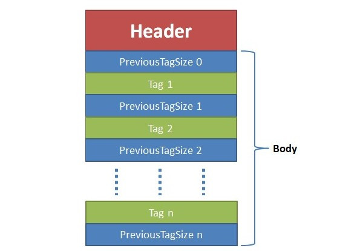
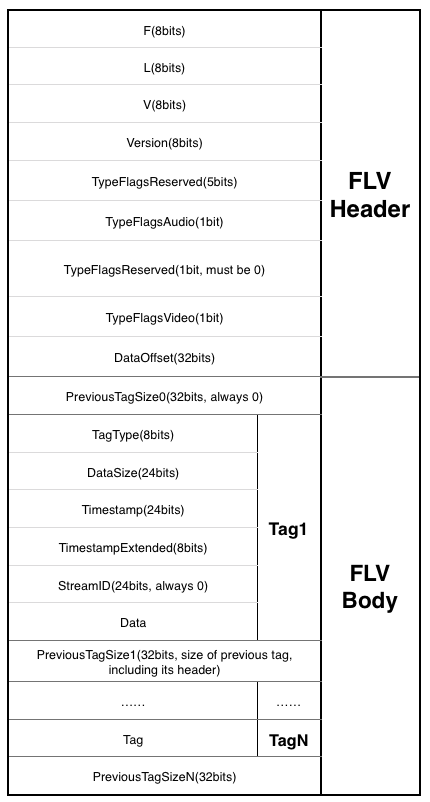
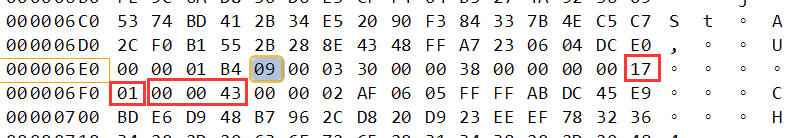

# 2.8FLV 封装格式
- [8.1概述](#8.1)
- [8.2FLV文件格式](#8.2)
- [8.3FLV分析工具](#8.3)
- [8.4HTTP-FLV](#8.4)

## <a id="8.1">8.1概述</a>
FLV（Flash Video）是现在非常流行的流媒体格式，由于其视频文件体积轻巧、封装播放简单等特点，使其很适合在网络上进行应用，目前主流的视频网站无一例外地使用了FLV格式。另外由于当前浏览器与Flash Player紧密的结合，使得网页播放FLV视频轻而易举，也是FLV流行的原因之一。  

参考链接：  
1.flv格式详解+实例剖析  
https://www.cnblogs.com/lidabo/p/9018548.html  
2.FLV 封装格式解析  
https://blog.csdn.net/y_z_hyangmo/article/details/79208275  
3.FLV文件格式详解  
https://blog.csdn.net/beyond702/article/details/78929334  
4.FLV文档  
https://www.adobe.com/content/dam/acom/en/devnet/flv/video_file_format_spec_v10_1.pdf  

## <a id="8.2">8.2FLV文件格式</a>
FLV是流媒体封装格式，我们可以将其数据看为二进制字节流。总体上看，FLV包括文件头（File Header）和文件体（File Body）两部分，其中文件体由一系列的Tag及Tag Size对组成。  




- 1.flv header
Signature: 占三个字节，分别为字符 ‘F’, ‘L’, ‘V’。表明自己的身份。就是FLV文件。如果我们希望探测一个文件是不是FLV文件，检测头三个字节的内容就可以。   
Version: 表明当前文件使用的FLV格式的版本，当前版本为Version 1, 所以这个字段就一直为固定值 0x01.   
TypeFlags: TypeFlags字段的第0位和第2位用于指示文件包含视频内容和音频内容。   
DataOffset: 记录FLV Header结构的大小，包含了DataOffset字段本身。我们计算一下就知道在Version 1当中这个字段的值为 9。  
- 2 flv body
PreviousTagSize: 这个就是上文提到的反向指针-“back-pointer”。指示之前一个TAG的大小。   
- 3 tag
tag type + tag data size + Timestamp + TimestampExtended + stream id + tag data  
type 1个字节。8为Audio,9为Video,18为scripts  
tag data size 3个字节。表示tag data的长度。从streamd id 后算起。  
Timestreamp 3个字节。时间戳  
TimestampExtended 1个字节。时间戳扩展字段  
stream id 3个字节。总是0  
tag data 数据部分  

Tag分为三类  
- script
脚本Tag一般只有一个，是flv的第一个Tag，用于存放flv的信息，比如duration、audiodatarate、creator、width等。首先介绍下脚本的数据类型。所有数据都是以数据类型+（数据长度）+数据的格式出现的，数据类型占1byte，数据长度看数据类型是否存在，后面才是数据。
一般来说，该Tag Data结构包含两个AMF包。AMF（Action Message Format）是Adobe设计的一种通用数据封装格式，在Adobe的很多产品中应用，简单来说，AMF将不同类型的数据用统一的格式来描述。第一个AMF包封装字符串类型数据，用来装入一个“onMetaData”标志，这个标志与Adobe的一些API调用有，在此不细述。第二个AMF包封装一个数组类型，这个数组中包含了音视频信息项的名称和值。  

```Go
值	类型	说明
0	Number type	8 Bypte Double
1	Boolean type	1 Bypte bool
2	String type	后面2个字节为长度
3	Object type	 
4	MovieClip type	 
5	Null type	 
6	Undefined type	 
7	Reference type	 
8	ECMA array type	数组,类似Map
10	Strict array type	 
11	Date type	 
12	Long string type	后面4个字节为长度

type=0x02对应String
size=0A=10
value=onMetaData 正好是10个字节。
```

- Video

```Go
type=0x09=9。这里应该是一个video。
size=0x000030=48。长度为48。
timestreamp=0x000000。
TimestampExtended =0x00。
stream id =0x000000
我们看到数据部分：
视频信息+数据
视频信息，1个字节。
前4位为帧类型Frame Type

值	类型
1	keyframe (for AVC, a seekable frame) 关键帧
2	inter frame (for AVC, a non-seekable frame)
3	disposable inter frame (H.263 only)
4	generated keyframe (reserved for server use only)
5	video info/command frame

```

后4位为编码ID (CodecID)  

```Go
值	类型
1	JPEG (currently unused)
2	Sorenson H.263
3	Screen video
4	On2 VP6
5	On2 VP6 with alpha channel
6	Screen video version 2
7	AVC
```
特殊情况  
视频的格式(CodecID)是AVC（H.264）的话，VideoTagHeader会多出4个字节的信息，AVCPacketType 和CompositionTime。  
AVCPacketType 占1个字节 
```Go
值	类型
0	AVCDecoderConfigurationRecord(AVC sequence header)
1	AVC NALU
2	AVC end of sequence (lower level NALU sequence ender is not required or supported)
```

AVCDecoderConfigurationRecord.包含着是H.264解码相关比较重要的sps和pps信息，再给AVC解码器送数据流之前一定要把sps和pps信息送出，否则的话解码器不能正常解码。而且在解码器stop之后再次start之前，如seek、快进快退状态切换等，都需要重新送一遍sps和pps的信息.AVCDecoderConfigurationRecord在FLV文件中一般情况也是出现1次，也就是第一个video tag.  
CompositionTime 占3个字节  
```Go
条件	值
AVCPacketType ==1	Composition time offset
AVCPacketType !=1	0
```

我们看第一个video tag，也就是前面那张图。我们看到AVCPacketType =0。而后面三个字节也是0。说明这个tag记录的是AVCDecoderConfigurationRecord。包含sps和pps数据。  
再看到第二个video tag  
sps pps  


```Go
sps pps
前面我们提到第一个video 一般存放的是sps和pps。这里我们具体解析下sps和pps内容。先看下存储的格式（图6）：
0x01+sps[1]+sps[2]+sps[3]+0xFF+0xE1+sps size+sps+01+pps size+pps
我们看到图7 。
sps[1]=0x64
sps[2]=00
sps[3]=0D
sps size=0x001B=27
跳过27个字节后，是0x01
pps size=0x0005=118
跳过5个字节，就到了back-pointers。
视频帧数据
解析出sps和pps tag后，后面的video tag就是真正的视频数据内容了
```

- Audio
与视频格式类似  
前4位为音频格式  
```Go
值	类型
0	Linear PCM, platform endian
1	ADPCM
2	MP3
3	Linear PCM, little endian
4	Nellymoser 16-kHz mono
5	Nellymoser 8-kHz mono
6	Nellymoser
7	G.711 A-law logarithmic PCM
8	G.711 mu-law logarithmic PCM
9	reserved
10	AAC
11	Speex
14	MP3 8-Khz
15	Device-specific sound

接着2位为采样率
值	类型
0	5.5-kHz
1	11-kHz
2	22-kHz
3	44-kHz
对于AAC总是3
接着1位为采样的长度

值	类型
0	snd8Bit
1	snd16Bit

压缩过的音频都是16bit
接着1位为音频类型

值	类型
0	sndMono
1	sndStereo

对于AAC总是1

```

## <a id="8.3">8.3FLV分析工具</a>
http://www.flvmeta.com/  
yamdi：将flv转成带索引的flv，yamdi -i i.flv -o o.flv  
flvlib： pip install flvlib, 查看索引信息：debug-flv --metadata file.flv  
flvcheck：http://www.adobe.com/products/adobe-media-server-family/tool-downloads.html  

## <a id="8.4">8.4HTTP-FLV</a>
所有的HTTP FLV流都是一个HTTP FLV地址，譬如：http://ossrs.net:8081/live/livestream.flv，但是，流的形式却至少有三种：  
- 1.FLV文件，渐进式HTTP流。放一个文件到nginx目录，可以访问下载在播放器播放，这是HTTP FLV文件，也就是渐进式下载流。所谓渐进式下载，也就是用户观看时无法从未下载的地方开始看。
- 2.FLV伪流。一般说的HTTP FLV，比上面的渐进式流高级一点，譬如，一个120分钟的电影，作为渐进式流播放时，用户需要从60分钟开始看，如何支持呢？因为nginx是当做文件下载的，无法直接跳转到第60分钟（nginx也不知道60分钟对应的字节偏移是多少呀）。后来有人就支持这种跳着播放，通过指定时间服务器从指定的位置开始给流，这种支持flv?start=，就是http flv的伪流，本质上还是点播流。
- 3.FLV直播流。SRS所指的HTTP FLV流，是严格意义上的直播流，有RTMP的所有特征，譬如集群、低延迟、热备、GOP cache，而且有HTTP的优势，譬如302、穿墙、通用。由于SRS内部实现了HTTP服务器，所以SRS是在边缘将RTMP流转换成HTTP流，SRS集群内部还是使用RTMP分发。当前唯一将RTMP和HTTP协议都解析的服务器

## links
  * [目录](<音视频入门到精通目录.md>)
  * 下一节: [2.9http与音视频千丝万缕的关系](<2.9http与音视频千丝万缕的关系.md>)