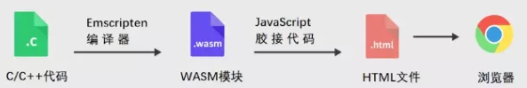

# 4.1web播放器
- [4.1web播放器](#4.1)
- [4.2web播放器对比](#4.2)
- [4.3各播放器介绍](#4.3)
- [4.4web播放器方案](#4.4)
- [4.5方案验证](#4.5)


## <a id="4.1">4.1web播放器</a>
背景：flash要被各浏览器抛弃，插件兼容性不好维护成本高，VLC基于NPAPI，不被最新的 Chrome 和 Firefox 支持。需要找到一个不依赖flash和插件的web播放器，并能播放直播实时视频和点播云存视频，不局限于rtsp还是rtmp或者http方式，基本要求能够满足，基本功能满足。  
以下就httpflv，rtmp，hls三种方式进行简单的介绍：  
HttpFlv 就是 http+flv ，将音视频数据封装成FLV格式，然后通过 HTTP 协议传输给客户端，就是rtmp over http。flv数据格式还是依赖flash，不过可以采用b站的flv.js，播放flv不依赖flash。flv.js工作原理是将FLV文件流转换为（片段MP4），然后将mp4段馈送到HTML5 video元素中，去除依赖flsh的依赖。不过Flv.js有以下问题：1. 播放一段时间后，音视频不同步2. 播放一段时间后，音频模糊3. 手机端兼容性差。没人维护，如果要采用的话可采用#354这个分支解决部分问题。  
HLS，“HTTP Live Streaming”的缩写，工作原理就是把一段视频流，分成一个个小的基于HTTP的文件来下载。当媒体流正在播放时，客户端可以根据当前网络环境，方便地在不同的码率流中做切换，以实现更好的观影体验。HLS的出现是为了解决苹果原生环境中的流媒体播放，这个协议可以方便地让Mac和iPhone播放视频流，不依赖Adobe，更不用去管什么标准委员会。  
RTMP 可以用在双端，但 HLS 只能用在拉流端。基于TCP的，由Adobe公司为Flash播放器和服务器之间音频、视频传输开发的开放协议。需要依赖flash。  
目前视频流对比如下：  
```Go
协议	httpflv	rtmp	hls	dash	Rtsp
传输方式	http	tcp	http	http	Tcp
封装格式	flv	flv tag	Ts	Mp4 3gp webm	Rtp包
延时	低	低	高	高	低
数据分段	连续流	连续流	切片文件	切片文件	连续流
Html5播放	可通过html5解封包播放(flv.js)	不支持	可通过html5解封包播放(hls.js)	如果dash文件列表是mp4webm文件，可直接播放	不支持
是否依赖flash	依赖	依赖	不依赖	不依赖	不依赖
直播点播	点播	直播	直播	Websocek接受数据	直播
```
## <a id="4.2">4.2web播放器对比</a>

### 4.2.1 video.js
支持HTML5，可以自动在flash和Html5播放器之间进行切换，videoJS可以兼容到IE8，界面简洁，需要对界面进行二次开发。维护多，更新多，资料相比较而言比较多。V6之后去除rtmp，V7开始不在支持IE11之前版本。  
优势：维护多，功能多，资料多。  
劣势：支持的rtmp依赖flash，不支持rtsp。  
链接：https://docs.videojs.com/  

### 4.2.2 Ckplayer
ckplayer是一款在网页上播放视频的免费软件，主要特点是：免费，小巧，功能强大，定制方便。   
```Go
视频协议	视频格式	Flash	HTML5
HTTP	flv	YES	NO
HTTP	f4v	YES	NO
HTTP	mp4	YES	YES
HTTP	m3u8	YES	YES
HTTP	webm	NO	YES
HTTP	ogg	NO	YES
RTMP	flv	YES	NO
RTMP	f4v	YES	NO
RTMP	mp4	YES	NO
RTMP	直播流	YES	NO
```
优势：国产播放器，功能多，提供手动切换html5和flash功能。使用人多，维护多，资料多。支持html5，支持flash。兼容较多浏览器。  
缺点：不支持rtsp，支持rtmp依赖flash。   
链接：http://www.ckplayer.com/   

### 4.2.3 BITDashplayer
BITDASH Player是用于MPEG-DASH和HLS的HTML5自适应流播放器。 启动延迟低，没有缓冲并且质量最高，用于解决dash和hls播放，且收费。暂不考虑使用。   
链接：http://www.mediaserverlab.com   

### 4.2.4 Flv.js
属于哔哩哔哩。是js不带flash的flv播放器，flv.js的工作原理是将FLV文件流转换为（片段MP4），然后将mp4段馈送到HTML5 video元素中。支持H.264 + AAC / MP3，兼容Chrome，FireFox，Safari 10，IE11和Edge。  
缺点：B站已不维护，长时间音视频不同步等问题。  
链接：https://github.com/bilibili/flv.js  

### 4.2.5 Chimee 
Chimee :一套可扩展的H5视频播放器组件化框架。  
优点：支持 mp4、m3u8、flv 等格式，支持hls直播，flv直播。可用于pc端，移动端，代码开源。  
缺点:公司团队开发，可维护性不是很大，不支持rtsp播放，有闭源风险，不支持rtmp。  
链接：http://www.chimee.org/  

### 4.2.6 Aliyunplayer
Aliyun：阿里开发的web播放器  
优点：支持功能较多，开发团队大，资料详细。  
缺点：不支持rtsp播放，不支持rtmp。  
链接：https://github.com/aliyunvideo/AliyunPlayer_Web  

### 4.2.7 EasyPlayer.js
EasyPlayer H5版，支持http、rtmp、flv、hls等多种协议，支持全平台、全终端（Windows、Linux、Android、iOS）播放，支持快照截图。  
优点：支持功能多，代码开源。  
缺店：不支持rtsp，rtmp依赖flash，公司团队开发有闭源风险。  
链接：https://github.com/tsingsee/EasyPlayer.js  

### 4.2.8 H5player_RTSP_over_websocket 
基于websocket+rtsp协议的H5播放器  
优点：支持rtsp，代码开源  
缺点：需要和服务端建立websocket，使用RTSP协议进行传输，通过MSE进行播放。Github个人代码可维护性差，需要服务端支持websocket开发。  
链接：https://github.com/LiHaifeng1995/H5player_RTSP_over_websocket  

## <a id="4.3">4.3 各播放器介绍</a>
关于直播播放器得选择，需要从直播点播支持能力，可维护性，开发难度，功能添加等维度进行比较。  
总体来说，点播各个web播放器都是支持得，都支持mp4/flv播放，直播方式播放器都不支持rtsp/rtmp直接播放，暂时没找到支持得播放器。最后在video.js ckplayer EasyPlayer.js aliplayer四个播放器进行比较。  
video.js：支持http协议下的flv,mp4点播，支持hls m3u8直播，支持rtmp播放新版本V6后去除依赖flash。更新快，使用人多，资料较多，组件多，不支持rtsp。  
Ckplayer：支持http协议下的flv,mp4点播，不支持rtsp，rtmp依赖flash，hls依赖hls.js插件，功能较多，资料多。  
EasyPlayer.js：支持http协议下的flv,mp4点播，rtmp依赖flash。公司开发，代码开源，是否未来收费不明确。资料较少。暂不考虑使用。
AliyunPlayer：支持http协议下的flv,mp4点播，不支持rtmp/rtsp。阿里开发，代码开源，是否未来收费不明确。支持功能较多。  
点播：都支持。  
直播：rtmp依赖flash，各个播放器不支持rtsp。  

## <a id="4.4">4.4 web播放器方案</a>
Web直播播方案在网上找到HLS/MPEG-DASH/Media Source Extension等几种。  
现归纳总结以下几种方案：  
- 1.插件化方案
插件化的技术基本分三类:基于IE的Active方案、基于Chome的NPAPI接口和基于Flash插件。但是这些插件化方案逐渐都要淘汰了，原因如下：  
a. 微软已经在2015年宣布放弃IE浏览器，现在最新的微软浏览器Microsoft Edge将从EdgeHTML内核迁移为Chromium内核。  
b. Chrome上的NPAPI也已经宣布放弃，目前要做需要基于PPAPI /NaCl接口。  
c. Flash这种技术也在2020年寿终正寝，所有浏览器就默认禁止在上面跑Flash插件了；  
所以综上来看，想在Web上利用插件化播放视频这条路在已经走不通了，这种技术由于各种问题需要被抛弃了。  

- 2.跨平台的HLS\DASH方案
延时比较大，由于HLS协议本身的切片原理，基本延迟都在10秒+，这对于一些低延时场景非常不友好，虽然HLS也在努力优化，但是想达到秒级延迟还是不现实的。   

- 3.基于HTML5 Video和Audio的MSE方案
MSE即Media Source Extensions是一个W3C草案，其中桌面对MSE的支持比较好，移动端支持缓慢。MSE扩展了HTML5的Video和Audio标签能力，允许你通过JS来从服务端拉流提供到HTML5的Video和Audio标签进行播放。  
MSE目前支持的视频封装格式是MP4，支持的视频编码是H.264和MPEG4,支持的音频编码是AAC和MP3，目前编码层的东西摄像机都支持比较友好，问题不大。封装格式的处理目前要么就是从服务端拉裸流过来，在Web前端合成MP4片段进行播放，要么在服务端提前转封装好直接喂给MSE接口，同时由于RTMP协议在CDN场景的大量使用，所以Web前端应该还支持解析FLV然后转成MP4片段，于是就产生了以下技术细类：   
1)、HTTP+FLV  
服务端经摄像头拉流转成FLV，前端解封装下FLV然后转成MP4片段，再喂给MSE即可，可以使用flv.js。   
2)、WebSocket+flv/mp4     
将拉流协议换成Web的原生WebSocket协议，数据传输通过websocket，码流可以是flv可以是mp4，如果是flv需要1中flv.js配合使用，如果是mp4需要前端解码mpeg数据。    
3）、WebSocket+RTSP+H.264数据    
将RTSP协议放到Websocket协议里面进行透传，然后在服务端做一个Websocket到RTSP协议的代理转换协议，这样就可以在Web支持RTSP协议了，对于视频监控领域用户比较友好，相同的道理也可以在Web前端支持RTMP协议。有相应的开源项目，其中Web这边有个html5_rtsp_player开源项目，实现了RTSP客户端功能，你可以利用此框架直接播放RTSP直播流。   

- 4.WebRTC方案
WebRTC解决诸如客户端流媒体发送、点对点通信、视频编码等问题。桌面浏览器对WebRTC的支持较好，WebRTC也很容易和Native应用集成。
WebRTC实现了浏览器P2P的实时通信，其中可以通过调用相应2的Web API采集视频进行推流，如果放到视频监控，可以把这一段在嵌入式摄像头上实现，将摄像机的编码视频数据采集出来，然后直接发送出去即用摄像头模拟P2P的推流端，另外一端在Web浏览器上用相应接口解码和渲染。  
可参考https://github.com/mpromonet/webrtc-streamer这个案例。  

- 5.WebSocket/HTTP+WebGL/Canvas2D+FFmpeg+WebAssembly方案  
WebAssembly 是一种新的编码方式，可以在现代的网络浏览器中运行 － 它是一种低级的类汇编语言，具有紧凑的二进制格式，并为其他语言提供一个编译目标，以便它们可以在 Web 上运行。它也被设计为可以与 JavaScript 共存，允许两者一起工作。大概原理：  


利用这种技术可以将C/C++库进行前端移植，比如WebAssembly 技术可以帮我们把 FFmpeg 运行在浏览器里，其实就是通过 Emscripten 工具把我们按需定制、裁剪后的 FFmpeg 编译成 Wasm 文件，加载进网页，与 JavaScript 代码进行交互。  
这样Wasm 用于从 JavaScript 接收WebSocket或者HTTP-FLV 直播流数据，并对这些数据利用FFmpeg进行解码，然后通过回调的方式把解码后的 YUV 视频数据和 PCM 音频数据传送回 JavaScript，并最终通过 WebGL 在 Canvas 上绘制视频画面，同时通过 Web Audio API 播放音频。  
前端消耗性能还是比较大，Web前端播放H265的1080P视频比较吃力的，同时想在前端播放多路视频基本是不现实的，所以这个应用场景还是局限在特殊的应用场景，不能通用。  
参考链接：  
https://mp.weixin.qq.com/s?__biz=MzI0NTMxMjA1MQ==&mid=2247484065&idx=1&sn=606ac743d9d06ab884fc3f6bf4095af6&chksm=e9513dfdde26b4eb03c10fb1a80ff416b92fc20f7fd0d2b4f38f5d82125b1690d9e115352b10&mpshare=1&scene=23&srcid=&sharer_sharetime=1571965866908&sharer_shareid=9fe3a5f27cd0720604f9dc96ffacd0ec#rd  

适合我们web播放直播的有以下三种方案，对以下三种方案进行说明和实验验证：  
方案1：采用hls进行直播，支持的web播放器较多，video.js/ckplayer都支持，也可以用hls.js进行播放。缺点：延时大。Hls将视频分成小片，由浏览器单独下载，需要先缓冲几段来保证视频顺畅，因此会产生延迟。  
方案2：考虑采用ws技术，需要进行websocket开发。将MPEG 视频流通过 WebSockets 分发给所有链接的浏览器，浏览器使用JavaScript的媒体源扩展 (MSE) API 和 HTML5 video 元素 解码 MPEG 视频流并将解码后的画面渲染到 Canvas 元素上，或者采用WebGL。缺点：切片延时大，js解码部分效率和资源占用率，可能声音同步会出现等问题，需要时间进行开发研究。服务端也需要支持websocket功能。  
方案3：考虑采用http-flv+flv.js方案，http-flv依赖flash，flash在未来浏览器不再支持，可以再配合flv.js插件使用。缺点：需要时间进行开发研究。只支持flv格式，格式较为单一。  

如果只需要hls方式，可选择video.js 或者ckplayer或者aliyunplayer。  
如果有其他直播方式，需要进一步研究测试。  

## <a id="4.5">4.5方案验证</a>

### 4.1 方案1验证过程及结果(hls)
方案1 主要验证hls直播视频流播放
hls经过验证，video.js能够正常播放。Video.js需要contribe-hls组建，需要在额外增加。相关demo代码在svn路径下。

### 4.2 方案2验证过程及结果(websocket)
方案2 通过webSocket发送MPEG，前端通过js解析MPEG不断绘制canvas。  
- 1.首先安装ffmpeg配置ffmpeg。  

- 2.安装配置node.js环境。安装node.js后，再安装websocket和http-server。-g代表全局。可以在在目录下安装。  
npm install -g ws  
npm install ws  
npm install http-server -g  

- 3.下载jsmpeg，作用：启动websocket，接收ffmpeg的码流，转成websocket输出。    
下载地址：https://codeload.github.com/phoboslab/jsmpeg/zip/master  
至此，ffmpeg node jsmpeg已经准备好。  
Ffmpeg：用来解码的。  
Node.js：搭建webSocket服务器，以及运行一个jsmpeg的js文件  
Jsmpeg：运行主程序。  
Ffmpeg解码rtmp/rtsp视频流交由Node，Node处理http流通过websocket接口传输给js，前端通过jsmpeg解码处理mpeg数据，然后交由canvas画布处理。  

- 4.运行jsmpeg。打开一个命令行，进入jsmpeg目录，运行：  
node websocket-relay.js supersecret 8081 8082  
其中：  
Supersecret是密码  
8081是ffmpeg推送端口  
8082是前端webSocket端口  

- 5.运行ffmpeg。再打开一个命令行：  
ffmpeg -i "rtmp://58.200.131.2:1935/livetv/hunantv" -q 0 -f mpegts -codec:v mpeg1video -s 1366x768 http://127.0.0.1:8081/supersecret  

- 6.启动http-server。再打开一个命令行进入jsmpeg目录，输入：  
http-server

- 7.浏览器打开。
http://127.0.0.1:8080/view-stream.html
正常就应该出现视频画面了。

参考链接：  
1.主要讲解jsmpeg+node+ffmpeg使用  
https://blog.csdn.net/xundh/article/details/94605598   
2.主要是多画面的播放  
https://my.oschina.net/chengpengvb/blog/1832469  
主要修改ffmpeg  
命令ffmpeg "rtsp地址" -q 0 -f mpegts -codec:v mpeg1video -s 800x600 http://127.0.0.1:8081/supersecret/live1多开个窗口创建live2  
view-stream.html需要修改url地址，创建新jsmpeg对象     

### 4.3 方案3验证过程及结果(flv+flv.js)
方案3 ：http-flv + flv.js，将rtmp或者rtsp转换成http-flv进行传输，前端利用flv.js进行处理。  

- 1.下载flv.js代码
下载地址：https://github.com/saysmy/flvjs-pr354。采用这个分支得代码，由于flv.js已经不再维护，这个分支代码解决了一些音视频同步问题。  

- 2.构建flv.js。
代码不能直接使用，我们需要用到nodejs的npm模块进行构建。到下载目录下执行以下：  
npm install             //安装开发环境  
npm install -g gulp      //安装生成工具  
gulp release            //自动化构建  
dist里就终于得到我们需要flv.js和flv.min.js代码了。flv.js压缩前代码，flv.min.js压缩后代码。  

- 3.编写js代码  
以下代码可供参考  
```Go
<script src="flv.min.js"></script>
<video id="videoElement"></video>
<script>
    if (flvjs.isSupported()) {
        var videoElement = document.getElementById('videoElement');
        var flvPlayer = flvjs.createPlayer({
            type: 'flv',
            url: 'http://example.com/flv/video.flv'
        });
        flvPlayer.attachMediaElement(videoElement);
        flvPlayer.load();
        flvPlayer.play();
    }
</script>
```

- 4.部署流媒体服务器
网上找了一个流媒体服务器，将rtmp转换成http-flv格式，将http-flv地址写到第三步种url种，进行验证，最后验证后不需要flash能够播放视频。

### 4.4 dash验证
参考链接：  
1.dash视频服务器本地搭建  
https://blog.csdn.net/weixin_30566063/article/details/98050109  

搭建dash可以通过ngingx分发ffmpeg或者mp4box切成fmp4的文件进行转发。web端采用dash.js进行播放。

## links
  * [目录](<音视频入门到精通目录.md>)