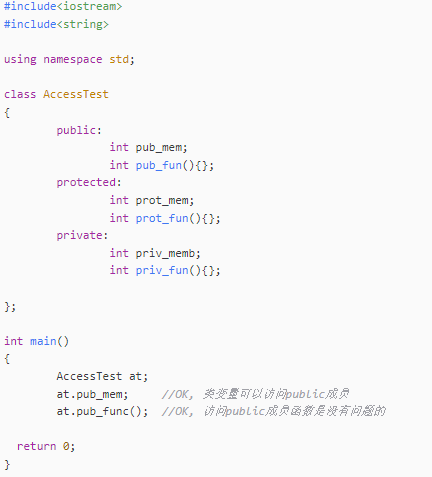
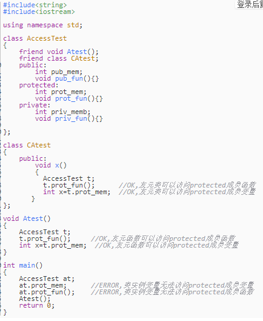
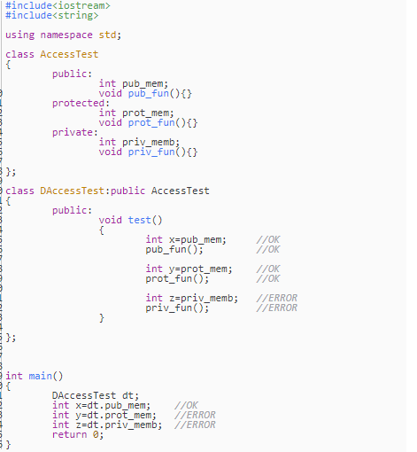
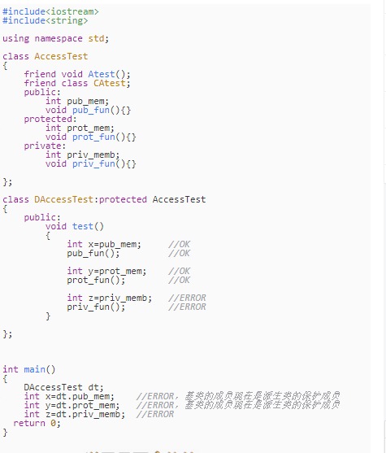
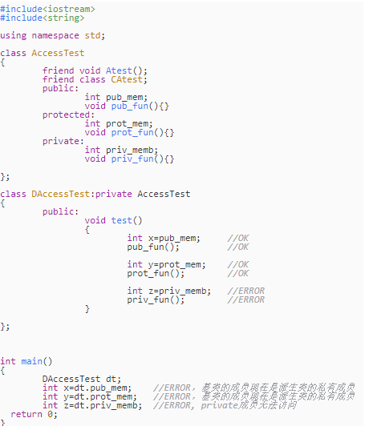

# 5.1ZLMedia开源库学习整理
- [5.1代码学习基础](#5.1)

## <a id="5.1">5.1代码学习基础</a>
### 1.[] (){} Lambda 表达式
C++ 11 中的 Lambda 表达式用于定义并创建匿名的函数对象，以简化编程工作。   
Lambda 的语法形式如下：  
[函数对象参数] (操作符重载函数参数) mutable 或 exception 声明 -> 返回值类型 {函数体} 
可以看到，Lambda 主要分为五个部分：[函数对象参数]、(操作符重载函数参数)、mutable 或 exception 声明、-> 返回值类型、{函数体}.  

#### [函数对象参数]  
标识一个 Lambda 表达式的开始，这部分必须存在，不能省略。函数对象参数是传递给编译器自动生成的函数对象类的构造函数的。函数对象参数只能使用那些到定义 Lambda 为止时 Lambda 所在作用范围内可见的局部变量(包括 Lambda 所在类的 this)。函数对象参数有以下形式：
- 空。没有任何函数对象参数。
- =。函数体内可以使用 Lambda 所在范围内所有可见的局部变量（包括 Lambda 所在类的 this），并且是值传递方式（相
当于编译器自动为我们按值传递了所有局部变量）。
- &。函数体内可以使用 Lambda 所在范围内所有可见的局部变量（包括 Lambda 所在类的 this），并且是引用传递方式
（相当于是编译器自动为我们按引用传递了所有局部变量）。
- this。函数体内可以使用 Lambda 所在类中的成员变量。
- a。将 a 按值进行传递。按值进行传递时，函数体内不能修改传递进来的 a 的拷贝，因为默认情况下函数是 const 的，要
修改传递进来的拷贝，可以添加 mutable 修饰符。
- &a。将 a 按引用进行传递。
- a，&b。将 a 按值传递，b 按引用进行传递。
- =，&a，&b。除 a 和 b 按引用进行传递外，其他参数都按值进行传递。
- &，a，b。除 a 和 b 按值进行传递外，其他参数都按引用进行传递。

#### (操作符重载函数参数)
标识重载的 () 操作符的参数，没有参数时，这部分可以省略。参数可以通过按值（如: (a, b)）和按引用 (如: (&a, &b)) 两种方式进行传递。  

#### mutable 或 exception 声明
这部分可以省略。按值传递函数对象参数时，加上 mutable 修饰符后，可以修改传递进来的拷贝（注意是能修改拷贝，而不是值本身）。exception 声明用于指定函数抛出的异常，如抛出整数类型的异常，可以使用 throw(int)。

#### -> 返回值类型
标识函数返回值的类型，当返回值为 void，或者函数体中只有一处 return 的地方（此时编译器可以自动推断出返回值类型）时，这部分可以省略。

#### {函数体}
标识函数的实现，这部分不能省略，但函数体可以为空。  
参考链接：  
https://www.cnblogs.com/jimodetiantang/p/9016826.html  

### 2.function类模板
类模板std :: function是一个通用的多态函数包装器。 std :: function的实例可以存储，复制和调用任何可调用的目标 ：包括函数，lambda表达式，绑定表达式或其他函数对象，以及指向成员函数和指向数据成员的指针。当std::function对象未包裹任何实际的可调用元素，调用该std::function对象将抛出std::bad_function_call异常。  
function<int(int,int)> func;则 function类的实例func可以指向 返回值为int型，有两个形参都为int型的函数。  

### 3.std::move() 的使用
左值是可以放在赋值号左边可以被赋值的值；左值必须要在内存中有实体；  
右值当在赋值号右边取出值赋给其他变量的值；右值可以在内存也可以在CPU寄存器。  
一个对象被用作右值时，使用的是它的内容(值)，被当作左值时，使用的是它的地址。 
引用的基本规则：  
1.声明引用的时候必须初始化，且一旦绑定，不可把引用绑定到其他对象；即引用必须初始化，不能对引用重定义；  
2.对引用的一切操作，就相当于对原对象的操作。

3.1 左值引用    
左值引用的基本语法：type &引用名 = 左值表达式；  

3.2 右值引用  
右值引用的基本语法type &&引用名 = 右值表达式；  
右值引用在企业开发人员在代码优化方面会经常用到。  

右值引用的“&&”中间不可以有空格。  
std::move函数可以以非常简单的方式将左值引用转换为右值引用。  
通过std::move，可以避免不必要的拷贝操作。  
std::move是为性能而生。  
std::move是将对象的状态或者所有权从一个对象转移到另一个对象，只是转移，没有内存的搬迁或者内存拷贝。  
//调用常规的拷贝构造函数，新建字符数组，拷贝数据
v.push_back(str);
//调用移动构造函数，掏空str，掏空后，最好不要使用str
v.push_back(std::move(str));

### 4. make_shared动态内存中分配一个对象
make_shared的使用:  
shared_ptr<string> p1 = make_shared<string>(10, '9');    
shared_ptr<string> p2 = make_shared<string>("hello");    
shared_ptr<string> p3 = make_shared<string>();  
C++11 中引入了智能指针, 同时还有一个模板函数 std::make_shared 可以返回一个指定类型的 std::shared_ptr。shared_ptr的用法：可以指向特定类型的对象，用于自动释放所指的对象。make_shared的用法：make_shared在动态内存中分配一个对象并初始化它， 返回指向此对象的shared_ptr，与智能指针一样，make_shared定义在头文件memory中；  
当要用make_shared时，必须指定想要创建的对象类型，定义方式与模板类相同，在函数名之后跟一个尖括号，在其中给出类型；  
如make_shared<int>p3 = make_shared<int>(42)  
一般采用auto定义一个对象来保存make_shared的结果，  
如auto p1 = qmake_shared<int>(42);  
make_shared 只分配一次内存, 这看起来很好. 减少了内存分配的开销. 问题来了, weak_ptr 会保持控制块(强引用, 以及弱引用的信息)的生命周期, 而因此连带着保持了对象分配的内存, 只有最后一个 weak_ptr 离开作用域时, 内存才会被释放. 原本强引用减为 0 时就可以释放的内存, 现在变为了强引用, 若引用都减为 0 时才能释放, 意外的延迟了内存释放的时间. 这对于内存要求高的场景来说, 是一个需要注意的问题  

### 5.enable_shared_from_this和shared_from_this()
std::enable_shared_from_this 能让一个对象（假设其名为 t ，且已被一个 std::shared_ptr 对象 pt 管理）安全地生成其他额外的 std::shared_ptr 实例（假设名为 pt1, pt2, ... ） ，它们与 pt 共享对象 t 的所有权。  
一个类 T 继承 std::enable_shared_from_this<T> ，则会为该类 T 提供成员函数： shared_from_this 。 当 T 类型对象 t 被一个为名为 pt 的 std::shared_ptr<T> 类对象管理时，调用 T::shared_from_this 成员函数，将会返回一个新的 std::shared_ptr<T> 对象，它与 pt 共享 t 的所有权。  

```Go
#include <memory>
#include <iostream>
struct Good : std::enable_shared_from_this<Good> // 注意：继承
{
public:
	std::shared_ptr<Good> getptr() {
		return shared_from_this();
	}
	~Good() { std::cout << "Good::~Good() called" << std::endl; }  //删除两次崩溃
};
 
int main()
{
	// 大括号用于限制作用域，这样智能指针就能在system("pause")之前析构
	{
		std::shared_ptr<Good> gp1(new Good());
		std::shared_ptr<Good> gp2 = gp1->getptr();
		// 打印gp1和gp2的引用计数
		std::cout << "gp1.use_count() = " << gp1.use_count() << std::endl;   //1
		std::cout << "gp2.use_count() = " << gp2.use_count() << std::endl;   //1
	}
	system("pause");
}

正确：
struct Good : std::enable_shared_from_this<Good> // 注意：继承
{
public:
	std::shared_ptr<Good> getptr() {
		return shared_from_this();
	}
	~Good() { std::cout << "Good::~Good() called" << std::endl; }
};
 
int main()
{
	// 大括号用于限制作用域，这样智能指针就能在system("pause")之前析构
	{
		std::shared_ptr<Good> gp1(new Good());
		std::shared_ptr<Good> gp2 = gp1->getptr();
		// 打印gp1和gp2的引用计数
		std::cout << "gp1.use_count() = " << gp1.use_count() << std::endl;
		std::cout << "gp2.use_count() = " << gp2.use_count() << std::endl;
	}
	system("pause");
}
```
因为在异步调用中，存在一个保活机制，异步函数执行的时间点我们是无法确定的，然而异步函数可能会使用到异步调用之前就存在的变量。为了保证该变量在异步函数执期间一直有效，我们可以传递一个指向自身的share_ptr给异步函数，这样在异步函数执行期间share_ptr所管理的对象就不会析构，所使用的变量也会一直有效了（保活）。  

### 6.to_string将数值转化为字符串
```Go
string to_string (int val);
string to_string (long val);
string to_string (long long val);
string to_string (unsigned val);
string to_string (unsigned long val);
string to_string (unsigned long long val);
string to_string (float val);
string to_string (double val);
string to_string (long double val);
功能：
将数值转化为字符串。返回对应的字符串。
string pi = "pi is " + std::to_string(3.1415926);
string perfect = to_string(1 + 2 + 4 + 7 + 14) + " is a perfect number";
```

### 7.string相关操作
string.data() ：返回string长度  
string.c_str()：它返回const char*类型，不能修改指向的内容（但是可以强制类型转换成char*类型），并且实际上返回string内部那个数组的首地址的一个指针，并且数组末尾有'\0'。对数组修改实际上是对str1修改。  
- (1).str1 = "abcdef"操作
则c = "abcdef\0"  
若再做str1 = "mn"  
则c = "mn\0def\0"  
此时若cout << c得到的是mn;  
但是cout << c[3]还是d（注意此时若cout << str1[3]会出错,下标只能到2）  

- (2).若对str1再次赋值的字符串长度比str1.capacity()大，那么str1内部就会重新分配空间，此时的指针c就会失效。  
data()和c_str()的区别就在返回的指针所指的数组最后带不带'\0'，这由编译器决定。  

### 8.Noncopyable  
boost::noncopyable 比较简单, 主要用于单例的情况.  
通常情况下, 要写一个单例类就要在类的声明把它们的构造函数, 赋值函数, 析构函数, 拷贝构造函数隐藏到 private 或者 protected 之中, 每个类都这么干的话会非常地麻烦.  
但是有了 noncopyable 类之后, 只要让单例类直接继承 noncopyable, 一切都会迎刃而解.  
class noncopyable 的基本思想是把构造函数和析构函数设置 protected 权限，这样子类可以调用，但是外面的类不能调用，那么当子类需要定义构造函数的时候不至于通不过编译。但是最关键的是noncopyable 把复制构造函数和复制赋值函数做成了 private，这就意味着 除非子类定义自己的copy构造和赋值函数，否则在子类没有定义的情况下，外面的调用者是不能够通过赋值和copy构造等手段来产生一个新的子类对象的。  
如果代码中没有子类的赋值或者拷贝操作,编译器是不会为我们生成默认的赋值函数和拷贝构造函数的,一旦代码中出现了这些操作,而子类并没有定义自己的copy构造函数和赋值函数,那么编译器试图为子类生成,生成的函数首先要调用父类的copy构造函数或者赋值函数,而这两个函数都为 private 类型,自然是无法访问的,因此在编译器就会报错.  
换个说法，想将  
```Go
private:
    A(A const&);
    A& operator=(A const&);
```

避免拷贝和复制，私有的这样避免复制，不过这样会多写一下，编码重复编码，就可以用noncopyalbe。构造和析构函数设置为protocted权限，这样就不能直接创建noncopyable对象，只能由子类构造和析构函数调用它们。然后声明了copy constructor和copy assignment为private.缺点就是编译报错不宜定位。  

### 9.addDelegate委托
可以理解为事件绑定，以下会依次执行321函数，最终返回值是func1的返回值.
```Go
Test printHandler = new Test(func3);
printHandler += DelegaeFunc.func2;
printHandler += DelegaeFunc.func1;
int res = printHandler("hanliangwei");
```
其实和观察者模式

### 10.public、protect、private的访问权限控制
一：成员的访问权限  
- 1: public访问权限  
一个类的public成员变量、成员函数，可以通过类的成员函数、类的实例变量进行访问  
<实际上，类的成员函数，可以访问本类内的任何成员变量和成员函数>  



- 2：protected访问权限
一个类的protected成员变量、成员函数，无法通过类的实例变量进行访问。但是可以通过类的友元函数、友元类进行访问。



- 3：private访问权限
一个类的private成员变量、成员函数，无法通过类的实例变量进行访问。但是可以通过类的友元函数、友元类进行访问。
到现在，是否感觉私有访问属性，和保护属性没有什么区别？区别主要体现在继承上面。下面将会讲到。就是一个类实例的访问权限：pubilc实例可以访问成员变量函数，protected和private实例只能通过友元函数友元类中实例进行访问  
>总结：public在任何地方都能访问，protected只能在派生类中访问， private只能在友元中访问。  

二：继承的访问权限控制  
- 1：public继承  
派生类通过public继承，基类的各种权限不变 。  
派生类的成员函数，可以访问基类的public成员、protected成员，但是无法访问基类的private成员。  
派生类的实例变量，可以访问基类的public成员，但是无法访问protected、private成员，仿佛基类的成员之间加到了派生类一般。   
可以将public继承看成派生类将基类的public,protected成员囊括到派生类，但是不包括private成员。  



- 2：protected继承
派生类通过protected继承，基类的public成员在派生类中的权限变成了protected 。protected和private不变。   
派生类的成员函数，可以访问基类的public成员、protected成员，但是无法访问基类的private成员。   
派生类的实例变量，无法访问基类的任何成员，因为基类的public成员在派生类中变成了protected。   
可以将protected继承看成派生类将基类的public,protected成员囊括到派生类，全部作为派生类的protected成员，但是不包括private成员。  
private成员是基类内部的隐私，除了友元，所有人员都不得窥探。派生类的友元，都不能访问   



- 3：private继承
派生类通过private继承，基类的所有成员在派生类中的权限变成了private。   
派生类的成员函数，可以访问基类的public成员、protected成员，但是无法访问基类的private成员。  
派生类的实例变量，无法访问基类的任何成员，因为基类的所有成员在派生类中变成了private。   
可以将private继承看成派生类将基类的public,protected成员囊括到派生类，全部作为派生类的private成员，但是不包括private成员。  
private成员是基类内部的隐私，除了友元，所有人员都不得窥探。派生类的友元，都不能访问  




>总结：继承修饰符，就像是一种筛子，将基类的成员筛到派生类。public、protected、private，就是筛子的眼。  
通过public继承，所有基类成员（除了private），public、protected都到了派生类里面，public筛眼比较大，不会改变访问权限。  
通过protected继承，所有基类成员（除了private），public、protected都到了派生类里面，protected筛眼大小适中，所有过来的成员都变成了protected。  
通过private继承，所有基类成员（除了private），public、protected都到了派生类里面，private筛眼最小，所有过来的成员都变成了private。  
PS:关于class和struct的区别  
1：class不写修饰符，成员默认是private的，而struct 默认是public的  
2：class的继承默认是private的，而struct默认是public的  

参考链接：
https://blog.csdn.net/ycf74514/article/details/49053041  


- 11.decltype关键字
decltype类型说明符，它的作用是选择并返回操作数的数据类型，在此过程中，编译器分析表达式并得到它的类型，却不实际计算表达式的值。  
decltype和auto都可以用来推断类型，但是二者有几处明显的差异：  
auto忽略顶层const，decltype保留顶层const；  
对引用操作，auto推断出原有类型，decltype推断出引用；  
对解引用操作，auto推断出原有类型，decltype推断出引用；  
auto推断时会实际执行，decltype不会执行，只做分析。总之在使用中过程中和const、引用和指针结合时需要特别小心。   

```Go
int tempA = 2;
/*1.dclTempA为int.*/
decltype(tempA) dclTempA;
```

- 12.基类指针指向派生类指针
父类子类指针函数调用注意事项  
- 1，如果以一个基础类指针指向一个衍生类对象(派生类对象)，那么经由该指针只能访问基础类定义的函数（静态联翩）  
- 2，如果以一个衍生类指针指向一个基础类对象，必须先做强制转型动作（explicit cast），这种做法很危险，也不符合生活习惯，在程序设计上也会给程序员带来困扰。（一般不会这么去定义）  
- 3，如果基础类和衍生类定义了相同名称的成员函数，那么通过对象指针调用成员函数时，到底调用那个函数要根据指针的原型来确定，而不是根据指针实际指向的对象类型确定。  
虚拟函数就是为了对“如果你以一个基础类指针指向一个衍生类对象，那么通过该指针，你只能访问基础类定义的成员函数”这条规则反其道而行之的设计。  
纯虚拟函数：  
virtual void myfunc ( ) =0;  
纯虚拟函数不许定义其具体动作，它的存在只是为了在衍生类钟被重新定义。只要是拥有纯虚拟函数的类，就是抽象类，它们是不能够被实例化的（只能被继承）。如果一个继承类没有改写父类中的纯虚函数，那么他也是抽象类，也不能被实例化。  
抽象类不能被实例化，不过我们可以拥有指向抽象类的指针，以便于操纵各个衍生类。  
虚拟函数衍生下去仍然是虚拟函数，而且还可以省略掉关键字“virtual”。  

## links
  * [目录](<音视频入门到精通目录.md>)