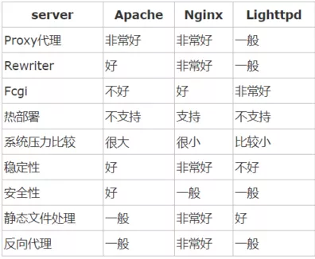
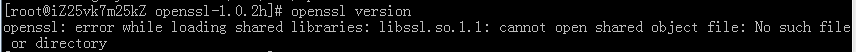

# 6.1Nginx
- [6.1Nginx简介](#6.1)
- [6.2编译安装](#6.2)
- [6.3Nginx RTMP模块指令详解](#6.3)
- [6.4Nginx推流](#6.4)
- [6.5Nginx服务器](#6.5)


## <a id="6.1">6.1Nginx</a>
### 6.1 nginx
Nginx按照rtmp依赖rtmp模块。具体怎么按照可参考相关文档。    

参考连接   
1.https://mp.weixin.qq.com/s/qjUJKN2kt4iy_ytyk34rMg  

#### 6.1.1简介
Nginx 同 Apache 一样都是一种 Web 服务器。Apache 的发展时期很长，而且是毫无争议的世界第一大服务器。它有着很多优点：稳定、开源、跨平台等等。它出现的时间太长了，它兴起的年代，互联网产业远远比不上现在。所以它被设计为一个重量级的。它不支持高并发的服务器。在 Apache 上运行数以万计的并发访问，会导致服务器消耗大量内存。操作系统对其进行进程或线程间的切换也消耗了大量的 CPU 资源，导致 HTTP 请求的平均响应速度降低。  
Nginx 使用基于事件驱动架构，使得其可以支持数以百万级别的 TCP 连接。  
高度的模块化和自由软件许可证使得第三方模块层出不穷（这是个开源的时代啊）。  
Nginx 是一个跨平台服务器，可以运行在 Linux、Windows、FreeBSD、Solaris、AIX、Mac OS 等操作系统上。这些优秀的设计带来的极大的稳定性。  

- 关于代理
所谓代理就是一个代表、一个渠道；此时就涉及到两个角色，一个是被代理角色，一个是目标角色。被代理角色通过这个代理访问目标角色完成一些任务的过程称为代理操作过程；如同生活中的专卖店，客人到 adidas 专卖店买了一双鞋，这个专卖店就是代理，被代理角色就是 adidas 厂家，目标角色就是用户。  

- 正向代理
在如今的网络环境下，我们如果由于技术需要要去访问国外的某些网站，此时你会发现位于国外的某网站我们通过浏览器是没有办法访问的。
此时大家可能都会用一个操作 FQ 进行访问，FQ 的方式主要是找到一个可以访问国外网站的代理服务器，我们将请求发送给代理服务器，代理服务器去访问国外的网站，然后将访问到的数据传递给我们！正向代理最大的特点是客户端非常明确要访问的服务器地址；服务器只清楚请求来自哪个代理服务器，而不清楚来自哪个具体的客户端；正向代理模式屏蔽或者隐藏了真实客户端信息。  
客户端必须设置正向代理服务器，当然前提是要知道正向代理服务器的 IP 地址，还有代理程序的端口。正向代理，"它代理的是客户端"，是一个位于客户端和原始服务器（Origin Server）之间的服务器，为了从原始服务器取得内容，客户端向代理发送一个请求并指定目标（原始服务器）。然后代理向原始服务器转交请求并将获得的内容返回给客户端。客户端必须要进行一些特别的设置才能使用正向代理。  
正向代理的用途：  
访问原来无法访问的资源，如 Google。  
可以做缓存，加速访问资源。  
对户端访问授权，上网进行认证。  
代理可以记录用户访问记录（上网行为管理），对外隐藏用户信息。 

- 反向代理
举例如我国的某宝网站，每天同时连接到网站的访问人数已经爆表，单个服务器远远不能满足人民日益增长的购买欲望了。  
此时就出现了一个大家耳熟能详的名词：分布式部署；也就是通过部署多台服务器来解决访问人数限制的问题。  
某宝网站中大部分功能也是直接使用 Nginx 进行反向代理实现的，并且通过封装 Nginx 和其他的组件之后起了个高大上的名字：Tengine。  
多个客户端给服务器发送的请求，Nginx 服务器接收到之后，按照一定的规则分发给了后端的业务处理服务器进行处理了。   
此时请求的来源也就是客户端是明确的，但是请求具体由哪台服务器处理的并不明确了，Nginx 扮演的就是一个反向代理角色。    
客户端是无感知代理的存在的，反向代理对外都是透明的，访问者并不知道自己访问的是一个代理。因为客户端不需要任何配置就可以访问。  
反向代理，"它代理的是服务端"，主要用于服务器集群分布式部署的情况下，反向代理隐藏了服务器的信息。  
反向代理的作用：  
保证内网的安全，通常将反向代理作为公网访问地址，Web 服务器是内网。  
负载均衡，通过反向代理服务器来优化网站的负载。  

- 负载均衡  
请求数量按照一定的规则进行分发，到不同的服务器处理的规则，就是一种均衡规则。所以将服务器接收到的请求按照规则分发的过程，称为负载均衡。  
负载均衡在实际项目操作过程中，有硬件负载均衡和软件负载均衡两种，硬件负载均衡也称为硬负载，如 F5 负载均衡，相对造价昂贵成本较高。  
Nginx 支持的负载均衡调度算法方式如下：  

```Go
①weight 轮询（默认）：接收到的请求按照顺序逐一分配到不同的后端服务器，即使在使用过程中，某一台后端服务器宕机，Nginx 会自动将该服务器剔除出队列，请求受理情况不会受到任何影响。
这种方式下，可以给不同的后端服务器设置一个权重值（weight），用于调整不同的服务器上请求的分配率。
权重数据越大，被分配到请求的几率越大；该权重值，主要是针对实际工作环境中不同的后端服务器硬件配置进行调整的。
②ip_hash：每个请求按照发起客户端的 ip 的 hash 结果进行匹配，这样的算法下一个固定 ip 地址的客户端总会访问到同一个后端服务器，这也在一定程度上解决了集群部署环境下 Session 共享的问题。
③fair：智能调整调度算法，动态的根据后端服务器的请求处理到响应的时间进行均衡分配。
响应时间短处理效率高的服务器分配到请求的概率高，响应时间长处理效率低的服务器分配到的请求少，它是结合了前两者的优点的一种调度算法。
但是需要注意的是 Nginx 默认不支持 fair 算法，如果要使用这种调度算法，请安装 upstream_fair 模块。
④url_hash：按照访问的 URL 的 hash 结果分配请求，每个请求的 URL 会指向后端固定的某个服务器，可以在 Nginx 作为静态服务器的情况下提高缓存效率。
同样要注意 Nginx 默认不支持这种调度算法，要使用的话需要安装 Nginx 的 hash 软件包。
```

#### 6.1.2 几种常用 Web 服务器对比



## <a id="6.2">6.2编译安装</a>
此次主要记录CentOS7 搭建Nginx-rtmp流媒体服务。  
### 1.准备工作
准备安装所需编译依赖工具：  
yum -y install gcc：安装gcc编译工具.    
yum install -y pcre pcre-devel：安装pcre：pcre是一个perl库，包括perl兼容的正则表达式库，nginx的http模块使用pcre来解析正则表达式所以需要安装pcre库。     
yum install -y zlib zlib-devel：zlib库提供了很多种压缩和解压缩方式nginx使用zlib对http包的内容进行gzip。     
yum install -y openssl openssl-devel：安装rtmp模块需要用到opensll模块。如果命令行安装失败，可以用源码编译。https://www.openssl.org/source/（https://github.com/openssl/openssl）下载。  

cd openssl  
./config --prefix=/usr/local/ssl --openssldir=/usr/local/ssl shared zlib    

Make&make test&make install     
直接config后会将openssl安装到默认文件夹下。Nginx使用opensll可能遇到以下问题：  


ln -s /usr/local/lib64/libssl.so.1.1 /usr/lib64/libssl.so.1.1   
ln -s /usr/local/lib64/libcrypto.so.1.1 /usr/lib64/libcrypto.so.1.1   

### 2.编译使用
下载 nginx 和 nginx-rtmp源码。比如：  
wget http://nginx.org/download/nginx-1.7.5.tar.gz  
wget https://github.com/arut/nginx-rtmp-module/archive/master.zip  

压缩包解压 tar -zxvf 后，到nginx目录下，运行：   
./configure --add-module=/home/athnkk/project/mediaStream/rtmp-module --with-http_ssl_module--with-openssl=源码路径
make&make install。  

安装到/usr/local/nginx/sbin下面。   
如果需要支持rtmp功能需要修改/usr/local/nginx/conf文件夹下nginx.conf文件。在http后面增加   
```shell
rtmp {                #RTMP服务
    server {
       listen 1935;  #//服务端口
       chunk_size 4096;   #//数据传输块的大小
       application vod {
           play /opt/video; #//视频文件存放位置。
       }
       application live{ #直播
           live on;
       }
   }
}
```
即可使用   

ngingx操作：  
./nginx -s stop 停止原来的Nginx服务  
./nginx -t  查询  
./nginx  启动  
sudo service nginx restart 重新启动nginx服务   
nginx -s reload 重新运行   
ps -ef | grep nginx  查看nginx服务是否启动成功   

编辑开机运行  
cd /etc/init.d/   
vi nginx   
//注册成服务   
chkconfig --add nginx   
//重启, 查看nginx服务是否自动启动.   
shutdown -h0 -r   
netstat -apn|grep nginx   

如果你使用了防火墙，请允许端口 tcp 1935  
用netstat -an | grep 1935  
如果启动过程中遇到端口被占用。查看端口PID，lsof -i tcp:8080 根据端口PID, kill掉(这儿的9603换成你自己8080端口的PID)，kill 9603。  
启动后可以在浏览器打开ip查看是否启动成功。  
点播时候，vlc播放地址为：rtmp://127.0.0.1/vod/VID20190428170440.mp4就可以播放   

### 3.注意
不能播放看看conf文件端口号，端口是否通得，防火墙配置，telnet端口，阿里云需要在控制台设置。  
参考链接：  
1.openssl安装  
https://blog.csdn.net/weixin_42037232/article/details/88049210  

## <a id="6.3">6.3Nginx RTMP模块指令详解</a>
参考链接：  
1.Nginx RTMP 模块 nginx-rtmp-module 指令详解  
https://blog.csdn.net/defonds/article/details/9274479/  

### Core
#### rtmp
```nginx
语法：rtmp { ... }
上下文：根
描述：保存所有 RTMP 配置的块。
```

#### server
```nginx
语法：server { ... }
上下文：rtmp
描述：声明一个 RTMP 实例。
rtmp {
  server {
  }
}
```

#### listen
```nginx
语法：listen (addr[:port]|port|unix:path) [bind] [ipv6only=on|off] [so_keepalive=on|off|keepidle:keepintvl:keepcnt]
上下文：server
描述：给 NGINX 添加一个监听端口以接收 RTMP 连接。
server {
    listen 1935;
}
```

#### application
```nginx
语法：application name { ... }
上下文：server
描述：创建一个 RTMP 应用。application 名的模式并不类似于 http location。
server {
    listen 1935;
    application myapp {
    }
}
```

#### timeout
```nginx
语法：timeout value
上下文：rtmp, server
描述：Socket 超时。这个值主要用于写数据时。大多数情况下，RTMP 模块并不期望除 publisher 端口之外的其他端口处于活动状态。
如果你想要快速关掉 socket 可以用 keepalive 或者 RTMP ping 等。timeout 默认值为 1 分钟。
timeout 60s;
```

#### ping
```nginx
语法：ping value
上下文：rtmp, server
描述：RTMP ping 间隔。零值的话将 ping 关掉。RTMP ping 是一个用于检查活动连接的协议功能。发送一个特殊的包到远程
连接，然后在 ping_timeout 指令指定的时间内期待一个回复。如果在这个时间里没有收到 ping 回复，连接断开。ping 默认
值为一分钟。ping_timeout 默认值为 30 秒。
ping 3m;
ping_timeout 30s;
```

#### ping_timeout
```nginx
语法：ping_timeout value
上下文：rtmp, server
描述：请参考上文 ping 描述。
```

#### max_streams
```nginx
语法：max_streams value
上下文：rtmp, server
描述：设置 RTMP 流的最大数目。数据流被整合到一个单一的数据流里。不同的频道用于发送命令、音频、视频等。默认值为 32，适用于大多数情况。
max_streams 32;
```

#### ack_window
```nginx
语法：ack_window value
上下文：rtmp, server
描述：设置 RTMP 确认视窗大小。这是对端发送确认包到远端后应该收到的字节数量。默认值为 5000000。
ack_window 5000000;
```

#### chunk_size
```nginx
语法：chunk_size value
上下文：rtmp, server
描述：流整合的最大的块大小。默认值为 4096。这个值设置的越大 CPU 负载就越小。这个值不能低于 128。
chunk_size 4096;
```

#### max_queue
```nginx
语法：max_queue value
上下文：rtmp, server
描述：输入数据报文最大尺寸。所有输入数据会被分割成报文（然后进一步分割为块）。报文在处理结束之前会放在内存里。
理论上讲，接收到的报文很大的话对于服务器的稳定性可能会有影响。默认值 1M 对于大多数情况就足够了。
max_message 1M;
out_queue
out_cork
```

### Access
#### allow
```nginx
语法：allow [play|publish] address|subnet|all
上下文：rtmp, server, application
允许来自指定地址或者所有地址发布/播放。allow 和 deny 指令的先后顺序可选。
allow publish 127.0.0.1;
deny publish all;
allow play 192.168.0.0/24;
deny play all;
deny
语法：deny [play|publish] address|subnet|all
上下文：rtmp, server, application
描述：参考 allow 的描述。
```


### Exec
#### exec
```nginx
语法：exec command arg*
上下文：rtmp, server, application
描述：定义每个流发布时要执行的带有参数的外部命令。发布结束时进程终止。第一个参数应该是二进制可执行文件的完整路径。
关于这个进程将会做些什么事没有任何假定。但这一特点在使用 ffmpeg 进行流转换时是很有用的。FFmpeg 被假定作为客户端
连接到 nginx-rtmp 然后作为发布者输出转换流到 nginx-rtmp。类似于 $var/${var} 形式的替换可以在命令行使用：
* $name - 流的名字。
* $app - 应用名。
* $addr - 客户端地址。
* $flashver - 客户端 flash 版本。
* $swfurl - 客户端 swf url。
* $tcurl - 客户端 tc url。
* $pageurl - 客户端页面 url。
可以在 exec 指令中定义 Shell 格式的转向符用于写输出和接收输入。支持如下
* 截断输出 >file。
* 附加输出 >>file。
* 重定向描述符类似于 1>&2。
* 输入 <file。
以下 ffmpeg 调用将输入流转码为 HLS-ready 流(H264/AAC)。运行这个示例，FFmpeg 须编译为支持 libx264 & libfaac。
application src {
    live on;
    exec ffmpeg -i rtmp://localhost/src/$name -vcodec libx264 -vprofile baseline -g 10 -s 300x200 -acodec 
    libfaac -ar 44100 -ac 1 -f flv rtmp://localhost/hls/$name 2>>/var/log/ffmpeg-$name.log;
}

application hls {
    live on;
    hls on;
    hls_path /tmp/hls;
    hls_fragment 15s;
}
```

#### exec_static
```nginx
语法：exec_static command arg*  
上下文：rtmp, server, application  
描述：类似于 exec 指令，但在 nginx 启动时将运行定义的命令。因为（启动时）尚无会话上下文，不支持替换。  
exec_static ffmpeg -i http://example.com/video.ts -c copy -f flv rtmp://localhost/myapp/mystream;   
```

#### exec_kill_signal
```nginx
语法：exec_kill_signal signal
上下文：rtmp, server, application
描述：设置进程终止信号。默认为 kill(SIGKILL)。你可以定义为数字或者符号名(POSIX.1-1990 信号)。
exec_kill_signal term;
exec_kill_signal usr1;
exec_kill_signal 3;
```

#### respawn
```nginx
语法：respawn on|off
上下文：rtmp, server, application
描述：如果打开 respawn 子进程，进程终止时发布会仍然继续。默认为打开。
respawn off;
```

#### respawn_timeout
```nginx
语法：respawn_timeout timeout
上下文：rtmp, server, application
描述：启动新的子实例之前，设置 respawn 超时时间。默认为五秒。
respawn_timeout 10s;
```

#### exec_publish
```nginx
语法：exec_publish command arg*
上下文：rtmp, server, application
描述：指定发布事件触发的带有参数的外部命令。返回码是未解析的。这里可以用 exec 替换。另外，args 变量支持持有查询字符串参数。
```

#### exec_play
```nginx
语法：exec_play command arg*
上下文：rtmp, server, application
描述：指定播放事件触发的带有参数的外部命令。返回码是未解析的。替换列表同 exec_publish。
```

#### exec_play_done
```nginx
语法：exec_play_done command arg*
上下文：rtmp, server, application
描述：指定播放结束事件触发的带有参数的外部命令。返回码是未解析的。替换列表同 exec_publish。
```

#### exec_publish_done
```nginx
语法：exec_publish_done command arg*
上下文：rtmp, server, application
描述：指定发布结束事件触发的带有参数的外部命令。返回码是未解析的。替换列表同 exec_publish。
```

#### exec_record_done
```nginx
语法：exec_record_done command arg*
上下文：rtmp, server, application, recorder
描述：指定录制结束时触发的带有参数的外部命令。这里支持 exec_publish 的替代以及额外的变量 path 和 recorder。

track client info
exec_play bash -c "echo $addr $pageurl >> /tmp/clients";
exec_publish bash -c "echo $addr $flashver >> /tmp/publishers";
convert recorded file to mp4 format
exec_record_done ffmpeg -y -i $path -acodec libmp3lame -ar 44100 -ac 1 -vcodec libx264 $path.mp4;
```

### Live
#### live
```nginx
语法：live on|off
上下文：rtmp, server, application
描述：切换直播模式，即一对多广播。
live on;
```

#### meta
```nginx
语法：meta on|off
上下文：rtmp, server, application
描述：切换发送元数据到客户端。默认为 on。
meta off;
```

#### interleave
```nginx
语法：interleave on|off
上下文：rtmp, server, application
描述：切换交叉模式。在这个模式下，音频和视频数据会在同一个 RTMP chunk 流中传输。默认为 off。
interleave on;
```

#### wait_key
```nginx
语法：wait_key on|off
上下文：rtmp, server, application
描述：使视频流从一个关键帧开始。默认为 off。
wait_key on;
```

#### wait_video
```nginx
语法：wait_video on|off
上下文：rtmp, server, application
描述：在第一个视频帧发送之前禁用音频。默认为 off。可以和 wait_key 进行组合以使客户端可以收到具有所有其他数据的
视频关键帧。然而这通常增加连接延迟。您可以通过在编码器中调整关键帧间隔来减少延迟。
wait_video on;
```

#### publish_notify
```nginx
语法：publish_notify on|off
上下文：rtmp, server, application
描述：发送 NetStream.Publish.Start 和 NetStream.Publish.Stop 给用户。默认为 off。
publish_notify on;
```

#### drop_idle_publisher
```nginx
语法：drop_idle_publisher timeout
上下文：rtmp, server, application
描述：终止指定时间内闲置(没有音频/视频数据)的发布连接。默认为 off。注意这个仅仅对于发布模式的连接起作用(发送 
publish 命令之后)。
drop_idle_publisher 10s;
```

#### sync
```nginx
语法：sync timeout
上下文：rtmp, server, application
描述：同步音频和视频流。如果用户带宽不足以接收发布率，服务器会丢弃一些帧。这将导致同步问题。当时间戳差超过 sync
 指定的值，将会发送一个绝对帧来解决这个问题。默认为 300 ms。
sync 10ms;
```

#### play_restart
```nginx
语法：play_restart on|off
上下文：rtmp, server, application
描述：使 nginx-rtmp 能够在发布启动或停止时发送 NetStream.Play.Start 和 NetStream.Play.Stop 到每个用户。如果
关闭的话，那么每个用户就只能在回放的开始和结束时收到这些通知了。默认为 on。
play_restart off;
```

### Record
#### record
```nginx
语法：record [off|all|audio|video|keyframes|manual]*
上下文：rtmp, server, application, recorder
描述：切换录制模式。流可以被记录到 flv 文件。本指令指定应该被记录的：
* off - 什么也不录制
* all - 音频和视频(所有)
* audio - 音频
* video - 视频
* keyframes - 只录制关键视频帧
* manual - 用不自动启动录制，使用控制接口来启动/停止
在单个记录指令中可以有任何兼容的组合键。
record all;
record audio keyframes;
```

#### record_path
```nginx
语法：record_path path
上下文：rtmp, server, application, recorder
描述：指定录制的 flv 文件存放目录。
record_path /tmp/rec;
```

#### record_suffix
```nginx
语法：record_suffix value
上下文：rtmp, server, application, recorder
描述：设置录制文件后缀名。默认为 '.flv'。
record_suffix _recorded.flv;
录制后缀可以匹配 strftime 格式。以下指令
record_suffix -%d-%b-%y-%T.flv
将会产生形如 mystream-24-Apr-13-18:23:38.flv 的文件。所有支持 strftime 格式的选项可以在 strftime man page 里进行查找。
```

#### record_unique
```nginx
语法：record_unique on|off
上下文：rtmp, server, application, recorder
描述：是否添加时间戳到录制文件。否则的话同样的文件在每一次新的录制发生时将被重写。默认为 off。
record_unique on;
```

#### record_append
```nginx
语法：record_append on|off
上下文：rtmp, server, application, recorder
描述：切换文件附加模式。当这一指令为开启是，录制时将把新数据附加到老文件，如果老文件丢失的话将重新创建一个。文件中的
老数据和新数据没有时间差。默认为 off。
record_append on;
```

#### record_lock
```nginx
语法：record_lock on|off
上下文：rtmp, server, application, recorder
描述：当这一指令开启时，当前录制文件将被 fcntl 调用锁定。那样可以在其他地方来核实哪个文件正在进行录制。默认为 off。
record_lock on;
在 FreeBSD 上你可以使用 flock 工具检查。在 Linux 上 flock 和 fcntl 无关，因此你需要去写一个简单的脚本来检查文件的
锁定状态。以下 isunlocked.py 是一个这样的脚本的示例。
#!/usr/bin/python
import fcntl, sys
sys.stderr.close()
fcntl.lockf(open(sys.argv[1], "a"), fcntl.LOCK_EX|fcntl.LOCK_NB)
```

#### record_max_size
```nginx
语法：record_max_size size
上下文：rtmp, server, application, recorder
描述：设置录制文件的最大值。
record_max_size 128K;
```

#### record_max_frames
```nginx
语法：record_max_frames nframes
上下文：rtmp, server, application, recorder
描述：设置每个录制文件的视频帧的最大数量。
record_max_frames 2;
```

#### record_interval
```nginx
语法：record_interval time
上下文：rtmp, server, application, recorder
描述：在这个指令指定数量的(毫秒)秒之后重启录制。默认为 off。设置为 0 的话意味着录制中无延迟。如果 record_unique
 为 off 的话所有记录片段会被写到同一个文件。否则(文件名)将附以时间戳以区分不同文件(给定的 record_interval 要大于 1 秒)。
record_interval 1s;
record_interval 15m;
```

#### recorder
```nginx
语法：recorder name {...}
上下文：application
描述：创建录制块。可以在单个 application 中创建多个记录。上文提到的所有录制相关的指令都可以在 recorder{} 块中进
行定义。继承高层次中的所有设置。
application {
    live on;
    # default recorder
    record all;
    record_path /var/rec;
    recorder audio {
        record audio;
        record_suffix .audio.flv;
    }
    recorder chunked {
        record all;
        record_interval 15s;
        record_path /var/rec/chunked;
    }
}
```

#### record_notify
```nginx
语法：record_notify on|off
上下文：rtmp, server, application, recorder
描述：切换当定义录制启动或停止文件时发送 NetStream.Record.Start 和 NetStream.Record.Stop 状态信息(onStatus)到
发布者。状态描述字段保存录制的名字(默认录制的话为空)。默认为 off。
recorder myrec {
    record all manual;
    record_path /var/rec;
    record_notify on;
}
```

### VOD
#### play
```nginx
语法：lay dir|http://loc [dir|http://loc]*
上下文：rtmp, server, application
描述：播放指定目录或者 HTTP 地址的 flv 或者 mp4 文件。如果此参数前缀是 http:// 那么就认为文件可以在播放前从远程 http 
地址下载下来。注意播放是在整个文件下载完毕之后才开始。你可以使用本地 nginx 在本地机器缓存文件。同一个 play 指令可以定
义多个播放地址。当多个 play 指令定义时，地址列表将被合并，并进行从更高域中继承。尝试播放每一个地址，直到发现一个成功的
地址。如果没有找到成功地址，将发送错误状态到客户端。索引的 FLV 播放具有随机查找能力。没有索引的 FLV 则不具备查找/暂停
能力(重播模式)。使用 FLV 索引器(比如 yamdi)来编索引。
mp4 文件只有在音频和视频编码都被 RTMP 支持时才可以播放。最常见的情况是 H264/AAC。
application vod {
    play /var/flvs;
}

application vod_http {
    play http://myserver.com/vod;
}

application vod_mirror {
    # try local location first, then access remote location
    play /var/local_mirror http://myserver.com/vod;
}
播放 /var/flvs/dir/file.flv：
ffplay rtmp://localhost/vod/dir/file.flv
```

#### play_temp_path
```nginx
语法：play_temp_path dir
上下文：rtmp, server, application
描述：在播放之前设置远程存储的 VOD 文件路径。默认为 /tmp。
play_temp_path /www;
play http://example.com/videos;
```

#### play_local_path
```nginx
语法：play_local_path dir
上下文：rtmp, server, application
描述：设置远程 VOD 文件完全下载之后复制于 play_temp_path 之后的路径。空值的话禁用此功能。默认为控制。这个功能可以用
于缓存远程文件在本地。
这一路径应该和 play_temp_path 处于同一设备。
# search file in /tmp/videos.
# if not found play from remote location
# and store in /tmp/videos
play_local_path /tmp/videos;
play /tmp/videos http://example.com/videos;
```

### Relay
#### pull
```nginx
语法：pull url [key=value]*
上下文：application
描述：创建 pull 中继。流将从远程服务器上拉下来，成为本地可用的。仅当至少有一个播放器正在播放本地流时发生。
Url 语法：[rtmp://]host[:port][/app[/playpath]]。如果 application 找不着那么将会使用本地 application 名。如果找不着 playpath 那么就是用当前流的名字。
支持以下参数：
* app - 明确 application 名。
* name - 捆绑到 relay 的本地流名字。如果为空或者没有定义，那么将会使用 application 中的所有本地流。
* tcUrl - 如果为空的话自动构建。
* pageUrl - 模拟页面 url。
* swfUrl - 模拟 swf url。
* flashVer - 模拟 flash 版本，默认为 'LNX.11,1,102,55'。
* playPath - 远程播放地址。
* live - 切换直播特殊行为，值：0,1。
* start - 开始时间。
* stop - 结束时间。
* static - 创建静态 pull，这样的 pull 在 nginx 启动时创建。
如果某参数的值包含空格，那么你应该在整个 key=value 对周围使用引号，比如：'pageUrl=FAKE PAGE URL'。
pull rtmp://cdn.example.com/main/ch?id=12563 name=channel_a;

pull rtmp://cdn2.example.com/another/a?b=1&c=d pageUrl=http://www.example.com/video.html swfUrl=http://www.example.com/player.swf live=1;

pull rtmp://cdn.example.com/main/ch?id=12563 name=channel_a static;
```

#### push
```nginx
语法：push url [key=value]*
上下文：application
描述：push 的语法和 pull 一样。不同于 pull 指令的是 push 推送发布流到远程服务器。
```

#### push_reconnect
```nginx
语法：push_reconnect time
上下文：rtmp, server, application
描述：在断开连接后，在 push 重新连接前等待的时间。默认为 3 秒。
push_reconnect 1s;
```

#### session_relay
```nginx
语法：session_relay on|off
上下文：rtmp, server, application
描述：切换会话 relay 模式。在这种模式下连接关闭时 relay 销毁。当设置为 off 时，流关闭，relay 销毁，这样子以后另一个
 relay 可以被创建。默认为 off。
session_relay on;
```

### Notify
#### on_connect
```nginx
语法：on_connect url
上下文：rtmp, server
描述：设置 HTTP 连接回调。当客户分发连接命令一个连接命令时，一个 HTTP 请求异步发送，命令处理将被暂停,直到它返回结果代码。当 HTTP 2XX 码(成功状态码)返回时，RTMP 会话继续。返回码 3XX (重定向状态码)会使 RTMP 重定向到另一个从 HTTP 返回头里获取到的 application。否则(其他状态码)连接丢弃。
注意这一指令在 application 域是不允许的，因为 application 在连接阶段还是未知的。
HTTP 请求接收到一些参数。在 application/x-www-form-urlencoded MIME 类型下使用 POST 方法。以下参数将被传给调用者：
* call=connect。
* addr - 客户端 IP 地址。
* app - application 名。
* flashVer - 客户端 flash 版本。
* swfUrl - 客户端 swf url。
* tcUrl - tcUrl。
* pageUrl - 客户端页面 url。
除了上述参数以外，所有显式传递给连接命令的参数也由回调发送。你应该将连接参数和 play/publish 参数区分开。播放器常常有独特的方式设置连接字符串不同于 play/publish 流名字。这里是 JWPayer 是如何设置这些参数的一个示例：
streamer: "rtmp://localhost/myapp?connarg1=a&connarg2=b",
file: "mystream?strarg1=c&strarg2=d",

Ffplay(带有 librtmp)示例：
ffplay "rtmp://localhost app=myapp?connarg1=a&connarg2=b playpath=mystream?strarg1=c&strarg2=d"

使用例子：
on_connect http://example.com/my_auth;
重定向例子：
location /on_connect {
    if ($arg_flashver != "my_secret_flashver") {
        rewrite ^.*$ fallback? permanent;
    }
    return 200;
}
```

#### on_play
```nginx
语法：on_play url
上下文：rtmp, server, application
描述：设置 HTTP 播放回调。每次一个客户分发播放命令时，一个 HTTP 请求异步发送，命令处理会挂起 - 直到它返回结果码。之后再解析 HTTP 结果码。
* HTTP 2XX 返回码的话继续 RTMP 会话。
* HTTP 3XX 返回码的话 重定向 RTMP 到另一个流，这个流的名字在 HTTP 返回头的 Location 获取。如果新流的名字起始于 rtmp:// 然后远程 relay 会被创建。relay 要求 IP 地址是指定的而不是域名，并且只工作在 1.3.10 版本以上的 nginx。另请参考 notify_relay_redirect。
* 其他返回码的话 RTMP 连接丢弃。
重定向例子：
http {
    location /local_redirect {
        rewrite ^.*$ newname? permanent;
    }
    location /remote_redirect {
        # no domain name here, only ip
        rewrite ^.*$ rtmp://192.168.1.123/someapp/somename? permanent;
    }
}
rtmp {
    application myapp1 {
        live on;
        # stream will be redirected to 'newname'
        on_play http://localhost:8080/local_redirect;
    }
    application myapp2 {
        live on;
        # stream will be pulled from remote location
        # requires nginx >= 1.3.10
        on_play http://localhost:8080/remote_redirect;
    }
}
HTTP 请求接收到一些个参数。在 application/x-www-form-urlencoded MIME 类型下使用 POST 方法。以下参数会被传送给调用者：
* call=play。
* addr - 客户端 IP 地址。
* app - application 名。
* flashVer - 客户端 flash 版本。
* swfUrl - 客户端 swf url。
* tcUrl - tcUrl。
* pageUrl - 客户端页面 url。
* name - 流名。
出了上述参数之外其他所有播放命令参数显式地发送回调。例如如果一个流由 url rtmp://localhost/app/movie?a=100&b=face&foo=bar 访问，然后呢 a,b 和 foo 发送回调。
on_play http://example.com/my_callback;
```

#### on_publish
```nginx
语法：on_publish url
上下文：rtmp, server, application
描述：同上面提到的 on_play 一样，唯一的不同点在于这个指令在发布命令设置回调。不同于远程 pull，push 在这里是可以的。
```

#### on_done
```nginx
语法：on_done url
上下文：rtmp, server, application
描述：设置播放/发布禁止回调。上述所有适用于此。但这个回调并不检查 HTTP 状态码。
```

#### on_play_done
```nginx
语法：on_publish_done url
上下文：rtmp, server, application
描述：等同于 on_done 的表现，但只适用于播放结束事件。
```

#### on_publish_done
```nginx
语法：on_publish_done url
上下文：rtmp, server, application
描述：等同于 on_done 的表现，但只适用于发布结束事件。
```

#### on_record_done
```nginx
语法：on_record_done url
上下文：rtmp, server, application, recorder
描述：设置 record_done 回调。除了普通 HTTP 回调参数它接受录制文件路径。
on_record_done http://example.com/recorded;
```

#### on_update
```nginx
语法：on_update url
上下文：rtmp, server, application
描述：设置 update 回调。这个回调会在 notify_update_timeout 期间调用。如果一个请求返回结果不是 2XX，连接禁止。这可以用来同步过期的会话。追加 time 参数即播放/发布调用后的秒数会被发送给处理程序。
on_update http://example.com/update;
```

#### notify_update_timeout
```nginx
语法：notify_update_timeout timeout
上下文：rtmp, server, application
描述：在 on_update 回调之间的超时设置。默认为 30 秒。
notify_update_timeout 10s;
on_update http://example.com/update;
```

#### notify_update_strict
```nginx
语法：notify_update_strict on|off
上下文：rtmp, server, application
描述：切换 on_update 回调严格模式。默认为 off。当设置为 on 时，所有连接错误，超时以及 HTTP 解析错误和空返回会被视为更新失败并导致连接终止。当设置为 off 时只有 HTTP 返回码不同于 2XX 时导致失败。
notify_update_strict on;
on_update http://example.com/update;
```

#### notify_relay_redirect
```nginx
语法：notify_relay_redirect on|off
上下文：rtmp, server, application
描述：使本地流可以重定向为 on_play 和 on_publish 远程重定向。新的流名字是 RTMP URL 用于远程重定向。默认为 off。
notify_relay_redirect on;
```

#### notify_method
```nginx
语法：notify_method get|post
上下文：rtmp, server, application, recorder
描述：设置 HTTP 方法通知。默认是带有 application/x-www-form-urlencoded 的 POST 内容类型。在一些情况下 GET 更好，例如如果你打算在 nginx 的 http{} 部分处理调用。在这种情况下你可以使用 arg_* 变量去访问参数。
notify_method get;
在 http{} 部分使用 GET 方法处理通知可以使用这种方法：
location /on_play {
    if ($arg_pageUrl ~* localhost) {
        return 200;
    }
    return 500;
}
```

### HLS
#### hls
```nginx
语法：hls on|off
上下文：rtmp, server, application
描述：在 application 切换 HLS。
hls on;
hls_path /tmp/hls;
hls_fragment 15s;
在 http{} 段为客户端播放 HLS 设置在以下位置设置：
http {
    server {
        location /hls {
            types {
                application/vnd.apple.mpegurl m3u8;
            }
            alias /tmp/hls;
        }
    }
}
```

#### hls_path
```nginx
语法：hls_path path
上下文：rtmp, server, application
描述：设置 HLS 播放列表和分段目录。这一目录必须在 NGINX 启动前就已存在。
```

#### hls_fragment
```nginx
语法：hls_fragment time
上下文：rtmp, server, application
描述：设置 HLS 分段长度。默认为 5 秒钟。
```

#### hls_playlist_length
```nginx
语法：hls_playlist_length time
上下文：rtmp, server, application
描述：设置 HLS 播放列表长度。默认为 30 秒钟。
hls_playlist_length 10m;
```

#### hls_sync
```nginx
语法：hls_sync time
上下文：rtmp, server, application
描述：设置 HLS 时间戳同步阈值。默认为 2 ms。这一功能可以防止由低分辨率 RTMP (1KHz) 转换到高分辨率 MPEG-TS (90KHz) 之后出现噪音。
hls_sync 100ms;
```

#### hls_continuous
```nginx
语法：hls_continuous on|off
上下文：rtmp, server, application
描述：切换 HLS 连续模式。这一模式下 HLS 序列号由其上次停止的最后时间开始。老的分段保留下来。默认为 off。
hls_continuous on;
```

#### hls_nested
```nginx
语法：hls_nested on|off
上下文：rtmp, server, application
描述：切换 HLS 嵌套模式。这一模式下为每个流创建了一个 hls_path 的子目录。播放列表和分段在那个子目录中创建。默认为 off。
hls_nested on;
```

#### hls_cleanup
```nginx
语法：hls_cleanup on|off
上下文：rtmp, server, application
描述：切换 HLS 清理。这一功能默认为开启的。在这一模式下 nginx 缓存管理进程将老的 HLS 片段和播放列表由 HLS 清理掉。
hls_cleanup off;
```

### Access log
#### access_log
```nginx
语法：access_log off|path [format_name]
上下文：rtmp, server, application
描述：设置访问日志参数。日志默认是开启的。关闭日志可以使用 access_log off 指令。默认情况下访问日志和 HTTP 访问日志 logs/access.log 放到同一文件。你也可以使用 access_log 指令将其定义到其他日志文件。第二个参数是可选的。可以根据名字来定义日志格式。请参考 log_format 指令来获取更多关于格式的详细信息。
log_format new '$remote_addr';
access_log logs/rtmp_access.log new;
access_log logs/rtmp_access.log;
access_log off;
```

#### log_format
```nginx
语法：log_format format_name format
上下文：rtmp
描述：创建指定的日志格式。日志格式看起来很像 nginx HTTP 日志格式。日志格式里支持的几个变量有：
* connection - 连接数。
* remote_addr - 客户端地址。
* app - application 名。
* name - 上一个流名。
* args - 上一个流播放/发布参数。
* flashver - 客户端 flash 版本。
* swfurl - 客户端 swf url。
* tcurl - 客户端 tcUrl。
* pageurl - 客户端页面 url。
* command - 客户端发送的播放/发布命令：NONE、PLAY、PUBLISH、PLAY+PUBLISH。
* bytes_sent - 发送到客户端的字节数。
* bytes_received - 从客户端接收到的字节数。
* time_local - 客户端连接结束的本地时间。
* session_time - 持续连接的秒数。
* session_readable_time - 在可读格式下的持续时间。
默认的日志格式叫做 combined。这里是这一格式的定义：
$remote_addr [$time_local] $command "$app" "$name" "$args" - 
$bytes_received $bytes_sent "$pageurl" "$flashver" ($session_readable_time)
```

### Limits
#### max_connections
```nginx
语法：max_connections number
上下文：rtmp, server, application
描述：为 rtmp 引擎设置最大连接数。默认为 off。
max_connections 100;
```

### Statistics
statistics 模块不同于本文列举的其他模块，它是 NGINX HTTP 模块。因此 statistics 指令应该位于 http{} 块内部。
#### rtmp_stat
```nginx
语法：rtmp_stat all
上下文：http, server, location
描述：为当前 HTTP location 设置 RTMP statistics 处理程序。RTMP statistics 是一个静态的 XML 文档。可以使用 
rtmp_stat_stylesheet 指令在浏览器中作为 XHTML 页面查看这个文档。
http {
    server {
        location /stat {
            rtmp_stat all;
            rtmp_stat_stylesheet stat.xsl;
        }
        location /stat.xsl {
            root /path/to/stat/xsl/file;
        }
    }
}
```

#### rtmp_stat_stylesheet
```nginx
语法：rtmp_stat_stylesheet path
上下文：http, server, location
描述：添加 XML 样式表引用到 statistics XML 使其可以在浏览器中可视。更多信息请参考 rtmp_stat 描述和例子。
```

### Multi-worker live streaming
多 worker 直播流是通过推送流到剩余的 nginx worker 实现的。
#### rtmp_auto_push
```nginx
语法：rtmp_auto_push on|off
上下文：root
描述：切换自动推送(多 worker 直播流)模式。默认为 off。
```

#### rtmp_auto_push_reconnect
```nginx
语法：rtmp_auto_push_reconnect timeout
上下文：root
描述：当 worker 被干掉时设置自动推送连接超时时间。默认为 100 毫秒。
```

#### rtmp_socket_dir
```nginx
语法：rtmp_socket_dir dir
上下文：root
描述：设置用于流推送的 UNIX 域套接字目录。默认为 /tmp。
rtmp_auto_push on;
rtmp_auto_push_reconnect 1s;
rtmp_socket_dir /var/sock;
rtmp {
    server {
        listen 1935;
        application myapp {
            live on;
        }
    }
}
```

### Control
control 模块是 NGINX HTTP 模块，应该放在 http{} 块之内。
#### rtmp_control
```nginx
语法：rtmp_control all
上下文：http, server, location
描述：为当前 HTTP location 设置 RTMP 控制程序。
http {
    server {
        location /control {
            rtmp_control all;
        }
    }
}
```

```nginx
rtmp {
        server {
                listen 1935;
                chunk_size 4096;
                application live {
                    live on;
                    hls on;
                    hls_path /tmp/tv2;
                    hls_fragment 15s;
                    pull rtmp://202.69.69.180:443/webcast/bshdlive-pc;
                }
        }
}
server：标识为一个服务
listen：监听端口
chunk_size：流复用块的大小，值越大cpu消耗越低
application：每一个应用的名称，此处不支持正则匹配
live：当on时表示开启实时（相当于直播）
hls：当on时表示开启把一段视频流，分成一个个小的基于HTTP的文件来下载
hls_path：生成的视频slice切片临时目录
hls_fragment：每一个切片的长度
pull：去其他流媒体服务器拉流，相当于nginx http模块中的proxy_pass功能 
push：推流到其他流媒体服务器与pull作用相似
```


## <a id="6.41">6.4Nginx推流</a>
参考链接：    
https://blog.csdn.net/xiaonuo911teamo/article/details/108684043    

https://www.cnblogs.com/duanweishi/p/13268675.html     

https://blog.csdn.net/qq_40816360/article/details/84037877   

```c++
配置推流地址后，拉流播放地址如下：   
推流地址：rtmp://localhost:1935/live/stream_key   
rtmp拉流地址：rtmp://localhost/live/stream_key    
http-flv拉流地址：http://localhost:88/flv_live?port=1935&app=live&stream=stream_key   
hls-m3u8拉流地址：http://localhost:88/hls/stream_key.m3u8    

配置nginx文件
在server中添加
application live {
    live on;		#开启直播
    gop_cache on; #open GOP cache for reducing the wating time for the first picture of video

    #live on;
    hls on;		# 支持m3u8
    hls_path /tmp/hls;	# m3u8 文件的保存位置，检验配置是否成功，可以推流后cd到该目录下，看一下有没有文件生成，有文件的话就可以判定不是推流配置的问题。
    hls_fragment 10s;	# 每个视频保存10s
    # hls_playlist_length 60s;
    #hls_continuous on;
    #hls_cleanup on;
    #hls_nested on;
    wait_key on;
    #meta off;
    #allow play all;
}

http服务中添加
# 拉http-flv的配置
location /flv_live {	
        flv_live on;
        chunked_transfer_encoding on;
        add_header 'Access-Control-Allow-Origin' '*';
        add_header 'Access-Control-Allow-Credentials' 'true';
}

# 拉hls的配置
location /hls {
    types {
            application/vnd.apple.mpegurl m3u8;
            video/mp2t ts;
        }
    alias /tmp/hls;   # 读取文件的位置，应和上面rtmp中的配置一样
    expires -1;
    add_header 'Cache-Control' 'no-cache'; 
}
可直接查看实时的推流状态，在地址栏直接输入http中配置到的stat部分，地址+stat
http://localhost:88/stat

ffmpeg  -i /data/test.mp4 -c cpoy -f flv  rtmp://139.196.137.60:1935/rtmplive/livestream
http://139.196.137.60:8080/hls/livestream.m3u8

补充说明：
推HLS流：
ffmpeg -loglevel verbose -re -i test.mp4 -vcodec libx264 -vprofile baseline -acodec libmp3lame -ar 44100 -ac 1 -f flv rtmp://localhost:1935/hls/movie

在http中，增加一个访问地址，location hls ，里面的alias hls，就代表了在访问localhost:8765/hls（location）的时候，他会指向hls（alias）的文件夹，可以看location /的地址，它的root是html，表明你输入localhost:8765的时候他就进入Html文件夹，你就可以看到那个nginx启动成功页面

注意：跨域问题
在nginx.conf中要配置跨域，add_header Access-Control-Allow-Origin *;
这样就不会在video.js或其他播放器下无法访问
```

## <a id="6.5">6.5Nginx服务器</a>
```c++
add_header 'Access-Control-Allow-Origin' '*' always;  跨域问题
                
add_header 'Access-Control-Allow-Credentials' 'true';
                
add_header 'Access-Control-Expose-Headers' 'Content-Length,Content-Range';
                
add_header 'Access-Control-Allow-Headers' 'Range';
```

## links
  * [目录](<音视频入门到精通目录.md>)