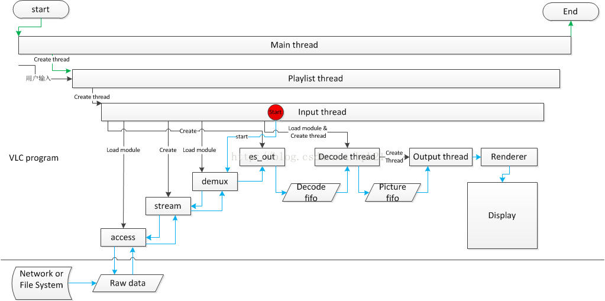

# VLC
- [VLC编译安装](#1)
- [VLC功能模块](#2)
- [VLC源码分析](#3)
- [VLC嵌入html](#4)

## <a id="1">VLC编译安装</a>
- [VLC编译安装](#1.1)
- [centos7命令行安装vlc](#1.2)


### <a id="1.1">VLC编译安装</a>
1.win32编译安装  
https://wiki.videolan.org/Win32Compile/  

2.vlckit  
https://wiki.videolan.org/VLCKit/#Sample_code  

3.VLCKit编译(IOS)  
https://www.cnblogs.com/Icewine/p/8353709.html    

ios安装  
https://wiki.videolan.org/iOSCompile    

4.安卓安装  
https://wiki.videolan.org/AndroidCompile/  

5.sdk  
http://tools.android-studio.org/index.php/sdk  

6.protobuf下载  
https://github.com/protocolbuffers/protobuf/releases  

### <a id="1.2">centos7命令行安装vlc</a>
安装方法：  
https://www.videolan.org/vlc/download-redhat.html  

yum install https://dl.fedoraproject.org/pub/epel/epel-release-latest-7.noarch.rpm  
yum install https://download1.rpmfusion.org/free/el/rpmfusion-free-release-7.noarch.rpm  
yum install vlc  

root 无法运行， 需要修改配置, 修改方法：  
```bash
cp /usr/bin/vlc  /usr/bin/vlc.bak
vim  /usr/bin/vlc 打开文件，把 geteuid 修改为 getppid
```

## <a id="2">VLC功能模块</a>
1.添加ssl   
https://dnsprivacy.org/wiki/display/DP/Building+HAProxy+so+that+it+can+use+TLSv1.3  

2.VLC架构及流程分析    
https://blog.csdn.net/hpb21/article/details/43271095   

```c+
playlist: playlist表示播放列表，VLC在启动后，即创建一个playlist thread，用户输入后，动态创建input。
input: input表示输入，当用户通过界面输入一个文件或者流地址时，input thread 被动态创建，该线程的生命周期直到本次播放结束。
access: access表示访问，是VLC抽象的一个层，该层向下直接使用文件或网络IO接口，向上为stream层服务，提供IO接口。
stream: stream表示流，是VLC抽象的一个层，该层向下直接使用access层提供的IO接口，向上为demux层服务，提供IO接口。
demux: demux表示解复用，是视频技术中的概念，该层向下直接使用stream层提供的IO接口，数据出来后送es_out。
es_out: es_out表示输出，是VLC抽象的一个层，该层获取demux后的数据，送decode解码。
decode: decode表示解码，是视频技术中的概念，获取es_out出来的数据(通过一个fifo交互)，解码后送output。
output: output表示输出，获取从decode出来的数据，送readerer。
readerer: readerer表示显示，获取从output出来的数据(通过一个fifo交互)，然后显示。
```



```c++
(1) main函数（vlc/bin/vlc.c）
参数信号处理相关，不详分析。
调用libvlc_new()初始化一个libvlc_instance_t实例。(libvlc_instance_t is opaque. It represents a libvlc instance)
2.1 调用libvlc_InternalCreate创建一个libvlc_int_t。(This structure is a LibVLC instance, for use by libvlc core and plugins.)
2.2 调用libvlc_InternalInit初始化libvlc_int_t实例。
2.3 初始化libvlc_instance_t其他成员。
调用libvlc_set_exit_handler设置VLC退出时的回调函数。
调用libvlc_add_intf添加模块。
4.1 获取playlist，如果为空，则调用playlist_Create创建一个playlist结构，并调用playlist_Activate创建新的playlist线程Thread(src/playlist/thread.c)。
4.2 调用intf_Create创建一个默认的interface。
4.2.1 调用vlc_custom_create创建一个vlc object(intf_thread_t)。
4.2.2 注册一个添加interface的回调方法。
4.2.3 调用module_need加载一个interface模块。
调用libvlc_playlist_play，如果播放列表不为空，并且被设置为自动播放，则播放播放列表内容。
信号处理相关，不详分析。
(2) 创建一个输入
初始化成功后，程序运行在playlist的线程Thread(src/playlist/thread.c)中，循环接收界面输入的请求。
当输入一个新的文件或者流地址，在PlaylistVAControl获得信号，并发送该信号。
Thread接收到播放请求后，在LoopRequest中调用PlayItem方法。
3.1 调用input_Create创建一个input结构，并初始化各种成员，其中包括调用input_EsOutNew创建p_es_out_display(es_out)。
3.2 调用input_Start创建一个input线程Run(src/input/input.c)。
(3) 初始化输入
调用Run(src/input/input.c)中的Init方法，开始初始化。

调用input_EsOutTimeshiftNew新建一个50M的Timeshift(暂停缓存)，包括创建并初始化p_es_out(es_out)，与后续步骤9相关。
设置input的状态为OPENING_S。
调用InputSourceInit。
3.1 调用input_SplitMRL分解输入uri。
3.2 以stream形参为NULL调用demux_New加载"access_demux"模块。
3.3 如果没有合适的"access_demux"模块，则调用access_New创建一个实际的access。
3.3.1 调用vlc_custom_create创建access_t结构体。
3.3.2 调用module_need加载合适的access模块。
3.3.3 调用access模块的Open*方法，以avio模块为例。
3.3.3.1 调用vlc_init_avformat初始化VLC即avformat环境。
3.3.3.2 调用avio_open2打开该uri。
3.3.3.3 设置access的IO方法指针。
3.4 调用stream_AccessNew创建一个stream。
3.4.1 根据模式（stream/block）设置steam层的IO方法指针。stream层的IO方法实际指向access层对应的IO方法指针。
3.4.2 为stream层的缓冲申请并初始化内存。
3.4.3 调用AStreamPrebufferStream执行一次读操作。
3.5 调用stream_FilterChainNew，Add stream filters（源码描述）。
3.6 调用demux_New创建一个demux。
3.6.1 调用vlc_custom_create创建demux_t结构体。
3.6.2 调用module_need加载合适的demux模块。
3.6.3 调用demux模块的Open*方法，以avformat/demux模块为例。
3.6.3.1 调用stream_Peek从stream层获取数据，用于分析输入的文件格式。
3.6.3.2 调用av_probe_input_format分析输入的文件格式。
3.6.3.3 设置demux_sys_t结构体部分变量的值。
3.6.3.4 调用avformat_alloc_context分配AVFormatContext结构体。
3.6.3.5 调用avio_alloc_context设置AVFormatContext结构体的AVIOContext类型成员pb，并设置read和seek方法指针。
3.6.3.6 调用avformat_open_input打开一个输入，这里的input与VLC中的input不是一个概念，关于avformat_open_input的分析详见我的另一篇文章《avformat_open_input详细分析》链接地址。
3.6.3.7 调用avformat_find_stream_info分析流信息，该方法通过读取数据初始化流以及流解码信息。
3.6.3.8 根据分析的流信息，设置fmt变量，并调用es_out_Add。
3.6.3.9 实际调用EsOutAdd(src/input/es_out.c)，添加一个es_out，有几个流就做几次es_out_Add操作，比如该输入中有一个视频流和一个音频流，则作两次es_out_Add操作。
3.6.3.10 nb_chapters相关未详细分析。
3.7 设置record相关。
3.8 调用demux_Control设置demux pts delay。
3.9 调用demux_Control设置fps。
调用demux_Control获取输入的长度。
调用StartTitle显示标题。
调用LoadSubtitles加载字幕。
调用LoadSlaves，含义不详。
调用InitPrograms，设置es_out和decoder相关。
8.1 调用UpdatePtsDelay计算正确的pts_delay值。
8.2 sout相关可选，暂不分析。
8.3 调用es_out_SetMode，设置es_out的mode为ES_OUT_MODE_AUTO。
8.4 以DEMUX_SET_GROUP指令调用demux_Control，DEMUX_SET_GROUP/SET_ES only a hint for demuxer (mainly DVB) to allow not reading everything。
续8.3，实际调用EsOutControlLocked进入case ES_OUT_SET_MODE分支。
9.1 设置es_out_sys_t 的b_active和i_mode。
9.2 调用EsOutSelect方法，根据指定模块选择一个es_out。
9.3 在EsOutSelect方法中进入ES_OUT_MODE_AUTO分支，进一步调用EsSelect方法，再进一步调用EsCreateDecoder方法创建decoder。
9.3.1 调用input_DecoderNew创建一个新的decoder。
9.3.2 如果需要缓存，调用input_DecoderStartWait发送信号，开始线程等待。
9.3.3 调用EsOutDecoderChangeDelay设置decode delay。
续9.3.1进入decoder_New方法。
10.1 调用CreateDecoder创建decoder配置结构体。
10.1.1 调用vlc_custom_create创建一个vlc object(decoder_t)。
10.1.2 新建decode fifo。
10.1.3 调用module_need加载适配的解码模块。
10.1.3.1 调用decode模块的OpenDecoder方法，以codec/avcodec模块为例。
10.1.3.2 调用GetFfmpegCodec方法 determine codec type（源码描述）。
10.1.3.3 调用vlc_init_avcodec方法初始化解码环境。
10.1.3.4 调用avcodec_find_decoder设置AVCodec。
10.1.3.5 调用avcodec_alloc_context3分配一个AVCodecContext。
10.1.3.6 调用Init*Dec系列初始化解码环境。
10.1.4 初始化decoder_t结构体其他成员。
10.2 调用vlc_clone创建解码线程DecoderThread。
续10.1.3.5，以InitVideoDec为例。
12.1 为decoder_sys_t结构分配内存。
12.2 设置相关回调方法。
12.3 设置解码线程类型。
12.4 调用ffmpeg_InitCodec初始化extradata相关数据。
12.5 调用OpenVideoCodec方法，设置解码的长宽及采用率，进一步调用avcodec_open2打开codec。
根据需要，设置线程优先级。
设置meta相关。
初始化完成，设置该input的状态为PLAYING_S。
(4) 播放输入
MainLoop(src/input/input.c)

调用MainLoopDemux访问demuxer去demux数据。
进一步调用在加载demux模块时设置的demux方法，同样以avformat/demux模块为例，实际调用Demux方法(module/demux/avformat/demux.c)。
2.1 调用av_read_frame读取一帧数据。
2.2 判断读取无误时，则为block_t结构分配内存，并将这一帧从AVPacket中拷贝至block_t结构中。
2.3 如果该帧是I帧，则设置I帧标致位。
2.4 时间戳处理相关，未深入分析。
2.5 根据需要调用es_out_Control设置PCR，未深入分析。
2.6 调用es_out_Send将这一帧数据发送给es_out。
2.7 调用av_free_packet释放这一帧数据。
调用es_out_Send后，实际调用EsOutSend(src/input/es_out.c)方法。
3.1 调用stats_Update更新相关状态，具体未详分析。
3.2 设置预读相关，如果需要预读，并且到的数据的pts小于预读需要的时间，则设置BLOCK_FLAG_PREROLL标志位。
3.3 检查sout mode，具体有sync 和async mode，异同未详细分析。
3.4 如果设置record，将数据dup后送decoder。
3.5 调用input_DecoderDecode将block_t的数据送至decode fifo中。
3.5.1 判断控制速度线程等待相关信息，具体未详细分析。
3.5.2 如果decode fifo超过最大长度，则清空重置decode fifo。
3.5.3 调用block_FifoPut将该block_t的数据压入decode fifo，并通知读取线程。
3.6 格式变化判断处理相关，未详细分析。
3.7 字幕处理相关，未详细分析。
续3.5进入decode read thread，即DecoderThread(src/input/decoder.c)。
4.1 调用block_FifoGet方法，从decode fifo中获取数据。
4.2 基于某些条件，发送停止等待消息给其他线程，未详细分析。
4.3 调用DecoderProcess方法开始decode a block。
4.4 判断输入流的格式，调用不同的方法，这里以视频流为例，调用DecoderProcessVideo方法。
4.5 packetizer相关为深入分析，在DecoderProcessVideo方法中进一步调用DecoderDecodeVideo方法。
续4.5调用pf_decode_video，这里以avcodec模块的decoder为例，即DecodeVideo(modules/codec/avcodec/video.c)方法，在该方法中，开始真正的解码。
5.1 如果在Demux中获取的流信息中包含新的extradata，并且原来的extradata数据为空，则调用ffmpeg_InitCodec初始化codec，如果b_delayed_open为true，则调用OpenVideoCodec重新打开codec。
5.2 调用av_init_packet初始化解码数据包。
5.3 调用avcodec_decode_video2解码数据。
5.4 调用av_free_packet释放内存。
5.5 计算pts值，返回解码后的数据。
5.6 如果opaque为空，则调用ffmpeg_NewPictBuf方法创建一个新的picture buffer。具体调用回调指针pf_vout_buffer_new指向的vout_new_buffer，进一步调用input_resource_RequestVout最终调用VoutCreate。
5.6.1 调用vlc_custom_create创建一个vlc object(vout_thread_t)。
5.6.2 调用spu_Create初始化sub picture unit。
5.6.3 调用vlc_clone创建一个output线程Thread(src/video_output/video_output.c)。
5.6.4 output线程循环调用vout_control_Pop，首次进入ThreadControl方法中，执行ThreadStart方向，创建picture fifo(p->decoder_fifo)。
pf_decode_video返回后，解码后的数据保存在p_pic中，进一步调用DecoderPlayVideo方法，在该方法中调用vout_PutPicture将解码后的数据压入picture fifo中。
当picture fifo中有数据后，vout线程调用ThreadDisplayPicture中的ThreadDisplayPreparePicture方法。
7.1 调用picture_fifo_Pop从picture fifo中获取解码后的数据。
7.2 如果延迟太大，并且设置延迟丢帧，则丢掉该帧数据。
调用ThreadDisplayRenderPicture显示图像。
```


## <a id="3">VLC源码分析</a>
- [VLC LIVE555音视频同步学习](#3.1)
- [VLC流程的分析](#3.2)

### <a id="3.1">VLC LIVE555音视频同步学习</a>
参考链接：  
1.VLC LIVE555音视频同步  
https://blog.csdn.net/DANFBAORE/article/details/85052461  

采样频率是指将模拟声音波形进行数字化时，每秒钟抽取声波幅度样本的次数。正常人听觉的频率范围大约在20Hz~20kHz之间，根据奈奎斯特采样理论，为了保证声音不失真，采样频率应该在40kHz左右。常用的音频采样频率有8kHz、11.025kHz、22.05kHz、16kHz、37.8kHz、44.1kHz、48kHz等，如果采用更高的采样频率，还可以达到DVD的音质，对采样率为44.1kHz的AAC音频进行解码时，一帧的解码时间须控制在23.22毫秒内。

一个AAC原始帧包含一段时间内1024个采样及相关数据，AAC音频帧的播放时间=一个AAC帧对应的采样样本的个数/采样频率(单位为s)。  
一帧 1024个 sample。采样率 Samplerate 44100KHz，每秒44100个sample, 所以根据公式   音频帧的播放时间=一个AAC帧对应的采样样本的个数/采样频率当前AAC一帧的播放时间是= 1024*1000000/44100= 22.32ms(单位为ms)  

LIVE555中音视频同步的处理部分：RTPSsource.cpp源码分析：   
noteIncomingPacket的实质是:将 RTP timestamp 转换为 'wall clock' time用于计算抖动，
每次接收到一个rtp包后，都会用此函数计算抖动。逻辑完全取决于系统时间的精确度，没有任何校正机制。
live555是在哪里实现时间校正的呢?答案是利用RTSP客户端(数据的接收者)利用RTCP返回的Sender Report,
然后利用其中的NTP Timestamp和RTP timestamp, 对fSyncTimestamp和fSyncTime进行校正。
实现音视频同步 (live555)总体思路是：把A/V的RTP时间戳同步到RTCP的绝对时间(NTP Timestamp)，实现A/V同步

使用接收到的数据包的RTP时间戳和与当前时间对应的RTP时间戳计算当前的“抖动”。（使用RTP规范中附录A.8中的代码。）
如果数据包的时间戳与前一包相同（这表示一个多数据包片段），或者被明确告知不使用这个数据包，则不使用该数据包。

网络抖动   
1、又称为包抖动（Packet delay variation）是由同一应用的任意两个相邻数据包在传输路由中经过网络延迟而产生；
在计算机网络中，抖动被用于描述包在网络中的传输延时变化。但这种描述不精确，正式描述应该是PDV（packet delay variation）网络延时变化。定义见于RFC 3393，IP Packet Delay Variation Metric for IP Performance Metrics (IPPM)，IETF (2002)
PDV 是评价一个网络性能的重要要素。具有固定传输延时的网络没有抖动。包抖动是包延时与平均传输延时的差值的平均值。  

计算方法：抖动率由相邻数据包延迟时间差除以数据包序号差得到；  
计算步骤：  
1.计算端到端延迟，就是指数据包的接收时间与发送时间之差；   
接收端节点N↓［2］收到数据包的时间减去发送端节点N↓［1］发出数据包的时间，就是端到端延迟，公式如下：  
端到端延迟＝数据包的接收时间－数据包的发送时间；  

2.抖动率＝（数据包P↓［j］的延迟－数据包P↓［i］的延迟）／（数据包P↓［j］的序号j－数据包P↓［i］的序号i）  
数据包P↓［j］的延迟＝数据包P↓［j］接收时间－数据包P↓［j］发送时间  
数据包P↓［i］的延迟＝数据包P↓［i］接收时间－数据包P↓［i］发送时间  

2、延迟和抖动  
延迟和抖动是网络性能的重要参数。  
延迟是不可避免的，而抖动是可以通过某些技术方案优化的，常见于缓冲技术  

> 校正程序  
实现音视频同步 (live555)总体思路是：
把A/V的RTP时间戳同步到RTCP的绝对时间(NTP Timestamp)，实现A/V同步
live555是在哪里实现时间校正的呢?
答案是RTSP Server利用RTCP返回的Sender Report, 然后利用其中的NTP Timestamp和RTP timestamp,
对fSyncTimestamp和fSyncTime进行校正。
通过Sender Report，分别对视频和音频的时间及时进行校正，即可保证视音频同步。

RTCP 的socket，初始化fRTCPInstance。  

### <a id="3.2">VLC流程的分析</a>
参考链接：  
1.VLC流程的分析  
https://blog.csdn.net/baohonglai/article/details/46475141  

#### 模块的初始化
```cpp
libvlc_new 函数初始化
libvlc_InternalInit函数调用module_InitBank ()初始化一个成员为module_t的结构体链表。
libvlc_InternalInit 调用module_LoadPlugins会加载进现有的modules。
module_LoadPlugins 调用module_InitStaticModules函数从vlc_static_modules数组中开始加载，vlc_static_modules保存的
是每个modules的入口的函数指针。
vlc_static_modules的取得，不同的平台取得的方法不同，以IOS为例，通过aggregateStaticPlugin.sh脚本遍历modules目录下的
静态库，生成一个函数指针列表，如vlc-plugins.h中的int vlc_entry__http (int ()(void , void , int, …), void ); 然后
该脚本还会根据这个列表生成vlc_static_modules数组，里面的成员都是这种函数指针的声明符，如下，这只是代码片段
const void * vlc_static_modules [] = {
vlc_entry__http,
vlc_entry__httplive，
NULL
};
有了例如vlc_entry__http 这样的声明符，如何与每个module模块对应起来呢？首先，像vlc_entry__http这样的只是声明符，并没
有实际的地址，所以，需要对应的模块定义一个与该名字相同的函数名，这样就能调用了。在例如http.c文件中都有一个
vlc_module_begin ()宏，该宏的具体定义在vlc_plugin.h中，它的定义了每个模块对应一个入口函数。
module_InitStaticModules函数会遍历vlc_static_modules数组，调用每个模块的入口函数，加载每个模块的相关信息。值得注意
的信息有，会加载模块的描述信息，简称，以及注册回调函数（open，close）。
```

#### 模块的调用
```cpp
模块的调用，只有在需要的时候才调用，不需要以后就可以移除掉了。下面我们以http模块的调用为例，介绍它的流程。
1. 视频首次播放时调用libvlc_media_player_play()，然后调用Input_create()以及input_start()。
2. 在input_start()里会调用vlc_clone()创建一个子线程来管理播放器的流程控制，子线程的入口是run()函数，run()会调用
init()进行初始化,init()会调用InputSourceInit()函数。
3. 在InputSourceInit函数中，首先调用input_SplitMRL()函数解析出视频URL的获取方法如file,或者http，域名，文件路径
等。然后调用access_New()，初始化一个access的对象进入到获取视频的阶段。
4. 在access_New()中，会调用module_need()函数开始加载模块，参数会传入http字符串代表模块的名字。
5. 调用vlc_module_load(obj, cap, name, strict, generic_start, obj)，在这里多传入了一个generic_start函数指针
，在vlc_module_load函数中通过模块名字的简称进行匹配，查找加载什么模块，查找的方法，就是遍历链表。查找到以后就调用module_load (obj, cand, probe, args)这里的probe就是前面的generic参数，在该函数中会调用probe也就是前面的
generic将模块的m->pf_activate激活，而每个模块的m->pf_activate就是每个模块的注册时
(vlc_module_set (VLC_MODULE_CB_OPEN, activate)都是注册的open函数指针，就这样，就加载进了http模块。
```

#### 程序启动初始化
```cpp
程序的初始化会相继调用两个函数libvlc_new()，libvlc_media_player_new()。后者必须以前者的实例为基础。
先来看看libvlc_new()，它在core.c中，返回的是一个libvlc_instance_t的实例。它会调用libvlc_InternalInit()
进行初始化和静态模块的注册，主要进行的初始化有：系统环境的初始化，modules的初始化，日志系统的初始化，
modules的加载，然后创建了很多变量，大多数与vlc除了播放以外的相关。
再看看libvlc_media_player_new()函数，首先以前面返回的libvlc_instance_t为基础创建一个对象，然后再创建很多
与播放相关的variable_t类型的变量。这种变量贯穿了整个程序，variable_t是一个结构体，里面包含了一个callback。
用于变量变化的时候调用，后面基本上所有的状态的改变都是以改变这种变量从而调用callback实现的。然后继续初始化
eventManager。用于event的处理。最后调用register_event 注册消息。
```

#### 播放
```cpp
播放的流程比较特殊，分为首次播放和暂停后的播放。因为视频开始播放后，会另起一个线程来控制对象的状态，主线程将直接返回，
去接收另外的信息。

播放是调用libvlc_media_player_play()，在该函数中，首先判断input.p_thread是否为空，如果为空表示是首次播放，如果不
为空，直接调用input_Control()播放视频。因为目前视频是第一次播放，所以必为空，那么将调用input_Create()函数，它实际
是调用input_thread_t *Create()函数，来创建一个input_thread_t的对象，并初始化其中的对象，值得注意的是p_input->p->p_es_out_display = input_EsOutNew( p_input, p_input->p->i_rate );该p_es_out_display将在后面作为
真正传入数据到decoder的容器。

调用var_AddCallback注册播放过程中一些必要的回调函数。然后调用input_Start()开始播放流程。

input_Start()会新起一个线程，来处理轮循播放，原线程返回。子线程的入口在run()。Run函数首先调用init()函数初始化线
程对象input_thread_t *p_input。在init()函数中，会初始化跟视频相关的信息如视频meta, InitStatistics()会初始化统
计数据等等，值得注意的是，会调用InputSourceInit()函数，在前面模块的加载中讲到，在该函数中会分析视频url，并加载http
模块，开始下载数据。然后进入了无线循环模式，MainLoop函数。

4.在MainLoop函数中，每次循环都会首先会判断是否暂停了，如果没暂停且没有到视频末尾，就调用MainLoopDemux()函数进入
解封装。

5.在MainLoopDemux()函数中调用demux_Demux( p_input->p->input.p_demux );开始解封装，其中
p_input->p->input.p_demux的创建是在前面InputSourceInit中创建的
in->p_demux = demux_New( p_input, p_input, psz_access, psz_demux,
p_stream->psz_path ? p_stream->psz_path : psz_path,
p_stream, p_input->p->p_es_out,
p_input->b_preparsing );参数中涉及到p_stream也是在InputSourceInit函数中创建的
stream_t *p_stream = stream_AccessNew( p_access, ppsz_input_list );
p_access的创建也是在这时创建的access_t *p_access = access_New( p_input, p_input,
psz_access, psz_demux, psz_path );。

6.此时问题来了，视频demux需要的数据到底从何而来呢？

7.此时我们进入access_New()函数中，该函数首先创建了一个stream_t对象，然后注册一些流控制的回调函数，调用了AStreamPrebufferStream( s );在该函数中调用了AReadStream()函数，在这个函数中调用了
p_access->pf_read( p_access, p_read, i_read )函数，这是p_access的一个读取数据的回调函数。
p_access->pf_read在access_New的时候会被初始化为null。它具体的赋值是在加载具体的modules后赋值的，
如http.c中p_access->pf_read = ReadCompressed。也就是说再stream.c中的AReadStream()函数会调用http.c
中的ReadCompressed来读取数据。

8.前面说了access_New()中会调用AStreamPrebufferStream( s )从http模块读取数据，也就是说stream *s中就
存有数据了。现在回到解封装函数demux_Demux()中，在该函数中实际调用的是p_demux->pf_demux( p_demux )，
又是一个函数指针，它的赋值与access->pf_read的赋值极其相似，在创建的时候demux_New()中赋值为NULL。它的
具体的赋值是在具体的模块加载的时候赋值的，具体的加载时在demux_New()中，它会根据url的后缀名，具体加载
哪个模块，假设是mp4文件，则加载mp4模块。在mp4.c的open()函数中会有p_demux->pf_demux = Demux;那么
demux_Demux()函数会从input.c进入到mp4.c文件中。那么现在调用了mp4.c中的demux()函数了MP4_Block_Send()
函数，它实际又调用了es_out_Send( p_demux->out, p_track->p_es, p_block )函数，es_out_send实际调用了
out->pf_send( out, id, p_block )函数，这又是一个函数指针。

out->pf_send函数指针，它具体的值到底是什么呢，这又得一步一步回溯，首先传入得参数是p_demux->out，
p_demux->out的赋值是在demux_new函数中，在该函数中p_demux->out = out;它的实参是在实际调用时传入的
p_input->p->p_es_out。我们知道在p_input结构体中有两个es_out类型的结构体p_es_out和p_es_out_display。
它们两个的构建和左右都不相同，具体怎么不同呢，后面就能看出来了，回到原来的地方，在demux_new中，我们传入
的是p_es_out这个参数，它的构造是调用的p_input->p->p_es_out = input_EsOutTimeshiftNew( p_input, p_input->p->p_es_out_display, p_input->p->i_rate );从代码可以看出它是在es_out_Timeshift.c中
EsOutTimeshiftNew构造的，并传入了p_es_out_display作为参数。在该函数中，给p_es_out的pf_send具体赋值
了，p_out->pf_send= Send，所以回到前面es_out_send调用的out->pf_send( out, id, p_block )函数，它的
函数指针是es_out_timeshift.c文件中的静态函数send()。那我们在深入到send()函数中，它调用了
CmdExecuteSend( p_sys->p_out, &cmd)函数，继而又调用了
es_out_Send( p_out, p_cmd->u.send.p_es->p_es, p_block )函数，我们知道es_out_send实际调用
的是p_out->pf_send函数，这又是一个函数指针。

那么这个pf_send具体又是哪个函数，我们利用前面的回溯方法，继续向前搜索会发现，这个参数p_out是前面的传
入的p_es_out_display，而p_es_out_display它的初始化是在input.c里面的create函数中
p_es_out_display = input_EsOutNew( p_input, p_input->p->i_rate )，input_esOutNew是es_out.c文
件中，在该函数赋值了out->pf_send = EsOutSend。所以回到前面CmdExecuteSend( p_sys->p_out, &cmd)实
际调用了es_out.c文件中的esOutSend函数，在esOutSend函数中，调用了input_DecoderDecode()函数开始解码
流程。

在进入input_DecoderDecode()函数后，我们发现并没有看到解码的操作，只有一个block_FifoPut()，该函数的
左右是将一个block数据添加到一个FIFO队列末尾。那到底哪里才是解码操作呢，此时我们看看
input_DecoderDecode( es->p_dec, p_block,p_input->p->b_out_pace_control );函数的参数，p_dec是一
个decoder的结构体，它的构建在前面，我们继续追溯。发现在mp4.c文件中，open()函数会调用MP4_TrackCreate()函数
，继而调用TrackCreateES()函数，它会调用es_out_Add，它会经过es_time_shif.c最终调用es_out.c的EsOutAdd函数
，会通过EsOutSelect-> EsSelect-> EsCreateDecoder-> input_DecoderNew。input_DecoderNew是decoder.c里面
的函数，它实际调用的是decoder_New()函数，它会调用CreateDecoder函数创建一个decoder_t的结构体并根据解码的需
要加载具体的解码模块，然后开启一个线程处理解码的操作，线程的入口是DecoderThread()函数，它调用DecoderProcess
函数，该函数会根据数据是什么类型的数据分别调用不同的解码流程，我们以视频数据为例，它会调用DecoderProcessVideo
函数，继而调用DecoderDecodeVideo函数，它又会调用p_dec->pf_decode_video函数进行解码，这又是一个函数指针，它
的赋值是在具体的解码模块中赋值的。具体解码后的数据流向，暂时还没有调研。

经过前面11个步骤的说明，现在可以小结一下了，视频数据的整体流向已经很清晰了，首先通过access的模块如http从网络
上下载数据经过stream.c的处理传递给demux模块做解封装的处理，解封装后的数据最终会发送给es_out.c处理，并发给你
decoder模块做解码操作。具体解码后的数据的流向，暂时没有了解，留到后面再了解。
```

#### 暂停
```cpp
解析完播放，我们再来看看暂停是如何控制的，从暂停操作，就可以看出所有的控制流程的框架。
1. 暂停的控制首先在media_player.c文件中调用libvlc_media_player_set_pause，该函数首先会判断是否正在播放或
正在缓冲，然后调用input_Control( p_input_thread, INPUT_SET_STATE, PAUSE_S )函数进行控制，该函数是在
control.c中，它会根据传入的控制命令，调用return var_SetInteger( p_input, “state”, i_int );后就直接返回了。
从input_control函数代码中可以看出，几乎所有的控制，状态的取得都是通过get和set p_input的变量实现。首先需要找
到这些变量的创建在什么地方，它是在input.c文件中的create()函数中的input_ControlVarInit()函数中创建的
var_Create( p_input, “state”, VLC_VAR_INTEGER );它创建了一个variable_t类型的结构体，里面有一个callback的
成员，会调用InputAddCallbacks( p_input, p_input_callbacks );函数将state变量与StateCallback回调函数绑定起来。

现在回到var_SetInteger( p_input, “state”, i_int )函数，它会调用var_SetChecked函数，从而调用TriggerCallback
函数触发回调函数StateCallback。该函数会调用input.c文件中的input_ControlPush函数。这里需要提到的是在input.c中
的控制的实现是使用FIFO的方式来管理控制命令的，又input_controlpush将控制命令压入FIFO队列中，然后由mainloop循环
调用controlpop函数，将控制队列的函数弹出来。

controlpop调用后，如果队列中有命令执行，就会调用control函数，该函数中会根据不同的命令调用不同的处理函数，对于
暂停命令，就会调用ControlPause函数，同时还会调用input_ChangeState函数改变state的状态反馈给上层。同时改变p_input->p->i_state为pause状态，那么mainloop的循环就不会再调用demux模块的解封装函数了，就不会再有视频数据流
向es_out。在controlPause函数中，会首先调用stream_Control在stream.c，调用相应的access模块暂停，然后调用es_out_SetPauseState在es_out.c层面，同时通知decoder.c的层面的控制。

到此为止，暂停操作的流程可以总结一下。暂停的操作，首先通过改变state变量来触发callback函数，同时改变
p_input->p->state状态，让主循环来暂停解封装的操作，停止数据继续解封装和解码，同时调用access,stream,
es_out,decoder各个层面的control让暂停操作。其余的控制，流程大致跟暂停差不多。
```

#### 线程的创建
```cpp
我们假设libvlc的创建和启动是在主线程里，那么后面新起的线程都是子线程，下面介绍每个线程的具体任务。
主线程：负责创建libvlc对象，初始化，同时主线程也会接收来自上层的所有控制指令play,pause，将指令调用controlpush
函数压入到FIFO队列中等。
子线程1，可以简称input线程，它是由主线程在第一次play的时候创建的，在Input_start函数里，会创建一个input线程，入
口是run函数，它的任务主要是不断的循环，调用解封装函数，促进数据的流动，让数据从网络到内存，再解封装，解码。同时不
断的反馈具体的状态信息到主线程上。
子线程2. 可以简称hls线程，在httplive.c里面创建，vlc_clone(&p_sys->thread, hls_Thread, s, VLC_THREAD_PRIORITY_INPUT)。主要任务，没有详细了解，我猜想应该是负责解析m3u8文件，读取具体的ts流。
子线程3.简称decoder线程，它是Input线程在decoder_New函数中创建的，它也是一个无限循环，从一个FIFO的队列中不断的取
出数据送去解码。这就是它的主要任务。
```

#### 线程的同步
```cpp
目前为止，有了4个线程，必然涉及到对共享变量的同步互斥机制，下面进行简单的分析。
采用的同步互斥主要有两种方法，锁和条件变量
锁，vlc_mutex_lock( &p_input->p->p_item->lock );
因为这几个线程共享的一个对象是p_input。它是input_thread_t类型的结构体，所以每次更改状态时都会锁住它。
条件变量：vlc_cond_timedwait和vlc_cond_signal。这是同步的时候需要用到的，比如controlpush和controlpop命令的压
入和弹出的时候，
```

#### Stream.c模块的分析
```cpp
1.首先是创建一个stream的对象，调用的是stream_AccessNew函数，在该函数中会设置pf_read，pf_peek，pf_readdir，
pf_control。并且，在stream_AccessNew中，会给stream.p_buffer分配3个track一共12MB的空间，每个tack拥有4MB的空间，
就目前分析来看，实际上只用到了1个track也就是4MB的空间，至于其他两个track到底有什么用还不清楚，并初始化一次读取数据
的量stream.i_read_size为1024。并且还会调用AStreamPrebufferStream( s )函数，对stream进行预填充，下面进行详细的分
析AStreamPrebufferStream( s )加载数据的机制。
2. AstreamPrebufferStream函数中，该函数会循环调用AreadStream函数读取最小128字节的数据，不过默认第一次是读取
i_read_size的数据，看实际的读取量而定，这是预填充的数据。
2.在流程分析中提到，mainloop里面有个无线循环会不断的调用demux函数，而在每个demux函数中会不断的调用MP4_Block_Read，
从而调用stream_Block，再调用stream_Read，它实际上是调用pf_read函数，它是指向AstreamReadStream函数。
```

#### 代码流程流程
```cpp
动态加载模块
lib/core.c(libvlc_new)  -> 模块初始化 lib/libvlc.c(libvlc_InternalInit libvlc_InternalCreate) ->加载模块 src/modules/bank.c(module_LoadPlugins)
调用模块
lib/media_player.c() -> src/input/input.c(input_Create)  ->  src/input/input.c(input_Start) ->  起了线程clone src/input/input.c(Run)  -> 初始化 src/input/input.c(Init) ->InputSourceNew -> input_SplitMRL-InputDemuxNew -> src/input/access.c(stream_AccessNew) -> access_New -> module_need ->src/modules/modules.c(vlc_module_load)
解复用大致流程
src/input/input.c(MainLoop) ->  MainLoopDemux -> demux_Demux -> modules\demux\mp4(open) -> Demux
解复用之后挂es流程函数指针
rc/input/input.c(Init) -> src/input/es_out_Timeshift.c(input_EsOutTimeshiftNew)
es之后待用编解码
src/input/es_out_Timeshift.c(input_EsOutTimeshiftNew) -> send -> CmdExecuteSend -> es_out_Send这个函数钩子是在ipcreate->created的钩子p_es_out_display->input_EsOutNew->EsOutSend挂的钩子，到src/input/es_out.c(EsOutSend) -> input_DecoderDecode
src/input/es_out_Timeshift.c(input_EsOutTimeshiftNew) -> send -> CmdExecuteSend -> es_out_Send这个函数钩子是在ipcreate->created的钩子p_es_out_display->input_EsOutNew->EsOutSend挂的钩子，到src/input/es_out.c(EsOutSend) -> input_DecoderDecode
input_EsOutTimeshiftNew -> add ->编解码 modules\stream_out\display.c input_DecoderCreate  ->  decoder_New 
暂停播放
lib/media_player.c(libvlc_media_player_set_pause) -> input_Control 其中的状态通过Create中的input_ControlVarInit初始化的 var_SetChecked -> TriggerCallback input_ControlPush 压入FIFO队列 通过controlpop和解复用一样都是在mainloop循环里面不停的循环的。
```

## <a id="4">VLC嵌入html</a>
参考链接：  
1.VLC在web系统中应用  
https://blog.csdn.net/luckypeng/article/details/62044631?ops_request_misc=&request_id=&biz_id=102&utm_source=distribute.pc_search_result.none-task-blog-2~all~sobaiduweb~default-2  

2.在web页面中播放rtsp直播数据流方法  
https://blog.csdn.net/wuyongde_0922/article/details/81503967  

3.VLC媒体播放器Web插件详细说明   
https://blog.csdn.net/jxbinwd/article/details/83615203  

4.VLC WebPlugin中文  
https://blog.csdn.net/weixin_30716141/article/details/94853381?ops_request_misc=&request_id=&biz_id=102&utm_source=distribute.pc_search_result.none-task-blog-2~all~sobaiduweb~default-1  

### rtsp流在浏览器中播放方法
#### 1.视频播放功能使用的库(WebChimera.js)
https://github.com/RSATom/WebChimera.js  
https://gitter.im/RSATom/WebChimera  

#### 2.wcjs-player（目前项目使用的就是此）
wcjs-player是一个封装了WebChimera.js的播放器。一些播放器的基本的样式已经做好，不需要重新编写播放器样式。  
https://github.com/jaruba/wcjs-player  

#### 3.使用h5stream（不支持h265）
https://github.com/liweilup/h5stream

1.下载源码下来进行编译，编译出可执行文件以后执行 ./h5ss rtsp://192.168.0.1/stream1 admin admin 起服务。  
    ./h5ss RTSPURL username password  (username和password可以填空)  
2.http(https)://localhost:8801(8843) 连接此服务即可播放  

#### 4.使用npapi-vlc
npapi在linux中的交叉编译  
https://blog.csdn.net/u011573853/article/details/78429557  
https://wiki.videolan.org/Documentation:WebPlugin/  

## links
  * [目录](<音视频入门到精通目录.md>)