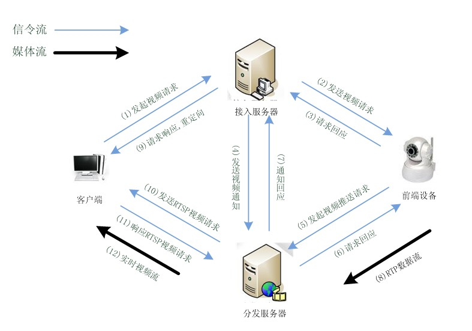
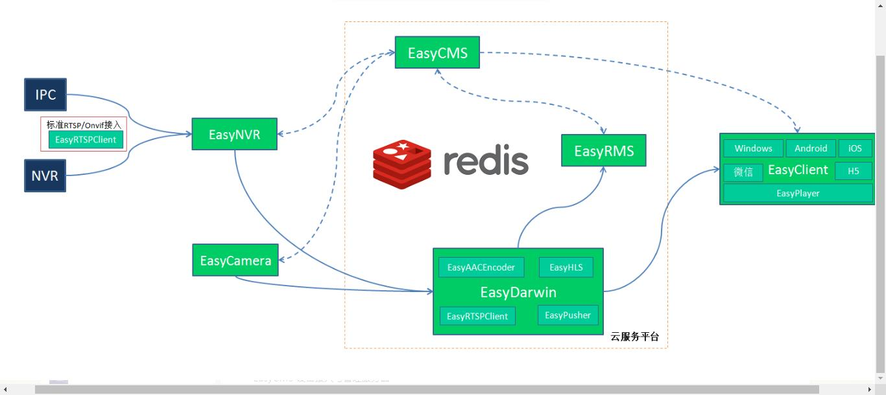

# 5.EasyDSS
- [基于Darwin实现的分布式流媒体直播服务器系统](#1)
- [EasyDarwin开源流媒体云平台设计与实现(分布式+负载均衡)](#2)

## <a id="1">基于Darwin实现的分布式流媒体直播服务器系统</a>
参考链接：  
1.基于Darwin实现的分布式流媒体直播服务器系统    
https://blog.csdn.net/xiejiashu/article/details/14103231   

设备接入服务：在大部分的分布式服务器中，接入服务器常常属于被动接入形式，当然也有接入服务器主动接入配置的前端设备，这里我们按照接入服务器被动接收设备注册的方式介绍。按照被动的设备注册方式，设备在接入到服务器后，会与接入服务器建立一个交互的会话，以TCP方式进行连接并发送保活包，那么我们可以在原有DSS的RTSPSession基础上进行改造，改成属于自定义协议的交互流程，底层的网络读取与发送结构完全一致，只需要修改上层对收到的报文的处理，那么对于多路会话的维护也可以直接用原来对RTPSession列表的维护方式，改写Hash表fMySessionMap，用GetMySessionMap()从服务器主体获取，Hash表的主键可以按照自定义协议里的唯一标识进行，如前端设备的ID、ip等等。自定义协议部分就只需要参考DSS对RTSP的处理，改成自己的协议处理（文本协议、字节流协议）就搞定了！

      视频分发服务：分发服务器的修改就方便了，如果还是按照RTSP的方式进行流媒体发布，那基本就不需要修改了，直接用DSS在QTSSReflectorModule中已经有的被动接收推送的方式进行转发就可以了，设备在收到接入服务的媒体开始命令后，立即推送视频到DSS分发服务，通过DSS已有的RTSP Announce、Setup、Play、RTP流程推送媒体数据，DSS再将媒体数据分发到客户端列表中（具体流程参见：http://blog.csdn.net/xiejiashu/article/details/8298583）！

      设备端：如果设备协议也是自己定义的，那也方便了，我们用live555嵌入到设备（如IpC，硬盘录像机等）中，在live555中先定义一个RTSPClient，连接保活到接入服务，通过此条连接与接入服务始终保持通信，那么接入服务通过此条tcp发出开始视频的命令时，live555再开启另一条RTSPClient，通过live555已有的DarwinInjector类，经过RTSP Announce、Setup、Play、RTP过程，将流注入到DSS中，在接入发出停止命令时，终止DarwinInjector的流注入，发出RTSP Teardown到DSS，停止媒体传输！

      客户端：标准RTSP流程，不需要修改，客户端先请求到接入服务，接入服务发出RTSP 重定向的响应到客户端，重定向地址为分发服务的地址，客户端再转而去请求分发服务，这时候，分发服务已经获取到了设备推送来的媒体流，转发给客户端，整个流程就ok了！

附上整个过程的流程图：

## <a id="2">EasyDarwin开源流媒体云平台设计与实现(分布式+负载均衡)</a>
参考链接：  
1.EasyDarwin开源流媒体云平台设计与实现(分布式+负载均衡    
https://blog.csdn.net/xiejiashu/article/details/51581003  

《基于Darwin实现的分布式流媒体直播服务器系统》，当时的考虑如今看来有诸多的细节点没有考虑到：  
1、CMS是单点部署，无法扩展设备注册节点服务器；  
2、EasyDarwin流媒体服务器虽然可以分布式部署，但负载信息都是以Hash map的形式存在CMS的内存中的，EasyDarwin与CMS保持着长连接信令交互，这种形式只能够实现功能，但在架构扩展性上还是有太多瓶颈；  
3、协议采用的是RTSP协议及其扩展字段来做的，协议对现在流行的平台无关和移动端都不是很友好；  

全新的EasyDarwin流媒体云平台，突出云平台的概念，无论是EasyCMS设备管理与接入服务器，EasyDarwin流媒体服务器，还是后续要扩展的EasyRMS录像存储服务器，都能够分布式、平行部署、无限扩容，云端各个节点的服务单元都将负载信息写到共享的redis中进行数据共享，EasyCMS将在线设备相关信息写入到redis，EasyDarwin将负载信息和流媒体直播相关信息写入redis，这样在多个EasyCMS、EasyDarwin之间就可以进行直播级联，Session共享，Token验证等功能，框架图：

EasyDarwin开源流媒体云平台在2016.06.01发布了第一版，这个版本架构涉及四个方面的单元：  

EasyCMS 设备接入与管理服务器  
EasyDarwin 流媒体服务器  
EasyCamera 摄像机  
EasyClient 客户端  

1. EasyCamera 摄像机硬件在启动后，启动EasyCamera进程，向EasyCMS平台发送注册报文，并定期发送保活报文，维持摄像机与EasyCMS平台的TCP长连接；

2. EasyCMS会对EasyCamera发送的注册报文进行权限验证，将验证通过的设备相关信息写入到redis中，包括设备所在的EasyCMS的信息关联写入redis；

3. EasyClient向EasyCMS请求具体设备直播流，EasyCMS会在第一步在redis中查找设备是否在线，第二步会查找该设备是否已经存在流媒体转发信息，如果存在，则直接将改直播流信息响应给EasyClient，如果不存在，EasyCMS需要向EasyCamera发送启动直播流推送的命令，EasyCMS再将EasyCamera反馈的结果响应给EasyClient，EasyClient根据收到的结果进行播放；

4. EasyDarwin在接收到EasyCamera直播推送后，将该设备的直播流信息写入到redis中，这样就方便第3步中EasyCMS直接对设备直播流信息进行检索；

5. EasyDarwin会定期检查设备直播流的客户端数量检查，当设备的Output数量由 > 0 减为0，或者在EasyDarwin内部巡检中发现规定事件内没有客户端请求，EasyDarwin会向EasyCMS发送设备直播流释放请求，EasyCMS再通过信令发送给EasyCamera，停止EasyCamera向EasyDarwin推送直播流；

## links
  * [目录](<音视频入门到精通目录.md>)