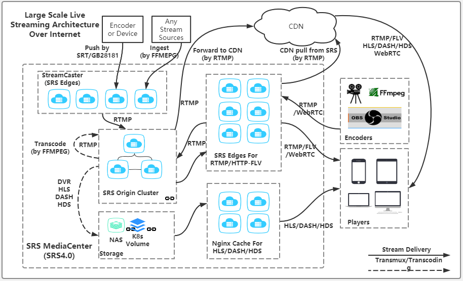
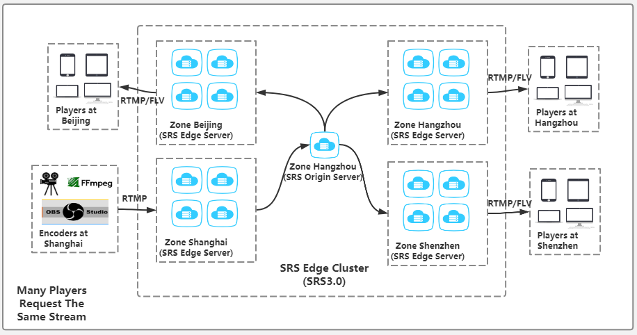
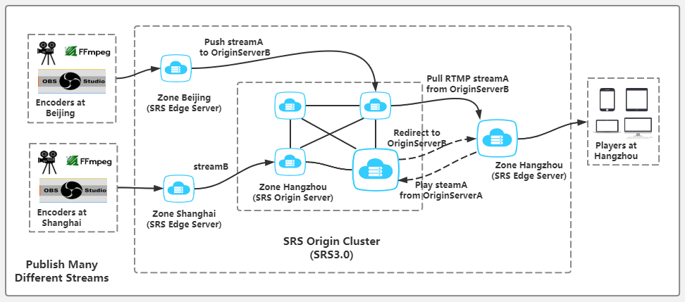
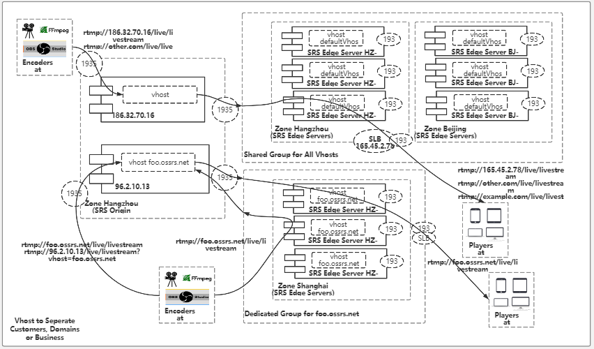

# 6.SRS
- [srs介绍和简介](#1)
- [简单安装使用](#2)
- [国标安装使用](#3)
- [部署SRS提供RTMP和HLS服务](#4)
- [部署SRS分发FLV流](#5)
- [部署SRS分发HDS流](#6)
- [部署SRS分发DASH流](#7)
- [部署SRS支持SRT流](#8)
- [部署SRS对直播流转码](#9)
- [直播流截图](#10)
- [部署SRS转发RTMP流到其他服务器](#11)
- [部署SRS为低延迟模式](#12)
- [将其他流拉到SRS作为RTMP流](#13)
- [部署SRS为HTTP服务器](#14)
- [SRS支持WebRTC播放流](#15)
- [SRS支持SRT推流](#16)
- [SRS支持H.265编码格式](#17)


参考链接：   
1.srs 3.0中文教程     
https://github.com/ossrs/srs/wiki/v3_CN_Home   

2.srs 4.0中文教程    
https://github.com/ossrs/srs/wiki/v4_CN_Home    

3.srs wiki     
https://github.com/ossrs/srs/wiki    

4.srs document    
https://github.com/ossrs/srs/wiki/v4_CN_Docs    
 


## <a id="1">srs介绍和简介</a>
SRS定位是运营级的互联网直播服务器集群，追求更好的概念完整性和最简单实现的代码。SRS提供了丰富的接入方案将RTMP流接入SRS， 包括推送RTMP到SRS、推送RTSP/UDP/FLV到SRS、拉取流到SRS。 SRS还支持将接入的RTMP流进行各种变换，譬如将RTMP流转码、流截图、 转发给其他服务器、转封装成HTTP-FLV流、转封装成HLS、 转封装成HDS、转封装成DASH、录制成FLV/MP4。SRS包含支大规模集群如CDN业务的关键特性， 譬如RTMP多级集群、源站集群、VHOST虚拟服务器 、 无中断服务Reload、HTTP-FLV集群。此外，SRS还提供丰富的应用接口， 包括HTTP回调、安全策略Security、HTTP API接口、 RTMP测速。SRS在源站和CDN集群中都得到了广泛的应用Applications。   

通过配置conf中文件进行配置流媒体服务器。[架构图](https://www.processon.com/view/link/5e3f5581e4b0a3daae80ecef)

 

 

 

 

### V3与V4版本功能差异
| V4                                           | V3                                           |
| -------------------------------------------- | -------------------------------------------- |
| Delivery RTMP: 如何部署SRS提供RTMP服务。 | Delivery RTMP: 如何部署SRS提供RTMP服务。 |
| Delivery HLS: 如何部署SRS提供RTMP和HLS服务。 | Delivery HLS: 如何部署SRS提供RTMP和HLS服务。 |
| Delivery HTTP FLV: 如何部署SRS分发FLV流。 | Delivery HTTP FLV: 如何部署SRS分发FLV流。 |
| Delivery HDS: 如何部署SRS分发HDS流。 | Delivery HDS: 如何部署SRS分发HDS流。 |
| Delivery DASH: 如何部署SRS分发DASH流。 | Delivery DASH: 如何部署SRS分发DASH流。 |
| Transmux SRT: 如何部署SRS支持SRT流。 | Transcode: 如何部署SRS对直播流转码。 |
| Transcode: 如何部署SRS对直播流转码。 | Snapshot: 如何对直播流截图。        |
| Snapshot: 如何对直播流截图。        | Forward: 如何部署SRS转发RTMP流到其他服务器。 |
| Forward: 如何部署SRS转发RTMP流到其他服务器。 | Low latency: 如何部署SRS为低延迟模式。 |
| Low latency: 如何部署SRS为低延迟模式。 | Ingest: 如何将其他流拉到SRS作为RTMP流。 |
| Ingest: 如何将其他流拉到SRS作为RTMP流。 | HTTP Server: 如何部署SRS为HTTP服务器。 |
| HTTP Server: 如何部署SRS为HTTP服务器。 | SRS DEMO: 如何启动SRS的DEMO。          |
| SRS DEMO: 如何启动SRS的DEMO。          | Projects: 都有谁在使用SRS。           |
| Projects: 都有谁在使用SRS。           | Setup: SRS安装和部署摘要。           |
| Setup: SRS安装和部署摘要。           |                                              |
| WebRTC Play: SRS支持WebRTC播放流。     |                                              |
| GB28181 Publish: SRS支持GB28181推流。   |                                              |
| SRT Publish: SRS支持SRT推流。           |                                              |
| HEVC/H.265: SRS支持H.265编码格式。    |                                              |

## <a id="2">简单安装使用</a>
官网提供了3种安装方式： 从[源码编译安装](https://github.com/ossrs/srs#usage)、[利用docker](https://github.com/ossrs/srs-docker/tree/centos#usage)、[直接下载安装包安装](http://ossrs.net/srs.release/releases/)。    

简单安装使用采用，直接使用发布版本进行验证使用。  先从官网下载最新的稳定发布版本(目前是2.0r6)。[下载地址](http://ossrs.net/srs.release/releases/files/SRS-CentOS6-x86_64-2.0.263.zip)。  

```shell
执行下面的命令安装：
sudo ./INSTALL

如果出现No package lsb_release available. 的错误提示（centos 7上容易出现这个错误），可尝试先安装 
yum install -y redhat-lsb
tips: 如果要卸载，可执行以下命令（前提是先停止srs）
sudo rm -rf /usr/local/srs
sudo rm -rf /etc/init.d/srs

启动
sudo /etc/init.d/srs start
停止
sudo /etc/init.d/srs stop
类似的，除了start/stop，还有其它选项，比如：reload|status

启动后可以采用ffmpeg推流
ffmpeg -rtsp_transport tcp -i rtsp://42.101.40.177:10236/stream1 -c copy -f flv -y rtmp://139.196.137.60:1935/live/livestream   
ffmpeg -re -i 20190329203822.mp4 -vcodec copy -codec copy -f flv -y rtmp://139.196.137.60:1935/live/livestream
```

## <a id="3">国标安装使用</a>
参考连接：   
1.国产开源流媒体SRS4.0对视频监控GB28181的支持  
https://mp.weixin.qq.com/s/VIPSPaBB5suUk7_I2oOkMw   

2.国标编译    
https://github.com/ossrs/srs/issues/1500    

3.http控制   
https://github.com/xialixin/srs_code_note/blob/master/doc/srs_gb28181.md    

### 1.拉取与编译
```cpp
git clone https://gitee.com/winlinvip/srs.oschina.git srs &&

cd srs/trunk &&

git remote set-url origin https://github.com/ossrs/srs.git &&

git pull

git checkout develop &&

./configure --with-gb28181 &&

make clean && make
```

### 1.配置SRS的配置文件push.gb28181.conf
基本配置不用变，host地址要填摄像机能连上来的地址，填云服务器的外网地址，同时该地址也是RTMP或者HLS等拉流协议的外网地址，当然摄像机和SRS都在局域网也是可以的。

```conf
# push gb28181 stream to SRS.

listen                  1935;//rtmp播放地址后面的端口号
max_connections         1000;
daemon                  off;
srs_log_tank            console;

http_api {
    enabled         on;   //开启国标 http api 控制接口
    listen          1985;  //国标 http api restful 端口口
}   

stats {
    network         0;
}

stream_caster {
    enabled             on;
    caster              gb28181;

    # 转发流到rtmp服务器地址与端口
    # TODO: https://github.com/ossrs/srs/pull/1679/files#r400875104
    # [stream] is VideoChannelCodecID(视频通道编码ID) for sip
    # 自动创建的道通[stream] 是‘chid[ssrc]’ [ssrc]是rtp的ssrc
    # [ssrc] rtp中的ssrc
    output              rtmp://127.0.0.1:1935/live/[stream];  //播放地址可以通过http api获取stream是视频通道编码ID
    
    # 接收设备端rtp流的多路复用端口
    #listen              9000;
    listen              10000;    //设备流推给srs端口 与sdp中对应

    # rtp接收监听端口范围，最小值
    rtp_port_min        900;    //如果不指定端口fix就随机范围
    # rtp接收监听端口范围，最大值
    rtp_port_max        58300;

    # 是否等待关键帧之后，再转发，
    # off:不需等待，直接转发
    # on:等第一个关键帧后，再转发
    wait_keyframe       on;
    
    # rtp包空闲等待时间，如果指定时间没有收到任何包
    # rtp监听连接自动停止，发送BYE命令
    rtp_idle_timeout    30;      //如果收不到包30秒就bye需要通过http api创建rtmp媒体通道

    # 是否转发音频流
    # 目前只支持aac格式，所以需要设备支持aac格式
    # on:转发音频
    # off:不转发音频，只有视频
    # *注意*!!!:flv 只支持11025  22050  44100 三种
    # 如果设备端没有三种中任何一个，转发时为自动选择一种格式
    # 同时也会将adts的头封装在flv aac raw数据中
    # 这样的话播放器为自动通过adts头自动选择采样频率
    # 像ffplay, vlc都可以，但是flash是没有声音，
    # 因为flash,只支持11025 22050 44100
    audio_enable        off;

    # 是否开启rtp缓冲
    # 开启之后能有效解决rtp乱序等问题
    jitterbuffer_enable  on;

    # 服务器主机号，可以域名或ip地址
    # 也就是设备端将媒体发送的地址，如果是服务器是内外网
    # 需要写外网地址，
    # 调用api创建stream session时返回ip地址也是host
    # $CANDIDATE 是系统环境变量，从环境变量获取地址，如果没有配置，用*
    # *代表指定stats network 的网卡号地址，如果没有配置network，默认则是第0号网卡地址
    # TODO: https://github.com/ossrs/srs/pull/1679/files#r400917594
    #host       $CANDIDATE;
    host       172.17.5.230;   //填外网地址


    #根据收到ps rtp包自带创建rtmp媒体通道，不需要api接口创建
    #rtmp地址参数[stream] 就是通道id  格式chid[ssrc]
    auto_create_channel   on;    //自动创建

    sip {
        # 是否启用srs内部sip信令
        # 为on信令走srs, off 只转发ps流
        enabled off;
        
        # sip监听udp端口
        listen              15060;  //sip信令服务器端口
        
        # SIP server ID(SIP服务器ID).
        # 设备端配置编号需要与该值一致，否则无法注册
        serial              34020000002000000001;//sip信令服务器 与设备处一直

        # SIP server domain(SIP服务器域)
        realm               3402000000;//sip信令服务器 与设备处一直


        # 服务端发送ack后，接收回应的超时时间，单位为秒
        # 如果指定时间没有回应，认为失败
        ack_timeout         30;

        # 设备心跳维持时间，如果指定时间内(秒）没有接收一个心跳
        # 认为设备离线
        keepalive_timeout   120;

        # 注册之后是否自动给设备端发送invite
        # on: 是  off 不是，需要通过api控制
        auto_play           on;
        # 设备将流发送的端口，是否固定
        # on 发送流到多路复用端口 如9000
        # off 自动从rtp_mix_port - rtp_max_port 之间的值中
        # 选一个可以用的端口
        invite_port_fixed     on;

        # 向设备或下级域查询设备列表的间隔，单位(秒)
        # 默认60秒
        query_catalog_interval  60;
    }
}
vhost __defaultVhost__ {
}

```

地址里面核心要关心SRS关于SIP信息的配置，这里是设备端配置的关键。启动服务，直接二进制运行即可，也可以后台以服务形式运行。   

./objs/srs -c conf/push.gb28181.conf   

```http
设备查询
http://139.196.137.60:1985/api/v1/gb28181?action=sip_query_session&id=34020000001320000001

获取设备列表
http://139.196.137.60:1985/api/v1/gb28181?action=sip_query_catalog&id=34020000001320000001

云台控制
http://139.196.137.60:1985/api/v1/gb28181?id=34020000001320000001&action=sip_ptz&chid=34020000001320000001&ptzcmd=zoomin&speed=120

查询媒体通道
http://139.196.137.60:1985/api/v1/gb28181?action=query_channel

创建媒体通道
http://139.196.137.60:1985/api/v1/gb28181?action=create_channel&id=34020000001320000001&stream=[stream]&port_mode=fixed&app=live
```


## <a id="4">部署SRS提供RTMP和HLS服务</a>
```conf
git clone https://github.com/ossrs/srs
cd srs/trunk
git pull
./configure && make

将以下内容保存为文件，譬如conf/hls.conf，服务器启动时指定该配置文件(srs的conf文件夹有该文件)。
# conf/hls.conf
listen              1935;
max_connections     1000;
http_server {
    enabled         on;
    listen          8080;
    dir             ./objs/nginx/html;
}
vhost __defaultVhost__ {
    hls {
        enabled         on;
        hls_path        ./objs/nginx/html;
        hls_fragment    10;
        hls_window      60;
    }
}
备注：hls_path必须存在，srs只会自动创建${hls_path}下的app的目录。

启动SRS
./objs/srs -c conf/hls.conf

使用FFMPEG命令推流：
for((;;)); do \
    ./objs/ffmpeg/bin/ffmpeg -re -i ./doc/source.200kbps.768x320.flv \
    -vcodec copy -acodec copy \
    -f flv -y rtmp://192.168.1.170/live/livestream; \
    sleep 1; \
done

生成的流地址为：
RTMP流地址为：rtmp://192.168.1.170/live/livestream
HLS流地址为： http://192.168.1.170:8080/live/livestream.m3u8
```

## <a id="5">部署SRS分发FLV流</a>
```c++
git clone https://github.com/ossrs/srs
cd srs/trunk
或者使用git更新已有代码：
git pull
./configure && make

将以下内容保存为文件，譬如conf/http.flv.live.conf，服务器启动时指定该配置文件(srs的conf文件夹有该文件)。
# conf/http.flv.live.conf
listen              1935;
max_connections     1000;
http_server {
    enabled         on;
    listen          8080;
    dir             ./objs/nginx/html;
}
vhost __defaultVhost__ {
    http_remux {
        enabled     on;
        mount       [vhost]/[app]/[stream].flv;
        hstrs       on;
    }
}

启动SRS
./objs/srs -c conf/http.flv.live.conf

使用FFMPEG命令推流：
for((;;)); do \
    ./objs/ffmpeg/bin/ffmpeg -re -i ./doc/source.200kbps.768x320.flv \
    -vcodec copy -acodec copy \
    -f flv -y rtmp://192.168.1.170/live/livestream; \
    sleep 1; \
done

生成的流地址为：
RTMP流地址为：rtmp://192.168.1.170/live/livestream
HTTP FLV: http://192.168.1.170:8080/live/livestream.flv
```

## <a id="6">部署SRS分发HDS流</a>
```conf
HDS指Adobe的Http Dynamic Stream，和Apple的HLS类似。HDS规范参考：http://www.adobe.com/devnet/hds.html   

./configure --with-hds

输入地址：http://ossrs.net:8081/live/livestream.f4m

conf/full.conf中hds.srs.com是HDS的配置实例：
vhost __defaultVhost__ {
    hds {
        # whether hds enabled
        # default: off
        enabled         on;
        # the hds fragment in seconds.
        # default: 10
        hds_fragment    10;
        # the hds window in seconds, erase the segment when exceed the window.
        # default: 60
        hds_window      60;
        # the path to store the hds files.
        # default: ./objs/nginx/html
        hds_path        ./objs/nginx/html;
    }
}
```

## <a id="7">部署SRS分发DASH流</a>
```conf
git clone https://github.com/ossrs/srs
cd srs/trunk
或者使用git更新已有代码：
git pull

./configure && make

将以下内容保存为文件，譬如conf/dash.conf，服务器启动时指定该配置文件(srs的conf文件夹有该文件)。
# conf/dash.conf
listen              1935;
max_connections     1000;
daemon              off;
srs_log_tank        console;
http_server {
    enabled         on;
    listen          8080;
    dir             ./objs/nginx/html;
}
vhost __defaultVhost__ {
    dash {
        enabled         on;
        dash_fragment       30;
        dash_update_period  150;
        dash_timeshift      300;
        dash_path           ./objs/nginx/html;
        dash_mpd_file       [app]/[stream].mpd;
    }
}

启动SRS
./objs/srs -c conf/dash.conf

使用FFMPEG命令推流：
for((;;)); do \
    ./objs/ffmpeg/bin/ffmpeg -re -i ./doc/source.200kbps.768x320.flv \
    -vcodec copy -acodec copy \
    -f flv -y rtmp://192.168.1.170/live/livestream; \
    sleep 1; \
done

生成的流地址为：
RTMP流地址为：rtmp://192.168.1.170/live/livestream
DASH流地址为： http://192.168.1.170:8080/live/livestream.mpd
```

## <a id="8">部署SRS支持SRT流</a>
```conf
git clone https://github.com/ossrs/srs
cd srs/trunk
或者使用git更新已有代码：
git pull

./configure && make

将以下内容保存为文件，譬如conf/srt.conf，服务器启动时指定该配置文件(srs的conf文件夹有该文件)。
# conf/srt.conf
listen              1935;
max_connections     1000;
daemon              off;
srs_log_tank        console;
srt_server {
    enabled on;
    listen 10080;
}
vhost __defaultVhost__ {
}

./objs/srs -c conf/srt.conf

使用FFMPEG命令推流：
for((;;)); do \
    ./objs/ffmpeg/bin/ffmpeg -re -i ./doc/source.200kbps.768x320.flv \
    -vcodec copy -acodec copy \
    -f mpegts "srt://127.0.0.1:10080?streamid=#!::h=live/livestream,m=publish"; \
    sleep 1; \
done
```

## <a id="9">部署SRS对直播流转码</a>
```CONF
git clone https://github.com/ossrs/srs
cd srs/trunk
或者使用git更新已有代码：
git pull

./configure --with-ffmpeg && make

将以下内容保存为文件，譬如conf/ffmpeg.transcode.conf，服务器启动时指定该配置文件(srs的conf文件夹有该文件)。
# conf/ffmpeg.transcode.conf
listen              1935;
max_connections     1000;
vhost __defaultVhost__ {
    transcode {
        enabled     on;
        ffmpeg      ./objs/ffmpeg/bin/ffmpeg;
        engine ff {
            enabled         on;
            vfilter {
            }
            vcodec          libx264;
            vbitrate        500;
            vfps            25;
            vwidth          768;
            vheight         320;
            vthreads        12;
            vprofile        main;
            vpreset         medium;
            vparams {
            }
            acodec          libfdk_aac;
            abitrate        70;
            asample_rate    44100;
            achannels       2;
            aparams {
            }
            output          rtmp://127.0.0.1:[port]/[app]?vhost=[vhost]/[stream]_[engine];
        }
    }
}

./objs/srs -c conf/ffmpeg.conf

使用FFMPEG命令推流：
for((;;)); do \
    ./objs/ffmpeg/bin/ffmpeg -re -i ./doc/source.200kbps.768x320.flv \
    -vcodec copy -acodec copy \
    -f flv -y rtmp://192.168.1.170/live/livestream; \
    sleep 1; \
done

编码器推送流：rtmp://192.168.1.170:1935/live/livestream
观看原始流：rtmp://192.168.1.170:1935/live/livestream
观看转码流：rtmp://192.168.1.170:1935/live/livestream_ff   ff对应配置文件中数值

```

## <a id="10">直播流截图</a>
```conf
截图有以下几种方式可以实现：
HttpCallback：使用HTTP回调，收到on_publish事件后开启ffmpeg进程截图，收到on_unpublish事件后停止ffmpeg进程。SRS提供了实例，具体参考下面的内容。通过调用python脚本触发http api在py中调用ffmpeg截图
Transcoder：转码可以配置为截图，SRS提供了实例，具体参考下面的内容。

HttpCallback
先启动实例Api服务器：
python research/api-server/server.py 8085
SRS的配置如下：
# snapshot.conf
listen              1935;
max_connections     1000;
daemon              off;
srs_log_tank        console;
vhost __defaultVhost__ {
    http_hooks {
        enabled on;
        on_publish http://127.0.0.1:8085/api/v1/snapshots;
        on_unpublish http://127.0.0.1:8085/api/v1/snapshots;
    }
    ingest {
        enabled on;
        input {
            type file;
            url ./doc/source.200kbps.768x320.flv;
        }
        ffmpeg ./objs/ffmpeg/bin/ffmpeg;
        engine {
            enabled off;
            output rtmp://127.0.0.1:[port]/live?vhost=[vhost]/livestream;
        }
    }
}
启动SRS时，ingest将会推流，SRS会调用Api服务器的接口，开始截图：
./objs/srs -c snapshot.conf
可以通过HTTP访问，譬如：http://localhost:8085/live/livestream-best.png

Transcoder
listen              1935;
max_connections     1000;
daemon              off;
srs_log_tank        console;
vhost __defaultVhost__ {
    transcode {
        enabled on;
        ffmpeg ./objs/ffmpeg/bin/ffmpeg;
        engine snapshot {
            enabled on;
            iformat flv;
            vfilter {
                vf fps=1;
            }
            vcodec png;
            vparams {
                vframes 6;
            }
            acodec an;
            oformat image2;
            output ./objs/nginx/html/[app]/[stream]-%03d.png;
        }
    }
    ingest {
        enabled on;
        input {
            type file;
            url ./doc/source.200kbps.768x320.flv;
        }
        ffmpeg ./objs/ffmpeg/bin/ffmpeg;
        engine {
            enabled off;
            output rtmp://127.0.0.1:[port]/live?vhost=[vhost]/livestream;
        }
    }
}
```

## <a id="11">部署SRS转发RTMP流到其他服务器</a>
```
SRS可以将送到SRS的流转发给其他RTMP服务器，实现简单集群/热备功能，也可以实现一路流热备（譬如编码器由于带宽限制，只能送一路流到RTMP服务器，要求RTMP服务器能将这路流也转发给其他RTMP备用服务器，实现主备容错集群）。

Forward就是SRS将流拷贝输出给其他的RTMP服务器，以SRS转发给SRS为例：   
主SRS：Master, 编码器推流到主SRS，主SRS将流处理的同时，将流转发到备SRS   
备SRS：Slave, 主SRS转发流到备SRS，就像编码器推送流到备用SRS一样。 我们的部署实例中，主SRS侦听1935端口，备SRS侦听19350端口。  

git clone https://github.com/ossrs/srs
cd srs/trunk
或者使用git更新已有代码：
git pull

./configure && make

编写主SRS配置文件
将以下内容保存为文件，譬如conf/forward.master.conf，服务器启动时指定该配置文件(srs的conf文件夹有该文件)。
# conf/forward.master.conf
listen              1935;
max_connections     1000;
pid                 ./objs/srs.master.pid;
srs_log_tank        file;
srs_log_file        ./objs/srs.master.log;
vhost __defaultVhost__ {
    forward {
        enabled on;
        destination 127.0.0.1:19350;
    }
}
启动主SRS，主SRS将流转发到备SRS
./objs/srs -c conf/forward.master.conf

编写备SRS配置文件
将以下内容保存为文件，譬如conf/forward.slave.conf，服务器启动时指定该配置文件(srs的conf文件夹有该文件)。
# conf/forward.slave.conf
listen              19350;
pid                 ./objs/srs.slave.pid;
srs_log_tank        file;
srs_log_file        ./objs/srs.slave.log;
vhost __defaultVhost__ {
}
启动备SRS，主SRS将流转发到备SRS。
./objs/srs -c conf/forward.slave.conf

使用FFMPEG命令推流：
for((;;)); do \
    ./objs/ffmpeg/bin/ffmpeg -re -i ./doc/source.200kbps.768x320.flv \
    -vcodec copy -acodec copy \
    -f flv -y rtmp://192.168.1.170/live/livestream; \
    sleep 1; \
done

编码器推送的流：rtmp://192.168.1.170/live/livestream
主SRS转发的流：rtmp://192.168.1.170:19350/live/livestream
观看主SRS的流：rtmp://192.168.1.170/live/livestream
观看备SRS的流：rtmp://192.168.1.170:19350/live/livestream
```

## <a id="12">部署SRS为低延迟模式</a>
```conf
git clone https://github.com/ossrs/srs
cd srs/trunk
或者使用git更新已有代码：
git pull

./configure && make

将以下内容保存为文件，譬如conf/realtime.conf，服务器启动时指定该配置文件(srs的conf文件夹有该文件)。
# conf/realtime.conf
listen              1935;
max_connections     1000;
vhost __defaultVhost__ {
    tcp_nodelay     on
    min_latency     on;

    play {
        gop_cache       off;
        queue_length    10;
        mw_latency      100;
    }

    publish {
        mr off;
    }
}

./objs/srs -c conf/realtime.conf

使用FFMPEG命令推流：
for((;;)); do \
    ./objs/ffmpeg/bin/ffmpeg -re -i ./doc/source.200kbps.768x320.flv \
    -vcodec copy -acodec copy \
    -f flv -y rtmp://192.168.1.170/live/livestream; \
    sleep 1; \
done
```

## <a id="13">将其他流拉到SRS作为RTMP流</a>
```conf
SRS启动后，自动启动Ingest开始采集file/stream/device，并将流推送到SRS。

git clone https://github.com/ossrs/srs
cd srs/trunk
或者使用git更新已有代码：
git pull

./configure --with-ffmpeg && make

将以下内容保存为文件，譬如conf/ingest.conf，服务器启动时指定该配置文件(srs的conf文件夹有该文件)。
# conf/ingest.conf
listen              1935;
max_connections     1000;
vhost __defaultVhost__ {
    ingest livestream {
        enabled      on;
        input {
            type    file;
            url     ./doc/source.200kbps.768x320.flv;
        }
        ffmpeg      ./objs/ffmpeg/bin/ffmpeg;
        engine {
            enabled          off;
            output          rtmp://127.0.0.1:[port]/live?vhost=[vhost]/livestream;
        }
    }
}

./objs/srs -c conf/ingest.conf
```

## <a id="14">部署SRS为HTTP服务器</a>
```conf
SRS自动打开HTTPApi选项，参考：configure选项
./configure && make

配置文件需要开启http-api：

listen              1935;
# system statistics section.
# the main cycle will retrieve the system stat,
# for example, the cpu/mem/network/disk-io data,
# the http api, for instance, /api/v1/summaries will show these data.
# @remark the heartbeat depends on the network,
#       for example, the eth0 maybe the device which index is 0.
stats {
    # the index of device ip.
    # we may retrieve more than one network device.
    # default: 0
    network         0;
    # the device name to stat the disk iops.
    # ignore the device of /proc/diskstats if not configed.
    disk            sda sdb xvda xvdb;
}
# api of srs.
# the http api config, export for external program to manage srs.
# user can access http api of srs in browser directly, for instance, to access by:
#       curl http://192.168.1.170:1985/api/v1/reload
# which will reload srs, like cmd killall -1 srs, but the js can also invoke the http api,
# where the cli can only be used in shell/terminate.
http_api {
    # whether http api is enabled.
    # default: off
    enabled         on;
    # the http api listen entry is <[ip:]port>
    # for example, 192.168.1.100:1985
    # where the ip is optional, default to 0.0.0.0, that is 1985 equals to 0.0.0.0:1985
    # default: 1985
    listen          1985;
    # whether enable crossdomain request.
    # default: on
    crossdomain     on;
    # the HTTP RAW API is more powerful api to change srs state and reload.
    raw_api {
        # whether enable the HTTP RAW API.
        # default: off
        enabled             off;
        # whether enable rpc reload.
        # default: off
        allow_reload        off;
        # whether enable rpc query.
        # default: off
        allow_query         off;
        # whether enable rpc update.
        # default: off
        allow_update        off;
    }
}
vhost __defaultVhost__ {
}

其中，http_api开启了HTTP API，stats配置了SRS后台统计的信息，包括：
network: 这个配置了heartbeat使用的网卡ip，即SRS主动汇报的网卡信息。参考Heartbeat
disk: 这个配置了需要统计的磁盘的IOPS，可以通过cat /proc/diskstats命令获得名称，譬如阿里云的磁盘名称叫xvda.

启动服务器：./objs/srs -c http-api.conf
访问api：浏览器打开地址http://192.168.1.170:1985/api/v1
```

## <a id="15">SRS支持WebRTC播放流</a>
```conf
参考链接： 
https://github.com/ossrs/srs/issues/307#issue-76908382

添加http-flv和webrtc预览支持
整合
http.flv.live.conf
rtc.conf
push.gb28181.conf
得到的配置文件，支持rtmp/gb28181上行推流，和rtmp/http-flv/gb28181/webrtc下行拉流
# push gb28181 stream to SRS.

listen                  1935;
max_connections         1000;
daemon                  off;
srs_log_tank            console;

http_api {
    enabled         on;
    listen          1985;
}

http_server {
    enabled         on;
    listen          8080;
    dir             ./objs/nginx/html;
}

stats {
    network         0;
}

stream_caster {
    enabled             on;
    caster              gb28181;

    # 转发流到rtmp服务器地址与端口
    # TODO: https://github.com/ossrs/srs/pull/1679/files#r400875104
    # [stream] is VideoChannelCodecID(视频通道编码ID) for sip
    # 自动创建的道通[stream] 是‘chid[ssrc]’ [ssrc]是rtp的ssrc
    # [ssrc] rtp中的ssrc
    output              rtmp://127.0.0.1:1935/live/[stream];
    
    # 接收设备端rtp流的多路复用端口
    listen              9000;

    # rtp接收监听端口范围，最小值
    rtp_port_min        58200;
    # rtp接收监听端口范围，最大值
    rtp_port_max        58300;

    # 是否等待关键帧之后，再转发，
    # off:不需等待，直接转发
    # on:等第一个关键帧后，再转发
    wait_keyframe       off;
    
    # rtp包空闲等待时间，如果指定时间没有收到任何包
    # rtp监听连接自动停止，发送BYE命令
    rtp_idle_timeout    30;

    # 是否转发音频流
    # 目前只支持aac格式，所以需要设备支持aac格式
    # on:转发音频
    # off:不转发音频，只有视频
    # *注意*!!!:flv 只支持11025  22050  44100 三种
    # 如果设备端没有三种中任何一个，转发时为自动选择一种格式
    # 同时也会将adts的头封装在flv aac raw数据中
    # 这样的话播放器为自动通过adts头自动选择采样频率
    # 像ffplay, vlc都可以，但是flash是没有声音，
    # 因为flash,只支持11025 22050 44100
    audio_enable        off;

    # 服务器主机号，可以域名或ip地址
    # 也就是设备端将媒体发送的地址，如果是服务器是内外网
    # 需要写外网地址，
    # 调用api创建stream session时返回ip地址也是host
    # $CANDIDATE 是系统环境变量，从环境变量获取地址，如果没有配置，用*
    # *代表指定stats network 的网卡号地址，如果没有配置network，默认则是第0号网卡地址
    # TODO: https://github.com/ossrs/srs/pull/1679/files#r400917594
    host       $CANDIDATE;

    #根据收到ps rtp包自带创建rtmp媒体通道，不需要api接口创建
    #rtmp地址参数[stream] 就是通道id  格式chid[ssrc]
    auto_create_channel   off;

    sip {
        # 是否启用srs内部sip信令
        # 为on信令走srs, off 只转发ps流
        enabled on;
        
        # sip监听udp端口
        listen              5060;
        
        # SIP server ID(SIP服务器ID).
        # 设备端配置编号需要与该值一致，否则无法注册
        serial              34020000002000000001;

        # SIP server domain(SIP服务器域)
        realm               3402000000;

        # 服务端发送ack后，接收回应的超时时间，单位为秒
        # 如果指定时间没有回应，认为失败
        ack_timeout         30;

        # 设备心跳维持时间，如果指定时间内(秒）没有接收一个心跳
        # 认为设备离线
        keepalive_timeout   120;

        # 注册之后是否自动给设备端发送invite
        # on: 是  off 不是，需要通过api控制
        auto_play           on;
        # 设备将流发送的端口，是否固定
        # on 发送流到多路复用端口 如9000
        # off 自动从rtp_mix_port - rtp_max_port 之间的值中
        # 选一个可以用的端口
        invite_port_fixed     on;

        # 向设备或下级域查询设备列表的间隔，单位(秒)
        # 默认60秒
        query_catalog_interval  60;
    }
}

rtc_server {
    enabled         on;
    # Listen at udp://8000
    listen          8000;
    #
    # The $CANDIDATE means fetch from env, if not configed, use * as default.
    #
    # The * means retrieving server IP automatically, from all network interfaces,
    # @see https://github.com/ossrs/srs/issues/307#issuecomment-599028124
    candidate       $CANDIDATE;
}

vhost __defaultVhost__ {
    http_remux {
        enabled     on;
        mount       [vhost]/[app]/[stream].flv;
    }
    rtc {
        enabled     on;
        bframe      discard;
    }
}

./objs/srs -c conf/push.gb28181.conf

启动 srs_player
在srs/trunk/research/players目录运行一个http服务
python -m SimpleHTTPServer 9000
进入播放器 172.16.23.240:9000
可以预览rtmp

rtmp://172.16.23.240:1935/live/34020000001320000001@34020000001320000001
http://172.16.23.240:8080/live/34020000001320000001@34020000001320000001.flv
webrtc://172.16.23.240:1985/live/34020000001320000001@34020000001320000001
```

## <a id="16">SRS支持SRT推流</a>
```conf
参考链接：   
https://github.com/ossrs/srs/issues/1147#issuecomment-577469119   
```

## <a id="17">SRS支持H.265编码格式</a>
```conf
参考链接：   
https://github.com/ossrs/srs/pull/1721#issuecomment-619460847
```

## links
  * [目录](<音视频入门到精通目录.md>)