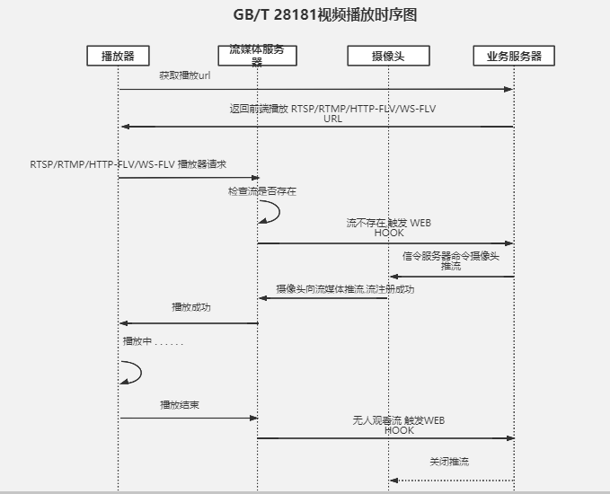

# 国标28181
- [8.1国标28181消息域介绍](#8.1)
- [8.2国标28181注册鉴权](#8.2)
- [8.3SIP的NAT穿透方法浅析](#8.3)
- [8.4国标流程相关](#8.4)
- [8.5国标报警事件通知](#8.5)


## <a id="8.1">8.1国标28181消息域介绍</a>

参考链接：  
1.GB28181入门笔记  
https://blog.csdn.net/sbddbfm/article/details/99095022  

2.视频监控安防平台-GB28181_2016版-注册、心跳、注销    
https://blog.csdn.net/songxiao1988918/article/details/79063692  

### 消息解释
```cpp
事务：使用via域中branch定义一个事务，包含一个请求和多个响应以及最终响应。注：一个请求。    
对话：由头域中call-id，local-tag和remote-tag等参数来标识，一个对话可以包含多个事务。invate是唯一创建一个对话得命令。  
TO：指明请求得接受者，类似电话中被叫
FROM：指明请求得发起者，类似电话中主
register注册from to是一样得表示用户，invite from to代表主叫被叫

Sip 几个重要参数：
1) 如下三个值相同代表同一个dailog（会话）
Call-id      From（tag）       To（tag）
2）branch值相同，代表同一个 transaction(事务) Branch
3）cseq Cseq 其生存域是一个会话。

via是收到请求  回响应的路劲   
一个SIP消息每经过一个Proxy（包括主叫），都会被加上一个Via头域，当消息到达被叫后，Via头域就记录了请求消息经过的完整路径。被 叫将这些Via头域原样copy到响应消息中（包括各Via的参数，以及各Via的顺序），然后下发给第一个Via中的URI，每个Proxy转发响应消 息前都会把第一个Via（也就是它自己添加的Via）删除，然后将消息转发给新的第一个Via中的URI，直到消息到达主叫。   

From: 如果一个SIP消息中没有Contact或者Record-Route头域，那么callee就会根据From头域产生后续的Request。比如：如果Alice打一个电话给Bob，From头域的内容是 From:Alice<sip:alice@example.org>。那么Bob打给Alice时就会使用 sip:alice@example.org作为To头域和Request-URI头域的内容。

Contact: 后续Request将根据Contact头域的内容决定目的地的地址，同时将Contact头域的内容放到Request-URI中。它还可以用来指示没有在Record-Route头域中记录的Proxies的地址。同时它还可以被用在Redirect servers和REGISTER requests 和responses。

Record-Route/Route: Record-Route头域一般是被proxies插入到request中的，这样后续的Request如何有着和前面一样的call-id就会被路由到这些proxies。它也会被User Agent作为发送后续request的依据。这套机制很像source-route，Record-Route头域的信息被复制到Route头域中。并且Request-URI头域会被设置为第一个Route头域的内容。

Via:
Via头域是被服务器插入request中，用来检查路由环的，并且可以使response根据via找到返回的路。它不会对未来的request 或者是response造成影响。

总的来说，如果有Route，request就应该根据Route发送，如果没有就根据Contact头域发送，如果连Contact都没有，就根据From头域发送。

常见消息头：
TO： 格式：TO: 显示名<接收者URI>;tag=n,显示名和tag可选。接收者URI是SIP网络种唯一标识接收终端的标识符。
例：TO: Name<SIP:caller@WORK.COM>;TAG=11111或 TO: sip:caller@work.com
FROM: 给出标识会话发起者的URI。比如：FROM: sip:caller@work.com;tag=hyh8,tag是必需的。
CALL-ID: 用于全局唯一标识正在建立的会话的标识符。 随机数加UAC标识信息。表明不同会话。
CSeq: 用于标识同一会话中不同事务的序号，通常由一个用作序号的整型数和消息类型组成。整个会话操作过程由不同的事务组成，
每一事务所涉及的消息的CSeq序号必须相同。表明同一个会话域。
Via: 为响应消息提供传输路径，当请求消息经过每一跳节点时，每一跳节点都把自身的IP地址信息放入顶层Via中。响应消息则沿着
请求消息记录下的传输路径反向传输，首先移走指明自身IP地址信息的顶层消息头。请求信息链。
```


### 摄像机配置项基本意义
```cpp
本地端口：默认为5060，SIP服务发送命令给摄像机时需要知道摄像机GB28181端口号。
SIP服务器ID:说简单就是服务器的标识，只不过这个标识有一定的要求
SIP服务域：实际就是SIP服务器ID前10位。
SIP服务器地址：SIP服务所在机器的IP地址（如果存在多网卡建议将不用的网卡禁用掉）。
SIP服务器端口：SIP服务Port，其他SIP服务发送命令到此端口与之通信。
```

### 消息体系
GB28181以SIP为基础。它所使用的方法如下：


其中，最重要的方法就是REGISTER，INVITE，和MESSAGE方法了。它们是所有方法中使用频率最高的几种。

在开发和对接过程中，大多数朋友会对REGISTER和INVITE疑问较多。原因是这两个方法内部的字段较多，且设置获取复杂。

而MESSAGE方法并不难，但它所承载的内容却非常多。下面图是MESSAGE方法所携带的消息的体系结构。


### 示范
#### SIP注册
参考链接：    
1.国标GBT28181协议，注册功能服务端与客户端实现代码    
https://blog.csdn.net/pray90/article/details/39319455?ops_request_misc=&request_id=&biz_id=102&utm_term=%E5%9B%BD%E6%A0%8728181&utm_medium=distribute.pc_search_result.none-task-blog-2~all~sobaiduweb~default-4-39319455    

1.uac->uas   
```cpp
REGISTER sip:SIP服务器编码@目的域名或IP地址端口SIP/2.0 
Via: SIP/2.0/UDP 源域名或IP地址端口 
From: <sip:SIP设备编码@源域名>;tag=185326220 
To: <sip:SIP设备编码@源域名> 
Call-ID: ms1214-322164710-681262131542511620107-0@172.18.16.3 
CSeq: 1 REGISTER 
Contact: <sip:SIP设备编码@源IP地址端口> 
Authorization: Capability algorithm="A:RSA/ECB/PKCS1,RSA/CBC/PKCS1;H:SHA1,MD5,SHA256;S:DES/ECB/
PKCS5,DES/CBC/PKCS5,3DES/ECB/PKCS5,3DES/CBC/PKCS5,SCB2" 
Max-Forwards: 70 
Expires: 3600
Content-Length: 0
```


```cpp
解释：
第一行的 REGISTER 表示是一条注册消息。 
Via：是 SIP 的消息路由，如果 SIP 经过好多代理服务器转发，则会有多条 Via 记录。 
To From：用户代理（SIP代理）地址。 
Call-ID：是本次 SIP 会话（Session）的标志。 
CSeq：是一个序号，由于 UDP 是不可靠的协议，在不可靠的网络上可能丢包，所以有些包需要重发，该序号则可以防止重
发引起的消息重复。 
Contact：是 用户代理（SIP代理）的地址和端口。 
Max-forwards：指出消息最多可以经过多少次转发，主要是为了防止产生死循环。 
Expires：是说明本次注册的有效期，单位是秒。
Content-Length：是消息体（Body）的长度，在这里，只有消息头（Header），没有消息体，因此长度为 0 。
```

2.uas->uac
```cpp
SIP/2.0 401 Unauthorized 
To: sip:SIP设备编码@源域名 Content-Length: 0 
CSeq: 1 REGISTER 
Call-ID: ms1214-322164710-681262131542511620107-0@172.18.16.3 
From: <sip:SIP设备编码@源域名>;tag=185326220 
Via: SIP/2.0/UDP源域名或IP地址端口 
WWW-Authenticate: Digest realm="64010000",nonce="6fe9ba44a76be22a"
SIP服务器需要验证SIP代理 的身份才允许注册。在SIP中使用已有的 HTTP 摘要（Digest）方式来认证。401 消息表示未认证
，它是SIP服务器对 aliceSIP代理 的响应。同时，它在本端生成一个认证摘要（WWW-Authenticate），一齐发送给SIP代理。
```

3.uac->uas
```cpp
REGISTER sip: SIP服务器编码@目的域名或IP地址端口 SIP/2.0 
Via: SIP/2.0/UDP 源域名或IP地址端口 
From: <sip:SIP设备编码@源域名>;tag=185326220 
To: <sip:SIP设备编码@源域名> 
Call-ID: ms1214-322164710-681262131542511620107-0@172.18.16.3 
CSeq: 2 REGISTER 
Contact: <sip:SIP设备编码@源IP地址端口> 
Authorization: Digest username="64010000002020000001", realm="64010000", nonce="6fe9ba44a76be22a", 
uri="sip:64010000002000000001@172.18.16.5:5060", response="9625d92d1bddea7a911926e0db054968", algorithm=MD5 
Max-Forwards: 70 
Expires: 3600 
Content-Length: 0

SIP代理 收到带有摘要的 401 后，后新发起注册请求，这一次，加上了根据收到的摘要和它自己的密码生成的认证信息
（Authorization）。并且CSeq 序号变成了 2。
```

4.uas->uac
```cpp
SIP/2.0 200 OK 
To: <sip:SIP设备编码@源域名>;tag=69113a2a 
Contact: sip:SIP设备编码@源IP地址端口 
Content-Length: 0 
CSeq: 2 REGISTER 
Call-ID: ms1214-322164710-681262131542511620107-0@172.18.16.3 
From: <sip:SIP设备编码@源域名>;tag=185326220 
Via: SIP/2.0/UDP源域名或IP地址端口 
Date: 2010-11-02T15:01:26.115 
Expires: 3600

SIP服务器收到带有认证的注册消息后，核实 SIP代理身份，认证通过，回应 200 OK。 如果失败，则回应 403 Forbidden 或其它失败消息，
```

#### 2016版-注册
```cpp
REGISTER sip:34020000002000000001@192.168.1.81:5060 SIP/2.0
Via: SIP/2.0/UDP 192.168.1.93:5060;rport;branch=z9hG4bK-3d09000-23b5dfc-TFyCL5ME
From: <sip:64000000002000000001@192.168.1.93:5060>;tag=pck2i7pI
To: <sip:64000000002000000001@192.168.1.93:5060>
Call-ID: b4359b71-eb2f-b6f4-2fce-8fd47e5888ff@192.168.1.93
CSeq: 5 REGISTER
Contact: <sip:64000000002000000001@192.168.1.93:5060>
Authorization: Digest username="34020000002000000001", realm="3402000000", nonce="bd2e4df9e3d9b280", uri="sip:64000000002000000001@192.168.1.93:5060", response="9c8411f2b96c5aef55eb136ba3f34655", algorithm=MD5
Max-Forwards: 70
User-Agent: iVMS 1.0
Expires: 200
Content-Length: 0

SIP/2.0 401 Unauthorized
To: <sip:64000000002000000001@192.168.1.93:5060>;tag=67239569_53173353_7ce4590f-587d-4d44-9690-96498367c675
Via: SIP/2.0/UDP 192.168.1.93:5060;rport=5060;branch=z9hG4bK-3d09000-23b5dfc-TFyCL5ME;received=192.168.1.93
CSeq: 5 REGISTER
Call-ID: b4359b71-eb2f-b6f4-2fce-8fd47e5888ff@192.168.1.93
From: <sip:64000000002000000001@192.168.1.93:5060>;tag=pck2i7pI
WWW-Authenticate: Digest realm="3402000000",nonce="31ada55697307236"
Content-Length: 0

REGISTER sip:34020000002000000001@192.168.1.81:5060 SIP/2.0
Via: SIP/2.0/UDP 192.168.1.93:5060;rport;branch=z9hG4bK-3d09000-3068be5-lnl05y0C
From: <sip:64000000002000000001@192.168.1.93:5060>;tag=pck2i7pI
To: <sip:64000000002000000001@192.168.1.93:5060>
Call-ID: b4359b71-eb2f-b6f4-2fce-8fd47e5888ff@192.168.1.93
CSeq: 6 REGISTER
Contact: <sip:64000000002000000001@192.168.1.93:5060>
Authorization: Digest username="34020000002000000001", realm="3402000000", nonce="31ada55697307236", uri="sip:64000000002000000001@192.168.1.93:5060", response="3526a5a5dd91a45e19d1e6a65704457f", algorithm=MD5
Max-Forwards: 70
User-Agent: iVMS 1.0
Expires: 200
Content-Length: 0

SIP/2.0 200 OK
To: <sip:64000000002000000001@192.168.1.93:5060>;tag=86156704_53173353_d7fb589f-4357-4fae-ae32-47c38d81fff1
Via: SIP/2.0/UDP 192.168.1.93:5060;rport=5060;branch=z9hG4bK-3d09000-3068be5-lnl05y0C;received=192.168.1.93
CSeq: 6 REGISTER
Call-ID: b4359b71-eb2f-b6f4-2fce-8fd47e5888ff@192.168.1.93
From: <sip:64000000002000000001@192.168.1.93:5060>;tag=pck2i7pI
Contact: <sip:64000000002000000001@192.168.1.93:5060>
Expires: 200
Date: 2017-05-19T18:09:17.033
Content-Length: 0
```

#### 2016版-心跳
```cpp
MESSAGE sip:34020000002000000001@192.168.1.81:5060 SIP/2.0
Via: SIP/2.0/UDP 192.168.1.93:5060;rport;branch=z9hG4bK-3d09000-2a2b21b-nddru7fy
From: <sip:64000000002000000001@192.168.1.93:5060>;tag=UL61Qycy
To: <sip:34020000002000000001@192.168.1.81:5060>
Call-ID: 5be796e4-b5ab-592e-cc13-64f34ea57528@192.168.1.93
CSeq: 35 MESSAGE
Contact: <sip:192.168.1.93:5060>
Content-Type: Application/MANSCDP+xml
Max-Forwards: 70
User-Agent: iVMS 1.0
Content-Length:   151

<?xml version="1.0"?>
<Notify>
<CmdType>Keepalive</CmdType>
<SN>26</SN>
<DeviceID>64000000002000000001</DeviceID>
<Status>OK</Status>
</Notify>
SIP/2.0 200 OK
To: <sip:34020000002000000001@192.168.1.81:5060>;tag=69112542_53173353_89bb4bc2-7f74-42a8-a102-6b6490b6daa2
Via: SIP/2.0/UDP 192.168.1.93:5060;rport=5060;branch=z9hG4bK-3d09000-2a2b21b-nddru7fy;received=192.168.1.93
CSeq: 35 MESSAGE
Call-ID: 5be796e4-b5ab-592e-cc13-64f34ea57528@192.168.1.93
From: <sip:64000000002000000001@192.168.1.93:5060>;tag=UL61Qycy
Content-Length: 0
```


#### 2016版-注销
```cpp
REGISTER sip:34020000002000000001@192.168.1.81:5060 SIP/2.0
Via: SIP/2.0/UDP 192.168.1.93:5060;rport;branch=z9hG4bK-3d09000-23b5dfc-TFyCL5ME
From: <sip:64000000002000000001@192.168.1.93:5060>;tag=pck2i7pI
To: <sip:64000000002000000001@192.168.1.93:5060>
Call-ID: b4359b71-eb2f-b6f4-2fce-8fd47e5888ff@192.168.1.93
CSeq: 5 REGISTER
Contact: <sip:64000000002000000001@192.168.1.93:5060>
Authorization: Digest username="34020000002000000001", realm="3402000000", nonce="bd2e4df9e3d9b280", uri="sip:64000000002000000001@192.168.1.93:5060", response="9c8411f2b96c5aef55eb136ba3f34655", algorithm=MD5
Max-Forwards: 70
User-Agent: iVMS 1.0
Expires: 0
Content-Length: 0

SIP/2.0 401 Unauthorized
To: <sip:64000000002000000001@192.168.1.93:5060>;tag=67239569_53173353_7ce4590f-587d-4d44-9690-96498367c675
Via: SIP/2.0/UDP 192.168.1.93:5060;rport=5060;branch=z9hG4bK-3d09000-23b5dfc-TFyCL5ME;received=192.168.1.93
CSeq: 5 REGISTER
Call-ID: b4359b71-eb2f-b6f4-2fce-8fd47e5888ff@192.168.1.93
From: <sip:64000000002000000001@192.168.1.93:5060>;tag=pck2i7pI
WWW-Authenticate: Digest realm="3402000000",nonce="31ada55697307236"
Content-Length: 0

REGISTER sip:34020000002000000001@192.168.1.81:5060 SIP/2.0
Via: SIP/2.0/UDP 192.168.1.93:5060;rport;branch=z9hG4bK-3d09000-3068be5-lnl05y0C
From: <sip:64000000002000000001@192.168.1.93:5060>;tag=pck2i7pI
To: <sip:64000000002000000001@192.168.1.93:5060>
Call-ID: b4359b71-eb2f-b6f4-2fce-8fd47e5888ff@192.168.1.93
CSeq: 6 REGISTER
Contact: <sip:64000000002000000001@192.168.1.93:5060>
Authorization: Digest username="34020000002000000001", realm="3402000000", nonce="31ada55697307236", uri="sip:64000000002000000001@192.168.1.93:5060", response="3526a5a5dd91a45e19d1e6a65704457f", algorithm=MD5
Max-Forwards: 70
User-Agent: iVMS 1.0
Expires: 0
Content-Length: 0

SIP/2.0 200 OK
To: <sip:64000000002000000001@192.168.1.93:5060>;tag=86156704_53173353_d7fb589f-4357-4fae-ae32-47c38d81fff1
Via: SIP/2.0/UDP 192.168.1.93:5060;rport=5060;branch=z9hG4bK-3d09000-3068be5-lnl05y0C;received=192.168.1.93
CSeq: 6 REGISTER
Call-ID: b4359b71-eb2f-b6f4-2fce-8fd47e5888ff@192.168.1.93
From: <sip:64000000002000000001@192.168.1.93:5060>;tag=pck2i7pI
Contact: <sip:64000000002000000001@192.168.1.93:5060>
Expires: 0
Date: 2017-05-19T18:09:17.033
Content-Length: 0
```

## <a id="8.2">8.2国标28181注册鉴权</a>
参考链接：   
1.GB28181计算注册登陆时的鉴权信息    
https://blog.csdn.net/aflyeaglenku/article/details/78592567    

GB28181中，下级需要向上级进行登录注册，才能开启上下级之间的连接。注册的流程，详见GB28181文档的9.1小节。  
在注册过程中，上级有可能（为什么是“有可能”，后面会说）需要对下级进行鉴权校验。鉴权使用的是HTTP的数字摘要鉴权方法。  

```bash
它的流程是这样的：   
（1）首先上下级之间需要协商好下级所使用的国标id号，以及注册鉴权的密码。  
id号和密码，一般是由上级填写，并告知给下级。  
（2）接下来就是鉴权计算了。所使用的公式是这样的：  
HA1=md5(username:realm:password)  
HA2=md5(Method:Uri)  
RESPONSE=md5(HA1:nonce:HA2)  
（3）计算出RESPONSE后，由下级在第二次REGISTER中携带，并由上级依据同样的步骤和方法独立计算得到RESPONSE2。比较
RESPONSE和RESPONSE2，两者相等则鉴权成功，否则失败。  

其中会涉及到如下几个关键词：
username：即国标id号
realm：通常是id的前10位（参考文档6.1小节）。由上级的401消息携带告知下级。
password：提前配置商定。
Method：REGISTER
Uri：由下级在第二次REGISTER中携带。
nonce：由上级的401消息携带告知下级。

举个例子说明一下：

HA1=md5(username:realm:password)
HA1=md5(11000000003000000001:1100000000:123456)
       =81f021fe3f4876df315d89c82a24cdff    用小写的
        81F021FE3F4876DF315D89C82A24CDFF

HA2=md5(Method:Uri)
HA2=md5(REGISTER:sip:11000000002000000001@192.168.0.112:5060;transport=UDP)
        =160aad37c1bf7fe16ae9cb656ebbf4e4    用小写的
        160AAD37C1BF7FE16AE9CB656EBBF4E4

nonce=13150012922:c44236aa4b0085fd6c5161d73c8e29b3
RESPONSE=md5(HA1:nonce:HA2)
RESPONSE=md5(81f021fe3f4876df315d89c82a24cdff:13150012922:c44236aa4b0085fd6c5161d73c8e29b3:160aad37c1bf7fe16a
             e9cb656ebbf4e4)
        =97d60ab7abb7c59d288223600b9eddfd

前面提到，上级有可能需要对下级进行鉴权校验。之所以是有可能，是因为也可以不必对下级进行鉴权校验。无鉴权的注册流程，
有两种实现方法。
（方法一）相比于GB28181文档的9.1小节的带鉴权的注册流程，少了步骤2和步骤3。即：下级发送REGISTER方法给上级，上级
直接返回200 OK。

（方法二）相比于GB28181文档的9.1小节的带鉴权的注册流程，步骤没有改变，只是在步骤3，不论下级发送上来的RESPONSE消
息是什么，上级都会返回200 OK。
```

## <a id="8.3">8.3SIP的NAT穿透方法浅析</a>
参考链接：   
1.SIP的NAT穿透方法浅析   
https://blog.csdn.net/czc1009/article/details/16968021   

1、SIP协议的NAT有四种模型。
a) Full Cone 完全圆锥体
b) restricted cone 受限制的圆锥体
c) port restricted 端口受限制的圆锥体
d) symmetric 对称的
其中a,b,c 也称作非对称的NAT。

2、SIP终端在NAT后面，其工作有可能出现问题。原因是SIP信令走的路径，和媒体流走的路径不一样。

3、Full Cone 完全圆锥体NAT
因特网上的任何PC，可以发送数据包到IP:port对；而NAT将这个IP:port对（公网上的）映射到内网的IP:port对（私有网络的）。

4、restricted cone 受限制的圆锥体NAT
NAT外面的PC，只有那些内网中已有PC与之联系过的PC，才能通过这个映射进来。例如，我通过内网的一台机器，IP 地址是10.1.1.1:123，与PC(a)联系，则PC(a)也可以通过这个NAT的映射，联系到我。而PC(b)则不行。
10.1.1.1:123 ---NAT ---> 202.70.65.78:10000 ------pc(a)
如果pc(b)也发送数据到202.70.65.78:10000，则不会有数据送到10.1.1.1:123。
补充说明：
如果我也联系过pc(b)，则pc(b)也可以进来了。
10.1.1.1:123 ---NAT ---> 202.70.65.78:10000 ------pc(b)
如果pc(b)也发送数据到202.70.65.78:10000，则数据送到10.1.1.1:123。

5、port restricted 端口受限制的圆锥体NAT
除了4的条件外，即不但要检测pc(a)的源IP地址，还要检测其端口是否与前面也一样。
10.1.1.1:123 --->NAT---->202.70.65.78:10000 -----> pc(a)[213.123.324.34:8000]
这个NAT只会接收从IP地址 213.123.324.34 且端口为 8000来的数据，让进入到10.1.1.1:123。

6、对称的NAT 这是关系描述最简单的一个
10.1.1.1:1000 ----NAT -----> 200.123.123.34:1234 ----pc(a)
10.1.1.1:1000 ----NAT -----> 200.123.123.34:2222----pc(b)
这种NAT的IP:port对，对每个外部的程序，都是不同的。因而每一个外部的程序，都有自己的映射（NAT分配的IP:port对）。而前面的三种，多个外部程序，可能共用一个NAT的IP:port对。

7、RTP的问题
在RTP的消息正文内，有UA能够成功通信所需要的一些信息。这种消息正文，就叫做SDP消息。
问题在于，SIP终端（UA）可能对NAT一无所知。因而在SDP中包含的IP地址，通常使用内部的IP地址，也就是SIP终端知道的IP。这样，当通信的对方想与SIP终端通信时，就查看SDP消息中的IP地址，但是什么也没有得到，因为这里使用的是内部IP地址。
下面举个例子说明
```cpp
INVITE sip:040600@192.168.20.2:5060 SIP/2.0.
Record-Route: <sip:143.248.130.35;ftag=3a7ceb24a6ac50c4;lr=on>.
Via: SIP/2.0/UDP 143.248.130.35;branch=z9hG4bK758e.976609c7.0.
Via: SIP/2.0/UDP
192.168.20.3;rport=1024;received=223.178.140.109;branch=z9hG4bK34efcab2403aa20d.
From: "Iqbal" <sip:040618@sip.dom.com>;tag=3a7ceb24a6ac50c4.
To: <sip:040600@sip.dom.com>.
Contact: <sip:040618@223.178.140.109:1024>.
Supported: replaces.
Call-ID: 7f2c327896a5b0e1@192.168.20.3.
CSeq: 8717 INVITE.
User-Agent: Grandstream HT487 1.0.5.18.
Max-Forwards: 16.
Allow: INVITE,ACK,CANCEL,BYE,NOTIFY,REFER,OPTIONS,INFO,SUBSCRIBE.
Content-Type: application/sdp.
Content-Length: 343.
.
v=0.
o=040618 8000 1 IN IP4 192.168.20.3.
s=SIP Call.
c=IN IP4 192.168.20.3.
t=0 0.
m=audio 38660 RTP/AVP 0 8 4 18 2 15 99.
a=sendrecv.
a=rtpmap:0 PCMU/8000/3.
a=rtpmap:8 PCMA/8000/3.

SIP消息的标题头，类似于邮件的标题头。从后往前看，从From行开始，看到第一个Via行，这是SIP终端自己认为的IP地址，
例如192.168.20.3。但是SIP代理服务器是聪明的，它知道这个消息是从哪里发过来的，它添加了rport和接收到的标志：
Via: SIP/2.0/UDP
192.168.20.3;rport=1024;received=223.178.140.109;branch=z9hG4bK34efcab2403aa20d.
也就是说，SIP代理服务器，知道发消息的SIP终端的公网地址是223.178.140.109:1024。
这样，SIP代理服务器是可以与SIP终端通信的，因为它知道SIP终端的公网地址。
但是，可怜的老式的RTP被阻塞了，因为它的标题头如下：
v=0.
o=040618 8000 1 IN IP4 192.168.20.3.
s=SIP Call.
c=IN IP4 192.168.20.3.
t=0 0.
m=audio 38660 RTP/AVP 0 8 4 18 2 15 99.
a=sendrecv.
a=rtpmap:0 PCMU/8000/3.
a=rtpmap:8 PCMA/8000/3.
SIP终端期望从端口 port m=38660 且IP地址IP c= 192.168.20.3来接收RTP数据，而这个192.168.20.3:38660，就是通信
的对方试图发RTP数据的目的地址。
这就是SIP电话振铃总是能够听到，而接起来却没有声音的原因。
```

8 解决办法 告诉SIP终端，不要如此傻地工作，而要想办法知道NAT分配给自己的端口映射。
并将公网的IP地址：端口放到SDP消息中。这样，SIP终端就问NAT....。或者是问公网的某个服务器，NAT分配给自己的映射是什么。

9 问NAT。 这种办法就是使用UPnP协议，另外去参见UPnP的资料。

10 问公网上的某个服务器。 如STUN服务器。
SIP终端发送一个探测数据包，到公网上的服务器。公网上的服务器会发回数据包，会包含有关NAT的详细信息。有了这些信息，SIP终端就会知道它是否在NAT后面。这种探测方法，可以用于上面4种NAT，都有效。例如SIP终端从10.1.1.1:1000发送一个数据包，则SDP消息中包含的是m=1000 and c=10.1.1.1。但是，如果SIP终端先进行NAT探测，则会知道NAT会分配公网的IP:端口是212.134.123.23:12345。则 SIP终端直接在SDP消息写m=12345，c=212.134.123.23。
产生的问题 因为NAT的端口分配是动态的，因而有可能会改变。这样，在发送了NAT探测消息后，要很快地发送出SIP消息。而且，SIP终端发送数据的端口和接收数据的端口要是一样的。
注意受限制的圆锥体（包括端口受限制的圆锥体）NAT，它不让回来的消息进来，除非SIP终端先发了一个数据包给它。因而，SIP终端需要先发一个数据包给对方。这样以后对方来的数据，就可以进入NAT内部了（不过，不需要为这个操作担心，有办法的）。
上面的办法在对称的NAT后面，不能够工作。因为，对称的NAT，它在分配给SIP终端外部的IP:port时，每次都变化（不同的对方不一样）。也就是SIP终端在探测NAT时，得到的IP:port，与它后来发SIP消息时，分配的IP:port不一样。这样，对方来的语音数据就进不来，因为对方得不到正确的IP:port。

11、上面描述的过程，其实就是采用STUN协议时，解决问题的过程。就是SIP终端向STUN服务器发探测NAT的数据包。

12、对称的NAT 解决办法 就是在公网上放一个中转语音流的服务器。这个中转语音流的服务器有时就是一个Out Bound proxy。注意，这个中转语音流的服务器，可能会成为瓶颈。由于语音要经过中转语音流的服务器，所以路径增长了，音质会变差。所以，对称的NAT，要SIP能够工作，总之是个麻烦。
不过，目前大多数的NAT，都可以做“虚拟服务器的端口转发”，即将SIP工作需要的端口转发到SIP终端上去。如果在NAT设备上，做了“虚拟服务器的端口转发”，则NAT会保留SIP工作需要的端口，专用于SIP终端，这样SIP终端就相当于是在一个Full Cone完全圆锥体的NAT后面，SIP用STUN工作没有问题。SIP终端需要的端口数是这样确定的，一个端口用于SIP信令，比如5060。RTP端口的数量，取决于通话的路数。一路通话需要2个RTP端口。每增加一路通话，则需要多2个端口。
只支持一路通话的SIP话机，需要NAT映射3个端口。
前面三种的NAT，可统称为非对称的NAT。非对称的NAT，都可以用STUN协议穿过NAT。
将对称的NAT，通过端口转发的方式，变为完全圆锥体的NAT，是解决NAT问题的最好办法。首先应当用这种办法来解决。没有办法映射端口，再想其它的办法。

## <a id="8.4">8.4国标流程相关</a>



## <a id="8.5">8.5国标报警事件通知</a>
参考链接：   
1.GB 28181协议解读——报警事件通知     
https://blog.csdn.net/xuejianhui/article/details/99513079    

### 协议内容
报警事件通知和分发使用 IETF RFC 3428 中定义的方法 MESSAGE 传送报警信息。

报警事件通知和分发流程中的请求命令采用 MANSCDP 协议格式定义，报警事件通知命令和响应如下：


### 消息格式
报警事件通知请求：命令类型（CmdType）、 命令序列号(SN)、设备编码（DeviceID）、
报警级别（AlarmPriority）、 报警时间（AlarmTime）、 报警方式（AlarmMethod）、 经度（Longitude）、
纬度（Latitude） 等， 扩展报警类型（AlarmType）、报警类型参数（AlarmTypeParam）。

报警事件通知应答：应包括命令类型（CmdType）、 命令序列号(SN)、 设备编码（DeviceID）、
执行结果（Result）。

```xml
报警通知SDP消息体：
<?xml version="1.0"?>
<Notify>
    <CmdType>Alarm</CmdType>
    <SN>1</SN>
    <DeviceID>64010000001340000101</DeviceID>
    <AlarmPriority>4</AlarmPriority>
    <AlarmTime>2009-12-04T16:23:32</AlarmTime>
    <AlarmMethod>5</AlarmMethod><!-- 5-视频报警 -->
    <Info>
        <AlarmType>6</AlarmType><!-- 6-入侵检测报警 -->
        <AlarmTypeParam>
            <EventType>1</EventType><!-- 1-进入区域 -->
        </AlarmTypeParam>
    </Info>
</Notify>
报警响应SDP消息体：
<?xml version="1.0"?>
<Response>
    <CmdType>Alarm</CmdType>
    <SN>1</SN>
    <DeviceID>64010000001340000101</DeviceID>
    <Result>OK</Result>
</Response>
```

### Notify消息字段含义 

#### Notify消息体：

| 字段名        | 字段值           | 是否必选 | 含义                                                                                                     |
| ---------------- | ------------------- | -------- | ---------------------------------------------------------------------------------------------------------- |
| CmdType          | Alarm               | 必选   | 命令类型：报警通知                                                                                |
| SN               | 十进制整数     | 必选   | 命令序列号                                                                                            |
| DeviceID         | 20位十进制字符串 | 必选   | 设备编号                                                                                               |
| AlarmPriority    | 字符串           | 必选   | 报警级别：1为一级警情， 2为二级警情， 3为三级警情， 4为四级警情                |
| AlarmMethod      | 字符串           | 必选   | 报警方式：1为电话报警， 2为设备报警， 3为短信报警， 4为GPS报警， 5为视频报警， 6为设备故障报警， 7其他报警 |
| AlarmTime        | 2009-12-04T16:23:32 | 必选   | 报警时间                                                                                               |
| AlarmDescription | 字符串           | 可选   | 报警内容描述                                                                                         |
| Longitude        | double              | 可选   | 经度信息                                                                                               |
| Latitude         | double              | 可选   | 纬度信息                                                                                               |
| Info             | XML节点           | 可选   | 扩展Info项携带报警类型、报警类型参数字段                                                 |


#### Notify消息体：

| 二级XML节点 | 三级XML节点 | 字段值 | 是否必选                       | 含义                                                    |
| -------------- | ----------- | ------ | ---------------------------------- | --------------------------------------------------------- |
| AlarmType      |             | 整数 | 可选                             | 报警类型，依赖报警方式，有三种情况。    |
| AlarmTypeParam |             |        | 可选                             | 报警类型扩展参数，在入侵检测报警时可携带<EventType>节点。 |
| EventType      | 整数      | 可选 | 事件类型： 1-进入区域； 2-离开区域 | EventType                                                 |

关于AlarmType字段的含义解释：

报警方式（AlarmMethod）为2时:    
不携带AlarmType为默认的报警设备报警；
携带AlarmType取值及对应报警类型：1-视频丢失报警； 2-设备防拆报警； 3-存储设备磁盘满报警； 4-设备高温报警； 5-设备低温报警。

报警方式（AlarmMethod）为5时:    
取值如下：1-人工视频报警； 2-运动目标检测报警； 3-遗留物检测报警； 4-物体移除检测报警； 5-绊线检测报警；6-入侵检测报警； 7-逆行检测报警； 8-徘徊检测报警； 9-流量统计报警； 10-密度检测报警； 11-视频异常检测报警； 12-快速移动报警。

报警方式（AlarmMethod）为6时:    
取值如下： 1-存储设备磁盘故障报警； 2-存储设备风扇故障报警。

| 字段名 | 字段值        | 是否必选 | 含义                          |
| -------- | ---------------- | -------- | ------------------------------- |
| CmdType  | Alarm            | 必选   | 命令类型：报警通知     |
| SN       | 十进制整数  | 必选   | 命令序列号                 |
| DeviceID | 20位十进制字符串 | 必选   | 设备编号                    |
| Result   | 字符串        | 必选   | 结果类型：OK为成功，ERROR为失败 |

## links
  * [目录](<音视频入门到精通目录.md>)