# WebRTC学习指导
- [1.学习书籍](#1)
- [2.webRTC通信方案SFU和MCU](#2)
- [3.WebRTC服务器技术选型分析](#3)


参考链接：    
1.git书籍汇总     
https://github.com/mobinsheng/books   

# <a id="1">1.学习书籍</a>
```c++
1.《WebRTC权威指南》第三版 中文版 本书适用于初学者，可以快速理解WebRTC相关的理论知识。

本书的作者是 艾伦 B.约翰斯顿 (Alan B.Johnston) 丹尼尔 C.伯内特 (Daniel C.Burnett) 。 第三版展示了如何实现浏览器之间直接发送实时文本的数据通道功能。此外，还涉及 浏览器媒体协商过程中的完整描述(Firefox和Chrome的SDP会话描述)，如何使用 Wireshark来监控WebRTC协议的注意事项以及例子捕捉。另外，支持NAT和防火墙穿透 的TURN服务器也是第三版新加入的内容。


2.《Learning WebRTC》 中文版
对于前端开发人员是一个很好的入门书籍。对相关传输层的开发介绍需要读者参考更多相关资料。

本书作者是丹·里斯蒂克 (Dan Ristic) (作者)。它更像是一份简单的教程，一步步带你开 发一个简单的应用。并且，在书本中还加入了如果做文件共享功能的示例。

3.《Getting Started with webrtc》 英文版
这本书目前只找到了英文版，它是一份很好的入门文档。目前能找到关于该书籍第一章、第二章的中文资料，贴在这里方便大家快速入门:

4.《WebRTC 网页实时通信 开发教程》英文版
书原名《Realtime Communication with WebRTC: Peer-To-Peer in the Browser》。这本 书出版较早了。

5.WebRTC cookbook
这本书中还包含了video filters、UX优化、部分框架集成的内容。

6.一些文章与资源
WebRTC STUN/TURN 服务器的部署：http://piratefsh.github.io/projects/2015/08/27/webrtc-stun-turn-servers.html
WebRTC 入门：https://hpbn.co/webrtc/ 1
STUN服务器与客户端：https://sourceforge.net/projects/stun/ 2
一个 Mac 的 实现：https://github.com/DSPerson/WebRTCMacFramework
WebRtcRoom Server，使用Node js开发，信令服务器使用 Socket.IO，Android，iOS，Html，Server均做了实现：https://github.com/qdgx 3
```

# <a id="2">2.webRTC通信方案SFU和MCU</a>
Webrtc一对一的通信，通常采用的是端到端的方式，那如果多人通信的架构方案一般有这三种常见的方案

## Mesh方案
即多个终端之间两两进行连接，形成一个网状结构。比如 A、B、C 三个终端进行多对多通信，当 A 想要共享媒体（比如音频、视频）时，它需要分别向 B 和 C 发送数据。同样的道理，B 想要共享媒体，就需要分别向 A、C 发送数据，依次类推。这种方案对各终端的带宽要求比较高。

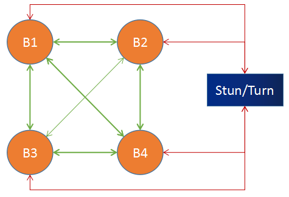

```c++
当某个浏览器想要共享它的音视频流时，它会将共享的媒体流分别发送给其他 3 个浏览器，这样就实现了多人通信。

这种结构的优势有如下：
不需要服务器中转数据，STUN/TUTN 只是负责 NAT 穿越，这样利用现有 WebRTC 通信模型就可以实现，而不需要开发媒体服务器。
充分利用了客户端的带宽资源。
节省了服务器资源，由于服务器带宽往往是专线，价格昂贵，这种方案可以很好地控制成本。

劣势：
共享端共享媒体流的时候，需要给每一个参与人都转发一份媒体流，这样对上行带宽的占用很大。参与人越多，占用的带宽就越大。除此之外，对 CPU、Memory 等资源也是极大的考验。一般来说，客户端的机器资源、带宽资源往往是有限的，资源占用和参与人数是线性相关的。这样导致多人通信的规模非常有限，通过实践来看，这种方案在超过 4 个人时，就会有非常大的问题。
另一方面，在多人通信时，如果有部分人不能实现 NAT 穿越，但还想让这些人与其他人互通，就显得很麻烦，需要做出更多的可靠性设计。
```

## MCU 方案(MultiPoint Control Unit)
MCU 主要的处理逻辑是：接收每个共享端的音视频流，经过解码、与其他解码后的音视频进行混流、重新编码，之后再将混好的音视频流发送给房间里的所有人。

MCU 技术在视频会议领域出现得非常早，目前技术也非常成熟，主要用在硬件视频会议领域。不过我们今天讨论的是软件 MCU，它与硬件 MCU 的模型是一致的，只不过一个是通过硬件实现的，另一个是通过软件实现的罢了。MCU 方案的模型是一个星形结构，如下图所示：

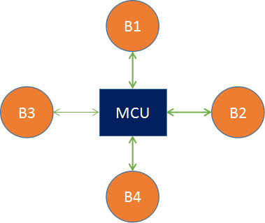

我们来假设一个条件，B1 与 B2 同时共享音视频流，它们首先将流推送给 MCU 服务器，MCU 服务器收到两路流后，分别将两路流进行解码，之后将解码后的两路流进行混流，然后再编码，编码后的流数据再分发给 B3 和 B4。

对于 B1 来说，因为它是其中的一个共享者，所以 MCU 给它推的是没有混合它的共享流的媒体流，在这个例子中就是直接推 B2 的流给它。同理，对于 B2 来说 MCU 给它发的是 B1 的共享流。但如果有更多的人共享音视频流，那情况就更加复杂。

MCU 主要的处理逻辑如下图所示：

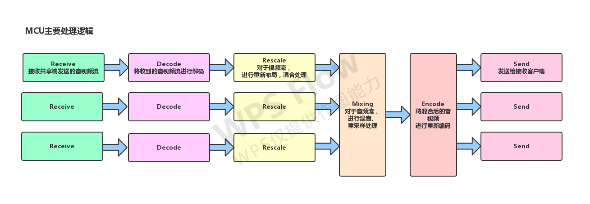

```c++
接收共享端发送的音视频流。
将接收到的音视频流进行解码。
对于视频流，要进行重新布局，混合处理。
对于音频流，要进行混音、重采样处理。
将混合后的音视频进行重新编码。
发送给接收客户端。

优点
技术非常成熟，在硬件视频会议中应用非常广泛
作为音视频网关，通过解码、再编码可以屏蔽不同编解码设备的差异化，满足更多客户的集成需求，提升用户体验和产品竞争力。
将多路视频混合成一路，所有参与人看到的是相同的画面，客户体验非常好。

缺点
重新解码、编码、混流，需要大量的运算，对 CPU 资源的消耗很大。
重新解码、编码、混流还会带来延迟。
MCU服务器的压力较大，需要较高的配置。
```

## SFU(Selective Forwarding Unit)
SFU 像是一个媒体流路由器，接收终端的音视频流，根据需要转发给其他终端。SFU 在音视频会议中应用非常广泛，尤其是 WebRTC 普及以后。支持 WebRTC 多方通信的媒体服务器基本都是 SFU 结构。SFU 的拓扑机构和功能模型如下图：

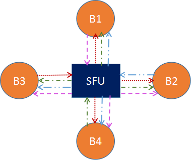

在上图中，B1、B2、B3、B4 分别代表 4 个浏览器，每一个浏览器都会共享一路流发给 SFU，SFU 会将每一路流转发给共享者之外的 3 个浏览器。

下面这张图是从 SFU 服务器的角度展示的功能示意图：

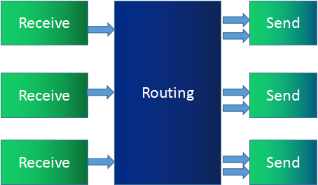

相比 MCU，SFU 在结构上显得简单很多，只是接收流然后转发给其他人。然而，这个简单结构也给音视频传输带来了很多便利。比如，SFU 可以根据终端下行网络状况做一些流控，可以根据当前带宽情况、网络延时情况，选择性地丢弃一些媒体数据，保证通信的连续性。

目前许多 SFU 实现都支持 SVC 模式和 Simulcast 模式，用于适配 WiFi、4G 等不同网络状况，以及 Phone、Pad、PC 等不同终端设备。

```c++
优点
由于是数据包直接转发，不需要编码、解码，对 CPU 资源消耗很小
直接转发也极大地降低了延迟，提高了实时性。
带来了很大的灵活性，能够更好地适应不同的网络状况和终端类型。

缺点
由于是数据包直接转发，参与人观看多路视频的时候可能会出现不同步；相同的视频流，不同的参与人看到的画面也可能不一致。
参与人同时观看多路视频，在多路视频窗口显示、渲染等会带来很多麻烦，尤其对多人实时通信进行录制，多路流也会带来很多回放的困难。总之，整体在通用性、一致性方面比较差。
每个端需要建立一个连接用于上传自己的视频，同时还要有N-1个连接用于下载其它参与方的视频信息，消耗的带宽也是最大的(带宽比较烧钱)
通过上面的分析和比较，相信你已经有了一个大概的认知。如何选择架构方案还需要根据业务场景来判断，没有最好的是只有最适合的。
```

## 1.Simulcast 模式
所谓 Simulcast 模式就是指视频的共享者可以同时向 SFU 发送多路不同分辨率的视频流（一般为三路，如 1080P、720P、360P）。而 SFU 可以将接收到的三路流根据各终端的情况而选择其中某一路发送出去。例如，由于 PC 端网络特别好，给 PC 端发送 1080P 分辨率的视频；而移动网络较差，就给 Phone 发送 360P 分辨率的视频。

Simulcast 模式对移动端的终端类型非常有用，它可以灵活而又智能地适应不同的网络环境。下图就是 Simulcast 模式的示意图：

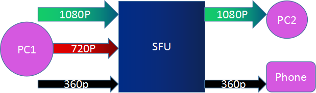

## 2.SVC 模式
SVC 是可伸缩的视频编码模式。与 Simulcast 模式的同时传多路流不同，SVC 模式是在视频编码时做“手脚”。

它在视频编码时将视频分成多层——核心层、中间层和扩展层。上层依赖于底层，而且越上层越清晰，越底层越模糊。在带宽不好的情况下，可以只传输底层，即核心层，在带宽充足的情况下，可以将三层全部传输过去。

同一路流，分成了多具层，核心层，护展层和边缘层，当带宽不足时，由上层逐渐丢弃！

如下图所示，PC1 共享的是一路视频流，编码使用 SVC 分为三层发送给 SFU。SFU 根据接收端的情况，发现 PC2 网络状况不错，于是将 0、1、2 三层都发给 PC2；发现 Phone 网络不好，则只将 0 层发给 Phone。这样就可以适应不同的网络环境和终端类型了。

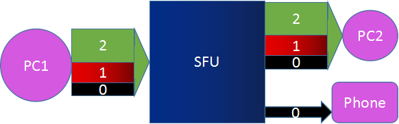

## 总结
1. 由于各方面限制，Mesh 架构在真实的应用场景中几乎没有人使用，一般刚学习 WebRTC 的才会考虑使用这种架构来实现多方通信。（可以简单了解下）
2. MCU 架构是非常成熟的技术，在硬件视频会议中应用非常广泛。像很多做音视频会议的公司之前都会购买一套 MCU 设备，这样一套设备价格不菲，最低都要 50 万，但随着互联网的发展以及音视频技术越来越成熟，硬件 MCU 已经逐步被淘汰，当然现在也还有公司在使用软 MCU，比较有名的开源项目是 FreeSWITCH。
3. SFU 是最近几年流行的新架构，目前 WebRTC 多方通信媒体服务器都是 SFU 架构。从上面的介绍中你也可以了解到 SFU 这种架构非常灵活，性能也非常高，再配上视频的 Simulcast 模式或 SVC 模式，则使它更加如虎添翼，因此SFU模式已经渐渐成为主流了。
4. 目前的实际应用中，使用Simulcast比使用SVC多，webRTC对两种都支持

# <a id="3">3.WebRTC服务器技术选型分析</a>
常见的SFU开源解决方案，当然，你也可以自己实现 SFU 流媒体服务器，但自已实现流媒体服务器困难还是蛮多的，它里面至少要涉及到 DTLS 协议、ICE 协议、SRTP/SRTCP 协议等，光理解这些协议就要花不少的时间，更何况要实现它了。

下面我们就来分析下常见的SFU开源解决方案的优缺点，以便你选择合适的开源解决方案。

## 3.1 Licode
Licode 既可以用作 SFU 类型的流媒体服务器，也可以用作 MCU 类型的流媒体服务器。一般情况下，它都被用于 SFU 类型的流媒体服务器。

Licode 不仅仅是一个流媒体通信服务器，而且还是一个包括了媒体通信层、业务层、用户管理等功能的完整系统，并且该系统还支持分布式部署。

Licode 是由 C++ 和 Node.js 语言实现。其中，媒体通信部分由 C++ 语言实现，而信令控制、用户管理、房间管理用 Node.js 实现。它的源码地址为：https://github.com/lynckia/licode 。下面这张图是 Licode 的整体架构图：

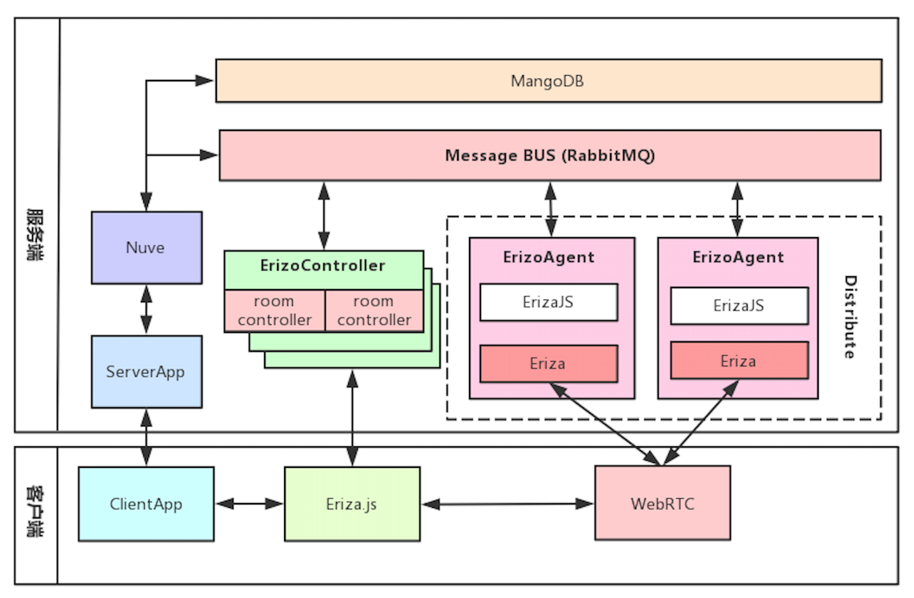

```c++
通过这张图你可以看出，Licode 从功能层面来讲分成三部分，即 Nuve 、ErizoController 和 ErizoAgent 三部分，它们之间通过消
息队列进行通信。

1. Nuve 是一个 Web 服务，用于管理用户、房间、产生 token 以及房间的均衡负载等相关工作。它使用 MangoDB 存储房间和 token 
信息，但不存储用户信息。
2. ErizoController，用于管理控制，信令和非音视频数据都通过它接收。它通过消息队列与 Nuve 进行通信，也就是说 Nuve 可以通
过消息队列对 ErizoController 进行控制。
3. ErizoAgent，用于音视频流媒体数据的传输，可以分布式布署。ErizoAgent 与 ErizoController 的通信也是通过消息队列，信令
消息通过 ErizoController 接收到后，再通过消息队列发给 ErizoAgent，从而实现对 ErizoAgent 进行控制。

Licode 不仅仅是一个 SFU 流媒体服务器，它还包括了与流媒体相关的业务管理系统、信令系统、流媒体服务器以及客户端 SDK 等等，
可以说它是一个比较完善的产品。

如果你使用 Licode 作为流媒体服务器，基本上不需要做二次开发了，所以这样一套系统对于没有音视频积累的公司和个人具有非常大
的诱惑力。目前 Intel CS 项目就是在 Licode 基础上研发出来的，已经为不少公司提供了服务。

官网提供学习demo，和文档。

但 Licode 也有以下一些缺点：
github star 2.4k issue和pr相当活跃，社区采用的是传统提问，及时沟通相对较差
在 Linux 下目前只支持 Ubuntu 14.04 版本，在其他版本上很难编译通过。
Licode 不仅包括了 SFU，而且包括了 MCU，所以它的代码结构比较重，学习和掌握它要花不少的时间。
Licode 的性能一般， 如果你把流媒体服务器的性能排在第一位的话，那么 Licode 就不是特别理想的 SFU 流媒体服务器了。
官方没有看到android和ios的SDK，有其他人实现，但是早已经不更新，如果你要考虑安卓和ios的话，可能自己会下功夫。
```

## 3.2 Janus-gateway
Janus 是一个非常有名的 WebRTC 流媒体服务器，它是以 Linux 风格编写的服务程序，采用 C 语言实现，支持 Linux/MacOS 下编译、部署，但不支持 Windows 环境。

它是一个开源项目，其源码的编译、安装非常简单，只要按 GitHub 上的说明操作即可。源码及编译手册的地址为：https://github.com/meetecho/janus-gateway 。

Janus 的部署也十分简单，具体步骤详见文档，地址为：https://janus.conf.meetecho.com/docs/deploy.html 。

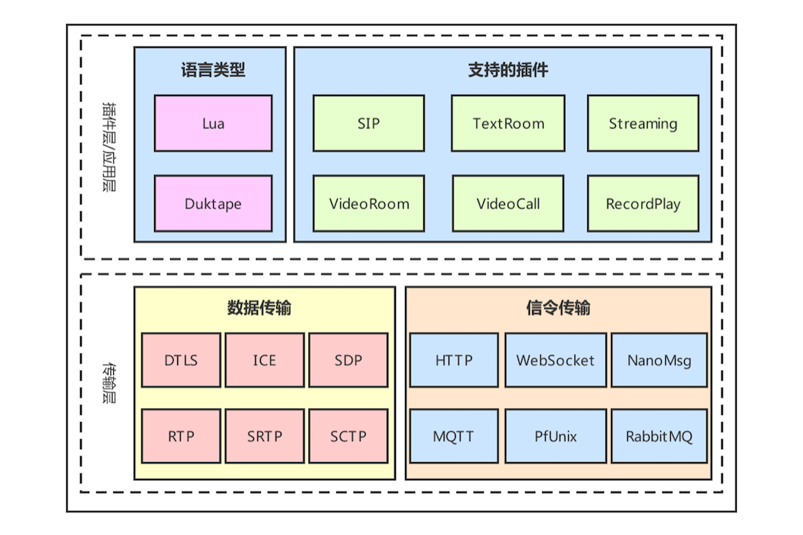

从上面的架构图中，你可以看出 Janus 分为两层，即应用层和传输层。

插件层又称为应用层，每个应用都是一个插件，可以根据用户的需要动态地加载或卸载掉某个应用。插件式架构方案是非常棒的一种设计方案，灵活、易扩展、容错性强，尤其适用于业务比较复杂的业务，但缺点是实现复杂，成本比较高。

在 Janus 中默认支持的插件包括以下几个。
1. SIP：这个插件使得 Janus 成了 SIP 用户的代理，从而允许 WebRTC 终端在 SIP 服务器（如 Asterisk）上注册，并向 SIP 服务器发送或接收音视频流。
2. TextRoom：该插件使用 DataChannel 实现了一个文本聊天室应用。
3. Streaming：它允许 WebRTC 终端观看 / 收听由其他工具生成的预先录制的文件或媒体。
4. VideoRoom：它实现了视频会议的 SFU 服务，实际就是一个音 / 视频路由器。
5. VideoCall：这是一个简单的视频呼叫的应用，允许两个 WebRTC 终端相互通信，它与 WebRTC 官网的例子相似（https://apprtc.appspot.com），不同点是这个插件要经过服务端进行音视频流中转，而 WebRTC 官网的例子走的是 P2P 直连。
6. RecordPlay：该插件有两个功能，一是将发送给 WebRTC 的数据录制下来，二是可以通过 WebRTC 进行回放。

需要注意的是，有些协议是可以通过编译选项来控制是否安装的，也就是说这些协议并不是默认全部安装的。另外，Janus 所有信令的格式都是采用 Json 格式。

缺点：  
1. 架构太复杂，不适合初学者，公司采用的话人力成本和事件成本会比较高
2. janus 底层没有使用 epoll 这类异步I/O事件处理机制，这应该说是它的一大缺陷
3. Janus还使用 glib 库，由于 glib 库对于国内的很多开发同学来说用的比较少，所以会有一定的学习成本

## 3.3 Mediasoup
Mediasoup 是推出时间不长的 WebRTC 流媒体服务器开源库，其地址为：https://github.com/versatica/mediasoup/ 。

Mediasoup 由应用层和数据处理层组成。应用层是通过 Node.js 实现的；数据处理层由 C++ 语言实现，包括 DTLS 协议实现、ICE 协议实现、SRTP/SRTCP 协议实现、路由转发等。

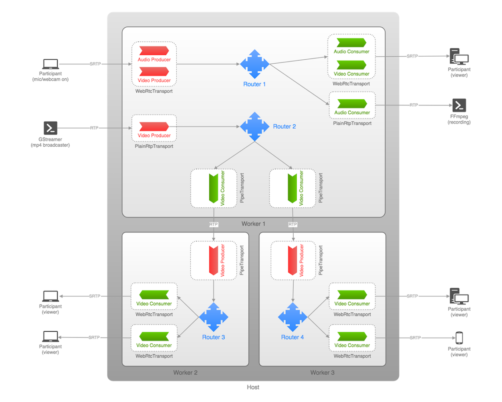

```c++
Mediasoup 把每个实例称为一个 Worker，在 Worker 内部有多个 Router，每个 Router 相当于一个房间。在每个房间里可以有多个用户或称为参与人，每个参与人在 Mediasoup 中由一个 Transport 代理。换句话说，对于房间（Router）来说，Transport 就相当于一个用户。

Transport 有三种类型，即 WebRtcTransport、PlainRtpTransport 和 PipeTransport。

WebRtcTransport 用于与 WebRTC 类型的客户端进行连接，如浏览器。
PlainRtpTransport 用于与传统的 RTP 类型的客户端连接，通过该 Transport 可以播放多媒体文件、FFmpeg 的推流等。
PipeTransport 用于 Router 之间的连接，也就是一个房间中的音视频流通过 PipeTransport 传到另一个房间。
在每个 Transport 中可以包括多个 Producer 和 Consumer。

Producer 表示媒体流的共享者，它又分为两种类型，即音频的共享者和视频的共享者。
Consumer 表示媒体流的消费者，它也分为两种类型，即音频的消费者和视频的消费者。
Mediasoup 的实现逻辑非常清晰，它不关心上层应用该如何做，只关心底层数据的传输，并将它做到极致。

Mediasoup 底层使用 C++ 开发，使用 libuv 作为其异步 IO 事件处理库，所以保证了其性能的高效性。同时它支持了几乎所有 WebRTC 为了实时传输做的各种优化，所以说它是一个特别优秀的 WebRTC SFU 流媒体服务器。

它与 Janus 相比，它更聚焦于数据传输的实时性、高效性、简洁性，而 Janus 相比 Mediasoup 做的事儿更多，架构和逻辑也更加复杂。

对于开发能力比较强的公司来说，根据自己的业务需要在 Mediasoup 上做二次开发也是非常值得推荐的技术方案。

手机端的话需要自己实现安卓和ios的SDK
```

## 3.4 Medooze
Medooze 是一款综合流媒体服务器，它不仅支持 WebRTC 协议栈，还支持很多其他协议，如 RTP、RTMP 等。其源码地址为：https://github.com/medooze/media-server

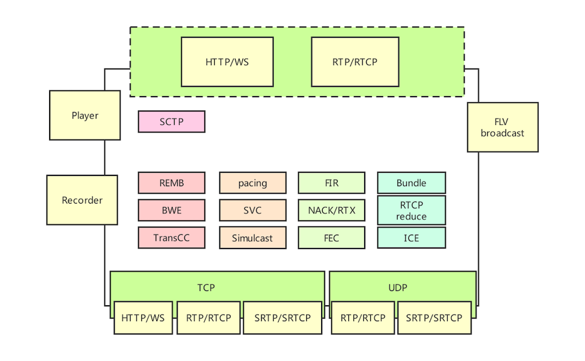

从大的方面来讲，Medooze 支持 RTP/RTCP、SRTP/SRCP 等相关协议，从而可以实现与 WebRTC 终端进行互联。除此之外，Medooze 还可以接入 RTP 流、RTMP 流等，因此你可以使用 GStreamer/FFmpeg 向 Medooze 推流，这样进入到同一个房间的其他 WebRTC 终端就可以看到 / 听到由 GStream/FFmpeg 推送上来的音视频流了。另外，Medooze 还支持录制功能，即上图中的 Recorder 模块的作用，可以通过它将房间内的音视频流录制下来，以便后期回放。

Medooze 的控制逻辑层是通过 Node.js 实现的，Medooze 通过 Node.js 对外提供了完整的控制逻辑操作相关的 API，通过这些 API 你可以很容易的控制 Medooze 的行为了。

Medooze 与 Mediasoup 相比，两者在核心层实现的功能都差不多，但 Medooze 的功能更强大，包括了录制、推 RTMP 流、播放 FLV 文件等相关的操作，而 Mediasoup 则没有这些功能。

Medooze 也有一些缺点，尽管 Medooze 也是 C++ 开发的流媒体服务务器，使用了异步 IO 事件处理机制，但它使用的异步 IO 事件处理的 API 是 poll，poll 在处理异步 IO 事件时，与 Linux 下最强劲的异步 IO 事件 API epoll 相比要逊色不少，这导致它在接收 / 发送音视频包时性能比 Mediasoup 要稍差一些。

## 3.5 jitsi
使用Java构建的服务端，底层也是使用c/c++,使用Java语言所以性能上没有使用c/c++的表现好。

```c
主要模块及实现语言：
Jitsi Video-Bridge (Software video-bridge 实现语言java)
Jitsi Jicofo (Component mandatory for jitsi conference 实现语言java)
Prosody ( XMPP Server 实现语言lua)
Nginx (Web Server)
Jitsi Meet (Web application – to which the end user will interact. 实现语言js)

优点：
github star12.3k，issue和pr处理快
文档齐全
官方提供安卓和ios SDK，也可以自行编译SDK，使用的是React Native
官方提供web端的SDK，并提供使用electron进行桌面端打包（端很齐全）
社区采用论坛方式沟通，活跃较高
社区提供分布式解决方案，但是文档偏少。
每周一维护团队在jitsi上进行视频会议，回答开发者的提问，沟通使用英文，国内时间好像是晚上。
社区版本更新迭代较快
```

## 3.6 Kurento
Kurento和jitsi是一样，持续维护了很多年，经过了时间的检验。不同的是他是使用c++开发，有丰富的文档和示例裤，对于开发者来说非常友好。

## 3.7 pion/webrtc
WebRTC API的Pure Go实现，github上star4.7k，目前用的人较少，不建议使用生成环境，可以学习参考使用，建议长期关注。

## 总结
```c++
对流媒体服务器的选择，没有最好，只有最合适。每个开源实现都有其各自的特点，都可以应用到实际产品中，只不过作为开发人员都有自己独特的技术背景，你需要根据自身特点以及项目特点选一个最合适的。接下来，我就介绍一下我是如何对这些开源项目进行评判和选择的。

团队
在一个团队中肯定会选择一种大家都比较熟悉的语言作为项目开发的语言，所以我们在选择开源项目时，就要选择使用这种语言开发的开源项目。
比如阿里系基本都用 Java 语言进行开发，所以它们在选择开源项目时，基本都会选择 Java 开发的开源项目；
而做音视频流媒体服务的开发人员，为了追求性能，所以一般都选择 C/C++ 语言开发的开源项目。
团队人手如果不充裕的情况下，尽量就不要选择特别复杂的，和文档比较少的开源技术。

适合业务
要充分考虑到你的业务的用户量和用户群体，如果你的业务量很大，需要做分布式，那么你选择的开源技术一定要先去了解下他是否支持分布式部署，分布式部署采用那种方式。单机支持多少并发，最好自己用服务器实际测试下，官方数据会和实际测试数据多少都有出入。
项目功能也需要考虑，比如业务需要录制回放，开源技术并没有这样的功能，需要自己开发，时间成本很高，但选择已经做好录制回放功能的开源技术又不一样了。

二次开发
Licode 是一个完整的系统，支持分布式集群部署，所以系统相对复杂，学习周期要长一些。它可以直接布署在生产环境，但是二次开发的灵活性不够。
Janus-gateway 是一个独立的服务，支持的信令协议很丰富，而且支持插件开发，易扩展，对于 Linux/C 背景的开发者是很不错的选择。
Medooze 和 Mediasoup 都是流媒体服务器库，对于需要将流媒体服务器集成到自己产品中的开发者来说，应该选择它们。

时间成本
公司对于项目的时间计划和成本也要考量，因为使用开源技术或多或少都会遇到坑，有可能一个坑会卡很久，所以使用文档全，社区活跃的开源技术比较好。

无论选择哪种开源技术，前期一定要做好调研，并实际自己搭建使用过在做决定，选择好后，为了弥补技术债，需要去深入开源技术的代码，不然还债的时候很疼苦。
```

# links
  * [目录](<音视频入门到精通目录.md>)