# WebRTC权威指南
- [1.WebRTC介绍](#1)
- [2.WebRTC使用](#2)

参考连接     
1.完整WebRTC技术及应用概要   
https://mp.weixin.qq.com/s/EC8Yd74HEoIO2QxJe8-iNQ   

# <a id="1">1.WebRTC介绍</a>
- [1.1结构介绍](#1.1)
- [1.2WebRTC过程](#1.2)

## <a id="1.1">1.1结构介绍</a>
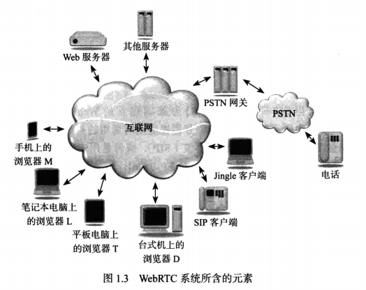

WebRTC三角形：底部媒体流，两侧是信令。     

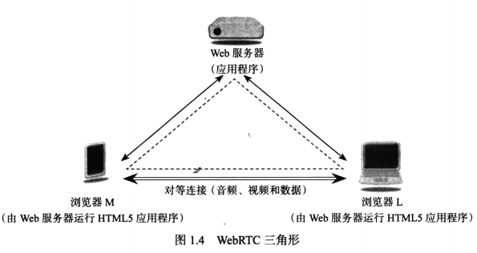

WebRTC梯形：rfc3261，底部媒体流，两侧是信令。     

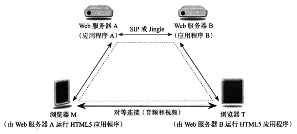

## <a id="1.2">1.2WebRTC过程</a>
### 1.2.1过程

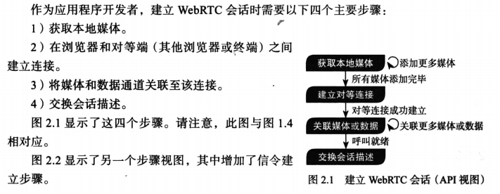

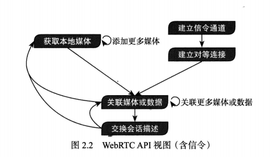

```c++
1.获取本地媒体，getUserMedia()获取Mediastream麦克风摄像机流。
2.建立对等连接，RTCPeerConnection()两个对等端建立连接，不通过服务器两个实体进行通信，唯一输入项配置对象包含ICE打洞、NAT设备、防火墙信息。
3.交换媒体数据，建立连接将本地媒体关联到对等连接，通过对等连接发送到远端浏览器，添加删除媒体请求需要生成RTCSessionDescription对象，利用RTCPeerConnection发送，两个浏览器交换完RTCSessionDescription建立对话，开始打洞协商开始媒体数据。
4.关闭连接。
```

### 1.2.2示列

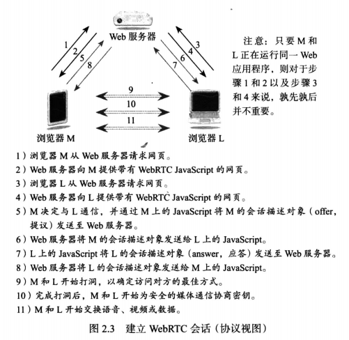

三角形调用流程：  

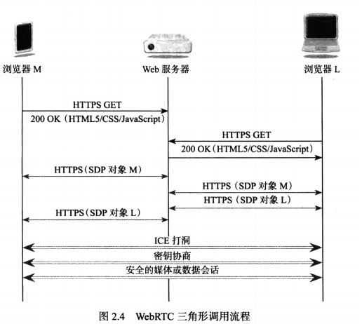

梯形调用流程：  

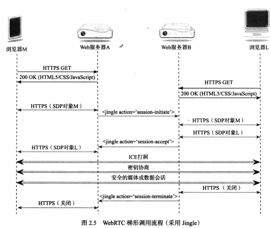

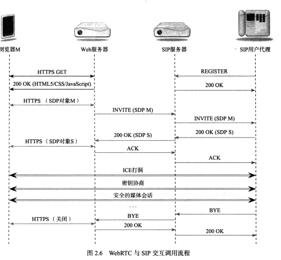

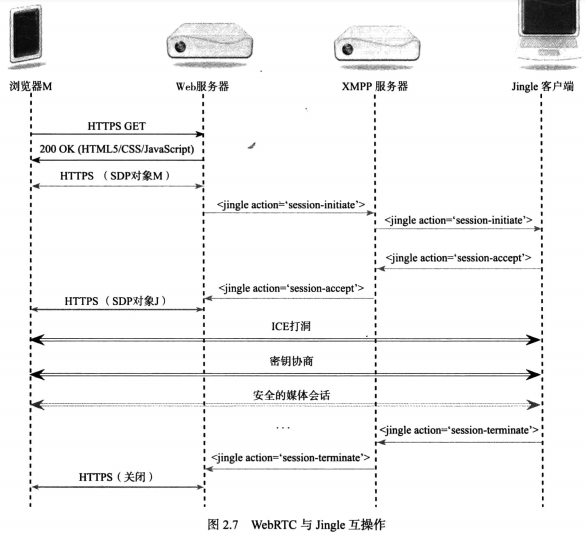

# <a id="2">2.WebRTC使用</a>
- [2.1WebRTC本地媒体](#2.1)
- [2.2WebRTC信令](#2.2)
- [2.3WebRTC对等媒体](#2.2)


## <a id="2.1">2.1WebRTC本地媒体</a>
mediastreamtrack是基本媒体单元，具备mute静音和禁用功能。mediastream是mediastreamtrack对象集合，对象复制，具备addtrack等接口。getUserMedia获取本地媒体。

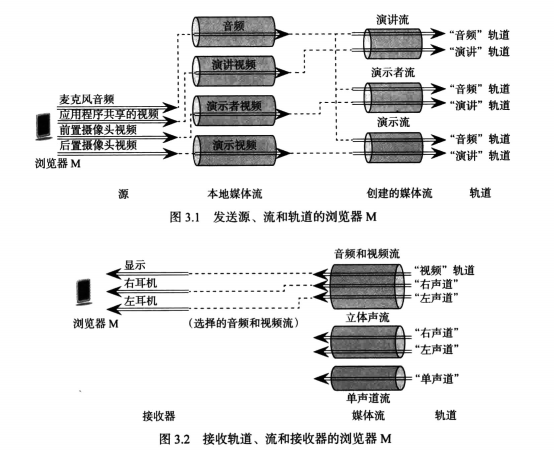

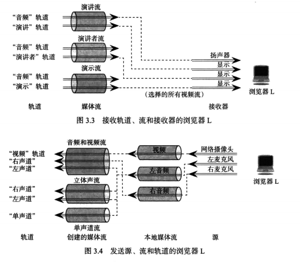

## <a id="2.2">2.2WebRTC信令</a>
三种方式传输WebRTC信令：http websocket 数据通道。建立通信后与其他服务信令通信http跨域cors和webscket，部分web服务和防火墙不支持ws。google应用程序引擎api。

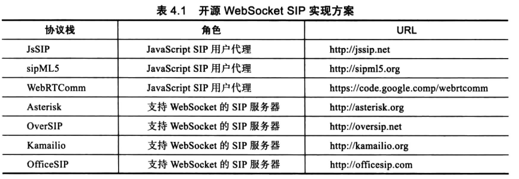

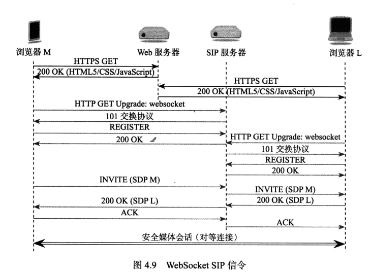

叠加网络p2p。信令方案：http，websocket，websocket+sip，ws+jigle，叠加网络。

## <a id="2.3">2.3WebRTC对等媒体</a>
有跨多个nat对等媒体，有同一个nat，有经过专用turn服务器中继。多个nat需要打洞。同一个nat局域网，也需要打洞建立布延伸nat之外的连接。

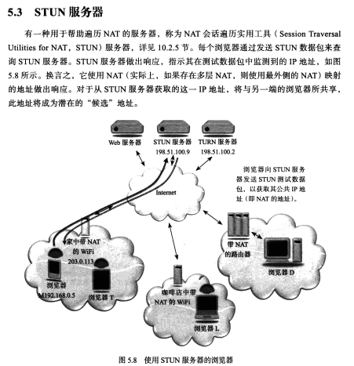

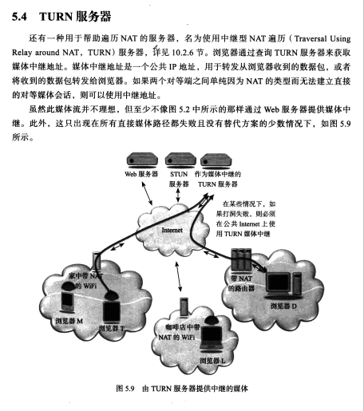

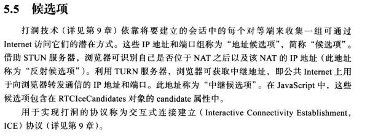

对等媒体需要设置sessiondresprtion设置到本地和对端。rtcpeerconnect创建数据通道datachannel。

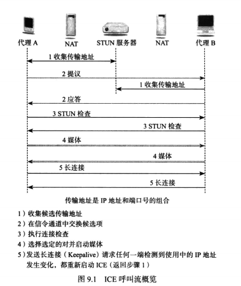

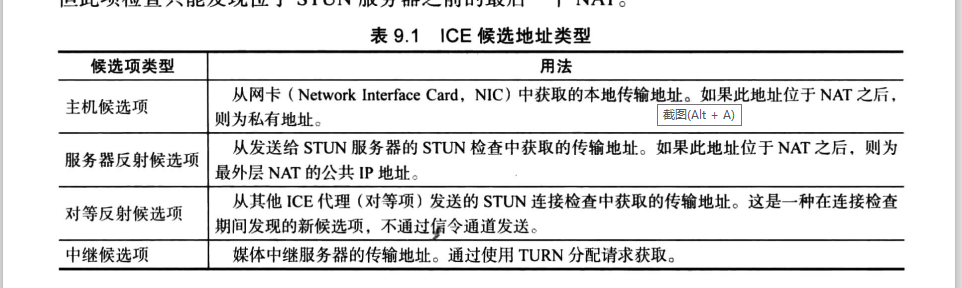

主机候选项优先，然后是反射，最后是中继候选项。

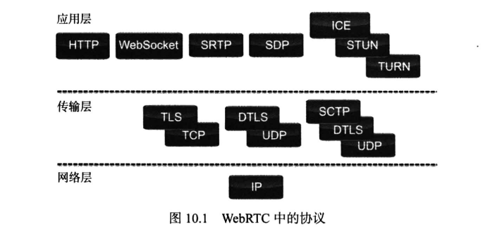

ICE=STUN+TURN+协商机制+协商路径.  

1. 发现收集申请终端信息。收集到终端可通信的地址，终端申请者的类型（host, Reflexive和Relay candidate)。这四个地址分别表示了呼叫方内网地址，呼叫方公网地址，被呼叫方公网地址和relay地址。以下是一个SDP的示例，表示了三个不同的IP地址。

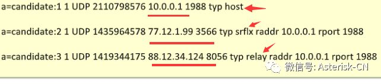

2. 根据优先级对candidate 进行处理，大部分情况下，首先使用Relay candidate
3. 解析candidate信息，发送到对端candidate
4. 对candidate进行配对处理，保证双方匹配
5. 检查配对的candidated的连接性
6. 检查ICE是否可以连接成功，如果成功，则发送确认消息

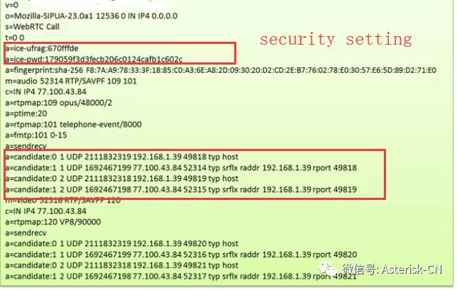


# links
  * [目录](<音视频入门到精通目录.md>)